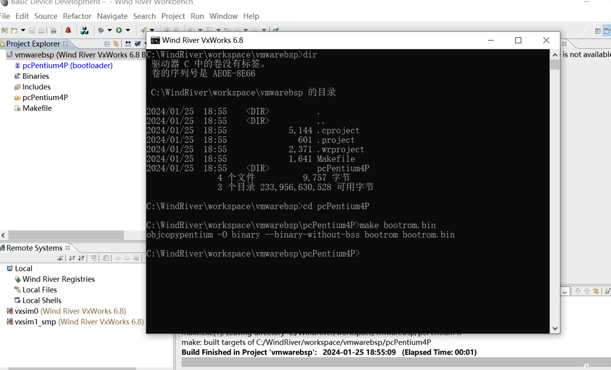

# 从 0 开始学习 VxWorks

[↓↓↓](javascript:)  
  
  
  
[↑↑↑](javascript:)

2024 年 02 月 01 日  
[经验心得](https://paper.seebug.org/category/experience/) · [二进制安全](https://paper.seebug.org/category/bin-security/) · [404 专栏](https://paper.seebug.org/category/404team/)

## 目录

-   [1 环境搭建](#1)
-   [2 安装 Workbench](#2-workbench)
-   [3 编译](#3)
    -   [3.1 编译 BSP](#31-bsp)
    -   [3.2 编译 VxWorks](#32-vxworks)
-   [4 启动](#4)
-   [5 Hello World](#5-hello-world)
-   [6 漏洞复现](#6)
-   [7 总结](#7)
-   [8 参考链接](#8)

**作者：wh0am1i@知道创宇 404 实验室  
时间：2024 年 2 月 1 日**

在开始之前，让我们来回顾一下什么是实时操作系统，什么是分时操作系统。

实时操作系统（Real Time Operating System，简称 RTOS）是指当外界事件或数据产生时，能够接受并以足够快的速度予以处理，其处理的结果又能在规定的时间之内来控制生产过程或对处理系统做出快速响应，调度一切可利用的资源完成实时任，并控制所有实时任务协调一致运行的操作系统。

分时操作系统是一种多任务处理系统，它通过在多个任务之间切换执行，为每个任务分配时间片。其目标是在多个任务之间共享处理器时间，以提高系统的整体吞吐量和资源利用率。

两者的主要区别包括：

1.  **响应时间要求：**
    -   **实时操作系统：** 具有对任务响应时间的硬实时要求，即任务必须在预定的时间内完成。
    -   **分时操作系统：** 没有硬实时要求，任务的完成时间相对灵活，系统主要关注提高整体效率。
2.  **任务切换机制：**
    -   **实时操作系统：** 任务切换是由于时间限制而严格控制的，以确保在规定的时间内完成任务。
    -   **分时操作系统：** 任务切换是基于时间片轮转或优先级调度等策略，以确保公平分配处理器时间。
3.  **应用领域：**
    -   **实时操作系统：** 通常用于需要满足严格时间限制的应用领域，如航空航天系统、医疗设备、工业自动化等。
    -   **分时操作系统：** 通常用于一般计算机系统，如个人计算机、服务器等，其中任务的完成时间相对较为灵活。

VxWorks 是美国风河系统公司 (Wind River Systems) 于 1983 年设计开发的一种嵌入式实时操作系统，是嵌入式开发环境的关键组成部分。

VxWorks 具有良好的持续发展能力、高性能的内核以及友好的用户开发环境，在嵌入式实时操作系统领域占据一席之地。它以其良好的可靠性和实时性被广泛地应用在通信、军事、航空、航天等高精尖技术及实时性要求极高的领域中，如卫星通讯、军事演习、弹道制导、飞机导航等。在美国的 F-16、FA-18 战斗机、B-2 隐形轰炸机和爱国者导弹上，甚至连 1997 年 4 月在火星表面登陆的火星探测器、2008 年 5 月登陆的凤凰号，和 2012 年 8 月登陆的好奇号也都使用到了 VxWorks。

### 1 环境搭建

本文用到的工具和软件如下：

-   Windows 10
-   VMware Workstation 16 Pro
-   Workbench 3.2
-   TFtpd64

### 2 安装 Workbench

打开 ISO 文件，点击 `setup.ext`，开始安装 `Workbench` ，如图 2-1 所示：


图 2-1 VxWorks 安装包图

需要注意的地方有两处，第一处在检查更新的地方，需要禁止更新，如图 2-2 所示：


图 2-2 禁止更新

第二处在加载 license 的地方，如图 2-3 所示：


图 2-3 设置 license 图

其他的按照默认的设置安装，无所任何改动。

### 3 编译

在编译之前需要 VxWorks 的文件进行一些修改，具体可以看[食铁兽](https://feater.top/vxworks/run-vxworks-in-vmware/#%E4%BF%AE%E6%94%B9configh)的文章，笔者这里不再赘述。在修改时，`DEFAULT_BOOT_LINE` 需要根据自己的实际 IP 进行修改。

#### 3.1 编译 BSP

打开 `Wind River WorkBench 3.2` ，选择 `File->New Wind River Workbench Project`，选择操作系统为 `VxWorks 6.8` ,如图 3-1 所示：


图 3-1 新建 BSP 项目图

接着下一步选择 `Build Type` 为 `Boot loader/BSP Project` , 如图 3-2 所示：


图 3-2 Build Type 设置图

下一步新建工程名，最好能表明是 bsp 项目，其他默认即可。接着进入 `Board support package` 设置，笔者这里在之前修改配置文件的时候，将 `pcPentium4` 复制了一份，并命名为 `pcPentium4P` ，此处一定要将 `Copy file to project` 勾选，否则下一个无法完成。读者可根据自己修改的配置进行设置，完整配置如图 3-3 所示：


图 3-3 Board support packet 配置图

最后点击 `Finish` 完成项目创建。接着右键点击项目，选择 `Build Project` 或者 `Rebuild Project` 编译项目。

编译完成之后，右键点击项目，选择 `Open Wind River VxWorks 6.8 Development Shell`，进入命令行编译引导程序。具体步骤：首先 `cd` 进入 `pcPentium4P` ，再执行 `make bootrom.bin`，完成编译。如图 3-4 所示：



图 3-4 编译 BSP 图

进入 `workspace/项目目录/pcPentium4P` 目录中，找到编译好的 `bootrom.bin` 并将 `bootrom.bin` 重命名为 `bootrom.sys` ，至此引导程序编译完成。

#### 3.2 编译 VxWorks

引导编译完成后，接下来开始 VxWorks 固件，选择菜单`File->New->Project`，新建一个 VIP 项目，如图 3-5 所示：


图 3-5 新建 VIP 项目图

下一步工程名，根据自己的喜好来命名，例如：`vmware_vip`。工程名输入完毕后，进入下一步工程设置，需要与之前的 BSP 项目相关联，具体设置如图 3-6 所示：


图 3-6 关联 BSP 图

点击 `Finish` 完成 VIP 项目的创建。为了保证后续的漏洞成功复现，需要在 VxWorks Image 的编译工程的 Kernel Configuration 中添加组件，添加的组件有 `telnet/ftp`，右键选中 `NetWork Components`，选择 `Include` 添加组件，如图 3-7 所示：


图 3-7 添加组件图

组件添加完成后，右键选择项目名，选择 `Build Project` 或者 `Rebuild Project` 进行构建。构建完成后，进入 `workspace/[vip name]/default` 目录下，找到生成的 `VxWorks`，将 `VxWorks` 复制出来，与 `bootrom.sys` 放入同一文件夹中，如图 3-8 所示：


图 3-8 boot 文件夹

### 4 启动

在启动 VxWorks 之前，我们需要了解一下 VxWorks 的启动方式，在 VxWorks 4/5/6 中，需要使用 bootrom 对 VxWorks 进行加载，VxWorks 的 bootrom 存储在闪存中，并在系统复位时开始自动运行。bootrom 会初始化所有运行 VxWorks 所需的硬件，然后加载 VxWorks 系统（通常以 ELF 文件形式存在）到内存并运行它，bootrom 可以从包括可用格式的 flash 存储文件系统加载 VxWorks 镜像，或者通过网络连接从另一台机器上加载。具体方式可以参考[食铁兽](https://fuxifeater.top/vxworks/run-vxworks-in-vmware/#vxworks%E8%99%9A%E6%8B%9F%E6%9C%BA%E5%AE%89%E8%A3%85)的文章。

VxWorks 7 不再支持编译一个旧风格的 bootrom（或者任何形式的只读 VxWorks 镜像），取而代之，硬件必须要安装一个独立的引导加载程序来从复位开始运行并启动系统。

由于 VxWorks 6 的启动方式过于复杂，因此笔者在这里使用了 VxWorks7 的引导方式来启动 VxWorks 6.8。具体操作方式如下：

找到编译好的 VxWorks 7 引导 `vxStage1Boot.bin`，并把 VxWorks 6.8 的镜像重命名为 `bootapp.sys`，将它们放入同一文件夹内，如图 4-1 所示：


图 4-1 启动文件夹示意图

开启 Tftpd，设置如下，如图 4-2、4-3 所示：


图 4-2 TFTP 设置


图 4-3 Ftpd64 DHCP 设置图

创建一个新的虚拟机，虚拟机的参数不重要，重要的是设置**引导方式需要从 PXE 启动**，设置完成后开启虚拟机，等待引导完成，如图 4-4 所示：


图 4-4 等待引导 VxWorks 图

等待片刻后，VxWorks 成功运行，如图 4-5 所示：


图 4-5 成功运行 VxWorks 图

### 5 Hello World

在前面一节中，成功启动 VxWorks 6.8，在这一章节中我们将创建我们的第一个应用。首先打开 `Workbench 3.2` ，新建一个 `DKM(VxWorks Downloadable Kernel Module Project)`项目，如图 5-1 所示：


图 5-1 新建 DKM 项目

点击 `Finish` 完成创建。右键选中 `hellowd` 项目，选择 `New->File`，创建一个 `main.c` 文件，如图 5-2 所示：


图 5-2 新建 main.c 文件

创建完成后在 `main.c` 输入代码如下：

```c
#include <stdio.h>

int main()
{
  printf("Hello, World!");
  return 0;
}
```

右键选中项目，选择 `Build Project` ，编译工程。如果编译中出现弹窗请选择 `Coutinue`。接下来连接远程目标，首先点击 `Workbench` 左上方的 `Run(一个绿色的播放按钮)` ，在弹出的窗口中选择 `VxWorks Kernel Task`，再点击弹窗右上角的新建连接按钮，新建一个链接，创建一个 `Target Server Connection`，具体步骤如 图 5-3 所示：


图 5-3 创建 Target Server Connection 步骤图

新建 `Target Server Connection` 具体设置如下，如图 5-4 所示：


图 5-4 新建 Target Server Connection

点击 `Finish` 完成创建。回到 `Workbench` 界面，需要指定函数入口，如图 5-5 所示：


图 5-5 选择入口函数

随后点击 `Run` ,就可以在 `VxWorks`中看到 `Hello,World!`。至此我们的第一个 VxWorks 应用就成功的运行了。

### 6 漏洞复现

目前公开的 VxWorks 漏洞危害较为严重当属 `URGENT/11`，`URGENT/11` 由 11 个漏洞组成，可分为两类：

-   可 RCE 的六个漏洞
-   可导致拒绝服务、信息泄漏或者某些逻辑缺陷的五个漏洞

本文搭建的系统为 VxWorks 6.8，因此受到了部分漏洞的影响，下面使用 Pocsuite3 对漏洞进行验证。首先扫描一下端口情况，如图 6-1 所示：


图 6-1 nmap 扫描结果

使用 Pocusite3 对 `URGENT/11` 进行检测，结果如图 6-2 所示：


图 6-2 URGENT/11验证结果

既然存在 `URGENT/11` 漏洞，那我们找一个漏洞再验证一下，这里选择 CVE-2019-12255 进行验证，CVE-2019-12255 是一个栈溢出漏洞，可导致 VxWorks 的服务崩溃，如 telnet、ftp 等。验证结果如图 6-3 所示：


图 6-3 CVE-2019-12255 验证结果

笔者在这里选择的 telnet 服务，即 23 端口。VxWorks 崩溃，如图 6-4 所示：


图 6-4 VxWorks 崩溃图

### 7 总结

本次的学习过程比较曲折，主要是在环境搭建方面，国内这一块资料比较少，而 VxWorks 作为业界领先的实时操作系统，还有很多内容需要深入研究。

### 8 参考链接

1.  [VxWorks](https://baike.baidu.com/item/vxworks/340464?fr=ge_ala)
    
2.  [VxWorks 的那些 Console](https://mp.weixin.qq.com/s/Eq4E3yZL7M5HRREqhOmsVA)
    
3.  [如何在 VmWare 上运行 VxWorks 7](https://www.vxworks.net/component/jdownloads/send/3-vxworks/585-how-to-run-vxworks-7-on-vmware?Itemid=0)
    
4.  [VxWorks 环境搭建与学习](https://www.cnblogs.com/yokan/p/16482063.html)
    

- - -

 本文由 Seebug Paper 发布，如需转载请注明来源。本文地址：[https://paper.seebug.org/3114/](https://paper.seebug.org/3114/)

[↓↓↓](https://paper.seebug.org/3113/)  
  
← Google Chrome V8 CVE-2024-0...  
  
[↑↑↑](https://paper.seebug.org/3113/)

[](https://paper.seebug.org/users/author/?nickname=%E7%9F%A5%E9%81%93%E5%88%9B%E5%AE%87404%E5%AE%9E%E9%AA%8C%E5%AE%A4)r

#### [知道创宇 404 实验室](https://paper.seebug.org/users/author/?nickname=%E7%9F%A5%E9%81%93%E5%88%9B%E5%AE%87404%E5%AE%9E%E9%AA%8C%E5%AE%A4)

知道创宇 404 实验室，黑客文化深厚，是网络安全领域享有盛名的团队和中坚力量。团队专注于 Web、IoT、工控、区块链等领域内安全漏洞挖掘、攻防技术的研究工作，曾多次向国内外多家知名厂商如微软、苹果、Adobe、腾讯、阿里、百度等提交漏洞研究成果，并协助修复安全漏洞，多次获得相关致谢。

阅读更多有关[该作者](https://paper.seebug.org/users/author/?nickname=%E7%9F%A5%E9%81%93%E5%88%9B%E5%AE%87404%E5%AE%9E%E9%AA%8C%E5%AE%A4)的文章

  

昵称 

邮箱 


提交评论

\* 注意：请正确填写邮箱，消息将通过邮箱通知！

#### 暂无评论
