# 从 CTF 中学习多媒体安全 - 先知社区

从 CTF 中学习多媒体安全

- - -

在 2022 年的第五空间决赛中出现了一道关于多媒体安全的题目，其中给出了一张如下图所示的由三原色像素组长的图片，需要我们进行解密获取 Flag。题目已经放入附件中

[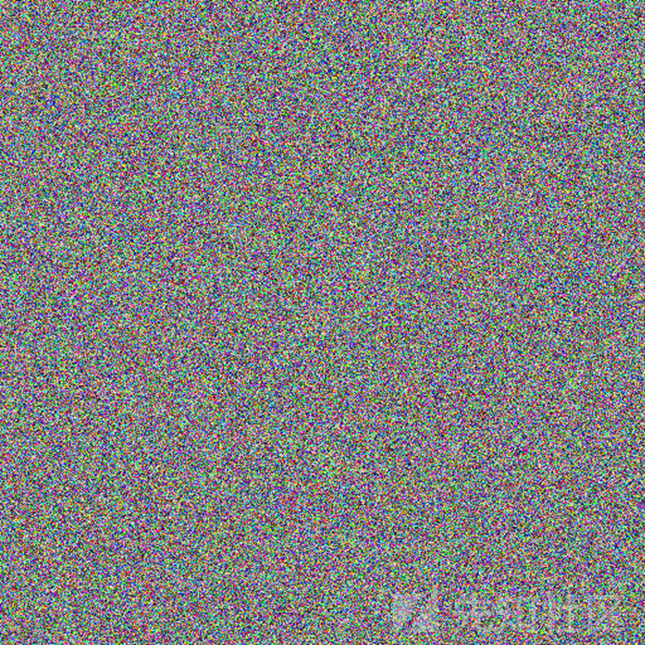](https://xzfile.aliyuncs.com/media/upload/picture/20240301135801-a9aa649e-d790-1.png)

经过资料查询发现一篇论文与本 CTF 题目相似

> 《A color image encryption technique using exclusive-OR with DNA complementary rules based on chaos theory and SHA-2》  
> 中文翻译过来是：基于混沌理论和 SHA-2 的异或与 DNA 互补规则的彩色图像加密技术

[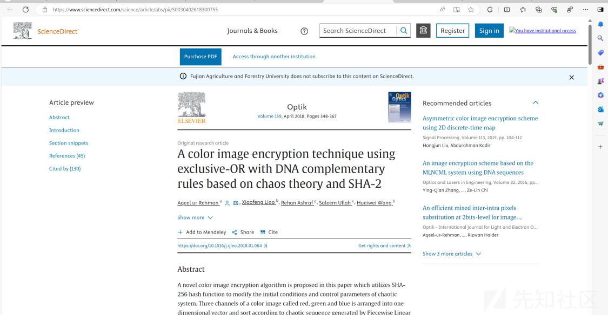](https://xzfile.aliyuncs.com/media/upload/picture/20240301135807-ad696260-d790-1.png)

本篇论文有三个突出的特点  
1.打破彩色图像通道的相关性  
2.提出了一种新的像素级混淆机制  
3.提出了一种新的像素级混淆机制

### 前置知识补充

首先论文的名字中可以看出其中由多种加密方式共同组成因此先理解各种加密方式的原理

#### 混沌算法

> 基于混沌理论，这篇论文打破彩色图像通道的相关性，提出了一种新的像素级混淆机制  
> 混沌映射是生成混沌序列的一种方法，混沌映射可以用于替代伪随机数生成器，生成 0 到 1 之间的混沌数。常见的混沌映射方式有 Logistic 映射、Tent 映射、Circle 映射，而 Piecewise 映射作为混沌映射的典型代表，数学形式简单，具有遍历性和随机性  
> 本文主要使用三种混沌算法：PWLCM 序列排序、Chen 模型、Lorenz 模型

##### 混沌系统：Piecewise 混沌映射/PWLCM 混沌映射

这种算法为分段线性混沌映射：主要根据上一个数值，分段计算下一个值  
公式如下：

[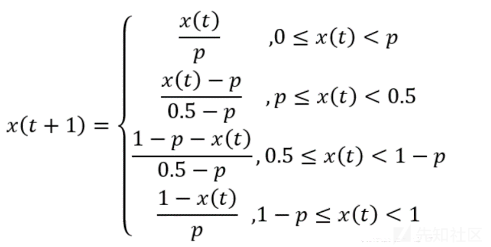](https://xzfile.aliyuncs.com/media/upload/picture/20240301135816-b2723d7c-d790-1.png)

```plain
for i in range(3*w*h):
    if 0 <= a0 < p0:
        a0 = a0/p0
    elif a0 < 0.5:
        a0 = (a0-p0)*(0.5-p0)
    else:
        a0 = 1-a0
    ai.append(a0)
```

##### 混沌系统：Lorenz’s system

> 劳伦兹混沌系统  
> 它是由美国气象学家 Lorenz 在研究大气运动的时候，通过对对流模型简化，只保留三个变量提出的一个完全确定性的三阶自治常微分方程组。其中，三个参数分别为：σ 为普朗特数，ρ 是瑞利数，β 是方向比。在 σ = 10 , ρ = 28 , β = 8 / 3 时系统进入混沌

公式如下：

```plain
def Lorenz(x0, y0, z0, p, q, r, T):
    # 微分迭代步长
    h = 0.01
    x = []
    y = []
    z = []
    for t in range(T):
        xt = x0+h*p*(y0-x0)
        yt = y0+h*(q*x0-y0-x0*z0)
        zt = z0+h*(x0*y0-r*z0)
        # x0、y0、z0统一更新
        x0, y0, z0 = xt, yt, zt
        x.append(x0)
        y.append(y0)
        z.append(z0)
return x, y, z
```

[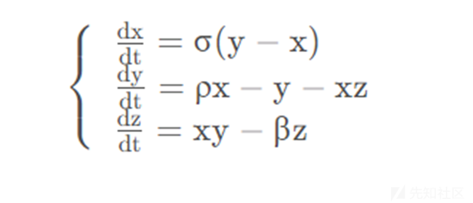](https://xzfile.aliyuncs.com/media/upload/picture/20240301135824-b7465798-d790-1.png)

[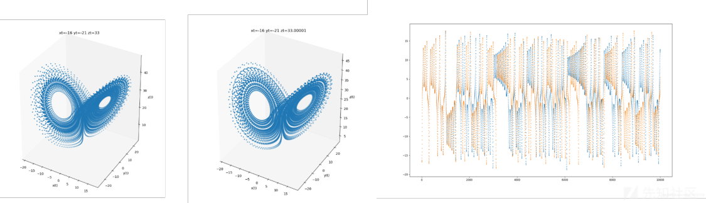](https://xzfile.aliyuncs.com/media/upload/picture/20240301135828-b9e4cca0-d790-1.png)

可以看到原本靠得很近的轨道迅速地分开，最后两条轨道变得毫无关联，这正是动力学系统对初值敏感性的直观表现，因此我们说此系统的这种状态为**混沌态**

##### 混沌系统：Chen’s hyper-chaotic system

> 陈氏混沌系统  
> a, b, c，为系统参数，当 a=35,b=3,c=28 时，陈氏超混沌系统处于混沌状态，可以产生 4 个混沌序列

[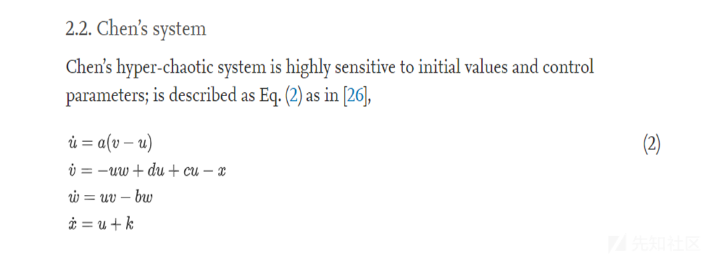](https://xzfile.aliyuncs.com/media/upload/picture/20240301135844-c2e8a3ee-d790-1.png)

代码复现

```plain
def Chen(u0, v0, w0, x0, a, b, c, d, k, T):
    h = 0.001
    u = []
    v = []
    w = []
    x = []
    for t in range(T):
        ut = u0+h*(a*(v0-u0))
        vt = v0+h*(-u0*w0+d*u0+c*u0-x0)
        wt = w0+h*(u0*v0-b*w0)
        xt = u0+k
        # u0、v0、w0,x0统一更新
        u0, v0, w0, x0 = ut, vt, wt, xt
        u.append(u0)
        v.append(v0)
        w.append(w0)
        x.append(x0)
    return u, v, w, x
```

结果如下

[](https://xzfile.aliyuncs.com/media/upload/picture/20240301135902-cdba182a-d790-1.png)

#### DNA 编码

•DNA 有 A、C、G、T  
根据互补规则，每一对 DNA 碱基必须是互补的，就像 A 和 T 是互补的，C 和 G 是互补的。二进制数字系统只由两个数字组成;0 和 1 相互对立或互补。同理，00 和 11 是互补的，01 和 10 也是互补的。  
•DNA 转化规则共有 24 种，但只有 8 种符合所示的 Watson-Crick 互补规则

[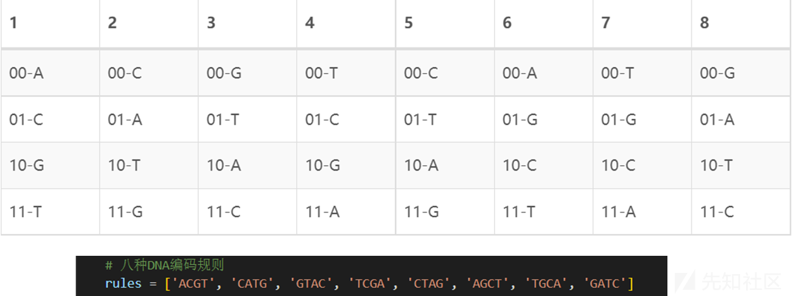](https://xzfile.aliyuncs.com/media/upload/picture/20240301135909-d232c898-d790-1.png)

我们通过一个例子进行解释

> •一幅数字图像的像素强度在 0 到 255 之间，所以将 8 位像素强度值表示到 DNA 域只需要 4 个 DNA 碱基。例如，如果像素强度值为 93，则其二进制值为“01 01 11 01”，93 的 DNA 转化值取决于 DNA 编码规则的选择，如果采用 DNA 编码规则 8，它将成为“AACA”。利用相同的 DNA 规则 8 将“AACA”转换为数字格式，得到相同的强度值 93。但如果我们选择另一条 DNA 规则解码，如规则 1，那么“AACA”将是‘00 00 01 00’，像素的强度值将是 2。这是 DNA 编码/解码方法。

#### DNA 碱基 XOR 运算

首先给出表格，此时可能看着还不能理解

[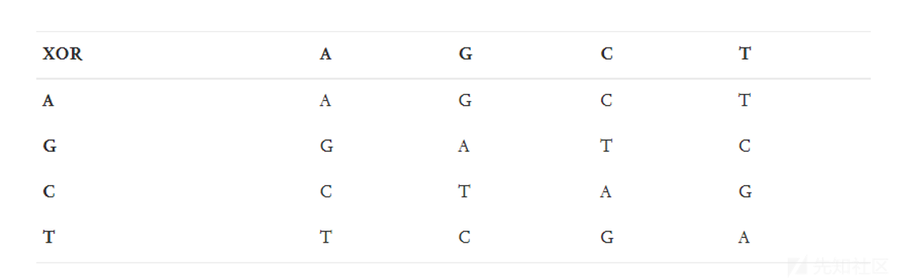](https://xzfile.aliyuncs.com/media/upload/picture/20240301135915-d592d546-d790-1.png)

我们不要把它看为字母直接换成数字，A-00,G-01,C-10,T-11

[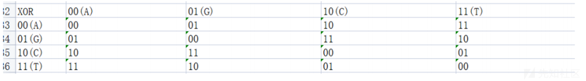](https://xzfile.aliyuncs.com/media/upload/picture/20240301135920-d86e5998-d790-1.png)

##### 编码

对于编码，提取一个像素值点，转换为 8 位的二进制分成四组  
如果此时对于 DNA 编码 rule 为 TCGA，像素值为 155（10011011）  
10->G,01->C,10->G,11->A  
经过编码后得到的值为 GCGA

[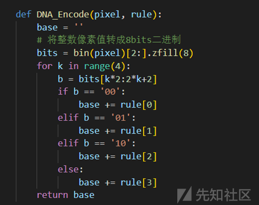](https://xzfile.aliyuncs.com/media/upload/picture/20240301135925-db900bb2-d790-1.png)

##### 解码

同理对于解码，通过 X 混沌序列获得编码规则后，进行解析，例子用上述的  
GCGA 对于编码规则为 TCGA  
G->10,C->01,G->10,A->11  
得解码后的值为 10011011->155

[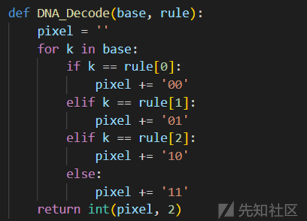](https://xzfile.aliyuncs.com/media/upload/picture/20240301135930-de8205a0-d790-1.png)

```plain
def DNA_Encode(pixel, rule):
    base = ''
    # 将整数像素值转成 8bits 二进制
    bits = bin(pixel)[2:].zfill(8)
    for k in range(4):
        b = bits[k*2:2*k+2]
        if b == '00':
            base += rule[0]
        elif b == '01':
            base += rule[1]
        elif b == '10':
            base += rule[2]
        else:
            base += rule[3]
    return base


def DNA_Decode(base, rule):
    pixel = ''
    for k in base:
        if k == rule[0]:
            pixel += '00'
        elif k == rule[1]:
            pixel += '01'
        elif k == rule[2]:
            pixel += '10'
        else:
            pixel += '11'
    return int(pixel, 2)

def DNA_XOR(base1, base2):
    # 转成整数进行异或
    pixel = DNA_Decode(base1, 'AGCT') ^ DNA_Decode(base2, 'AGCT')
    return DNA_Encode(pixel, 'AGCT')
```

### 论文复现

##### 加密

首先对于加密的流程进行分析

[](https://xzfile.aliyuncs.com/media/upload/picture/20240301135937-e292f988-d790-1.png)

###### 密钥

密钥由以下公式生成  
[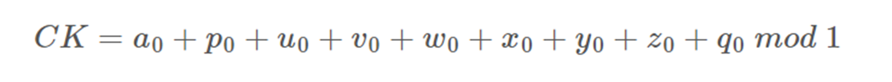](https://cdn.nlark.com/yuque/0/2024/png/29034274/1709180634972-29d3b2d9-a9ba-4e67-9ef1-f6465b45304a.png#averageHue=%23fcfbfa&clientId=ufe32d483-e8e8-4&from=paste&height=113&id=u9bedb8a1&originHeight=169&originWidth=1814&originalType=binary&ratio=1.5&rotation=0&showTitle=false&size=79758&status=done&style=none&taskId=u7c59b8fe-71d0-450f-b3c0-3ed15cfdd50&title=&width=1209.3333333333333)  
SHA-256 生成 256 位的摘要，而不管输入的大小。如果两个输入之间有一个比特的差异，它们的消息摘要将完全不同。因此，这可以用来生成要加密的彩色图像的摘要，然后消息摘要分为两组十六进制值。第一组分为大小相同的 8 块，其值分别为 m\_j,j=1,2....,8。;  
每个块包含 7 个十六进制数字，通过公式将其转换为浮点小数 m\_j 属于（0,0.0156）  
注意：我们输入的密钥并不是最终密钥，密钥主要用于混沌算法的参数

```plain
def Generate_Key(img, key):
    im = cv2.imread(img)[:, :, (2, 1, 0)]
    # 获取图像高宽和通道数
    [h, w, dim] = im.shape
    with open(img, 'rb') as f:
        bytes = f.read()
        img_hash = hashlib.sha256(bytes).hexdigest()
    m = []
    # hash共256位，第一部分占224位
    for i in range(8):
        m.append(int(img_hash[i*7:i*7+7], 16)/2**34)
    # 因此这里我们的第二部分密钥可以直接取后八位十六进制即32位
    d = int(img_hash[-8:], 16)/2**38
    # print(m)
    # print(d)
    ck = 0
    for i in range(len(key)):
        ck += key[i]
    # 生成初始条件
    for i in range(8):
        key[i] = (key[i]+m[i]+ck) % 1
    key[8] = (key[8]+d+ck) % 1
    return key
```

[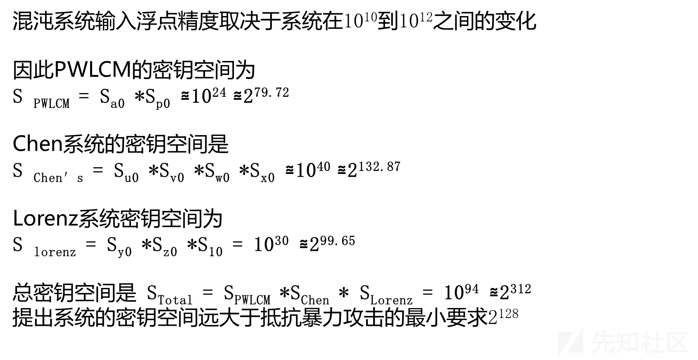](https://xzfile.aliyuncs.com/media/upload/picture/20240301135952-ebfabc9a-d790-1.png)

###### 第一次置乱

本文提出的彩色图像的置乱方法分两次进行  
第一次是采用 PWLCM 迭代 3MN 次得到的混沌序列 A，将图像 I 的所有三个通道合并成一个 1*3MN 大小的一维数组，然后根据混沌序列 A 进行排序。  
1) 先提取图片的 RGB 通道  
2) 图像扁平化为一维  
3) 第一次置乱，PWLCM 迭代 3*w\*h 次，得到迭代序列 ai  
4) 根据 ai 排序，得到排序后的像素列表  
5) 分成 R、G、B 三个通道。此时知识名称叫 R、G、B，划分的依据为 1-wh,wh-2wh,2wh-3wh

```plain
# 第一次置乱
# PWLCM 迭代 3*w*h 次，得到迭代序列 ai
ai = []
for i in range(3*w*h):
    if 0 <= a0 < p0:
        a0 = a0/p0
    elif a0 < 0.5:
        a0 = (a0-p0)*(0.5-p0)
    else:
        a0 = 1-a0
    ai.append(a0)
# 打包
dic = list(zip(ai, pixels))
# 根据 ai 排序
dic.sort(key=lambda x: x[0])
# 得到排序后的像素列表
pixels = list(list(zip(*dic))[1])
# 分成 R、G、B 三个通道
R = pixels[:w*h]
G = pixels[w*h:2*w*h]
B = pixels[2*w*h:]
```

###### 第二次置乱

•在第一次置乱的基础上  
•对于 R、G、B 三个分组根据 Lorenz 系统生成大小为 t+WH 的三个伪随机序列 Y、Z、Q 去混淆三个通道的像素。

```plain
# 第二次置乱
# Lorenz 生成三个序列 Y,Z,Q
t = 100
f = 10
r = 28
g = 8/3
# 调用 Lorenz 模型函数
Y, Z, Q = Lorenz(y0, z0, q0, f, r, g, t+w*h)
# 丢弃序列前 t 个值
Y = Y[t:]
Z = Z[t:]
Q = Q[t:]
# 分别在 R、G、B 三个通道进行排序
Y_R = list(zip(Y, R))
# 根据序列 Y 排序
Y_R.sort(key=lambda x: x[0])
# 得到排序后的像素列表
R = list(list(zip(*Y_R))[1])
Z_G = list(zip(Z, G))
# 根据序列 Z 排序
Z_G.sort(key=lambda x: x[0])
# 得到排序后的像素列表
G = list(list(zip(*Z_G))[1])
Q_B = list(zip(Q, B))
# 根据序列 Q 排序
Q_B.sort(key=lambda x: x[0])
# 得到排序后的像素列表
B = list(list(zip(*Q_B))[1])

# 得到重新排列后的 R、G、B 颜色分量
```

###### 混淆/扩散

对于第二次置乱后的 R、G、B 通道  
1) 对于各个通过循环 WH 次  
2) 通过 CHEN 混沌系统，产生的 U,V,W,X  
3)U 伪随机混沌序列分为三组，每一组对应 R、G、B  
用于选择 DNA 编码规则  
4)V,W 伪随机混沌序列用于产生编码对应的起始位置和迭代的次数  
5)X 伪随机混沌序列用于选择解码规则  
假设红通道的一个像素由 DNA 碱基{A, C, T, T}组成，start\_R={4}，times\_R={6}，则{A, C, T，T}将与规则 GTAC 异或，然后是 ACGT, TCGA, CATG, AGCT 和 GATC

[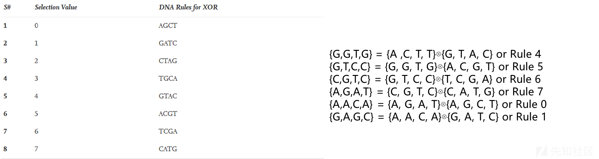](https://xzfile.aliyuncs.com/media/upload/picture/20240301140002-f19797f4-d790-1.png)

###### DNA 编码

在前置知识中我们讲解了 DNA 编码的原理，现在我们需要进行代码的实现

```plain
# DNA 编码
    # Hyper Chaos Chen系统控制参数
    a = 36
    b = 3
    c = 28
    d = 16
    k = 0.2
    t = 100
    U, V, W, X = Chen(u0, v0, w0, x0, a, b, c, d, k, t+3*w*h)
    # U适用于选择编码规则
    U = U[t:]
    # 用于选择start_R
    V = V[t:]
    # 用于选择迭代次数
    W = W[t:]
    #
    X = X[t:]
    for i in range(3*w*h):
        rule = 'ACGT'
        if(int(U[i] % 1/0.05) in [0, 4, 8, 10, 19]):
            # 采用  AGCT
            rule = 'AGCT'
        elif(int(U[i] % 1/0.05) in [1, 6, 12, 14, 17]):
            # 编码规则ACGT
            rule = 'ACGT'
        elif(int(U[i] % 1/0.05) in [2, 7, 11, 13, 16]):
            rule = 'GATC'
        elif(int(U[i] % 1/0.05) in [3, 5, 9, 15, 18]):
            rule = 'CATG'
        if(i/(w*h) < 1):
            R[i] = DNA_Encode(R[i], rule)
        elif(i/(w*h) < 2):
            G[i-w*h] = DNA_Encode(G[i-w*h], rule)
        else:
            B[i-2*w*h] = DNA_Encode(B[i-2*w*h], rule)

    start = []
    times = []
    for i in V:
        start.append(int(i*pow(10, 12)) % 8)
    for i in W:
        times.append(int(i*pow(10, 12)) % 8)

    startR = start[:w*h]
    startG = start[w*h:2*w*h]
    startB = start[2*w*h:]

    timesR = times[:w*h]
    timesG = times[w*h:2*w*h]
    timesB = times[2*w*h:]
```

###### DNA 迭代异或

```plain
# 八种 DNA 编码规则
    rules = ['ACGT', 'CATG', 'GTAC', 'TCGA', 'CTAG', 'AGCT', 'TGCA', 'GATC']
    for i in range(w*h):
        # 起始规则位置
        s = startR[i]
        for j in range(timesR[i]):
            R[i] = DNA_XOR(R[i], rules[s])
            s = (s+1) % 8

    for i in range(w*h):
        # 起始规则位置
        s = startG[i]
        for j in range(timesG[i]):
            G[i] = DNA_XOR(G[i], rules[s])
            s = (s+1) % 8

    for i in range(w*h):
        # 起始规则位置
        s = startB[i]
        for j in range(timesB[i]):
            B[i] = DNA_XOR(B[i], rules[s])
            s = (s+1) % 8
```

###### DNA 解码

```plain
# DNA 解码
    for i in range(3*w*h):
        rule = 'ACGT'
        if(int(X[i] % 1/0.05) in [0, 4, 8, 10, 19]):
            # 采用解码规则GTAC
            rule = 'GTAC'
        elif(int(X[i] % 1/0.05) in [1, 6, 12, 14, 17]):
            # 解码规则TGCA
            rule = 'TGCA'
        elif(int(X[i] % 1/0.05) in [2, 7, 11, 13, 16]):
            rule = 'CTAG'
        elif(int(X[i] % 1/0.05) in [3, 5, 9, 15, 18]):
            rule = 'TCGA'
        if(i/(w*h) < 1):
            R[i] = DNA_Decode(R[i], rule)
        elif(i/(w*h) < 2):
            G[i-w*h] = DNA_Decode(G[i-w*h], rule)
        else:
            B[i-2*w*h] = DNA_Decode(B[i-2*w*h], rule)

    # 合并R、G、B三个通道得到加密彩色图像
    encrypt_img = np.array((R+G+B)).reshape((512, 512, 3), order='C')
    return encrypt_img
```

最后结合三个解码通道得到加密彩色图像；

[](https://xzfile.aliyuncs.com/media/upload/picture/20240301140013-f8225d3e-d790-1.png)

##### 解密

图像解密步骤，通过加密过程来逆向分析

> 1）先读取加密图片，通过密钥获得的 CHEN 混沌模型，获得迭代次数和编码规则  
> 2）获得的三组数据在进行混沌算法的排序（两次置乱）

[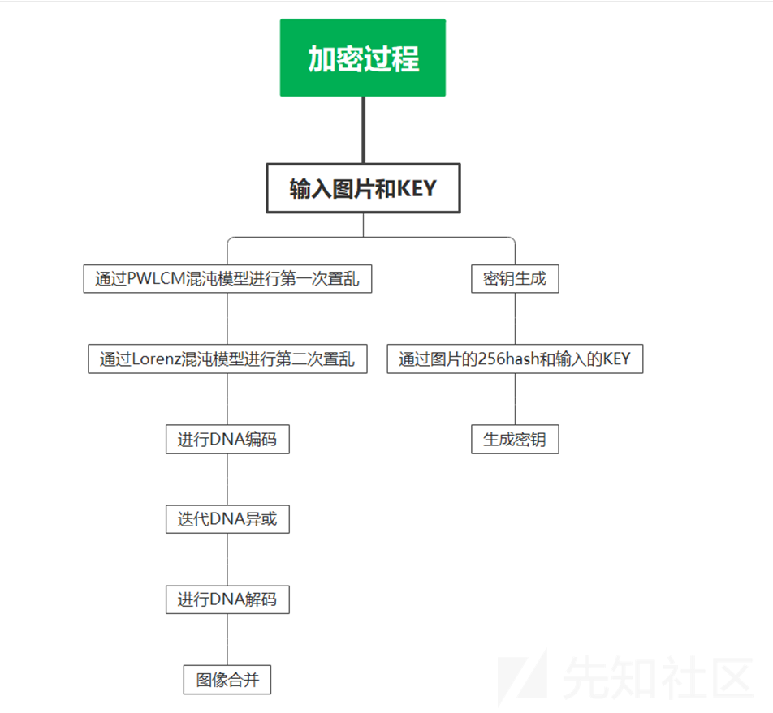](https://xzfile.aliyuncs.com/media/upload/picture/20240301140018-fb1c8ec4-d790-1.png)

###### 解码

1）先读取加密图片，通过密钥获得的 CHEN 混沌模型，获得迭代次数和编码规则  
对于编码规则的逆向迭代  
第一次迭代的 rules = (startR\[i\]+timesR\[i\]-1) % 8  
接下来每次迭代 rules = rules-1 % 8  
2）获得的三组数据在进行混沌算法的排序（两次置乱)

[](https://xzfile.aliyuncs.com/media/upload/picture/20240301140030-02a06f30-d791-1.png)

###### 逆运算

密码学的安全性，密钥安全而非密码安全

[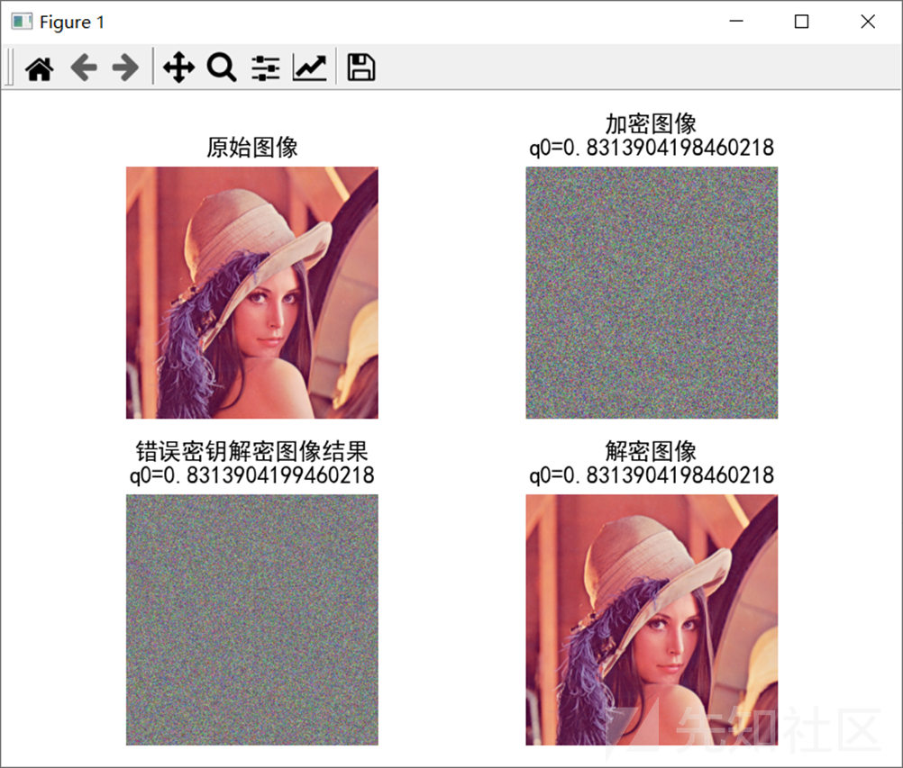](https://xzfile.aliyuncs.com/media/upload/picture/20240301140035-0522f94e-d791-1.png)

最后结果

[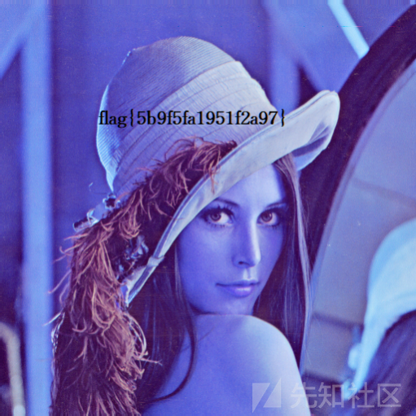](https://xzfile.aliyuncs.com/media/upload/picture/20240301140041-08c455b6-d791-1.png)

encryptflag.zip (0.957 MB) [下载附件](https://xzfile.aliyuncs.com/upload/affix/20240229132519-ed7309fc-d6c2-1.zip)

encryptflag.zip (0.957 MB) [下载附件](https://xzfile.aliyuncs.com/upload/affix/20240301140100-1484cebc-d791-1.zip)
