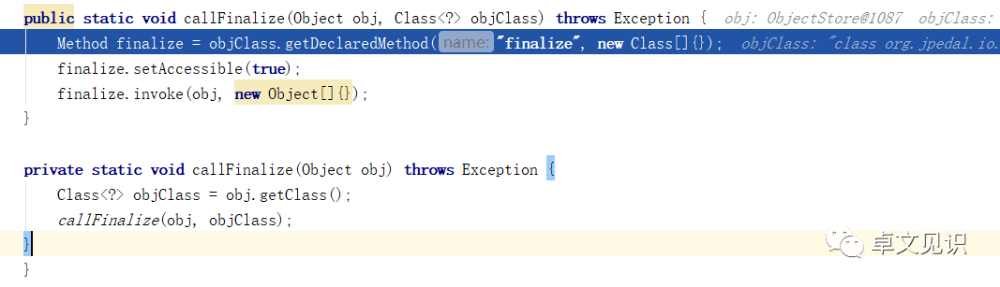
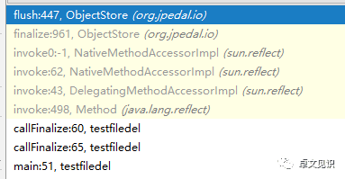
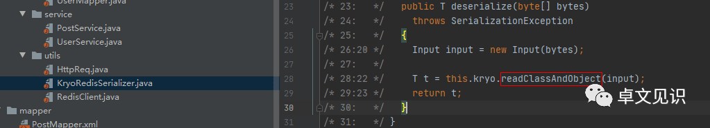

# 从 Kryo 反序列化到 Marshalsec 框架到 CVE 挖掘

发布于 2020-05-07 15:12:23

2K0

举报

文章被收录于专栏：[卓文见识](https://cloud.tencent.com/developer/column/81357)

#### **一、关于 Kryo**

Kryo 是一个快速序列化/反序列化工具，其使用了字节码生成机制。Kryo 序列化出来的结果，是其自定义的、独有的一种格式，不再是 JSON 或者其他现有的通用格式；而且，其序列化出来的结果是二进制的（即 byte\[\]；而 JSON 本质上是字符串 String），序列化、反序列化时的速度也更快。

很多大型软件都使用了这个库：


其相对于其他反序列化类的特点是可以使用它来序列化或反序列化任何 Java 类型，而不需要实现 Serializable。

#### **二、Kryo 的使用**

Kryo 序列化使用 kryo.writeObject(output) 方法，反序列化使用 kryo.readObject(input) 或

kryo.readClassAndObject(input)，此外还支持替换策略 StdInstantiatorStrategy，写个 Demo：


可以看到 Kryo 的反序列化速度极快。

#### **三、反序列化漏洞**

能搜索到的 Kryo 反序列化漏洞资料较少，只有 marshalsec 的 pdf 文件这样一段介绍：


翻译过来如下，Kryo 有两种反序列化漏洞：Kryo 原生和替换策略 StdInstantiatorStrategy，其对应的 gadgets 也不同，此外还存在一些 finalize 的附加危害（后反序列化漏洞）：


#### **四、从 marshalsec 到漏洞复现**

这里直接拿 marshalsec 的代码讲解漏洞原理及利用链，可以从 github 上直接下载工程文件到本地编译使用：

```javascript
https://github.com/mbechler/marshalsec
```

工程目录结构较简单，marshalsec 目录下的是模拟各种反序列化包的使用场景，如 Kryo.java，可见其继承 MarshallerBase 并实现了 SpringAbstractBeanFactoryPointcutAdvisor 和 CommonsBeanutils，后者就是我们可使用的 gadget：


这里重点在 unmarshal 方法里对输入 in 进行 readClassAndObject 反序列化操作，main 方法执行 run 方法，跟进这个 run 方法，来到其继承的类 MarshallerBase，这里对参数 args 进行校验，分别是我们在 jar 包里使用的\[-a\] \[-v\] \[-t\]：


指定后最终在 test 方法里调用特定 gadget 进行攻击：


而测试类最终也是走到这里，调用对应的 unmarshal 方法，从而完成整个调用链：


SpringAbstractBeanFactoryPointcutAdvisor 为例具体攻击链如下：


关键点在于 Kryo 将数据反序列化为对象时，在对 Map 类的数据进行操作时调用了 HashMap.put() 方法，而后调用 DefaultBeanFactoryPointcutAdvisor 的 equals 方法，跟进 getAdice 中的 this.beanFactory.getBean，参数为 this.adviceBeanName，其值为 ldap://x.x.x.x:1389/obj（攻击者可控），getBean 方法接着调用 this.doGetSingleton 方法，doGetSingleton 中调用了 JndiLocatorSupport.lookup 方法，最终利用 JNDI 进行 RCE。

另外需注意的是 payload 中将 SimpleJndiBeanFactory 中的 logger 设置为 NoOpLog 而不是使用原来的 SLF4JLog，是因为 Kryo 需要序列化的类有一个无参数的构造函数，只有 NoOpLog 符合这一点。


CommonsBeanutils 的调用链也类似，参照 Xstream 的调用链。

#### **五、防护手段**

1）结合业务场景尽量使用 kryo.readObject 而不是 kryo.readClassAndObject；

2）通用方法：反序列化类设置白名单。

#### **六、后反序列化**

这里聊一下上面提到的后反序列化，可以参考这篇：

https://www.contrastsecurity.com/security-influencers/serialization-must-die-act-1-kryo-serialization

或者这篇：

https://paper.seebug.org/1133/

研究了一下，比较有意思，之前关注点都集中在反序列化过程中的触发点而忽略了反序列化之后的攻击面，主要是 tostring 方法，如 IDEA：


还有 finalize 方法，其作用一般是用来做序列化之后的资源回收，如 org.jpedal.io.ObjectStore 类中的 finalize 方法：


可见其调用了 flush 方法，接着根据 imagesOnDiskAsBytes 中包含的文件路径依次删除。我们可以通过以下代码，强制其 finalize：


从而实现删除任意文件的效果：



调用链如下：



除此之外还有关闭任意文件、内存损坏、绕过反序列化黑名单等思路，有兴趣可以继续研究。

#### **七、扩展：CTF+CVE**

1）从 Kryo 反序列化到 TCTF：

```javascript
https://github.com/Tom4t0/My-CTF-Challenges/tree/master/tctf2018_finals
```



2）从 marshalsec 到 CVE：

研究一下 Marshalsec 各种 pop 链，或许可以获得一些刷 CVE 的新思路。

本文参与 [腾讯云自媒体分享计划](https://cloud.tencent.com/developer/support-plan)，分享自微信公众号。

原始发表：2020-04-28，如有侵权请联系 [cloudcommunity@tencent.com](mailto:cloudcommunity@tencent.com) 删除

[文件存储](https://cloud.tencent.com/developer/tag/10364)

[安全](https://cloud.tencent.com/developer/tag/10799)

[https](https://cloud.tencent.com/developer/tag/10813)

[json](https://cloud.tencent.com/developer/tag/10207)

[spring](https://cloud.tencent.com/developer/tag/10323)
