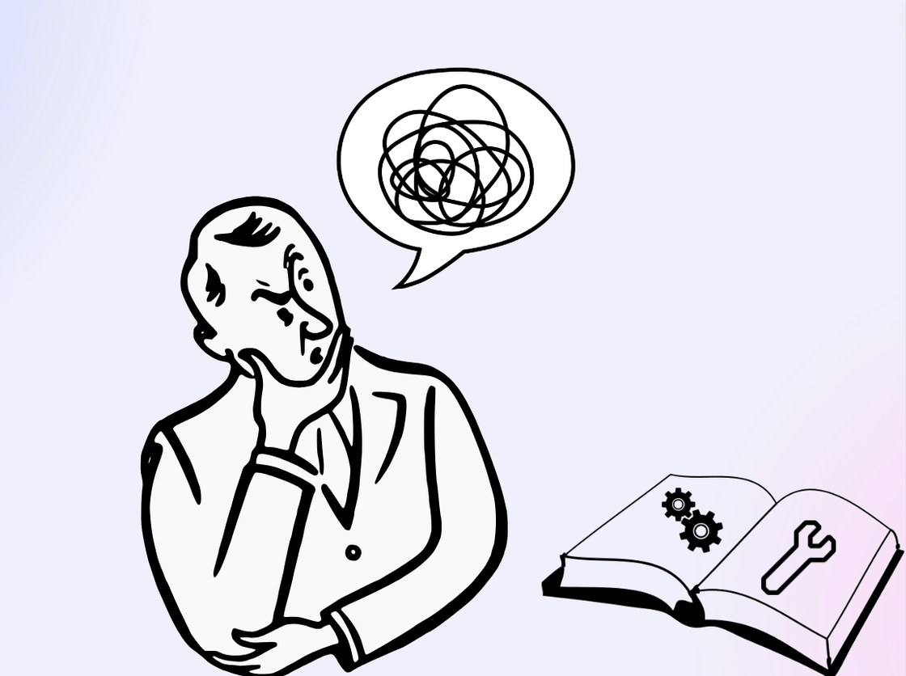
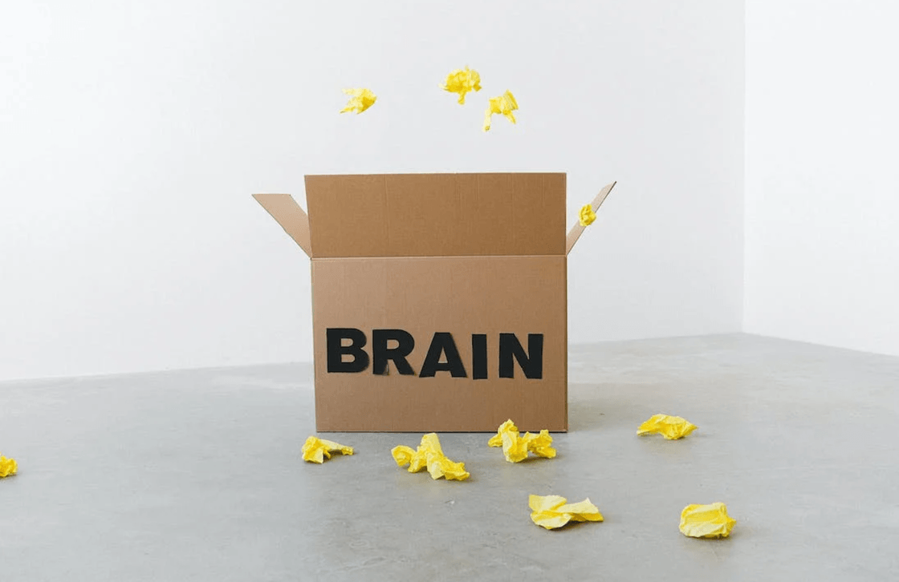
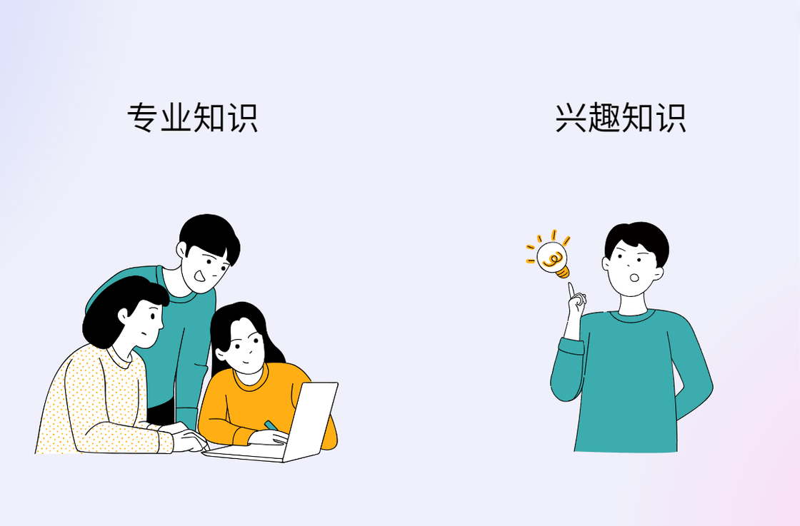
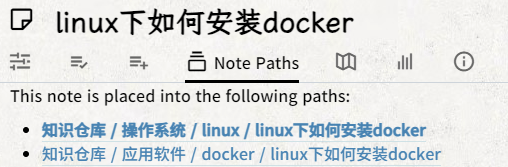
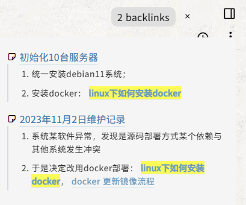
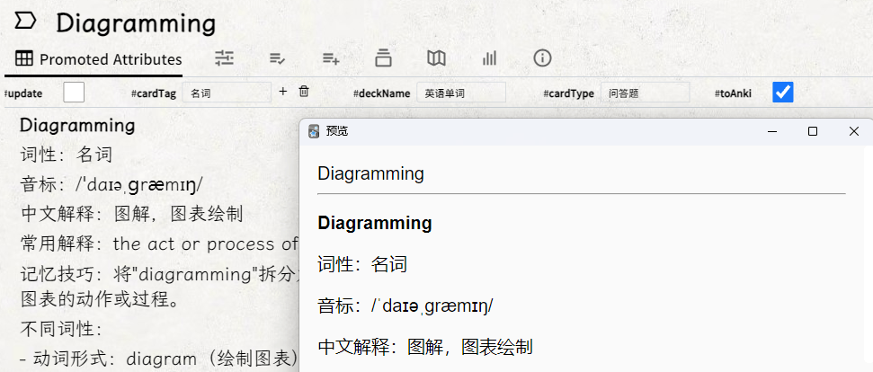
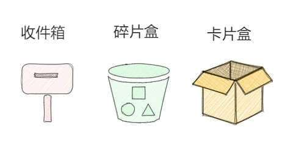
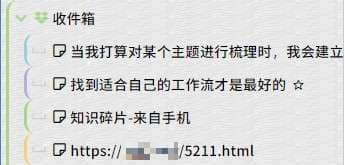

# 以「工作」为分类标准，探讨「知识管理」的新思路 - 少数派

**Matrix 首页推荐**

- - -

## 前言

随着笔记软件向知识管理软件的转型，知识管理的概念也迈入了普通大众的视野。

谈论如何知识管理的文章有很多，但我注意到一个问题，撰写此文的人往往本身就是自媒体从业者，他们管理的知识大多是某某笔记法、知识图谱、笔记软件使用法，诸如此类。

我们阅读后恍然大悟，但实践起来发现对自己根本不适用，因为普通人接触最多的其实是工作方面的「专业知识」。

「专业知识」该如何管理？

本文将以「工作」为分类标准，探讨「知识管理」的全新思路。

## 知识管理的三个阶段

实践需要理论驱动，让我们先了解一下知识管理的三个阶段。

### 一、收集

其实你很早就开始进行知识管理了，比如学生时代写错的题会摘录到错题本上，浏览网页时会将有用的链接保存到收藏夹。

当代互联网人普遍患有「仓鼠症」，比如看到一篇有用的文章，第一时间可能不是去阅读，而是加入收藏夹，脑袋里想着：「好东西，我先保存起来，以后再看……」

我们习惯性会将可能对我们有用的东西「收集」起来，这就是知识管理的第一个阶段。

### 二、整理

第二个阶段，我们学会了整理，不像第一个阶段一股脑的全盘收藏，我们脑中初步形成知识管理的概念，有意识地去提取文章中对我们有用的信息，并且将其归入不同主题，打上不同标签。

这就是广泛意义上的「记笔记」。

而大部分人的知识管理停留在此阶段，此时的笔记软件就像是一座华美的博物馆，你的笔记被精心保存在一个个展柜里，看着它们，心满意足。

或许你也曾辗转许多笔记软件，试图找到最完美的知识管理方案，但最终在做的无非就是把笔记换了一个更加绚丽的容器而已。

### 三、内化

内化是将笔记系统中的知识转化为个人所拥有的知识的过程。在知识管理的第二阶段，尽管我们试图对知识进行归纳整理，但这些知识并不真正属于自己，因为尚未将其转化为内化的个人认知。

知识管理的最终阶段就是到达到「内化」这一步，当然内化并不是指需要将知识全部吸收进自己的大脑。这里引出第二大脑（[Building a second brain](https://sspai.com/link?target=https%3A%2F%2Fwww.buildingasecondbrain.com%2F%3Fref%3Dethanlee)）的概念，这是由生产力大师 Tiago Forte 提出的名词，他认为可以通过现代工具（如笔记系统），人们可以将琐碎的事物交给第二大脑处理，并把第一大脑（人脑）的优势发挥到最大。

根据知识类型的不同，需要交给笔记系统做的事情也不同，那么知识该如何分类呢？

## 知识在行为中产生

「知识」是一个普遍但模糊的概念，具体表现为我们都知道它是什么，但又很难说出它是什么。于是我决定问问 ChatGPT，以下是 ChatGPT 的回答：

> 「知识」是指人们通过学习、经验积累和思考所获得的关于事物、现象或理论的信息和理解。它包括了对事实、概念、原则、规律等的认识和掌握。知识可以通过教育、研究、观察等方式获取，它能够帮助人们理解世界，解决问题，做出决策，并推动个人和社会的发展进步。

emm……ChatGPT 说的也很抽象，以个人浅显的理解来看：**知识就是生活中产出的一切有价值的信息**。

信息是在行为中产出的，首先思考一下生活中有哪些行为：

-   上网
-   工作
-   阅读书籍
-   发呆（灵光乍现）
-   ……

可以说只要我们在活动，信息的产出就不会停止。

## 以「工作」为分类标准

其中，工作占据了生活的大部分时间，从这个角度可以将知识分类为：**专业知识**和**兴趣知识（非专业知识）。**

以「工作」区分知识类型

-   **专业知识**，指的是与自身利益相关（工作、专业、备考等方面）的知识，这类知识往往自成体系，比较有系统性。
-   **兴趣知识**，指的是自己在业余生活中感兴趣的知识，不论是天文地理还是某篇文章中的一小段颇有感悟的话，只要是你感兴趣的知识都可以归入兴趣知识。

> 专业知识与兴趣知识使用的知识管理方法截然不同，而现在大部分的知识管理介绍文章，往往只是在「兴趣知识」这一角度进行阐述，比如卡片笔记法在专业知识领域几乎无法应用（除非你本身就是文字类工作者或者自媒体从业者）。如何对专业知识进行管理，却鲜有人提到。

根据知识类型「对症下药」，是高效知识管理的第二步。

## 专业知识的管理方法

对专业知识的管理主要有三个目的：

1.  方便查找
2.  方便使用
3.  方便记忆

### 一、树状笔记管理

假设你是一个程序员，你的专业知识自然就是计算机方面的知识，打个比方，我有一篇笔记「Linux 安装 Docker」，很明显这篇笔记至少有两个关键词：Linux、Docker，若再进行细分还可分出安装教程、虚拟机等关键词。

传统的树状笔记管理法有一个弊端，当试图在某个分类中查找印象中的某篇笔记时，时常会产生：「咦，我明明放在这个分类下面了呀，怎么找不到……」之类的疑惑。这是因为知识点是交叉的，一篇笔记往往涵盖多个知识点，属于不同领域。

Trilium 的「clone」功能可以很好的解决同一个知识点可能在不同领域交叉的问题，「clone」类似 Windows 的「硬链接」，可以让同一篇笔记拥有不同的父笔记。如下图所示，这篇笔记我将其同时归入 `知识仓库/操作系统/linux/` 与  `知识仓库/应用软件/docker/` 中，这样不论是浏览「linux」目录或者「docker」目录我都能找到这篇笔记。

同一个知识点可以属于不同领域

### 二、双向链接辅助

当我在其他地方使用到某个知识点时，我会直接打一个链接指向该笔记，这时笔记之间会产生一个双向链接，可以清楚地了解到这篇笔记的使用情况，使用频次。

双向链接提供了丰富的上下文信息

### 三、Anki 系统辅助记忆

专业知识最重要的就是将其吸收成为为自己的知识，这就需要 Anki 的帮助。Anki 是一款记忆辅助软件，基于艾宾浩斯记忆曲线，使用间隔重复算法帮助我们对抗遗忘。

> 间隔重复可以用于改善学习的观点最初是由塞西尔·阿莱克·梅斯（Cecil Alec Mace）教授于 1932 年在学习心理学（Learning Psychology）一书中提出的：「也许最重要的发现是那些有关于学习时间分布的结果......对知识的复习和回顾应该反复多次，并且逐渐增加时间间隔，比如一天，两天，四天，八天等等。

我在 Trilium 编写了一个一键制卡的插件用于链接到 Anki 系统。

比如最近在学习英语单词，在 Trilium 中这就是一篇正常的笔记，并且遵循以上两个管理方法使用树状笔记管理，双向链接辅助。但只要你填好对应的卡组名称、标签、卡片类型，轻轻点击 toAnki 按钮，这篇笔记会轻松转移到 Anki 中，以便在闲暇时间记忆。

如果有更新，只需要点击 update，便会将最新内容自动同步到 Anki，保证了笔记的统一化管理。

一键制作 Anki 卡片

## 兴趣知识的管理方法

兴趣知识不像专业知识这么硬核，我们对兴趣知识的管理只有一个目的：激发大脑联想。

人脑的优势在于创造事物之间的**链接**而非存储，当我们不再为如何存储碎片知识而感到焦虑时，思路便会更加清晰，能创造的联系也就更多。通过这些联系，能使我们产生许多有创造力的想法。

我使用**网状笔记**管理兴趣知识，顾名思义，网状笔记一种是完全基于链接去构建笔记间联系的方式，笔记与笔记之间练成线，线再交织成网。

网状笔记

可以看到我的每一篇都是原子笔记（只讲述一个主题），笔记之间建立大量的链接，并且标题是能够概括笔记内容的。这样当我浏览网状笔记时，能清楚看到笔记之间的关联，激发出新的灵感。

这种管理方式源自于我对卡片笔记法与常青笔记法的魔改，在我的笔记系统中有三个文件夹支撑此系统：

卡片盒系统

### 收件箱

我们每天都在接收大量信息，浏览网页、灵感乍现、读书笔记等，当天产出的信息我统一投入到收件箱中。

收件箱

收件箱内存放的是未经整理的信息，可以看到，我的收件箱中有灵感乍现写下的笔记，也有外出时来自手机的灵感碎片，也有浏览网页时发现值得一看的文章。

但收件箱内的信息还不属于我，在我的知识管理体系中，没有进行整理的信息将无法进入最终的网状笔记。

### 碎片盒

如果只是进行阅读而不记录笔记（或者仅仅是引用原文），这种情况下的阅读大部分都是无效阅读，我们只是在欣赏作者的观点，而不是产生自己的观点。当我们试图用自己的话表达论点时就会发现原来自己没有真的理解。

> 「如果你说不清楚，就表示你自己也不明白。」（John Searle）

我们经常会产生错觉，误认为自己对某件事情掌握或是理解，然而一旦需要去实际表达和实现的时候就会发现完全不是这么一回事，只有尝试向大脑提取信息的时候我们才能清楚知道自己到底掌握了什么。很多情况下我们只是感觉自己变聪明而不是真的变聪明。

碎片盒正是执行「内化」这一步的关键步骤，碎片盒中的笔记是对收件箱内的信息的再加工，即通过自己的语言转述文章的观点。

### 卡片盒

没有链接关系的笔记只能称作「碎片」，当一张张碎片通过链接聚合起来就成了卡片，卡片之间再不断交织，就成了「网状笔记」。

当碎片盒的笔记与卡片盒中的卡片建立链接或者其本身已经包含链接的时候，这篇笔记就可以投入卡片盒了。由此可以看出我对碎片盒到卡片盒的要求仅仅只有一点：**需要有与其他笔记的链接**。

## 高效知识管理的秘诀

简单总结下我对不同知识运用的管理方法：

-   专业知识：树状笔记整理，Anki 辅助笔记系统，将其转化为内部知识；
-   兴趣知识：建立卡片盒系统，形成网状笔记结构，促进大脑迸发联想。

聪明的读者可以看出来，虽然我对专业知识与兴趣知识采用了截然不同的管理方法，但核心离不开文章开头所说的知识管理的三个阶段：收集 - 整理 - 内化。

## 结语

知识管理不是一个静态的过程，并不是学会一套笔记法就能学会知识管理，根据类型「对症下药」，才是知识管理的上上之策。

以上便是本人对知识管理的一些浅显理解与做法，仅作抛砖引玉，欢迎交流经验。

