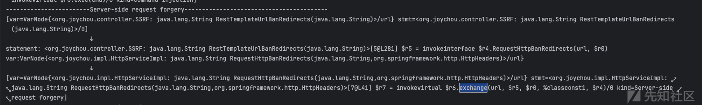
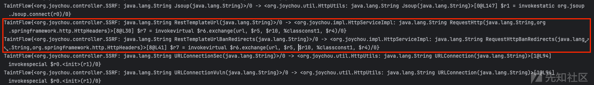
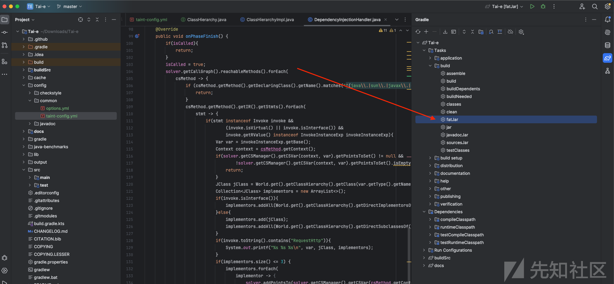

# 使用太阿（Tai-e）进行静态代码安全分析（spring-boot篇二） - 先知社区

使用太阿（Tai-e）进行静态代码安全分析（spring-boot篇二）

- - -

**作者: lcark、keanu**

# 概述

[Tai-e](https://github.com/pascal-lab/Tai-e)是针对java的静态程序分析框架，支持包括指针分析、数据流分析、污点分析在内的诸多静态程序分析。由于Tai-e并非专门用来做静态代码安全分析，所以并非开箱即用，在实际安全分析中使用有许多问题。准备通过大致如下多篇文章，逐渐将Tai-e改造为开箱即用的静态代码安全分析框架。

-   分析SpringBoot应用，支持控制翻转、依赖注入、面向切面编程等特性
-   分析基于Mybatis框架的sql注入漏洞
-   优化输出结果
-   Java Api提取,更偏向于支持企业Api安全。
-   Pointer Analysis And Taint Analysis Flow Analysis

由于spring-boot实现了控制反转与面向切面编程的设计思想，使得程序并非顺序执行，因此很难通过程序入口来顺序分析所有代码。本篇文章旨在解决依赖注入、控制反转问题。  
实验代码为[https://github.com/lcark/Tai-e-demo](https://github.com/lcark/Tai-e-demo)  
本文章使用的被分析代码为[https://github.com/JoyChou93/java-sec-code](https://github.com/JoyChou93/java-sec-code)  
阅读本篇文章前请先阅读[使用太阿（Tai-e）进行静态代码安全分析（spring-boot篇一）](https://xz.aliyun.com/t/13775)

# 原理分析

## 控制反转

什么是控制反转？控制反转（IoC）是一种设计原则，其中应用程序的控制权被反转，由框架或容器负责管理对象的生命周期和控制对象之间的关系。这意味着应用程序不再负责直接实例化和管理对象，而是将这些任务委托给外部的框架或容器。  
以如下代码如例：

```plain
@Configuration
public class AppConfig {

    @Bean
    public MyServiceImpl myService() {
        return new MyServiceImpl();
    }
}
```

```plain
@RestController
public class MovieRecommenderController {

    @Autowired
    private MyServiceImpl service;

    @GetMapping("/")
    public void doSomeAction(){
        service.action();
    }

    // ...
}
```

观察上面两段代码， 发现`service`的实例化和管理被Spring框架控制，而不是由应用程序直接控制。使用控制反转这样的技术可以使代码的对象的创建与使用解耦，降低组件之间的耦合度，使系统更易于维护、扩展和测试。而依赖注入是IoC的一种实现方式。它是指将一个对象的依赖关系通过构造函数、方法参数或属性注入到对象中，而不是在对象内部硬编码这些依赖关系。通过依赖注入，对象变得更加灵活和可配置。

## 指针分析如何处理函数调用？

在Tai-e，污点分析是作为指针分析的一个插件，在指针分析中完成了污点分析。所以在进一步分析控制反转前，我们需要先了解一下指针分析的基础。  
指针分析就是计算指针（变量、字段）可以指向哪个对象的过程。指针分析首先需要对New语句进行分析，然后才能对Assign、store、load语句进行分析，在此基础上进行指针分析传播，以及后续method call的处理。而对New语句初始化就需要用到堆抽象技术。

### 堆抽象

指针分析首先要进行堆抽象。对指针所代表的内存内容进行建模，Tai-e使用New Stmt创建一个新的对象(NewObj) 来实现堆抽象，即将指针所代表内容用对象构造时的Stmt代替。该New Stmt如下是是构建一个堆抽象的案例。

```plain
A a = new A();
```

```plain
PT(a)={NewObj{<New: void main(java.lang.String[])>[0@L4] new A}}
```

这种堆抽象方法又叫做Allocation-Site abstraction，这是指针分析中最常见的堆抽象方法。

### 函数调用处理

在指针分析中会碰到许多函数调用，对象会沿着函数调用进行传播。在处理方法调用时时，需要分析出指针调用的具体方法。java的方法调用大概有以下四种，具体所调用方法的解析原理如下：

[](https://xzfile.aliyuncs.com/media/upload/picture/20240308101500-aa94d57c-dcf1-1.png)

### invokeinterface和invokevirtual

```plain
a.f(p1, p2)
```

当分析如上语句时，`a.f`所对应的函数就是指针a所对应Method即类A的方法。而在分析控制反转中，无法将`service`与其调用点关联起来，便无法分析出`a.f`实际所调用的函数  
如上代码便是Tai-e中处理方法调用的相关代码：

```plain
private void processCall(CSVar recv, PointsToSet pts) {
    Context context = recv.getContext();
    Var var = recv.getVar();
    for (Invoke callSite : var.getInvokes()) {
        pts.forEach(recvObj -> {
            // resolve callee
            JMethod callee = CallGraphs.resolveCallee(
                    recvObj.getObject().getType(), callSite);
            if (callee != null) {
                // select context
                CSCallSite csCallSite = csManager.getCSCallSite(context, callSite);
                Context calleeContext = contextSelector.selectContext(
                        csCallSite, recvObj, callee);
                ......
                ......
            } else {
                plugin.onUnresolvedCall(recvObj, context, callSite);
            }
        });
    }
}
```

首先遍历pts（指针所指向堆抽象的集合），然后根据obj类型与当前函数调用callSite解析出具体调用的方法。

```plain
public static JMethod resolveCallee(Type type, Invoke callSite) {
    MethodRef methodRef = callSite.getMethodRef();
    if (callSite.isInterface() || callSite.isVirtual()) {
        return World.get().getClassHierarchy()
                .dispatch(type, methodRef);
    } else if (callSite.isSpecial()) {
        return World.get().getClassHierarchy()
                .dispatch(methodRef.getDeclaringClass(), methodRef);
    } else if (callSite.isStatic()) {
        return methodRef.resolveNullable();
    } else {
        throw new AnalysisException("Cannot resolve Invoke: " + callSite);
    }
}
```

`resolveCallee`对应的源码如上，如果`callSite`所调用的方法为`interface`或者`virtual`，就会根据obj的类型与方法引用派生出具体的方法。

dispatch会调用`lookupMethod`，其核心逻辑如下：

1.  遍历超类，如果超类含有该方法，则返回超类中的该方法
2.  遍历超类的所实现的所有接口，返回接口中的该方法

```plain
private JMethod lookupMethod(JClass jclass, Subsignature subsignature,
                             boolean allowAbstract) {
    // JVM Spec. (11 Ed.), 5.4.3.3 Method Resolution
    // 1. If C is an interface, method resolution throws
    // an IncompatibleClassChangeError. TODO: what does this mean???

    // 2. Otherwise, method resolution attempts to locate the
    // referenced method in C and its superclasses
    for (JClass c = jclass; c != null; c = c.getSuperClass()) {
        JMethod method = c.getDeclaredMethod(subsignature);
        if (method != null && (allowAbstract || !method.isAbstract())) {
            return method;
        }
    }
    // 3. Otherwise, method resolution attempts to locate the
    // referenced method in the superinterfaces of the specified class C
    for (JClass c = jclass; c != null; c = c.getSuperClass()) {
        for (JClass iface : c.getInterfaces()) {
            JMethod method = lookupMethodFromSuperinterfaces(
                    iface, subsignature, allowAbstract);
            if (method != null) {
                return method;
            }
        }
    }
    return null;
    // TODO:
    //  1. check accessibility
    //  2. handle phantom methods
    //  3. double-check correctness
}
```

## 问题分析

在使用控制反转时，类的实例化是由spring的IoC容器控制，而不是应用程序自身控制。这使得在指针分析中，无法通过传统的dispatch获取到callsite具体调用的方法，而无法解析控制反转所控制的实例。  
如果我们可以分析出当前对象所对应的具体实现类，那便可以在指针分析处理call调用时获取到具体的方法调用。  
代码的具体实现如下：

```plain
solver.addPointsTo(solver.getCSManager().getCSVar(csMethod.getContext(), var),
                                        solver.getHeapModel().getMockObj(() -> "DEPENDENCY_INJECTION", cls.getName(), cls.getType()));
```

问题的关键就是**如何找出，当前被注入者所对应的具体实现类**。

spring支持两种依赖注入的配置方式:

**通过注解配置**

```plain
@Service
public class CustomizedService {
    @Resource
    private HttpService httpService;

    @GetMapping("/restTemplate/vuln1")
    public String RestTemplateUrlBanRedirects(String url){
        HttpHeaders headers = new HttpHeaders();
        headers.setContentType(MediaType.APPLICATION_JSON_UTF8);
        return httpService.RequestHttpBanRedirects(url, headers);
    }
}
```

```plain
@Service
public class HttpServiceImpl implements HttpService {

        public String RequestHttpBanRedirects(String url, HttpHeaders headers) {
        HttpEntity<String> entity = new HttpEntity<>(headers);
        ResponseEntity<String> re = restTemplateBanRedirects.exchange(url, HttpMethod.GET, entity, String.class);
        return re.getBody();
    }
}
```

如上代码会将字段`httpService`的配置为`HttpServiceImpl`的实例，无需在CustomizedService.java添加构造`httpService`的代码。

**通过xml文件配置**

```plain
package x.y;

public class ThingOne {

    public ThingOne(ThingTwo thingTwo, ThingThree thingThree) {
        // ...
    }
}
```

```plain
<beans>
  <bean id="beanOne" class="x.y.ThingOne">
    <constructor-arg ref="beanTwo"/>
    <constructor-arg ref="beanThree"/>
  </bean>

  <bean id="beanTwo" class="x.y.ThingTwo"/>

  <bean id="beanThree" class="x.y.ThingThree"/>
</beans>
```

通过如上配置，便可以将`beanTwo`、`beanThree` 自动配置为`ThingOne`构造参数，不需要在`ThingOne`中添加`beanTwo`、`beanThree`的构造过程。

# 控制反转处理

如下为仓库[https://github.com/JoyChou93/java-sec-code](https://github.com/JoyChou93/java-sec-code)中包含SSRF漏洞且利用了控制反转特性的代码片段

```plain
@RestController
@RequestMapping("/ssrf")
public class SSRF {

    private static final Logger logger = LoggerFactory.getLogger(SSRF.class);

    @Resource
    private HttpService httpService;

    @GetMapping("/restTemplate/vuln1")
    public String RestTemplateUrlBanRedirects(String url){
        HttpHeaders headers = new HttpHeaders();
        headers.setContentType(MediaType.APPLICATION_JSON_UTF8);
        return httpService.RequestHttpBanRedirects(url, headers);
    }

    @GetMapping("/restTemplate/vuln2")
    public String RestTemplateUrl(String url){
        HttpHeaders headers = new HttpHeaders();
        headers.setContentType(MediaType.APPLICATION_JSON_UTF8);
        return httpService.RequestHttp(url, headers);
    }

}
```

这个SSRF漏洞对应的调用链如下，sink点的方法为`org.springframework.web.client.RestTemplate#exchange`，所以需要把该方法加入污点分析的配置文件

```plain
org.joychou.controller.SSRF#RestTemplateUrlBanRedirects
org.joychou.impl.HttpServiceImpl#RequestHttpBanRedirects
org.springframework.web.client.RestTemplate#exchange
```

另一个漏洞的sink点所调用方法与上个漏洞一致，不过调用链有所区别

```plain
org.joychou.controller.SSRF#RestTemplateUrl
org.joychou.impl.HttpServiceImpl#RequestHttp
org.springframework.web.client.RestTemplate#exchange
```

## 类CHA（Class Hierarchy Analysis）实现方式

根据原理分析一节中的描述，方法调用是通过堆抽象（用obj代表具体的类）所对应的类型解析出来的，当我们分析出当前指针所对应的实际类时，需要构造如下的MockObj，并将类型配置为我们解析出来的类型。

```plain
default Obj getMockObj(Descriptor desc, Object alloc, Type type) {
    return getMockObj(desc, alloc, type, null);
}
```

```plain
solver.addPointsTo(solver.getCSManager().getCSVar(csMethod.getContext(), var),
                                        solver.getHeapModel().getMockObj(() -> "DEPENDENCY_INJECTION", implementor.getName(), implementor.getType()));
```

实际代码如上，其中`implementor`为我们所分析出的具体的实现类。本质是将解析出的实际类所代表的MockObj添加为对应指针的指向集中。  
具体实现思路如下：  
遍历被分析代码中的所有方法，提取出`Invoke`语句即方法调用语句

```plain
solver.getCallGraph().reachableMethods().forEach(
    csMethod -> {
        if (csMethod.getMethod().getDeclaringClass().getName().matches("^(java\\.|sun\\.|javax\\.|com\\.sun\\.).+$")){
            return;
        }
        csMethod.getMethod().getIR().getStmts().forEach(
            stmt -> {
            }
    )
)
```

如果语句是静态方法调用或special调用，那不用分析

```plain
if(stmt instanceof Invoke invoke &&
        (invoke.isVirtual() || invoke.isInterface()) &&
        invoke.getRValue() instanceof InvokeInstanceExp invokeInstanceExp){
       //执行分析逻辑
}
```

如果接受者已经有了指向信息，代表接受者并不是由控制反转构造，不用分析

```plain
if(solver.getCSManager().getCSVar(context, var).getPointsToSet() != null &&
        !solver.getCSManager().getCSVar(context, var).getPointsToSet().isEmpty()) {
    return;
}
```

如果对象的类型为接口，那么可能的类就是所有实现类；  
如果对象的类型为类，而非接口，那么可能的类就是所有子类。

```plain
JClass jClass = World.get().getClassHierarchy().getClass(var.getType().getName());
Collection<JClass> implementors = new ArrayList<>();
if(invoke.isInterface()){
    implementors.addAll(World.get().getClassHierarchy().getDirectImplementorsOf(jClass));
}else{
    implementors.add(jClass);
    implementors.addAll(World.get().getClassHierarchy().getDirectSubclassesOf(jClass));
}
System.out.printf("%s %s %s\n", var, jClass, implementors);
```

运行相关代码，成功获取到了`HttpSerivce`的实际类  
[](https://xzfile.aliyuncs.com/media/upload/picture/20240308101550-c8b1918a-dcf1-1.png)

最后将可能的类加到对象的指向集中，指针分析会再分析方法调用中找到真实调用的方法

```plain
if(implementors.size() <= 3) {
    implementors.forEach(
        implementor -> {
            solver.addPointsTo(solver.getCSManager().getCSVar(csMethod.getContext(), var),
                    solver.getHeapModel().getMockObj(() -> "DEPENDENCY_INJECTION", implementor.getName(), implementor.getType()));
        }
    );
}
```

还有最后一个问题，对应的分析代码应该放在指针分析的哪个阶段？

根据`DefaultSolver.java`analyze方法的源码，指针分析会在完毕前调用`onPhaseFinish`，如果把代码放在此处，此时除控制反转外的其他分析都已经完成，会使我们的判断准确。

```plain
private void analyze() {
    while (!workList.isEmpty() && !isTimeout) {
        // phase starts
        while (!workList.isEmpty() && !isTimeout) {
            ......
            ......
        }
        plugin.onPhaseFinish();
    }
    if (!workList.isEmpty() && isTimeout) {
        logger.warn("Pointer analysis stops early as it reaches time limit ({} seconds)," +
                " and the result may be unsound!", timeLimit);
    } else if (timeLimiter != null) { // finish normally but time limiter is still running
        timeLimiter.stop();
    }
    plugin.onFinish();
}
```

完整代码如下

```plain
package pascal.taie.analysis.pta.plugin.taint;

import pascal.taie.World;
import pascal.taie.analysis.pta.core.cs.context.Context;
import pascal.taie.analysis.pta.core.solver.Solver;
import pascal.taie.analysis.pta.plugin.Plugin;
import pascal.taie.ir.exp.InvokeInstanceExp;
import pascal.taie.ir.exp.Var;
import pascal.taie.ir.stmt.Invoke;
import pascal.taie.language.classes.JClass;

import java.util.ArrayList;
import java.util.Collection;

public class DependencyInjectionHandler implements Plugin {
    private Solver solver;
    private boolean isCalled;

    public DependencyInjectionHandler(){
        isCalled = false;
    }

    @Override
    public void setSolver(Solver solver) {
        this.solver = solver;
    }

    @Override
    public void onPhaseFinish() {
        if(isCalled){
            return;
        }
        isCalled = true;
        solver.getCallGraph().reachableMethods().forEach(
            csMethod -> {
                if (csMethod.getMethod().getDeclaringClass().getName().matches("^(java\\.|sun\\.|javax\\.|com\\.sun\\.).+$")){
                    return;
                }
                csMethod.getMethod().getIR().getStmts().forEach(
                    stmt -> {
                        if(stmt instanceof Invoke invoke &&
                                (invoke.isVirtual() || invoke.isInterface()) &&
                                invoke.getRValue() instanceof InvokeInstanceExp invokeInstanceExp){
                            Var var = invokeInstanceExp.getBase();
                            Context context = csMethod.getContext();
                            if(solver.getCSManager().getCSVar(context, var).getPointsToSet() != null &&
                                    !solver.getCSManager().getCSVar(context, var).getPointsToSet().isEmpty()) {
                                return;
                            }
                            JClass jClass = World.get().getClassHierarchy().getClass(var.getType().getName());
                            Collection<JClass> implementors = new ArrayList<>();
                            if(invoke.isInterface()){
                                implementors.addAll(World.get().getClassHierarchy().getDirectImplementorsOf(jClass));
                            }else{
                                implementors.add(jClass);
                                implementors.addAll(World.get().getClassHierarchy().getDirectSubclassesOf(jClass));
                            }
                            if(invoke.toString().contains("RequestHttp")){
                                System.out.printf("%s %s %s\n", var, jClass, implementors);
                            }
                            if(implementors.size() <= 3) {
                                implementors.forEach(
                                    implementor -> {
                                        solver.addPointsTo(solver.getCSManager().getCSVar(csMethod.getContext(), var),
                                                solver.getHeapModel().getMockObj(() -> "DEPENDENCY_INJECTION", implementor.getName(), implementor.getType()));
                                    }
                                );
                            }
                        }
                    });
            });
    }
}
```

运行该代码，可以扫描出依赖于控制反转的漏洞  
[](https://xzfile.aliyuncs.com/media/upload/picture/20240308101619-da0bd83c-dcf1-1.png)  
[](https://xzfile.aliyuncs.com/media/upload/picture/20240308101636-e41e2618-dcf1-1.png)  
[](https://xzfile.aliyuncs.com/media/upload/picture/20240308101725-0101ff2a-dcf2-1.png)  
但是上述方式缺乏准确性，如果一个接口有多个实现类，就无法准确识别出该指针所对应的实现类。

## 基于注解的配置解析

在代码中，控制反转是通过xml、注解进行实际配置。因此通过解析xml、注解的实际含义，会使结果更加准确。  
实现思路为识别注入点以及依赖实现类，然后将依赖实现类构造成的obj添加到注入点变量的的指向集中。

```plain
@Service
public class CustomizedService {
    @Resource
    private HttpService httpService;

    @GetMapping("/restTemplate/vuln1")
    public String RestTemplateUrlBanRedirects(String url){
        HttpHeaders headers = new HttpHeaders();
        headers.setContentType(MediaType.APPLICATION_JSON_UTF8);
        return httpService.RequestHttpBanRedirects(url, headers);
    }
}
```

```plain
@Service
public class HttpServiceImpl implements HttpService {

        public String RequestHttpBanRedirects(String url, HttpHeaders headers) {
        HttpEntity<String> entity = new HttpEntity<>(headers);
        ResponseEntity<String> re = restTemplateBanRedirects.exchange(url, HttpMethod.GET, entity, String.class);
        return re.getBody();
    }
}
```

对于如上代码而言，需要识别出`CustomizedService`的注入点`httpService`，然后找到`HttpService`的实现类，最后把实现类`HttpServiceImpl`已obj的形式添加到变量的指向集中。  
实现方法如下：

### 注入点识别

```plain
List<JField> injectedFields = new ArrayList<>();
World.get().getClassHierarchy().allClasses()
        .map(JClass::getDeclaredFields)
        .flatMap(Collection::stream)
        .forEach(field -> {
            boolean isInjectedField = field.hasAnnotation("javax.annotation.Resource") ||
                    field.hasAnnotation("org.springframework.beans.factory.annotation.Autowired") ||
                    field.hasAnnotation("javax.inject.Inject");
            if(isInjectedField){
                injectedFields.add(field);
            }
        });
```

遍历所有类的所有字段，若字段包含以下注解，则说明该字段是注入点

-   `javax.annotation.Resource`
-   `org.springframework.beans.factory.annotation.Autowired`
-   `javax.inject.Inject`

### 寻找实现类

```plain
List<JClass> implementationClasses = new ArrayList<>();
implementationClasses.addAll(
    World.get().getClassHierarchy().allClasses()
            .filter(cls -> cls.hasAnnotation("org.springframework.stereotype.Service") ||
                    cls.hasAnnotation("org.springframework.stereotype.Component")).collect(Collectors.toSet())
);
```

遍历所有类，若类包含以下注解，则说明该类为实现类

-   `org.springframework.stereotype.Service`
-   `org.springframework.stereotype.Component`

### 将实现类与注入点关联起来

如果在方法中要使用当前类的字段，会从`%this`变量中载入该字段，然后使用。  
`[4@L281] $r4 = %this.<org.joychou.controller.SSRF: org.joychou.service.HttpService httpService>;`

```plain
@org.springframework.web.bind.annotation.GetMapping({"/restTemplate/vuln1"})
public java.lang.String RestTemplateUrlBanRedirects(java.lang.String url) {
    org.springframework.http.HttpHeaders $r0;
    org.springframework.http.MediaType $r1;
    org.joychou.service.HttpService $r4;
    java.lang.String $r5;
    [0@L279] $r0 = new org.springframework.http.HttpHeaders;
    [1@L279] invokespecial $r0.<org.springframework.http.HttpHeaders: void <init>()>();
    [2@L280] $r1 = <org.springframework.http.MediaType: org.springframework.http.MediaType APPLICATION_JSON_UTF8>;
    [3@L280] invokevirtual $r0.<org.springframework.http.HttpHeaders: void setContentType(org.springframework.http.MediaType)>($r1);
    [4@L281] $r4 = %this.<org.joychou.controller.SSRF: org.joychou.service.HttpService httpService>;
    [5@L281] $r5 = invokeinterface $r4.<org.joychou.service.HttpService: java.lang.String RequestHttpBanRedirects(java.lang.String,org.springframework.http.HttpHeaders)>(url, $r0);
    [6@L281] return $r5;
}
```

如果要将实现类与注入点关联起来，就相当于把实现类与`LoadField`的返回值关联起来。具体关联代码如下：

```plain
injectedFields.stream().forEach(field -> {
    JClass jClass = field.getDeclaringClass();

    Collection<JClass> subClasses = World.get().getClassHierarchy().getAllSubclassesOf(
            World.get().getClassHierarchy().getClass(field.getType().getName())
    );
    List<JClass> implementors = new ArrayList<>(subClasses);
    implementors.retainAll(implementationClasses);
    System.out.printf("%s %s\n", field, implementors);

    Set<CSMethod> csMethodSet = solver.getCallGraph().reachableMethods()
            .filter(csMethod -> csMethod.getMethod().getDeclaringClass().equals(jClass))
            .collect(Collectors.toSet());
    csMethodSet.forEach(
            csMethod -> {
                List<Var> vars = csMethod.getMethod().getIR().getStmts().stream()
                        .filter(stmt -> stmt instanceof LoadField loadField &&
                                loadField.getFieldAccess().getFieldRef().resolve().equals(field))
                        .map(stmt -> (LoadField) stmt)
                        .map(AssignStmt::getLValue)
                        .toList();
                implementors.forEach(
                        implementor -> {
                            vars.forEach(
                                    var -> {
                                        solver.addPointsTo(solver.getCSManager().getCSVar(csMethod.getContext(), var),
                                                solver.getHeapModel().getMockObj(() -> "DEPENDENCY_INJECTION", implementor.getName(), implementor.getType()));
                                    }
                            );
                        }
                );
            }
    );
});
```

1.  获取注入点字段的所属类，然后获取该类中所有上下文有关的方法；
2.  获取字段类型的所有子类，如果是接口，则获取所有实现类。与之前所有的实现类取交集，这个交集就是控制反转中该字段的实现类；
3.  遍历第一步获取到的方法的所有语句，若语句的类型是`LoadField`，则判断其`FieldAccess`的字段是否为注入点的字段，若是，则用第二步的实现类构造`MockObj`，将其添加到`LoadField`语句的返回值的指向集中。

运行代码，成功将实现类添加到指向集中并扫描出相关漏洞。  
[](https://xzfile.aliyuncs.com/media/upload/picture/20240308101757-147f7d84-dcf2-1.png)  
[](https://xzfile.aliyuncs.com/media/upload/picture/20240308101826-258f95dc-dcf2-1.png)

## 基于XML的配置解析

原理与基于注解的配置解析一样，只是需要解析XML文件的具体内容。本篇文章不在赘述。

# 结果展示

更改的相关代码以及配置文件已经上传至github，见[https://github.com/lcark/Tai-e-demo/tree/main/spring-boot-2](https://github.com/lcark/Tai-e-demo/tree/main/spring-boot-2)  
具体食用方法如下：

1.下载代码，并移动至spring-boot-2目录下

```plain
git clone https://github.com/lcark/Tai-e-demo
cd Tai-e-demo/spring-boot-2
git submodule update --init
```

2.将DependencyInjectionHandler.java移动至Tai-e源码的src/main/java/pascal/taie/analysis/pta/plugin/taint/目录下，并重新编译打包

[](https://xzfile.aliyuncs.com/media/upload/picture/20240308101846-313d3fe2-dcf2-1.png)

3.使用如下命令运行tai-e便可以成功获取到扫描结果

```plain
java -cp ~/Downloads/Tai-e/build/tai-e-all-0.5.1-SNAPSHOT.jar pascal.taie.Main --options-file=options.yml
```

4.如下图所示，两个测试案例都被检测到

[](https://xzfile.aliyuncs.com/media/upload/picture/20240308101915-4300f066-dcf2-1.png)

# 参考链接

\[0\]. [https://docs.spring.io/spring-framework/reference/core/beans/child-bean-definitions.html](https://docs.spring.io/spring-framework/reference/core/beans/child-bean-definitions.html)  
\[1\]. [https://tai-e.pascal-lab.net/pa4.html](https://tai-e.pascal-lab.net/pa4.html)  
\[2\]. [https://github.com/lcark/Tai-e-demo](https://github.com/lcark/Tai-e-demo)
