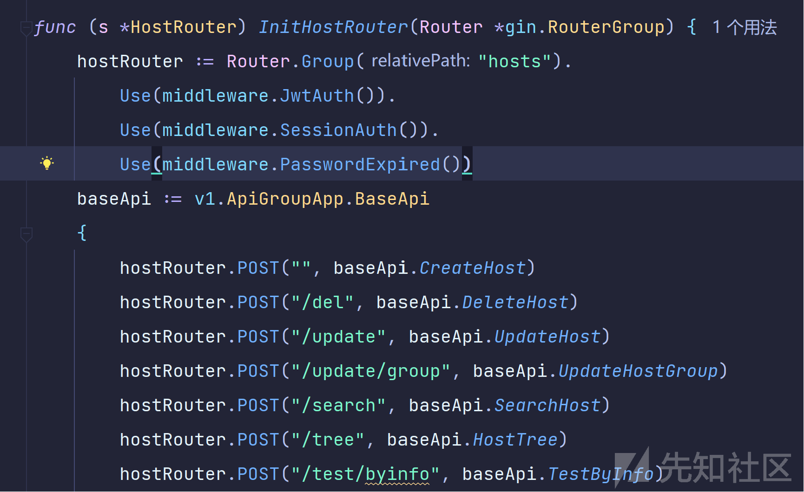

# 1Panel 系列漏洞分析 - 先知社区

1Panel 系列漏洞分析

- - -

# 路由分析

查看代码可以发现，系统 web 框架为 Gin 框架，在前面的文章中我们有讲过 Gin 框架的路由是如何定义的。这里我们通过直接查看启动文件的方式寻找路由。在启动文件 server.go 中存在 start 函数，通过分析代码可以发现使用了`endless`包来启动 HTTP 服务，并且通过`router.Routers()`函数初始化路由和中间件。

```plain
func Start() {
    viper.Init()
    log.Init()
    app.Init()
    db.Init()
    migration.Init()
    validator.Init()
    gob.Register(psession.SessionUser{})
    cache.Init()
    session.Init()
    gin.SetMode("debug")
    cron.Run()
    business.Init()
    hook.Init()

    rootRouter := router.Routers()
    address := fmt.Sprintf(":%s", global.CONF.System.Port)
    s := endless.NewServer(address, rootRouter)
    s.ReadHeaderTimeout = 20 * time.Second
    s.WriteTimeout = 60 * time.Second
    s.MaxHeaderBytes = 1 << 20

    if global.CONF.System.SSL == "disable" {
        global.LOG.Infof("server run success on %s with http", global.CONF.System.Port)
        if err := s.ListenAndServe(); err != nil {
            global.LOG.Error(err)
            panic(err)
        }
    } else {
        certificate, err := os.ReadFile(global.CONF.System.BaseDir + "/1panel/secret/server.crt")
        if err != nil {
            panic(err)
        }
        key, err := os.ReadFile(global.CONF.System.BaseDir + "/1panel/secret/server.key")
        if err != nil {
            panic(err)
        }
        cert, err := tls.X509KeyPair(certificate, key)
        if err != nil {
            panic(err)
        }
        s := &http.Server{
            Addr:    address,
            Handler: rootRouter,
            TLSConfig: &tls.Config{
                Certificates: []tls.Certificate{cert},
            },
        }

        global.LOG.Infof("server run success on %s with https", global.CONF.System.Port)
        if err := s.ListenAndServeTLS("", ""); err != nil {
            global.LOG.Error(err)
            panic(err)
        }
    }
}
```

查看 router 文件中的 Routers 函数，通过分析代码可以知道 Routers 函数作用是创建和配置一个 Gin Web 框架的路由引擎，并定义各种 HTTP 路由规则、中间件、以及相关的处理函数。

```plain
func Routers() *gin.Engine {
    Router := gin.Default()
    Router.Use(middleware.OperationLog())
    // Router.Use(middleware.CSRF())
    // Router.Use(middleware.LoadCsrfToken())
    if global.CONF.System.IsDemo {
        Router.Use(middleware.DemoHandle())
    }

    Router.NoRoute(func(c *gin.Context) {
        c.Writer.WriteHeader(http.StatusOK)
        _, _ = c.Writer.Write(web.IndexByte)
        c.Writer.Header().Add("Accept", "text/html")
        c.Writer.Flush()
    })

    Router.Use(i18n.GinI18nLocalize())
    Router.SetFuncMap(template.FuncMap{
        "Localize": ginI18n.GetMessage,
    })

    systemRouter := rou.RouterGroupApp
    swaggerRouter := Router.Group("1panel")
    docs.SwaggerInfo.BasePath = "/api/v1"
    swaggerRouter.Use(middleware.JwtAuth()).Use(middleware.SessionAuth()).GET("/swagger/*any", ginSwagger.WrapHandler(swaggerfiles.Handler))
    PublicGroup := Router.Group("")
    {
        PublicGroup.GET("/health", func(c *gin.Context) {
            c.JSON(200, "ok")
        })
        PublicGroup.Use(gzip.Gzip(gzip.DefaultCompression))
        setWebStatic(PublicGroup)
    }
    PrivateGroup := Router.Group("/api/v1")
    PrivateGroup.Use(middleware.WhiteAllow())
    PrivateGroup.Use(middleware.BindDomain())
    PrivateGroup.Use(middleware.GlobalLoading())
    {
        systemRouter.InitBaseRouter(PrivateGroup)
        systemRouter.InitDashboardRouter(PrivateGroup)
        systemRouter.InitHostRouter(PrivateGroup)
        systemRouter.InitContainerRouter(PrivateGroup)
        systemRouter.InitTerminalRouter(PrivateGroup)
        systemRouter.InitMonitorRouter(PrivateGroup)
        systemRouter.InitLogRouter(PrivateGroup)
        systemRouter.InitFileRouter(PrivateGroup)
        systemRouter.InitCronjobRouter(PrivateGroup)
        systemRouter.InitSettingRouter(PrivateGroup)
        systemRouter.InitAppRouter(PrivateGroup)
        systemRouter.InitWebsiteRouter(PrivateGroup)
        systemRouter.InitWebsiteGroupRouter(PrivateGroup)
        systemRouter.InitWebsiteDnsAccountRouter(PrivateGroup)
        systemRouter.InitDatabaseRouter(PrivateGroup)
        systemRouter.InitWebsiteSSLRouter(PrivateGroup)
        systemRouter.InitWebsiteAcmeAccountRouter(PrivateGroup)
        systemRouter.InitNginxRouter(PrivateGroup)
        systemRouter.InitRuntimeRouter(PrivateGroup)
        systemRouter.InitProcessRouter(PrivateGroup)
    }

    return Router
}
```

其中还配置了 Swagger API 文档，同时应用了 JWT 和 Session 认证中间件，需要登录访问。

```plain
swaggerRouter := Router.Group("1panel")
docs.SwaggerInfo.BasePath = "/api/v1"
swaggerRouter.Use(middleware.JwtAuth()).Use(middleware.SessionAuth()).GET("/swagger/*any", ginSwagger.WrapHandler(swaggerfiles.Handler))
```

[](https://xzfile.aliyuncs.com/media/upload/picture/20240219190840-3cc373b0-cf17-1.png)

通过 Swagger API 文档我们可以在不了解具体请求的情况下，快速构造出请求包。

其中`PrivateGroup := Router.Group("/api/v1")`定义了私有路由组，后续并定义了一些中间件进行处理，主要是检查发起请求的 IP 地址是否在允许列表中，以及用于确认请求是否来自绑定的特定域名和处理请求之前设置一些全局状态。

如何就是进行路由初始化，这里存在多个初始化函数，分别初始化不同的相关路由，列如。

1.  `systemRouter.InitBaseRouter(PrivateGroup)`: 初始化基础路由，涉及一些通用的或基础的 API 功能。
    
2.  `systemRouter.InitDashboardRouter(PrivateGroup)`: 初始化仪表盘相关的路由，用于提供仪表盘界面的数据。
    
3.  `systemRouter.InitHostRouter(PrivateGroup)`: 初始化主机相关的路由，用于管理或显示主机信息。
    
4.  `systemRouter.InitContainerRouter(PrivateGroup)`: 初始化容器相关的路由，用于管理 Docker 容器或其他类型的容器技术。
    
5.  `systemRouter.InitTerminalRouter(PrivateGroup)`: 初始化终端相关的路由，用于接入命令行终端或远程 shell。
    
6.  `systemRouter.InitMonitorRouter(PrivateGroup)`: 初始化监控相关的路由，用于提供系统监控功能。
    
7.  `systemRouter.InitLogRouter(PrivateGroup)`: 初始化日志相关的路由，用于日志的收集、查看和管理。
    
8.  `systemRouter.InitFileRouter(PrivateGroup)`: 初始化文件操作相关的路由，用于文件上传下载、文件管理。
    
9.  `systemRouter.InitCronjobRouter(PrivateGroup)`: 初始化定时任务（cron job）相关的路由，用于定时任务的管理。
    

进入相应初始化函数便可以查看定义的路由和其对于的处理函数。  
[](https://xzfile.aliyuncs.com/media/upload/picture/20240219190854-454b6646-cf17-1.png)

其中`Use(middleware.JwtAuth())`和`Use(middleware.SessionAuth())`与`Use(middleware.PasswordExpired())`分别进行 JWT 认证和会话认证和检查用户密码的有效性

# 任意文件下载读取漏洞

## CVE-2023-39965

通过以上的路由分析我们可以找到`fileRouter := Router.Group("files")fileRouter := Router.Group("files")`路由组中的`fileRouter.POST("/download/bypath", baseApi.DownloadFile)`

路由，根据我们前面对路由初始化函数的分析我们可以知道 files 路由是进行文件操作相关的路由  
[](https://xzfile.aliyuncs.com/media/upload/picture/20240219190917-529511f8-cf17-1.png)

查看相应处理函数，这里是接收 POST 请求。首先定义了一个变量 'req' 来存放请求中的数据（其中`FilePath` 结构体表示文件路径），然后将请求中的 json 字符串绑定到 req 变量。使用全局的验证器 'VALID' 对请求数据（'req'）进行结构体验证。`VALID` 的 `Struct` 方法会根据 `FilePath` 定义的验证规则来检查实例的字段值是否合法。`FilePath` 结构体中`validate:"required"`那么 path 则不能为空。

```plain
func (b *BaseApi) DownloadFile(c *gin.Context) {
    var req dto.FilePath
    if err := c.ShouldBindJSON(&req); err != nil {
        helper.ErrorWithDetail(c, constant.CodeErrBadRequest, constant.ErrTypeInvalidParams, err)
        return
    }
    if err := global.VALID.Struct(req); err != nil {
        helper.ErrorWithDetail(c, constant.CodeErrBadRequest, constant.ErrTypeInvalidParams, err)
        return
    }
    c.File(req.Path)
}
```

[](https://xzfile.aliyuncs.com/media/upload/picture/20240219190932-5b701ad4-cf17-1.png)

通过后调用 Gin 的 File 方法来传输文件，直接调用 http 包的 ServeFile 函数来处理文件的发送，未对传入的`filepath`进行任何检测过滤，而`filepath`是我们可控的输入 path。所以这里可以造成任意文件下载。

```plain
func (c *Context) File(filepath string) {
    http.ServeFile(c.Writer, c.Request, filepath)
}
```

通过前面提到的 Swagger API 文档，我们可以快速构造出请求包。  
[](https://xzfile.aliyuncs.com/media/upload/picture/20240219191000-6c8a5eb0-cf17-1.png)

### 漏洞复现

[](https://xzfile.aliyuncs.com/media/upload/picture/20240219191711-6d392be2-cf18-1.png)

## CVE-2023-39964

在 files 路由组中我们还可以发现`fileRouter.POST("/loadfile", baseApi.LoadFromFile)`路由它与`/download/bypath`共用`FilePath` 结构体  
[](https://xzfile.aliyuncs.com/media/upload/picture/20240219191045-877ea6fe-cf17-1.png)

```plain
func (b *BaseApi) LoadFromFile(c *gin.Context) {
    var req dto.FilePath
    if err := c.ShouldBindJSON(&req); err != nil {
        helper.ErrorWithDetail(c, constant.CodeErrBadRequest, constant.ErrTypeInvalidParams, err)
        return
    }
    if err := global.VALID.Struct(req); err != nil {
        helper.ErrorWithDetail(c, constant.CodeErrBadRequest, constant.ErrTypeInvalidParams, err)
        return
    }

    content, err := os.ReadFile(req.Path)
    if err != nil {
        helper.ErrorWithDetail(c, constant.CodeErrInternalServer, constant.ErrTypeInternalServer, err)
        return
    }
    helper.SuccessWithData(c, string(content))
}
```

和`DownloadFile`函数一样会先进行传参然后验证，不同在于这里会直接通过`os.ReadFile(req.Path)`读取文件，同样也未对`req.Path`进行过滤验证，当文件内容被成功读取后，会使用`helper.SuccessWithData`将读取到的文件内容（转换为字符串）作为响应数据发送回客户端，

同样可以读取任意文件。

### 漏洞复现

[](https://xzfile.aliyuncs.com/media/upload/picture/20240219191433-0eddccba-cf18-1.png)

# 任意命令注入 (CVE-2023-37477)

在`Router.Group("hosts")`路由组中存在`hostRouter.POST("/firewall/ip", baseApi.OperateIPRule)`路由，查看 OperateIPRule 处理函数。

```plain
func (b *BaseApi) OperateIPRule(c *gin.Context) {
    var req dto.AddrRuleOperate
    if err := c.ShouldBindJSON(&req); err != nil {
        helper.ErrorWithDetail(c, constant.CodeErrBadRequest, constant.ErrTypeInvalidParams, err)
        return
    }
    if err := global.VALID.Struct(req); err != nil {
        helper.ErrorWithDetail(c, constant.CodeErrBadRequest, constant.ErrTypeInvalidParams, err)
        return
    }
    if err := firewallService.OperateAddressRule(req, true); err != nil {
        helper.ErrorWithDetail(c, constant.CodeErrInternalServer, constant.ErrTypeInternalServer, err)
        return
    }
    helper.SuccessWithData(c, nil)
}
```

首先请求体绑定到 req 结构体，然后使用全局验证器 VALID 对请求体进行验证，看是否符合预期的格式。然后调用服务层的 OperateAddressRule 方法执行 更改 IP 地址规则的操作。

查看 OperateAddressRule 方法，分析代码可以知道是进行防火墙的地址规则操作（添加、删除或更新），先创建一个防火墙客户端来执行这些操作，然后将请求中的地址字符串分割成单独的地址，进行遍历。设置当前地址到 fireInfo 结构体，在防火墙客户端上执行对应的操作 (`client.RichRules(fireInfo, req.Operation)`)，其中 `req.Operation`决定是添加、删除或更新操作。

```plain
func (u *FirewallService) OperateAddressRule(req dto.AddrRuleOperate, reload bool) error {
    client, err := firewall.NewFirewallClient()
    if err != nil {
        return err
    }

    var fireInfo fireClient.FireInfo
    if err := copier.Copy(&fireInfo, &req); err != nil {
        return err
    }

    addressList := strings.Split(req.Address, ",")
    for _, addr := range addressList {
        if len(addr) == 0 {
            continue
        }
        fireInfo.Address = addr
        if err := client.RichRules(fireInfo, req.Operation); err != nil {
            return err
        }
    }
    if reload {
        return client.Reload()
    }
    return nil
}
```

[](https://xzfile.aliyuncs.com/media/upload/picture/20240219191451-19f009d8-cf18-1.png)

`RichRules`方法有两种实现分别对于不同的防火墙应用。在 Firewall 中的`RichRules`方法，

```plain
func (f *Firewall) RichRules(rule FireInfo, operation string) error {
    ruleStr := ""
    if strings.Contains(rule.Address, "-") {
        std, err := cmd.Execf("firewall-cmd --permanent --new-ipset=%s --type=hash:ip", rule.Address)
        if err != nil {
            return fmt.Errorf("add new ipset failed, err: %s", std)
        }
        std2, err := cmd.Execf("firewall-cmd --permanent --ipset=%s --add-entry=%s", rule.Address, rule.Address)
        if err != nil {
            return fmt.Errorf("add entry to ipset failed, err: %s", std2)
        }
        if err := f.Reload(); err != nil {
            return err
        }
        ruleStr = fmt.Sprintf("rule source ipset=%s %s", rule.Address, rule.Strategy)
    } else {
        ruleStr = "rule family=ipv4 "
        if len(rule.Address) != 0 {
            ruleStr += fmt.Sprintf("source address=%s ", rule.Address)
        }
        if len(rule.Port) != 0 {
            ruleStr += fmt.Sprintf("port port=%s ", rule.Port)
        }
        if len(rule.Protocol) != 0 {
            ruleStr += fmt.Sprintf("protocol=%s ", rule.Protocol)
        }
        ruleStr += rule.Strategy
    }
    stdout, err := cmd.Execf("firewall-cmd --zone=public --%s-rich-rule '%s' --permanent", operation, ruleStr)
    if err != nil {
        return fmt.Errorf("%s rich rules failed, err: %s", operation, stdout)
    }
    return nil
}
```

首先会检查`rule.Address`是否包含一个 IP 范围，如果`rule.Address`不是一个范围，它将构建一个富规则字符串，然后执行`cmd.Execf`函数用于执行`firewall-cmd`命令行工具，这是管理 Linux 防火墙规则的标准接口。`--permanent`标志表示更改是持久的，而不仅仅是当前运行会话。可以发现执行`firewall-cmd`命令时我们的输入 rule.Address 将会拼接进入命令，且未经任何验证，从而我们可以在输入的 address 中拼接任意命令，达到执行系统命令效果。在 Ufw 中的`RichRules`方法也是相同的原理。

## 漏洞复现

[](https://xzfile.aliyuncs.com/media/upload/picture/20240219191511-25834e9a-cf18-1.png)

# 任意文件写入 (CVE-2023-39966)

在 files 路由组中的`fileRouter.POST("/save", baseApi.SaveContent)`路由，根据名称我们可以知道执行保存文件操作，查看处理函数代码。

```plain
func (b *BaseApi) SaveContent(c *gin.Context) {
    var req request.FileEdit
    if err := c.ShouldBindJSON(&req); err != nil {
        helper.ErrorWithDetail(c, constant.CodeErrBadRequest, constant.ErrTypeInvalidParams, err)
        return
    }
    if err := fileService.SaveContent(req); err != nil {
        helper.ErrorWithDetail(c, constant.CodeErrInternalServer, constant.ErrTypeInternalServer, err)
        return
    }
    helper.SuccessWithData(c, nil)
}
```

首先初始化一个 FileEdit 类型的请求结构体。

```plain
type FileEdit struct {
    Path    string `json:"path"  validate:"required"`
    Content string `json:"content"  validate:"required"`
}
```

任何将收到的 JSON 请求体绑定到 req 结构体，之后调用 fileService.SaveContent 方法保存文件内容。文件内容保存成功后，使用 helper 函数返回成功的响应。

其中 SaveContent 方法中先调用`files`包中的`NewFileInfo`函数，创建了一个新的`FileInfo`实例。`FileInfo`结构通常包含文件的元数据，例如路径、大小、修改时间、权限等。

注意其中`Expand: false,`表示不会进行任何额外处理或扩展。列如对于像 `"../folder"` 这样的相对路径和`"~"` 符号通常代表当前用户的主目录都无法使用。

然后调用 FileOp 实例上的 WriteFile 方法，将 edit.Content 写入到 edit.Path 指定的文件路径。

```plain
func (f *FileService) SaveContent(edit request.FileEdit) error {
    info, err := files.NewFileInfo(files.FileOption{
        Path:   edit.Path,
        Expand: false,
    })
    if err != nil {
        return err
    }

    fo := files.NewFileOp()
    return fo.WriteFile(edit.Path, strings.NewReader(edit.Content), info.FileMode)
}
```

根据前面的分析，我们知道最后执行写入操作的文件路径和文件内容，我们都可控，所以我们可以写入任意文件内容至任意文件。

其中文件目录无法进行拓展，所以在写入文件时只能通过绝对路径写入。

这里可以通过写入写入 SSH 公钥免密登陆，首先我们需要先在客户端生成 SSH 密钥对，可以使用 `ssh-keygen` 命令

```plain
ssh-keygen -t rsa -b 4096
```

此时会在在 `~/.ssh/` 目录下生成两个文件，`id_rsa`（私钥）和 `id_rsa.pub`（公钥）。我们只需要将生成的公钥（`id_rsa.pub`）写入到服务器的 `~/.ssh/authorized_keys` 文件中，便可以直接通过 ssh 登陆到服务器。  
[](https://xzfile.aliyuncs.com/media/upload/picture/20240219191551-3d542d82-cf18-1.png)

成功写入文件  
[](https://xzfile.aliyuncs.com/media/upload/picture/20240219191610-4937e9c2-cf18-1.png)
