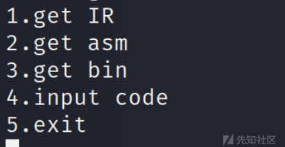

# 2023SCTF-Syclang-关于中间指令的分析 - 先知社区

2023SCTF-Syclang-关于中间指令的分析

- - -

2023SYCTF 的 Syclang 这道题还怪有意思的，作者写了一个简单的反编译器，将源代码输出中间指令、asm 等格式

[](https://xzfile.aliyuncs.com/media/upload/picture/20240124183012-8e2863c4-baa3-1.png)  
然后，我们今天要来头铁分析一下 IR 中间代码（个人感觉像 Go 语言 hhh）

主要调出几个典型的指令进行一个分析，然后就可以逆出这段程序的大致意思了

感觉分析完这个中间指令，对程序的理解又更进了一步  
程序的逻辑很简单，就是多个循环，加减加密，然后与密文比较。  
在文章的结束，将会把附件上传，大家也可以下载下来分析  
（作者水平有限，如有错误，请大佬指出）  
调了几个很典型的指令，CTF 题给了 800 多行代码，都是由这些指令组成的。

```plain
//声明一个结构体
STRUCT exp :
  ARRAY .key(int)[24]<+0>//int 类型，这里占 8 个字节，8*24=192
  ARRAY .L(int)[8]<+192>
  ARRAY .R(int)[8]<+256>
  ARRAY .X(int)[8]<+320>
```

定义函数

```plain
FUNCTION read - 8 :
  PARAM var2<+8>
LABEL Flabelread :

FUNCTION writes - 0 :
LABEL Flabelwrites :

FUNCTION writef - 0 :
LABEL Flabelwritef :

FUNCTION exit - 0 :
LABEL Flabelexit :
```

入口 main 函数  
char 类型在这里占一个字节，int 类型占了 8 字节  
<+n>这个表示偏移，理解一下就可以

```plain
FUNCTION main - 1640 :
  ARRAY var11(char)[24]<+0>//char 类型占一个字节
  STRUCT var22(exp)<+488>
  STRUCT var23(exp)<+872>
  STRUCT var24(exp)<+1256>
  STRUCT var25(exp)<+1640>
  ARG var11<+24>
  temp1 := CALL read  //调用函数，获取我们的 flag
  temp2 := #0
  var15<+56> := temp2
```

分析第一个循环结构，其他的循环结构都是类似的

```plain
//第一个循环，运算 1
LABEL label4 :
  temp4 := #24  //temp4=24  类似 go 语言的匿名变量
  IF var15<+56> < temp4 GOTO label3  //一个循环结构
  GOTO label2
LABEL label3 :
  temp5 := #0
  var12<+32> := temp5
  var16<+64> := var15<+56>
#!tempa := {#1}*{var16<+64>}  //这句就是将 某个变化的值赋值给一个临时的变量，理解为：tempa = var16 + 1 char 类型就是一个字节
  var12<+32> ::= var11<+1><+tempa>  //var12 = input[i]
  temp6 := #23
  temp7 := temp6 - var15<+56>
  var18<+80> := temp7
#!tempa := {#8}*{var18<+80>} //创建临时变量
  var22(@exp.key[0])<+8><+488><+tempa> := var12<+32> 
      //var22(@exp.key[0])<+8><+488>获得 exp 结构体数组的起始地址，exp.key[23-i] = var12 = input[i]
  temp3 := #1
  var15<+56> := var15<+56> + temp3
  GOTO label4

//第二个循环，运算 2
LABEL label2 :
  temp8 := #23
  var15<+56> := temp8
LABEL label11 :
  temp10 := #0
  IF var15<+56> > temp10 GOTO label10
  GOTO label9
.......//其他代码
```

一个循环可以提取出来 C 代码：

```plain
for (int i = 0; i < 24; i++) {
    var22.key[23 - i] = inputflag[i];
}
```

分析第二个循环结构

```plain
//第二个循环，运算 2
LABEL label2 :
  temp8 := #23
  var15<+56> := temp8
LABEL label11 :
  temp10 := #0
  IF var15<+56> > temp10 GOTO label10 //终止条件
  GOTO label9
LABEL label10 :
  var18<+80> := var15<+56>
#!tempa := {#8}*{var18<+80>}
  var19<+88> := var22(@exp.key[0])<+8><+488><+tempa>
  temp11 := #1
  temp12 := var15<+56> - temp11  // i-1
  var16<+64> := temp12
#!tempa := {#8}*{var16<+64>}
  var17<+72> := var22(@exp.key[0])<+8><+488><+tempa>
  temp13 := var19<+88> - var17<+72>
  var21<+104> := temp13
#!tempa := {#8}*{var15<+56>} //i
  var22(@exp.key[0])<+8><+488><+tempa> := var21<+104>  // exp.key[i] =exp.key[i] - exp.key[i-1]
  temp9 := #1
  var15<+56> := var15<+56> - temp9
  GOTO label11

//初始化数组区
LABEL label9 :
```

第二个循环转换为 c 代码如下：

```plain
for (int i = 23; i > 0; i--) {
    var22.key[i] = var22.key[i] - var22.key[i - 1];
}
```

初始化数组区，就是很常见的赋值

```plain
LABEL label9 :
  temp15 := #0
  var22(@exp.L[0])<+200><+488> := temp15
  temp17 := #8
  var22(@exp.R[0])<+264><+488> := temp17
  temp19 := #11
  var22(@exp.X[0])<+328><+488> := temp19
  temp21 := #15
  var22(@exp.L[1])<+208><+488> := temp21
  temp23 := #23
  var22(@exp.R[1])<+272><+488> := temp23
  temp25 := #0
  temp26 := #13
  temp27 := temp25 - temp26
  var22(@exp.X[1])<+336><+488> := temp27
  temp29 := #2
  var22(@exp.L[2])<+216><+488> := temp29
  temp31 := #11
  var22(@exp.R[2])<+280><+488> := temp31
  temp33 := #17
  var22(@exp.X[2])<+344><+488> := temp33
  temp35 := #10
  var22(@exp.L[3])<+224><+488> := temp35
  temp37 := #20
  var22(@exp.R[3])<+288><+488> := temp37
  temp39 := #0
  temp40 := #19
  temp41 := temp39 - temp40
  var22(@exp.X[3])<+352><+488> := temp41
......
```

其它的循环和赋值都是类似了，这里不在详细分析了  
这里贴一下，翻译后的大致伪代码  
感谢 s0rry 师傅的帮助~

```plain
typedef struct {
    long long int key[24];
    long long int L[8];
    long long int R[8];
    long long int X[8];
} exp;
int main() {
    exp var22;
    exp var23;
    exp var24;
    exp var25;

    var22.L[0] = 0;
    var22.R[0] = 8;
    var22.X[0] = 11;
    var22.L[1] = 15;
    var22.R[1] = 23;
    var22.X[1] = -13;
    var22.L[2] = 2;
    var22.R[2] = 11;
    var22.X[2] = 17;
    var22.L[3] = 10;
    var22.R[3] = 20;
    var22.X[3] = -19;
    var22.L[4] = 6;
    var22.R[4] = 13;
    var22.X[4] = 23;
    var22.L[5] = 9;
    var22.R[5] = 21;
    var22.X[5] = -29;
    var22.L[6] = 1;
    var22.R[6] = 19;
    var22.X[6] = 31;
    var22.L[7] = 4;
    var22.R[7] = 17;
    var22.X[7] = -37;

    var23.key[0] = 252;
    var23.key[1] = 352;
    var23.key[2] = 484;
    var23.key[3] = 470;
    var23.key[4] = 496;
    var23.key[5] = 487;
    var23.key[6] = 539;
    var23.key[7] = 585;
    var23.key[8] = 447;
    var23.key[9] = 474;
    var23.key[10] = 577;
    var23.key[11] = 454;
    var23.key[12] = 466;
    var23.key[13] = 345;
    var23.key[14] = 344;
    var23.key[15] = 486;
    var23.key[16] = 501;
    var23.key[17] = 423;
    var23.key[18] = 490;
    var23.key[19] = 375;
    var23.key[20] = 257;
    var23.key[21] = 203;
    var23.key[22] = 265;
    var23.key[23] = 125;

//初始化
    for (int i = 0; i < 24; i++) {
        var22.key[23 - i] = input[i];
    }

    for (int i = 23; i > 0; i--) {
        var22.key[i] = var22.key[i] - var22.key[i - 1];
    }
//对 flag 加密
    for (int i = 0; i < 8; i++) {
        var22.key[var22.L[i]] += var22.X[i];
        var22.key[var22.R[i]] -= var22.X[i];
    }

    for (int i = 1; i < 24; i++) {
        var22.key[i] += var22.key[i - 1];
    }

//对 var23 密文进行运算
    for (int i = 23; i > 0; i--) {
        var23.key[i] -= var23.key[i - 1];
    }

    for (int i = 0; i < 8; i++) {    
        var23.key[var22.L[i]] -= var22.key[i * 3];
        var23.key[var22.R[i]] += var22.key[i * 3];
    }

    for (int i = 1; i < 24; i++) {
        var23.key[i] += var23.key[i - 1];
    }

//比较密文和输入 flag 的密文
    for (int i = 0; i < 24; i++) {
        if (var22.key[i] != var23.key[i]) {
               exit;//不相等则退出
        }
    }
    return 0;
}
```

Sysclang.zip (0.036 MB) [下载附件](https://xzfile.aliyuncs.com/upload/affix/20240124183256-f01ec05a-baa3-1.zip)
