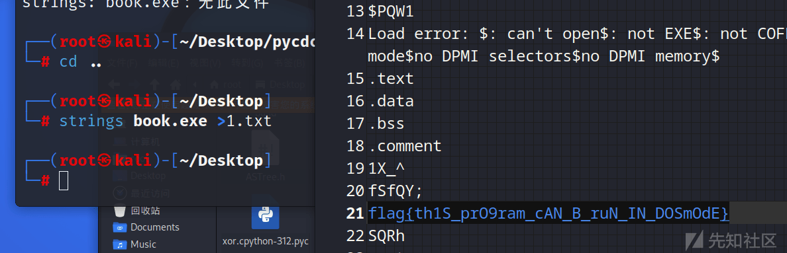
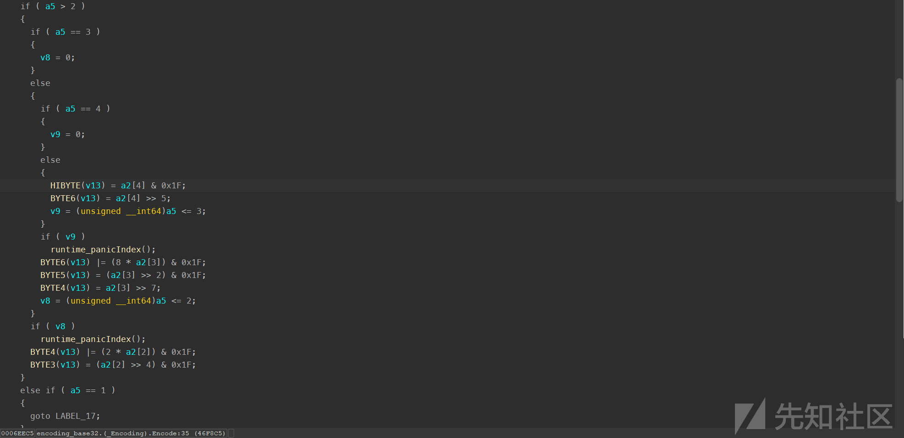
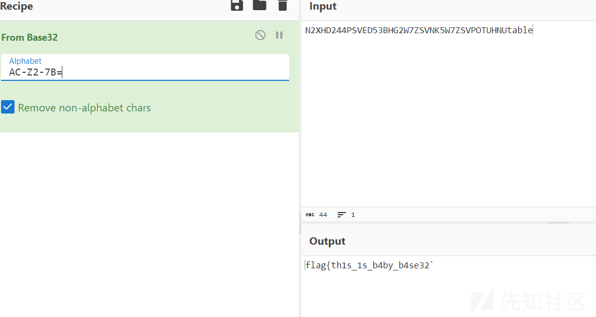
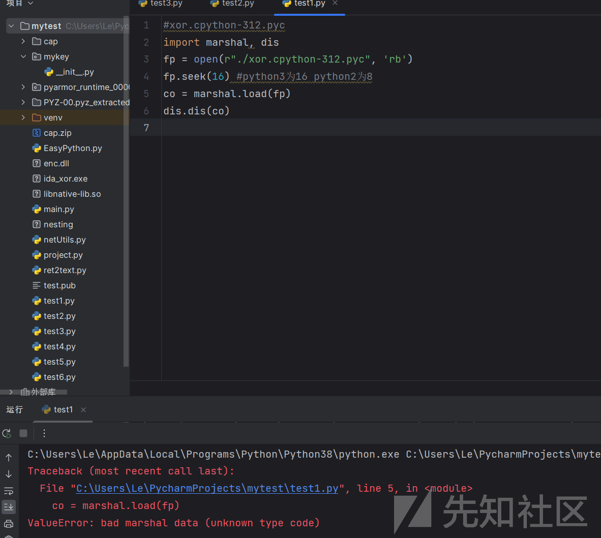
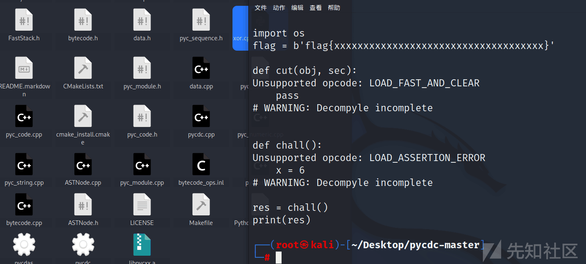
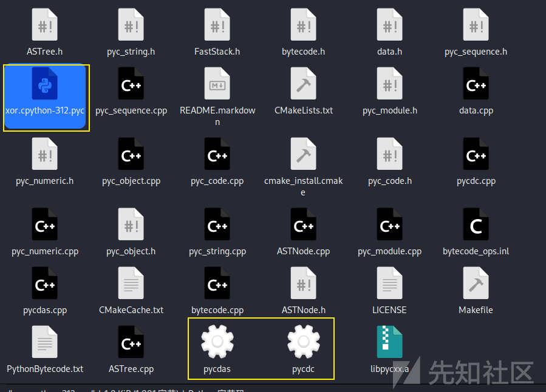

# 2023 工业信息安全技能大赛锦标赛-Reverse-wp 完整版 - 先知社区

2023 工业信息安全技能大赛锦标赛-Reverse-wp 完整版

- - -

时间 6 小时，题目比较基础，有一道困难的题目，也是花费我很长时间才在比赛结束前做出来，题目都包含  
主要是记录一下，工控大多数企业都会参加一些。

# magic\_book

IDA 打开 64 位，没看懂要干什么

string 一把嗦就可以看到 flag

很离谱的一道题目（很多工控都这样出，哈哈哈）

[](https://xzfile.aliyuncs.com/media/upload/picture/20240215160657-305689aa-cbd9-1.png)

# ez\_crypt

正常 RC4，采用了 rust 语言，动态调试即可  
动调密文  
923117B560C8486423FA0ABBC53493ECB9616C5D899BA01B47E267BBC7CBD8FE1C67BF98E2EE  
动态调试得到 key  
sierting

# babygo

base32 变表密文 N2XHD244PSVED53BHG2W7ZSVNK5W7ZSVPOTUHNUtable  
base32 表：AC-Z2-7B=

[](https://xzfile.aliyuncs.com/media/upload/picture/20240215160816-5f7ac340-cbd9-1.png)  
Cyber 解密

[](https://xzfile.aliyuncs.com/media/upload/picture/20240215160854-763b3e8e-cbd9-1.png)

# xor.cpython-312.pyc

前面的题目感觉十分简单，但是这道就是比较难了

```plain
flag{Th1s_1s_4n_funny_ch4llenge_lollllll~}
```

给出密文

```plain
$ python xor.cpython-312.pyc
[[154, 209, 184, 205, 152, 173, 85], 
[219, 163, 159, 245, 245, 245, 3], 
[244, 244, 153, 245, 164, 191, 126], 
[136, 241, 132, 245, 188, 173, 93], 
[197, 198, 139, 207, 190, 181, 31], 
[167, 206, 128, 197, 183, 183, 76], 
[157, 223, 145, 198, 180, 165, 87]]
```

python312 版本很新，一般的反编译工具不能编译，dis 也不可以

[](https://xzfile.aliyuncs.com/media/upload/picture/20240215161012-a4d03902-cbd9-1.png)

[](https://xzfile.aliyuncs.com/media/upload/picture/20240215161042-b63f12f8-cbd9-1.png)

pycdc 也失败了

因此还有最后一条路：使用 pycdc 的模块：pycdas

[](https://xzfile.aliyuncs.com/media/upload/picture/20240215161051-bb953232-cbd9-1.png)

```plain
./pycdas xor.pyc
```

得到

```plain
xor.cpython-312.pyc (Python 3.12)
[Code]
    File Name: .\xor.py
    Object Name: <module>
    Qualified Name: <module>
    Arg Count: 0
    Pos Only Arg Count: 0
    KW Only Arg Count: 0
    Stack Size: 3
    Flags: 0x00000000
    [Names]
        'os'
        'flag'
        'cut'
        'chall'
        'res'
        'print'
    [Locals+Names]
    [Constants]
        0
        None
        b'flag{xxxxxxxxxxxxxxxxxxxxxxxxxxxxxxxxxxxx}'
        [Code]
            File Name: .\xor.py
            Object Name: cut
            Qualified Name: cut
            Arg Count: 2
            Pos Only Arg Count: 0
            KW Only Arg Count: 0
            Stack Size: 7
            Flags: 0x00000003 (CO_OPTIMIZED | CO_NEWLOCALS)
            [Names]
                'range'
                'len'
            [Locals+Names]
                'obj'
                'sec'
                'i'
            [Constants]
                None
                0
            [Disassembly]
                0       RESUME                        0
                2       LOAD_GLOBAL                   1: NULL + range
                12      LOAD_CONST                    1: 0
                14      LOAD_GLOBAL                   3: NULL + len
                24      LOAD_FAST                     0: obj
                26      CALL                          1
                34      LOAD_FAST                     1: sec
                36      CALL                          3
                44      GET_ITER                      
                46      LOAD_FAST_AND_CLEAR           2
                48      SWAP                          2
                50      BUILD_LIST                    0
                52      SWAP                          2
                54      FOR_ITER                      10 (to 76)
                58      STORE_FAST                    2: i
                60      LOAD_FAST                     0: obj
                62      LOAD_FAST                     2: i
                64      LOAD_FAST                     2: i
                66      LOAD_FAST                     1: sec
                68      BINARY_OP                     0 (+)
                72      BINARY_SLICE                  
                74      LIST_APPEND                   2
                76      JUMP_BACKWARD                 12
                78      END_FOR                       
                80      SWAP                          2
                82      STORE_FAST                    2: i
                84      RETURN_VALUE                  
                86      SWAP                          2
                88      POP_TOP                       
                90      SWAP                          2
                92      STORE_FAST                    2: i
                94      RERAISE                       0
        [Code]
            File Name: .\xor.py
            Object Name: chall
            Qualified Name: chall
            Arg Count: 0
            Pos Only Arg Count: 0
            KW Only Arg Count: 0
            Stack Size: 6
            Flags: 0x00000003 (CO_OPTIMIZED | CO_NEWLOCALS)
            [Names]
                'flag'
                'startswith'
                'endswith'
                'cut'
                'os'
                'urandom'
                'append'
            [Locals+Names]
                'x'
                'm'
                'res'
                'pad'
                'i'
                'tmp'
            [Constants]
                None
                6
                b'flag{'
                b'}'
                0
                1
                2
                3
                4
                5
            [Disassembly]
                0       RESUME                        0
                2       LOAD_CONST                    1: 6
                4       STORE_FAST                    0: x
                6       LOAD_GLOBAL                   0: flag
                16      LOAD_ATTR                     3: cut
                36      LOAD_CONST                    2: b'flag{'
                38      CALL                          1
                46      POP_JUMP_IF_TRUE              2 (to 4)
                48      LOAD_ASSERTION_ERROR          
                50      RAISE_VARARGS                 1
                52      LOAD_GLOBAL                   0: flag
                62      LOAD_ATTR                     5: urandom
                82      LOAD_CONST                    3: b'}'
                84      CALL                          1
                92      POP_JUMP_IF_TRUE              2 (to 4)
                94      LOAD_ASSERTION_ERROR          
                96      RAISE_VARARGS                 1
                98      LOAD_GLOBAL                   7: NULL + cut
                108     LOAD_GLOBAL                   0: flag
                118     LOAD_FAST                     0: x
                120     CALL                          2
                128     STORE_FAST                    1: m
                130     BUILD_LIST                    0
                132     STORE_FAST                    2: res
                134     LOAD_GLOBAL                   9: NULL + os
                144     LOAD_ATTR                     10 <INVALID>
                164     LOAD_FAST                     0: x
                166     CALL                          1
                174     STORE_FAST                    3: pad
                176     LOAD_FAST                     1: m
                178     GET_ITER                      
                180     FOR_ITER                      288 (to 760)
                186     STORE_FAST                    4: i
                188     BUILD_LIST                    0
                190     STORE_FAST                    5: tmp
                192     LOAD_FAST                     5: tmp
                194     LOAD_ATTR                     13 <INVALID>
                214     LOAD_FAST                     4: i
                216     LOAD_CONST                    4: 0
                218     BINARY_SUBSCR                 
                222     LOAD_FAST                     4: i
                224     LOAD_CONST                    5: 1
                226     BINARY_SUBSCR                 
                230     BINARY_OP                     12 (^)
                234     LOAD_FAST                     4: i
                236     LOAD_CONST                    6: 2
                238     BINARY_SUBSCR                 
                242     BINARY_OP                     12 (^)
                246     LOAD_FAST                     3: pad
                248     LOAD_CONST                    4: 0
                250     BINARY_SUBSCR                 
                254     BINARY_OP                     12 (^)
                258     CALL                          1
                266     POP_TOP                       
                268     LOAD_FAST                     5: tmp
                270     LOAD_ATTR                     13 <INVALID>
                290     LOAD_FAST                     4: i
                292     LOAD_CONST                    7: 3
                294     BINARY_SUBSCR                 
                298     LOAD_FAST                     4: i
                300     LOAD_CONST                    8: 4
                302     BINARY_SUBSCR                 
                306     BINARY_OP                     12 (^)
                310     LOAD_FAST                     3: pad
                312     LOAD_CONST                    5: 1
                314     BINARY_SUBSCR                 
                318     BINARY_OP                     12 (^)
                322     LOAD_FAST                     3: pad
                324     LOAD_CONST                    6: 2
                326     BINARY_SUBSCR                 
                330     BINARY_OP                     12 (^)
                334     CALL                          1
                342     POP_TOP                       
                344     LOAD_FAST                     5: tmp
                346     LOAD_ATTR                     13 <INVALID>
                366     LOAD_FAST                     3: pad
                368     LOAD_CONST                    9: 5
                370     BINARY_SUBSCR                 
                374     LOAD_FAST                     4: i
                376     LOAD_CONST                    9: 5
                378     BINARY_SUBSCR                 
                382     BINARY_OP                     12 (^)
                386     LOAD_FAST                     3: pad
                388     LOAD_CONST                    5: 1
                390     BINARY_SUBSCR                 
                394     BINARY_OP                     12 (^)
                398     LOAD_FAST                     3: pad
                400     LOAD_CONST                    7: 3
                402     BINARY_SUBSCR                 
                406     BINARY_OP                     12 (^)
                410     CALL                          1
                418     POP_TOP                       
                420     LOAD_FAST                     5: tmp
                422     LOAD_ATTR                     13 <INVALID>
                442     LOAD_FAST                     4: i
                444     LOAD_CONST                    7: 3
                446     BINARY_SUBSCR                 
                450     LOAD_FAST                     3: pad
                452     LOAD_CONST                    7: 3
                454     BINARY_SUBSCR                 
                458     BINARY_OP                     12 (^)
                462     LOAD_FAST                     3: pad
                464     LOAD_CONST                    8: 4
                466     BINARY_SUBSCR                 
                470     BINARY_OP                     12 (^)
                474     LOAD_FAST                     3: pad
                476     LOAD_CONST                    5: 1
                478     BINARY_SUBSCR                 
                482     BINARY_OP                     12 (^)
                486     CALL                          1
                494     POP_TOP                       
                496     LOAD_FAST                     5: tmp
                498     LOAD_ATTR                     13 <INVALID>
                518     LOAD_FAST                     4: i
                520     LOAD_CONST                    9: 5
                522     BINARY_SUBSCR                 
                526     LOAD_FAST                     3: pad
                528     LOAD_CONST                    4: 0
                530     BINARY_SUBSCR                 
                534     BINARY_OP                     12 (^)
                538     LOAD_FAST                     4: i
                540     LOAD_CONST                    8: 4
                542     BINARY_SUBSCR                 
                546     BINARY_OP                     12 (^)
                550     LOAD_FAST                     3: pad
                552     LOAD_CONST                    5: 1
                554     BINARY_SUBSCR                 
                558     BINARY_OP                     12 (^)
                562     CALL                          1
                570     POP_TOP                       
                572     LOAD_FAST                     5: tmp
                574     LOAD_ATTR                     13 <INVALID>
                594     LOAD_FAST                     4: i
                596     LOAD_CONST                    6: 2
                598     BINARY_SUBSCR                 
                602     LOAD_FAST                     4: i
                604     LOAD_CONST                    8: 4
                606     BINARY_SUBSCR                 
                610     BINARY_OP                     12 (^)
                614     LOAD_FAST                     3: pad
                616     LOAD_CONST                    4: 0
                618     BINARY_SUBSCR                 
                622     BINARY_OP                     12 (^)
                626     LOAD_FAST                     3: pad
                628     LOAD_CONST                    5: 1
                630     BINARY_SUBSCR                 
                634     BINARY_OP                     12 (^)
                638     CALL                          1
                646     POP_TOP                       
                648     LOAD_FAST                     5: tmp
                650     LOAD_ATTR                     13 <INVALID>
                670     LOAD_FAST                     4: i
                672     LOAD_CONST                    6: 2
                674     BINARY_SUBSCR                 
                678     LOAD_FAST                     4: i
                680     LOAD_CONST                    4: 0
                682     BINARY_SUBSCR                 
                686     BINARY_OP                     12 (^)
                690     LOAD_FAST                     4: i
                692     LOAD_CONST                    8: 4
                694     BINARY_SUBSCR                 
                698     BINARY_OP                     12 (^)
                702     LOAD_FAST                     3: pad
                704     LOAD_CONST                    8: 4
                706     BINARY_SUBSCR                 
                710     BINARY_OP                     12 (^)
                714     CALL                          1
                722     POP_TOP                       
                724     LOAD_FAST                     2: res
                726     LOAD_ATTR                     13 <INVALID>
                746     LOAD_FAST                     5: tmp
                748     CALL                          1
                756     POP_TOP                       
                758     JUMP_BACKWARD                 291
                762     END_FOR                       
                764     LOAD_FAST                     2: res
                766     RETURN_VALUE                  
    [Disassembly]
        0       RESUME                        0
        2       LOAD_CONST                    0: 0
        4       LOAD_CONST                    1: None
        6       IMPORT_NAME                   0: os
        8       STORE_NAME                    0: os
        10      LOAD_CONST                    2: b'flag{xxxxxxxxxxxxxxxxxxxxxxxxxxxxxxxxxxxx}'
        12      STORE_NAME                    1: flag
        14      LOAD_CONST                    3: <CODE> cut
        16      MAKE_FUNCTION                 0
        18      STORE_NAME                    2: cut
        20      LOAD_CONST                    4: <CODE> chall
        22      MAKE_FUNCTION                 0
        24      STORE_NAME                    3: chall
        26      PUSH_NULL                     
        28      LOAD_NAME                     3: chall
        30      CALL                          0
        38      STORE_NAME                    4: res
        40      PUSH_NULL                     
        42      LOAD_NAME                     5: print
        44      LOAD_NAME                     4: res
        46      CALL                          1
        54      POP_TOP                       
        56      RETURN_CONST                  1: None
```

z3 解出来的还有问题  
但是知道了大致的加密逻辑

将其提取出来

```plain
m[0] ^ m[1] ^ m[2] ^ pad[0],
m[3] ^ m[4] ^ pad[1] ^ pad[2],
pad[5] ^ m[5] ^ pad[1] ^ pad[3],
m[3] ^ pad[3] ^ pad[4] ^ pad[1],
m[5] ^ pad[0] ^ m[4] ^ pad[1],
m[2] ^ m[4] ^ pad[0] ^ pad[1],
m[2] ^ m[0] ^ m[4] ^ pad[4]
```

多解

```plain
C:\Users\Le\AppData\Local\Programs\Python\Python38\python.exe C:\Users\Le\PycharmProjects\mytest\test5.py 
Solution for group 0:
m_0_0: 102
m_0_1: 108
m_0_2: 97
m_0_3: 103
m_0_4: 123
m_0_5: 84
Solution for group 1:
m_1_0: 81
m_1_1: 8
m_1_2: 115
m_1_3: 95
m_1_4: 49
m_1_5: 115
Solution for group 2:
m_2_0: 107
m_2_1: 0
m_2_2: 110
m_2_3: 95
m_2_4: 102
m_2_5: 117
Solution for group 3:
m_3_0: 0
m_3_1: 0
m_3_2: 121
m_3_3: 95
m_3_4: 99
m_3_5: 104
Solution for group 4:
m_4_0: 88
m_4_1: 0
m_4_2: 108
m_4_3: 101
m_4_4: 110
m_4_5: 103
Solution for group 5:
m_5_0: 56
m_5_1: 2
m_5_2: 108
m_5_3: 111
m_5_4: 108
m_5_5: 108
Solution for group 6:
m_6_0: 32
m_6_1: 32
m_6_2: 108
m_6_3: 108
m_6_4: 126
m_6_5: 125
Solution for pad:
Solution for group 0:
m_0_0: 102
m_0_1: 108
m_0_2: 97
m_0_3: 103
m_0_4: 123
m_0_5: 84
Solution for group 1:
m_1_0: 219
m_1_1: 130
m_1_2: 115
m_1_3: 95
m_1_4: 49
m_1_5: 115
Solution for group 2:
m_2_0: 244
m_2_1: 159
m_2_2: 110
m_2_3: 95
m_2_4: 102
m_2_5: 117
Solution for group 3:
m_3_0: 136
m_3_1: 136
m_3_2: 121
m_3_3: 95
m_3_4: 99
m_3_5: 104
Solution for group 4:
m_4_0: 197
m_4_1: 157
m_4_2: 108
m_4_3: 101
m_4_4: 110
m_4_5: 103
Solution for group 5:
m_5_0: 167
m_5_1: 157
m_5_2: 108
m_5_3: 111
m_5_4: 108
m_5_5: 108
Solution for group 6:
m_6_0: 61
m_6_1: 61
m_6_2: 108
m_6_3: 108
m_6_4: 126
m_6_5: 125
Solution for pad:
Solution for group 0:
m_0_0: 102
m_0_1: 108
m_0_2: 97
m_0_3: 103
m_0_4: 123
m_0_5: 84
Solution for group 1:
m_1_0: 218
m_1_1: 131
m_1_2: 115
m_1_3: 95
m_1_4: 49
m_1_5: 115
Solution for group 2:
m_2_0: 245
m_2_1: 158
m_2_2: 110
m_2_3: 95
m_2_4: 102
m_2_5: 117
Solution for group 3:
m_3_0: 137
m_3_1: 137
m_3_2: 121
m_3_3: 95
m_3_4: 99
m_3_5: 104
Solution for group 4:
m_4_0: 196
m_4_1: 156
m_4_2: 108
m_4_3: 101
m_4_4: 110
m_4_5: 103
Solution for group 5:
m_5_0: 166
m_5_1: 156
m_5_2: 108
m_5_3: 111
m_5_4: 108
m_5_5: 108
Solution for group 6:
m_6_0: 60
m_6_1: 60
m_6_2: 108
m_6_3: 108
m_6_4: 126
m_6_5: 125
Solution for pad:
Solution for group 0:
m_0_0: 102
m_0_1: 108
m_0_2: 97
m_0_3: 103
m_0_4: 123
m_0_5: 84
Solution for group 1:
m_1_0: 218
m_1_1: 131
m_1_2: 115
m_1_3: 95
m_1_4: 49
m_1_5: 115
Solution for group 2:
m_2_0: 245
m_2_1: 158
m_2_2: 110
m_2_3: 95
m_2_4: 102
m_2_5: 117
Solution for group 3:
m_3_0: 137
m_3_1: 137
m_3_2: 121
m_3_3: 95
m_3_4: 99
m_3_5: 104
Solution for group 4:
m_4_0: 197
m_4_1: 157
m_4_2: 108
m_4_3: 101
m_4_4: 110
m_4_5: 103
Solution for group 5:
m_5_0: 166
m_5_1: 156
m_5_2: 108
m_5_3: 111
m_5_4: 108
m_5_5: 108
Solution for group 6:
```

这里会用到解决形如：a =b ^ c

已知 a 和 b，求 c 的 z3 解题脚本

```plain
from z3 import *

# 已知的值
a = 157
b = 241

# 创建一个 BitVec 变量，表示 c
c = BitVec('c', 32)

# 创建求解器并添加约束
solver = Solver()
solver.add(a==b^c)

# 检查是否存在符合约束条件的解
if solver.check() == sat:
    model = solver.model()
    # 获取符合约束条件的解
    c_value = model[c].as_long()
    print("满足约束条件的 c 的值为：", c_value)
else:
    print("无法找到符合约束条件的 c 的值")
```

完整解密脚本

```plain
from z3 import *

# 定义每个数的位数
num_bits = 8

# 定义每组的数量
num_groups = 7
num_per_group = 6
res=[[154, 209, 184, 205, 152, 173, 85],
[219, 163, 159, 245, 245, 245, 3],
[244, 244, 153, 245, 164, 191, 126],
[136, 241, 132, 245, 188, 173, 93],
[197, 198, 139, 207, 190, 181, 31],
[167, 206, 128, 197, 183, 183, 76],
[157, 223, 145, 198, 180, 165, 87]]

# 定义 m 变量
m = [[BitVec(f'm_{i}_{j}', num_bits) for j in range(num_per_group)] for i in range(num_groups)]
#pad =[BitVec(f"pad_{i}",num_bits)for i in range(6)]
pad=[0]*6
pad[0]=241
pad[1]=70
pad[2]=139
pad[3]=197
pad[4]=41
pad[5]=111
# 定义求解器
solver = Solver()
solver.add(m[0][0]==0x66)
solver.add(m[0][1]==0x6c)
solver.add(m[0][2]==0x61)
solver.add(m[0][3]==0x67)
solver.add(m[0][4]==0x7b)
solver.add(m[0][5]==84)

# m[0][1]=0x6c
# m[0][2]=0x61
# m[0][3]=0x67
# m[0][4]=0x7b
#pad =[48, 167, 85, 131, 220, 30]
# 添加约束条件
for i in range(num_groups):
    tmp = [
        m[i][0] ^ m[i][1] ^ m[i][2] ^ pad[0],
        m[i][3] ^ m[i][4] ^ pad[1] ^ pad[2],
        pad[5] ^ m[i][5] ^ pad[1] ^ pad[3],
        m[i][3] ^ pad[3] ^ pad[4] ^ pad[1],
        m[i][5] ^ pad[0] ^ m[i][4] ^ pad[1],
        m[i][2] ^ m[i][4] ^ pad[0] ^ pad[1],
        m[i][2] ^ m[i][0] ^ m[i][4] ^ pad[4]
    ]

    # 添加等式约束
    for j in range(num_per_group):
        solver.add(tmp[j] == res[i][j])
# 检查是否存在解
while solver.check() == sat:
    # 获取解
    model = solver.model()
    if model[m[0][0]]==0x66 and model[m[0][1]]==0x6c and model[m[0][2]]==97 :
        for i in range(num_groups):
            print(f'Solution for group {i}:')
            for j in range(num_per_group):
                a=model[m[i][j]]
                print(f'm_{i}_{j}: {a}')
        print('Solution for pad:')
    # 防止得到相同的解
    solver.add(Or([m[i][j] != model[m[i][j]] for i in range(num_groups) for j in range(num_per_group)]))
```

然后再手动运算一下

```plain
from z3 import *

# 定义每个数的位数
num_bits = 8

# 定义每组的数量
num_groups = 7
num_per_group = 6
res=[[154, 209, 184, 205, 152, 173, 85],
[219, 163, 159, 245, 245, 245, 3],
[244, 244, 153, 245, 164, 191, 126],
[136, 241, 132, 245, 188, 173, 93],
[197, 198, 139, 207, 190, 181, 31],
[167, 206, 128, 197, 183, 183, 76],
[157, 223, 145, 198, 180, 165, 87]]

# 定义 m 变量
#m = [[BitVec(f'm_{i}_{j}', num_bits) for j in range(num_per_group)] for i in range(num_groups)]
pad =[BitVec(f"pad_{i}",num_bits)for i in range(6)]
# 定义求解器
solver = Solver()
m=[0]*6
m[0]=0x66
m[1]=0x6c
m[2]=0x61
m[3]=0x67
m[4]=0x7b
m[5]=84
# m[0][1]=0x6c
# m[0][2]=0x61
# m[0][3]=0x67
# m[0][4]=0x7b
#pad =[48, 167, 85, 131, 220, 30]
# 添加约束条件
pad=[0]*6
pad[0]=241
pad[1]=70
pad[2]=139
pad[3]=197
pad[4]=41
pad[5]=111
# print(m[0] ^ m[1] ^ m[2] ^ pad[0])
# print(m[3] ^ m[4] ^ pad[1] ^ pad[2])
# print(pad[5] ^ m[5] ^ pad[1] ^ pad[3])
# print(m[3] ^ pad[3] ^ pad[4] ^ pad[1])
# print(m[5] ^ pad[0] ^ m[4] ^ pad[1])
# print(m[2] ^ m[4] ^ pad[0] ^ pad[1])
# print(m[2] ^ m[0] ^ m[4] ^ pad[4])

s="kn_fu"
m[0]=108
m[1]=108
m[2]=108
m[3]=108
m[4]=126
m[5]=125
print(m[2]  ^ m[4] ^ pad[4])#最后 res[6] m[0]
print(m[0]  ^ m[2] ^ pad[0])#第一 res[0] m[1]
for i in m:
    print(chr(i),end="")
```

题目汇总.zip (2.687 MB) [下载附件](https://xzfile.aliyuncs.com/upload/affix/20240220110854-612323f0-cf9d-1.zip)
