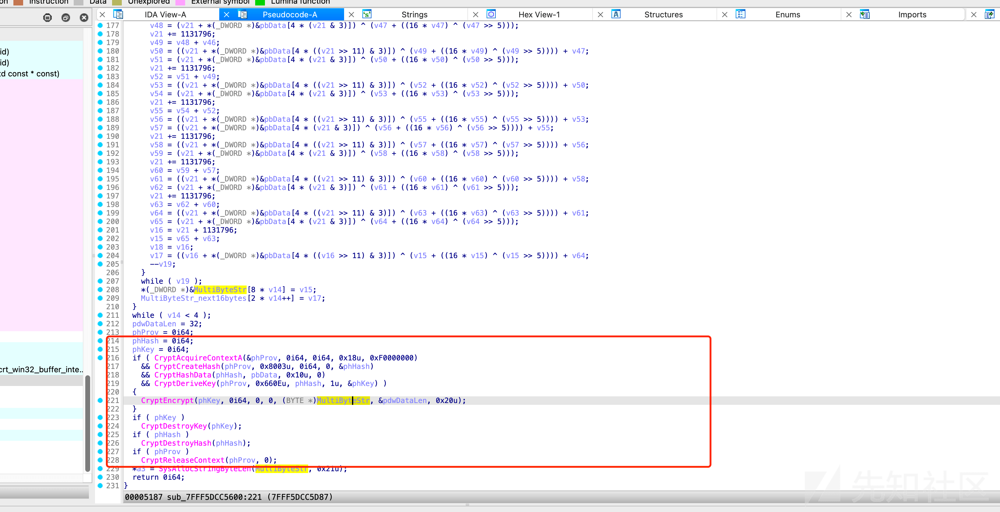
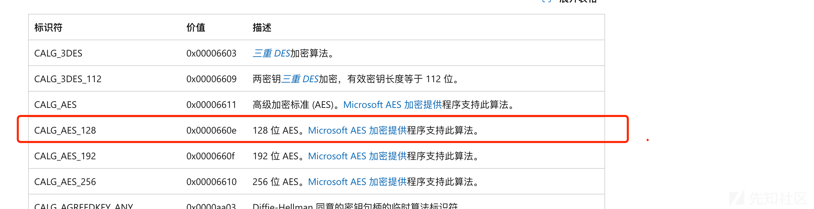
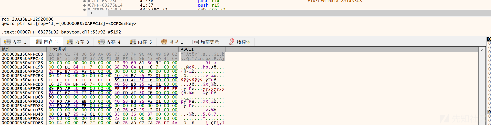
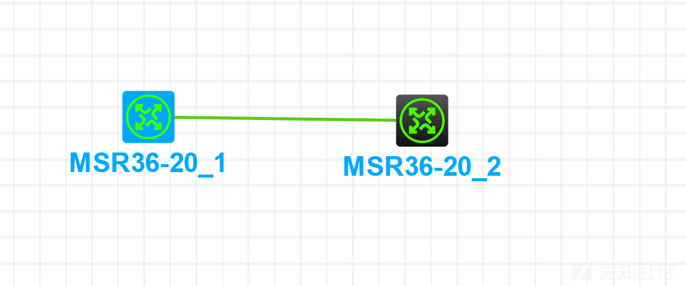
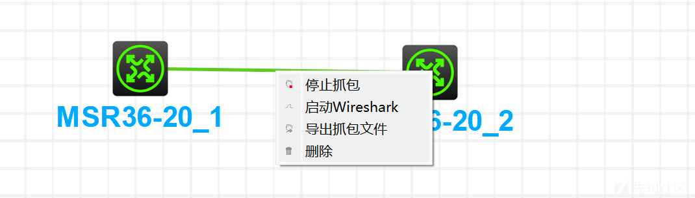
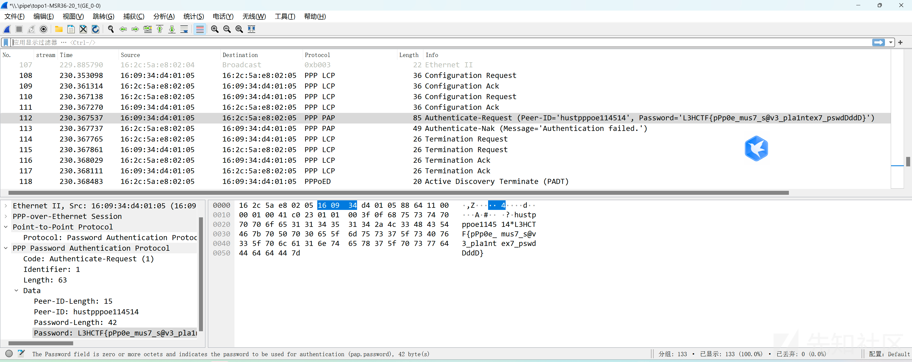

# 2024 L3HCTF-Reverse WP - 先知社区

2024 L3HCTF-Reverse WP

- - -

非首发，By W&M 联合战队  
社区有朋友上传了 L3 的 wp，但是少了 Re，特此补充一下  
这是该朋友的连接：[https://xz.aliyun.com/t/13601?time\_\_1311=mqmxnQ0QiQMDyDBqDTCZINqAI2KqGupD&alichlgref=https%3A%2F%2Fxz.aliyun.com%2Ftab%2F4](https://xz.aliyun.com/t/13601?time__1311=mqmxnQ0QiQMDyDBqDTCZINqAI2KqGupD&alichlgref=https%3A%2F%2Fxz.aliyun.com%2Ftab%2F4)

# ez\_rust

Rust Tauri 框架

[https://blog.yllhwa.com/2023/05/09/Tauri%20%E6%A1%86%E6%9E%B6%E7%9A%84%E9%9D%99%E6%80%81%E8%B5%84%E6%BA%90%E6%8F%90%E5%8F%96%E6%96%B9%E6%B3%95%E6%8E%A2%E7%A9%B6/](https://blog.yllhwa.com/2023/05/09/Tauri%20%E6%A1%86%E6%9E%B6%E7%9A%84%E9%9D%99%E6%80%81%E8%B5%84%E6%BA%90%E6%8F%90%E5%8F%96%E6%96%B9%E6%B3%95%E6%8E%A2%E7%A9%B6/)

能解压 rust 程序里面的前端源码

```plain
<!doctype html>
<html lang="en">
  <head>
    <meta charset="UTF-8" />
    <link rel="icon" type="image/svg+xml" href="/vite.svg" />
    <meta name="viewport" content="width=device-width, initial-scale=1.0" />
    <title>Tauri + Vue 3 App</title>
    <script type="module" crossorigin src="/assets/index-tWBcqYh-.js"></script>
    <link rel="stylesheet" crossorigin href="/assets/index-3z-7CGFf.css">
  </head>

  <body>
    <div id="app"></div>
  </body>
</html>
```

主逻辑

里面就是一个异或加 b64

```plain


import base64
a = base64.b64decode('JFYvMVU5QDoNQjomJlBULSQaCihTAFY=')
s = b'secret'
for i in range(len(a)):
    print(chr(a[i]^s[i%len(s)]),end='')
```

# babycom

应该是一个 XTEA

往上逆就行

[](https://xzfile.aliyuncs.com/media/upload/picture/20240209142550-11e51c4e-c714-1.png)

[](https://xzfile.aliyuncs.com/media/upload/picture/20240209142602-1889c996-c714-1.png)

AES : CryptDeriveKey(phProv, 0x660Eu, phHash, 1u, &phKey) )

0B AF 51 21 9C 52 10 89 3F 2C 34 30 87 13 C1 4C C1 7F 81 6E BA BD DF 43 1A F0 D7 DE 8E 66 B9 7C

2A B4 C1 74 D6 59 AA 05 73 10 7F 9C 40 49 99 62 3C 84 51 8F 3F 37 AB F1 0E FE 61 96 45 AD 41 6A

试一下 我解密的，我直接 eip 转走了

[](https://xzfile.aliyuncs.com/media/upload/picture/20240209142632-2ace5342-c714-1.png)

```plain
{

0x74C1B42A, 0x05AA59D6, 0x9C7F1073, 0x62994940, 0x8F51843C, 0xF1AB373F, 0x9661FE0E, 0x6A41AD45

};
```

```plain
#include <stdio.h>

void decry(unsigned int pbData[4], unsigned int MultiByteStr[8])
{
    unsigned int v14; // r11
    unsigned int v15; // r8d
    unsigned int v16; // r10d
    unsigned int v17; // r9d
    unsigned int v19; // r9d
    unsigned int delta = 1131796;
    unsigned int v66 = 0;
    v14 = 0;
    do
    {
        v15 = MultiByteStr[2 * v14];
        v16 = 0x228a280;
        v17 = MultiByteStr[2 * v14 + 1];
        v19 = 2;
        do
        {

            v66 = 16;
            do
            {
                v17 -= (((v15 << 4) ^ (v15 >> 5)) + v15) ^ (v16 + pbData[(v16 >> 11) & 3]);
                v16 -= delta;
                v15 -= (((v17 << 4) ^ (v17 >> 5)) + v17) ^ (v16 + pbData[v16 & 3]);// 0,1,2,3
                v66--;
            } while (v66);

            --v19;
        } while (v19);
        MultiByteStr[2 * v14] = v15;
        MultiByteStr[2 * v14++ + 1] = v17;
    } while (v14 < 4);
}

int main()
{
        unsigned int key[4] = { 0x1CD43EEA,0x47D7CB70,0xDBCA5E98,0x2B390C53 };
    unsigned int data[8] = {
        0x74C1B42A, 0x05AA59D6, 0x9C7F1073, 0x62994940, 0x8F51843C, 0xF1AB373F, 0x9661FE0E, 0x6A41AD45
        };

    decry(key, data);

    for (int i = 0; i < 8; i++)
    {
        printf("%x ", data[i]);
    }

        return 0;
}
```

# hhhc

需要解密 h3c 配置文件里的 pppoe 密码

misc 思路：路由器导入配置并抓包 pap 明文密码  
pppoe pap 是明文传输密码的协议。

只要是 h3c 的路由器（交换机不行，因为不支持 pppoe），都可以加载题目给出的加密的密码并且进行 pppoe 拨号。

因此，伪造一个 pppoe 服务端并且抓包 pppoe 客户端拨号时传输的密码即可。

安装 hcl 模拟器，关闭 hyperv 否则打不开

创建两个 router

[](https://xzfile.aliyuncs.com/media/upload/picture/20240209142233-9c865742-c713-1.png)

第一个 router 进行配置

```plain
system-view
interface Dialer0
ppp pap local-user hustpppoe114514 password cipher $c$3$3PbDU2m2/6Neiiz9iO+i641UKjafFMvrfphBc3fmrZ+9Q2TZu3g5l2Hlg1gJWO6ZQLJ4S+r85qU8EQpqQQ==
dialer bundle enable
dialer-group 2
dialer timer idle 0
dialer timer autodial 5
ip address ppp-negotiate
nat outbound
exit

interface GigabitEthernet0/0
port link-mode route
pppoe-client dial-bundle-number 0
exit
```

第二个 router 进行配置

```plain
system-view
interface virtual-template 1
ppp authentication-mode pap domain dm1
quit
interface gigabitethernet 0/0
pppoe-server bind virtual-template 1
quit
local-user hustpppoe114514 class network 
password cipher $c$3$3PbDU2m2/6Neiiz9iO+i641UKjafFMvrfphBc3fmrZ+9Q2TZu3g5l2Hlg1gJWO6ZQLJ4S+r85qU8EQpqQQ==
service-type ppp
quit
```

右键连线进行抓包  
[](https://xzfile.aliyuncs.com/media/upload/picture/20240209142133-78379ef0-c713-1.png)

[](https://xzfile.aliyuncs.com/media/upload/picture/20240209142131-77590500-c713-1.png)
