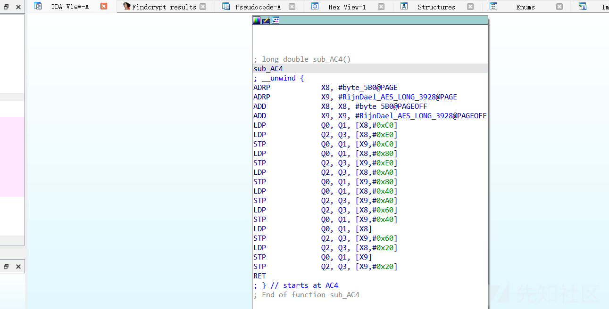

# 2024Hgame-babyAndroid 逆向分析 - 先知社区

2024Hgame-babyAndroid 逆向分析

- - -

## 前言

本案例来自 2024 年 Hgame 的一道 android 题，含有 so 层的算法调用，我们分析一下如何解题

必要的工具是 jadx、ida

## java 层代码分析

我们直接看 MainActivity.java 吧

### MainActivity.java

```plain
package com.feifei.babyandroid;

import android.os.Bundle;
import android.view.View;
import android.widget.Button;
import android.widget.EditText;
import android.widget.Toast;
import androidx.appcompat.app.AppCompatActivity;
import com.feifei.babyandroid.databinding.ActivityMainBinding;

/* loaded from: classes.dex */
public class MainActivity extends AppCompatActivity implements View.OnClickListener {
    private ActivityMainBinding binding;
    private Button enter;
    private EditText password;
    private EditText username;

    public native boolean check2(byte[] bArr, byte[] bArr2);

    static {
        System.loadLibrary("babyandroid");
    }

    /* JADX INFO: Access modifiers changed from: protected */
    @Override // androidx.fragment.app.FragmentActivity, androidx.activity.ComponentActivity, androidx.core.app.ComponentActivity, android.app.Activity
    public void onCreate(Bundle bundle) {
        super.onCreate(bundle);
        ActivityMainBinding inflate = ActivityMainBinding.inflate(getLayoutInflater());
        this.binding = inflate;
        setContentView(inflate.getRoot());
        this.username = (EditText) findViewById(R.id.username);
        this.password = (EditText) findViewById(R.id.password);
        Button button = (Button) findViewById(R.id.enter);
        this.enter = button;
        button.setOnClickListener(this);
    }

    @Override // android.view.View.OnClickListener
    public void onClick(View view) {
        byte[] bytes = this.username.getText().toString().getBytes();
        byte[] bytes2 = this.password.getText().toString().getBytes();
        if (new Check1(getResources().getString(R.string.key).getBytes()).check(bytes)) {
            if (check2(bytes, bytes2)) {
                Toast.makeText(this, "Congratulate!!!^_^", 0).show();
                return;
            } else {
                Toast.makeText(this, "password wrong!!!>_<", 0).show();
                return;
            }
        }
        Toast.makeText(this, "username wrong!!!>_<", 0).show();
    }
}
```

在 click 里面有两个 check.会对我们输入的 username 和 password 进行 check，目标是弹出 Congratulate!!!^\_^。

### check1.java

```plain
package com.feifei.babyandroid;

import java.util.Arrays;

/* loaded from: classes.dex */
public class Check1 {
    private byte[] S = new byte[256];
    private int i;
    private int j;

    public Check1(byte[] bArr) {
        for (int i = 0; i < 256; i++) {
            this.S[i] = (byte) i;
        }
        int i2 = 0;
        for (int i3 = 0; i3 < 256; i3++) {
            byte[] bArr2 = this.S;
            i2 = (i2 + bArr2[i3] + bArr[i3 % bArr.length]) & 255;
            swap(bArr2, i3, i2);
        }
        this.i = 0;
        this.j = 0;
    }

    private void swap(byte[] bArr, int i, int i2) {
        byte b = bArr[i];
        bArr[i] = bArr[i2];
        bArr[i2] = b;
    }

    public byte[] encrypt(byte[] bArr) {
        byte[] bArr2 = new byte[bArr.length];
        for (int i = 0; i < bArr.length; i++) {
            int i2 = (this.i + 1) & 255;
            this.i = i2;
            int i3 = this.j;
            byte[] bArr3 = this.S;
            int i4 = (i3 + bArr3[i2]) & 255;
            this.j = i4;
            swap(bArr3, i2, i4);
            byte[] bArr4 = this.S;
            bArr2[i] = (byte) (bArr4[(bArr4[this.i] + bArr4[this.j]) & 255] ^ bArr[i]);
        }
        return bArr2;
    }

    public boolean check(byte[] bArr) {
        return Arrays.equals(new byte[]{-75, 80, 80, 48, -88, 75, 103, 45, -91, 89, -60, 91, -54, 5, 6, -72}, encrypt(bArr));
    }
}
```

很明显是没有魔改的 rc4

### key

```plain
getResources().getString(R.string.key).getBytes()
```

可以看到是从 getResources 拿的 key，那么我们可以去 res value.xml 下面找，翻了一下没找到，估计是动态解密的，直接 frida hook 一下就可以了

### frida\_hook.js

```plain
function hook_java(){
    Java.perform(function(){
        hook_key()

    })
}
function hook_native(){

}
function hook_key(){
    // 找到类的引用
    var targetClass = Java.use("android.content.res.Resources");

    // 找到目标方法
    var targetMethod = "getString";

    // hook 目标方法
    targetClass[targetMethod].overload("int").implementation = function(resourceId) {
        console.log("getResources().getString called with resource ID: " + resourceId);

        var result = this.getString(resourceId);

        console.log("Result of getResources().getString: " + result);
        // 3e1fel
        return result;
    };
}
function main(){
    hook_java();
}

setImmediate(main)
```

拿到 key 3e1fel

### get\_username.py

```plain
class RC4:
    def __init__(self, key):
        self.S = list(range(256))
        self.key = key
        self.key_schedule()

    def key_schedule(self):
        j = 0
        for i in range(256):
            j = (j + self.S[i] + self.key[i % len(self.key)]) % 256
            self.S[i], self.S[j] = self.S[j], self.S[i]

    def encrypt(self, data):
        i = 0
        j = 0
        output = []

        for byte in data:
            i = (i + 1) % 256
            j = (j + self.S[i]) % 256
            self.S[i], self.S[j] = self.S[j], self.S[i]
            output.append((byte ^ self.S[(self.S[i] + self.S[j]) % 256])%256)

        return output

    def decrypt(self, data):
        # RC4 加密和解密使用相同的操作
        return self.encrypt(data)

# 示例用法
if __name__ == "__main__":
    key = b"3e1fel"
    rc4 = RC4(key)

    ciphertext = [-75, 80, 80, 48, -88, 75, 103, 45, -91, 89, -60, 91, -54, 5, 6, -72]
    decrypted_text = rc4.decrypt(ciphertext)

    print("Decrypted Text:", decrypted_text)
    #G>IkH<aHu5FE3GSV
```

**G>IkH<aHu5FE3GSV**

接着是 so 层

## so 层代码分析

动态注册

[](https://xzfile.aliyuncs.com/media/upload/picture/20240213102222-b8832352-ca16-1.png)

我们 hook registernatives 来确认一下函数偏移，

### hook.js

```plain
function hook_jni_7(){
    Java.perform(function(){
        var symbols = Process.getModuleByName("libart.so").enumerateSymbols();
        var RegisterNatives_addr = NULL;
        for (var index = 0; index < symbols.length; index++) {
            const symbol = symbols[index];
            if (symbol.name.indexOf("CheckJNI")==-1 &&  symbol.name.indexOf("RegisterNatives") >=0){
                RegisterNatives_addr = symbol.address;
            }

        }

        console.log("RegisterNatives_addr :",RegisterNatives_addr);

        Interceptor.attach(RegisterNatives_addr,{
            onEnter:function(args){
                var env = Java.vm.tryGetEnv();
                var class_name = env.getClassName(args[1]);
                console.log("class_name ",class_name)
                var method_count = args[3].toInt32();
                for (var index = 0; index < method_count; index++) {
                    var method_name = args[2].add(Process.pointerSize*3*index).readPointer().readCString();
                    console.log("method_name ",method_name);

                    var signature = args[2].add(Process.pointerSize*3*index).add(Process.pointerSize).readPointer().readCString();
                    console.log("signature ",signature);

                    var fnPtr = args[2].add(Process.pointerSize*3*index).add(Process.pointerSize*2).readPointer();
                    console.log("fnPtr ",fnPtr);

                    var modeule = Process.findModuleByAddress(fnPtr);
                    console.log("modeule ",JSON.stringify(modeule))

                    console.log(" func in IDA addr 32 :",fnPtr.sub(modeule.base).sub(1))
                    console.log(" func in IDA addr 64 :",fnPtr.sub(modeule.base))
                }

            },onLeave:function(retval){

            }
        })

    });
}
setImmediate(hook_jni_7);
```

结果如下：

```plain
[Pixel::com.feifei.babyandroid]-> RegisterNatives_addr : 0x7393c3968c
class_name  com.feifei.babyandroid.MainActivity
method_name  check2
signature  ([B[B)Z
fnPtr  0x737bc9ab18
modeule  {"name":"libbabyandroid.so","base":"0x737bc9a000","size":16384,"path":"/data/app/com.feifei.babyandroid-7xPEumuUSZXKdqoEsZ28zQ==/base.apk!/lib/arm64-v8a/libbabyandroid.so"}
 func in IDA addr 32 : 0xb17
 func in IDA addr 64 : 0xb18
```

接下来是代码阅读

### 密文所在

[](https://xzfile.aliyuncs.com/media/upload/picture/20240213102202-ac9183b8-ca16-1.png)

### 特征量观察

发现是 aes

[](https://xzfile.aliyuncs.com/media/upload/picture/20240213102133-9af899c0-ca16-1.png)

## getflag

[](https://xzfile.aliyuncs.com/media/upload/picture/20240213102107-8b524a8e-ca16-1.png)
