# 52PoJie 论坛 2024 春节红包-Web 解题思路 - 先知社区

52PoJie 论坛 2024 春节红包-Web 解题思路

- - -

# 0# 概述

最近刷了刷公众号，偶然看到吾爱破解论坛官方公众号发布了这么一篇文章

[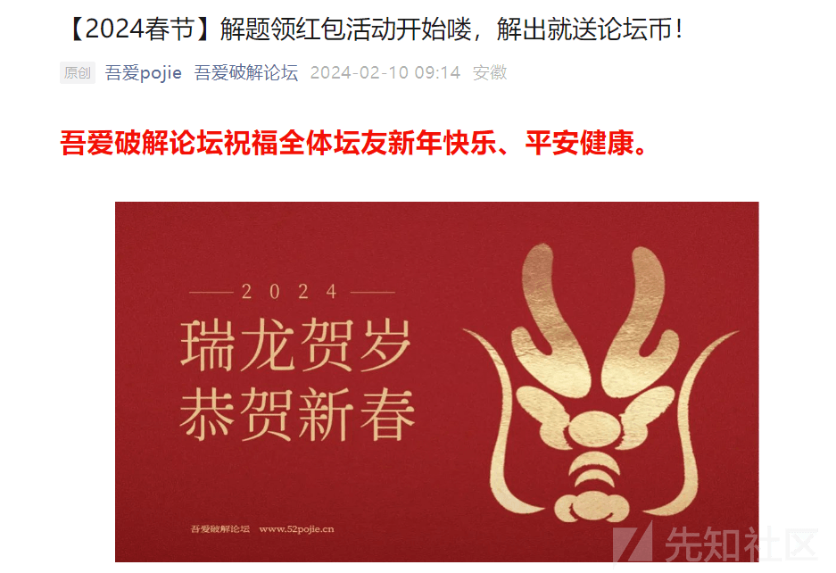](https://xzfile.aliyuncs.com/media/upload/picture/20240220113050-71f1edc6-cfa0-1.png)

咦，有春节红包领耶，就点进去看了看，原来是 52pojie 论坛举办的解题领红包活动

官方论坛帖子链接：[https://www.52pojie.cn/thread-1889163-1-1.html](https://www.52pojie.cn/thread-1889163-1-1.html)

[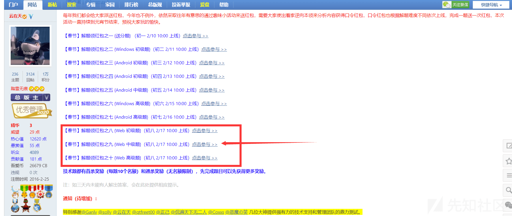](https://xzfile.aliyuncs.com/media/upload/picture/20240220113113-7f546f2a-cfa0-1.png)

总共有静态 Flag 十二个（Flag1-Flag12），以及动态 Flag 三个（FlagA、FlagB、FlagC）

由于我最近眼睛感染了急性结膜炎，在医院和亲戚家里跑来跑去，所以也就 17 号做了一下午，共做出 10 个静态 Flag 和 2 个动态 Flag

今天眼睛好一点了，就来写一下我自己是如何解其中 Web 题的吧

# 1# 解题过程

首先，去吾爱破解论坛接任务：[https://www.52pojie.cn/home.php?mod=task&do=view&id=34](https://www.52pojie.cn/home.php?mod=task&do=view&id=34)

接完任务会给以下信息：

> 您的 UID: 14xxx58  
> 仔细查看视频和视频下方的介绍链接获得信息：[https://www.bilibili.com/video/BV1ap421R7VS/](https://www.bilibili.com/video/BV1ap421R7VS/)

## 1.1 Flag3

首先视频开头有一个噪点的页面，仔细用肉眼就可以看到一个 Flag 的图像  
Flag3 就隐藏在噪点之中，我通过剪辑视频放慢速度，可以看到如下画面：

[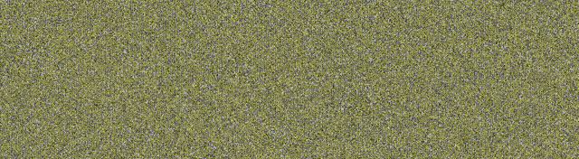](https://xzfile.aliyuncs.com/media/upload/picture/20240220113139-8f1f5f28-cfa0-1.gif)

```plain
flag3{GRsgk2}
```

## 1.2 Flag1

在视频接下来的淡入淡出效果，感觉有蹊跷，发现背景存在 Flag，放慢看：

[](https://xzfile.aliyuncs.com/media/upload/picture/20240220113153-973aa546-cfa0-1.gif)

```plain
flag1{52pj2024}
```

## 1.3 拿到 Web 题目地址

接着，视频的“吾爱破解”四个字，分别变成了二维码的四分之一，如下

[](https://xzfile.aliyuncs.com/media/upload/picture/20240220113204-9d8d2e82-cfa0-1.png)  
[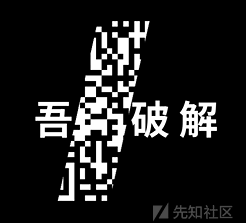](https://xzfile.aliyuncs.com/media/upload/picture/20240220113213-a32241b6-cfa0-1.png)  
[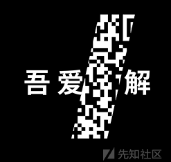](https://xzfile.aliyuncs.com/media/upload/picture/20240220113221-a7f4bf8e-cfa0-1.png)  
[](https://xzfile.aliyuncs.com/media/upload/picture/20240220113229-aca9f7ba-cfa0-1.png)

将每一部分截图出来后，进行抠图拼接，最后是这样子的

[](https://xzfile.aliyuncs.com/media/upload/picture/20240220113237-b1bbbc84-cfa0-1.png)

二维码解码后，得到 Web 题目地址：[https://2024challenge.52pojie.cn](https://2024challenge.52pojie.cn/)

## 1.4 Flag7

[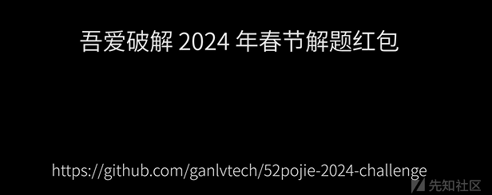](https://xzfile.aliyuncs.com/media/upload/picture/20240220113249-b893243e-cfa0-1.png)

视频最后，讲了会将题目源码放到 Github 开源仓库：[https://github.com/ganlvtech/52pojie-2024-challenge](https://github.com/ganlvtech/52pojie-2024-challenge)

随后打开仓库看了一眼，发现了更新了四次，觉得有蹊跷，点开记录一看

[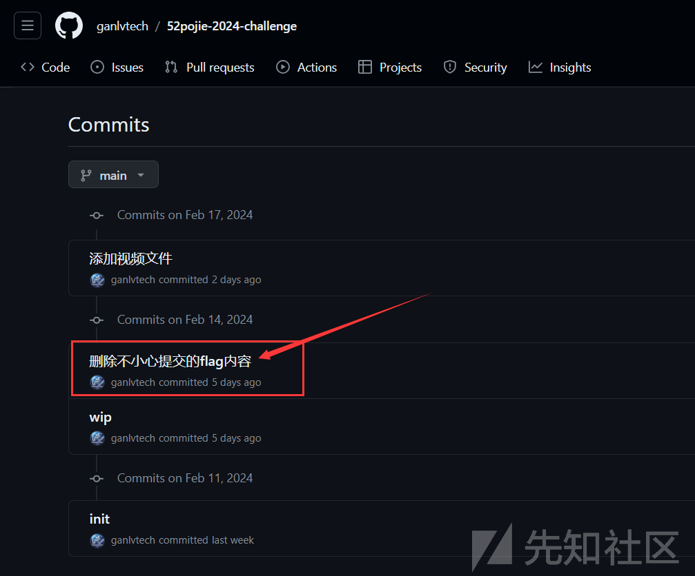](https://xzfile.aliyuncs.com/media/upload/picture/20240220113301-bff84dee-cfa0-1.png)

[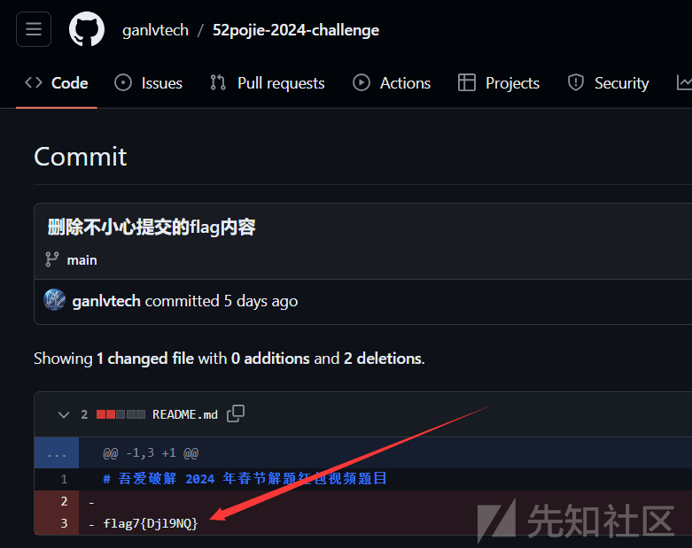](https://xzfile.aliyuncs.com/media/upload/picture/20240220113311-c59496cc-cfa0-1.png)

```plain
flag7{Djl9NQ}
```

## 1.5 Flag2 和 FlagA

上面拿到了一个 Web 题目地址，打开看看：[https://2024challenge.52pojie.cn](https://2024challenge.52pojie.cn/)

[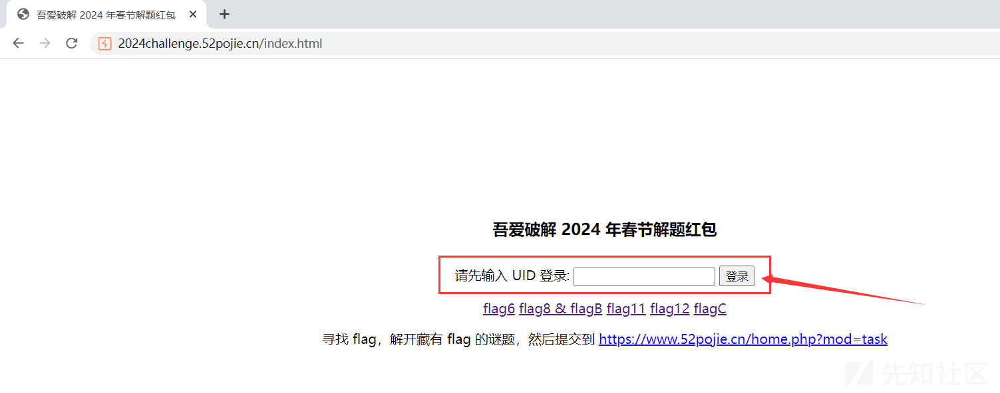](https://xzfile.aliyuncs.com/media/upload/picture/20240220113323-cd165c78-cfa0-1.png)

发现需要输入自己的 UID 进行登录，索性输入任务给的 UID 登录并用 Burp Suite 抓包

先是发现了动态 FlagA，但看样子是加密的

[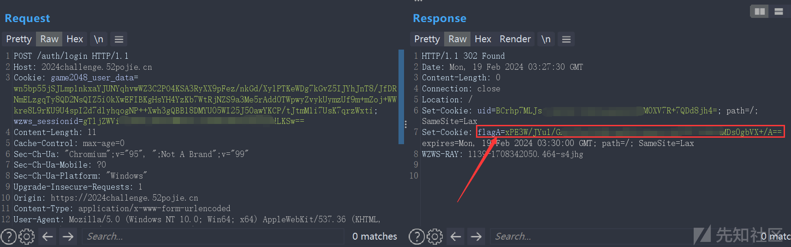](https://xzfile.aliyuncs.com/media/upload/picture/20240220113336-d4b268d2-cfa0-1.png)

然后发现跳转返回包的头部存在 Flag2

[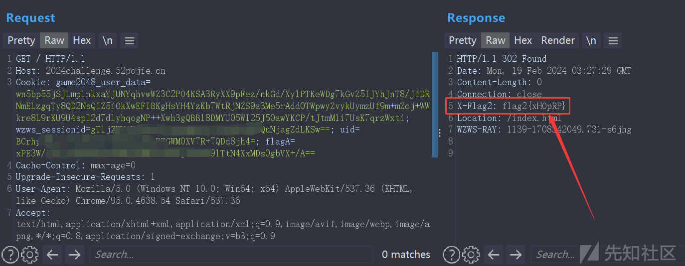](https://xzfile.aliyuncs.com/media/upload/picture/20240220113346-daee4a18-cfa0-1.png)

```plain
flag2{xHOpRP}
```

但是动态 FlagA 我跑了半天都解密不出来，真的是醉了，继续观察数据包，发现了这一个接口

[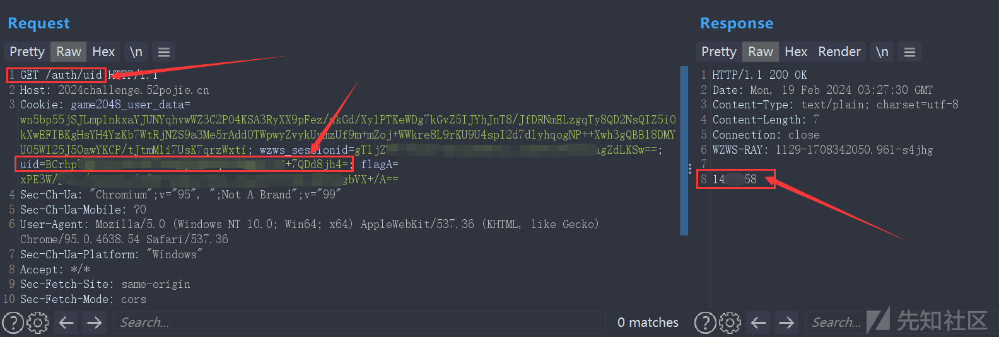](https://xzfile.aliyuncs.com/media/upload/picture/20240220113402-e4277cc6-cfa0-1.png)

发现 Cookie 字段存在 uid 的值，而且接口返回的正是真实 UID，我就想可能这是一个解密的数据包。。。将 uid 的值替换为 FlagA 的值，发包，成功获得 FlagA 的解密值

[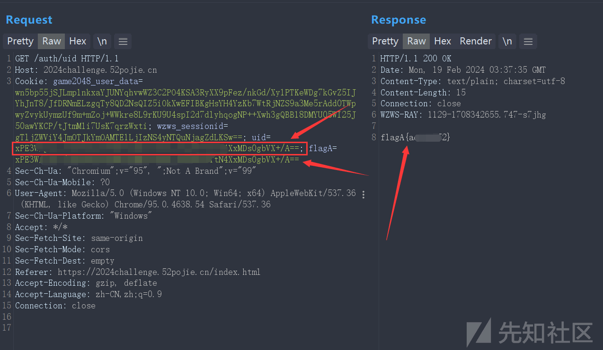](https://xzfile.aliyuncs.com/media/upload/picture/20240220113414-eb970044-cfa0-1.png)

```plain
flagA{aecxxx52}
```

注：FlagA 真的有点脑洞，我跑了一下午的 `Ciphey` 愣是没有解密出来，人都快傻了，最后还是重新观察数据包才想到这种可能性的

[](https://xzfile.aliyuncs.com/media/upload/picture/20240220113435-f7aed726-cfa0-1.png)

但最后还是抢到红包啦，开心哈哈~

## 1.6 Flag4 和 Flag10

按照我多年打 CTF 的经验，果断查看网页源代码

[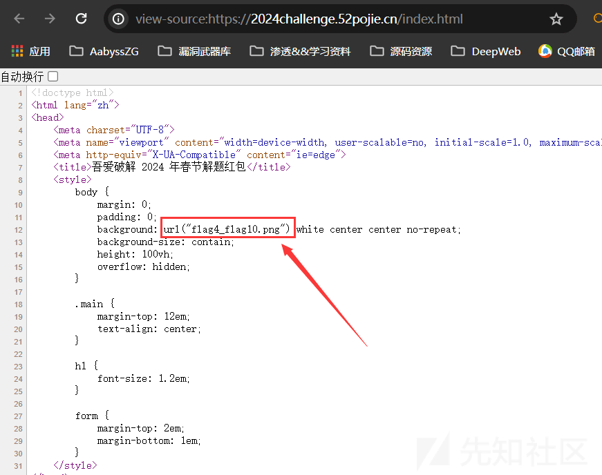](https://xzfile.aliyuncs.com/media/upload/picture/20240220113452-01ea0404-cfa1-1.png)

果然发现一张图片，遂访问图片，拿到 Flag4：[https://2024challenge.52pojie.cn/flag4\_flag10.png](https://2024challenge.52pojie.cn/flag4_flag10.png)

[](https://xzfile.aliyuncs.com/media/upload/picture/20240220113505-097d0766-cfa1-1.png)

```plain
flag4{YvJZNS}
```

但是 Flag10 呢？因为是图片，马上想到了图片隐写，按我多年打 CTF 的经验，直接上图片隐写工具 `StegSolve`

[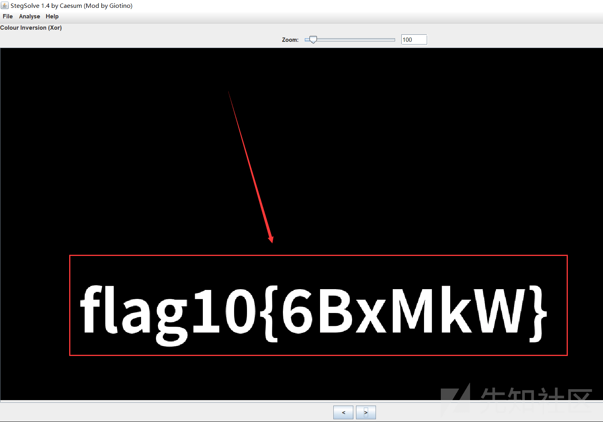](https://xzfile.aliyuncs.com/media/upload/picture/20240220113517-10c25d50-cfa1-1.png)

```plain
flag10{6BxMkW}
```

## 1.7 Flag5 和 Flag9

再仔细查看网页源代码，发现这一处地方：

[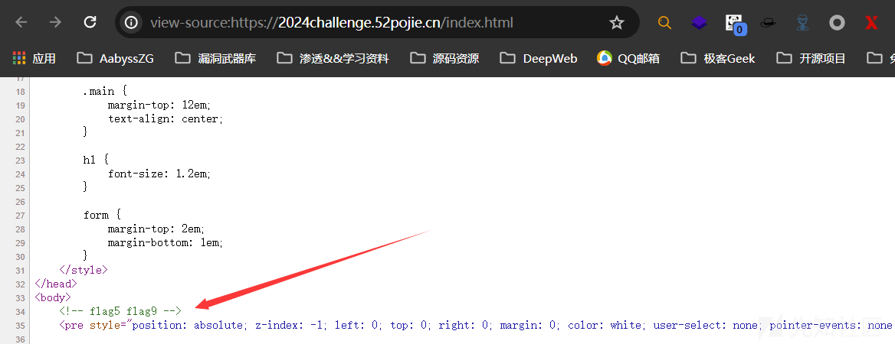](https://xzfile.aliyuncs.com/media/upload/picture/20240220113530-186819c8-cfa1-1.png)

于是复制下来，发现里面暗藏字符串，直接通过替换将多余字符串删掉：

[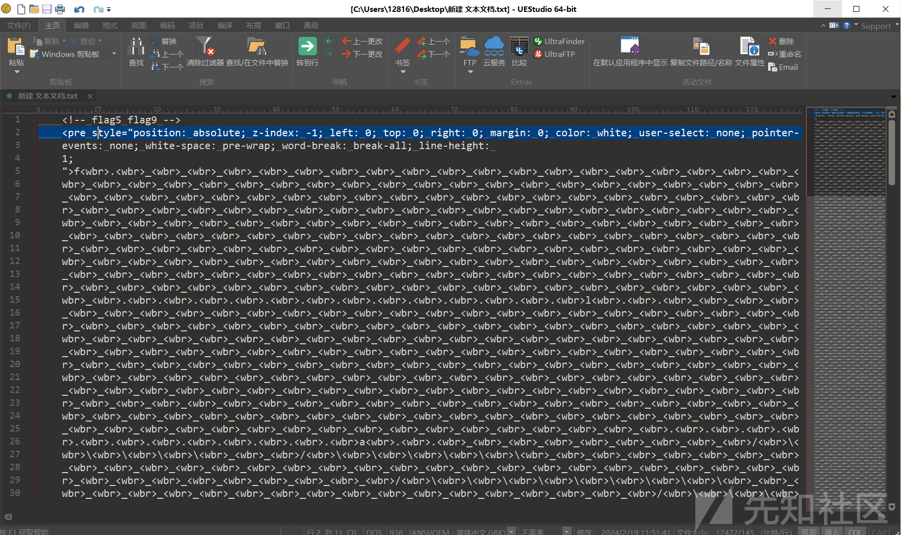](https://xzfile.aliyuncs.com/media/upload/picture/20240220113543-2035711e-cfa1-1.png)

[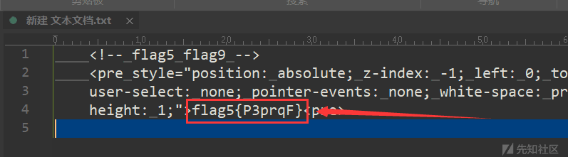](https://xzfile.aliyuncs.com/media/upload/picture/20240220113555-276300fa-cfa1-1.png)

```plain
flag5{P3prqF}
```

那 Flag9 又在哪里呢？？看到 HTML 代码里面有很多 `_` 和 `/` 还有 `\`，我感觉是 ASCII 字符串拼成的图形，遂整理代码，删掉多余的内容，HTML 代码如下：

```plain
<html><pre style="position: absolute; z-index: -1; left: 0; top: 0; right: 0; margin: 0; color: red; user-select: none; pointer-events: none; white-space: pre-wrap; word-break: break-all; line-height: 1;">
____________________________________________________________________________________________________________________________________________________________________________________________________________________________________________________________________________________________________________________________________________________________________________________________________________________________________/\\\\\__/\\\\\\_____________________________________/\\\\\\\\\__________________/\\\________/\\\__/\\\________/\\\__/\\\\\\\\\\\\\\\_____/\\\\\\\\\_____/\\\______________/\\\________/\\\___________________/\\\///__\////\\\___________________________________/\\\///////\\\________/\\\\\_\/\\\_____/\\\//__\/\\\_______\/\\\_\///////\\\/////____/\\\\\\\\\\\\\__\/\\\_____________\/\\\_____/\\\//___/\\\\\__________/\\\_________\/\\\_____________________/\\\\\\\\____/\\\______\//\\\_____/\\\///__\/\\\__/\\\//_____\/\\\_______\/\\\_______\/\\\________/\\\/////////\\\_\/\\\_____________\/\\\__/\\\//_____\////\\\______/\\\\\\\\\______\/\\\_____/\\\\\\\\\_____/\\\////\\\__\//\\\_____/\\\\\____\//\\\____\/\\\\\\//\\\_____\/\\\\\\\\\\\\\\\_______\/\\\_______\/\\\_______\/\\\_\/\\\_____________\/\\\\\\//\\\________/\\\______\////\\\//_______\/\\\____\////////\\\___\//\\\\\\\\\___\///\\\\\\\\/\\\__/\\\\\\_____\/\\\//_\//\\\____\/\\\/////////\\\_______\/\\\_______\/\\\\\\\\\\\\\\\_\/\\\_____________\/\\\//_\//\\\______\//\\\\\\_____\/\\\_________\/\\\______/\\\\\\\\\\___\///////\\\_____\////////\/\\\_\/////\\\____\/\\\____\//\\\___\/\\\_______\/\\\_______\/\\\_______\/\\\/////////\\\_\/\\\_____________\/\\\____\//\\\______/\\\///______\/\\\_________\/\\\_____/\\\/////\\\___/\\_____\\\___/\\________/\\\______/\\\_____\/\\\_____\//\\\__\/\\\_______\/\\\_______\/\\\_______\/\\\_______\/\\\_\/\\\_____________\/\\\_____\//\\\____\//\\\________\/\\\_______/\\\\\\\\\_\//\\\\\\\\/\\_\//\\\\\\\\___\//\\\\\\\\\\\/______\///\\\\\_\/\\\______\//\\\_\/\\\_______\/\\\_______\/\\\_______\/\\\_______\/\\\_\/\\\\\\\\\\\\\\\_\/\\\______\//\\\__/\\\\\_________\///_______\/////////___\////////\//___\////////_____\///////////__________\/////__\///________\///__\///________\///________\///________\///________\///__\///////////////__\///________\///__\/////____________________________________________________________________________________________________________________________________________________________________________________________________________________________________________________________________________________________________________________________________________________________________________________________________________________________________</pre>
</html>
```

调整了一下宽度，没几下 Flag9 就显形了

[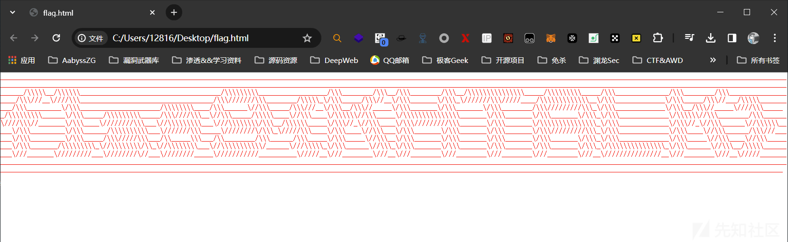](https://xzfile.aliyuncs.com/media/upload/picture/20240220113616-342ac9b2-cfa1-1.png)

```plain
flag9{KHTALK}
```

## 1.8 Flag6

再回头看 Web 题目网站，可以找到 Flag6 的子页面：[https://2024challenge.52pojie.cn/flag6/index.html](https://2024challenge.52pojie.cn/flag6/index.html)

主体代码是以下 JavaScript，主要是用作爆破指定 MD5 的明文：

```plain
document.querySelector('button').addEventListener('click', () => {
        const t0 = Date.now();
        for (let i = 0; i < 1e8; i++) {
            if ((i & 0x1ffff) === 0x1ffff) {
                const progress = i / 1e8;
                const t = Date.now() - t0;
                console.log(`${(progress * 100).toFixed(2)}% ${Math.floor(t / 1000)}s ETA:${Math.floor(t / progress / 1000)}s`);
            }
            if (MD5(String(i)) === '1c450bbafad15ad87c32831fa1a616fc') {
                document.querySelector('#result').textContent = `flag6{${i}}`;
                break;
            }
        }
    });
```

那就呼出开发者工具，让它跑一下就行了，等不及的可以直接 MD5 解密

[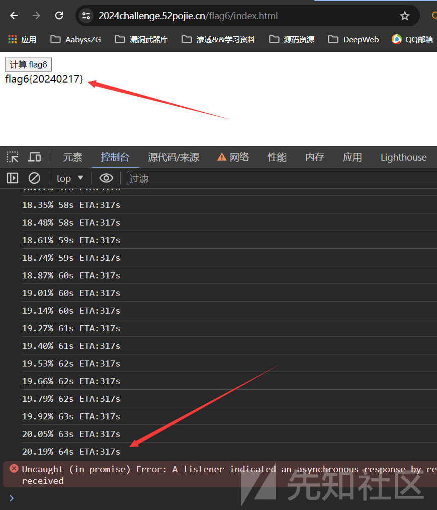](https://xzfile.aliyuncs.com/media/upload/picture/20240220113633-3e2c5412-cfa1-1.png)

```plain
flag6{20240217}
```

## 1.9 Flag8 和 FlagB

同样可以找到 Flag6 的子页面：[https://2024challenge.52pojie.cn/flagB/index.html](https://2024challenge.52pojie.cn/flagB/index.html)

是个 2048 的小游戏，随便玩玩赚点金币，可以购买道具：

[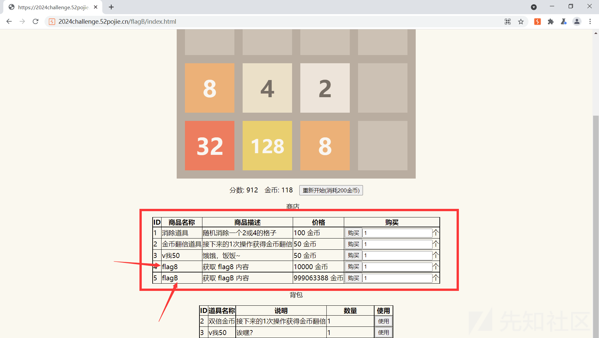](https://xzfile.aliyuncs.com/media/upload/picture/20240220113644-44e694b6-cfa1-1.png)

随便玩玩就玩到了 10000 了（开始游戏后随便玩玩，妥善用双倍道具），直接买了个 Flag8

[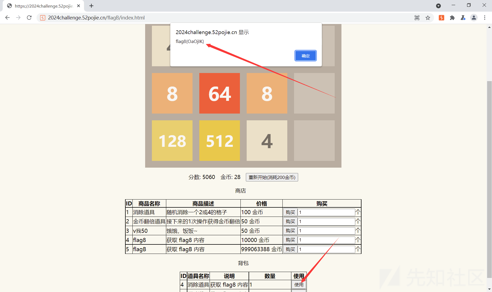](https://xzfile.aliyuncs.com/media/upload/picture/20240220113656-4c0f3bee-cfa1-1.png)

```plain
flag8{OaOjIK}
```

但 FlagB 这个数字肯定玩不到怎么办？直接买，提示金币不够  
于是购买了 v 我 50 这个道具，使用后，提示我这么一段话

[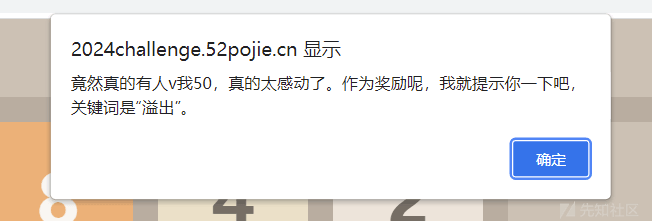](https://xzfile.aliyuncs.com/media/upload/picture/20240220113717-5887ac94-cfa1-1.png)

> 竟然真的有人 v 我 50，真的太感动了。作为奖励呢，我就提示你一下吧，关键词是“溢出”。

溢出，让人想到的就是下标越界之类的，这里哪里能传参数值呢？拿 Burp Suite 看了半天，好像也只有购买数量里面可以直接控制数值

先将金币先玩到 1k+，然后尝试进行 Fuzz，最终购买那里输入 `424672867399` 让数字溢出（我原本的想法是控制数据包内的 JSON 格式内容让它溢出，但我思路错了一直没成功，这个数字是我和 `@Tokeii` 师傅交流来的）

[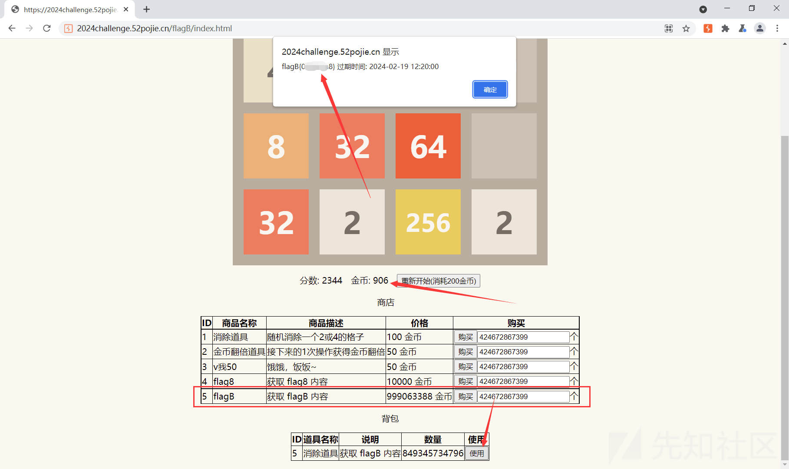](https://xzfile.aliyuncs.com/media/upload/picture/20240220113731-60f65196-cfa1-1.png)

点击购买，会消耗掉一些金币，并成功购买到 FlagB，点击使用拿到 FlagB

```plain
FlagB{0xxxx8}
```

[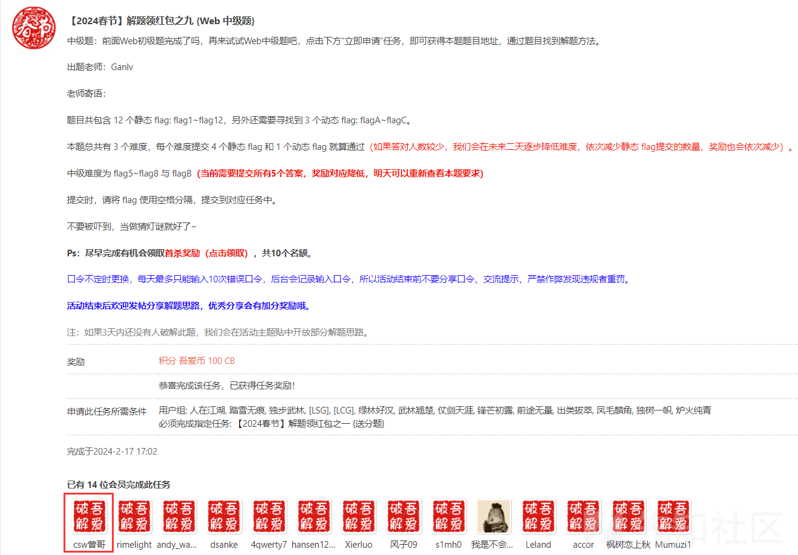](https://xzfile.aliyuncs.com/media/upload/picture/20240220113750-6c191a72-cfa1-1.png)

# 2# 总结

剩下还有 Flag11 和 Flag12，由于眼睛结膜炎还没好，不能长时间看电子设备，就没有再做了，有点可惜

总体来说，题目做下来都还是不错的，大家感兴趣可以去试试~同时非常感谢吾爱破解论坛提供的平台，由衷感谢论坛 `Ganlv` 出题老师的出题

也希望各位师傅能从本文有所收获，互相交流，共同进步！
