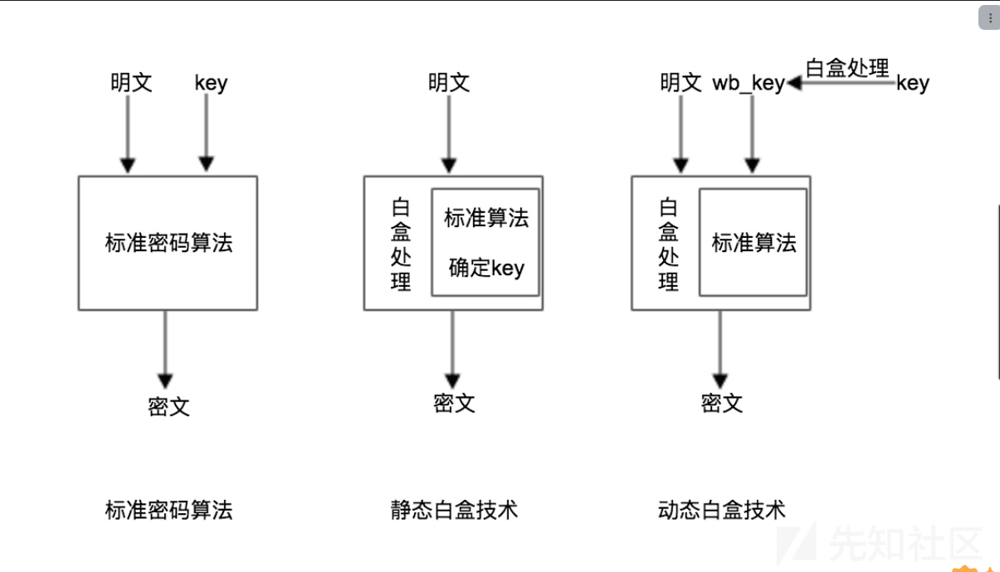
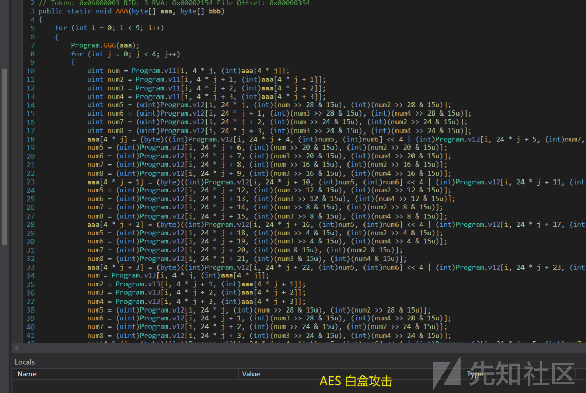
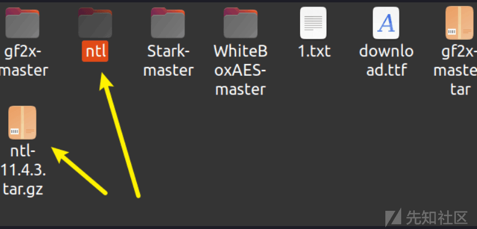
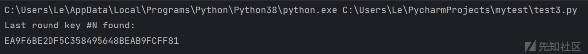
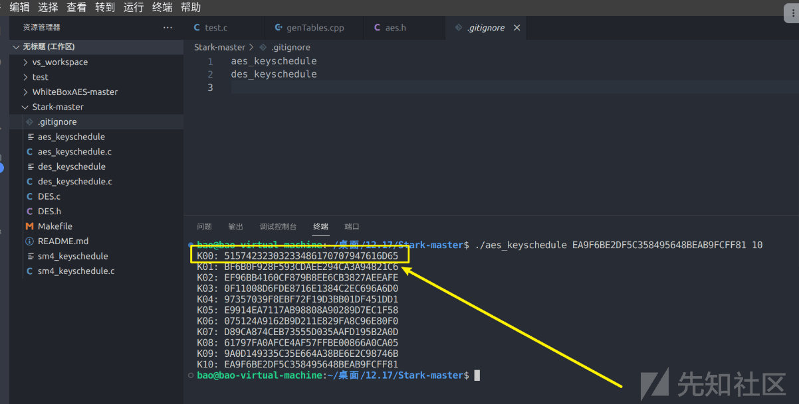
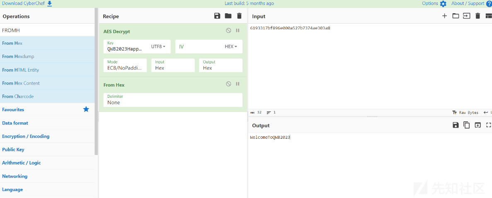
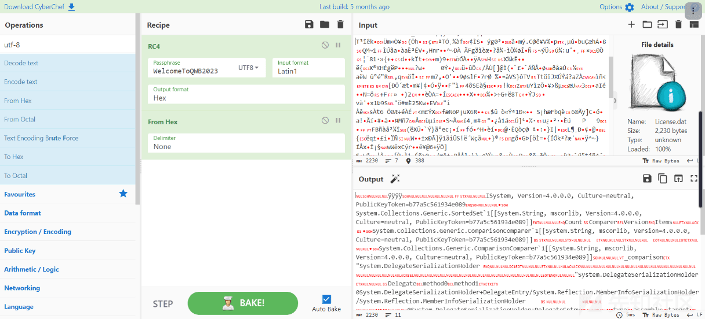

# AES 白盒攻击+CTF 实战 - 先知社区

AES 白盒攻击+CTF 实战

- - -

题目来源，第七届强网杯，dotdot 一题用到了 AES 白盒攻击技术，特此分享给大家。

## 白盒技术

白盒密码技术是一项能够抵抗白盒攻击的密码技术。

白盒攻击是指攻击者对设备终端拥有完全的控制能力，能够观测和更改程序运行时的内部数据。这种攻击环境称为白盒攻击环境。大多智能终端环境 (Android、iOS 等) 在很多情况下就是一个白盒攻击环境。

[](https://xzfile.aliyuncs.com/media/upload/picture/20240124133858-deedee2e-ba7a-1.png)

分析题目，发现：主要还是 AAA -> AES 白盒加密

[](https://xzfile.aliyuncs.com/media/upload/picture/20240124133932-f322b028-ba7a-1.png)

## AES-白盒源码

（源码在本篇文章后面，已经上传）  
大家可以自行学习一下源码，理解其中攻击原理  
C++ 版，需要安装 NTL 才能编译

[](https://xzfile.aliyuncs.com/media/upload/picture/20240124134025-12fec274-ba7b-1.png)

接下来进入实战

## DFA 攻击

这里提供 python 实现的 白盒 攻击

DFA 攻击简单来说就是在倒数第一轮列混合和倒数第二轮列混合之间（在 AES-128 中也就是第 8 轮和第 9 轮之间，因为最后第 10 轮不做列混合），修改此时中间结果的一个字节，会导致最终密文和正确密文有 4 个字节的不同。通过多次的修改，得到多组错误的密文，然后通过正确密文和这些错误密文能够推算出第 10 轮的密钥（加密模式下），继而能推算出原始密钥。  
实际应用中，就需要先找准列混合的函数位置，然后在他之前去插入缺陷数据。  
因此，我们需要将题目的 AAA 函数自己用 python 实现一下，方便我们构造错误输入。

```plain
from datas_table import *
from test2 import *

#abcdefghijklmnop

def change_index():
    global v16
    array2 = [0, 5, 10, 15, 4, 9, 14, 3, 8, 13, 2, 7, 12, 1, 6, 11]
    arr = [0] * 16

    for i in range(16):
        arr[i] = v16[array2[i]]

    v16 = arr


def AAA():
    global v16
    global  ss
    for i in range(9):
        change_index()
        if i==8: #最后一轮修改得到 dump
            v16[ss] = 1
        for j in range(4):
            num = v11[i][4 * j][v16[4 * j]]
            num2 = v11[i][4 * j + 1][v16[4 * j + 1]]
            num3 = v11[i][4 * j + 2][v16[4 * j + 2]]
            num4 = v11[i][4 * j + 3][v16[4 * j + 3]]
            num5 = v12[i][24 * j][(num >> 28 & 15)][(num2 >> 28 & 15)]
            num6 = v12[i][24 * j + 1][(num3 >> 28 & 15)][(num4 >> 28 & 15)]
            num7 = v12[i][24 * j + 2][(num >> 24 & 15)][(num2 >> 24 & 15)]
            num8 = v12[i][24 * j + 3][(num3 >> 24 & 15)][(num4 >> 24 & 15)]
            v16[4 * j] = (v12[i][24 * j + 4][num5][num6] << 4 | v12[i][24 * j + 5][num7][num8])
            num5 = v12[i][24 * j + 6][(num >> 20 & 15)][(num2 >> 20 & 15)]
            num6 = v12[i][24 * j + 7][(num3 >> 20 & 15)][(num4 >> 20 & 15)]
            num7 = v12[i][24 * j + 8][(num >> 16 & 15)][(num2 >> 16 & 15)]
            num8 = v12[i][24 * j + 9][(num3 >> 16 & 15)][(num4 >> 16 & 15)]
            v16[4 * j + 1] = (v12[i][24 * j + 10][num5][num6] << 4 | v12[i][24 * j + 11][num7][num8])
            num5 = v12[i][24 * j + 12][(num >> 12 & 15)][(num2 >> 12 & 15)]
            num6 = v12[i][24 * j + 13][(num3 >> 12 & 15)][(num4 >> 12 & 15)]
            num7 = v12[i][24 * j + 14][(num >> 8 & 15)][(num2 >> 8 & 15)]
            num8 = v12[i][24 * j + 15][(num3 >> 8 & 15)][(num4 >> 8 & 15)]
            v16[4 * j + 2] = (v12[i][24 * j + 16][num5][num6] << 4 | v12[i][24 * j + 17][num7][num8])
            num5 = v12[i][24 * j + 18][(num >> 4 & 15)][(num2 >> 4 & 15)]
            num6 = v12[i][24 * j + 19][(num3 >> 4 & 15)][(num4 >> 4 & 15)]
            num7 = v12[i][24 * j + 20][(num & 15)][(num2 & 15)]
            num8 = v12[i][24 * j + 21][(num3 & 15)][(num4 & 15)]
            v16[4 * j + 3] = (v12[i][24 * j + 22][num5][num6] << 4 | v12[i][24 * j + 23][num7][num8])
            num = v13[i][4 * j][v16[4 * j]]
            num2 = v13[i][4 * j + 1][v16[4 * j + 1]]
            num3 = v13[i][4 * j + 2][v16[4 * j + 2]]
            num4 = v13[i][4 * j + 3][v16[4 * j + 3]]
            num5 = v12[i][24 * j][(num >> 28 & 15)][(num2 >> 28 & 15)]
            num6 = v12[i][24 * j + 1][(num3 >> 28 & 15)][(num4 >> 28 & 15)]
            num7 = v12[i][24 * j + 2][(num >> 24 & 15)][(num2 >> 24 & 15)]
            num8 = v12[i][24 * j + 3][(num3 >> 24 & 15)][(num4 >> 24 & 15)]
            v16[4 * j] = (v12[i][24 * j + 4][num5][num6] << 4 | v12[i][24 * j + 5][num7][num8])
            num5 = v12[i][24 * j + 6][(num >> 20 & 15)][(num2 >> 20 & 15)]
            num6 = v12[i][24 * j + 7][(num3 >> 20 & 15)][(num4 >> 20 & 15)]
            num7 = v12[i][24 * j + 8][(num >> 16 & 15)][(num2 >> 16 & 15)]
            num8 = v12[i][24 * j + 9][(num3 >> 16 & 15)][(num4 >> 16 & 15)]
            v16[4 * j + 1] = (v12[i][24 * j + 10][num5][num6] << 4 | v12[i][24 * j + 11][num7][num8])
            num5 = v12[i][24 * j + 12][(num >> 12 & 15)][(num2 >> 12 & 15)]
            num6 = v12[i][24 * j + 13][(num3 >> 12 & 15)][(num4 >> 12 & 15)]
            num7 = v12[i][24 * j + 14][(num >> 8 & 15)][(num2 >> 8 & 15)]
            num8 = v12[i][24 * j + 15][(num3 >> 8 & 15)][(num4 >> 8 & 15)]
            v16[4 * j + 2] = (v12[i][24 * j + 16][num5][num6] << 4 | v12[i][24 * j + 17][num7][num8])
            num5 = v12[i][24 * j + 18][(num >> 4 & 15)][(num2 >> 4 & 15)]
            num6 = v12[i][24 * j + 19][(num3 >> 4 & 15)][(num4 >> 4 & 15)]
            num7 = v12[i][24 * j + 20][(num & 15)][(num2 & 15)]
            num8 = v12[i][24 * j + 21][(num3 & 15)][(num4 & 15)]
            v16[4 * j + 3] = (v12[i][24 * j + 22][num5][num6] << 4 | v12[i][24 * j + 23][num7][num8])
    change_index()
    for k in range(16):
        v16[k] = table4[9][k][v16[k]]

    for l in range(16):
        v16[l] = v16[l]


for ss in range(16):
    v16 = [i for i in range(97, 97 + 16)]
    AAA()
    for i in v16:
        print(hex(i)[2:], end=' ')
    print()

# 3694bf644864b8474a4576bb89c69f14
# 1094bf644864b85e4a4554bb89ac9f14
# 9d94bf644864b8514a45d7bb89299f14
# 0ff94bf644864b8f74a45a7bb8939f14
# 1894bf644864b8eb4a4567bb896a9f14
# 0360bf642c64b8474a4576cb89c62f14
# 3660bf646764b8474a45768e89c6af14
# 3697bf646764b8474a45764289c61b14
# 36d5bf647f64b8474a45763589c64214
# 3694e96448afb847834576bb89c69f54
# 3694fd64486db847814576bb89c69f8d
# 3694ae6448d9b847744576bb89c69fbb
# 3694c1644893b847214576bb89c69f97
# 3694bfc84864ef474ab176bbcac69f14
# 03694bf3f48647474ab576bb23c69f14
# 03694bf84864ef474ad176bb11c69f14
# 3694bf3f4864c2474ad476bbcac69f14
```

构造 1 个正确 + 16 个错误

```plain
#!/usr/bin/env python3
import phoenixAES

with open('tracefile', 'wb') as t:
    t.write("""
3694bf644864b8474a4576bb89c69f14 
1094bf644864b85e4a4554bb89ac9f14
9d94bf644864b8514a45d7bb89299f14
ff94bf644864b8f74a45a7bb89039f14
1894bf644864b8eb4a4567bb896a9f14
3600bf642c64b8474a4576cb89c62f14
3660bf646764b8474a45768e89c6af14
3697bf646764b8474a45764289c61b14
36d5bf647f64b8474a45763589c64214
3694e96448afb847834576bb89c69f54
3694fd64486db847814576bb89c69f8d
3694ae6448d9b847744576bb89c69fbb
3694c1644893b847214576bb89c69f97
3694bfc84864ef474ab176bbcac69f14
3694bf3f486407474ab576bb23c69f14
3694bf084864ef474ad176bb11c69f14
3694bf3f4864c2474ad476bbcac69f14
""".encode('utf8'))

phoenixAES.crack_file('tracefile')
#found：13111D7FE3944A17F307A78B4D2B30C5

#https://blog.csdn.net/fenfei331/article/details/126385120
```

成功得到

[](https://xzfile.aliyuncs.com/media/upload/picture/20240124134408-9787f1d2-ba7b-1.png)

获得第十轮的 key

编译 Stark-master  
开爆破  
[](https://xzfile.aliyuncs.com/media/upload/picture/20240124134440-ab14068c-ba7b-1.png)  
得到第一轮的秘钥 key

```plain
K00: 51574232303233486170707947616D65
```

得到的是 AES 的 key

把密文输入进去：

[](https://xzfile.aliyuncs.com/media/upload/picture/20240124134529-c7c956c4-ba7b-1.png)  
成功解密得到 RC4 的 key

也就是输入，即 AES 要加密的明文

```plain
WelcomeToQWB2023
```

[](https://xzfile.aliyuncs.com/media/upload/picture/20240124134606-de2c12b2-ba7b-1.png)

拿到 dump 下来的就是解密完成文件

成功完成了 AES 的白盒攻击，在实践中也会经常使用到。

dotdot\_e49dc9eb75140333f899c90e83421f04-20231217192011-3lrvu0w.z (0.303 MB) [下载附件](https://xzfile.aliyuncs.com/upload/affix/20240124134739-15c0ea9a-ba7c-1.zip)

WhiteBoxAES-master-20231217182735-egw42gd.zip (0.008 MB) [下载附件](https://xzfile.aliyuncs.com/upload/affix/20240124134810-27dafaea-ba7c-1.zip)

脚本 -20231217182525-wmriumy.zip (0.846 MB) [下载附件](https://xzfile.aliyuncs.com/upload/affix/20240124134827-31f5e896-ba7c-1.zip)
