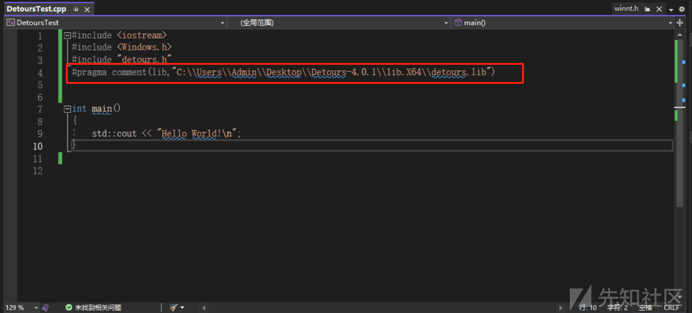
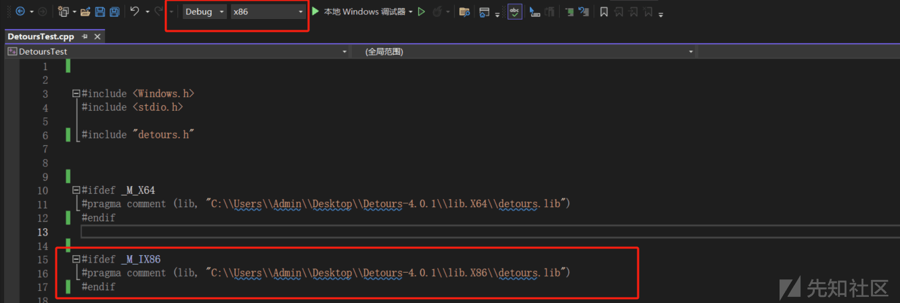
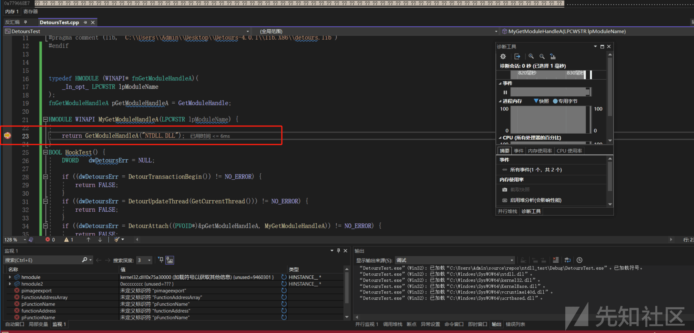
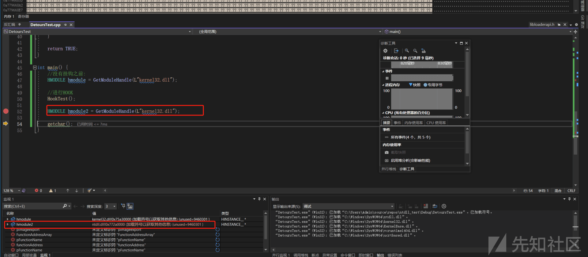
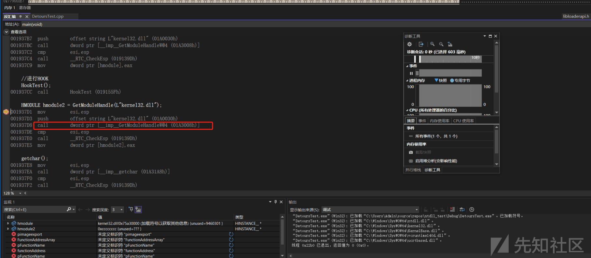
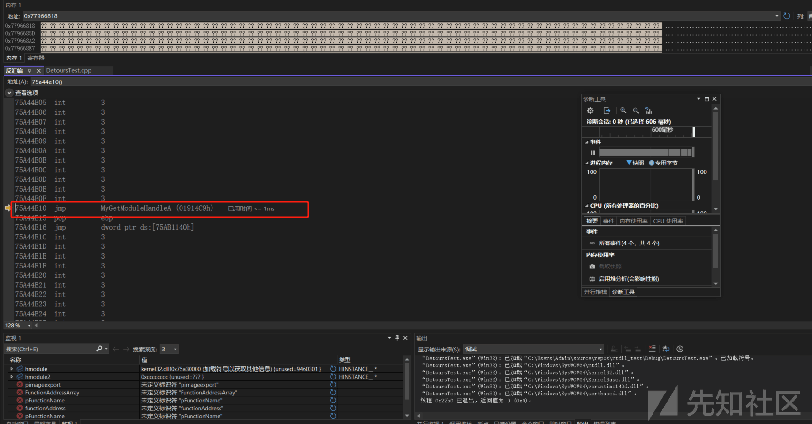
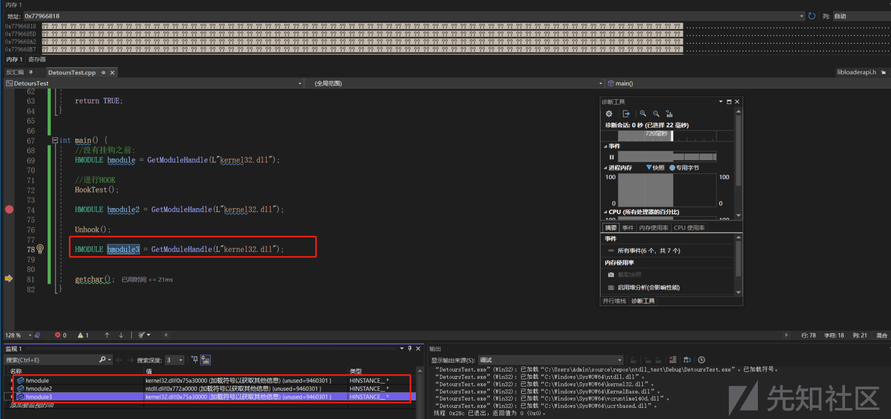

# API 挂钩之 Detours - 先知社区

API 挂钩之 Detours

- - -

## 简介

API 挂钩是一种可以拦截和修改 Windows API 行为的一种技术，比如现在很多成熟的 EDR 产品，都对 R0 或 R3 层的 Windows API 进行了 HOOK 操作，API 挂钩一般使用自定义的 API 函数来替换现有的 API 函数进行实现，自定义的 API 函数会在调用初始函数之前或之后进行添加一些附加的操作，这种其实就是类似于 Java 中的 AOP。

## 为什么要挂钩？

API 挂钩主要用于恶意二进制软件分析和调试的，但是它也是可以用作恶意软件开发，比如：

```plain
收集敏感信息或数据 (例如凭据)
出于恶意目的修改和拦截函数调用
通过改变操作系统或程序的行为方式来绕过安全措施，比如 AMSI ETW
```

## 如何挂钩？

实现 API 挂钩有很多方式，我们可以利用微软开源 Detours 库来进行使用或者 minhook 库，如下：

```plain
https://github.com/microsoft/Detours
https://github.com/TsudaKageyu/minhook
```

## API 挂钩-Detours

### 简介

Detours Hook Library 是一个软件库，主要用于拦截和重定向 Windows 中的函数调用，这个函数可以将指定的函数调用重定向到用户自定义的替换函数，用户自定义的这个函数可以执行其他一些操作或者修改原来的函数的一些行为。

### Transactions

Detours 库用于无条件跳转到用户提供的自定义函数来替换即将要挂钩的函数的前几条指令，其实就是 jmp。

Detours 库使用事务从目标函数进行挂钩或者取消挂钩，使用事务时，可以启动一个新的事务，添加函数挂钩之后，然后提交，提交事务之后，添加到事务中的所有函数挂钩都将应用于程序，就像取消挂钩的情况一样。

### 使用

首先我们需要编译上面的 Detours 库，编译详细如下：

[https://blog.csdn.net/qing666888/article/details/81540683](https://blog.csdn.net/qing666888/article/details/81540683)

这里我已经编译好了并且已经引入进来了。

最后将其通过#pragma comment 进行引入即可。需要注意的是还需要将 detours.h 头文件引入。

[](https://xzfile.aliyuncs.com/media/upload/picture/20240126095412-cd7733fc-bbed-1.png)

### 32 位和 64 位的 Detours 库

\_M\_X64：为面向 x64 处理器或 ARM64EC 的编译定义为整数文本值 100。其他情况下则不定义。

\_M\_IX86：为面向 x86 处理器的编译定义为整数文本值 600。对于面向 x64 或 ARM 处理器的编译，则不定义此宏。

如下代码：

```plain
#ifdef _M_X64
#pragma comment (lib, "C:\\Users\\Admin\\Desktop\\Detours-4.0.1\\lib.X64\\detours.lib")
#endif 

#ifdef _M_IX86
#pragma comment (lib, "C:\\Users\\Admin\\Desktop\\Detours-4.0.1\\lib.X86\\detours.lib")
#endif
```

这里的#ifdef \_M\_X64 检查宏\_M\_X64 是否已定义，如果定义的话那么就包含如下的路径中的.lib 文件，同样 x86 这里也是一样的。

无论是 x86 还是 x64 的 detours.lib 都是在编译 Detours 库时创建的，只是不同版本编译不同的而已。

比如说我们现在 VS 使用 x86 的编译，这里\_M\_IX86 就亮亮了。

[](https://xzfile.aliyuncs.com/media/upload/picture/20240126095515-f35b107a-bbed-1.png)

### Detours API

当我们去挂钩函数时，第一步需要去获取到挂钩函数的地址，拿到它的地址来确定跳转指令的放置位置。

Detours 库提供如下的一个 API 函数：

```plain
DetourTransactionBegin 附加或分离新事务，挂钩或取消挂钩应首先调用此函数。
DetUpdateThread  更新当前事务。Derours 库是使用它来登记当前事务中的线程。
DetourAttach 在当前事务的目标函数上安装挂钩 在调用 DetourTransactionCommit 之前此操作不会提交。
DetourTransactionCommit 提交当前事务以附加或者分离。
```

### 替换 Hooked API

接下来我们需要创建一个函数来替换挂钩的函数，替换函数需要具有相同的数据类型，并且可以选择相同的参数，但是需要注意的是你替换的这个函数不能比原始函数的参数多，如果多的话它将无法访问地址，从而引发访问冲突异常。

### 挂钩中的问题

那么我们替换之后，当调用挂钩函数的时候他会触发挂钩，然后去执行我们自定义的函数，我们自定义函数中必须返回原始挂钩函数应该返回的有效值，比如说 GetProcAddress 返回的是函数的地址，那么我们自定义函数中也需要返回函数的地址，这样是为了继续执行流程，一种简单的方式其实就是通过在自定义函数中调用原始函数来返回相同的值，就比如说我们挂钩的函数时 GetProcAddress，那么我们自定义函数中也调用一下 GetProcAddress 函数，但是这样的话会出现一个问题死循环的问题，就是说当我们在自定义函数中去调用挂钩函数，那么又会回到我们自定义的函数中。

比如说我们如下代码：

当我们在 GetProcAddress 上挂钩时，他会跳到我们自定义的 MyProcAddress 函数，然后我们里面又调用了

GetProcAddress，又会触发挂钩，所以又会到我们自定义的 MyProcAddress 函数，这样就变成了死循环。

```plain
#include <Windows.h>
#include <stdio.h>
#include "detours.h" 
#ifdef _M_X64
#pragma comment (lib, "C:\\Users\\Admin\\Desktop\\Detours-4.0.1\\lib.X64\\detours.lib")
#endif
#ifdef _M_IX86
#pragma comment (lib, "C:\\Users\\Admin\\Desktop\\Detours-4.0.1\\lib.X86\\detours.lib")
#endif

FARPROC WINAPI MyProcAddress(HMODULE hmodule, LPCSTR functionName) {
    //.... 

    return GetProcAddress(hmodule,functionName);
 }


int main() {

}
```

### 解决方案

其实解决的话也好解决，我们可以通过在挂钩之前保存指向原始函数的指针来解决此问题，但是这样的话有点麻烦，最简单的办法就是调用它名子不一样但是功能是一样的函数，比如 MessageBoxA 和 MessageBoxW 一个是 A 系函数一个是 W 系函数，其实功能都是一样的，这样的话就很好的解决了死循环的问题。

例如如下代码：

```plain
#include <Windows.h>
#include <stdio.h>
#include "detours.h" 
#ifdef _M_X64
#pragma comment (lib, "C:\\Users\\Admin\\Desktop\\Detours-4.0.1\\lib.X64\\detours.lib")
#endif
#ifdef _M_IX86
#pragma comment (lib, "C:\\Users\\Admin\\Desktop\\Detours-4.0.1\\lib.X86\\detours.lib")
#endif
INT WINAPI MyMessageBoxA(HWND hWnd, LPCSTR lpText, LPCSTR lpCaption, UINT uType) {

    // ...

    return MessageBoxW(hWnd, L"OK", L"OK", uType);

}
int main() {

}
```

### 挂钩程序

Detours 库使用事务进行工作，所以我们如果需要挂钩 API 函数的话就必须创建事务，向事务提交相关的操作，比如挂钩或者取消挂钩，最后提交事务即可。

如下代码：

```plain
#include <Windows.h>
#include <stdio.h>

#include "detours.h" 
#ifdef _M_X64
#pragma comment (lib, "C:\\Users\\Admin\\Desktop\\Detours-4.0.1\\lib.X64\\detours.lib")
#endif
#ifdef _M_IX86
#pragma comment (lib, "C:\\Users\\Admin\\Desktop\\Detours-4.0.1\\lib.X86\\detours.lib")
#endif


typedef HMODULE (WINAPI* fnGetModuleHandleA)(
    _In_opt_ LPCWSTR lpModuleName
);
fnGetModuleHandleA pGetModuleHandleA = GetModuleHandle;

HMODULE WINAPI MyGetModuleHandleA(LPCWSTR lpModuleName) {

    return GetModuleHandleA("NTDLL.DLL");
}
BOOL HookTest() {
    DWORD   dwDetoursErr = NULL;

    if ((dwDetoursErr = DetourTransactionBegin()) != NO_ERROR) {
        return FALSE;
    }
    if ((dwDetoursErr = DetourUpdateThread(GetCurrentThread())) != NO_ERROR) {
        return FALSE;
    }
    if ((dwDetoursErr = DetourAttach((PVOID*)&pGetModuleHandleA, MyGetModuleHandleA)) != NO_ERROR) {
        return FALSE;
    }

    if ((dwDetoursErr = DetourTransactionCommit()) != NO_ERROR) {
        return FALSE;
    }

    return TRUE;
}

int main() {
    //没有挂钩之前：
    HMODULE hmodule = GetModuleHandle(L"kernel32.dll");

    //进行HOOK
    HookTest();

    HMODULE hmodule2 = GetModuleHandle(L"kernel32.dll");

    getchar();
}
```

这里我们在 hmodule2 这里下一个断点然后按 F10 可以发现他会跳转到我们的自定义的那个函数。

它这里原本获取的是 kernel32.dll，这里我们给他改成获取 NTDLL.DLL。

[](https://xzfile.aliyuncs.com/media/upload/picture/20240126095620-19d2ff42-bbee-1.png)  
可以发现已经更改了。

[](https://xzfile.aliyuncs.com/media/upload/picture/20240126095625-1caea2ca-bbee-1.png)  
我们进入反汇编来看一下。

我们跟进 CALL。  
[](https://xzfile.aliyuncs.com/media/upload/picture/20240126095630-1ff6a93c-bbee-1.png)  
这里会发现我们已经 HOOK 成功了。它跳转的地址是我们自定义函数的地址。

[](https://xzfile.aliyuncs.com/media/upload/picture/20240126095638-24b77ba4-bbee-1.png)

### 取消挂钩程序

这里的取消挂钩和上面的挂钩是差不多的。

```plain
BOOL Unhook() {

    DWORD   dwDetoursErr = NULL;

    if ((dwDetoursErr = DetourTransactionBegin()) != NO_ERROR) {
        return FALSE;
    }
    if ((dwDetoursErr = DetourUpdateThread(GetCurrentThread())) != NO_ERROR) {
        return FALSE;
    }
    if ((dwDetoursErr = DetourDetach((PVOID*)&pGetModuleHandleA, MyGetModuleHandleA)) != NO_ERROR) {
        return FALSE;
    }

    if ((dwDetoursErr = DetourTransactionCommit()) != NO_ERROR) {
        return FALSE;
    }

    return TRUE;
}
```

然后我们再去获取 kernel32.dll 会发现成功获取到 kernel32.dll 的基地址而不是 NTDLL.DLL 的基地址了。

[](https://xzfile.aliyuncs.com/media/upload/picture/20240126095655-2ea07b98-bbee-1.png)
