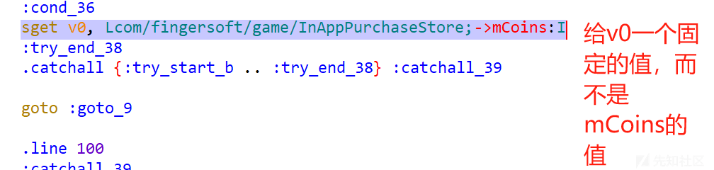
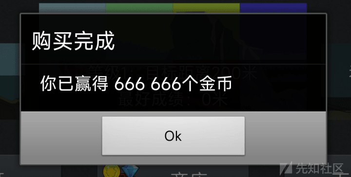

# APK 逆向 - 以某赛车小游戏为例 - 先知社区

APK 逆向 - 以某赛车小游戏为例

- - -

> 这一款小游戏以前刚有手机的时候玩过，还不错，挺经典的。也算是少年回忆，不能说是童年回忆。
> 
> 环境：Android 12 已 Root；Jadx：1.4.4 apktool：2.5.0

## 安装

-   安装后打开，可以正常打开
-   遇到了两个问题，一是这个游戏要位置和存储权限，一个单机游戏，存储权限可能是为了要保存一些游戏资料，位置权限用来干什么？还好拒绝之后可以正常进入游戏，不像有的软件不给权限就无法正常使用。

[](https://xzfile.aliyuncs.com/media/upload/picture/20240124212412-dd26d2ae-babb-1.png)

-   第二个问题是实名制的问题，这里先看一下实名制具体的逻辑代码，正好也对这一块的验证比较好奇。

[](https://xzfile.aliyuncs.com/media/upload/picture/20240124212419-e171e5ec-babb-1.png)

-   经过对实名界面的分析，可以得知代码逻辑在`com.mygamez.common.antiaddiction.``IDCheckDialog` 。其中`this.guest.setVisibility(8);`中的数字 8 代表了视图的可见性状态，0 表示可见，4 表示视图不可见，但仍然占据布局空间.8 表示视图不可见，但不占据布局空间，从上图看出 8 让 button 不可见，而且不占据空间。

[](https://xzfile.aliyuncs.com/media/upload/picture/20240124212425-e4c8f5aa-babb-1.png)

-   测试一下张伟这个身份信息能不能成功验证。尝试了发现不行，接着看代码吧。找一下这个 Dialog 的调用，还好只有一个。

[](https://xzfile.aliyuncs.com/media/upload/picture/20240124212430-e7e2b668-babb-1.png)

-   我们可以尝试将这个判断取反，来暂时不进行实名，但是我们不能这样做，要遵守相关的法律法规，这里只是在技术层面上饶过一个东西。

[](https://xzfile.aliyuncs.com/media/upload/picture/20240124212435-ead50470-babb-1.png)

-   在上面的修改过程中，发现修改一个 if 后会走向下面没有游戏剩余时间的 if，还要改一下这里的判断语句。并且点击确认后会直接退出。

[](https://xzfile.aliyuncs.com/media/upload/picture/20240124212441-ee984220-babb-1.png)

-   修改了之后发现可以进游戏，但是是以游客模式进行游戏，然后还会跳出另外一个提示，提示实名。挺好的，对实名要求挺严格的。

[](https://xzfile.aliyuncs.com/media/upload/picture/20240124212448-f289109e-babb-1.png)

-   继续分析实名认证的逻辑。之前输入信息点击实名后，会进入`AntiAddictionManager.INSTANCE.get().doRidCheck(upperCase, obj, **new** AntiAddictionManager.AntiAddictionManagerInstance.RidCheckCallback()`

[](https://xzfile.aliyuncs.com/media/upload/picture/20240124212455-f67f69be-babb-1.png)

-   通过调用`AntiAddictionManager.INSTANCE.get().doRidCheck()`方法进行实名认证检查。该方法接受一个参数`RidCheckCallback`，用于处理实名认证检查的结果。如果认证检查结果为有效（`z`为`true`），则保存验证信息并设置用户数据。如果认证检查结果为无效，则将游客模式设置为`true`。这里要任意信息实名通过，就将 Z 的判断取反，注意要把之前的修改改回原来的代码，否则不会进入实名的阶段。
    -   继续跟进`doRidCheck()` 方法，`this.service.requestRidCheck()`是一个请求实名认证检查的网络请求方法，

```plain
this.service.requestRidCheck(this.sessionId, new RidCheckRequest(str2, str), new ResponseCallback<PlayerDataResponse>() { // from class: com.mygamez.common.antiaddiction.AntiAddictionManager.AntiAddictionManagerInstance.12
                            @Override // com.mygamez.common.antiaddiction.api.ResponseCallback
                            public void onResponse(PlayerDataResponse playerDataResponse) {
                                AntiAddictionManagerInstance.logger.i("MySDK_AA", "RidCheck response: " + playerDataResponse.toString());
                                ridCheckCallback.onResult(playerDataResponse.getAge() != -1, playerDataResponse.getAge());
                            }

                            @Override // com.mygamez.common.antiaddiction.api.ResponseCallback
                            public void onFailure(int i, String str3) {
                                AntiAddictionManagerInstance.logger.e("MySDK_AA", "RidCheck failed: " + i + " " + str3);
                                if (i == 403) {
                                    ridCheckCallback.onError(i, "Out of time");
                                    return;
                                }
                                ridCheckCallback.onError(i, str3);
                                if (i != 401) {
                                    return;
                                }
                                EventBus.getDefault().post(new SessionExpiredEvent());
                            }
                        });
                        return;
                    }
                    ridCheckCallback.onError(-1, "AntiAddiction system disabled");
                }


 - 继续看实名认证的网络请求，这里只定义了个接口，具体实现要去 Service 中去看。
```

[](https://xzfile.aliyuncs.com/media/upload/picture/20240124212504-fc246ba8-babb-1.png)

```plain
public void requestRidCheck(final String str, final RidCheckRequest ridCheckRequest, final ResponseCallback<PlayerDataResponse> responseCallback) {
            this.executor.execute(new Runnable() { // from class: com.mygamez.common.antiaddiction.api.MyGamezAntiAddictionApiService.6
                @Override // java.lang.Runnable
                public void run() {
                    String str2 = "https://antiaddiction.******.cn/api/v1" + EndPoint.IDENTIFY;
                    try {
                        HttpCaller2 httpCaller2 = HttpCaller2.getInstance(str2, new Gson().toJson(ridCheckRequest), HttpCaller2.RequestMethod.POST);
                        HashMap hashMap = new HashMap();
                        hashMap.put("x-session-id", str);
                        httpCaller2.setHeaderFields(hashMap);
                        HttpResponse makeRequest = httpCaller2.makeRequest();
                        int statusCode = makeRequest.getStatusCode();
                        if (statusCode == 200) {
                            MyGamezAntiAddictionApiService.this.notifyResult(MyGamezAntiAddictionApiService.this.parsePlayerDataResponseJson(makeRequest.getResponseBody()), responseCallback);
                        } else if (statusCode != 422) {
                            MyGamezAntiAddictionApiService.this.notifyError(makeRequest.getStatusCode(), makeRequest.getMessage(), responseCallback);
                        } else {
                            MyGamezAntiAddictionApiService.this.notifyError(makeRequest.getStatusCode(), MyGamezAntiAddictionApiService.this.parseErrorMessageJson(makeRequest.getMessage()).toString(), responseCallback);
                        }
                    } catch (JsonSyntaxException e) {
                        MyGamezAntiAddictionApiService.this.notifyError(-1, "Invalid JSON: " + e.getMessage(), responseCallback);
                    } catch (MalformedURLException unused) {
                        MyGamezAntiAddictionApiService.this.notifyError(-1, "Invalid URL: " + str2, responseCallback);
                    } catch (IOException e2) {
                        MyGamezAntiAddictionApiService.this.notifyError(-1, "HTTP request failed: " + e2.getMessage(), responseCallback);
                    } catch (Exception e3) {
                        MyGamezAntiAddictionApiService.this.notifyError(-1, e3.getMessage(), responseCallback);
                    }
                }
            });
        }
```

-   查了一下相关资料，实名应该是向有关部门的实名认证发送请求验证。这里就不深究了，支持实名，遵纪守法！。

## 解锁关卡，金币充值

-   进入游戏会发现有的车辆是无法解锁的。解锁车辆需要金币或者砖石，而这需要充值。
-   点击充值会直接显示充值失败，然后提示安装微信，然后还提示不让卸载或者清除数据，根据这一提示我们可以猜的游戏的数据都是本地保存的，不会做一些线上的认证。这样也给了我们之间修改本地数据的余地。
-   分析游戏 MainActivity 的代码逻辑，根据 Activity 记录来看，主要的逻辑全在 MainActivity，包括充值逻辑。
    -   通过关键字 Coin 找到下面一个关于获取金币的函数，发现调用了`InAppPurchaseStore.getCoins`

[](https://xzfile.aliyuncs.com/media/upload/picture/20240124212515-02c92462-babc-1.png)

-   进入类`InAppPurchaseStore` ，可以看到应该是关于金币和砖石的加减操作都是在这个类中完成的。下面的代码用到了 SharedPreferences，是 Android 平台提供的一种轻量级的数据存储机制，用于存储和检索键值对数据。可以看到，游戏是将一些数据直接通过 SharedPreferences 存放在本地。

```plain
public static void loadStore(Context context) {
                mProcessedOrders = context.getSharedPreferences(PREFS_PROCESSED, 0).getString("processed_orders", "");
                mCoins = context.getSharedPreferences(PREFS_NAME, 0).getInt("numCoins", 0);
                mGems = context.getSharedPreferences(PREFS_NAME, 0).getInt(NUM_GEMS, 0);
                mAdFree = context.getSharedPreferences(PREFS_NAME, 0).getInt("adfree", 0);
                mBundle = context.getSharedPreferences(PREFS_NAME, 0).getInt(BUNDLE, 0);
                mLoaded = true;
            }

            public static void saveStore(Context context) {
                SharedPreferences.Editor edit = context.getSharedPreferences(PREFS_NAME, 0).edit();
                edit.putInt("numCoins", mCoins);
                edit.putInt(NUM_GEMS, mGems);
                edit.putInt("adFree", mAdFree);
                edit.putInt(BUNDLE, mBundle);
                edit.commit();
            }


  - 先尝试修改 getcoins 的返回值，就是将 i 改为固定的一个数，看会不会开始就有金币。
```

[](https://xzfile.aliyuncs.com/media/upload/picture/20240124212523-078f7276-babc-1.png)

[](https://xzfile.aliyuncs.com/media/upload/picture/20240124212528-0a95952c-babc-1.png)

[](https://xzfile.aliyuncs.com/media/upload/picture/20240124212533-0d8fa1aa-babc-1.png)

```plain
- 第一个修改是将 const/4 v0,0x0 改为 const v0,66666，第二个是删除`sget v0, Lcom/fingersoft/game/InAppPurchaseStore;->mCoins:I` ，直接 const v0, 66666.
```

[](https://xzfile.aliyuncs.com/media/upload/picture/20240124212545-14b5b71c-babc-1.png)

-   发现是可以通过此方法获取金币，同理，砖石的逻辑也是一样的。
    
    -   方法二：直接修改 loadStore 函数，因为 loadStore 函数是从本地读取相关信息。
    -   下面是从获取值对金币和砖石数量进行赋值的 smali 代码。对其进行一定的修改。
    
    ```plain
    const-string v1, "numCoins"
    
       invoke-interface {v0, v1, v3}, Landroid/content/SharedPreferences;->getInt(Ljava/lang/String;I)I
    
       move-result v0
           ***const v0, 888888#先对v0赋值再给mCoins赋值，下面的砖石逻辑同理。***
    
       sput v0, Lcom/fingersoft/game/InAppPurchaseStore;->mCoins:I
    
       .line 28
       const-string v0, "iap_db"
    
       invoke-virtual {p0, v0, v3}, Landroid/content/Context;->getSharedPreferences(Ljava/lang/String;I)Landroid/content/SharedPreferences;
    
       move-result-object v0
    
       const-string v1, "numGems"
    
       invoke-interface {v0, v1, v3}, Landroid/content/SharedPreferences;->getInt(Ljava/lang/String;I)I
    
       move-result v0
       ***const v0, 999999***
    
       sput v0, Lcom/fingersoft/game/InAppPurchaseStore;->mGems:I
    ```
    
    -   修改后重新打包签名，查看具体效果。发现最开始启动游戏就会获得 888888 个金币和 999999 个砖石，和起初的预想的效果一样。并且金币和砖石都可以用于游戏道具的购买。

[](https://xzfile.aliyuncs.com/media/upload/picture/20240124212553-19263f6a-babc-1.png)

[](https://xzfile.aliyuncs.com/media/upload/picture/20240124212608-22128804-babc-1.gif)

### 反抓包

-   在之前打算抓包的时候，发现一旦开了代理，游戏就会提示信息确认中，然后就无法进入游戏。

[](https://xzfile.aliyuncs.com/media/upload/picture/20240124212618-280a41a2-babc-1.png)

```plain
- 先尝试用算法助手，屏蔽这个弹窗，然后能否继续游戏。发现可以取消弹窗，但是游戏一直在进入页面。
```

[](https://xzfile.aliyuncs.com/media/upload/picture/20240124212623-2b010a94-babc-1.png)

-   这里再推荐一下算法助手这个强大的辅助工具，接下来介绍利用这个工具隐藏 VPN 状态。
    -   首先在 LSPosed 或者 Xposed 中的算法助手模块中对要操作的 APP 打勾，然后进入算法助手 APP 对该应用开启辅助，然后打开该应用的其他选项，找到网络环境，将网络环境中的三个选项全打勾。

[](https://xzfile.aliyuncs.com/media/upload/picture/20240124212628-2e077cdc-babc-1.png)

[](https://xzfile.aliyuncs.com/media/upload/picture/20240124212632-306cb6c2-babc-1.png)

-   接着从算法助手应用中启动该 APP（**切记**），最后观察，app 打开不再提示刚才的 Dialog，可以正常进入实名认证阶段。
-   利用编的信息进行实名认证，利用小黄鸟抓包。由于会先在本地检查身份证的格式，这里就没再编，直接用了一个符合正常格式的号码。而且认证时请求的 URL 和之前分析的一致，都是[https://antiaddiction.\*\*\*\*\*\*.cn/api/v1。](https://antiaddiction.******.cn/api/v1。)

[](https://xzfile.aliyuncs.com/media/upload/picture/20240124212639-345a24fe-babc-1.png)
