# APK 逆向分析 - 以某车机哄娃 app 为例 - 先知社区

APK 逆向分析 - 以某车机哄娃 app 为例

- - -

#### 快过年了，提前祝大家过年好，开车的小伙伴回家带孩子过年肯定需要个哄娃的车机 app。我就在车机应用市场下了个给小孩哥讲故事的 app。

## 准备

-   app 安装后打开首先遇到的就是启动广告界面。然后很多故事需要 VIP。目前的任务是去掉开屏广告和解锁试用一些 VIP 功能，好用的话就会正常开通 VIP 的。尊重版权！  
    [](https://xzfile.aliyuncs.com/media/upload/picture/20240128145839-aa471d5c-bdaa-1.png)
    
-   试图用 NP 管理器打开，发现提示没有加固。直接用 Jadx 加载源代码。  
    [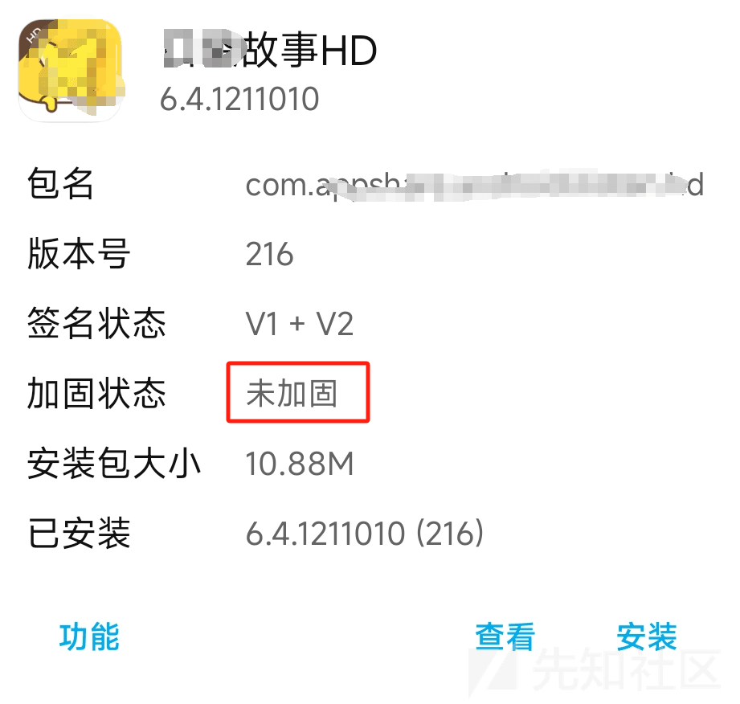](https://xzfile.aliyuncs.com/media/upload/picture/20240128145917-c123edac-bdaa-1.png)
    

## 源代码分析

### 启动广告

-   使用 NP 管理器提取 app，复制到电脑用 Jadx 打开。
-   首先查看 AndroidManifest.xml 文件，查看启动 Activity。这个应该就是启动广告了。  
    [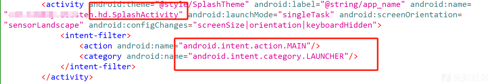](https://xzfile.aliyuncs.com/media/upload/picture/20240128150201-22e35f3c-bdab-1.png)
    -   进入 SplashActivity 看一下具体的逻辑，这里主要是看一下如何单纯修改启动 Activity 会不会影响 app，有的应用会在 SplashActivity 做一些 app 的初始化工作。
    -   经过分析，发现 SplashActivity 只有广告和隐私协议相关的内容，将 SplashActivity 的 Intent 过滤器给 MainActivity。  
        [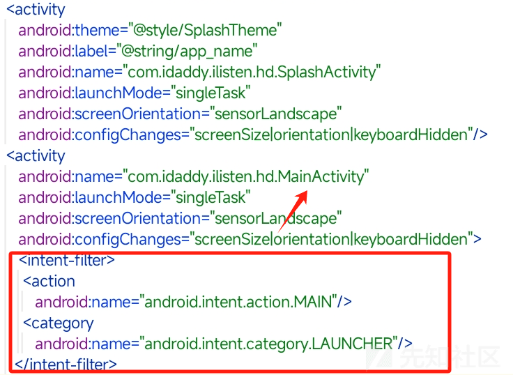](https://xzfile.aliyuncs.com/media/upload/picture/20240128151119-6f6d3b06-bdac-1.png)
    -   保存、打包、签名、安装、测试。从下面的 gif 可以看出，直接跳过了广告和开始的同意协议步骤，直接进入了主界面。[](https://xzfile.aliyuncs.com/media/upload/picture/20240128151440-e7142264-bdac-1.gif)

### 应用内弹窗

-   当进入主界面，会有个开通会员的弹窗提示，这里去掉吧，车机 app 尽可能少多余的操作，毕竟有时候要开车时操作。
-   进入 MainActivity 查看具体的代码逻辑。大致看了看一下并没有非常明显的 Dialog 提示，那就从显示的元素下手。
-   使用开发助手 app 中的布局查看功能查看弹窗的具体 id。得到如下图的结果。从布局结果来看，这并不是一个自定义的 Dialog，而是一张 Img，并且其 id 为：**R.id.mAdCoverImg**，我说刚才代码中为什么没有 Dialog 的逻辑代码。  
    [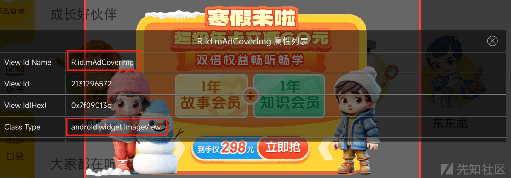](https://xzfile.aliyuncs.com/media/upload/picture/20240128153037-21cf5048-bdaf-1.png)
    
    -   在 Jadx 上找这个 id 的关键词。找到了关键的 Fragment：PullADFragment，看名字应该就知道和广告界面有关。  
        [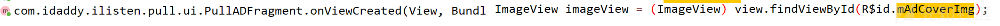](https://xzfile.aliyuncs.com/media/upload/picture/20240128153913-55277adc-bdb0-1.png)
    -   分析 PullADFragment，发现了另外一个关键的元素：即关闭广告的 Img，在上一步布局查看中，由于此 Img 太小，期初并没有注意。在分析 PullADFragment 才发现这一 Img 控件。  
        [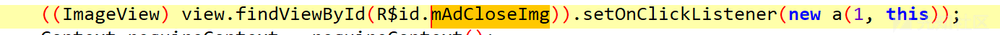](https://xzfile.aliyuncs.com/media/upload/picture/20240128155742-ea3479ac-bdb2-1.png)
    -   继续分析关闭广告的 Img 的 Click 逻辑。((ImageView) view.findViewById(R$id.mAdCloseImg)).setOnClickListener(new a(1, this));在代码中，new a(1, this) 表示创建了一个名为 a 的匿名内部类的实例，并将其作为点击事件的监听器传递给 setOnClickListener 方法。函数 a 的具体代码如下：
        
        ```plain
        public static final class a implements View.OnClickListener {
          public final /* synthetic */ int a;
          public final /* synthetic */ Object b;
        
          public a(int i, Object obj) {
              this.a = i;
              this.b = obj;
          }
        
          @Override // android.view.View.OnClickListener
          public final void onClick(View view) {
              int i = this.a;
              if (i != 0) {
                  if (i == 1) {
                      ((PullADFragment) this.b).dismiss();
                      return;
                  }
                  throw null;
              }
              PullADFragment.a((PullADFragment) this.b);
              IAppService a = PullADRepo.b.a();
              if (a != null) {
                  FragmentActivity requireActivity = ((PullADFragment) this.b).requireActivity();
                  h.a((Object) requireActivity, "requireActivity()");
                  c.a.b.g.a.b.a aVar = ((PullADFragment) this.b).f1308c;
                  if (aVar != null) {
                      String d = aVar.d();
                      if (d == null) {
                          d = "";
                      }
                      a.a(requireActivity, d, null);
                  } else {
                      h.b("vo");
                      throw null;
                  }
              }
              ((PullADFragment) this.b).dismiss();
          }
        }
        ```
        
    -   之前分析了这么多，到试图修改的时候才发现逻辑有问题，上面的分析到了 Click 的地方，而我们的需求是让这个 fragment 直接不显示，何来 Click 之说。
    -   然后想其他办法，这里是不是可以在 fragment 的 Create 函数中直接 return-void，不进行下面的 Image 或者 fragment 初始化操作。在下面函数中的 smali 代码中直接加入 return-void。  
        [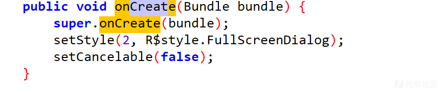](https://xzfile.aliyuncs.com/media/upload/picture/20240128161157-e7d10368-bdb4-1.png)  
        [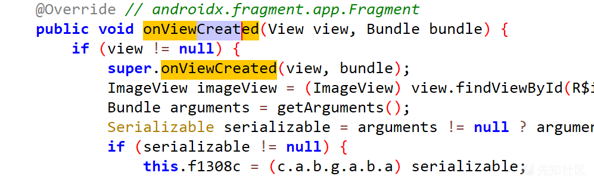](https://xzfile.aliyuncs.com/media/upload/picture/20240128161207-edf8fcdc-bdb4-1.png)
    -   进行上面的修改，找到该 fragment 的 smali 代码。  
        [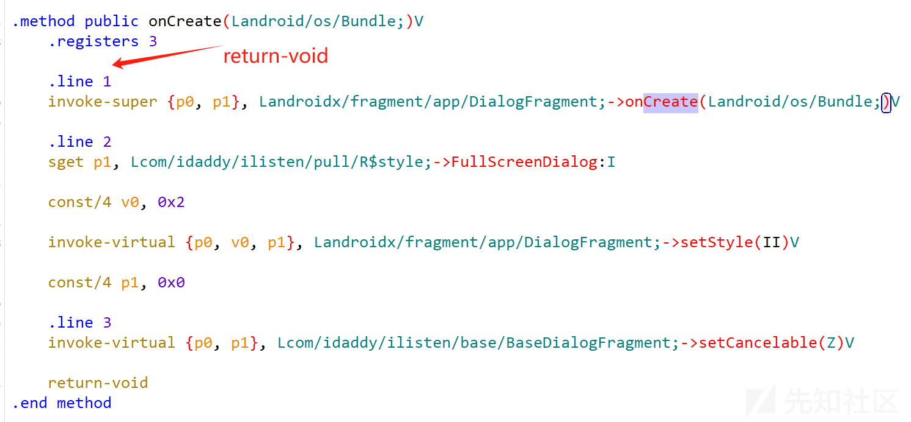](https://xzfile.aliyuncs.com/media/upload/picture/20240128161341-25b970fc-bdb5-1.png)  
        [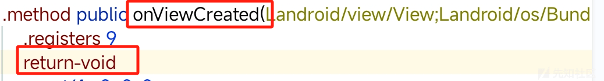](https://xzfile.aliyuncs.com/media/upload/picture/20240128161605-7b537512-bdb5-1.png)
    -   保存、打包、签名、安装、测试。发现 fragment 直接不显示，也就达成了我们的目的。

### 会员资源解锁

-   首先需要登录，那就抓包看一下登录的请求。抓到下面一系列的包，简单分析一下。  
    [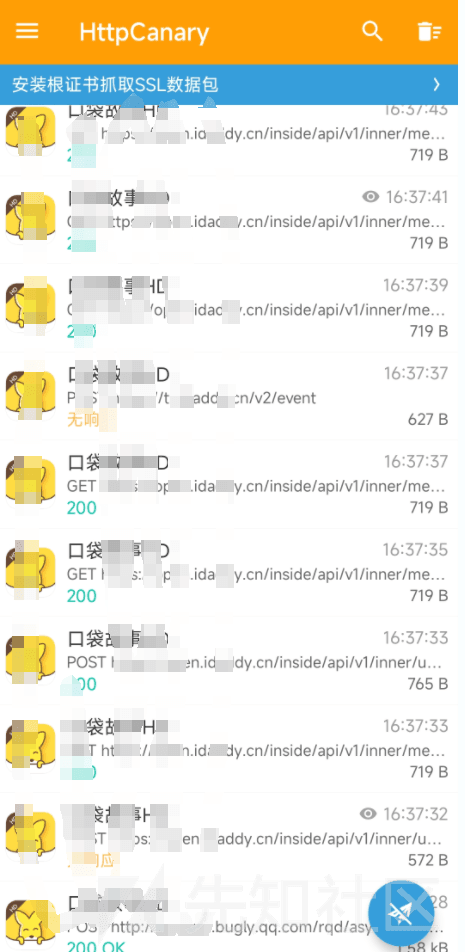](https://xzfile.aliyuncs.com/media/upload/picture/20240128164109-fc3afe54-bdb8-1.png)
    
-   其中比较重要的是下面这个请求**/inner/user/member**与响应。从响应来看这是针对用户登录后的信息，而且没有加密。  
    [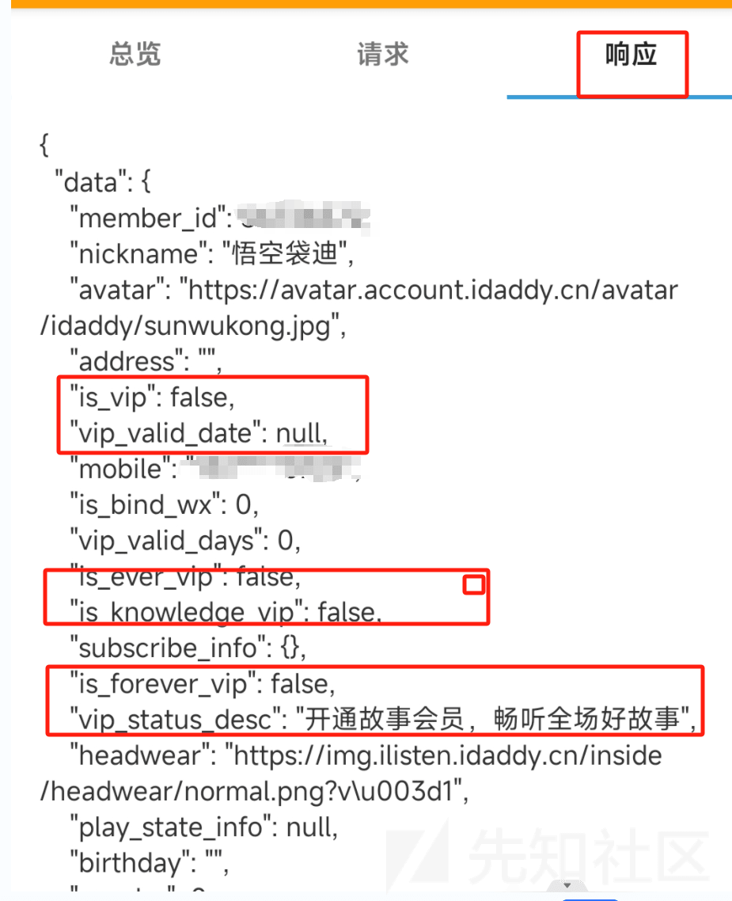](https://xzfile.aliyuncs.com/media/upload/picture/20240128164328-4f004888-bdb9-1.png)
    
-   方法一是针对/inner/user/member 这一请求进行静态注入，将关于 vip 的返回信息都改为 true。  
    [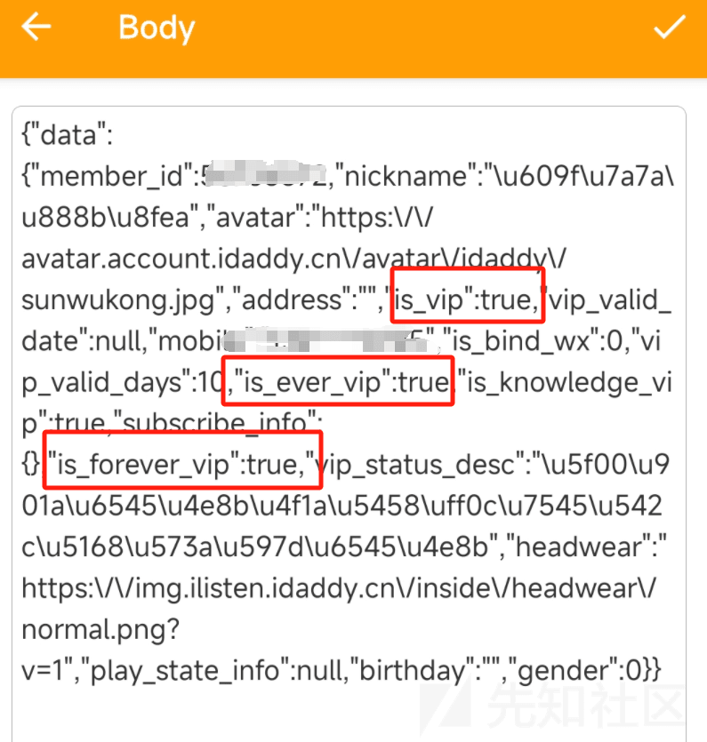](https://xzfile.aliyuncs.com/media/upload/picture/20240128165354-c41f59d2-bdba-1.png)
    
-   静态注入后重新登录，发现小黄鸟提示注入成功，点开 app 个人中心看到，显示是 vip，但是到期时间由于格式不请求就没修改，所以是 null。  
    [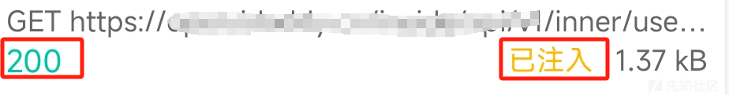](https://xzfile.aliyuncs.com/media/upload/picture/20240128165445-e2497320-bdba-1.png)  
    [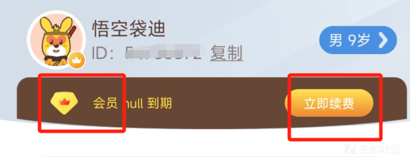](https://xzfile.aliyuncs.com/media/upload/picture/20240128165621-1be2edfa-bdbb-1.png)
    
-   方法二：修改原始代码逻辑。抓包的环境不可能都有，车上更难配置相关环境了，所以改原始的代码逻辑才是一步到位的。
    
    -   根据之前的分析，可以知道**user/member**，这个网络请求的关键词，在 Jadx 搜索这个关键词。一共有三处用到了，都是作为请求响应的 Result。  
        [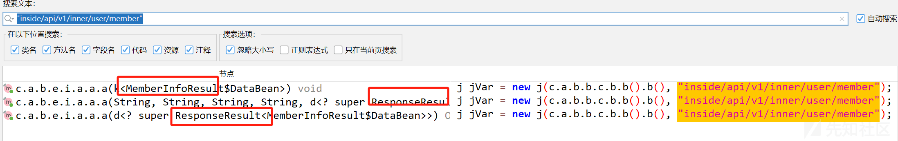](https://xzfile.aliyuncs.com/media/upload/picture/20240128171221-57f1d9a8-bdbd-1.png)
    -   简单分析一下上面三个 Result，其中比较重要的应该是 MemberInfoResult，这是关于用户登录后信息的 Result。里面有关于用户状态的 set 和 boolean 函数。  
        [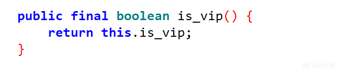](https://xzfile.aliyuncs.com/media/upload/picture/20240128171357-913825f0-bdbd-1.png)
        
    -   其中只有一个关于是否是会员的函数，即上面截图中的 is\_vip() 函数，且返回值是 boolean。一个修改的方法是将返回值固定改为 0x1。  
        [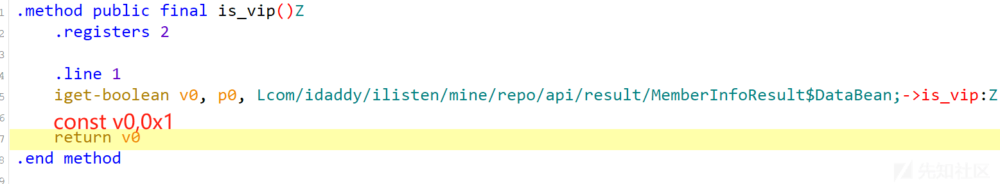](https://xzfile.aliyuncs.com/media/upload/picture/20240128172149-aa4593c4-bdbe-1.png)
        
    -   保存、打包、签名、安装、测试。发现和之前抓包静态注入一样，都显示会员，而且可以收听需要 vip 的故事。  
        [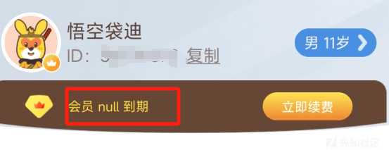](https://xzfile.aliyuncs.com/media/upload/picture/20240128172602-414c8f2a-bdbf-1.png)  
        [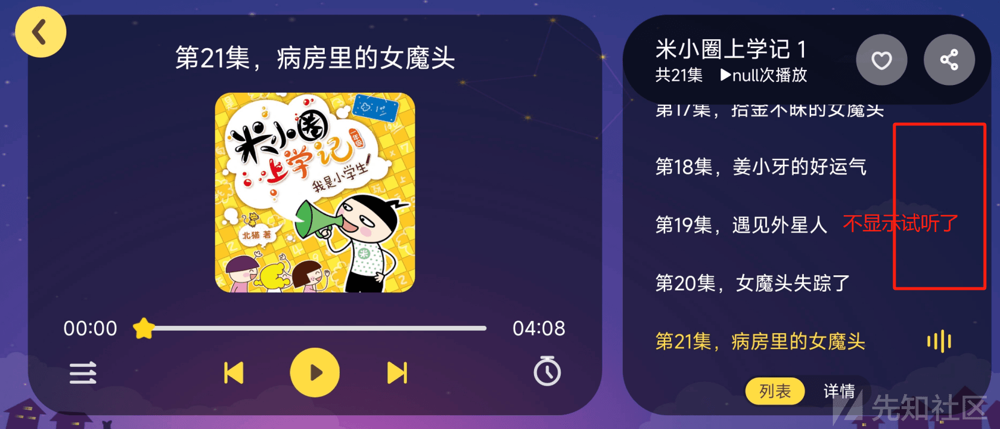](https://xzfile.aliyuncs.com/media/upload/picture/20240128173131-0563e7e6-bdc0-1.png)
        
-   还遇到了一个问题，就是有的知识故事 vip 也不能听，要购买，怎么让孩子听个故事这么难。  
    [](https://xzfile.aliyuncs.com/media/upload/picture/20240128173015-d7e8b36e-bdbf-1.png)
    
    -   由于涉及到更多网络请求的逻辑和自己有限的能力，关于购买的这部分就没分析成功，希望有师傅指点一二。而且这个工程混淆的让代码难以理解，比如这种 c.e.a.a.a.a("goods\_id=")。
-   以上分析仅供学习参考，切记遵纪守法，尊重版权。
