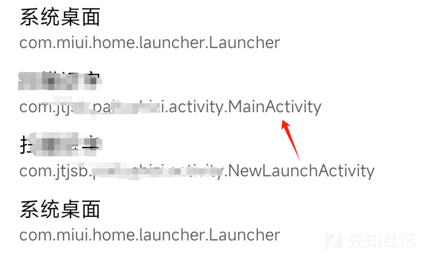
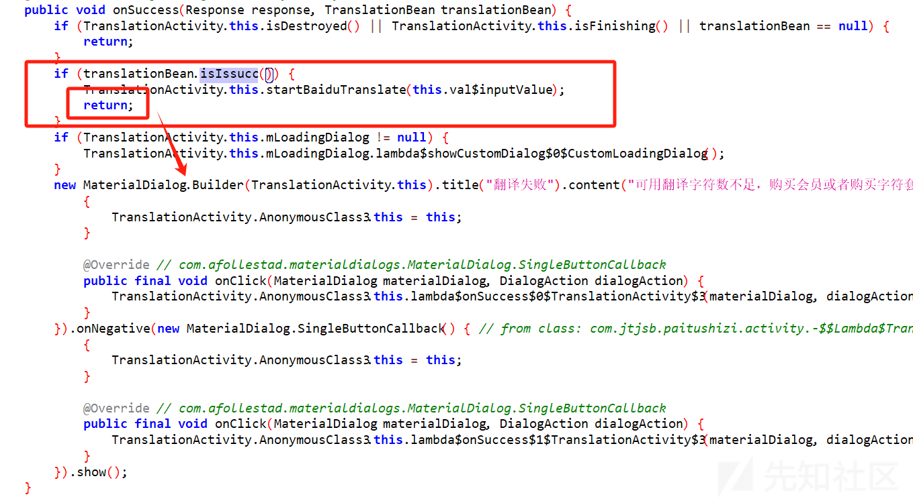
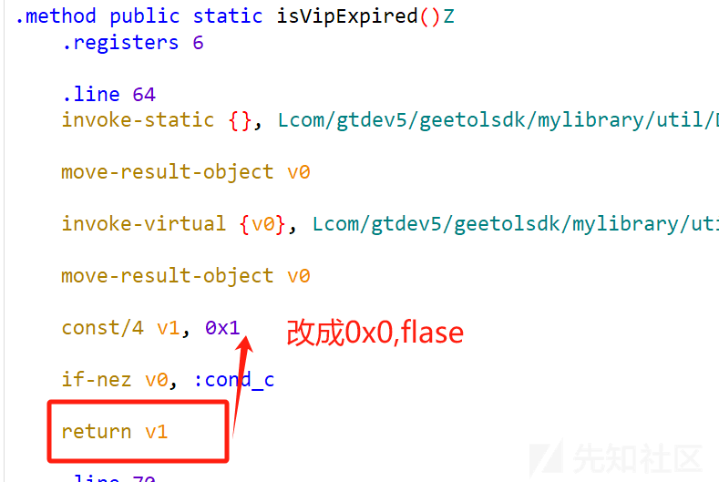

# APK 逆向分析入门 - 以某扫描软件为例 - 先知社区

APK 逆向分析入门 - 以某扫描软件为例

- - -

## 分析

### 源码

-   拖入 Jadx，发现是加固后的。使用 MT 管理器查看是 BB 加固。

[](https://xzfile.aliyuncs.com/media/upload/picture/20240123170152-0cf8ce68-b9ce-1.png)

### 脱壳

-   使用脱壳神器 BlackDex
    -   原项目中只有一个 dex，从脱壳后的 apk 中找出和原有 dex 相同的删除，然后看看右边脱壳后的里面的内容，直接用 dex 编辑器即可。将一些重复或者没用的 dex 删除。

[](https://xzfile.aliyuncs.com/media/upload/picture/20240123170200-11b29a24-b9ce-1.png)

-   然后对留下来的 dex 进行修复（np 管理器），重命名为 classes1.dex-classesS.dex.。并复制到原有的项目中，记得不要自动签名。

[](https://xzfile.aliyuncs.com/media/upload/picture/20240123170206-151168a8-b9ce-1.png)

-   然后在 lib 和 assert 文件下找一下加固的特征码，删除，最后使用 np 管理器重新签名即可，MT 管理器显示无加固。

[](https://xzfile.aliyuncs.com/media/upload/picture/20240123170211-17f57a64-b9ce-1.png)

[](https://xzfile.aliyuncs.com/media/upload/picture/20240123170217-1c06abb4-b9ce-1.png)

[](https://xzfile.aliyuncs.com/media/upload/picture/20240123170222-1e833114-b9ce-1.png)

-   安装后发现打不开，回顾了一下之前的流程，才发现没有改应用的正确入口。
    -   打开 com.SecShell.SecShell.H 类，查看 appname 那行，是真实入口

[](https://xzfile.aliyuncs.com/media/upload/picture/20240123170228-221e01fa-b9ce-1.png)

-   把这个入口替换成上面那个真实入口

[](https://xzfile.aliyuncs.com/media/upload/picture/20240123170233-252d1f7a-b9ce-1.png)

-   同时，查看 XML 里是否有 android:appComponentFactory="com.SecShell.SecShell.AP" 有就删除

[](https://xzfile.aliyuncs.com/media/upload/picture/20240123170238-28596b9a-b9ce-1.png)

-   经过上面的脱壳后，app 安装后可以正常打开。

[](https://xzfile.aliyuncs.com/media/upload/picture/20240123170244-2bd9e1d2-b9ce-1.png)

## 安装

-   安装后可以用，但是有些功能需要开通 VIP。

### 跳过应用启动界面

-   用 Jadx 打开我们脱壳后的 apk。使用 Activity 记录器观察应用启动情况，从下图可以看出，应用第一个启动的 Activity 是 NewLaunchActivity，然后才是 MainActivity。

[](https://xzfile.aliyuncs.com/media/upload/picture/20240123170250-2f805226-b9ce-1.png)

-   经过分析，可以得知 NewLaunchActivity 需要经过一系列跳转判断才可以跳转到 MainActivity，比如下面判断是否有更新消息的跳转。

[](https://xzfile.aliyuncs.com/media/upload/picture/20240123170255-329a29f0-b9ce-1.png)

-   我们尝试直接修改 AMF.xml 文件中的启动项来跳过这一过程。发现可以直接跳过。直接进入主界面，节省时间。

[](https://xzfile.aliyuncs.com/media/upload/picture/20240123170304-37b539ac-b9ce-1.gif)

### 会员功能

-   先尝试一个需要会员的翻译功能。通过抓包分析，这里的翻译直接调用的是百度翻译的 api。但是这里会先向应用的服务器发送一个请求，确定可以翻译了再向百度翻译 api 提起翻译的请求。第一个向 app 服务器发送的请求，应该是记录翻译的字符数。

[](https://xzfile.aliyuncs.com/media/upload/picture/20240123170309-3ad51b8e-b9ce-1.png)

-   从下面代码分析得知，app 也是先向自己的服务器发送翻译的请求。

[](https://xzfile.aliyuncs.com/media/upload/picture/20240123170314-3da7d84c-b9ce-1.png)

[](https://xzfile.aliyuncs.com/media/upload/picture/20240123170318-3fd7a39a-b9ce-1.png)

-   同时当`HttpProxyUtils.baiduTranslateContent(str, **new** AnonymousClass3(str));` 中的`AnonymousClass3(str)` 有响应的时候，即请求一成功的时候会发起百度翻译的请求，

[](https://xzfile.aliyuncs.com/media/upload/picture/20240123170322-4263910a-b9ce-1.png)

-   现在来看一下这个成功回调函数的完整代码，可以看出先判断`translationBean.isIssucc()` 如果可行的话就会进行百度翻译，并不会出现购买会员的对话框。

[](https://xzfile.aliyuncs.com/media/upload/picture/20240123170326-452ba36e-b9ce-1.png)

-   下面是 isIssucc() 函数的定义，我们需要改的是让其一直返回 true。
    
    ```plain
    public boolean isIssucc() {
               return this.issucc;
           }
    ```
    
    -   先测试一下，当超字数的时候是否可以翻译，结果是不可以，出现了购买会员的 Dialog 对话框。

[](https://xzfile.aliyuncs.com/media/upload/picture/20240123170332-483d20dc-b9ce-1.png)

-   修改 smali 代码
    
    ```plain
    .method public isIssucc()Z
           .registers 2
    
           .line 20
           iget-boolean v0, p0, Lcom/jtjsb/paitushizi/bean/TranslationBean;->issucc:Z
    
           return v0
       .end method
       上面是原始的 smali 代码，下面是修改后的
       .method public isIssucc()Z
           .registers 2
    
           .line 20
           const v0, 0x1
    
           return v0
       .end method
    ```
    
    -   通过结果可以看出任何字数的文字都可以正常翻译而不会有字数限制。

[](https://xzfile.aliyuncs.com/media/upload/picture/20240123170337-4b3fb998-b9ce-1.png)

-   使用 frida Hook `isIssucc()` 函数，也可以实现上面的效果。原理都是让 `isIssucc()` 函数返回固定的 true 值。

```plain
function carhook3(){
            let TranslationBean = Java.use("com.jtjsb.paitushizi.bean.TranslationBean");
            TranslationBean["isIssucc"].implementation = function () {
            console.log('isIssucc is called');
            let ret = this.isIssucc();
            console.log('isIssucc ret value is ' + ret);
            return ret;
        };
        };
```

-   会员身份。上面的修改虽然可以解除翻译时的字数限制，但是忽略了会员这一身份，可以从下面这一段看出，在开始之前会先判断免费次数或者会员身份。

[](https://xzfile.aliyuncs.com/media/upload/picture/20240123170344-4fa13818-b9ce-1.png)

-   这里可以直接修改判断语句，将`AppConfigs.getFreeTimes() <= 0` 改为`AppConfigs.getFreeTimes() > 0` ，但是这里可能会开始的时候因为这个判断不能用，一定要免费次数用完再改。所以这里想到了修改`DataBeanUtils.isVipExpired()` 的值。

[](https://xzfile.aliyuncs.com/media/upload/picture/20240123170348-51f7e30a-b9ce-1.png)

-   从上面的代码可以看出，这里的`isVipExpired()` 也是返回 boolean 值的类型，也可以修改 smali，返回一个固定的值。从下面 vip==null 的判断可以看出，当不是 vip 身份的时候返回的事 true。所以应该可以判断是，当是 vip 可用的时候返回 False。这里要修改两个地方，一个是为 null 的时候返回
    
    ```plain
    if (vip == null) {
                   return true;
               }
    ```
    
    -   修改 smali 代码

[](https://xzfile.aliyuncs.com/media/upload/picture/20240123170352-54a30b70-b9ce-1.png)

-   第二处修改：return 之前，给 v0 复制 0，即 False。

[](https://xzfile.aliyuncs.com/media/upload/picture/20240123170358-58038682-b9ce-1.png)

-   经过多次测试，使用完次数之后也没有提示让购买会员，可以一直使用。证明我们的修改是有效的。
