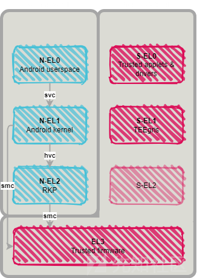
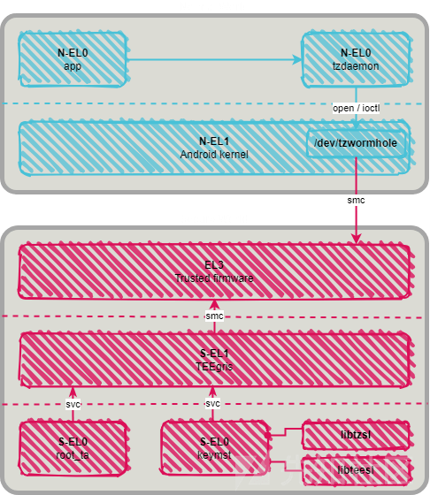
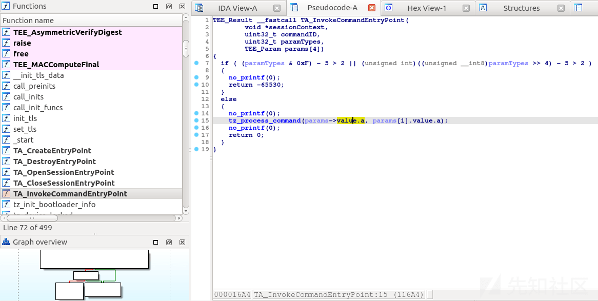
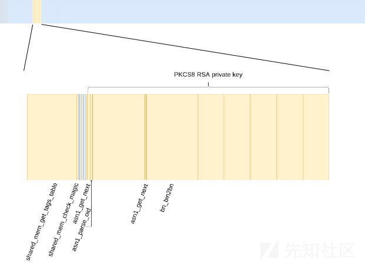
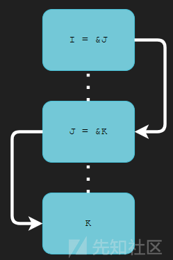
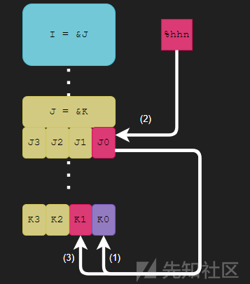
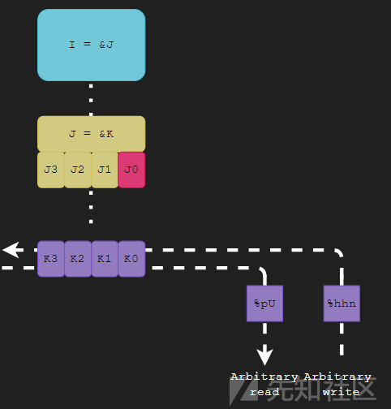
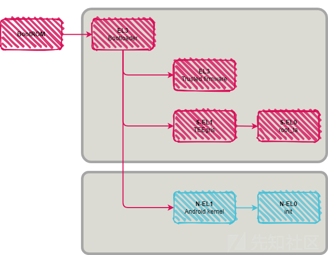

# ARM TrustZone 机制实战分析：转向安全世界 - 先知社区

ARM TrustZone 机制实战分析：转向安全世界

- - -

翻译原文链接：[https://blog.thalium.re/posts/pivoting\_to\_the\_secure\_world/](https://blog.thalium.re/posts/pivoting_to_the_secure_world/)

# ARM TrustZone: pivoting to the secure world

## 一、安卓操作系统背后的深层世界

故事从你之前听到的关于安卓系统的安全漏洞的结局开始，假设我们已经成功地绕过了 SELinux 的安全措施，突破了 seccomp 的限制，并且现在在 Linux 内核层面拥有了完全的管理权限。在这种情况下，我们接下来能够做些什么呢？

安卓系统虽然广为人知，但它的安全执行环境却鲜为人知。让我们深入了解这个领域！首先，让我们明确一些相关的术语：

-   ARM TrustZone：这是 ARM v7-A 和 v8-A 处理器内置的安全扩展功能。这些功能使得硬件能够被划分为两个独立的部分：一个是普通世界，另一个是安全世界。在这个架构中，安全世界包含了最高特权级别的异常处理，即 S-EL3，并且安全操作系统 S-EL1 对硬件设备有着强大的控制能力。
-   Trusted Execution Environment（TEE）：这是一个安全执行环境，它包括在安全世界中运行的小程序、库和操作系统，用于保护敏感操作和数据。
-   Samsung Knox：这是三星提供的一套安全组件和普通应用程序组件的集合，包括 Android 应用和库。在本文的其余部分，我们将“secure”和“trusted”这两个词视为可互换的。Knox 代表了一个小型的、受控的可信计算基础，它运行在一个安全的执行环境中。
-   TEEgris：这是三星为其部分基于 Exynos 处理器的设备提供的可信操作系统。以前，三星设备使用的是名为 Kinibi 的可信操作系统，该系统曾是安全研究的热点。即使是三星的一些型号，如果使用了高通的 SoCs，也会搭载高通自己的可信操作系统 QSEE。在各种 TEE 及其漏洞的高级描述方面，可以在 SoK（艺术现状）类型的文献中找到详细信息。

​ 普通世界 安全世界

[](https://xzfile.aliyuncs.com/media/upload/picture/20240218103758-ba18d740-ce06-1.png)

关于三星的 TEEgris 系统的信息在互联网上比较罕见。我们发现了一些相关资源：Federico menaniri，他是 RISCURE 公司的专家，利用了几个漏洞在普通世界中获得了对安全内存的写入权限；还有 Alexander tarasikov，他使用 qemu 模拟器来模拟安全启动过程，并对 TEE 中的可信小程序进行了 afl 模糊测试，以寻找潜在的安全漏洞。

-   可信小程序：这些是在 TEE 中执行的应用程序，它们提供了额外的安全保障，以防在普通世界中的安全威胁。例如，根据谷歌的 Android 官方文档：对于关注安全性的 Android 应用，可以使用 Android 密钥库来安全地存储其敏感的加密密钥，这样可以避免在普通世界中这些密钥遭到破坏或泄露。

在本文的后续内容中，我们将使用 SM-J330FN 这款设备作为示例，它运行的是 2019 年初的固件版本 J330FNXXU3BSA2\_J330FNXEF3BSA2\_XEF。这款设备搭载了基于 ARMv8-A 架构的 Exynos7570 SoC。三星已经通知我们，基于 Android 12（或更高版本）的固件已经修复了我们在这里讨论的漏洞。有关这些漏洞的详细信息将在后续的漏洞描述部分提供。

## 二、安卓系统中的应用程序是如何与安全执行环境进行交互的？

在正常世界和安全世界之间切换处理器状态的关键软件组件是运行在 EL3 级别的可信固件。在更低异常级别运行的代码可以通过使用 smc 指令来调用它。由于这个 ARM 指令在 EL0 级别（即用户空间）是不可用的，普通世界的应用程序要访问 TEE（可信执行环境）就需要 EL1 级别的支持。在我们的案例研究中：

-   一个运行在用户空间的守护进程 tzdaemon，拥有适当的 SELinux 安全配置文件，因此有权访问设备文件/dev/tz\_wormhole；
-   在内核层面，设备文件/dev/tz\_wormhole 实现了 EL3 级别的触发机制，并包含了数据清洗功能，以确保通信的安全性。

`tz_wormhole`的源代码位于三星 Android 内核源代码的`drivers/misc/tzdev`中。

普通世界与安全世界：

[](https://xzfile.aliyuncs.com/media/upload/picture/20240218103953-feecf41e-ce06-1.png)

TEEGris 是运行在安全世界 S-EL1 级别的组件，而其功能是由在更低权限级别 S-EL0 运行的可信小程序所提供的。

## 三、探索可信执行环境中的小程序

并非每个可信执行环境（TEE）的设计都会这样，但在这个案例中，我们能够直接访问普通世界中作为文件存储的可信小程序。在我们的设备上，这些小程序的文件位于/system/tee/目录。

```plain
j3y17lte:/system/tee $ ls -lR
.:
total 6736-rw-r--r-- 1 root root   67121 2008-12-31 16:00 00000000-0000-0000-0000-00000000dead
-rw-r--r-- 1 root root  298529 2008-12-31 16:00 00000000-0000-0000-0000-000000534b4d
-rw-r--r-- 1 root root 1895418 2008-12-31 16:00 00000000-0000-0000-0000-0000534b504d
-rw-r--r-- 1 root root   95561 2008-12-31 16:00 00000000-0000-0000-0000-00535453540a
-rw-r--r-- 1 root root   85969 2008-12-31 16:00 00000000-0000-0000-0000-00535453540c
-rw-r--r-- 1 root root  218181 2008-12-31 16:00 00000000-0000-0000-0000-00535453540d
-rw-r--r-- 1 root root   59405 2008-12-31 16:00 00000000-0000-0000-0000-00535453540f
-rw-r--r-- 1 root root   85785 2008-12-31 16:00 00000000-0000-0000-0000-0053545354ab
-rw-r--r-- 1 root root  615917 2008-12-31 16:00 00000000-0000-0000-0000-00575644524d
-rw-r--r-- 1 root root   23765 2008-12-31 16:00 00000000-0000-0000-0000-474154454b45
-rw-r--r-- 1 root root  109985 2008-12-31 16:00 00000000-0000-0000-0000-4b45594d5354
-rw-r--r-- 1 root root  393312 2008-12-31 16:00 00000000-0000-0000-0000-505256544545
-rw-r--r-- 1 root root  571553 2008-12-31 16:00 00000000-0000-0000-0000-534543445256
-rw-r--r-- 1 root root  162133 2008-12-31 16:00 00000000-0000-0000-0000-534543535452
-rw-r--r-- 1 root root  789777 2008-12-31 16:00 00000000-0000-0000-0000-564c544b5052
-rw-r--r-- 1 root root   47333 2008-12-31 16:00 00000000-0000-0000-582f-586d3efb39b4
drwxr-xr-x 2 root root    4096 2008-12-31 16:00 driver
-rw-r--r-- 1 root root 1344367 2008-12-31 16:00 startup.tzar
./driver:
total 28-rw-r--r-- 1 root root 17217 2008-12-31 16:00 00000000-0000-0000-0000-00535453540b
-rw-r--r-- 1 root root  6425 2008-12-31 16:00 18d9f073-18a5-4ade-9def-875e07f7f293_
```

使用 UUID 命名规则的文件包含了一个真正的 32 位 ARM ELF 格式的二进制文件：

```plain
$ hexdump -C 00000000-0000-0000-0000-534543535452
00000000  53 45 43 32 00 02 75 10  7f 45 4c 46 01 01 01 00  |SEC2..u..ELF....|00000010  00 00 00 00 00 00 00 00  02 00 28 00 01 00 00 00  |..........(.....|
00000020  74 17 01 00 34 00 00 00  f0 71 02 00 02 02 00 05  |t...4....q......|
... ELF ARM32 ...
...       17 73 61 6d 73 75 6e 67  5f 64 72 76 3a 73 61 6d  |.samsung_drv:sam|
...       73 75 6e 67 5f 64 72 76  01 00 3e bb aa 17 58 1d  |sung_drv..>...X.|
...
...       30 1e 06 03 55 04 03 14  17 73 61 6d 73 75 6e 67  |0...U....samsung|
...       5f 64 72 76 3a 73 61 6d  73 75 6e 67 5f 64 72 76  |_drv:samsung_drv|
...       30 82 01 22 30 0d 06 09  2a 86 48 86 f7 0d 01 01  |0.."0...*.H.....|
```

可以从封装它们的文件中提取出嵌入式 ARM32 ELF 文件，并使用 IDA 这样的逆向工程工具进行加载。ELF 文件之外的额外数据很可能包含了一个数字签名，这是为了在普通世界受损的情况下确保文件的完整性和可信度。

文件/system/tee/startup.tzar 包含了安全执行环境用户空间文件的一部分。尽管它的名字看起来像是一个 tar 压缩文件，但实际上它是一种特殊的归档格式，由 Alexander tarasikov 进行了文档记录。当这个归档文件被解压缩时，会得到以下内容：

```plain
$ tree startup_tzar
├── startup_tzar
│   └── bin
│       ├── 00000004-0004-0004-0404-040404040404
│       ├── 00000005-0005-0005-0505-050505050505
│       ├── 00000006-0006-0006-0606-000000000001
│       ├── 00000006-0006-0006-0606-000000000002
│       ├── arm
│       │   ├── libc++.so
│       │   ├── libdlmsl.so
│       │   ├── libmath.so
│       │   ├── libpthread.so
│       │   ├── libringbuf.so
│       │   ├── libtee_debugsl.so
│       │   ├── libteesl.so
│       │   ├── libteesock.so
│       │   └── libtzsl.so
│       └── libtzld.so
```

这个归档文件总体包含了以下内容：

-   用户空间的库文件，存放在 bin/arm 目录中，例如 libtzsl.so 和 libteesl.so。这些库的符号指向了 TEE GlobalPlatform API，这是在线有文档记录的一个标准 API。这些库是纯正的 ARM32 ELF 格式文件，与我们之前观察到的可信小程序和驱动中的文件不同，它们没有额外的头部和尾部信息；
-   动态链接器，即 libtzld.so，也是一个标准的 ARM32 ELF 格式文件。

综上所述，我们已经找到了在可信执行环境中的小程序、驱动程序和库文件。接下来，我们将对这些文件进行分析。

## 四、GlobalPlatform TEE API 的类型定义

首先，我们关注的是 libteesl.so 库。这个库实现了大量的符合 TEE\_\*命名模式的函数。对于想要了解更多细节的读者，可以参考 TEE GlobalPlatform 的官方文档，这些文档详细定义了 TEE 提供给可信小程序执行的一系列 API。为了在 TEE 上运行，小程序必须导出一些特定的函数。这些 API 的功能非常丰富，甚至包括通过用户空间的守护进程使用 TCP/IP 套接字。回到 libteesl.so，它是对这些 API 的具体实现。为了辅助逆向工程可信组件，我们开发了一个适用于 IDA 的专用类型库：

-   为了适配 TEE GlobalPlatform 的头文件，我们使用了 Hexrays 的 stilib 工具来生成一个名为 tee\_arm.til 的类型库文件，该文件需要放置在 IDA 的安装目录下的${IDA\_HOME}/til/arm 文件夹中；
-   使用 pycparsert 工具处理这些头文件，生成函数签名，并将函数名称映射到具体的类型信息。生成的输出是一个名为 tee\_arm.py 的 Python 脚本，可以在加载到 IDA 中的二进制文件上运行，以便为函数提供类型信息。

IDA Pro 现在有能力理解可信小程序和驱动程序中 TEE API 的具体细节：

[](https://xzfile.aliyuncs.com/media/upload/picture/20240218104015-0bf63814-ce07-1.png)

现在我们有了一个良好的环境来进行密钥管理器可信小程序的静态分析。该小程序在 tzar 归档文件中的标识是 00000000-0000-0000-0000-4b45594d5354。注意，使用 hexlify 函数将’KEYMST’转换为其十六进制表示后得到的是’4b45594d5354’。

## 五、获取密钥管理器可信小程序的控制权

### 1.确定可信小程序的入口点

GlobalPlatform TEE API 定义了五个回调函数来与可信小程序进行交互：

TA\_CreateEntryPoint 和 TA\_DestroyEntryPoint 这两个函数在可信小程序的创建和销毁过程中被调用。

-   当普通世界的应用程序打开和关闭与可信小程序的会话时，会调用 TA\_OpenSessionEntryPoint 和 TA\_CloseSessionEntryPoint 这两个函数；
-   当普通世界的应用程序向可信小程序发送请求时，会调用 TA\_InvokeCommandEntryPoint 函数。这个函数根据请求代码来处理分发逻辑。一旦普通世界应用程序与可信小程序建立了会话，它就可以执行多个命令，并在完成后关闭会话。

需要注意的是，程序的 main 函数并不位于可信小程序的二进制文件中，而是在 libteesl.so 库中实现。这个库负责初始化可信小程序，然后进入一个循环，处理通过 POSIX 消息队列接收到的消息。当接收到合适的消息时，teesl 库会调用那些已经导出的函数来处理消息。

### 2.漏洞类型：标准的栈溢出漏洞

进行静态分析时，我们首先应该检查程序的安全加固措施：

```plain
$ pwn checksec KEYMST
[*] 'KEYMST'
    Arch:     arm-32-little
    RELRO:    No RELRO
    Stack:    No canary found
    NX:       NX enabled
    PIE:      No PIE (0x10000)
```

从 TA\_InvokeCommandEntryPoint 开始，我们迅速跳转到 tz\_process\_command，经过一段时间的处理，最终到达一个执行了奇怪的 memcpy 操作的小函数：

```plain
__int64 hal_rsa_key_get_pub_exp(hal_rsa_key *a1)
{
  size_t pub_exp_size; // r2
  char *v2; // r1
  __int64 v4; // [sp+0h] [bp-18h] BYREF
  pub_exp_size = a1->pub_exp_size;
  v2 = (char *)&a1->content + a1->pub_exp_offset;
  v4 = 0LL;
  memcpy(&v4, v2, pub_exp_size); /* pub_exp_size is controlled by normal world app */
  return v4;
}
```

当导入一个采用 PKCS8 格式的 RSA 私钥时，会触发这个函数的调用。RSA 密钥的公开指数是由攻击者控制的值，它被复制到栈上。虽然合法的公开指数通常比较小，但密钥的格式本身并不保证其值不超过 64 位整数的范围。私钥的格式本身没有限制，但密钥的实现会验证关于密钥的一些假设，其中包括公开指数的大小应该小于 512 字节。综合来看，我们可以在栈上覆盖最多 0x200-8=0x1f8 字节。

要触发这个漏洞，我们还需要经过一系列函数调用，每个函数都会处理参数的一部分。这意味着我们需要精心设计输入缓冲区的内容，以便它能够通过这些函数调用，最终达到触发漏洞的目的。

-   TA\_InvokeCommandEntryPoint：这是 TEE API 的入口点，输入缓冲区包含一个类型，该类型经过验证。
-   tz\_process\_command 和 km\_import\_key：这些函数解析并验证公钥的参数。由于这些验证并不复杂，因此很容易绕过，我们在这里不会详细讨论。
-   km\_rsa\_key\_get\_pub\_exp：这个函数跳转到 hal\_rsa\_key\_get\_pub\_exp，后者会导致栈溢出。

由于我们没有任何有效的输入缓冲区，我们必须从头开始创建一个正确的缓冲区。但是，由于在生产设备上无法对安全世界进行调试，我们无法确定在处理请求时程序执行的路径。

### 3.使用 qiling 模拟器构建一个 TEEGris 操作系统的模拟器。

为了提升我们的动态分析能力，我们基于 qiling 开发了一个 TEEGris 操作系统的模拟器。这个模拟器将只用于测试我们专门准备的载荷，并验证它们的有效性。我们没有选择 Tarasikov 提出的技术路线，因为我们希望能够在模拟器中添加动态分析的代码片段，而不是每次都需要重新编译 qemu。

我们选择 qiling 作为模拟器的原因如下：

-   qiling 是用 Python 编写的，这使得我们可以轻松地监控和控制指令的执行以及内存的使用。在我们进行模拟的过程中，我们可以构建一些高级分析，这些分析在真实硬件上通过调试接口是无法实现的，例如寻找未初始化的栈变量。
-   qiling 已经支持 POSIX 系统调用的模拟，尽管我们需要对它的机制进行调整，以适应 TEEGris 系统中特有的系统调用风格。
-   qiling 支持创建程序运行状态的快照，并在需要时恢复到该状态。因此，我们可以引导一个可信小程序，对其进行快照，然后在需要时快速恢复它，以便从恢复后的状态继续进行探索和研究。

为了更深入地了解 TEEGris 的系统调用，我们对 libtzsl.so 进行了分析：

-   为了确定系统调用的约定，我们查看了一些包装器函数，例如 syslogwrapper。通过这些函数，我们可以做出假设：r7 寄存器保存了系统调用号，而参数是通过 r0 到 r6 寄存器传递的。

```plain
.text:0000BDC8 syslog                                  ; CODE XREF: j_syslog+8↑j
.text:0000BDC8                                         ; DATA XREF: LOAD:00001338↑o ...
.text:0000BDC8                 PUSH            {R4,R7,R11,LR}
.text:0000BDCC                 MOV             R7, #0x12
.text:0000BDD0                 ADD             R11, SP, #0xC
.text:0000BDD4                 SVC             0
.text:0000BDD8                 CMN             R0, #0x1000
.text:0000BDDC                 MOV             R4, R0
.text:0000BDE0                 BLS             loc_BDF4
.text:0000BDE4                 RSB             R4, R4, #0
.text:0000BDE8                 BL              j_get_errno_addr
.text:0000BDEC                 STR             R4, [R0]
.text:0000BDF0                 MOV             R4, #0xFFFFFFFF
.text:0000BDF4
.text:0000BDF4 loc_BDF4                                ; CODE XREF: syslog+18↑j
.text:0000BDF4                 MOV             R0, R4
.text:0000BDF8                 POP             {R4,R7,R11,PC}
.text:0000BDF8 ; End of function syslog
```

-   为了确定系统调用的编号，我们编写了一个 Python 脚本来自动识别 r7 寄存器的初始化以及随后的监督者模式调用（supervisor call），方法是找到 svc #0 指令之后回溯几条指令。一旦检测到系统调用的模式，我们就查找其前一个导出的函数。由于这个逻辑相对简单，我们需要手动处理一些特殊情况。

```plain
$ ./extract-syscalls.py startup_tzar/bin/arm/libtzsl.so
syscalls = {
  # sysno: (name, start of function, address of svc #0)
  1: ('thread_create', 0xbe70, 0xbed4),
  2: ('thread_wait', 0xbf5c, 0xbf68),
  3: ('mmap', 0x52fc, 0x5380),
  4: ('munmap', 0x5bbc, 0x5bc8),
  5: ('epoll_ctl', 0x33b0, 0x33bc),
  6: ('close', 0x2c78, 0x2c84),
  7: ('open', 0x5bf0, 0x5c10),
  8: ('read', 0x6bd0, 0x6bdc),
...
```

在继续使用 qiling 进行模拟时，我们需要对模拟器的操作系统层（os layer）和链接器层（linker layer）进行修改：

1.  在操作系统层，我们通过分析 libtzsl.so 这个库文件，获取了系统调用的编号和名称。我们首先确保能够正确地模拟 open 和 mmap 这两个系统调用，然后在需要时逐步实现更多的系统调用。
2.  linker：操作系统通过一个辅助向量来传递有关启动的二进制文件的信息。这些信息在动态链接器的早期阶段被处理。链接器期望辅助向量中值的固定顺序。
3.  os：尽管安全内核在外观上类似于 POSIX 兼容，但它使用了一些特殊的语义。例如，对一个文件后端描述符的 ioctl(fd, 0, 0) 调用会返回文件的大小，这与 fstat(fd, &stat); return stat.st\_size;的效果相同。

### 4.将 TEEGris 的系统调用与 qiling 模拟器中已经模拟的系统调用相结合。

为了向模拟器中添加新的系统调用，我们使用 Qiling.set\_syscall 方法。我们不会重写每一个系统调用，而是将每个 TEEGris 的系统调用号映射到 qiling 中已经模拟的 Linux 系统调用。我们使用 Qiling.set\_syscall 函数，并通过查找原始的实现代码来完成这个映射。

```plain
self.original_handlers = {}
map_syscall = utils.ql_syscall_mapping_function(self.ostype)
for x in range(1, 400):
    y = map_syscall(self, x)
    # syscall is not already handled by qiling    if y is None: continue    # resolve handler    handler = None    if y in dir(posix_syscall):
        handler = getattr(posix_syscall, y)
    elif y in dir(linux_syscall):
        handler = getattr(linux_syscall, y)
    assert(y.startswith('ql_syscall_'))
    name = y[11:]
```

新添加的系统调用处理程序可以利用 qiling 模拟器中原有的实现，无论是直接调用它，还是根据 TEEGris 的要求适配系统调用的参数。

```plain
self.add_fs_mapper('sys://proc', Fake_sys_proc())
```

一个简单的实现例子如下：

```plain
class Fake_sys_proc(QlFsMappedObject):
  def read(self, size):
    return b'\x01'  def fstat(self):
    return -1  def close(self):
    return 0
```

这个模板可以轻松地扩展为一个有状态的行为模式，这在某些情况下是必需的。尽管 QlFsMappedObject 已经定义了一个处理 ioctl 的方法，但我们选择在系统调用处理程序中实现它，因为我们需要向 ioctl 系统调用中的第三个参数（地址）写入数据，这是通过 QlFsMappedObject 接口无法直接做到的。

### 5.如何触发漏洞

借助我们的模拟器，密钥管理器可信小程序（KEYMST）得以加载。然而，我们没有能够到达漏洞位置的请求示例。为了找到一个正确的消息，我们建立了一个反馈循环：一旦进入主处理循环，我们就映射输入参数并调用 TA\_InvokeCommandEntryPoint。qiling 然后生成执行的 drcov 覆盖率，我们用它来训练 IDA 和 lighthouse 插件。重复这个过程，我们最终构造了一个输入数据，它符合检查条件并且允许我们控制大部分共享输入缓冲区。下面展示的输入缓冲区长度为 87856 字节，黄色条表示在处理普通世界请求时读取的内存区域。

[](https://xzfile.aliyuncs.com/media/upload/picture/20240218104047-1f16da2a-ce07-1.png)

输入缓冲区的大部分区域未被访问：我们可以自由地利用这部分空间来嵌入我们计划在利用过程中使用的受控信息。黄色高亮区域表示已经被访问并大部分经过验证的是 PKCS8 格式的 RSA 私钥和“标签表”。

## 六、构建一个 rop 链切换跳转流程

栈溢出是一个很好的起点，我们能够覆盖的初始栈空间虽然不大。当我们能够在安全世界中执行代码时，我们也想从内部观察这个环境，从一个可信小程序的角度来看。测试系统调用行为，并验证我们对非 POSIX 系统调用的假设是非常重要的。由于我们完全控制了输入缓冲区的大部分，我们构建了第一个 rop 链，它将复制一个更大的、嵌入的 rop 链，并切换到这个新的 rop 链执行。

1.  首先，我们构建一个引导 rop 链，它的大小恰好为 0x1f8 字节：
    
    1.  在寄存器值被覆盖之前，先保存它们的当前内容。在 KEYMST 的可信小程序中，bss 段提供了足够的空间来保存这些值。
    2.  在一个固定的地址分配一个新的栈。让可信小程序使用 dommap 系统调用，将 0xdead000 地址的 0x8000 字节映射到内存，设置读写权限。选择的地址是随意的，但从鲁棒性的角度考虑，我们本可
    3.  使用 TEEGris 特定的系统调用来验证内存范围及其权限是否存在。将共享输入缓冲区的大部分内容复制到新分配的栈上。
2.  接下来，我们构建一个嵌入的 rop 链。我们任意地将缓冲区划分为 0x5e00 字节的栈空间和 0x2000 字节的存储空间。由于可信小程序是 aarch32 架构的，它支持 load multiple 类型的指令，如 akaldm。我们选择了\[KEYMST:thumb\] 0x1975c 处的 ldm.w 指令，它将多个寄存器的值加载到 r4 寄存器。这个指令是一个跨越 4 个字节的 T32 指令。我们注意到，ROPgadget、ropper 和 xrop 工具没有输出这个 gadget，尽管它被正确地归类为一个跳转导向编程（JOP）gadget。对此感兴趣的读者可以在 T32 指令集的附录中找到更多细节。嵌入的有效负载由三个部分组成，我们同样任意地选择了数据和栈区域之间的分界线。
    
    1.  \[0x100-0x200\]: 新的寄存器值
        
    2.  \[0x200-0x6000\]: sp 寄存器被设置为 0xdead000+0x200 的地址，这意味着在 ldm.w 指令执行之后，该地址将成为栈顶。
        
    3.  \[0x6000-0x8000\]: 嵌入在 rop 链中的有效负载所使用的数据。因为我们已经将输入缓冲区映射到了一个固定的地址，我们能够在目标程序中计算出我们复制数据的地址，并且可以轻松地引用我们希望作为系统调用输入或输出参数的数据。
        

## 七、安全内核交互过程

现在我们能够利用 rop 技术进入一个可信小程序，这意味着我们可以代表它执行安全系统调用。我们已经对安全用户空间环境进行了探索，寻找能够以任意代码执行的方式来利用它。

-   尝试以写入模式打开一个文件，然后保存任意代码，接着以读取模式打开它，并将其映射为只读（RX）是不行的，因为文件不能以写入模式打开。但是，即使是以固定地址，我们也可以将已经存在的文件映射为只读（RX）。通过这种方式，我们可以丰富我们的 rop gadgets 集合，例如通过加载 libteesock.so 库，它包含各种类型的间接分支指令，这些指令可以用于构建 rop 链。
-   将匿名内存映射为 RW（读写）模式，然后将其重新映射为 RX（只读）模式：没有系统调用能够执行与 mprotect 系统调用等效的操作。我们尝试使用 mmap 系统调用来实现类似的功能，但所有的尝试都没有成功。
-   创建一个 socketpair，并将内容映射为 RX（只读）模式：我们确定了在安全内核中唯一支持的 socket 类型、域和家族。反向工程安全内核表明，这种类型的文件描述符支持 mmap 系统调用。但是在尝试将内存映射设置为可执行（PROT\_EXEC）时，映射失败了。
-   尝试使用 TEES\_ExecuteCustomHandler 和 TEES\_RegisterCustomHandler 系统调用：尽管这些调用名称听起来很有吸引力，但在 KEYMST 的上下文中执行它们却失败了，系统调用返回了错误码 -1，EPERM（操作被拒绝，因为权限不足）。我们之前在 startup.tzar 中看到的可信驱动程序无法从普通世界直接访问。幸运的是，正是利用这个漏洞，我们可以让 KEYMST 与这些可信驱动程序通信，并探索它们的功能。

### 影响安卓版本号

三星确认了这个漏洞影响了密钥管理器可信小程序（KEYMST），它只存在于 Android P 版本的固件中。而更新版本的 Android 操作系统则不受这个漏洞的影响。

## 八、可信驱动程序的安全控制

### 1.目的：在安全内核中实现代码执行

我们期望可信驱动程序比可信小程序拥有更多的权限。让我们从分析 startup 归档文件中包含的驱动程序开始。对 driver/00000000-0000-0000-0000-00535453540b 文件的静态分析显示，它调用了不寻常的系统调用 TEES\_ExecuteCustomHandler。

```plain
int __fastcall timautil_sram_recovery_read(int a1)
{
  int result; // r0
  int v2; // r2
  int v4[3]; // [sp+8h] [bp-24h] BYREF
  int v5[4]; // [sp+14h] [bp-18h] BYREF
  int v6; // [sp+24h] [bp-8h]
  v6 = -3;
  TEE_MemFill(v4, 0, 28);
  v4[0] = 130;
  v4[1] = 5;
  v4[2] = 0;
  printf("@echeck: result: %d, cmd_ret0: %d\n", v6, v5[0]);
  v6 = TEES_ExecuteCustomHandler(0xB2000202, v4);
  printf("##echeck: result: %d, cmd_ret0: %d\n", v6, v5[0]);
  result = TEE_MemMove(*(_DWORD *)(a1 + 8), v5, 4);
  if ( v6 )
    return printf("Execute Custom handler failed to get mode : retval %d (%08x)\n", v6, v2);
  return result;
}
```

从函数名上听起来很有希望，甚至还有一个名为 TEES\_RegisterCustomHandler 的系统调用，我们可以利用它来安装某种新处理程序。但是，首先，让我们分析启动映像 boot.img。它包含安全操作系统 TEEGris 的映像，该映像将在启动时加载并运行。附件 Secure reconnaissance 描述了如何从中提取操作系统并执行系统调用实现的静态分析。我们看到对调用系统调用的进程进行了验证，以确保其权限和身份。

```plain
__int64 __fastcall sel1_syscall_TEES_ExecuteCustomHandler(unsigned int a1, __int64 a2)
{
  _BYTE v5[56]; // [xsp+28h] [xbp+28h] BYREF
  if ( !sub_FFFFFFFFF01059C4(0x12u, 1i64) ) // looks like a verification
    return -1i64;
  if ( (unsigned int)j_sel1_do_copy_from_userspace((__int64)v5, a2, 56i64) )
    return -14i64;
  sel1_perform_smc(a1, v5, 0x40000000);
  if ( (unsigned int)j_sel1_do_copy_to_userspace(a2, (__int64)v5, 56i64) )
    return -14i64;
  return 0i64;
}
```

这个验证过程与调用 TEES\_RegisterCustomHandler 时执行的验证过程相同。

```plain
__int64 __fastcall sel1_syscall_TEES_RegisterCustomHandler(unsigned __int16 a1, __int64 a2, __int64 a3, int a4)
{
  BOOL v8; // w0
  __int64 v9; // x1
  int v11; // w24
  __int64 v12; // x0
  unsigned __int64 v13; // x23
  __int64 v14; // x0
  _QWORD *v15; // x25
  int v16; // w19
  unsigned int v18; // [xsp+5Ch] [xbp+5Ch] BYREF
  v8 = sub_FFFFFFFFF01059C4(0x12u, 1i64); // the very same verification
  v9 = -1i64;
  if ( v8 )
  {
    v9 = -22i64;
    if ( (unsigned __int64)(a3 - 1) <= 0x3FFFF && a2 != 0 )
    {
      v11 = sub_FFFFFFFFF012413C(
              *(_QWORD *)(((_ReadStatusReg(ARM64_SYSREG(3, 0, 13, 0, 4)) - 1) & 0xFFFFFFFFFFFFE000ui64) + 0x68) + 468i64,
              16i64);
      v18 = (unsigned __int64)(a3 + 4095) >> 12; // round to page size
      v12 = sub_FFFFFFFFF010EC00(&v18, 0i64, 0);
      v13 = v12;
      v9 = -12i64;
      if ( v12 )
      {
        v14 = sub_FFFFFFFFF010EA34(v12);
        v15 = (_QWORD *)v14;
        if ( !v14 || (unsigned int)j_sel1_do_copy_from_userspace(v14, a2, a3) ) // copy from userspace
        {
          v16 = -14;
LABEL_11:
          sub_FFFFFFFFF010ED0C(v13, v18);
          return v16;
        }
        v16 = sub_FFFFFFFFF01194D4(a1, v11, v15, v18, a4);
        v9 = 0i64;
        if ( v16 )
          goto LABEL_11;
      }
    }
  }
  return v9;
}
```

这意味着如果一个进程被允许调用 TEES\_ExecuteCustomHandler，它也可能被授权调用 TEES\_RegisterCustomHandler。执行验证的函数是 sub\_FFFFFFFFF01059C4。目标设备上只有一个活动的驱动程序。这个驱动程序看起来很有希望，因为它使用了一个需要与在安全内核中注册处理程序的系统调用相同的权限级别的系统调用。基于之前显示的 UUID 命名方案，我们将这个驱动程序在文章的其余部分称为 STST。驱动程序的二进制文件与 KEYMST 二进制文件具有相同的类型，它也是一个可信小程序，导出了 TEE 函数。

### 2.检查驱动程序入口点

驱动程序具有 STST 的安全加固特性：

```plain
$ pwn checksec STST
[*] 'STST'
    Arch:     arm-32-little
    RELRO:    No RELRO
    Stack:    No canary found
    NX:       NX enabled
    PIE:      No PIE (0x10000)
```

当驱动程序加载时，它会通过 TEES\_RegisterDriver 系统调用注册自己。

```plain
struct driver {
  int (*open_f)();
  int (*ioctl_f)();
  ...
};
static struct driver drv;
int TA_CreateEntryPoint()
{
  int v2; // [sp+4h] [bp-8h]
  drv.open_f = drv_open;
  drv.ioctl_f = drv_ioctl;

  v2 = TEES_RegisterDriver(&drv);
  if ( v2 )
  {
    printf("register_driver failed, ret = %d\n", v2);
    return -65536;
  }
  else  {
    printf("TIMA Driver registered\n");
    return 0;
  }
}
```

驱动程序注册了一个 ioctl 回调，这个回调可能会被易受攻击的 KEYMST 小程序调用。在这个驱动程序上可以执行几个 ioctl 命令，其中两个最终会调用 log\_msg 函数。

### 3.获得任意位置读写权限

由于驱动程序进程在两次 ioctl 调用之间不会终止，这个漏洞可以连续多次利用。我们已经选择在一个足够深的栈区域改变栈内容，以避免在两次 ioctl 调用之间被重用。我们发现了一个由三个栈词组成的链，它们相互指向。

[](https://xzfile.aliyuncs.com/media/upload/picture/20240218104438-a8db5f10-ce07-1.png)

在上面的图中，程序在多次 ioctl 调用之间不会修改值 K，这让我们能够完全控制它的值。为了将一个任意地址 A 替换栈上的 K，我们将其逐字节写入，每次都覆盖 J 的低字节，使用递增的值。

[](https://xzfile.aliyuncs.com/media/upload/picture/20240218104408-96cf1cbc-ce07-1.png)

一旦我们能够在栈上放置任意地址，我们就可以利用 printf 函数的%pU 或%n格式化占位符来达到我们的目的。

[](https://xzfile.aliyuncs.com/media/upload/picture/20240218104418-9ce12212-ce07-1.png)

由于该驱动程序没有 PIE（Position Independent Executable，位置无关可执行文件）特性，其.got（全局偏移表）段在内存中占据一个固定的位置。通过泄露.got 段的两个字，我们能够获取到 libteesl.so 和 libtzsl.so 的随机化地址。现在的问题是：如何将一系列精心设计的写入操作转化为代码执行操作？

### 4.任意代码执行

如果使用动态内存钩子，如\_\_malloc\_hook，在这里不是一个可行的选择，因为 libtzsl.so 的堆实现没有钩子机制。尽管在栈上覆盖返回地址仍然是一个选项，但我们选择利用一个特定的功能，即自定义 printf 格式规范，这是由 glibc 实现的。幸运的是，libtzsl.so 也实现了这个功能。这个功能本质上允许应用程序动态注册新的格式规范，通过将自定义格式，如%W，映射到用户指定的函数，该函数将输出对应的参数。以下函数展示了如何注册一个新的自定义格式规范：

```plain
int __fastcall register_printf_format(char a1, int a2)
{
  int i; // r2
  char *v3; // lr
  int result; // r0
  for ( i = 0; i != 10; ++i )
  {
    v3 = &custom_formats_tab[8 * i];
    if ( !*((_DWORD *)v3 + 1) )
    {
      custom_formats_tab[8 * i] = a1;
      result = 0;
      *((_DWORD *)v3 + 1) = a2;
      return result;
    }
  }
  return 1;
}
```

这个新注册的格式规范器随后可以与 printf 函数一起使用。printf 的内部实现非常复杂和庞大，但有趣的是以下代码片段，它通过循环遍历所有已注册的自定义格式规范器：

```plain
...
LABEL_138:
  v44 = 0;
  while ( (unsigned __int8)custom_formats_tab[8 * v44] != current_fmtspec )
  {
    if ( ++v44 == 10 )
      goto LABEL_141;
  }
  result = (*(int (__fastcall **)(unsigned int *))&custom_formats_tab[8 * v44 + 4])(&current_pos);
  if ( result == 1 )
  {
LABEL_141:
    output_char((int)&current_pos);
    if ( *cur_fmt )
      goto LABEL_146;
    --cur_fmt;
    goto LABEL_174;
  }
  if ( result >= 0 )
    goto LABEL_174;
  return result;
}
```

在调用自定义函数时，r12 寄存器指向 libtzsl.so 的.got 段中的 vasprintf 指针：

```plain
.got:0001F85C vsscanf_s_ptr   DCD vsscanf_s           ; DATA XREF: j_vsscanf_s+8↑r
.got:0001F860 vasprintf_ptr   DCD vasprintf           ; DATA XREF: j_vasprintf+8↑r
.got:0001F864 recvmsg_ptr     DCD recvmsg             ; DATA XREF: j_recvmsg+8↑r
.got:0001F868 mq_open_ptr     DCD mq_open             ; DATA XREF: j_mq_open+8↑r
.got:0001F86C __iwshmem_mmap_ptr DCD __iwshmem_mmap   ; DATA XREF: j___iwshmem_mmap+8↑r
.got:0001F870 close_ptr       DCD close               ; DATA XREF: j_close+8↑r
.got:0001F874 raise_ptr       DCD raise               ; DATA XREF: j_raise+8↑r
.got:0001F878 free_ptr        DCD free                ; DATA XREF: j_free+8↑r
.got:0001F87C dword_1F87C     DCD 0                   ; DATA XREF: get_errno_addr↑o
.got:0001F87C                                         ; get_errno_addr+C↑o ...
.got:0001F87C                                         ; TLS-reference
.got:0001F880                 DCD 0
.got:0001F884 abort_handler_s_ptr DCD abort_handler_s ; DATA XREF: set_constraint_handler_s+24↑o
.got:0001F884                                         ; set_constraint_handler_s+28↑r ...
.got:0001F888 extra_mmap_flags_ptr DCD extra_mmap_flags
.got:0001F888                                         ; DATA XREF: sub_3BBC+8↑o
.got:0001F888                                         ; sub_3BBC+24↑r ...
.got:0001F888 ; .got          ends
.got:0001F888
.data:0001F88C ; ===========================================================================
.data:0001F88C
.data:0001F88C ; Segment type: Pure data
.data:0001F88C                 AREA .data, DATA
.data:0001F88C                 ; ORG 0x1F88C
.data:0001F88C off_1F88C       DCD abort_handler_s     ; DATA XREF: set_constraint_handler_s↑o
.data:0001F88C                                         ; set_constraint_handler_s+10↑o ...
.data:0001F890 aUnknown        DCB "UNKNOWN",0         ; DATA XREF: set_log_component+8↑o
.data:0001F890                                         ; set_log_component+14↑o ...
.data:0001F898                 DCB    0
```

有人可能会问这个值是从哪里来的。原因有：

1.  内部使用 vasprintf；
2.  这两个函数都在 libtzsl.so 中，因此没有理由通过.plt 进行分支；
3.  但是由于几个原因，我们必须通过.plt 进行分支。这些原因包括分支将不会是一个有效的 ARM 指令；
4.  veener 可以在.plt 中找到，它使用 ip, akar12, 执行分支；
5.  这个值在 ip 中保持不变，因为它只用于分支一些内部函数。由于.got 段是可重写的，我们得出结论，驱动程序利用可以通过调用\[[libteesl.so](http://libteesl.so/):thumb\] 0x48f9a: ldm.w ip, {r0, r1, r3, r4, r5, r6, r8, sb, fp, ip, sp, pc}指令来实现。这个指令允许我们执行一个栈转储并跳入一个 rop 链。由于我们在.got 上的限制，我们无法在第一次射击时直接控制美味的寄存器。例如，改变 recvmsg 会导致驱动程序故障，因为该函数用于接收 ioctl 调用。但是我们可以控制 sp 和 PC，而不会导致崩溃。

```plain
.got:0001F85C vsscanf_s_ptr   DCD vsscanf_s           ; DATA XREF: j_vsscanf_s+8↑r
.got:0001F860 vasprintf_ptr   DCD vasprintf           ; DATA XREF: j_vasprintf+8↑r <= ip.got:0001F864 recvmsg_ptr     DCD recvmsg             ; DO NOT TOUCH THIS.got:0001F868 mq_open_ptr     DCD mq_open             ; DATA XREF: j_mq_open+8↑r.got:0001F86C __iwshmem_mmap_ptr DCD __iwshmem_mmap   ; DATA XREF: j___iwshmem_mmap+8↑r.got:0001F870 close_ptr       DCD close               ; DATA XREF: j_close+8↑r.got:0001F874 raise_ptr       DCD raise               ; DATA XREF: j_raise+8↑r.got:0001F878 free_ptr        DCD free                ; DATA XREF: j_free+8↑r.got:0001F87C dword_1F87C     DCD 0                   ; DATA XREF: get_errno_addr↑o.got:0001F87C                                         ; get_errno_addr+C↑o ....got:0001F880                 DCD 0.got:0001F884 abort_handler_s_ptr DCD abort_handler_s ; DATA XREF: set_constraint_handler_s+24↑o
.got:0001F884                                         ; set_constraint_handler_s+28↑r ....got:0001F888         controlled sp                   ; SAFE TO CHANGE.data:0001F88C        controlled pc                   ; SAFE TO CHANGE
.data:0001F88C                                        ; set_constraint_handler_s+10↑o ...
.data:0001F890 aUnknown        DCB "UNKNOWN",0        ; DATA XREF: set_log_component+8↑o
.data:0001F890                                        ; set_log_component+14↑o ...
.data:0001F898                 DCB    0
```

幸运的是，libteesl.so 和 libtzsl.so 中有许多可用的工具（gadgets），而且我们已经泄露了它们的基址。

### 5.影响版本号

三星确认了这个漏洞影响了 STST，这是一个特权可信小程序，它随从 Android P 版本到 Android R 版本的所有 Android 操作系统版本一起发布。请注意，Android S 版本及之后更新的版本不受这个漏洞的影响。

## 九、结论与推断

我们希望您喜欢这次对三星 ARM 安全世界的探索之旅。软件是一个持续存在的漏洞来源。ARM TrustZone 是一个不错的特性，但其提供的隔离安全性仅取决于在其内部运行的软件组件的安全性。在我们的案例中，我们通过链接两个漏洞，有可能在安全操作系统的上下文中实现代码执行。这两个小程序本可以通过一些基本的安全加固措施（如栈饼干、PIE 和 RELRO）来增强安全性。我们期待在未来的探索中再次与您相见！

## 十、ARM 架构 32 位指令集:T32 ISA

现代 ARM 处理器支持多个指令集。对于我们来说最重要的是：

-   ARM 指令，这是 4 字节的指令；
-   Thumb 指令，这是 2 字节的指令，因此提供了更高的代码密度。然而，ISA 的丰富性不如 ARM 指令集。从 ARMv7 开始，ARM 决定扩展 Thumb 指令集，加入 Thumb2 指令，这是 4 字节的指令，以从更紧凑的机器代码中受益。这些指令可能看起来像合法的 ARM 指令，但它们开始的地址不是 4 的倍数。并非所有的 ARM 指令都支持，只有当处于 Thumb 模式时，才支持一些选定的指令。多重加载或 ldm 是其中之一。虽然 Thumb 有 ldm 指令，但它们不允许设置 pc，因为操作范围太有限。Thumb2 包含强大的 ARM 变体，包括设置 pc 的能力。
-   需要注意的是，在 ARMv8 ISA 的最新版本中，使用 ldm 设置 sp 会导致不可预测的行为。然而，在我们的目标设备上尝试，它却能正常工作：栈正确转储。因此，在 ARM 代码段中寻找 gadget 时，搜索 Thumb2 指令是有用的。以下示例可能有助于确定问题的来源：

```plain
.section .text
.global _start
.arm
_start:
        mov r0, r0
        adr r0, gadget+1
        bx r0
        .byte 0x00, 0x00
.thumb
gadget:
        .byte 0xe8, 0x94, 0xeb, 0xff
        .byte 0xff, 0xeb, 0x94, 0xe8
```

现有的 ROP 工具，包括 ROPgadget、xrop 和 ropper，我们在测试中可能会错过某些 gadgets。这主要是因为这些工具的工作方式：它们找到一个有趣的结束指令，然后在几个向后的地方执行反汇编，试图找到在那里结束的非分支流。具体来看这些工具：

-   ROPgadget 检测到多重加载（ldm）可能是一个 ROP 链的结束点。但只有在 ldm 指令从地址的 4 的倍数开始时，它才会被检测到。正如我们所见，Thumb2 允许在 2 的倍数地址上的此类 gadget，但不允许在 4 的倍数地址上。如果我们指定–align 2 选项，那么该 gadget 将被错误地检测为 ARM 指令 - 需要记住的是，尽管 Thumb2 包含了许多 ARM 指令，但它本身是 Thumb 指令集的扩展。然而，该指令所在的指令流是 Thumb 模式，遵循 Thumb 指令集的特点。
-   ropper 工具不会检测多重加载（ldm）作为 ROP 链的可能结束点；
-   xrop 工具会检测多重加载（ldm）作为 ROP 链的可能结束点。基于 bfd libopcodes 的反汇编引擎支持 Thumb 和 Thumb2 指令的解码。然而，在我们的测试二进制中，它未能检测到该 gadget。应用到上面的示例中，ropper 和 xrop 工具产生了如下结果：

```plain
> # The gadget will not be detected
 > ./ROPgadget.py --binary ../samples/ldm
Gadgets information
============================================================
0x00010058 : add r0, pc, #3 ; bx r0
0x00010044 : andeq r0, r0, ip, rrx ; andeq r0, r0, ip, rrx ; andeq r0, r0, r5 ; ...
0x00010048 : andeq r0, r0, ip, rrx ; andeq r0, r0, r5 ; andeq r0, r1, r0 ; ...
0x00010038 : andeq r0, r0, r0 ; andeq r0, r1, r0 ; andeq r0, r1, r0 ; ...
0x0001004c : andeq r0, r0, r5 ; andeq r0, r1, r0 ; mov r0, r0 ; add r0, pc, #3 ; bx r0
0x00010040 : andeq r0, r1, r0 ; andeq r0, r0, ip, rrx ; andeq r0, r0, ip, rrx ; ...
0x0001003c : andeq r0, r1, r0 ; andeq r0, r1, r0 ; andeq r0, r0, ip, rrx ; ...
0x00010050 : andeq r0, r1, r0 ; mov r0, r0 ; add r0, pc, #3 ; bx r0
0x0001005c : bx r0
0x00010054 : mov r0, r0 ; add r0, pc, #3 ; bx r0
Unique gadgets found: 10
 > # The gadget will be detected as we force the alignment to Thumb alignment
 > ./ROPgadget.py --binary ../samples/ldm --align 2
Gadgets information
============================================================
0x00010058 : add r0, pc, #3 ; bx r0
0x0001004c : andeq r0, r0, r5 ; andeq r0, r1, r0 ; mov r0, r0 ; add r0, pc, #3 ; bx r0
0x00010050 : andeq r0, r1, r0 ; mov r0, r0 ; add r0, pc, #3 ; bx r0
0x0001005c : bx r0
0x00010066 : ldm r4, {r0, r1, r2, r3, r4, r5, r6, r7, r8, sb, fp, sp, lr, pc}
0x00010054 : mov r0, r0 ; add r0, pc, #3 ; bx r0
Unique gadgets found: 6
 > # The gadget will not be detected
 > Ropper.py -a ARMTHUMB -f ./ldm
[INFO] Load gadgets from cache
[LOAD] loading... 100%
Gadgets
=======
0 gadgets found
 > # The gadget will not be detected
 > Ropper.py -a ARM -f ./ldm
[INFO] Load gadgets from cache
[LOAD] loading... 100%
[LOAD] removing double gadgets... 100%
Gadgets
=======
0x00010058: add r0, pc, #3; bx r0; 
0x00010048: andeq r0, r0, ip, rrx; andeq r0, r0, r5; andeq r0, r1, r0; mov r0, r0; ...
0x0001004c: andeq r0, r0, r5; andeq r0, r1, r0; mov r0, r0; add r0, pc, #3; bx r0; 
0x00010050: andeq r0, r1, r0; mov r0, r0; add r0, pc, #3; bx r0; 
0x0001005c: bx r0; 
0x00010054: mov r0, r0; add r0, pc, #3; bx r0; 
6 gadgets found
 > # The gadget will not be detected
 > xrop -b 16 -r arm ./ldm
> 0x50                0000                      movs        r0, r0
0x54                  0000                      movs        r0, r0
0x58                  0003                      movs        r3, r0
0x5c                  E12FFF10                  vrhadd.u16        d14, d0, d31
_______________________________________________________________
 > # The gadget will not be detected
 > xrop -b 32 -r arm ./ldm
> 0x50                00010000                  andeq        r0, r1, r0
0x54                  E1A00000                  nop                        ; (mov r0, r0)
0x58                  E28F0003                  add        r0, pc, #3
0x5c                  E12FFF10                  bx        r0
_______________________________________________________________
```

## 十一、安全信息附录内容

[](https://xzfile.aliyuncs.com/media/upload/picture/20240218104236-60206f18-ce07-1.png)

固件 zip 文件包含多个 tar 归档文件，其中以 BL\_开头的文件包含了 sboot.bin，这是 BootROM 用来启动安全世界的文件：它将包含 TEEgris 安全内核。这个文件可以被加密，但在我们的特定目标中并没有加密。sboot.bin 是一个平面文件，一些关于 aarch64 系统架构的事实有助于我们分析它：

-   ARM 裸金属启动：使用 ARM64 系统寄存器来设置一个具有多个异常级别的系统;
-   ARM64 异常向量表的结构独特，可以在平坦的二进制文件中识别出来：与 0x800 对齐，每个向量都是 0x80 字节长，使用 NOP 填充以满足对齐约束。一些条目是无限循环，它们会跳转到自身；
-   一个良好识别的异常向量服务于由较低异常级别执行的监督者调用。这个向量将到达调度逻辑，该逻辑将调用与监督者调用标识符关联的特定函数。两个可能的同步中断向量是使用 aarch64 的 at+0x400 和 aarch32 的 at+0x600。可以从固件中提取安全内核，并分析系统调用实现。

## 十二、参考资源

### 1.文章和 TEEgris 操作系统

-   [逆向三星 S10 TEEGRIS TrustZone 操作系统](http://allsoftwaresucks.blogspot.com/2019/05/reverse-engineering-samsung-exynos-9820.html)
-   [TEE 安全第 1 部分：TEE、TrustZone 和 TEEGRIS](https://www.riscure.com/blog/samsung-investigation-part1), [TEE 安全第 2 部分：利用可信应用程序 (TA)](https://www.riscure.com/blog/samsung-investigation-part2) , and [TEE 安全第 3 部分：权限提升](https://www.riscure.com/blog/samsung-investigation-part3)
-   [tzar 文件解压脚本](https://gist.github.com/astarasikov/f47cb7f46b5193872f376fa0ea842e4b#file-unpack_startup_tzar.py)

### 2.ARM 系统架构

-   [ARMv8-A 处理器的裸机启动代码](https://developer.arm.com/documentation/dai0527/a)
