# Agent Tesla 内存邮箱取证 - 先知社区

Agent Tesla 内存邮箱取证

- - -

  Agent Tesla 远比较悠久，最早发现于 2014 商用售卖，后转手地下论坛售卖，家族历史和变种不计其数。  
  Tesla 的远控手段有多种，比如 FTP，HTTP，电子邮件，多数攻击团队偏好使用匿名邮箱，善用匿名和二级邮箱作为窃取用户隐私。喜欢多层套壳，套壳并不属于母体本身，母体基于.NET 编写而成。套壳是红队或者 APT 团队释放免杀一种手段，最新套壳包括 Go/Rust 三方变种，最终都会释放母体 Tesla 进行信息窃取。  
  Agent Tesla 邮箱取证变得相对重要，类同的 RAT 家族大同小异，除了 Tesla 还有鹰眼 RAT，都是类比手法进行数据窃取。本篇主要是实践，快速提取二级或匿名邮箱，通过邮件窃取数据可以进一步溯源和评估资产损失。

## 样本分析

### 金蝉脱壳

[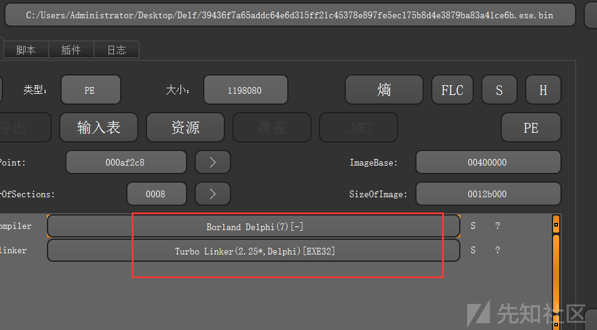](https://xzfile.aliyuncs.com/media/upload/picture/20240220101219-797855d6-cf95-1.png)

BorlanD Delphi 分析有一定难度，内部机制比较杂，直接 OD 分析不好分析：

[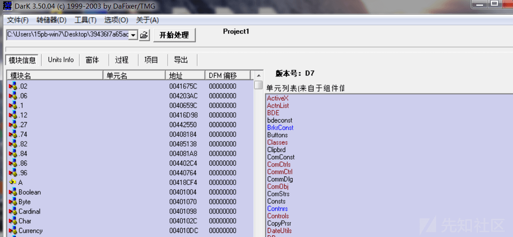](https://xzfile.aliyuncs.com/media/upload/picture/20240220101222-7bc86948-cf95-1.png)

  经过相同种类样本多次尝试，针对特斯拉可以拖入 OD 直接 VirtualAlloc 下断，运行跟踪两步，将会执行 Shellcode。

[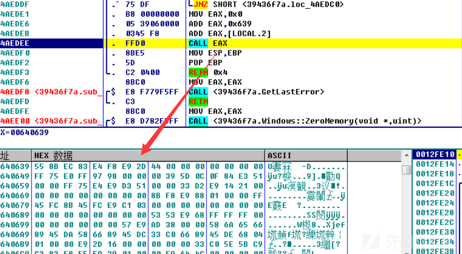](https://xzfile.aliyuncs.com/media/upload/picture/20240220101226-7dab3448-cf95-1.png)

  Shellcode 会动态获取 Api 地址，后释放第二阶段 payload。这个阶段会有一些反调试，这个过程相对漫长，有多个函数反调试，配置文件到注册表都要过，因为它仍然是套壳  
  不过总结经验，不用步入函数，一旦调试器中出现 VMVMVM 或者 KVM-XEN-VMwer 等字符串，直接内存中给抹除掉，然后根据逻辑判断根两步，这块自动化过需要根据样本写 OD 脚本。  
  释放第二段 Payload 之前，一般会解密资源释放.pdf 诱人耳目，利用 Shellexec 执行，继续查找资源释放 Payload

[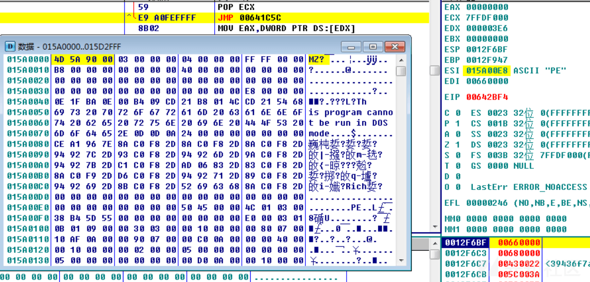](https://xzfile.aliyuncs.com/media/upload/picture/20240220101230-80995e6e-cf95-1.png)

剩下就是提取 PE，基本都带 UPX 壳，拖之

[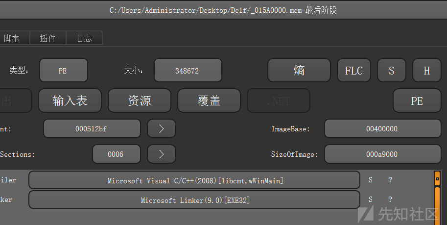](https://xzfile.aliyuncs.com/media/upload/picture/20240220101234-82c77ad6-cf95-1.png)

  Payload 分析简单，没有反调试和 Shellcode，直接进入主函数，跟两步注意寄存器返回值，也可以到加载和执行下断点。

[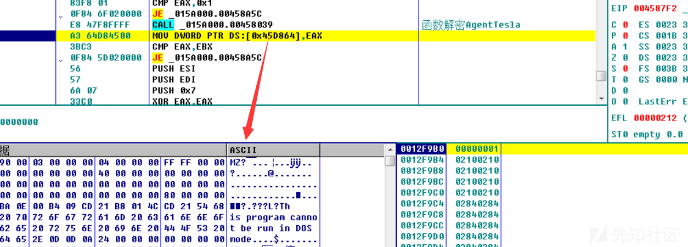](https://xzfile.aliyuncs.com/media/upload/picture/20240220101238-8543c044-cf95-1.png)

Tesla 提取之后，入口点特征如下：

[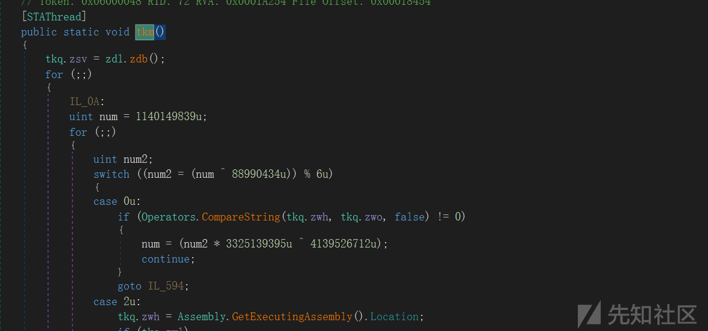](https://xzfile.aliyuncs.com/media/upload/picture/20240220101241-87192b16-cf95-1.png)

有很多样本先用 De4 去混淆，然后静态分析可以看到大量俄语：

[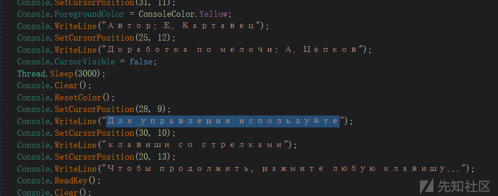](https://xzfile.aliyuncs.com/media/upload/picture/20240220101246-89a233dc-cf95-1.png)

释放.Net，从 XML 文件中导入计划任务，实现持久化。

```plain
C:\Users\Administrator\AppData\Roaming\Microsoft\Windows\Recent 生成快捷方式
```

[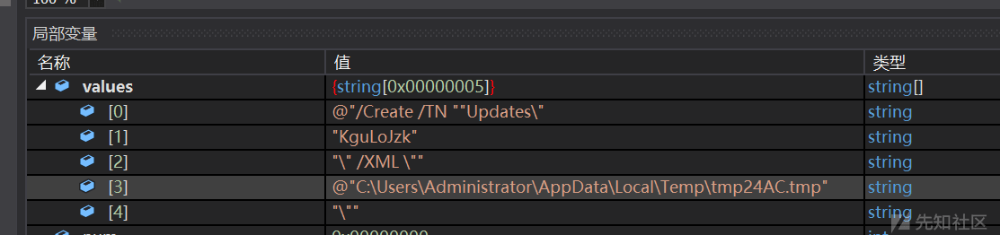](https://xzfile.aliyuncs.com/media/upload/picture/20240220101250-8c271f82-cf95-1.png)

关注 ShellExecuteOnSTAThread，Start 以后将会执行 ShellExecuteFunction

[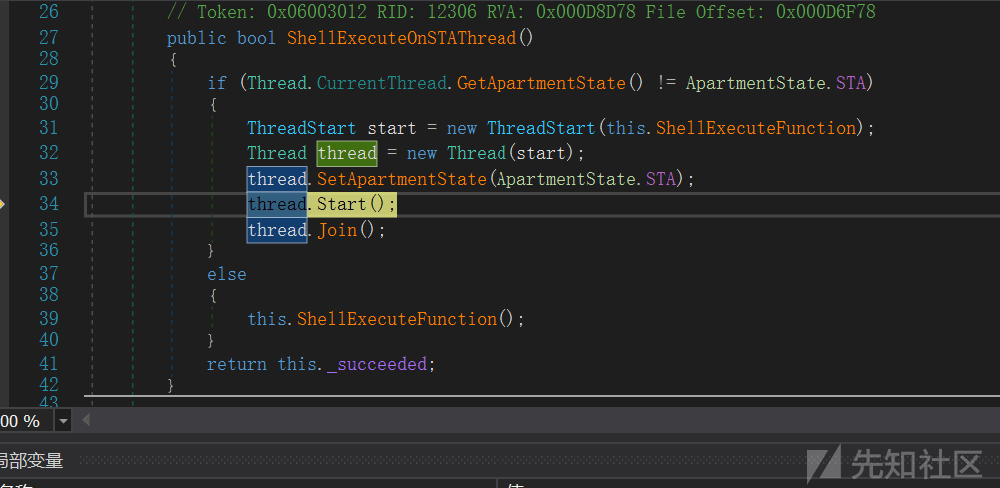](https://xzfile.aliyuncs.com/media/upload/picture/20240220101253-8df366fe-cf95-1.png)

### 邮箱取证

  基于.Net 的取证相对不复杂，这也是 Tesla 的一些编码缺陷，基于 SMTP 的发送需要账号密码，我们需要提取到匿名邮箱或者二级邮箱。  
  邮箱编码肯定要通过找到 SMTP 来作为切面，SMTP 取证步骤如下，先找到 SMTP 函数，记录账号密码资源编号，NetworkCredential credentials 初始化得时候便是，如下图 487680，487648

[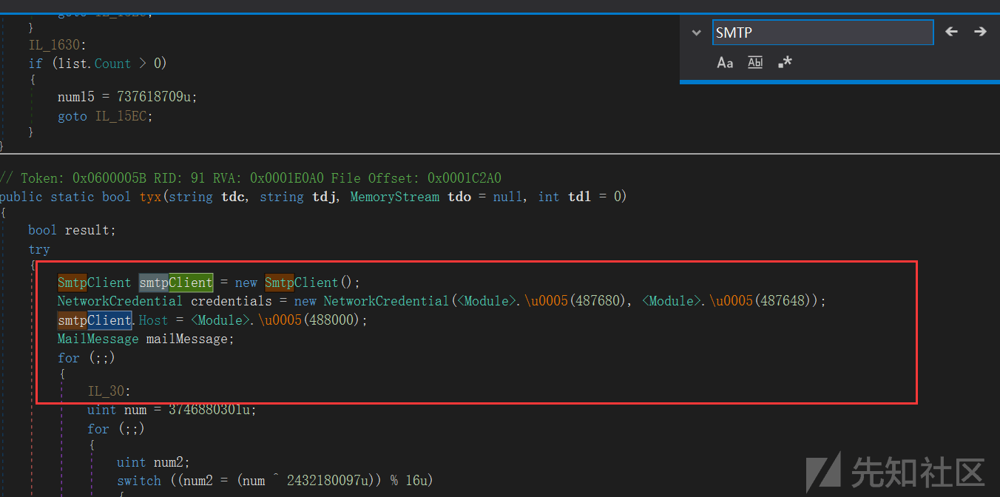](https://xzfile.aliyuncs.com/media/upload/picture/20240220101258-91469538-cf95-1.png)

找包含 GetString 函数，也就是获取资源编号的函数，最末尾是 return GetString，在函数头下断点：

[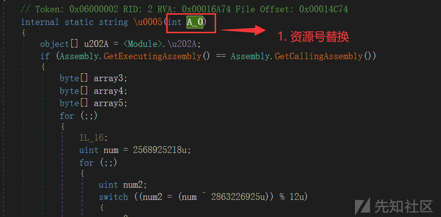](https://xzfile.aliyuncs.com/media/upload/picture/20240220101303-93eb0382-cf95-1.png)

[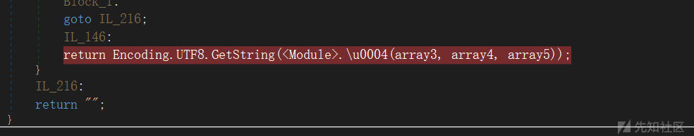](https://xzfile.aliyuncs.com/media/upload/picture/20240220101306-95da99fa-cf95-1.png)

  运行 AgentTesla，会在断点处下端，这里需要明确目标，解密资源而不是完整运行样本，我们找到资源解密 ID 的地方以后，将解密资源替换成账号密码的资源，比如下图 540416 替换成 487680 即可，return GetString 函数下断运行。

[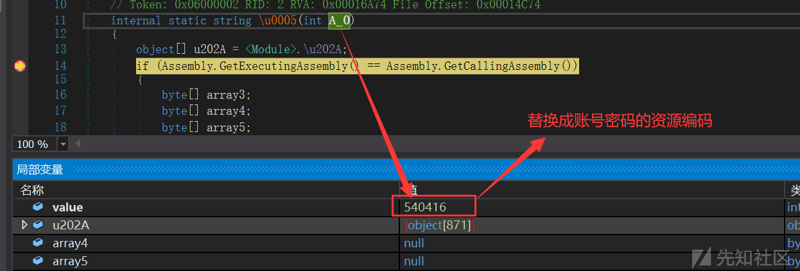](https://xzfile.aliyuncs.com/media/upload/picture/20240220101311-989c6bdc-cf95-1.png)

点击进入 GetString 函数如下，在 return 下断，bytes 则是加载的出资源的账号。

[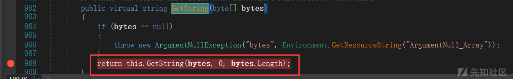](https://xzfile.aliyuncs.com/media/upload/picture/20240220101314-9a9b74dc-cf95-1.png)

[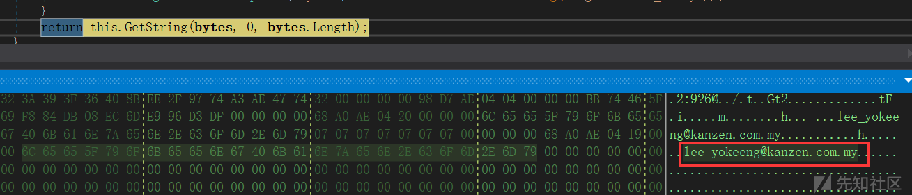](https://xzfile.aliyuncs.com/media/upload/picture/20240220101317-9c674f3e-cf95-1.png)

重启程序在输入密码的资源编号，这里需要重新调试，否则内存中有可能将提取不到

[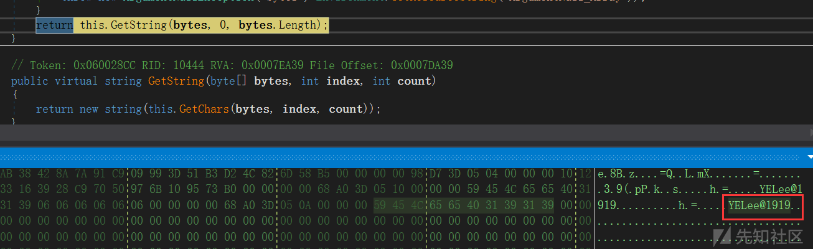](https://xzfile.aliyuncs.com/media/upload/picture/20240220101321-9edc558e-cf95-1.png)

### 自动化取证思考

Tesla .Net RAT 类同自动化取证，大体可以分为两个阶段

-   第一个阶段

```plain
1. 金蝉脱壳套壳样本自动化提取，对于流程来说并不关注套壳本身如何免杀，终会释放母体，我们还是要依赖于轻量级沙箱去提取到内存加载的.Net PE，这个阶段通过关键 API HOOK 和内存扫 PE 应该可以准确 DUMP 母体。
2. 反调试和常规壳自动化处理，套壳的反调试是难点，套壳根据不同的团队难度不同，碰到复杂的套壳 Rust 编写且有虚拟机检测，但是加壳基本都是常规壳，不存在强壳，相对容易处理。
```

-   第二阶段

```plain
.Net HOOK 分析，相对较为确定的资源解密，需要识别邮箱，FTP 等资源 ID，获取相应的解密函数统一解密。
可以基于 ILSpy/dnSpy 做一款.Net 的反汇编的 Hook 调试器，这样便于获取对应的资源函数和流程可控。
```
