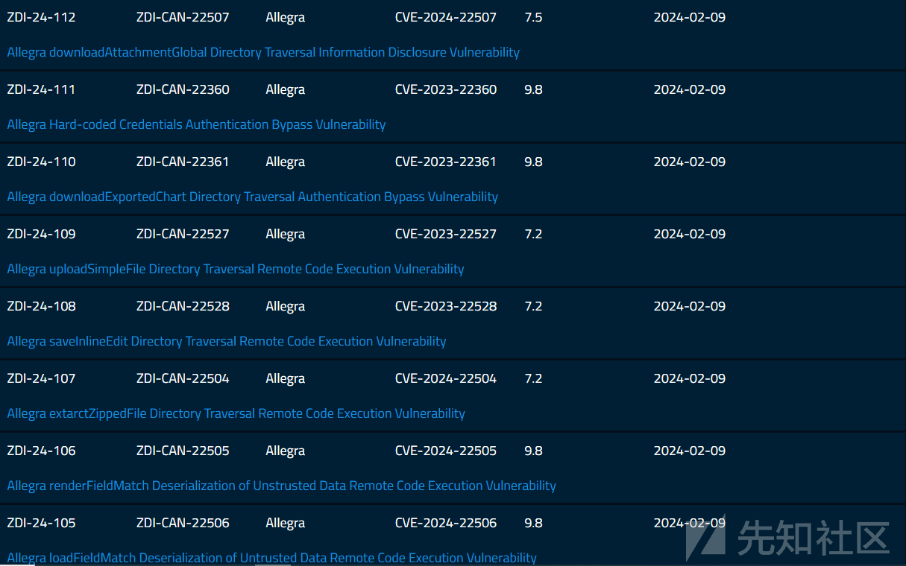
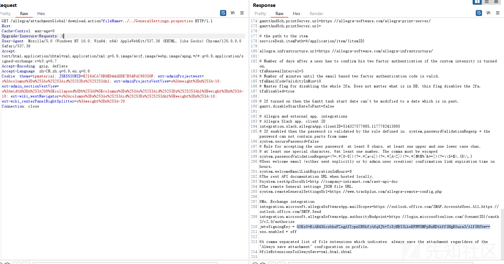
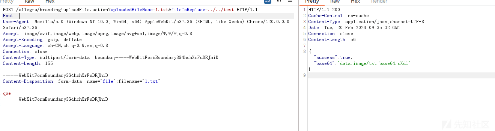

# Allegra 一系列 CVE 漏洞分析 - 先知社区

Allegra 一系列 CVE 漏洞分析

- - -

二月份 zdi 公布了 Allegra 一系列的漏洞，包括硬编码、文件读取、文件上传、zipslip、反序列化等漏洞，简单记了一下。

[](https://xzfile.aliyuncs.com/media/upload/picture/20240220181057-570fc112-cfd8-1.png)

Allegra 是国外的一个项目管理系统，官方链接：[https://www.trackplus.com/](https://www.trackplus.com/)

## 影响版本

Allegra < 7.5.1

## 任意文件读取（CVE-2024-22507）

Allegra 使用 struts 开发，支持 foo!method 的方式处理路由。  
该漏洞入口点在AttachmentGlobalAction#download方法，最终调用

```plain
AttachBL.download(diskFileName, this.fileName, outstream, false);

.......

        try {
            File file = new File(fileName);
            boolean isImage = isImage(fileOriginalName);
            String extension = FilenameUtils.getExtension(fileOriginalName);
            if (isImage && convertSvgToPng && isSvg(extension)) {
                String imgUrl = file.toURI().toURL().toString();
                BufferedImage image = convertSVGToPNG(imgUrl, 0.0F, 0.0F);
                ByteArrayOutputStream svgOS = new ByteArrayOutputStream();
                ImageIO.write(image, "png", svgOS);
                ByteArrayInputStream byteArrayISSVG = new ByteArrayInputStream(svgOS.toByteArray());
                instream = new BufferedInputStream(byteArrayISSVG);
                byteArrayISSVG.close();
                svgOS.close();
            } else {
                instream = new BufferedInputStream(new FileInputStream(file));
            }
```

这里未对 fileName 作处理，导致可直接拼接文件名读取任意文件，如可读取 jwt 密钥文件可构造 token 访问某些 api 接口。

[](https://xzfile.aliyuncs.com/media/upload/picture/20240220181129-6a4bd0fe-cfd8-1.png)

## 文件上传（CVE-2024-22510）

该漏洞入口点在 BrandingAction#uploadFile，最终关键调用代码

```plain
public static String uploadFile(String fileNameToReplace, String uploadedFileName, File uploadedFile) {
        LOGGER.debug("Uploading new branding file, fileNameToReplace: " + fileNameToReplace);
        if (uploadedFileName != null && uploadedFile != null) {
            try {
                String uploadedFileExt = FilenameUtils.getExtension(uploadedFileName);
                String logosDirAbsPath = HandleHome.getTrackplus_Home() + File.separator + "logos";
                String fileToReplaceAbsPath = logosDirAbsPath + File.separator + fileNameToReplace;
                File fileToReplace = new File(fileToReplaceAbsPath);
                boolean fileToReplaceExists = fileToReplace.exists();
                if (fileToReplaceExists) {
                    LOGGER.debug("Deleting existing branding file!");
                    Files.delete(fileToReplace.toPath());
                }

                String uploadedFileNewPath = logosDirAbsPath + File.separator + FilenameUtils.removeExtension(fileNameToReplace) + "." + uploadedFileExt;
                LOGGER.debug("uploadedFileNewPath: " + uploadedFileNewPath);
                Files.move(Paths.get(uploadedFile.getAbsolutePath()), Paths.get(uploadedFileNewPath), StandardCopyOption.REPLACE_EXISTING);
                File uploadedFileInLogoDir = new File(uploadedFileNewPath);
                LOGGER.debug("File: " + uploadedFileInLogoDir.getAbsolutePath() + " saved successfully: " + uploadedFileInLogoDir.exists());
                String base64 = getBase64Img(uploadedFileInLogoDir);
                LogoBL.clearLogoCache();
                return BrandingJson.encodeFileUploadSuccess(base64);
            } catch (IOException var11) {
                LOGGER.error(var11.getMessage(), var11);
            }
        }
```

上传路径和后缀未限制，最终会以 fileNameToReplace 参数重命名文件，同样也可控。

[](https://xzfile.aliyuncs.com/media/upload/picture/20240220181140-7078c2ac-cfd8-1.png)

## 反序列化（CVE-2024-22505）

漏洞sink点在ExcelFieldMatchBL#renderFieldMatch方法中，关键代码

```plain
static String renderFieldMatch(String excelMappingsDirectory, String fileName, String entity, Integer selectedSheet, Integer personID, Locale locale) {
        File fileOnDisk = new File(excelMappingsDirectory, fileName);
        Workbook workbook = ExcelImportBL.loadWorkbook(excelMappingsDirectory, fileName);
        if (workbook == null) {
            boolean deleted = fileOnDisk.delete();
            LOGGER.debug("Deleted: {}", deleted);
            return JSONUtility.encodeJSONFailure(LocalizeUtil.getLocalizedTextFromApplicationResources("admin.actions.importExcel.err.noWorkbook", locale));
        } else {
            Integer selectedShetCopy = selectedSheet;
            if (selectedSheet == null) {
                selectedShetCopy = 0;
            }

            Map<String, Integer> columNameToFieldIDMap = null;
            Set lastSavedIdentifierFieldIDIsSet = null;

            try {
                FileInputStream fis = new FileInputStream(new File(excelMappingsDirectory, getMappingFileName(entity)));
                Throwable var12 = null;

                try {
                    ObjectInputStream objectInputStream = new ObjectInputStream(fis);
                    columNameToFieldIDMap = (Map)objectInputStream.readObject();
                    .........
```

读取某个文件直接反序列化，产品想要实现的功能应该是先将导入的表格序列化到 listmapping 中，后续再进行反序列化，要结合上面的跨目录上传将文件传到/Allegra/trackdata/excelImport/1/listmapping 再触发，路由/excelFieldMatch.action?fileName=1.xlsx&entity=list。

## zipslip(CVE-2024-22504)

漏洞入口点在 Import#importFromAllegraFormat，该接口使用 jwt 认证，需要用到上面读到的 token，直接看 sink 点：

```plain
label147: {
    try {
        while(true) {
            if ((zipEntry = zipInputStream.getNextEntry()) == null) {
                break label147;
            }

            extarctZippedFile(unzipTempDirectory, zipInputStream, zipEntry);
        }

....

private static void extarctZippedFile(File unzipTempDirectory, ZipInputStream zipInputStream, ZipEntry zipEntry) {
        File destFile = new File(unzipTempDirectory, zipEntry.getName());
        int bugfferSize = true;
        byte[] data = new byte[2048];
        FileOutputStream fos = null;
        BufferedOutputStream dest = null;

        try {
            fos = new FileOutputStream(destFile);
            dest = new BufferedOutputStream(fos, 2048);

            int count;
            while((count = zipInputStream.read(data, 0, 2048)) != -1) {
                dest.write(data, 0, count);
            }
```

很明显可解压到任意位置造成任意文件写入，路由/rest/v2/items/exchange/import/importFromAllegraFormat，制作恶意压缩包上传就行了。

## 漏洞修复

更新到最新版[https://www.trackplus.com/index.php/de/service/download.html](https://www.trackplus.com/index.php/de/service/download.html)
