# AsyncRAT 攻防技术对抗 - 先知社区

AsyncRAT 攻防技术对抗

- - -

## 概述

本篇文章为 AsyncRAT 远控工具剖析系列文章的第三篇，第一篇为《AsyncRAT 加解密技术剖析》，第二篇为《AsyncRAT 通信模型剖析及自动化解密脚本实现》，欢迎各位大佬关注并指点。

本篇文章将继续对 AsyncRAT 远控工具进行剖析，将从受控端角度对 AsyncRAT 木马使用的相关技术进行剖析，并从网络检测、终端检测、内存检测、内存马提取、内存中提取配置信息等多个角度提出临检取证的技术方案，便于全面的对 AsyncRAT 木马进行检测分析发现。

## 网络检测

通常，在一个单位的网络环境中，部署有大量的 PC 机及服务器，为了能够快速的从此网络环境中检测挖掘木马攻击行为，网络流量检测报警是最便捷直接的方式，因此，提取有效的木马通信行为特征，有利于通过网络流量方式对木马通信行为进行检测报警。

通过前两篇文章的分析梳理，可知 AsyncRAT 木马使用的 TLS 加密通信，因此只能从加密数据角度对此样本通信行为进行检测识别，通过分析，笔者梳理了以下几点可供网络流量检测报警：

-   加密通信使用 TLS1.0 通信协议；
-   通过多平台分析测试，发现若 AsyncRAT 控制端在 WIN7 系统中运行，则在 AsyncRAT 木马通信过程中，木马将选择 TLS\_RSA\_WITH\_AES\_128\_CBC\_SHA (0x002f) 密钥套件；
-   木马存在心跳数据包行为：源码中指定了心跳间隔时间为 10-15 秒，实际测试过程中基本稳定在 15 秒；
-   由于心跳数据包的最终数据载荷基本固定，因此心跳数据为固定长度，所以加密后数据长度也为固定长度；
-   TLS 解密后的数据中存在部分明文字符串；

### 固定通信协议、密钥套件

相关数据包截图如下：

[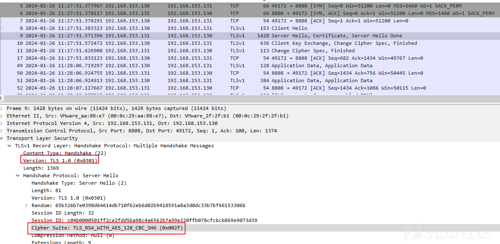](https://xzfile.aliyuncs.com/media/upload/picture/20240201111236-bfe199f0-c0af-1.png)

### 心跳数据包

相关解密数据截图如下：

[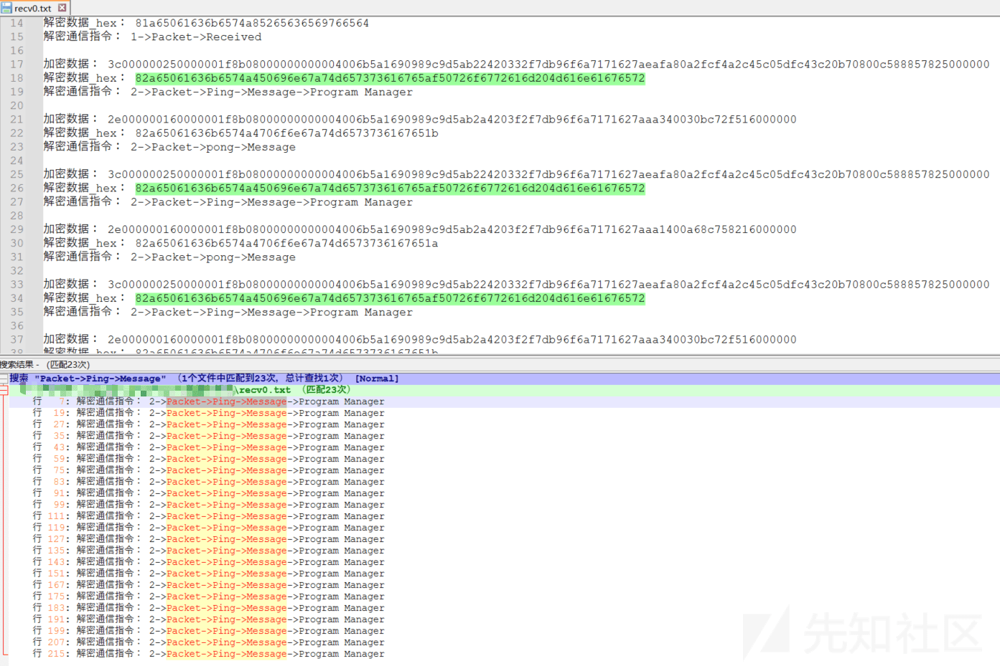](https://xzfile.aliyuncs.com/media/upload/picture/20240201111251-c87a6a42-c0af-1.png)

相关代码截图如下：

[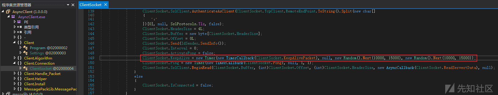](https://xzfile.aliyuncs.com/media/upload/picture/20240201111303-cff05d36-c0af-1.png)

[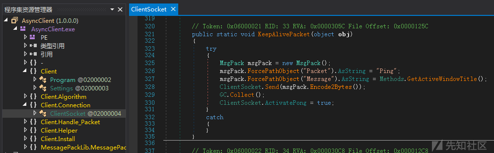](https://xzfile.aliyuncs.com/media/upload/picture/20240201111315-d6e46bbe-c0af-1.png)

### TLS 解密数据存在明文字符串

在前期通信数据包解密过程中，笔者发现了一个有趣的情况：使用C#调用的gzip压缩代码，在对部分数据进行压缩时，会出现明文字符串的情况。

例如：

-   gzip 解压前数据：（存在 Packet、savePlugin、Dll 字符串，逻辑上此字符串应该是解压后才会出现）

[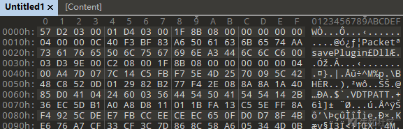](https://xzfile.aliyuncs.com/media/upload/picture/20240201111330-e0382bba-c0af-1.png)

-   gzip 解压后数据：

[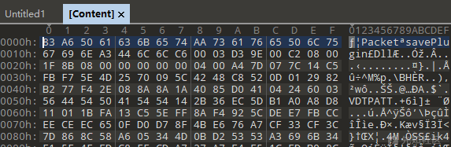](https://xzfile.aliyuncs.com/media/upload/picture/20240201111343-e7bb3a3a-c0af-1.png)

基于上述情况，笔者尝试编写了多个C#程序，用于对此现象进行模拟（C#模拟代码中，将gzip解密后的数据作为输入数据），最终发现，使用C#调用gzip压缩代码时，确实会出现明文字符串的情况。**（备注：数据长度是否会对其产生影响？大概阈值是多少？笔者未进行过验证，因此无法确定）**

相关代码截图如下：

[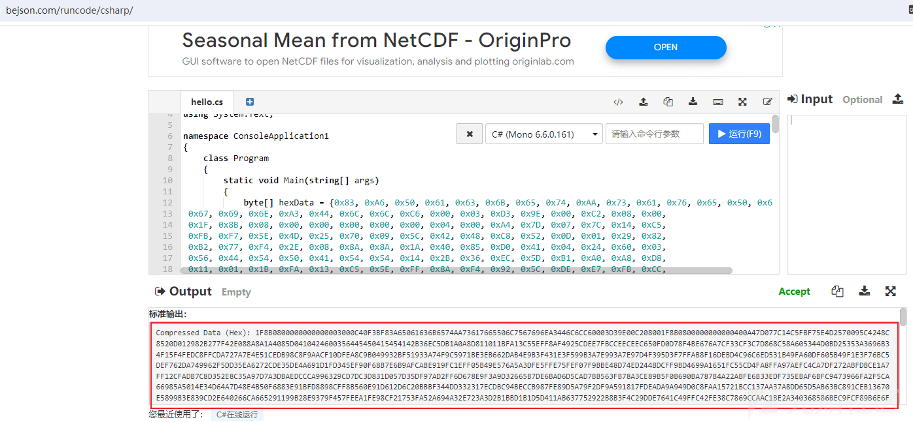](https://xzfile.aliyuncs.com/media/upload/picture/20240201111357-f02563c6-c0af-1.png)

[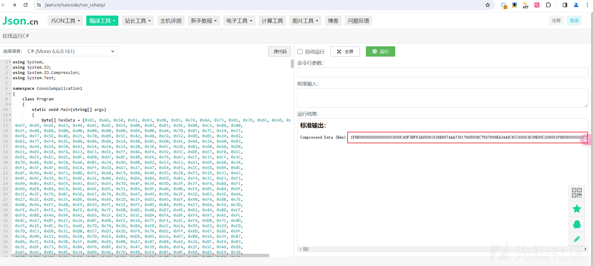](https://xzfile.aliyuncs.com/media/upload/picture/20240201111411-f8476414-c0af-1.png)

输出二进制中明文字符串截图如下：

[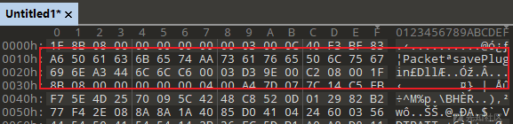](https://xzfile.aliyuncs.com/media/upload/picture/20240201111424-fff8d954-c0af-1.png)

[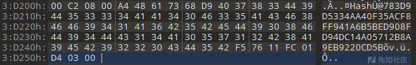](https://xzfile.aliyuncs.com/media/upload/picture/20240201111437-07c7c2bc-c0b0-1.png)

## 终端检测

通常，若在网络检测中发现可疑木马通信行为，则需要进一步的在终端中进行核查取证，同时对木马通信行为进行证据固定。

针对终端检测角度，常见手法是基于木马特征生成对应的 yara 检测规则，然后使用对应的 yara 规则加载工具对终端进行扫描检测：

-   yara 规则：可从样本中提取相关特征字符串生成 yara 规则；在这里，笔者将直接使用网络中关于 AsyncRAT 的 yara 检测规则（[https://github.com/IrishIRL/yara-rules/blob/main/RAT\_AsyncRAT.yara](https://github.com/IrishIRL/yara-rules/blob/main/RAT_AsyncRAT.yara) ）；
-   yara 规则加载工具：常见的 yara 规则加载工具为 yara.exe 程序（[https://github.com/VirusTotal/yara/releases](https://github.com/VirusTotal/yara/releases) ）；但在这里，笔者将使用另一款 Loki 工具（[https://github.com/grafana/loki](https://github.com/grafana/loki) ）进行 yara 加载检测；

### yara 规则

通过网络调研，笔者在网络中发现 IrishIRL 作者于 2022 年 12 月 03 日编写的 RAT\_AsyncRAT.yara 规则，经过简单对比分析，发现相关特征均为 AsyncRATClient 端木马的特征字符串。

进一步对特征字符串进行分析研判，发现在 AsyncRAT 控制端生成 AsyncRATClient 端木马过程中，可在 AsyncRAT 控制端中开启反病毒分析功能，因此，笔者尝试对不同功能选项下生成的 AsyncRATClient 端木马进行特征字符串对比，发现不同功能选项下生成的 AsyncRATClient 端木马均存在 RAT\_AsyncRAT.yara 规则文件中提到的相关特征字符串。

相关截图如下：

[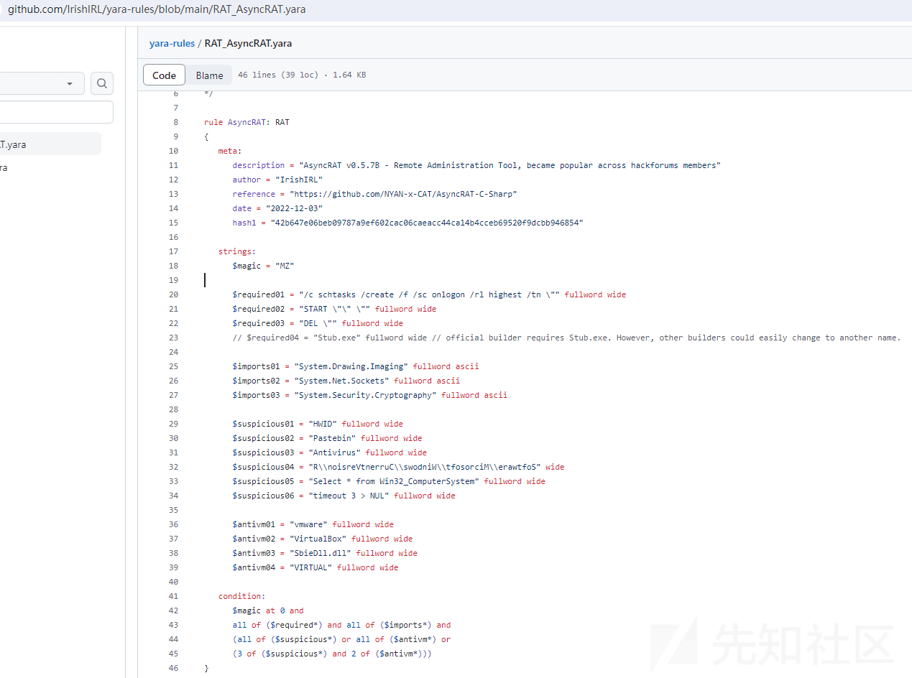](https://xzfile.aliyuncs.com/media/upload/picture/20240201111455-1276799c-c0b0-1.png)

### Loki

Loki 是一款简单强大的 IOC 和事件响应扫描器，当前仅支持在 windows 平台中运行，此工具除支持 Yara 匹配文件内容外，还支持正则匹配路径、文件名，Yara 匹配进程内存，匹配扫描目录中的文件 Hash，匹配进程网络行为 C2，文件系统检测，进程异常检测等。

Loki 在 Yara 匹配文件内容功能中，提供了多种告警级别（ \[ALERT\]（>100）， \[WARNING\]（60-99），\[NOTICE\]（0-59）），在多种告警模式下，支持多条 yara 规则的叠加告警，相关截图如下：

[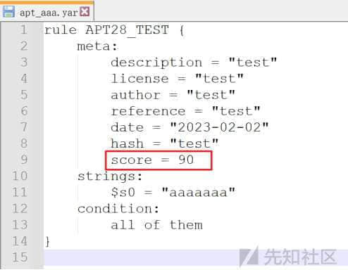](https://xzfile.aliyuncs.com/media/upload/picture/20240201111511-1c5f038e-c0b0-1.jpg)

尝试使用 Loki 工具加载 RAT\_AsyncRAT.yara 规则进行终端检测扫描，发现可成功对不同功能选项下生成的 AsyncRATClient 端木马进行告警，相关检测结果如下：

```plain
C:\Users\admin\Desktop\loki>loki.exe  -p C:\Users\admin\Desktop\test\ --onlyrelevant --noprocscan >1.txt                                                                              
      __   ____  __ ______  
     / /  / __ \/ //_/  _/  
    / /__/ /_/ / ,< _/ /    
   /____/\____/_/|_/___/    
   YARA and IOC Scanner     

   by Florian Roth, GNU General Public License
   version 0.46.1 (Python 3 release)

   DISCLAIMER - USE AT YOUR OWN RISK


-[WARNING] 
FILE: C:\Users\admin\Desktop\test\AsyncClient.exe SCORE: 70 TYPE: EXE SIZE: 46080 
FIRST_BYTES: 4d5a90000300000004000000ffff0000b8000000 / <filter object at 0x03268E20> 
MD5: cfd32f4b27b21671d3ee96be07e86361 
SHA1: f78cc04ae6c06f53b63a045e21b2259a20920d55 
SHA256: 86e0bc6c09b35777f71c4053582ad5bd615e6e447dd3350dc19dc953d2d778f7 CREATED: Fri Jan 26 15:52:26 2024 MODIFIED: Thu Jan 25 10:57:55 2024 ACCESSED: Fri Jan 26 15:52:30 2024 
REASON_1: Yara Rule MATCH: AsyncRAT SUBSCORE: 70 
DESCRIPTION: AsyncRAT v0.5.7B - Remote Administration Tool, became popular across hackforums members REF: https://github.com/NYAN-x-CAT/AsyncRAT-C-Sharp AUTHOR: IrishIRL 
MATCHES: Str1: MZ Str2: /c schtasks /create /f /sc onlogon /rl highest /tn " Str3: START "" " Str4: DEL " Str5: System.Drawing.Imaging Str6: System. ... (truncated)
\[WARNING] 
FILE: C:\Users\admin\Desktop\test\AsyncClient_混淆.exe SCORE: 70 TYPE: EXE SIZE: 48640 
FIRST_BYTES: 4d5a90000300000004000000ffff0000b8000000 / <filter object at 0x03268460> 
MD5: b9e6ba8a2ab93a3e0fcc9b695f8e59b5 
SHA1: e5a99670ba330d00e80b45b39ce745623ea68219 
SHA256: aad45a159d128852e659b483f19156e773074e43557ea0a6e344bedee36bf0c5 CREATED: Wed Jan 31 14:40:10 2024 MODIFIED: Wed Jan 31 14:32:51 2024 ACCESSED: Wed Jan 31 14:40:27 2024 
REASON_1: Yara Rule MATCH: AsyncRAT SUBSCORE: 70 
DESCRIPTION: AsyncRAT v0.5.7B - Remote Administration Tool, became popular across hackforums members REF: https://github.com/NYAN-x-CAT/AsyncRAT-C-Sharp AUTHOR: IrishIRL 
MATCHES: Str1: MZ Str2: /c schtasks /create /f /sc onlogon /rl highest /tn " Str3: START "" " Str4: DEL " Str5: System.Drawing.Imaging Str6: System. ... (truncated)
C:\Users\admin\Desktop\loki>
```

相关截图如下：

[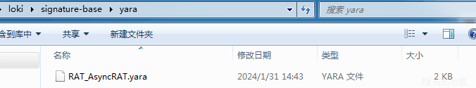](https://xzfile.aliyuncs.com/media/upload/picture/20240201111529-26f59074-c0b0-1.png)

[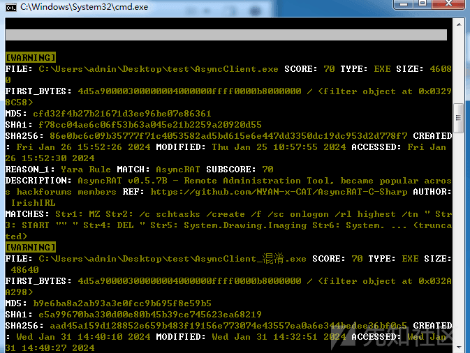](https://xzfile.aliyuncs.com/media/upload/picture/20240201111545-30b24d78-c0b0-1.png)

## 内存检测

在对 AsyncRAT 远控工具进行研究的过程中，笔者尝试查阅了网络中大部分涉及 AsyncRAT 木马的相关事件报告，发现部分 AsyncRAT 事件报告中对 AsyncRAT 木马的投放方式进行了描述，相关截图如下：

[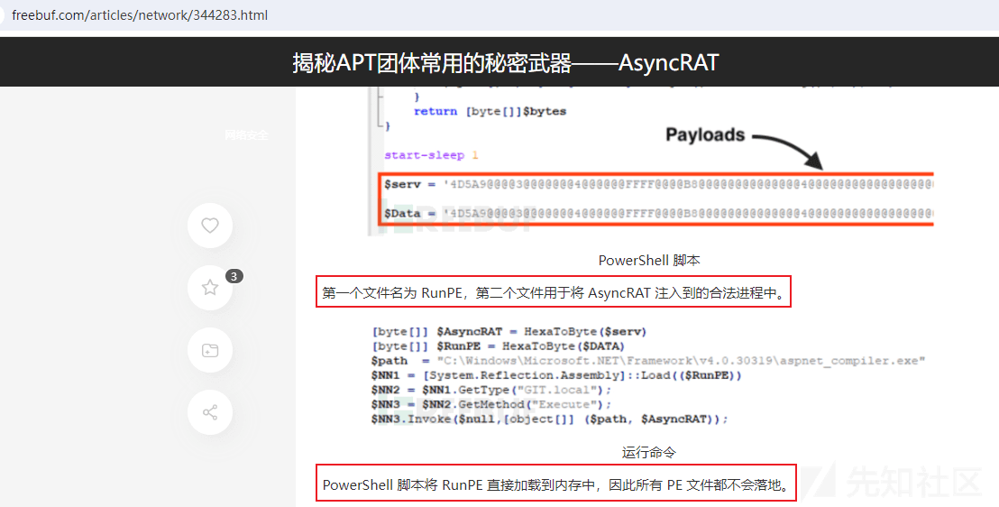](https://xzfile.aliyuncs.com/media/upload/picture/20240201111602-3ab86b0e-c0b0-1.png)

基于上述 AsyncRAT 事件报告，笔者发现，AsyncRAT 木马可能还会以无文件落地的方式存在于终端主机中，因此，单纯的终端检测可能还无法完全对其进行检测发现，所以，还需要结合内存对其进行全面的检测发现。

由于上述 yara 规则是基于静态文件进行检测的，因此，静态文件的特征字符串可能无法完全在内存中适用，因此，笔者尝试性的从内存中提取了部分内存字符串构造 yara 检测规则，并在 AsyncRAT 木马运行过程中启动 Loki 工具对其进程内存进行检测，发现可有效对其检测。

相关 yara 规则如下：

[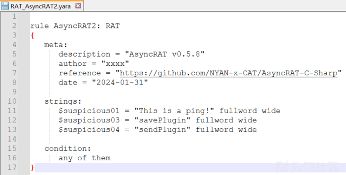](https://xzfile.aliyuncs.com/media/upload/picture/20240201111619-44ca5fa8-c0b0-1.png)

相关检测效果截图如下：

[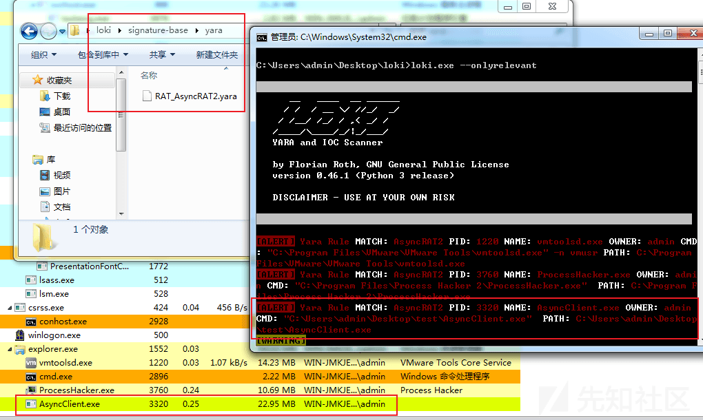](https://xzfile.aliyuncs.com/media/upload/picture/20240201111634-4de15074-c0b0-1.png)

## 内存马提取

若通过内存检测成功发现 AsyncRAT 木马痕迹，则下一步需要对其内存进行证据固定，并尝试从内存中提取还原 AsyncRAT 木马模块，在这里，笔者推荐使用 MegaDumper 工具（[https://github.com/CodeCracker-Tools/MegaDumper](https://github.com/CodeCracker-Tools/MegaDumper) ），此工具可以轻松地直接从内存中转储.NET 可执行文件，可秒杀各种.Net 内存释放壳。

尝试使用工具模拟注入 AsyncRAT 内存马至 aspnet\_compiler.exe 文件进程中，相关截图如下：

[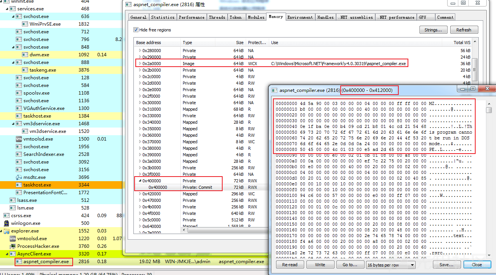](https://xzfile.aliyuncs.com/media/upload/picture/20240201111650-56f74862-c0b0-1.png)

使用 MegaDumper 工具 dump AsyncRAT 木马模块截图如下：

[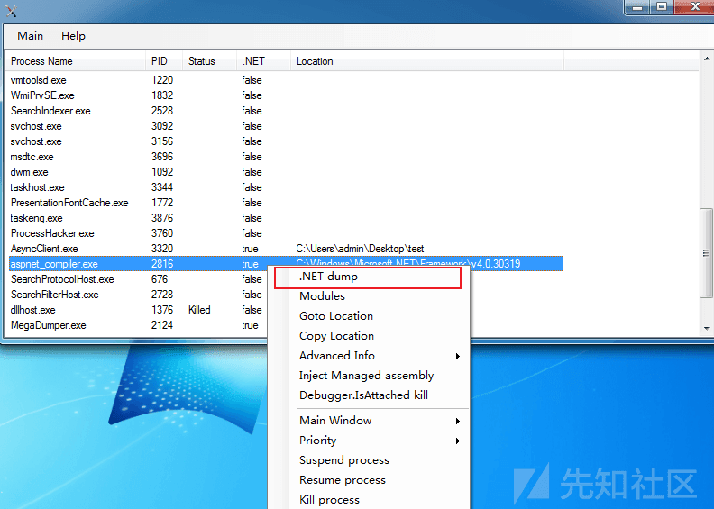](https://xzfile.aliyuncs.com/media/upload/picture/20240201111705-5fdd07dc-c0b0-1.png)

dump 输出文件夹截图如下：

[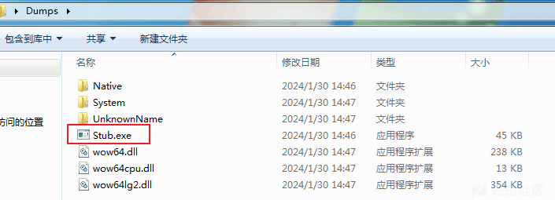](https://xzfile.aliyuncs.com/media/upload/picture/20240201111718-67bc1286-c0b0-1.png)

使用 dnspy 对 dump 提取的.NET 模块进行反编译，截图如下：

[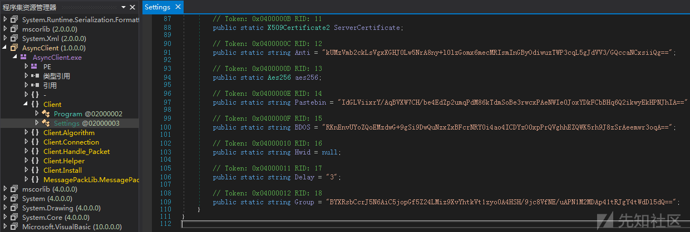](https://xzfile.aliyuncs.com/media/upload/picture/20240201111733-70ea6b3c-c0b0-1.png)

## 内存中提取配置信息

若能够从内存中成功提取木马模块，则可直接从木马模块中提取并解密配置信息；若无法从内存中提取木马模块，则只能从内存中筛选提取配置信息，然后尝试性的进行解密。

基于此，笔者准备尝试看能否从内存中直接提取配置信息。进一步分析，笔者发现内存中存放配置信息处存在部分特征格式，因此可尝试编写脚本辅助对其配置信息进行提取解密：

-   内存中存放配置信息处存在特征格式：配置信息字符串前 4 字节处存放了对应配置信息字符串的长度，配置信息字符串前 12 字节处存放了固定 4 字节数据（0x00 0x00 0x00 0x80）；
-   配置信息中 Key 字符串长度固定：通过源码及实际样本对比，发现配置信息中 Key 字符串长度固定为 0x2C 字节；
-   通过 Key 字符串特征在内存中查找存放配置信息的位置：可通过编写脚本实现辅助查找，进程内存可通过 processhacker 直接 dump；
-   从对应内存片段中提取配置信息并使用系列文章的第一篇《AsyncRAT 加解密技术剖析》文章中的自动化解密脚本解密；

### 内存中特征格式

相关截图如下：

[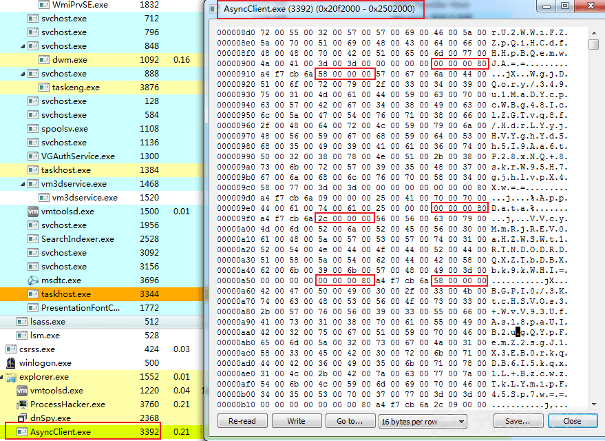](https://xzfile.aliyuncs.com/media/upload/picture/20240201111748-7a02fab8-c0b0-1.png)

### Key 字符串

相关代码截图如下：

[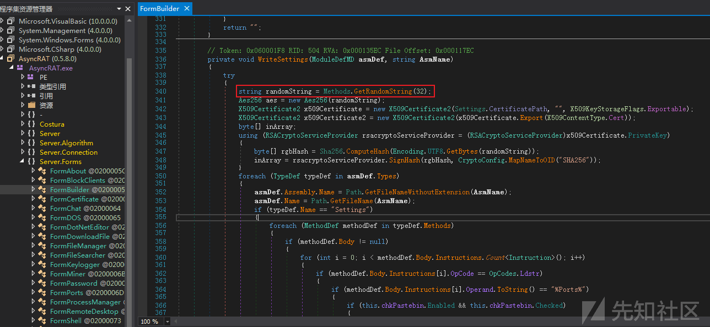](https://xzfile.aliyuncs.com/media/upload/picture/20240201111804-835d188c-c0b0-1.png)

### 内存片段查找

尝试编写脚本对内存片段进行查找，运行效果如下：

```plain
F:\GolandProjects\awesomeProject30>awesomeProject30.exe
找到匹配：
起始索引：0xcc99d, 结束索引：0xcc9a9
200000000000000000000000000000f92c0000ff2c000000200000000000000000000000000000002d0000252d000000001000000000000000000000000000302d0000652d0000000000000000000000040000000000006f
               �,  �,                   -  %-                 0-  e-                 o
起始索引：0x4c41bc, 结束索引：0x4c41c8
56005600630079004d006d0052006a005200450056003000610048005a0057005300570074003100520054004e0044004f00440052004400510058005a005400620044004200580062006b0039006b005700480049003d00
V V c y M m R j R E V 0 a H Z W S W t 1 R T N D O D R D Q X Z T b D B X b k 9 k W H I =
起始索引：0x4c7da0, 结束索引：0x4c7dac
49006e00760061006c00690064004f007000650072006100740069006f006e005f0041005000490049006e00760061006c006900640046006f007200430075007200720065006e00740043006f006e007400650078007400
I n v a l i d O p e r a t i o n _ A P I I n v a l i d F o r C u r r e n t C o n t e x t
起始索引：0x4e2acc, 结束索引：0x4e2ad8
4d006900630072006f0073006f0066007400200055006e00690066006900650064002000530065006300750072006900740079002000500072006f0074006f0063006f006c002000500072006f0076006900640065007200
M i c r o s o f t   U n i f i e d   S e c u r i t y   P r o t o c o l   P r o v i d e r
起始索引：0x4e3074, 结束索引：0x4e3080
4d006900630072006f0073006f0066007400200055006e00690066006900650064002000530065006300750072006900740079002000500072006f0074006f0063006f006c002000500072006f0076006900640065007200
M i c r o s o f t   U n i f i e d   S e c u r i t y   P r o t o c o l   P r o v i d e r
起始索引：0x4e3ea4, 结束索引：0x4e3eb0
53006f006600740077006100720065005c004d006900630072006f0073006f00660074005c00570069006e0064006f007700730020004e0054005c00430075007200720065006e007400560065007200730069006f006e00
S o f t w a r e \ M i c r o s o f t \ W i n d o w s   N T \ C u r r e n t V e r s i o n
起始索引：0x4e469c, 结束索引：0x4e46a8
5300770069007400630068002e00530079007300740065006d002e004e00650074002e0044006f006e00740045006e00610062006c006500530063006800530065006e0064004100750078005200650063006f0072006400
S w i t c h . S y s t e m . N e t . D o n t E n a b l e S c h S e n d A u x R e c o r d
起始索引：0x59a724, 结束索引：0x59a730
49006e00760061006c00690064004f007000650072006100740069006f006e005f0041005000490049006e00760061006c006900640046006f007200430075007200720065006e00740043006f006e007400650078007400
I n v a l i d O p e r a t i o n _ A P I I n v a l i d F o r C u r r e n t C o n t e x t
起始索引：0x5ed5a8, 结束索引：0x5ed5b4
4d006900630072006f0073006f0066007400200055006e00690066006900650064002000530065006300750072006900740079002000500072006f0074006f0063006f006c002000500072006f0076006900640065007200
M i c r o s o f t   U n i f i e d   S e c u r i t y   P r o t o c o l   P r o v i d e r
起始索引：0x5edf14, 结束索引：0x5edf20
4d006900630072006f0073006f0066007400200055006e00690066006900650064002000530065006300750072006900740079002000500072006f0074006f0063006f006c002000500072006f0076006900640065007200
M i c r o s o f t   U n i f i e d   S e c u r i t y   P r o t o c o l   P r o v i d e r
起始索引：0x5eedc0, 结束索引：0x5eedcc
53006f006600740077006100720065005c004d006900630072006f0073006f00660074005c00570069006e0064006f007700730020004e0054005c00430075007200720065006e007400560065007200730069006f006e00
S o f t w a r e \ M i c r o s o f t \ W i n d o w s   N T \ C u r r e n t V e r s i o n
起始索引：0x5efe54, 结束索引：0x5efe60
5300770069007400630068002e00530079007300740065006d002e004e00650074002e0044006f006e00740045006e00610062006c006500530063006800530065006e0064004100750078005200650063006f0072006400
S w i t c h . S y s t e m . N e t . D o n t E n a b l e S c h S e n d A u x R e c o r d

F:\GolandProjects\awesomeProject30>
```

相关截图如下：

[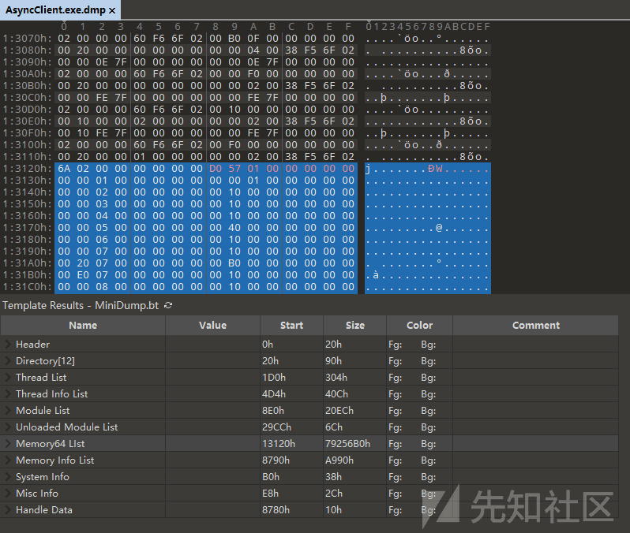](https://xzfile.aliyuncs.com/media/upload/picture/20240201111824-8f3831d2-c0b0-1.png)

[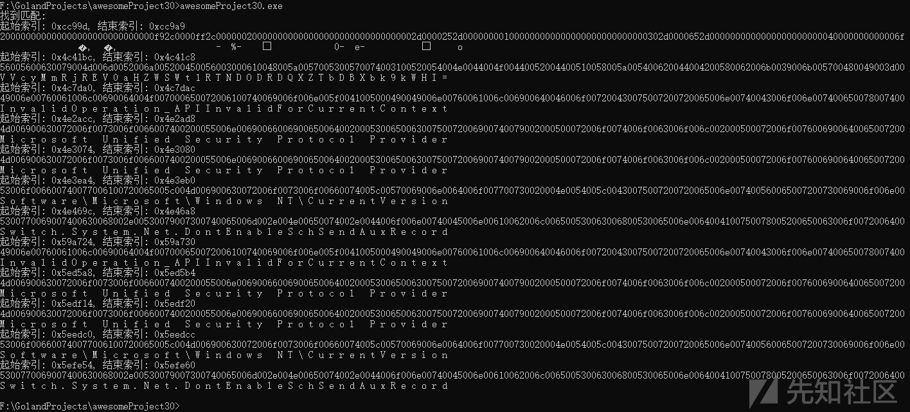](https://xzfile.aliyuncs.com/media/upload/picture/20240201111839-984426dc-c0b0-1.png)

尝试对 base64 字符串进行人工识别，发现 AsyncClient.exe.dmp 文件的 0x4c41bc 偏移处即为配置信息的 Key 字符串，因此可直接跳转至对应偏移处查看配置信息 (配置信息的顺序与反编译代码中的顺序相同)，相关截图如下：

[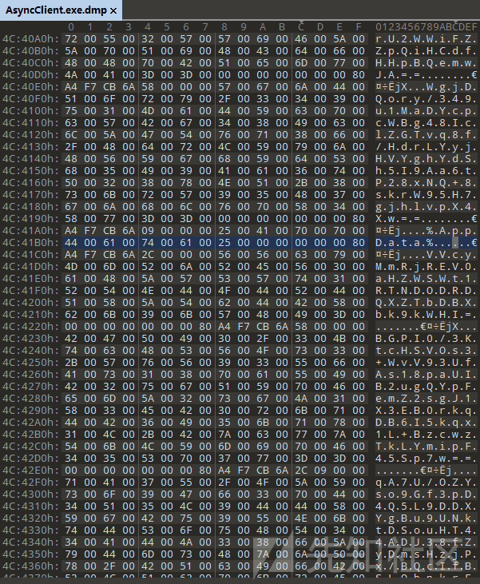](https://xzfile.aliyuncs.com/media/upload/picture/20240201111856-a222cafa-c0b0-1.png)

#### 代码实现

代码结构如下：

[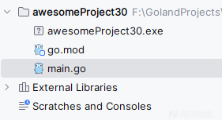](https://xzfile.aliyuncs.com/media/upload/picture/20240201111913-aca2bde6-c0b0-1.png)

-   main.go

```plain
package main

import (
    "encoding/hex"
    "fmt"
    "io/ioutil"
    "os"
    "regexp"
)

func main() {
    sss, _ := readFile("C:\\Users\\admin\\Desktop\\AsyncClient.exe.dmp")
    data := hex.EncodeToString([]byte(sss))

    pattern := regexp.MustCompile("00000080.{8}2c000000")
    matches := pattern.FindAllStringIndex(data, -1)
    if len(matches) > 0 {
        fmt.Println("找到匹配:")
        for _, match := range matches {
            startIndex := match[0] / 2
            endIndex := match[1] / 2
            fmt.Printf("起始索引: 0x%x, 结束索引: 0x%x\n", startIndex, endIndex)
            data_match := data[endIndex*2 : endIndex*2+0x2c*2*2]
            fmt.Println(data_match)
            aa, _ := hex.DecodeString(data_match)
            fmt.Println(string(aa))
        }
    } else {
        fmt.Println("未找到匹配")
    }
}

func readFile(filename string) (string, error) {
    f, err := os.Open(filename)
    if err != nil {
        return "", err
    }
    defer f.Close()

    b, err := ioutil.ReadAll(f)
    if err != nil {
        return "", err
    }

    return string(b), nil
}
```
