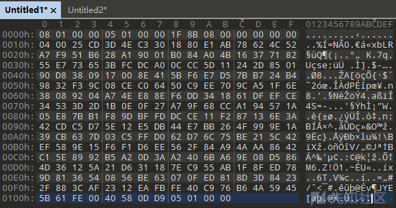
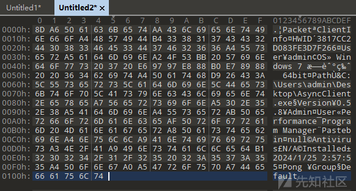
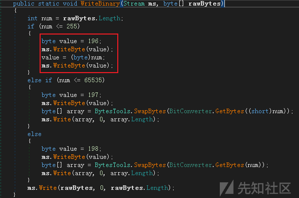
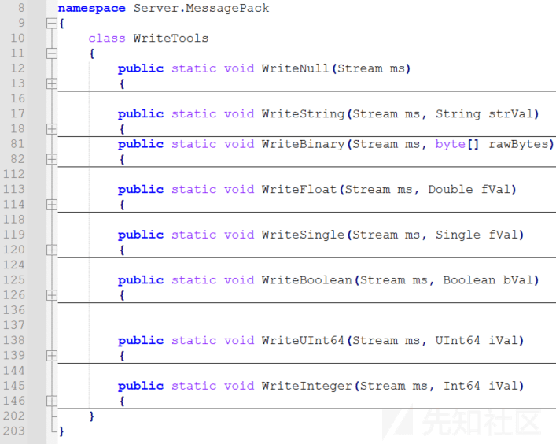
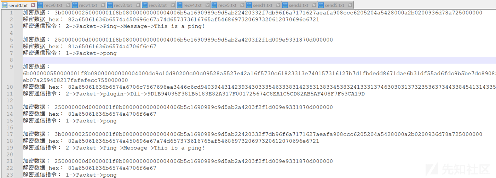
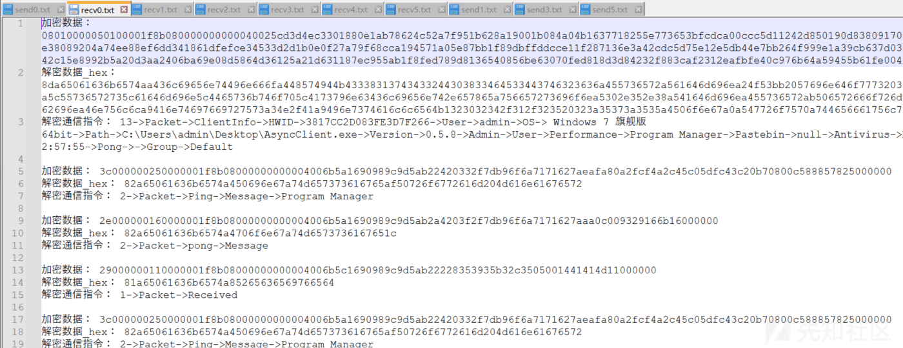
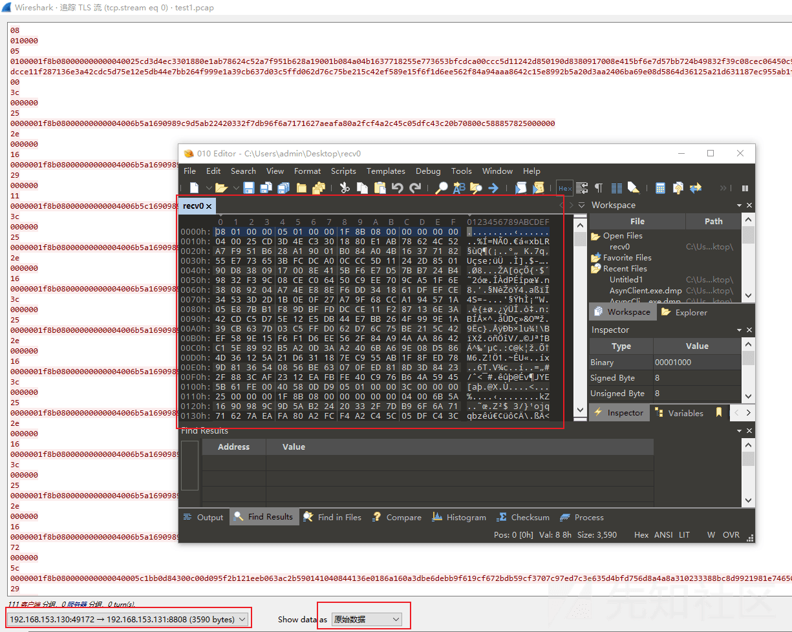

# AsyncRAT 通信模型剖析及自动化解密脚本实现 - 先知社区

AsyncRAT 通信模型剖析及自动化解密脚本实现

- - -

## 概述

本篇文章为 AsyncRAT 远控工具剖析系列文章的第二篇，第一篇为《AsyncRAT 加解密技术剖析》，欢迎各位大佬关注并指点。

本篇文章将继续对 AsyncRAT 远控工具进行剖析，将从木马通信模型角度对 AsyncRAT 木马的通信解密数据进行梳理，并从字节角度对通信数据结构进行深层次的剖析，同时，为便于快速批量的获取所有最终通信数据载荷，本篇文章还将输出 AsyncRAT 网络通信数据解密的自动化脚本，便于快速批量的对 AsyncRAT 木马通信数据包进行解密及分析。

## 整体通信流程

对 AsyncRAT 木马的通信数据进行剖析，梳理 AsyncRAT 木马的通信模型，发现其通信流程如下：

-   AsyncRAT 运行后，将建立一个主会话通信，此会话通信主要用于心跳连接、传输并调用菜单功能中的功能插件等；
-   当攻击者在控制端中点击运行特定菜单功能时，AsyncRAT 将根据不同功能传输并运行 Plugins 目录中的对应 dll 文件；
-   当对应功能插件运行后，AsyncRAT 将再次启动一个子会话通信，用于此功能插件的通信功能；

相关功能插件梳理如下：

| 功能插件 DLL 文件名 | 对应菜单功能 | 备注  |
| --- | --- | --- |
| Chat.dll | Extra->Chat |     |
| Extra.dll | Extra->Visit Website |     |
| FileManager.dll | Monitoring->File Manager |     |
| FileSearcher.dll | Miscellaneous->Files Searcher |     |
| LimeLogger.dll | Monitoring->Keylogger |     |
| Miscellaneous.dll |     |     |
| Options.dll | Extra->Get Admin Privileges |     |
| ProcessManager.dll | Monitoring->Process Manager |     |
| Recovery.dll | Monitoring->Password Recovery |     |
| RemoteCamera.dll | Monitoring->Webcam |     |
| RemoteDesktop.dll | Monitoring->Remote Desktop |     |
| SendFile.dll | Send File->To Disk |     |
| SendMemory.dll | Send File->To Memory |

## 外层通信数据结构

由于可直接基于私钥对 AsyncRAT 木马通信的最外层 TLS 加密数据进行解密，因此我们直接对 TLS 解密后的通信数据进行研究分析，即可梳理 AsyncRAT 木马的通信模型。

**备注：为了便于理解，笔者将“TLS 解密后的通信数据”统称为“外层通信数据”。**

通过对外层通信数据进行对比分析，梳理外层通信数据结构如下：

```plain
//**********TLS 解密后的通信数据**********
08010000    //len=4；转换后值为 0x108：后续载荷数据大小
05010000    //len=4；转换后值为 0x105：解压后载荷数据大小
//len=0x104；gzip 压缩数据
1f8b080000000000040025cd3d4ec3301880e1ab78624c52a7f951b628a19001b084a04b1637718255e773653bfcdca00ccc5d11242d850190d8380917008e415bf6e7d57bb724b49832f39c08cec06450c9ee709ca51f6e38089204a74ee88ef6dd341861dfefce34533d2d1b0e0f27a79f68cca194571a05e87bb1f89dbffddcce11f287136e3a42cdc5d75e12e5db44e7bb264f999e1a39cb637d03c5ffd062d76c75be215c42ef589e15f6f1d6ee562f84a94aaa8642c15e8992b5a20d3aa2406ba69e08d5864d36125a21d631187ec955ab1f8fed789d8136540856be63070fed818d3d84232f883caf2312eafbfe40c976b64a59455b61fe0040580dd905010000

//**********gzip 解压数据**********
8d  //后续载荷数据中的键值对数量；0x8d-0x80=13
//键值对 1；Packet->ClientInfo
a6  //键字符串长度；0xa6-0xa0=6
5061636b6574    //len=6；字符串：Packet
aa  //值字符串长度；0xaa-0xaa=10
436c69656e74496e666f    //len=10；字符串：ClientInfo
a448574944b43338313743433244303833464533443746323636    //键值对 2；HWID->3817CC2D083FE3D7F266
a455736572a561646d696e  //键值对 3；User->admin
a24f53bb2057696e646f7773203720e69797e888b0e7898820203634626974  //键值对 4；OS-> Windows 7 旗舰版  64bit
a450617468d926433a5c55736572735c61646d696e5c4465736b746f705c4173796e63436c69656e742e657865  //键值对 5；Path->C:\Users\admin\Desktop\AsyncClient.exe
a756657273696f6ea5302e352e38    //键值对 6；Version->0.5.8
a541646d696ea455736572  //键值对 7；Admin->User
ab506572666f726d616e6365af50726f6772616d204d616e61676572    //键值对 8；Performance->Program Manager
a8506173746562696ea46e756c6c    //键值对 9；Pastebin->null
a9416e74697669727573a34e2f41    //键值对 10；Antivirus->N/A
a9496e7374616c6c6564b1323032342f312f323520323a35373a3535    //键值对 11；Installed->2024/1/25 2:57:55
a4506f6e67a0a547726f7570    //键值对 12；Pong->->Group
a744656661756c74    //键值对 13；Default
```

相关二进制截图如下：

[](https://xzfile.aliyuncs.com/media/upload/picture/20240201091201-e72b005c-c09e-1.png)

[](https://xzfile.aliyuncs.com/media/upload/picture/20240201091213-eed59876-c09e-1.png)

## 通信数据结构分类

进一步分析梳理，发现在对通信会话的部分通信载荷进行外层通信数据解密后，依然无法提取最终的载荷数据，例如：

```plain
//**********TLS 解密后的通信数据**********
9900000085000000
1f8b08000000000004006b5e1690989c9d5ab2ac20a7343d336fb14b4ece4d07730b63174b1753636313474713033763534767370b37374b1343473327532757174b030b37174b1317674313470353734323270b474b57274b232303671753a7e5bec5e90540638fa8f1313030c877733080000b43768cd8841973e6466dda62a16caacece70e2d59e7a900a00d3d97e9c85000000

//**********外层通信数据-gzip 解压数据**********
83a65061636b6574a6706c7567696ea3446c6cd94037383344394435333334414134304633354143463846463934314136423542454439303846443934444331344130353731324238413945423932323043443542a74d73677061636bc4260e000000
1f8b08000000000004006b5c1690989c9d5ab2b4382335270700c8eabc7f0e000000    //又出现一个 gzip 压缩数据
```

而且，对第二个 gzip 压缩数据结构进行剖析，发现第二个 gzip 压缩数据结构与第一个压缩数据结构不同，因此，笔者猜测 AsyncRAT 远控针对不同数据类型做了不同的数据结构处理。

尝试对 AsyncRAT 远控源码进行分析，发现在 Server.MessagePack 命名空间的 WriteTools 类中，找到符合上述二进制通信数据结构的处理代码，相关代码截图如下：

[](https://xzfile.aliyuncs.com/media/upload/picture/20240201091227-f6ead60c-c09e-1.png)

基于源码对上述通信数据结构进行梳理：

```plain
//**********TLS 解密后的通信数据**********
9900000085000000
1f8b08000000000004006b5e1690989c9d5ab2ac20a7343d336fb14b4ece4d07730b63174b1753636313474713033763534767370b37374b1343473327532757174b030b37174b1317674313470353734323270b474b57274b232303671753a7e5bec5e90540638fa8f1313030c877733080000b43768cd8841973e6466dda62a16caacece70e2d59e7a900a00d3d97e9c85000000

//**********外层通信数据-gzip 解压数据**********
83      //后续载荷数据中的键值对数量；0x83-0x80=3
//键值对 1；Packet->plugin
a65061636b6574a6706c7567696e
//键值对 2；Dll->783D9D5334AA40F35ACF8FF941A6B5BED908FD94DC14A05712B8A9EB9220CD5B
a3446c6cd94037383344394435333334414134304633354143463846463934314136423542454439303846443934444331344130353731324238413945423932323043443542
//键值对 3；键字符串：Msgpack
a74d73677061636b
//键值对 3；值字符串载荷
c4  //标志字节
26  //后续载荷数据大小
0e000000    //解压后载荷数据大小
1f8b08000000000004006b5c1690989c9d5ab2b4382335270700c8eabc7f0e000000    //又出现一个 gzip 压缩数据
```

进一步对源码进行分析，发现 AsyncRAT 远控针对不同数据类型均做了不同的通信数据结构处理，梳理如下：

-   WriteNull
-   WriteString：写入字符串时调用
-   WriteBinary：写入二进制文件时调用
-   WriteFloat
-   WriteSingle
-   WriteBoolean
-   WriteUInt64
-   WriteInteger

相关截图如下：

[](https://xzfile.aliyuncs.com/media/upload/picture/20240201091244-00cf56b6-c09f-1.png)

## 内层通信数据结构

结合实际通信流量，发现实际通信中主要存在以下两种内层通信数据结构：

### Msgpack

Msgpack 通信数据结构 1 如下：

```plain
//**********TLS 解密后的通信数据**********
99000000    //len=4；转换后值为 0x99：后续载荷数据大小
85000000    //len=4；转换后值为 0x85：解压后载荷数据大小
1f8b08000000000004006b5e1690989c9d5ab2ac20a7343d336fb14b4ece4d07730b63174b1753636313474713033763534767370b37374b1343473327532757174b030b37174b1317674313470353734323270b474b57274b232303671753a7e5bec5e90540638fa8f1313030c877733080000b43768cd8841973e6466dda62a16caacece70e2d59e7a900a00d3d97e9c85000000

//**********外层通信数据-gzip 解压数据**********
83      //后续载荷数据中的键值对数量；0x83-0x80=3
//键值对 1；Packet->plugin
a65061636b6574a6706c7567696e
//键值对 2；Dll->783D9D5334AA40F35ACF8FF941A6B5BED908FD94DC14A05712B8A9EB9220CD5B
a3446c6cd94037383344394435333334414134304633354143463846463934314136423542454439303846443934444331344130353731324238413945423932323043443542
//键值对 3；键字符串：Msgpack
a74d73677061636b
//键值对 3；值字符串载荷
c4  //标志字节
26  //后续载荷数据大小
0e000000    //解压后载荷数据大小
1f8b08000000000004006b5c1690989c9d5ab2b4382335270700c8eabc7f0e000000    //又出现一个 gzip 压缩数据

//**********内层通信数据-Msgpack 数据**********
81      //后续载荷数据中的键值对数量；0x81-0x80=1
A65061636B6574A57368656C6C  //键值对 1；Packet->shell
```

Msgpack 通信数据结构 2 如下：

```plain
//**********TLS 解密后的通信数据**********
d15f0d00
ad5e0d00
1f8b0800000000000400002040dfbf83a65061636b6574a6706c7567696ea3446c6cd94037444433393738453737323146343436304436333944313743343746453133303739313744424143464238353844304431324534303331303543443437303839a74d73677061636bc6000d5e4b486b0d001f8b0800000000000400ecba755cd4ddda373a74489734084377c3d05dd2dd310c307477773708487723dd0a4a87080c2021922220a894d207d4fbde7b3fef7ecef39ef77c3ee79fb3170cb3d6baf2bbaedffaade00aaf50b700db433caabd2d1c1c5c2c5c206ee58a8e1636906100a63dcdddfbbb75008e929ca21c000e1e0e607eff03b83b0260495a395b42005680fb0277b7816f22eb03b50600545400ccf73da80014386e00fc7d8de0fe630927fcab8e72fff1929703203cc80010010079c53f757100202ffffe1b00c07a50b84ffec08b8af1508f863e70fea205de7f76b9393985409c3c202e6e6a2e1e102f3f88971b20edec6609750700905210fe36fa2a05f1effa5c5aeaaf3a021f2f009096f68ffa6f4328ad803fe55eb9e02fe5bc0fcaf98440dcfcffb60f800487f0c775e4fb3fa400a4df2ec231c191fd5de78287fbcb75382178f8bfea78e47f8c29fc81f5ebfb9f87f941e08172b7029006e03cc2c0c240c7c1c2c4c2c3c5c127662425262222e6a2a5a36004f1888a08f1080a482818ab......

//**********外层通信数据-gzip 解压数据**********
83      //后续载荷数据中的键值对数量；0x83-0x80=3
//键值对 1；Packet->plugin
a65061636b6574a6706c7567696e
//键值对 2；Dll->7DD3978E7721F4460D639D17C47FE1307917DBACFB858D0D12E403105CD47089
a3446c6cd94037444433393738453737323146343436304436333944313743343746453133303739313744424143464238353844304431324534303331303543443437303839
//键值对 3；键字符串：Msgpack
a74d73677061636b
//键值对 3；值字符串载荷
c6  //标志字节
000d5e4b    //后续载荷数据大小
486b0d00    //解压后载荷数据大小
1f8b0800000000000400ecba755cd4ddda373a74489734084377c3d05dd2dd310c307477773708487723dd0a4a87080c2021922220a894d207d4fbde7b3fef7ecef39ef77c3ee79fb3170cb3d6baf2bbaedffaade00aaf50b700db433caabd2d1c1c5c2c5c206ee58a8e1636906100a63dcdddfbbb75008e929ca21c000e1e0e607eff03b83b0260495a395b42005680fb0277b7816f22eb03b50600545400ccf73da80014386e00fc7d8de0fe630927fcab8e72fff1929703203cc80010010079c53f757100202ffffe1b00c07a50b84ffec08b8af1508f863e70fea205de7f76b9393985409c3c202e6e6a2e1e102f3f88971b20edec6609750700905210fe36fa2a05f1effa5c5aeaaf3a021f2f009096f68ffa6f4328ad803fe55eb9e02fe5bc0fcaf98440dcfcffb60f800487f0c775e4fb3fa400a4df2ec231c191fd5de78287fbcb75382178f8bfea78e47f8c29fc81f5ebfb9f87f941e08172b7029006e03cc2c0c240c7c1c2c4c2c3c5c127662425262222e6a2a5a36004f1888a08f1080a482818ab4ac8e8c90a08aa3b6ae89959dad8da88a9b8fa......

//**********内层通信数据-Msgpack 图片数据**********
83      //后续载荷数据中的键值对数量；0x83-0x80=3
A65061636B6574A977616C6C7061706572  //键值对 1；Packet->wallpaper
A5496D616765    //键值对 2；键字符串：Image
C6  //标志字节
000D6B22    //后续载荷数据大小
//图片载荷
FFD8FFE000104A46494600010201006000600000FFEE000E41646F626500640000000001FFE1135D4578696600004D4D002A0000000800070132000200000014000000......
A3457865A42E6A7067  //键值对 3；Exe->.jpg
```

### savePlugin

savePlugin 通信数据结构如下：

```plain
//**********TLS 解密后的通信数据**********
57d20300
01d40300
1f8b0800000000000400000c40f3bf83a65061636b6574aa73617665506c7567696ea3446c6cc60003d39e00c208001f8b0800000000000400a47d077c14c5fbf75e4d2570095c4248c8520d012982b277f42e088a8a1a4085d0410424600356445450415454142b36ec5db1a0a8d811011bfa13c55eff8af4925cdee7fbcceeceec650fd0d78f4be676a7cf33cf3c7d868c58a605344d0bd25353a3696b34f15f4fedc8ffcda727a7e4e51cedb98c8f9aacf10dfea8c9b049932bf51933a74f9c5971be3eb662dab4e9b3f431e3f599b3a7e993a7e97d4f395d3f7ffab8f16debd4c96c6ed531b49fa60df605b49f1e3f76bc5def762da749962f5dd35ea6272cde35de4a691d1fd345ef90f68b7e6b9afcabe919fc1eff05b49e576a5a3dfe5ffe75fef07f9bbe48d74ed244bdcff9bd4699a1651fc55cd4fa8ffa97aefc4ca7df272abfdbce1a7ff12cfadb7c8d352e8c35a97d7a3dbaedccca996329cd7dc3d831d057d35df97ad2ff6d678e9f3a9d32665b7de6bad6d5cad7bb563fb78a3ce89b5f0b690ba787b4a22abfe6b33edf735ebaf6bfc9473966fa2f5ca66985a5014e34d64a7d48e4b50f6883e91bfd8898cff8b560e91d612d6c20bbbf344dd332317ecdbc94beccb987fe89d5a79f2df9a591817fdeada9a949d0c8faa15721bcc137aa37a8dd65d5ab63bc891ceb13670e5899b3e839cd2e6402......

//**********外层通信数据-gzip 解压数据**********
83      //后续载荷数据中的键值对数量；0x83-0x80=3
a65061636b6574aa73617665506c7567696e    //键值对 1；Packet->savePlugin
//键值对 2；Dll->PE 文件载荷
a3446c6c    //键字符串：Dll
c6      //标志字节；WriteBinary 函数调用
0003d39e    //后续载荷数据大小
00c20800    //解压后载荷数据大小
1f8b0800000000000400a47d077c14c5fbf75e4d2570095c4248c8520d012982b277f42e088a8a1a4085d0410424600356445450415454142b36ec5db1a0a8d811011bfa13c55eff8af4925cdee7fbcceeceec650fd0d78f4be676a7cf33cf3c7d868c58a605344d0bd25353a3696b34f15f4fedc8ffcda727a7e4e51cedb98c8f9aacf10dfea8c9b049932bf51933a74f9c5971be3eb662dab4e9b3f431e3f599b3a7e993a7e97d4f395d3f7ffab8f16debd4c96c6ed531b49fa60df605b49f1e3f76bc5def762da749962f5dd35ea6272cde35de4a691d1fd345ef90f68b7e6b9afcabe919fc1eff05b49e576a5a3dfe5ffe75fef07f9bbe48d74ed244bdcff9bd4699a1651fc55cd4fa8ffa97aefc4ca7df272abfdbce1a7ff12cfadb7c8d352e8c35a97d7a3dbaedccca996329cd7dc3d831d057d35df97ad2ff6d678e9f3a9d32665b7de6bad6d5cad7bb563fb78a3ce89b5f0b690ba787b4a22abfe6b33edf735ebaf6bfc9473966fa2f5ca66985a5014e34d64a7d48e4b50f6883e91bfd8898cff8b560e91d612d6c20bbbf344dd332317ecdbc94beccb987fe89d5a79f2df9a591817fdeada9a949d0c8faa15721bcc137aa37a8dd65d5ab63bc891ceb13670e5899b3e839cd2e640266ca665291199b28e9379f457feea1fe98cf21......
//键值对 3；Hash->783D9D5334AA40F35ACF8FF941A6B5BED908FD94DC14A05712B8A9EB9220CD5B
a448617368d94037383344394435333334414134304633354143463846463934314136423542454439303846443934444331344130353731324238413945423932323043443542

//**********内层通信数据-savePlugin 数据**********
//Plugins 目录中的 Miscellaneous.dll 文件
4D5A90000300000004000000FFFF0000B800000000000000400000000000000000000000000000000000000000000000000000000000000000000000800000000E1FBA0E00B409CD21B8014CCD21546869732070726F6772616D2063616E6E6F742062652072756E20696E20444F53206D6F64652E0D0D0A2400000000000000504500004C010300E5AD2D6500000000
```

## 模拟构建通信解密程序

为了更便利的对 AsyncRAT 远控工具的通信数据进行解密，笔者尝试编写了一个解密程序，可对 TLS 解密后的通信数据进行批量解密，解密效果如下：

[](https://xzfile.aliyuncs.com/media/upload/picture/20240201091303-0c6da428-c09f-1.png)

[](https://xzfile.aliyuncs.com/media/upload/picture/20240201091320-16a2f754-c09f-1.png)

自动化脚本输入文件格式如下：**（备注：直接从 wireshark 导出单向网络通信的原始数据即可）**

[](https://xzfile.aliyuncs.com/media/upload/picture/20240201091340-2239bc10-c09f-1.png)

### 代码实现

代码结构：

[](https://xzfile.aliyuncs.com/media/upload/picture/20240201091358-2d1a2638-c09f-1.png)

-   main.go

```plain
package main

import (
    "awesomeProject10/common"
    "bytes"
    "encoding/hex"
    "fmt"
    "io/ioutil"
    "strconv"
    "strings"
)

func main() {
    // 读取文件的所有内容
    data, err := ioutil.ReadFile("C:\\Users\\admin\\Desktop\\recv0")
    if err != nil {
        fmt.Println("Error reading file:", err)
        return
    }

    num := 0
    for {
        if num >= len(data) {
            break
        }

        len_encodedata := getbuflen(data[num:4+num], true)
        if num+len_encodedata >= len(data) {
            break
        }
        encodedata := []byte{}
        encodedata = append(encodedata, data[num+4:len_encodedata+4+num]...)
        len_decodedata := getbuflen(encodedata[:4], true)

        zipdata := []byte{}
        zipdata = append(zipdata, encodedata[4:]...)
        decodedata := common.Gzip_Uncompress(zipdata)

        if len(decodedata) == len_decodedata {
            if len_encodedata > 0x200 {
                fmt.Println("加密数据：", hex.EncodeToString(data[num:0x200+num+4]))
                fmt.Println("解密数据_hex：", hex.EncodeToString(decodedata[:0x200]))
            } else {
                fmt.Println("加密数据：", hex.EncodeToString(data[num:len_encodedata+num+4]))
                fmt.Println("解密数据_hex：", hex.EncodeToString(decodedata))
            }
            output, off := parseMsgPack(decodedata)
            if off != len(decodedata) {
                if !strings.Contains(output, "2->Packet->pong->Message") {
                    fmt.Println("Error")
                }
            }
            fmt.Println("解密通信指令：", output)
        } else {
            fmt.Println("!!!解压失败!!!")
        }
        num = num + len_encodedata + 4
        fmt.Println()
    }
}

func getbuflen(buf []byte, isreverse bool) int {
    tmp := []byte{}
    tmp = append(tmp, buf...)
    if isreverse {
        common.Reversedata(&tmp)
    }
    len_buf := common.BytesToInt(tmp)
    return len_buf
}

func parseMsgPack(data []byte) (string, int) {
    output := []string{}

    //键值对数量
    output = append(output, strconv.Itoa(int(data[0]-0x80)))

    off := 1
    for {
        //判断是否完全解析载荷数据
        if off >= len(data) {
            return strings.Join(output, "->"), off
        }
        //解析载荷数据
        buf, num := readstring(data[off:])
        if num != 0 {
            output = append(output, buf)
            off = off + num
        } else {
            return strings.Join(output, "->"), off
        }

        if buf == "Msgpack" {
            msgbuf, num := readbinary(data[off:])
            if num != 0 {
                output = append(output, msgbuf)
                off = off + num
            }
        }
        if output[len(output)-1] == "Dll" && output[len(output)-2] == "savePlugin" {
            msgbuf, num := readbinary(data[off:])
            if num != 0 {
                output = append(output, msgbuf)
                off = off + num
            }
        }
    }
}

func readstring(data []byte) (output string, num int) {
    byteflag := data[0]
    if byteflag >= 160 && byteflag <= 191 {
        num = int(byteflag - 160)
        output = string(data[1 : num+1])
        num = num + 1
    } else if byteflag == 217 {
        num = int(data[1])
        output = string(data[2 : num+2])
        num = num + 2
    } else if byteflag == 218 {

    } else if byteflag == 219 {

    }
    return output, num
}

func readbinary(buf []byte) (output string, num int) {
    byteflag := buf[0]
    if byteflag == 0xc4 {
        len_zipdata := buf[1]
        len_data := getbuflen(buf[2:2+4], true)
        zipdata := buf[6 : 6+len_zipdata-4]
        //fmt.Println(hex.EncodeToString(zipdata))
        data := common.Gzip_Uncompress(zipdata)
        if len_data != len(data) {
            fmt.Println("Error")
        }
        off := 0
        output, off = parseMsgPack(data)
        if off != len(data) {
            fmt.Println("Error")
        }
        num = int(2 + len_zipdata)
    } else if byteflag == 0xc6 {
        len_zipdata := getbuflen(buf[1:1+4], false)
        len_data := getbuflen(buf[5:5+4], true)
        zipdata := buf[9 : 9+len_zipdata-4]
        data := common.Gzip_Uncompress(zipdata)
        if len_data != len(data) {
            fmt.Println("Error")
        }
        if bytes.HasPrefix(data, []byte{0x4d, 0x5a}) {
            //fmt.Println("保存DLL，文件名为-" + hash_z.HashData_sha256(data))
            output = "保存DLL，文件名为-dll" + common.HashData_sha256(data)
            common.Writefile("dll_"+common.HashData_sha256(data), string(data))
            num = 1 + 4 + len_zipdata
        } else {
            off := 0
            output, off = parseMsgPack(data)
            if strings.Contains(output, "wallpaper") {
                len_image := getbuflen(data[off+1:off+1+4], false)
                imagedata := data[off+5 : off+5+len_image]
                output = "保存图片，文件名为-image" + common.HashData_sha256(imagedata)
                common.Writefile("image_"+common.HashData_sha256(imagedata), string(imagedata))
            }
            num = 1 + 4 + len_zipdata
        }
    }
    return
}
```

-   common.go

```plain
package common

import (
    "bytes"
    "compress/gzip"
    "crypto/sha256"
    "encoding/binary"
    "encoding/hex"
    "fmt"
    "io"
    "io/ioutil"
    "log"
    "os"
)

func Gzip_Uncompress(gzippedBytes []byte) []byte {
    // 创建一个 bytes.Buffer，并将 GZIP 压缩的字节载荷写入其中
    buf := bytes.NewBuffer(gzippedBytes)

    // 创建一个 GZIP 读取器
    reader, err := gzip.NewReader(buf)
    if err != nil {
        log.Fatal(err)
    }
    defer reader.Close()

    // 读取解压缩后的内容
    uncompressedBytes, err := ioutil.ReadAll(reader)
    if err != nil {
        log.Fatal(err)
    }
    return uncompressedBytes
}

func Reversedata(arr *[]byte) {
    var temp byte
    length := len(*arr)
    for i := 0; i < length/2; i++ {
        temp = (*arr)[i]
        (*arr)[i] = (*arr)[length-1-i]
        (*arr)[length-1-i] = temp
    }
}

func BytesToInt(bys []byte) int {
    bytebuff := bytes.NewBuffer(bys)
    var data int32
    binary.Read(bytebuff, binary.BigEndian, &data)
    return int(data)
}

func HashData_sha256(data []byte) string {
    // 创建 SHA256 哈希函数
    hash := sha256.New()

    // 将字符串转换为字节数组，并计算哈希值
    hash.Write(data)
    hashValue := hash.Sum(nil)

    // 将哈希值转换为十六进制字符串
    hashString := hex.EncodeToString(hashValue)
    return hashString
}

func checkPathIsExist(filename string) bool {
    var exist = true
    if _, err := os.Stat(filename); os.IsNotExist(err) {
        exist = false
    }
    return exist
}

func Writefile(filename string, buffer string) {
    var f *os.File
    var err1 error

    if checkPathIsExist(filename) { //如果文件存在
        f, err1 = os.OpenFile(filename, os.O_CREATE, 0666) //打开文件
        //fmt.Println(filename, "文件存在,更新文件")
    } else {
        f, err1 = os.Create(filename) //创建文件
        //logger.Logger.Info("文件不存在")
    }
    //将文件写进去
    _, err1 = io.WriteString(f, buffer)
    if err1 != nil {
        fmt.Println("写文件失败", err1)
        return
    }
    _ = f.Close()
}
```
