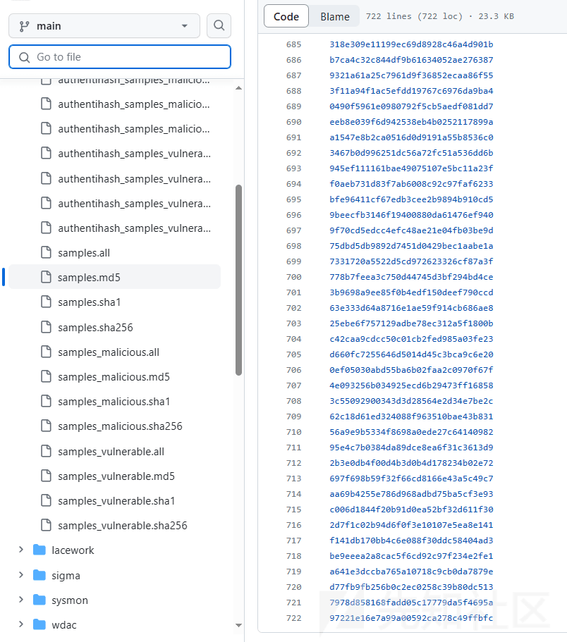
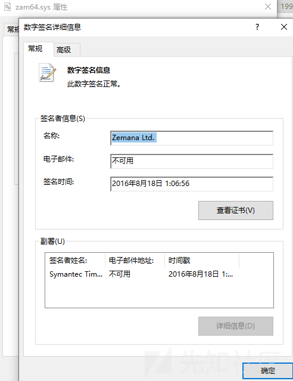
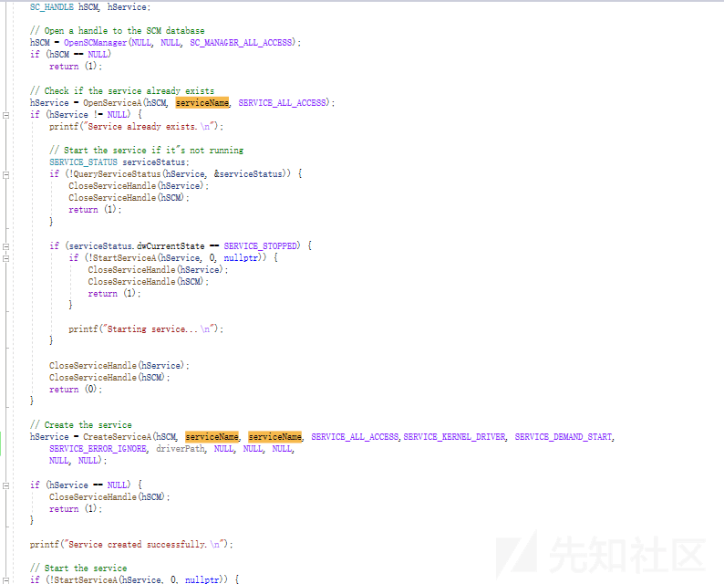
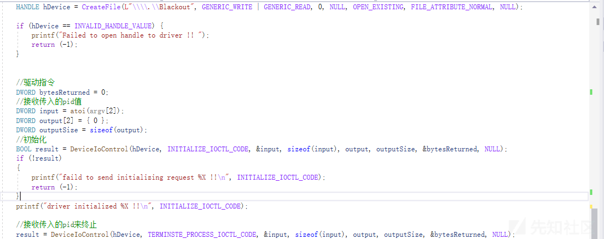

# BYOVD ATTACK 学习 - 先知社区

BYOVD ATTACK 学习

**BYOVD 技术利用**  
BYOVD 技术全程为 Bring Your own vulnerable drier  
将存在漏洞的合法驱动投递到目标借助滥用的合法驱动签名，攻击者可以绕过 DSE(强制驱动签名) 的限制 (测试模式下可以安装未签名的驱动但是实战的时候不存在这种情况) 在 Ring0 完成攻击操作，这类攻击最初是被 Turl 和方程式这类顶级 APT 使用。

LOLDrivers 当中记录了滥用的驱动有 700+ 这里还是公开的没公开的合法驱动还是未知数  

**BYOVD ATTACK Kill AV/EDR 分析**  
加载驱动 Kill AV 的原理分析

  
zam64.sys 驱动文件 Terminator 项目  
这驱动文件存 IOCTL 函数 (驱动和程序进行通讯的操作系统 API 用来控制驱动)  
zam64.sys 当中有这两个 IOCTL 函数可以用来 Kill 驱动  
IOCTL 0x80002048（可以打开任何特权进程的句柄）  
IOCTL 0x80002010（可以在驱动程序中调用函数）

加载一个驱动程序->win API 打开 SCM 创建一个服务然后启动该服务 (服务名 Terminator)-> 注册当前进程为受信任进程->checkprocess 匹配进程 KILL EDR->循环这些操作

项目链接  
[https://github.com/ZeroMemoryEx/Terminator](https://github.com/ZeroMemoryEx/Terminator)

**BYOVD ATTACK Kill AV/EDR实现过程**  
这里我用到是 Gmer64.sys 驱动程序  
用到的 IOCTL 参数  
IOCTL 0x9876C004  
IOCTL 0x9876C094

  
这 OpneScManager 获取 scm 数据的句柄允许和程序进程交互。  
OpenServiceA 打开存在的服务存在就返回句柄不存在返回 NULL  
检测 hService 是否为 NUL 来判断服务是否存在，再检测当前状态。 
服务不存在的话通过 CreateServiceA 来创建一个服务 (服务名自定义)  
服务创建完成后通过 StartServiceA 启动刚刚创建的服务

  
CreateFile 创建表访问 Killav 标志对该句柄有读写访问权限  
然后通过 DeviceIoControl 操控驱动发送 IOCTL 0x9876C004(应该是完成初始化操作)  
最后通过第二个 DeviceIoControl 发送 IOCTL 0x9876C094 指令来 kill 指定的进程

这里是 Gmer64.sys 驱动分析的过程  
[https://www.binarydefense.com/resources/blog/threadsleeper-suspending-threads-via-gmer64-driver/](https://www.binarydefense.com/resources/blog/threadsleeper-suspending-threads-via-gmer64-driver/)

**总结**  
这类加载驱动干掉 AV 还是可以的，但是干掉 EDR 他的总控一眼就能发现问题，在实战环境当中还是要和 EDR 共存，BYOVD 还能删除回调函数达到致盲效果，关闭/开启 PPL 保护，开启/关闭强制签名校验等多种高级利用技巧。
