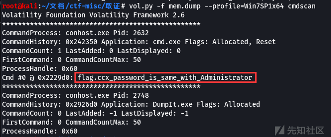
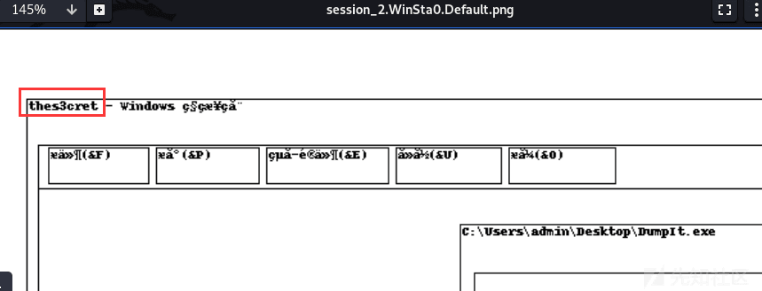

# CTF-Misc 取证学习初探 - 先知社区

CTF-Misc 取证学习初探

- - -

## Volatility

首先照着网上的步骤安装

取证文件后缀： .raw、.vmem、.img

命令格式：

```plain
vol.py -f [image] --profile=[profile] [plugin]
```

[](https://xzfile.aliyuncs.com/media/upload/picture/20240202155904-ef5d2978-c1a0-1.png)  
可以使用`--info`参数来查看 volatiliity 已经添加的 profile 和插件等信息  
[](https://xzfile.aliyuncs.com/media/upload/picture/20240202155916-f6472aae-c1a0-1.png)  
volatility 中比较常用的插件：

| 插件名 | 作用  |
| --- | --- |
| pslist | 列出系统进程 |
| hashdump | 查看用户和密码信息 |
| svcscan | 查看服务 |
| iehistory | 查看浏览器历史记录 |
| netscan | 查看网络连接 |
| cmdscan | 查看命令行操作 |
| filescan | 查看文件 |
| dumpfiles | 查看文件内容 |
| notepad | 查看当前展示的 notepad 内容 |
| memdump | 提取进程 |
| screenshot | 屏幕截图 |
| hivelist | 查看注册表注册单元 |
| hivedump | 查看注册表键名 |
| printkey | 查看注册表键值 |
| userassist | 查看运行程序相关记录 |
| timeliner | 最大程序提取信息 |
| clipboard | 获取复制剪切的内容 |

## 刷题

### \[RCTF2019\]disk

> hint：  
> An otaku used VeraCrypt to encrypt his favorites.  
> Password: rctf  
> Flag format: rctf{a-zA-Z0-9\_}

下载压缩包，使用 010 打开`encrypt.vmdk`，搜索 rctf 发现前半段的 flag  
[](https://xzfile.aliyuncs.com/media/upload/picture/20240202155944-06ddc472-c1a1-1.png)  
`rctf{unseCure_quick_form4t_vo1ume`  
遇到 vmdk 可以试试使用 7z 这个压缩软件打开，果然发现了 0.fat  
[](https://xzfile.aliyuncs.com/media/upload/picture/20240202155953-0c5be870-c1a1-1.png)  
使用 VeraCrypt 尝试挂载这个文件系统，密码为 rctf，发现一个图片和一个密码  
[](https://xzfile.aliyuncs.com/media/upload/picture/20240202160000-10becf40-c1a1-1.png)  
打开得到 password.txt

> Password 2: RCTF2019  
> You're late... So sad

这里学习到**在挂载的时候，不同的密码可以进入不同的文件系统**，那么我们换一个密码重新挂载，发现显示是隐藏分区，无法直接访问  
[](https://xzfile.aliyuncs.com/media/upload/picture/20240202160017-1a62e590-c1a1-1.png)  
直接使用 winhex 打开，存在报错，但不用管  
[](https://xzfile.aliyuncs.com/media/upload/picture/20240202160026-1fd9dc9a-c1a1-1.png)  
随便找一下就发现后半段 flag 了，`_and_corrupted_1nner_v0lume}`

### \[PCTF2016\]内存取证

解压压缩包得到两个文件  
[](https://xzfile.aliyuncs.com/media/upload/picture/20240202160038-26f3630c-c1a1-1.png)  
首先查看 mem.vmem 的系统版本信息  
[](https://xzfile.aliyuncs.com/media/upload/picture/20240202160049-2d7f9aa6-c1a1-1.png)  
一般是第一个即`WinXPSP2x86`，查看一下进程，发现存在`TrueCrypt.exe`，磁盘加密工具  
[](https://xzfile.aliyuncs.com/media/upload/picture/20240202160058-32b9ffac-c1a1-1.png)  
由此推断`suspicion`可能是被加密之后的文件

```plain
vol.py -f mem.vmem --profile=WinXPSP2x86 memdump -p 2012 -D outfile/
```

> \-p 为要提取进程的 PID  
> \-D 将提取的进程保存的路径

[](https://xzfile.aliyuncs.com/media/upload/picture/20240202160108-3904a09c-c1a1-1.png)  
由于是磁盘加密，那么它对应的 Key 应该会出现在内存中，于是我们将这个进程提取出来  
使用`Elcomsoft Forensic Disk Decryptor`软件对加密文件进行解密，这个 Key 我们需要在提取进程的文件中获取  
[](https://xzfile.aliyuncs.com/media/upload/picture/20240202160116-3dcfd4c0-c1a1-1.png)  
最后挂载即可获得 flag  
[](https://xzfile.aliyuncs.com/media/upload/picture/20240202160127-444b7a02-c1a1-1.png)

### \[V&N2020 公开赛\]内存取证

> hint：记事本

拿到文件首先就获取系统信息  
[](https://xzfile.aliyuncs.com/media/upload/picture/20240202160142-4d5e674e-c1a1-1.png)  
发现为`Win7SP1x86_23418`，获取一下进程信息

```plain
vol.py -f mem.raw --profile=Win7SP1x86_23418 pslist > 1.txt
```

[](https://xzfile.aliyuncs.com/media/upload/picture/20240202160150-524179ae-c1a1-1.png)  
发现

> notepad.exe pid 3552(记事本)  
> TrueCrypt.exe pid 3364(磁盘加密工具)  
> mspaint.exe pid 2648(画图工具)

首先 dump notepad.exe 进程，

```plain
vol.py -f mem.raw --profile=Win7SP1x86_23418 memdump -p 3552 -D outfile/
```

使用 010 看一下，发现存在百度网盘链接，这里也可以使用取证大师直接恢复文件得到提取码：`heem`  
[](https://xzfile.aliyuncs.com/media/upload/picture/20240202160209-5d0c11d2-c1a1-1.png)  
然后找到另一个百度网盘链接，下载后是个文件名为 VOL 的文件，就是 buu 上的附件  
再分析一下 mspaint

```plain
vol.py -f mem.raw --profile=Win7SP1x86_23418 memdump -p 2648 -D outfile/
```

参考：[【CTF】利用 volatility 与 Gimp 实现 Windows 内存取证](https://segmentfault.com/a/1190000018813033)  
先安装 gimp，重命名为.data，用 gimp 打开  
[](https://xzfile.aliyuncs.com/media/upload/picture/20240202160217-61f5087a-c1a1-1.png)  
通过不断移动，把图片翻转一下，得到密码：`1YxfCQ6goYBD6Q`  
最后就是常见的考点：TrueCrypt 了

```plain
vol.py -f mem.raw --profile=Win7SP1x86_23418 memdump -p 3364 -D outfile/
```

然后进行解密  
[](https://xzfile.aliyuncs.com/media/upload/picture/20240202160225-66c0620a-c1a1-1.png)  
得到 key：`uOjFdKu1jsbWI8N51jsbWI8N5`，使用 VeraCrypt 对 VOL 进行挂载  
[](https://xzfile.aliyuncs.com/media/upload/picture/20240202160232-6ad63f2c-c1a1-1.png)  
使用画图得到的密码进行解密，得到 flag  
[](https://xzfile.aliyuncs.com/media/upload/picture/20240202160239-6f0df346-c1a1-1.png)

### \[HDCTF2019\]你能发现什么蛛丝马迹吗

拿到一个镜像文件，直接分析  
[](https://xzfile.aliyuncs.com/media/upload/picture/20240202160247-740cc264-c1a1-1.png)  
猜测镜像版本为 Win2003SP1x86，获取一下 pslist 信息

```plain
vol.py -f memory.img --profile=Win2003SP1x86 pslist
```

[](https://xzfile.aliyuncs.com/media/upload/picture/20240202160254-785136fc-c1a1-1.png)  
发现一个 DumpIt.exe，很明显是最近运行过的，我们导出一下截图

```plain
vol.py -f memory.img --profile=Win2003SP1x86 screenshot -D outfile/
```

发现一个 flag.png  
[](https://xzfile.aliyuncs.com/media/upload/picture/20240202160303-7dbfe19c-c1a1-1.png)  
查看一下最近打开过什么软件

```plain
vol.py -f memory.img --profile=Win2003SP1x86 windows
```

[](https://xzfile.aliyuncs.com/media/upload/picture/20240202160313-8351e100-c1a1-1.png)  
发现使用了 explorer 处理 flag.png，下载一下

```plain
vol.py -f memory.img --profile=Win2003SP1x86 memdump -p 1992 -D outfile/
```

然后使用 foremost 分离，发现两个图片

> 扫码得到密文：jfXvUoypb8p3zvmPks8kJ5Kt0vmEw0xUZyRGOicraY4=  
> key：Th1s\_1s\_K3y00000  
> iv：1234567890123456

直接 aes 解密得到 flag  
[](https://xzfile.aliyuncs.com/media/upload/picture/20240202160321-888cecaa-c1a1-1.png)

### \[BSidesSF2019\]diskimage

给了一个图片，怀疑存在隐写  
[](https://xzfile.aliyuncs.com/media/upload/picture/20240202160358-9e316d56-c1a1-1.png)  
使用 zsteg，发现有磁盘数据  
[](https://xzfile.aliyuncs.com/media/upload/picture/20240202160338-92aec9a6-c1a1-1.png)  
直接提取出来，`zsteg -e 'b8,rgb,lsb,xy' attachment.png > disk`

#### 解法一

使用 FTK 进行挂载，然后用 X-Ways 打开  
[](https://xzfile.aliyuncs.com/media/upload/picture/20240202160411-a614029a-c1a1-1.png)  
发现一个 25.1KB 的文件，恢复出来，然后改后缀名打开，即可得到 flag  
[](https://xzfile.aliyuncs.com/media/upload/picture/20240202160419-aab92b9a-c1a1-1.png)

#### 解法二

用 kali 自带的工具 testdisk 分析导出的镜像  
一路回车按下去，发现存在一个`_LAG.ICO`  
[](https://xzfile.aliyuncs.com/media/upload/picture/20240202160428-b0715274-c1a1-1.png)  
按`c`复制出来，即可得到 flag

### \[2019 安洵杯\]内存取证

首先还是判断镜像的操作系统类型  
[](https://xzfile.aliyuncs.com/media/upload/picture/20240202160440-b7869e48-c1a1-1.png)

```plain
vol.py -f mem.dump --profile=Win7SP1x64 pslist
```

[](https://xzfile.aliyuncs.com/media/upload/picture/20240202160448-bc5f129c-c1a1-1.png)

发现运行了 CnCrypt 程序和 cmd.exe，获取一下命令行操作

```plain
vol.py -f mem.dump --profile=Win7SP1x64 cmdscan
```

[](https://xzfile.aliyuncs.com/media/upload/picture/20240202160457-c18f6532-c1a1-1.png)  
发现一个 flag.ccx，并且 flag.ccx 文件的密码和 Administrator 的密码一致，我们找一下这个文件

```plain
vol.py -f mem.dump --profile=Win7SP1x64 filescan | grep flag.ccx
```

[](https://xzfile.aliyuncs.com/media/upload/picture/20240202160506-c6baf06c-c1a1-1.png)  
那么我们尝试 dump 这个文件，文件地址：`0x000000003e435890`

```plain
vol.py -f mem.dump --profile=Win7SP1x64 dumpfiles -Q 0x000000003e435890 -D outfile/
```

接下来获取管理员账号密码

```plain
vol.py -f mem.dump --profile=Win7SP1x64 mimikatz
```

[](https://xzfile.aliyuncs.com/media/upload/picture/20240202160514-cbc89bc2-c1a1-1.png)  
发现密码为`ABCabc123`，最后使用 Cncrypt 对 flag.ccx 进行解密，得到 flag  
[](https://xzfile.aliyuncs.com/media/upload/picture/20240202160521-cf837aca-c1a1-1.png)

### \[DASCTF2022.07 赋能赛\]ez\_forenisc

比赛的时候搞了半天没搞出来，看 wp 发现需要挂载磁盘再进行解密。。。。。复现一下  
`vol.py -f pc.raw --profile=Win7SP1x64 pslist`  
[](https://xzfile.aliyuncs.com/media/upload/picture/20240202160531-d5de8f7c-c1a1-1.png)  
存在 cmd.exe，读取一下内容  
[](https://xzfile.aliyuncs.com/media/upload/picture/20240202160538-d9f87172-c1a1-1.png)  
发现 screenshot 存在一些东西，那么获取截图  
`vol.py -f pc.raw --profile=Win7SP1x64 screenshot -D ./outfile`  
[](https://xzfile.aliyuncs.com/media/upload/picture/20240202160546-de95dfa8-c1a1-1.png)  
发现 thes3cret，获取到这个文件

```plain
vol.py -f pc.raw --profile=Win7SP1x64 filescan | grep thes3cret
vol.py -f pc.raw --profile=Win7SP1x64 dumpfiles -Q 0x000000003eeb4650 -D ./outfile
```

[](https://xzfile.aliyuncs.com/media/upload/picture/20240202160554-e39799f6-c1a1-1.png)  
发现为 AES 加密：  
`U2FsdGVkX1+43wNkY0XcPnFYLr+rHqeD9aQzNtLtEb8y15V20J0DyoOOE+lEr+NmwsoH+0q6DljkvVL9ggc3rw==`

接下来使用 FTK 挂载磁盘，然后使用 EFDD 进行磁盘解密  
[](https://xzfile.aliyuncs.com/media/upload/picture/20240202160602-e7f2f8b0-c1a1-1.png)  
然后 memory dump 选择内存文件  
[](https://xzfile.aliyuncs.com/media/upload/picture/20240202160608-ebd0516c-c1a1-1.png)  
解密成功后发现一个 cipher.zip 和 flag.txt  
[](https://xzfile.aliyuncs.com/media/upload/picture/20240202160615-f03e677a-c1a1-1.png)  
发现 cipher.png 存在 LSB 隐写，提取一下，存在密码，发现是计算机密码  
[](https://xzfile.aliyuncs.com/media/upload/picture/20240202160622-f461289c-c1a1-1.png)  
`vol.py -f pc.raw --profile=Win7SP1x64 mimikatz`  
[](https://xzfile.aliyuncs.com/media/upload/picture/20240202160630-f93434fe-c1a1-1.png)  
得到密码：`550f37c7748e`，发现 key.txt 内容为：

```plain
164 150 145 40 153 145 171 40 151 163 40 63 65 70 144 141 145 142 145 146 60 142 67 144
```

[](https://xzfile.aliyuncs.com/media/upload/picture/20240202160639-fe4c627c-c1a1-1.png)  
得到`358daebef0b7d`，最后 AES 解密即可得到 flag  
[](https://xzfile.aliyuncs.com/media/upload/picture/20240202160646-0295715c-c1a2-1.png)
