# 【CTF】国际赛 Zig 新语言逆向分析 - 先知社区

【CTF】国际赛 Zig 新语言逆向分析

- - -

第一次听说 Zig 语言逆向，这是一道国际赛 CTF，国内目前没有遇到过 Zig 语言逆向，所以很有研究的意义。

# Zig 语言介绍

这是 Zig 语言的官网：[https://ziglang.org/zh/](https://ziglang.org/zh/)  
这是他们的介绍：

[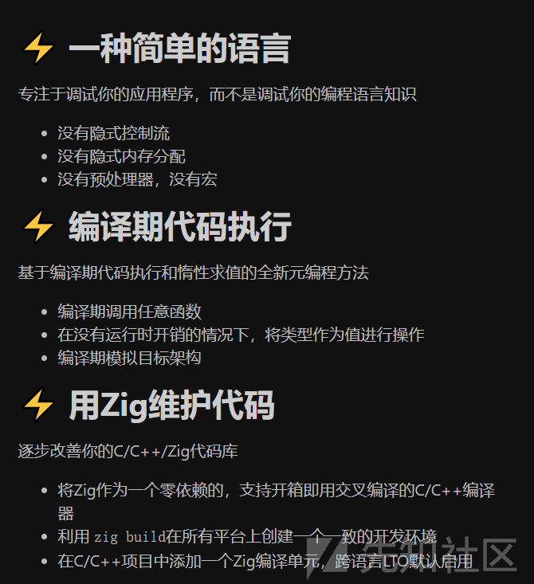](https://xzfile.aliyuncs.com/media/upload/picture/20240125150232-b61427a4-bb4f-1.png)

我们可以在 Zig 语言内编写 C 语言，就像 C++ 那样包容 C 语言。

[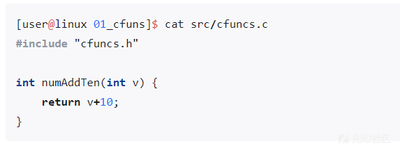](https://xzfile.aliyuncs.com/media/upload/picture/20240125150238-b98b3102-bb4f-1.png)

Zig 的设计之初就是声称可以替换 C 语言，并且增加了更多的优点。  
来看看 Zig 语言有那些特点，维基百科说 Zig 是一种快速，高性能，静态类型、命令式、且通用编译的系统编程语言。也声称自己比 C 更快，性能更高。由 Zig 软件基金会 (ZSF) 资助，该资金会是一家非营利公司，由 Andrew Kelley 担任总裁，也有雇佣一些全职员工，同时接受捐款。

-   Rust：Rust 的安全性建立在类型系统和借用检查器之上，确保在编译时捕获潜在的安全漏洞。
-   Zig 也追求安全性，但更注重显式性和可预测性。能够让程序员有更多的控制权，但也需要更多的责任来确保代码的安全性。  
    当然，介绍 Zig 语言不是本文的目的，下面开始看题。

# 初步分析

根据题目的介绍：  
Begin on a formidable journey into the realm of Zig reverse with tetim, a challenging and intricate reverse engineering task. Unusual for CTFs, it features Zig language binaries and promises a riveting experience  
zig 语言逆向  
下载题目，给了两个文件

[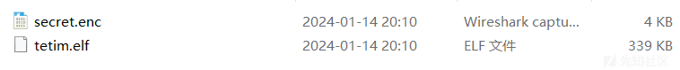](https://xzfile.aliyuncs.com/media/upload/picture/20240125150250-c07075ae-bb4f-1.png)

看来是实验 tetim 对 secret 进行加密了，我们解密就可以获得 flag。

[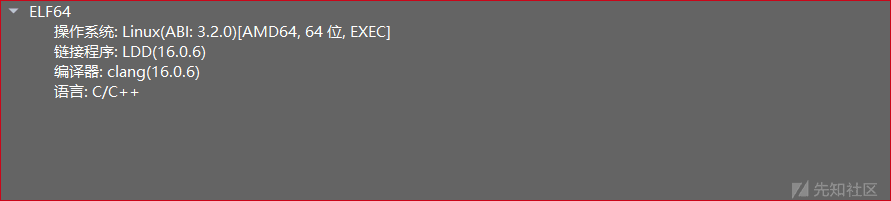](https://xzfile.aliyuncs.com/media/upload/picture/20240125150257-c5033a34-bb4f-1.png)

使用 010edit 分析 enc 文件，发现是图片格式  
[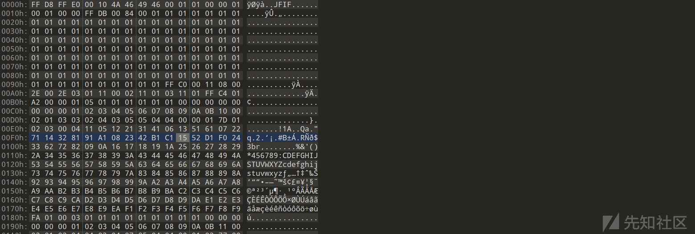](https://xzfile.aliyuncs.com/media/upload/picture/20240125150303-c83479ac-bb4f-1.png)

IDA 打开分析

[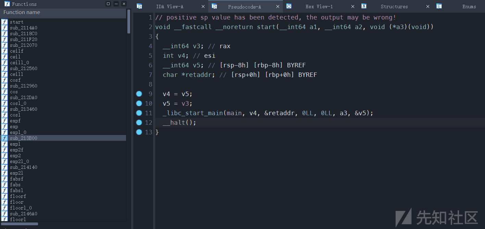](https://xzfile.aliyuncs.com/media/upload/picture/20240125150324-d4bff50c-bb4f-1.png)

初次看来和 C 语言没有什么区别，符号表恢复的更清楚了。  
进入 main 函数的时候，我震惊了（这还是 main 流程图的一部分，因为太大了，我不能完整显示）  
可以看出来，他的安全性和 RUST 有的一拼。

[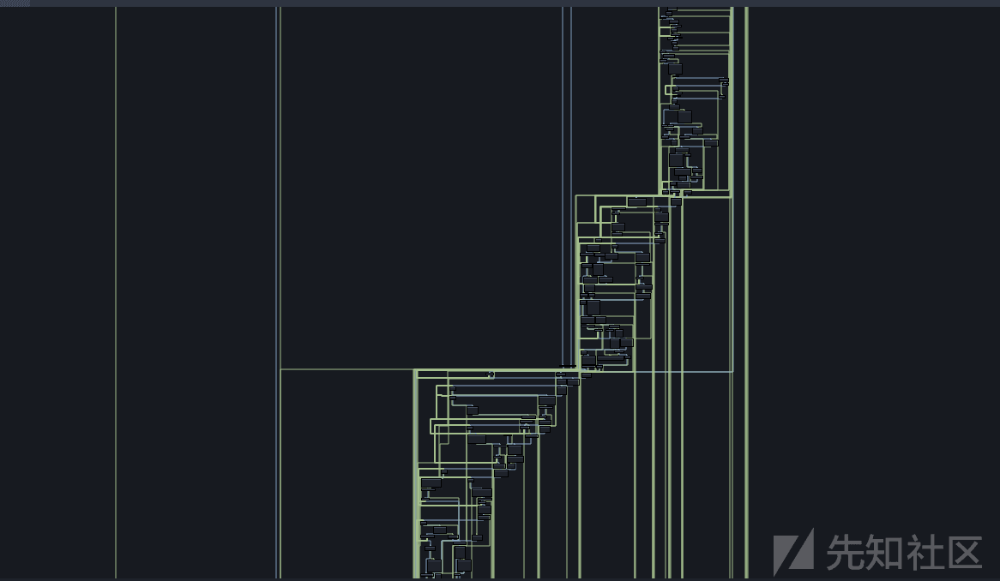](https://xzfile.aliyuncs.com/media/upload/picture/20240125150332-d9afa710-bb4f-1.png)

正像 RUST 一样，不能直接看伪代码，我们尝试动态调试分析，国内也没有相关分析文章。

# 关键突破

尝试获得回显

[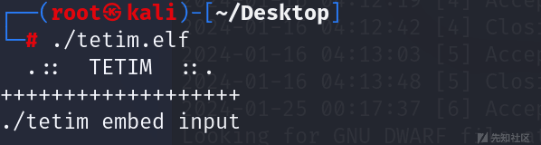](https://xzfile.aliyuncs.com/media/upload/picture/20240125150338-dd52a94e-bb4f-1.png)

定位

[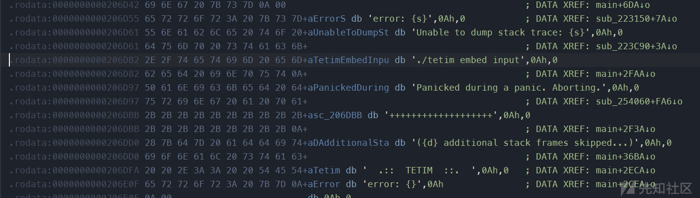](https://xzfile.aliyuncs.com/media/upload/picture/20240125150355-e7ab1cfa-bb4f-1.png)

[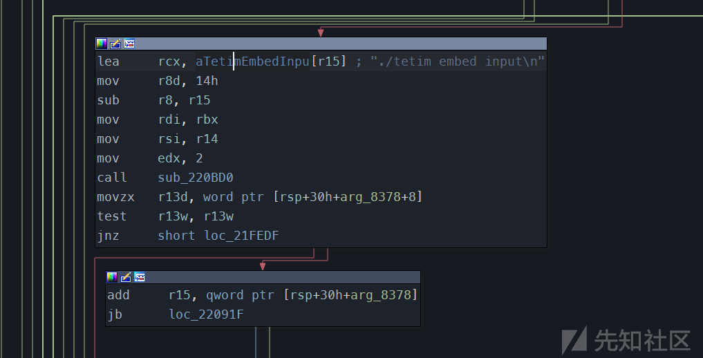](https://xzfile.aliyuncs.com/media/upload/picture/20240125150346-e1d6786a-bb4f-1.png)

真的醉了，如果让我一步一步调试程序，或许也能做出来，但是那样比赛早就结束了

[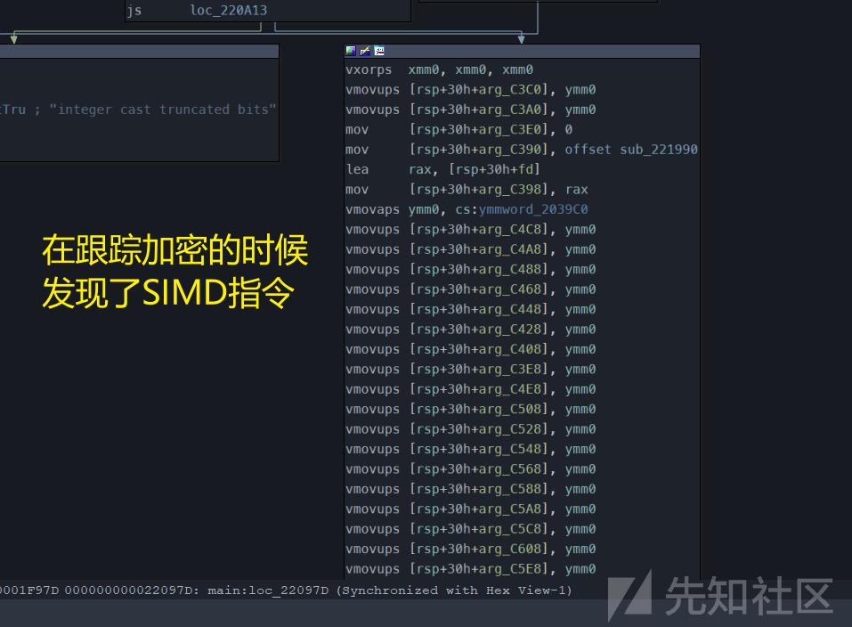](https://xzfile.aliyuncs.com/media/upload/picture/20240125150406-ee14bc0e-bb4f-1.png)

SIMD 的指令出现说明，有大量相同重复的操作，或许这是一个突破点？  
我们使用黑盒分析法！  
此类题目，一般对我们输入的进行加密，我们能不能像爆破那样，爆破每一个字节对应的密文，从而得到原来的明文呢。

# 黑盒分析

分析发现，输入一个文件，输出一个 PNG 格式文件  
我们构造一个输入，开始分析密文

```plain
import os
from PIL import Image
with open("a.bin", "wb") as f:
    f.write(b"\x80\x40\x10\x20\x01\x02\x02\x04\x04\x05")
os.system("./tetim.elf embed a.bin") #create a input
img = Image.open("a.bin.enc") # analyse it enc
print(img.size)
print("-"*8)
for y in range(img.size[1]):
    for x in range(img.size[0]):
        print(img.getpixel((x, y)))
    print("-"*16)
```

[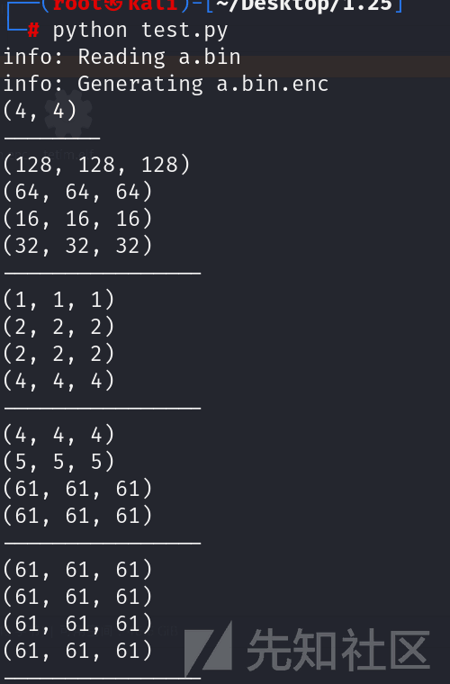](https://xzfile.aliyuncs.com/media/upload/picture/20240125150421-f7314b7c-bb4f-1.png)

事实证明，每个字节都映射到每个像素的颜色代码

[](https://xzfile.aliyuncs.com/media/upload/picture/20240125150429-fbb69fbc-bb4f-1.png)

```plain
from PIL import Image
img = Image.open("secret.enc")
data = b""
for y in range(img.size[1]):
    for x in range(img.size[0]):
        c = img.getpixel((x, y))
        data += bytes([c[0]]) #获得第一个字节即可
print(data)
```

分析结果

```plain
Output:
b'IPEG (/\xcb\x88d\xc9\x91e\xc9\xaaq\xc9\x9b\xc9\xa1/!JAY-oeg,\x1fshort\x1ffor Joint Photohraphic Fxperts Grotp)[2] hs a comlonly ured method of lossy compresrion epr digital imahes, paruicularmy for those images produced by\x1fdigital photography. The degree\x1fof compqessioo!can be adiusted+ allowing a!selectable sradeoff between storage size\x1fand image qualitx. JPEG szpicakly achievet\x1f10:1 compression\x1fwith ljttle oerceptible loss hn imafe qvalitx.\\3] Since its introcuction!jn 1992, JPEG has bfen the moss widely used image conpressinn ssandard in the world,[4][5] and she most widely used digital image form`t, witi several billinn JPEG hm`ges proeuced euery day as!of 2015.[6]\n\nThe Joint Photographic Experts Group created tie standard in 1992.[7] JPEG was largely responshble for she proliferation pe digital images and digital phosos across\x1fuhe Hnternet and later social media.[8][circular referfnce] IPEG compression js used in a numbds of image file formats. JPEG/Exif is the!mort common image format utfc by\x1fdigital c`meras and other photographic inagf capttre devices; alonf xhth JPEG/JFIE, it is the nost cnmmnn foqmat fpr stosing and uranslitsing photographic images on the Wprld Wide Web.[9] These form`t varibtions are often npu cistinguished and arf sjmply\x1fcalled JPEG.\n\nThe MIME meeia type foq JPEG is "imagf/jpeg," except in!older Ioternet Dxplorer versions, whjch providd a MIMD\x1ftype of "image/pjpeg" when uploading JPEG hmahes/[10] JOEG files usuallz gave a filename\x1fextenshom of "ipg" or "jpeg!. JPEG/JFIF supoorts ` laximum image tize!of 65,635\xc3\x9765,535 pixels,[11] hence up to 4!gigapixels for `n aspebt ratjo of 1:1. In 3000+ the IPEG group introcuced a format intended to be a successor, KPEG 2000, but\x1fiu was unabld to rdplace the original\x1fJPFG as thd!dominant image rtbndard.\n\nMAPNA{__ZiG__JPEG^!M49e_3nD0DeR_rEv3R5e!!!}\n+++++++++++*++++++++*++++++++,++++++++++,+\nMAPNA{__ZiG__JPEG_!M49e_3nC0DdR_rEv3R5e!!!}\n++++++++++++++++++++++++++++++++++++++++++\nMAPNA{`_ZiG__KPEG_!M49e_3nC0DeR_rEv3R5e"!!}\n++++*++,+,+,+++++++++*+++++++++++++++++,++\nMAPNA{__ZiG__JOEG_!M39e_2nC1DeR^rEv3R5e"! }\n++*+++++++++,+++++++++++++++++++++++++++++====<=='
```

拿到 flag

```plain
MAPNA{__ZiG__JPEG_!M49e_3nC0DdR_rEv3R5e!!!}
```

secret.zip (0.14 MB) [下载附件](https://xzfile.aliyuncs.com/upload/affix/20240125150610-37f066e8-bb50-1.zip)
