# CVE-2022-21972 和 CVE-2022-23270 漏洞分析 - 先知社区

CVE-2022-21972 和 CVE-2022-23270 漏洞分析

- - -

## **前言介绍**：

这两个漏洞都是出现在 raspptp.sys 驱动中的，为了理解这两个漏洞，我们必须首先了解内核驱动程序与套接字交互以实现网络功能的一些基础知识。（这两类漏洞都是属于条件竞争漏洞且 gitub 有利用的脚本但是条件竞争类漏洞成功率的因素负责，所以此处只分析成因和利用思路）  
Winsock Kernel (WSK) 是 Windows socket API 的名称，驱动程序可以使用它直接从内核创建和使用 socket  
如图展示了 WSK 的体系结构，其结构的核心是 WSK 子系统也就是 WSK subsystem。WSK 子系统是实现 WSK NPI(网络编程接口) 的提供程序端的网络模块。

[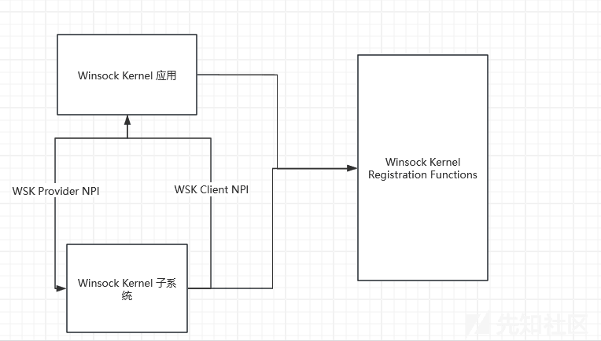](https://xzfile.aliyuncs.com/media/upload/picture/20240201143628-3ae1f80e-c0cc-1.png)  
附加到 WSK 子系统的是 WSK 应用程序；而 WSK 的应用程序是内核模式软件模块；用于实现 WSK NPI 的客户端来去执行网络 I/O 操作的。WSK 子系统可以调用 WSK 客户端 NPI 中的函数以向 WSK 应用程序通知异步事件。WSK 应用程序使用一组 WSK 注册函数发现并附加到 WSK 子系统。应用程序可以使用这些函数动态检测 WSK 子系统何时可用，并交换构成 WSK NPI 的提供程序和客户端实现的调度表。  
其中 WSK NPI 主要围绕了两种 main 对象类型设计：客户端和 socket。客户端对象由 WSK\_CLIENT 结构表示；  
WSK\_CLIENT 数据类型定义 WSK 子系统的绑定上下文，以便将其附加到 WSK 应用程序。  
而 socket 对象表示可用于网络 I/O 的网络套接字，socket 对象由 WSK\_SOCKET 结构表示；WSK\_SOCKET 结构为套接字定义套接字对象。

```plain
typedef struct _WSK_SOCKET {
  const VOID *Dispatch;
} WSK_SOCKET, *PWSK_SOCKET;
```

其中的 dispatch 是执向调度结构的指针；微软给出了其表结构这样能更好的了解 socket 对象的创建流程。

[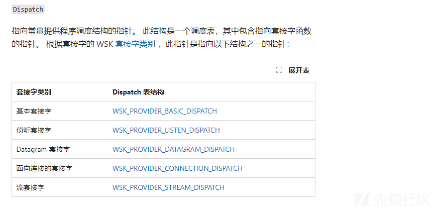](https://xzfile.aliyuncs.com/media/upload/picture/20240201143729-5f2ac704-c0cc-1.png)

WSK API 的方式是通过一组事件驱动的回调函数。当建立了 socket 之后，应用程序就可以提供一个调度表，其中包含一组函数指针也就是上述中的 dispatch，以便为套接字相关的事件调用。为了使应用程序能够通过这些回调来维护自己的状态，驱动程序还为每个回调提供了一个上下文结构，以便可以在连接的整个生命周期中跟踪其状态。

## **CVE-2022-21972 漏洞成因**

在分析漏洞之前还需要了解一下 raspptp.sys 驱动是怎样使用 WSK 实现 pptp 协议；  
pptp 协议指定两个 socket 连接用于管理 VPN 连接的 TCP-socket 和用于发送和接收 VPN 数据的 GRE-socket。  
首先监听的套接字由 raspptp.sys 中的 WskOpenSocket 函数创建。该函数传递一个（此处相关联的信息我们在上述也有介绍过）WSK\_CLIENT\_LISTEN\_DISPATCH 调度表，其中 WskConnAcceptEvent 函数指定为 WskAcceptEven 处理程序。这是处理套接字接受事件的回调函数，也就是新传入的连接。  
当有新客户机连接到服务器时，调用 WskConnAcceptEvent 函数。这个函数为新的客户端套接字分配一个新的上下文结构，并使用指定的所有事件回调函数注册一个 WSK\_CLIENT\_CONNECTION\_DISPATCH 调度表。这些是 WskConnReceiveEvent, wskconndisconnecteevent 和 WskConnSendBacklogEvent 分别用于接收，断开和发送事件。  
一旦接受事件被完全解析，就会调用 WskAcceptCompletion 并触发一个回调 (CtlConnectQueryCallback)，该回调完成 PPTP 控制连接的初始化，并创建一个专门用于跟踪客户端 PPTP 控制连接状态的上下文结构。  
PPTP 控制连接上下文结构由 CtlAlloc 函数分配。

[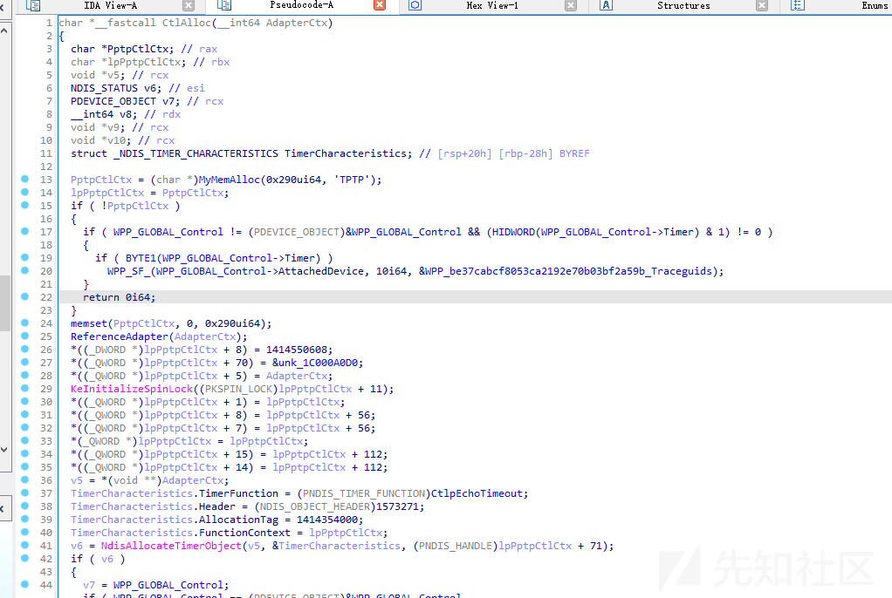](https://xzfile.aliyuncs.com/media/upload/picture/20240201143754-6e2e252a-c0cc-1.png)

在其中我们需要注意一下下述的一些结构 PptpCtlCtx—控制连接的 PPTP 特定上下文结构。CtlReceiveCallback - PPTP 控制连接接收回调。CtlDisconnectCallback - PPTP 控制连接断开回调。CtlConnectQueryCallback - PPTP 控制连接查询回调。  
然后查看一下此漏洞细节是出现在 raspptp.sys 中是一个条件竞争的 UAF 漏洞；这个漏洞很大程度上取决于 socket 对象生命周期是如何被 raspptp 管理的。  
还需要注意一点在 raspptp 中对于 PptpCtlCtx 结构，客户端套接字和 PptpCtlCtx 结构都有一个引用计数。每次创建对任何一个对象的引用时，都会增加这个引用计数。最初设置为 1，当减数为 0 时，通过调用存储在每个结构中的自由回调来释放对象。  
当 raspptp.sys 接收到新数据时，WSK 就会进行处理寻找相应的事件回调调用。raspptp.sys 为所有 socket 注册一个名为 ReceiveData 的通用回调事件。此函数把传入数据转发到客户端 socket 上下文自己的接收数据回调。  
而对于 PPTP 此回调是 CtlReceiveCallback 函数实现的。在其函数下边还有一个 CtlpEngine 函数，其作用是负责解析传入 PPTP 控制数据的状态机。在这段处理过程中会发现其缺少了引用计数或 PptpCtlCtx 对象的锁定。

[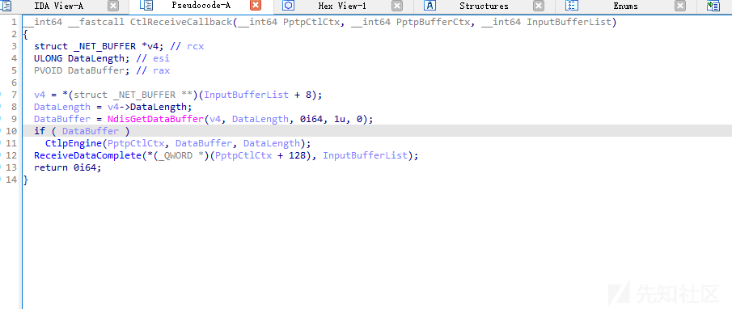](https://xzfile.aliyuncs.com/media/upload/picture/20240201143807-75e7dd7e-c0cc-1.png)

如果对比补丁来看会发现其增加的逻辑可谓不是一星半点不仅加了对于对象的锁定还有引用计数相当于脱胎换骨。

[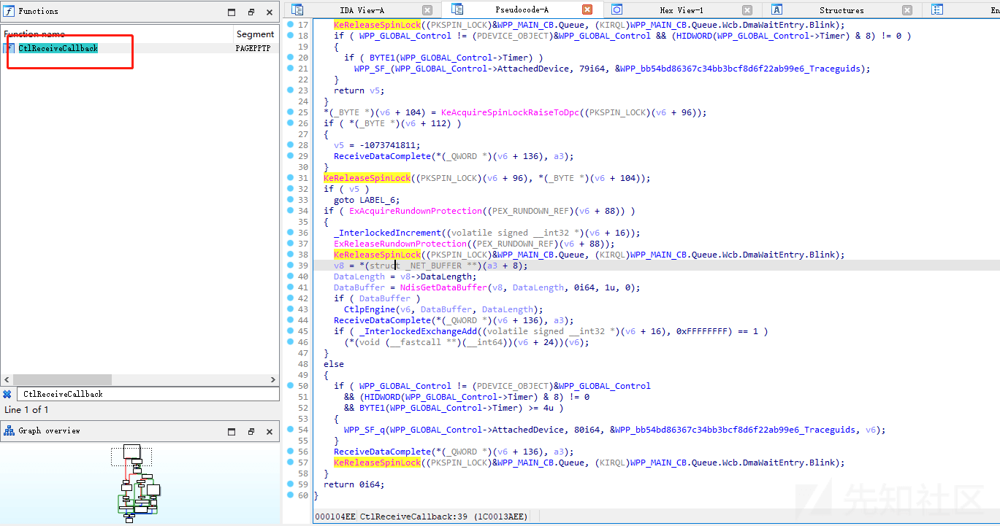](https://xzfile.aliyuncs.com/media/upload/picture/20240201143819-7c97410a-c0cc-1.png)

回过头接着说在回调处理的过程中没有设计到增加 PptpCtlCtx 的引用计数，也没有试图锁定访问以表示它正在使用；这样当我们在任何时候要减少引用计数，此时对象将被释放。但到这里还没结束接着往下看到 CtlpWaitTimeout 函数；其又调用了 CtlpDeathTimeout 函数；而在 CtlpDeathTimeout 函数中又调用了 CtlCleanup 函数其是负责启动断开 PPTP 控制连接过程的函数。

[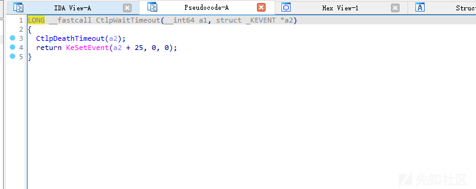](https://xzfile.aliyuncs.com/media/upload/picture/20240201143831-83dd38a2-c0cc-1.png)

[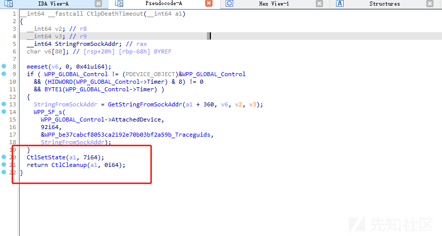](https://xzfile.aliyuncs.com/media/upload/picture/20240201143835-8629ca94-c0cc-1.png)

我们来梳理一下首先将连接的状态设置为 CtlStateUnknown，这样 CtlpEngine 函数将无法处理任何进一步的控制连接数据。（CtlpEngine 函数中正确地使用了引用计数）所以我们要避开它这也是竞争的 trick 点  
然后将任务推送到 raspptp.sys 驱动的后台线程上，以运行类似名称的 CtlpCleanup 函数。这样 CtlpCleanup 函数中的代码逻辑它将始终与 CtlpEngine 函数在不同的线程上运行。因为 CtlpCleanup 函数中的代码逻辑减少了 PptpCtlCtx 对象上的引用计数；这样就能实现自由回调来释放对象了。

[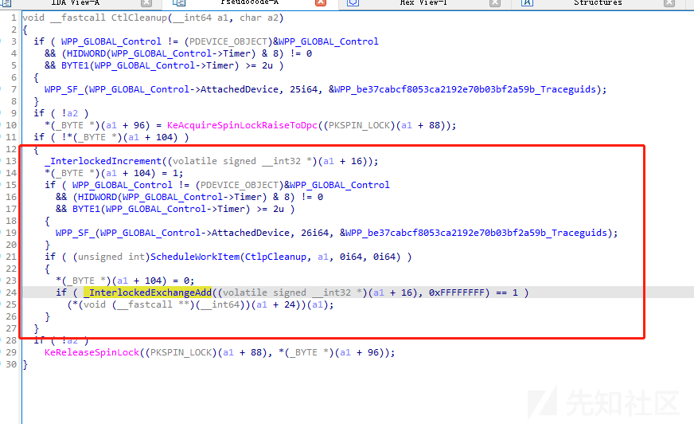](https://xzfile.aliyuncs.com/media/upload/picture/20240201143844-8bf62670-c0cc-1.png)

所以我们就需要让 CtlpCleanup 和 CtlpEngine 函数在单独的线程上同时运行；这样就能造成条件竞争最后触发 UAF 漏洞了。在 CtlFree 函数中用 ExFreePoolWithTag 就去释放 lpCtlCtxToFree。

[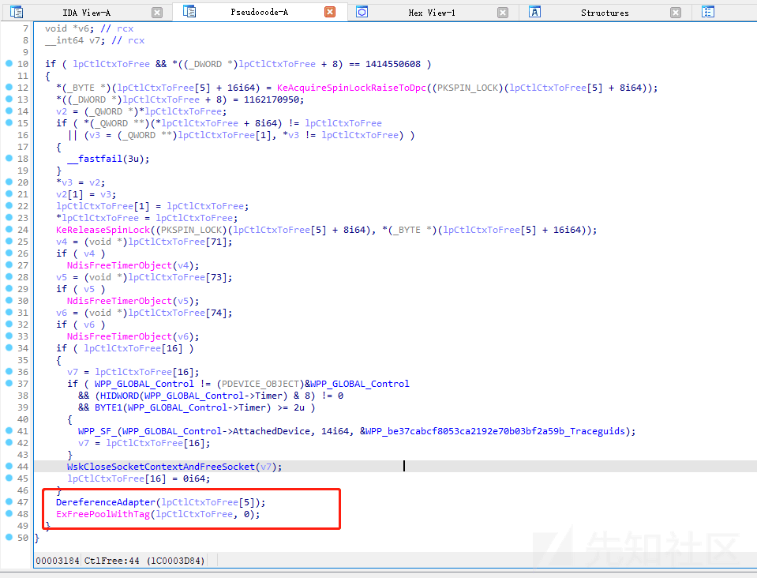](https://xzfile.aliyuncs.com/media/upload/picture/20240201143853-9142249e-c0cc-1.png)

但 WskCloseSocketContextAndFreeSocket 的调用就是在释放 PptpCtlCtx 结构之前关闭客户端套接字；然后  
释放 PptpCtlCtx 结构时，将无法再向套接字发送新数据并触发 CtlpEngine 函数了。  
但是如果当套接字关闭时，数据已经被 CtlpEngine 处理时，我们让线程在函数中停留足够长的时间，以便在 CtlFree 崩溃—UAF。  
所以最后 30 秒超时运行 CtlCleanup，然后将 CtlpCleanup 任务推送到后台工作线程队列。CtlCleanup 后台工作线程唤醒并开始从其任务队列处理 CtlpCleanup 任务。  
当 CtlpCleanup 函数从工作线程中释放基础 PptpCtlCtx 结构时，CtlpEngine 启动或当前正在处理 WSK 调度线程上的数据造成崩溃。

## **CVE-2022-23270 漏洞成因**

趁热打铁我们已经了解了 WSK 还有 rsp 驱动中的部分工作流程，再来看一下 CVE-2022-23270 漏洞  
PPTP 调用可以通过 IncomingCallRequest 或 OutgoingCallRequest 控制消息创建。当这些调用请求中的任何一个由连接的 PPTP 客户端发起时，raspptp.sys 驱动程序就会创建一个调用上下文结构。  
调用上下文结构被设计用于跟踪信息和缓冲调用连接的 GRE 数据；也就是接收 VPN 数据的 GRE-socket。对于此漏洞通过 raspptp 构建对象不是关键点，重要是如何触发。  
处理 PPTP 控制消息有两种方法可以检索调用上下文结构。这两种方法都要求客户机知道调用上下文结构的关联调用 ID。这个 ID 是服务器在对呼入或呼出请求的回复中随机生成的。然后客户机在发送到服务器的与该特定调用相关的所有后续控制消息中使用该 ID。（参考 PPTP RFC ([https://datatracker.ietf.org/doc/html/rfc2637)）](https://datatracker.ietf.org/doc/html/rfc2637)%EF%BC%89)  
调用上下文结构：全局可访问的呼叫 ID 索引数组。PPTP 控制连接上下文存储的链接列表。全局数组可以检索由任何控制连接分配的任何调用，但链表只包含跟它控制连接相关的调用。  
链表访问是由 EnumListEntry 函数实现的其实现了遍历控制连接调用链表的每个成员变量。

[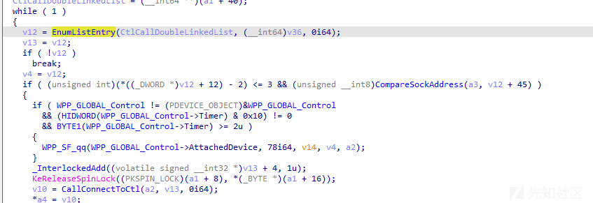](https://xzfile.aliyuncs.com/media/upload/picture/20240201143919-a0d3d5f6-c0cc-1.png)

[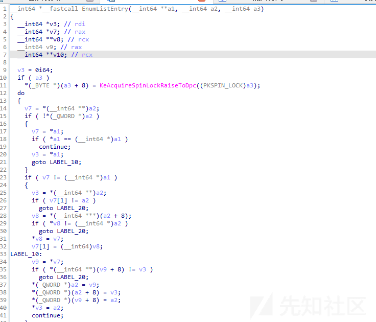](https://xzfile.aliyuncs.com/media/upload/picture/20240201143923-a2ddcff0-c0cc-1.png)

EnumComplete 用于结束当前循环并重置状态；其中有一个 ListIterator 变量是用于存储列表中已到达的当前链表项，以便在下次调用 EnumListEntry 时继续从该点开始继续循环。而 EnumComplete 函数是为了完成后重置 listtiterator 变量。

[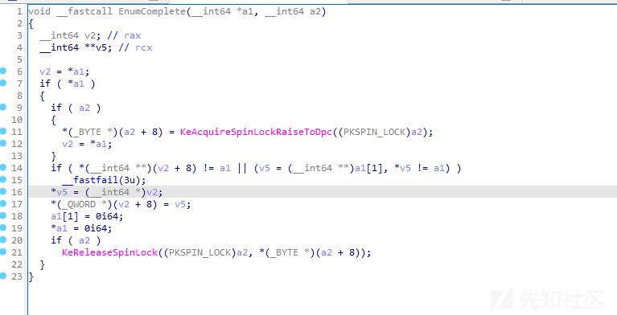](https://xzfile.aliyuncs.com/media/upload/picture/20240201143931-a7ca2978-c0cc-1.png)

全局数组访问是通过 CallGetCall 函数；通过参数可以发现 CallGetCall 根据传入的 Callid 调用 id 去检索调用上下文结构存储在其中的数组；然后返回该条目的结构。

[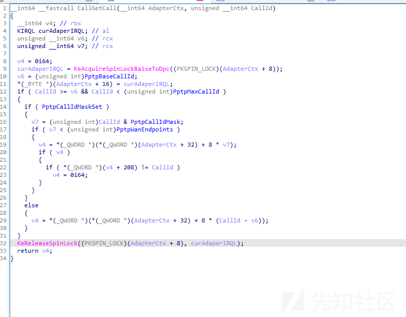](https://xzfile.aliyuncs.com/media/upload/picture/20240201143939-ac435178-c0cc-1.png)

此时我们知道 CallGetCall 函数能够检索由任何当前连接的控制连接分配的任何调用；而且在 raspptp 中有几个控制连接方法是使用 CallGetCall 而不是引用内部控制连接链表的；如果 CallGetCall 函数允许访问其他控制连接调用上下文结构，并且 PPTP 处理过程时可以并发，那么我们可以同时在两个不同的线程中访问相同的调用上下文结构。  
链表访问方法和 CallGetCall 函数都在全局上下文结构上引用了 PptpAdapterSpinLock 变量。  
这是一个全局可访问的 spin lock，用于防止并发访问和全局访问；使用这个锁来保护调用上下文列表访问方法  
但是 要知道 CallGetCall 函数中的锁只有在我们搜索列表时才会上锁，所以一旦调用结构返回它就无了。  
所以这个并不能安全的进行保护；那么利用思路就来了  
当控件连接关闭时，遍历控件连接调用链表，并适当地取消初始化和释放每个调用上下文结构。通过调用函数 CtlpCleanup 执行。然后再去发送带有错误码的 OutgoingCallReply 控制消息；释放与之相关的调用结构。然后此时 CallGetCall 函数用于查找此控制消息处理中的调用上下文结构，此时我们就可以在控制连接关闭例程在单独的线程中运行时使用它来执行释放。如果两者连续发生，调用上下文结构被释放两次，我们就有一个 Use after Free/Double Free 漏洞了。  
在函数 CallEventCallOutReply 中如果设置了 OutgoingCallReply 消息的状态字段，那么代码流程就会走到 CallCleanup 函数的调用中去，这样最终就会走到 CallFree 函数

[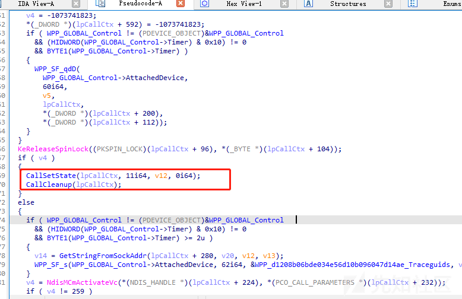](https://xzfile.aliyuncs.com/media/upload/picture/20240201143949-b27b6404-c0cc-1.png)

而在 CallFree 函数中，所有子对象的指针都不会被 raspptp.sys 清空。那么这些对象都可能触发 double free

[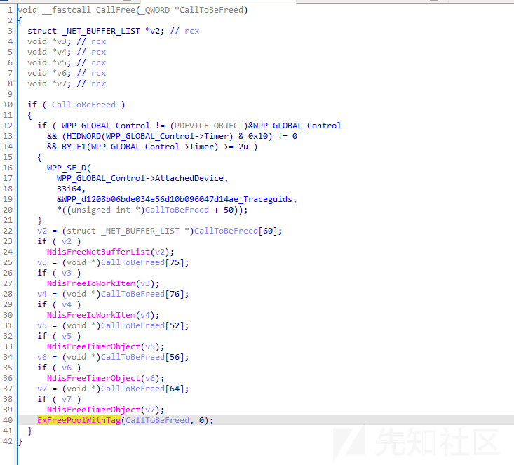](https://xzfile.aliyuncs.com/media/upload/picture/20240201143958-b7be8a18-c0cc-1.png)

惨考：  
[https://labs.nettitude.com/blog/cve-2022-23270-windows-server-vpn-remote-kernel-use-after-free-vulnerability/](https://labs.nettitude.com/blog/cve-2022-23270-windows-server-vpn-remote-kernel-use-after-free-vulnerability/)
